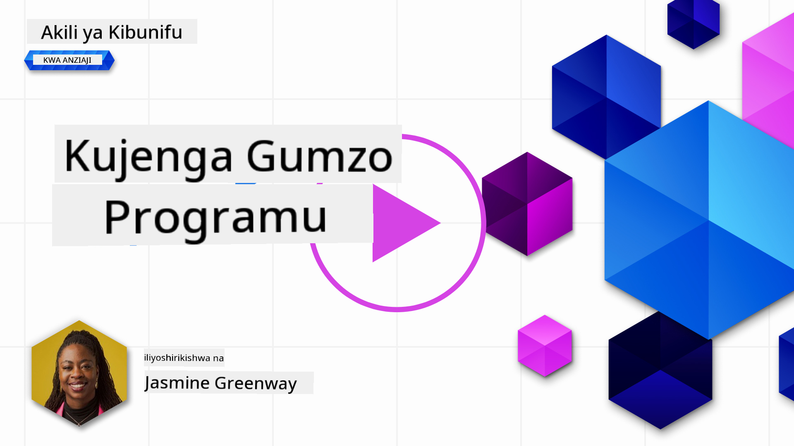
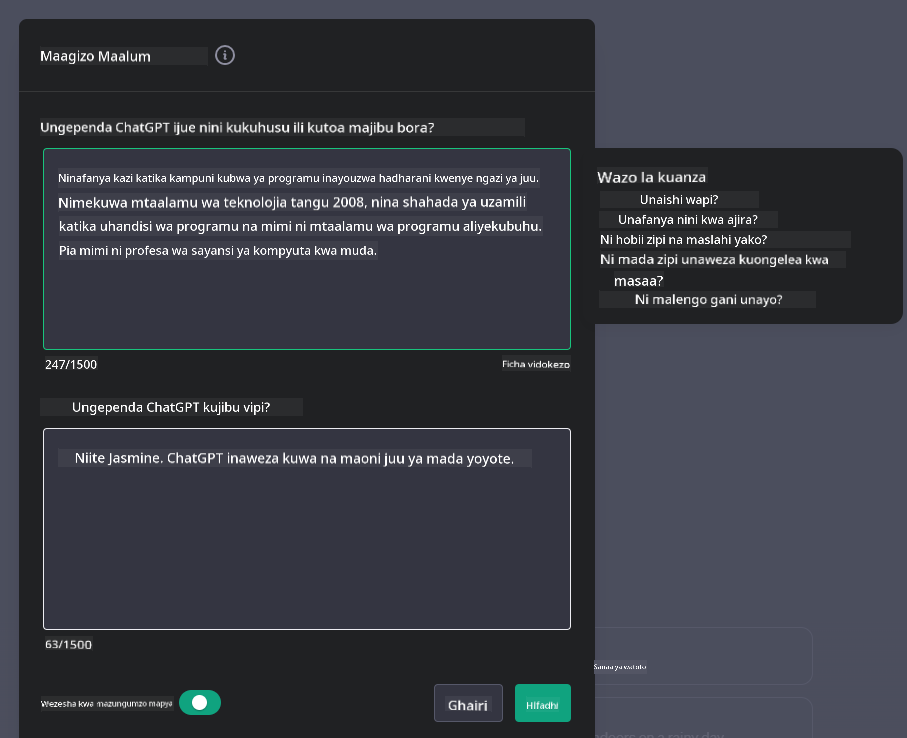

<!--
CO_OP_TRANSLATOR_METADATA:
{
  "original_hash": "ea4bbe640847aafbbba14dae4625e9af",
  "translation_date": "2025-05-19T18:03:38+00:00",
  "source_file": "07-building-chat-applications/README.md",
  "language_code": "sw"
}
-->
# Kujenga Programu za Gumzo Zinazoendeshwa na AI ya Kizazi

[](https://aka.ms/gen-ai-lessons7-gh?WT.mc_id=academic-105485-koreyst)

> _(Bofya picha hapo juu kutazama video ya somo hili)_

Sasa tumeona jinsi tunavyoweza kujenga programu za kizazi cha maandishi, hebu tuangalie programu za gumzo.

Programu za gumzo zimekuwa sehemu ya maisha yetu ya kila siku, zikitoa zaidi ya njia ya mazungumzo ya kawaida. Ni sehemu muhimu za huduma kwa wateja, msaada wa kiufundi, na hata mifumo ya ushauri wa hali ya juu. Ni uwezekano mkubwa kwamba umepata msaada kutoka kwa programu ya gumzo hivi karibuni. Tunapojumuisha teknolojia za hali ya juu kama AI ya kizazi kwenye majukwaa haya, ugumu unaongezeka na changamoto pia zinaongezeka.

Baadhi ya maswali tunayotakiwa kujibu ni:

- **Kujenga programu**. Je, tunajenga na kuunganisha programu hizi zinazoendeshwa na AI kwa ufanisi kwa matumizi maalum?
- **Ufuatiliaji**. Mara tu zinapowekwa, tunawezaje kufuatilia na kuhakikisha kwamba programu zinatoa kiwango cha juu cha ubora, katika suala la utendaji na kufuata [kanuni sita za AI yenye uwajibikaji](https://www.microsoft.com/ai/responsible-ai?WT.mc_id=academic-105485-koreyst)?

Tunaposonga mbele katika zama zinazoelezewa na otomatiki na mwingiliano wa mashine na binadamu bila kikwazo, kuelewa jinsi AI ya kizazi inavyobadilisha upeo, kina, na kubadilika kwa programu za gumzo inakuwa muhimu. Somo hili litachunguza vipengele vya usanifu vinavyounga mkono mifumo hii tata, kuingia katika mbinu za kuifanyia marekebisho kwa kazi maalum za kikoa, na kutathmini vipimo na maoni muhimu ili kuhakikisha uwekaji wa AI yenye uwajibikaji.

## Utangulizi

Somo hili linashughulikia:

- Mbinu za kujenga na kuunganisha programu za gumzo kwa ufanisi.
- Jinsi ya kutumia ubinafsishaji na marekebisho kwa programu.
- Mikakati na maoni ya kufuatilia programu za gumzo kwa ufanisi.

## Malengo ya Kujifunza

Mwisho wa somo hili, utaweza:

- Eleza maoni ya kujenga na kuunganisha programu za gumzo kwenye mifumo iliyopo.
- Kubinafsisha programu za gumzo kwa matumizi maalum.
- Tambua vipimo muhimu na maoni ya kufuatilia na kudumisha ubora wa programu za gumzo zinazoendeshwa na AI.
- Hakikisha programu za gumzo zinatumia AI kwa uwajibikaji.

## Kuunganisha AI ya Kizazi kwenye Programu za Gumzo

Kuboresha programu za gumzo kupitia AI ya kizazi haiko tu kwenye kuzifanya ziwe na akili zaidi; ni kuhusu kuboresha usanifu, utendaji, na kiolesura cha mtumiaji ili kutoa uzoefu bora wa mtumiaji. Hii inahusisha kuchunguza misingi ya usanifu, ujumuishaji wa API, na maoni ya kiolesura cha mtumiaji. Sehemu hii inakusudia kukupa ramani kamili ya kuzunguka mandhari haya magumu, iwe unazijumuisha kwenye mifumo iliyopo au unazijenga kama majukwaa ya pekee.

Mwisho wa sehemu hii, utakuwa na ujuzi unaohitajika kujenga na kuingiza programu za gumzo kwa ufanisi.

### Chatbot au Programu ya Gumzo?

Kabla ya kuingia katika kujenga programu za gumzo, hebu tulinganishe 'chatbots' dhidi ya 'programu za gumzo zinazoendeshwa na AI,' ambazo zinatumika katika majukumu na utendaji tofauti. Kusudi kuu la chatbot ni kuendesha kazi maalum za mazungumzo, kama vile kujibu maswali yanayoulizwa mara kwa mara au kufuatilia kifurushi. Kwa kawaida inaongozwa na mantiki inayotegemea sheria au algorithmu za AI tata. Kwa upande mwingine, programu ya gumzo inayoendeshwa na AI ni mazingira pana zaidi yaliyoundwa kuwezesha aina mbalimbali za mawasiliano ya kidijitali, kama vile maandishi, sauti, na video kati ya watumiaji wa binadamu. Kipengele chake kinachofafanua ni ujumuishaji wa modeli ya AI ya kizazi inayosimulia mazungumzo ya kina, yanayofanana na binadamu, ikitoa majibu kulingana na anuwai ya pembejeo na ishara za muktadha. Programu ya gumzo inayoendeshwa na AI ya kizazi inaweza kushiriki katika mijadala ya kikoa wazi, kubadilika kulingana na muktadha wa mazungumzo yanayobadilika, na hata kutoa mazungumzo ya ubunifu au tata.

Jedwali hapa chini linaonyesha tofauti kuu na kufanana ili kutusaidia kuelewa majukumu yao ya kipekee katika mawasiliano ya kidijitali.

| Chatbot                               | Programu ya Gumzo Zinazoendeshwa na AI ya Kizazi |
| ------------------------------------- | -------------------------------------- |
| Inalenga kazi na inategemea sheria    | Inajua muktadha                        |
| Mara nyingi hujumuishwa katika mifumo mikubwa | Inaweza kuwa na chatbots moja au nyingi |
| Inategemea kazi zilizopangwa          | Inajumuisha modeli za AI ya kizazi     |
| Mwingiliano maalum na uliopangwa      | Ina uwezo wa mijadala ya kikoa wazi    |

### Kutumia Utendaji Uliojengwa Tayari na SDKs na APIs

Unapojenga programu ya gumzo, hatua nzuri ya kwanza ni kutathmini kilichopo tayari. Kutumia SDKs na APIs kujenga programu za gumzo ni mkakati wa faida kwa sababu mbalimbali. Kwa kujumuisha SDKs na APIs zilizoandikwa vizuri, unaweka programu yako kimkakati kwa mafanikio ya muda mrefu, kushughulikia maswala ya upanuzi na matengenezo.

- **Inaharakisha mchakato wa maendeleo na kupunguza gharama**: Kutegemea utendaji uliojengwa tayari badala ya mchakato wa gharama kubwa wa kuujenga mwenyewe hukuruhusu kuzingatia vipengele vingine vya programu yako ambavyo unaweza kuona ni muhimu zaidi, kama vile mantiki ya biashara.
- **Utendaji bora**: Unapojenga utendaji kutoka mwanzo, mwishowe utauliza "Je, inapanuka? Je, programu hii ina uwezo wa kushughulikia ongezeko la ghafla la watumiaji?" SDK na APIs zinazotunzwa vizuri mara nyingi zina suluhisho za ndani kwa maswala haya.
- **Matengenezo rahisi**: Sasisho na maboresho ni rahisi kudhibiti kwani API na SDK nyingi zinahitaji tu sasisho kwa maktaba wakati toleo jipya linatolewa.
- **Ufikiaji wa teknolojia ya kisasa**: Kutumia modeli ambazo zimefanyiwa marekebisho na kufundishwa kwenye seti kubwa za data kunatoa programu yako uwezo wa lugha asilia.

Kufikia utendaji wa SDK au API kwa kawaida kunahusisha kupata ruhusa ya kutumia huduma zinazotolewa, ambayo mara nyingi ni kupitia matumizi ya ufunguo wa kipekee au tokeni ya uthibitisho. Tutatumia Maktaba ya Python ya OpenAI kuchunguza jinsi hii inavyoonekana. Unaweza pia kujaribu mwenyewe kwenye [notebook ya OpenAI](../../../07-building-chat-applications/python/oai-assignment.ipynb) au [notebook ya Azure OpenAI Services](../../../07-building-chat-applications/python/aoai-assignment.ipynb) kwa somo hili.

```python
import os
from openai import OpenAI

API_KEY = os.getenv("OPENAI_API_KEY","")

client = OpenAI(
    api_key=API_KEY
    )

chat_completion = client.chat.completions.create(model="gpt-3.5-turbo", messages=[{"role": "user", "content": "Suggest two titles for an instructional lesson on chat applications for generative AI."}])
```

Mfano hapo juu unatumia modeli ya GPT-3.5 Turbo kukamilisha ombi, lakini angalia kwamba ufunguo wa API umewekwa kabla ya kufanya hivyo. Ungepokea kosa ikiwa hukuweka ufunguo.

## Uzoefu wa Mtumiaji (UX)

Kanuni za jumla za UX zinatumika kwa programu za gumzo, lakini hapa kuna maoni ya ziada ambayo yanakuwa muhimu hasa kutokana na vipengele vya ujifunzaji wa mashine vilivyohusika.

- **Njia ya kushughulikia utata**: Modeli za AI ya kizazi mara kwa mara hutoa majibu yasiyoeleweka. Kipengele kinachoruhusu watumiaji kuuliza ufafanuzi kinaweza kusaidia iwapo watakutana na tatizo hili.
- **Uhifadhi wa muktadha**: Modeli za AI za kizazi cha hali ya juu zina uwezo wa kukumbuka muktadha ndani ya mazungumzo, ambayo inaweza kuwa mali muhimu kwa uzoefu wa mtumiaji. Kuwapa watumiaji uwezo wa kudhibiti na kusimamia muktadha huboresha uzoefu wa mtumiaji, lakini huleta hatari ya kuhifadhi taarifa nyeti za mtumiaji. Maoni ya muda gani taarifa hii inahifadhiwa, kama vile kuanzisha sera ya uhifadhi, yanaweza kuleta usawa kati ya hitaji la muktadha na faragha.
- **Ubinafsishaji**: Kwa uwezo wa kujifunza na kubadilika, modeli za AI zinatoa uzoefu wa kibinafsi kwa mtumiaji. Kubinafsisha uzoefu wa mtumiaji kupitia vipengele kama vile profaili za mtumiaji sio tu hufanya mtumiaji ajisikie kueleweka, lakini pia husaidia katika kutafuta majibu maalum, na kuunda mwingiliano bora na wa kuridhisha.

Mfano mmoja wa ubinafsishaji ni mipangilio ya "Maagizo Maalum" katika ChatGPT ya OpenAI. Inakuwezesha kutoa taarifa kuhusu wewe mwenyewe ambayo inaweza kuwa muktadha muhimu kwa maombi yako. Hapa kuna mfano wa maagizo maalum.



Profaili hii inachochea ChatGPT kuunda mpango wa somo kuhusu orodha zilizounganishwa. Angalia kwamba ChatGPT inazingatia kwamba mtumiaji anaweza kutaka mpango wa somo wa kina zaidi kulingana na uzoefu wake.


### Mfumo wa Ujumbe wa Mfumo wa Microsoft kwa Modeli Kubwa za Lugha

[Microsoft imetoa mwongozo](https://learn.microsoft.com/azure/ai-services/openai/concepts/system-message#define-the-models-output-format?WT.mc_id=academic-105485-koreyst) wa kuandika ujumbe wa mfumo mzuri wakati wa kutoa majibu kutoka kwa LLMs iliyogawanywa katika maeneo 4:

1. Kufafanua nani modeli ni kwa ajili ya, pamoja na uwezo wake na mapungufu yake.
2. Kufafanua muundo wa matokeo ya modeli.
3. Kutoa mifano maalum inayoonyesha tabia inayokusudiwa ya modeli.
4. Kutoa miongozo ya ziada ya tabia.

### Upatikanaji

Iwe mtumiaji ana ulemavu wa kuona, kusikia, motor, au utambuzi, programu ya gumzo iliyoundwa vizuri inapaswa kutumika na kila mtu. Orodha ifuatayo inavunja vipengele maalum vinavyolenga kuboresha upatikanaji kwa watumiaji wenye ulemavu mbalimbali.

- **Vipengele kwa Ulemavu wa Kuona**: Mandhari yenye tofauti ya juu na maandishi yanayoweza kupanuka, ushirikiano wa wasomaji wa skrini.
- **Vipengele kwa Ulemavu wa Kusikia**: Vipengele vya maandishi-kwa-sauti na sauti-kwa-maandishi, vihisishi vya kuona kwa arifa za sauti.
- **Vipengele kwa Ulemavu wa Motor**: Msaada wa urambazaji kwa kibodi, amri za sauti.
- **Vipengele kwa Ulemavu wa Utambuzi**: Chaguo za lugha rahisi.

## Ubinafsishaji na Marekebisho kwa Modeli za Lugha za Kikoa Maalum

Fikiria programu ya gumzo inayofahamu istilahi ya kampuni yako na kutabiri maswali maalum ambayo msingi wa watumiaji wake huwa nayo mara kwa mara. Kuna njia kadhaa zinazostahili kutajwa:

- **Kutumia modeli za DSL**. DSL inasimama kwa lugha maalum ya kikoa. Unaweza kutumia modeli ya DSL inayoitwa hivyo ambayo imefundishwa kwenye kikoa maalum ili kuelewa dhana zake na hali zake.
- **Tumia marekebisho**. Marekebisho ni mchakato wa kufundisha zaidi modeli yako na data maalum.

## Ubinafsishaji: Kutumia DSL

Kutumia modeli za lugha maalum za kikoa (Modeli za DSL) kunaweza kuongeza ushiriki wa watumiaji na kutoa mwingiliano maalum, unaofaa kwa muktadha. Ni modeli ambayo imefundishwa au kufanyiwa marekebisho ili kuelewa na kutoa maandishi yanayohusiana na uwanja maalum, tasnia, au somo. Chaguo za kutumia modeli ya DSL zinaweza kutofautiana kutoka kwa kufundisha moja kutoka mwanzo, hadi kutumia zile zilizopo kupitia SDKs na APIs. Chaguo lingine ni marekebisho, ambayo yanahusisha kuchukua modeli iliyofundishwa tayari na kuibadilisha kwa kikoa maalum.

## Ubinafsishaji: Tumia Marekebisho

Marekebisho mara nyingi huchukuliwa wakati modeli iliyofundishwa tayari inashindwa katika kikoa maalum au kazi maalum.

Kwa mfano, maswali ya matibabu ni tata na yanahitaji muktadha mwingi. Wakati mtaalamu wa matibabu anapogundua mgonjwa inategemea mambo mbalimbali kama vile mtindo wa maisha au hali zilizopo, na inaweza hata kutegemea majarida ya matibabu ya hivi karibuni ili kuthibitisha utambuzi wao. Katika hali kama hizi za kina, programu ya gumzo ya AI ya kusudi la jumla haiwezi kuwa chanzo cha kuaminika.

### Hali: programu ya matibabu

Fikiria programu ya gumzo iliyoundwa kusaidia wataalamu wa matibabu kwa kutoa marejeo ya haraka kwa miongozo ya matibabu, mwingiliano wa dawa, au matokeo ya utafiti wa hivi karibuni.

Modeli ya kusudi la jumla inaweza kutosha kujibu maswali ya kimsingi ya matibabu au kutoa ushauri wa jumla, lakini inaweza kukumbana na changamoto zifuatazo:

- **Hali maalum au tata sana**. Kwa mfano, mtaalamu wa neva anaweza kuuliza programu, "Je, ni mazoea bora ya sasa ya kusimamia kifafa kisichotii dawa kwa wagonjwa wa watoto?"
- **Kukosa maendeleo ya hivi karibuni**. Modeli ya kusudi la jumla inaweza kukumbana na changamoto ya kutoa jibu la sasa ambalo linajumuisha maendeleo ya hivi karibuni katika neurologia na pharmacologia.

Katika hali kama hizi, kufanyia marekebisho modeli na seti ya data maalum ya matibabu kunaweza kuboresha uwezo wake wa kushughulikia maswali haya ya matibabu ya kina kwa usahihi na kwa kuaminika. Hii inahitaji ufikiaji wa seti kubwa na inayofaa ya data inayowakilisha changamoto na maswali maalum ya kikoa yanayohitaji kushughulikiwa.

## Maoni ya Uzoefu wa Gumzo wa AI wa Ubora wa Juu

Sehemu hii inaelezea vigezo vya programu za gumzo za "ubora wa juu," ambazo zinajumuisha kukamata vipimo vinavyoweza kutekelezwa na kufuata mfumo unaotumia teknolojia ya AI kwa uwajibikaji.

### Vipimo Muhimu

Ili kudumisha utendaji wa ubora wa juu wa programu, ni muhimu kufuatilia vipimo muhimu na maoni. Vipimo hivi sio tu vinahakikisha utendaji wa programu lakini pia vinatathmini ubora wa modeli ya AI na uzoefu wa mtumiaji. Hapa chini ni orodha inayofunika vipimo vya msingi, AI, na uzoefu wa mtumiaji vya kuzingatia.

| Kipimo                        | Ufafanuzi                                                                                                             | Maoni kwa Msanidi wa Gumzo                                         |
| ----------------------------- | ---------------------------------------------------------------------------------------------------------------------- | ------------------------------------------------------------------------- |
| **Uptime**                    | Inapima muda ambao programu inafanya kazi na kupatikana kwa watumiaji.                                              | Je, utapunguza muda wa kutofanya kazi vipi?                                           |
| **Muda wa Kujibu**             | Muda unaochukuliwa na programu kujibu swali la mtumiaji.                                                          | Je, unaweza kuboresha usindikaji wa swali ili kuboresha muda wa kujibu?           |
| **Usahihi**                 | Uwiano wa utabiri sahihi wa kweli kwa jumla ya utabiri wa kweli                                     | Je, utathibitisha usahihi wa modeli yako vipi?                        |
| **Recall (Unyeti)**      | Uwiano wa utabiri sahihi wa kweli kwa idadi halisi ya usahihi                                               | Je, utapima na kuboresha recall vipi?                                  |
| **F1 Score**                  | Wastani wa harmonic wa usahihi na recall, unaosawazisha biashara kati ya zote mbili.                                   | Je, ni F1 Score yako inayolengwa? Je, utasawazisha usahihi na recall vipi?  |
| **Perplexity**                | Inapima jinsi usambazaji wa uwezekano uliotabiriwa na modeli unavyolingana na usambazaji halisi wa data. | Je, utapunguza perplexity vipi?                                         |
| **Vipimo vya Kuridhika kwa Mtumiaji** | Inapima mtazamo wa mtumiaji kuhusu programu. Mara nyingi hukamatwa kupitia tafiti.                                     | Je, utakusanya maoni ya mtumiaji mara ngapi

**Kanusho**:  
Hati hii imetafsiriwa kwa kutumia huduma ya tafsiri ya AI [Co-op Translator](https://github.com/Azure/co-op-translator). Ingawa tunajitahidi kwa usahihi, tafadhali fahamu kuwa tafsiri za kiotomatiki zinaweza kuwa na makosa au kutokuwepo kwa usahihi. Hati ya asili katika lugha yake ya kiasili inapaswa kuzingatiwa kama chanzo cha mamlaka. Kwa habari muhimu, inashauriwa kutumia tafsiri ya kitaalamu ya kibinadamu. Hatutawajibika kwa kutoelewana au tafsiri zisizo sahihi zinazotokana na matumizi ya tafsiri hii.