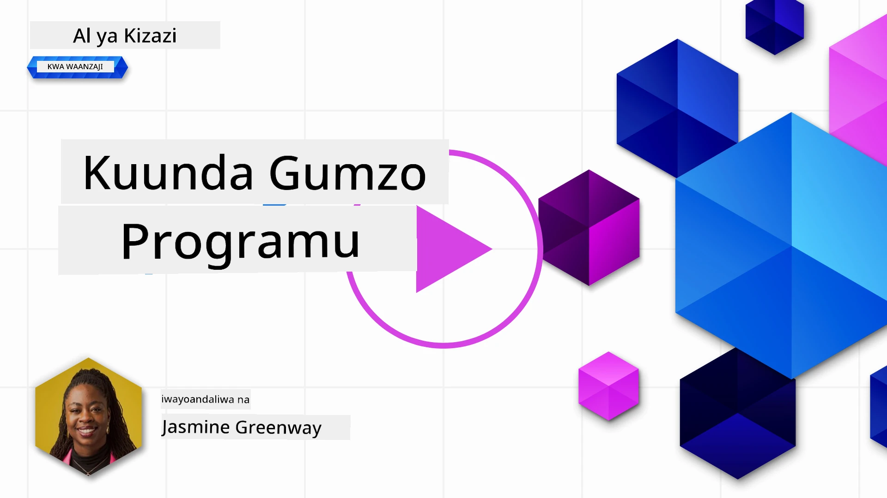
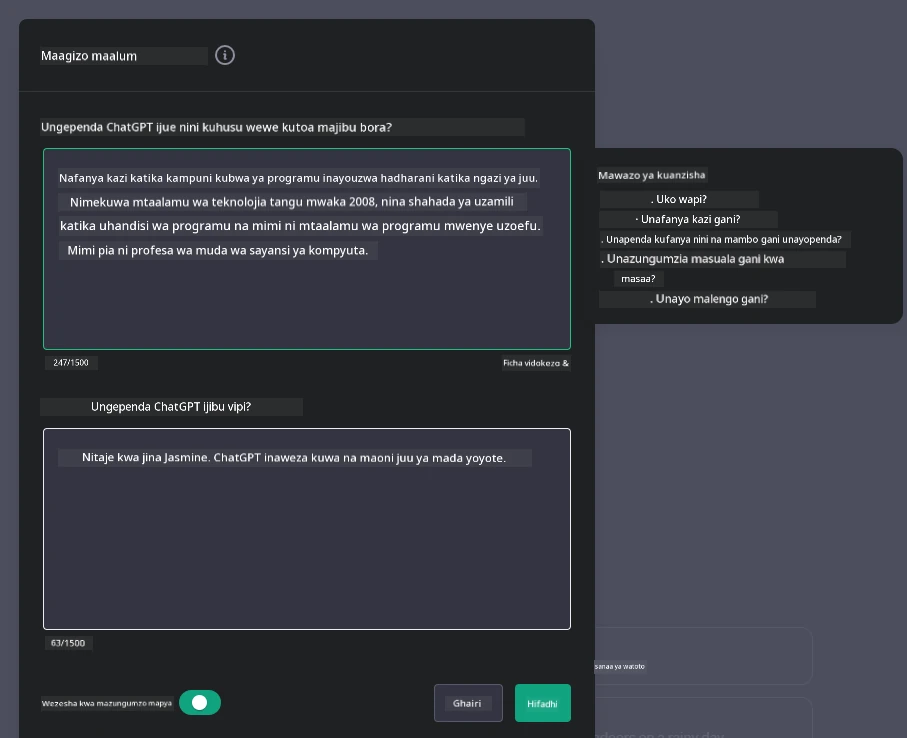
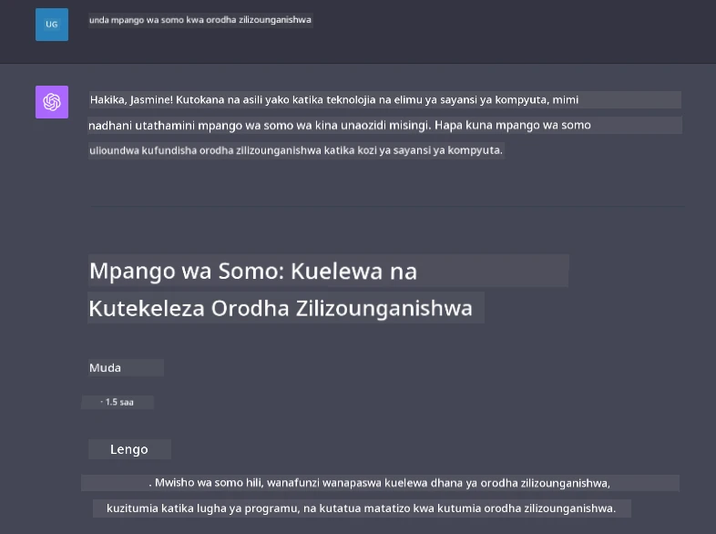

# Kuunda Programu za Mazungumzo Zenye Nguvu ya AI ya Kizazi

[](https://youtu.be/R9V0ZY1BEQo?si=IHuU-fS9YWT8s4sA)

> _(Bonyeza picha hapo juu kutazama video ya somo hili)_

Sasa tumeona jinsi tunavyoweza kuunda programu za kizazi cha maandishi, tuchunguze programu za mazungumzo.

Programu za mazungumzo zimeingizwa katika maisha yetu ya kila siku, zikitoa zaidi ya njia ya mazungumzo ya kawaida. Ni sehemu muhimu za huduma kwa wateja, msaada wa kiufundi, na hata mifumo tata ya ushauri. Inawezekana umepata msaada kutoka kwa programu ya mazungumzo hivi karibuni. Tunapoingiza teknolojia za hali ya juu kama AI ya kizazi katika majukwaa haya, ugumu huongezeka na changamoto pia.

Baadhi ya maswali tunayohitaji majibu ni:

- **Kuunda programu**. Tunawezaje kuunda na kuingiza programu hizi zenye nguvu za AI kwa matumizi maalum kwa ufanisi?
- **Ufuatiliaji**. Mara zikiwekwa, tunawezaje kufuatilia na kuhakikisha programu zinafanya kazi kwa kiwango cha juu cha ubora, kwa upande wa utendaji na kufuata [kanuni sita za AI yenye uwajibikaji](https://www.microsoft.com/ai/responsible-ai?WT.mc_id=academic-105485-koreyst)?

Tunapoendelea katika enzi inayotawaliwa na automatisering na mwingiliano rahisi kati ya binadamu na mashine, kuelewa jinsi AI ya kizazi inavyobadilisha upeo, kina, na urahisi wa kubadilika wa programu za mazungumzo kuwa muhimu. Somo hili litachunguza vipengele vya usanifu vinavyounga mkono mifumo hii tata, kuingia katika mbinu za kuiboresha kwa kazi maalum, na kutathmini vipimo na maadili muhimu kwa kuweka AI yenye uwajibikaji.

## Utangulizi

Somo hili linajumuisha:

- Mbinu za kuunda na kuingiza programu za mazungumzo kwa ufanisi.
- Jinsi ya kutumia usanifu na uboreshaji wa programu.
- Mikakati na mantiki za kufuatilia programu za mazungumzo kwa ufanisi.

## Malengo ya Kujifunza

Mwisho wa somo hili, utaweza:

- Eleza masuala ya kuunda na kuingiza programu za mazungumzo katika mifumo iliyopo.
- Badilisha programu za mazungumzo kwa matumizi maalum.
- Tambua vipimo muhimu na mantiki za kufuatilia na kudumisha ubora wa programu zenye nguvu za AI.
- Hakikisha programu za mazungumzo zinatumia AI kwa uwajibikaji.

## Kuingiza AI ya Kizazi katika Programu za Mazungumzo

Kuinua programu za mazungumzo kwa AI ya kizazi siyo tu kuwafanya kuwa werevu zaidi; ni kuhusu kuboresha usanifu, utendaji, na kiolesura cha mtumiaji ili kutoa uzoefu bora. Hii inajumuisha kuchunguza misingi ya usanifu, uunganishaji wa API, na mambo ya kiolesura cha mtumiaji. Sehemu hii inalenga kukupa ramani kamili ya kuelewa mandhari haya magumu, iwe unaiweka kwenye mifumo iliyopo au kuunda kama majukwaa huru.

Mwisho wa sehemu hii, utakuwa na ujuzi unaohitajika kuunda na kuingiza programu za mazungumzo kwa ufanisi.

### Chatbot au Programu ya Mazungumzo?

Kabla ya kuingia katika ujenzi wa programu za mazungumzo, tuchukulie tofauti kati ya 'chatbots' na 'programu za mazungumzo zenye nguvu za AI,' ambazo zina majukumu tofauti. Kusudi kuu la chatbot ni kuendesha kazi maalum za mazungumzo, kama kujibu maswali yanayoulizwa mara kwa mara au kufuatilia kifurushi. Kwa kawaida hutumia mantiki ya sheria au algoriti tata za AI. Programu ya mazungumzo yenye nguvu ya AI ni mazingira pana zaidi yaliyoundwa kuwezesha mawasiliano mbalimbali ya kidijitali, kama maandishi, sauti, na mazungumzo ya video kati ya watumiaji wa binadamu. Kipengele chake kikuu ni kuingiza mfano wa AI wa kizazi unaodhibitisha mazungumzo yanayofanana na ya binadamu, yakijibu kulingana na aina mbalimbali za ingizo na muktadha. Programu ya mazungumzo zenye nguvu za AI inaweza kushiriki mijadala ya wazi, kubadilika na muktadha unaobadilika, na hata kutoa mijadala ya ubunifu au tata.

Jedwali hapa chini linaonyesha tofauti na mfanano muhimu kutusaidia kuelewa majukumu yao ya kipekee katika mawasiliano ya kidijitali.

| Chatbot                               | Programu ya Mazungumzo Zenye Nguvu ya AI ya Kizazi |
| ------------------------------------- | -------------------------------------- |
| Linalolenga kazi maalum na linategemea sheria           | Linalojihusisha na muktadha                          |
| Mara nyingi limeunganishwa kwenye mifumo mikubwa       | Linaweza kuwa mwenyeji wa chatbots moja au zaidi    |
| Limelazimika kufanyika kazi zingine zilizopangwa         | Linaingiza mifano ya AI ya kizazi                      |
| Michanganyiko maalum na yenye muundo                   | Lina uwezo wa mijadala ya wazi     |

### Kutumia kipengele kilichojengwa tayari kupitia SDK na API

Unapojenga programu ya mazungumzo, hatua nzuri ya kwanza ni kutathmini kile kilichopo tayari. Kutumia SDK na API kujenga programu za mazungumzo ni mkakati wenye faida kwa sababu mbalimbali. Kwa kuingiza SDK na API zilizo na nyaraka nzuri, unaposisha programu yako kwa mafanikio ya muda mrefu, ukitatua changamoto za upanuzi na matengenezo.

- **Huarahisisha mchakato wa maendeleo na kupunguza mzigo**: Kutegemea vipengele vilivyotengenezwa tayari kuliko gharama kubwa ya kuunda mwenyewe kunakuwezesha kuzingatia mambo mengine ya programu yako yanayoweza kuwa muhimu zaidi, kama mantiki ya biashara.
- **Utendaji bora**: Unapojenga kipengele tangu mwanzo, mwishowe utajiuliza "Je, kinaweza kupanuka vipi? Je, programu hii inashughulikia wateja wengi kwa ghafla?" SDK na API zilizo salama mara nyingi zina suluhisho zilizojengewa kushughulikia tatizo hilo.
- **Urahisi wa matengenezo**: Sasisho na maboresho ni rahisi kusimamia kwani API na SDK nyingi zinahitaji tu sasisho la maktaba unapopata toleo jipya.
- **Kupata teknolojia ya kisasa**: Kutumia mifano iliyo boreshwa na kufundishwa kwa seti kubwa za data kunatoa uwezo wa lugha asilia kwa programu yako.

Kupata kipengele cha SDK au API kawaida kunahusisha kupata ruhusa ya kutumia huduma zinazotolewa, mara nyingi kwa kutumia funguo za kipekee au tokeni za uthibitisho. Tutatumia Maktaba ya Python ya OpenAI kuchunguza mfano huu. Pia unaweza kujaribu mwenyewe katika [buku la mazoezi la OpenAI](./python/oai-assignment.ipynb?WT.mc_id=academic-105485-koreyst) au [buku la mazoezi la Azure OpenAI Services](./python/aoai-assignment.ipynb?WT.mc_id=academic-105485-koreys) kwa somo hili.

```python
import os
from openai import OpenAI

API_KEY = os.getenv("OPENAI_API_KEY","")

client = OpenAI(
    api_key=API_KEY
    )

response = client.responses.create(model="gpt-4o-mini", input="Suggest two titles for an instructional lesson on chat applications for generative AI.", store=False)
print(response.output_text)
```

Mfano hapo juu unatumia mfano wa GPT-4o mini na API ya Majibu kukamilisha maelekezo, lakini zingatia kuwa funguo ya API imewekwa kabla ya kufanya hivyo. Utapokea kosa kama hutaweka funguo.

## Uzoefu wa Mtumiaji (UX)

Kanuni za jumla za UX zinatumika kwa programu za mazungumzo, lakini hapa kuna mambo ya ziada muhimu kutokana na vipengele vya kujifunza mashine vinavyohusika.

- **Mbinu za kushughulikia ukosefu wa uwazi**: Mifano ya AI ya kizazi wakati mwingine hutoa majibu yasiyo wazi. Kipengele kinachowawezesha watumiaji kuuliza ufafanuzi kinaweza kusaidia wanapokutana na tatizo hili.
- **Kukumbatia muktadha**: Mifano ya AI ya kizazi yenye maendeleo ina uwezo wa kukumbuka muktadha wa mazungumzo, jambo muhimu kwa uzoefu wa mtumiaji. Kuwapa watumiaji uwezo wa kudhibiti na kusimamia muktadha huboresha uzoefu wa mtumiaji, lakini huleta hatari ya kuhifadhi habari nyeti za mtumiaji. Kuzingatia muda wa kuhifadhi taarifa, kama kuweka sera ya uhifadhi, kunaweza kusawazisha hitaji la muktadha dhidi ya faragha.
- **Kubinafsisha**: Kwa uwezo wa kujifunza na kubadilika, mifano ya AI hutoa uzoefu wa mtu binafsi kwa mtumiaji. Kubinafsisha uzoefu wa mtumiaji kupitia vipengele kama profaili za watumiaji siyo tu huwafanya watumiaji wahisi kueleweka, bali pia hukusaidia kupata majibu maalum, na kufanya mwingiliano kuwa wenye ufanisi na kuridhisha zaidi.

Mfano mmoja wa kubinafsisha ni mipangilio ya "Maelekezo Maalum" katika ChatGPT ya OpenAI. Inakuwezesha kutoa taarifa kuhusu wewe mwenyewe ambazo zinaweza kuwa muktadha muhimu kwa maelekezo yako. Hapa kuna mfano wa maelekezo maalum.



"Profaili" hii inahimiza ChatGPT kuunda mpango wa somo kuhusu linked lists. Zingatia kuwa ChatGPT inazingatia kuwa mtumiaji anaweza kutaka mpango wa somo wa kina zaidi kulingana na uzoefu wake.



### Mfumo wa Ujumbe wa Mfumo wa Microsoft kwa Mifano Mikubwa ya Lugha

[Microsoft imeweka mwongozo](https://learn.microsoft.com/azure/ai-services/openai/concepts/system-message#define-the-models-output-format?WT.mc_id=academic-105485-koreyst) wa kuandika ujumbe wa mfumo unaofaa wakati wa kuzalisha majibu kutoka kwa LLM uliogawanywa katika maeneo 4:

1. Kufafanua kwa nani mfano ni, pamoja na uwezo na mapungufu yake.
2. Kufafanua muundo wa matokeo ya mfano.
3. Kutoa mifano maalum inayonyesha tabia inayokusudiwa ya mfano.
4. Kutoa miongozo ya ziada ya tabia.

### Ufikiaji

Iwe mtumiaji ana matatizo ya kuona, kusikia, mwendo, au utambuzi, programu nzuri ya mazungumzo inapaswa kutumika na wote. Orodha ifuatayo ina vipengele maalum vinavyolenga kufanya ufikiaji kuwa rahisi kwa matatizo mbalimbali ya watumiaji.

- **Vipengele kwa Tatizo la Kuona**: Mandhari ya mvuto mkubwa na maandishi yanayoweza kubadilika ukubwa, msaada wa mtazamaji wa skrini.
- **Vipengele kwa Tatizo la Kusikia**: Kazi ya maandishi kuwa sauti na sauti kuwa maandishi, ishara za kuona za arifa za sauti.
- **Vipengele kwa Tatizo la Mwendo**: Msaada wa urambazaji wa kibodi, amri za sauti.
- **Vipengele kwa Tatizo la Utambuzi**: Chaguo za lugha zilizorahisishwa.

## Ubinafsishaji na Uboreshaji kwa Mifano ya Lugha Maalum kwa Sekta

Fikiria programu ya mazungumzo inayojua istilahi ya kampuni yako na inatarajia maswali maalum ambayo watumiaji wake mara nyingi wana. Kuna mbinu kadhaa zinazostahili kutajwa:

- **Kutumia mifano ya DSL**. DSL inasimama kwa lugha maalum ya sekta. Unaweza kutumia mfano wa DSL uliofundishwa kwa eneo fulani kuelewa dhana na matukio yake.
- **Tumia uboreshaji**. Uboreshaji ni mchakato wa kufundisha zaidi mfano wako kwa data maalum.

## Ubinafsishaji: Kutumia DSL

Kutumia mifano ya lugha maalum kwa sekta (Mifano ya DSL) kunaweza kuongeza ushiriki wa mtumiaji kwa kutoa mwingiliano maalum, unaoendana na muktadha. Ni mfano uliofundishwa au ulioboreshwa kuelewa na kuzalisha maandishi yanayohusiana na uwanja maalum, sekta, au somo. Chaguzi za kutumia mfano wa DSL zinaweza kuwa kuunda moja kutoka mwanzoni, au kutumia zilizopo kupitia SDK na API. Chaguo jingine ni uboreshaji, unaohusisha kuchukua mfano uliotanguliwa ulioboreshwa na kuubadilisha kwa sekta maalum.

## Ubinafsishaji: Tumia uboreshaji

Uboreshaji mara nyingi hutafakariwa wakati mfano uliotanguliwa haukidhi mahitaji katika eneo maalum au kazi fulani.

Kwa mfano, maswali ya tiba ni magumu na yanahitaji muktadha mwingi. Mtaalamu wa tiba anapotambua ugonjwa kwa mgonjwa hutegemea mambo mbalimbali kama mtindo wa maisha au hali zilizokuwepo kabla, na unaweza hata kutumia majarida ya tiba ya hivi karibuni kuthibitisha utambuzi wake. Katika hali hizi changamano, programu za mazungumzo za AI wa jumla haziwezi kuwa chanzo cha kuaminika.

### Hali ya mfano: programu ya tiba

Fikiria programu ya mazungumzo iliyoundwa kusaidia wataalamu wa tiba kwa kutoa rejea haraka za miongozo ya matibabu, mwingiliano wa dawa, au matokeo ya utafiti wa karibuni.

Mfano wa jumla unaweza kufaa kujibu maswali ya msingi ya tiba au kutoa ushauri wa jumla, lakini unaweza kushindwa na:

- **Hali maalum au ngumu sana**. Kwa mfano, mtaalamu wa neva anaweza kumuuliza programu, "Ni mbinu bora za sasa za kusimamia ugonjwa wa kifafa usioyajali dawa kwa watoto?"
- **Kukosa maendeleo ya hivi karibuni**. Mfano wa jumla unaweza kushindwa kutoa jibu la sasa linalojumuisha maendeleo ya hivi karibuni katika neurology na pharmacology.

Katika hali kama hizi, kuboresha mfano kwa seti maalum ya data za tiba kunaweza kuboresha uwezo wake kushughulikia maswali haya magumu kwa usahihi na kwa kuaminika. Hii inahitaji kupata seti kubwa na muhimu ya data inayowakilisha changamoto za eneo maalum na maswali yanayohitaji kushughulikiwa.

## Mawazo kwa Uzoefu Bora wa Mazungumzo unaotumia AI

Sehemu hii inaelezea vigezo vya programu za mazungumzo “zenye ubora wa juu,” vinavyojumuisha picha ya vipimo vitendo na kufuata mfumo unaotumia AI kwa uwajibikaji.

### Vipimo Muhimu

Ili kudumisha utendaji bora wa programu, ni muhimu kufuatilia vipimo na masuala muhimu. Vipimo hivi havihakiki tu utendaji wa programu bali pia hupima ubora wa mfano wa AI na uzoefu wa mtumiaji. Hapa chini kuna orodha inayojumuisha vipimo vya msingi, AI, na uzoefu wa mtumiaji vya kuzingatia.

| Kipimo                       | Maelezo                                                                                                              | Masuala ya Mtengenezaji wa Mazungumzo                              |
| ---------------------------- | ------------------------------------------------------------------------------------------------------------------- | ------------------------------------------------------------------ |
| **Wakati wa Kuendelea**       | hupima muda programu inafanya kazi na kupatikana kwa watumiaji.                                                     | Utapunguza vipi muda wa kushindwa kwa huduma?                      |
| **Muda wa Kujibu**           | Muda unaochukuliwa na programu kujibu swali la mtumiaji.                                                            | Je, utaweza aje kuongeza kasi ya usindikaji wa maswali?           |
| **Usahihi**                  | Uwiano wa utabiri sahihi wa chanya kwa jumla ya utabiri chanya.                                                      | Utahakikije usahihi wa mfano wako?                                 |
| **Urejeshaji (Upevu wa Kuhisi)** | Uwiano wa utabiri sahihi wa chanya kwa idadi halisi ya chanya.                                                      | Utapima vipi na kuboresha urejeshaji?                             |
| **Mawazo ya F1**             |  Hasa ya wastani wa usahihi na urejeshaji, inayosawazisha mwelekeo kati ya zote mbili.                                | Lengo lako la F1 ni lipi? Utapangaje usawazishaji wa usahihi na urejeshaji?  |
| **Ugumu (Perplexity)**       | Hupima jinsi usambazaji wa uwezekano unaotabirika na mfano unavyolingana na usambazaji halisi wa data.                | Utapunguzaje ugumu?                                                |
| **Vipimo vya Kuridhika kwa Mtumiaji** | Hupima mtazamo wa mtumiaji kuhusu programu. Mara nyingi huhifadhiwa kupitia kura za maoni.                         | Je, utakusanya maoni ya mtumiaji ngapi? Utabadilikaje kulingana nayo? |
| **Kiwango cha Makosa**       | Kiwango ambacho mfano unafanya makosa katika kuelewa au kutoa matokeo.                                               | Mikakati gani unayo ya kupunguza makosa?                          |
| **Mizunguko ya Mafunzo Upya** | Mara ngapi mfano unasasishwa ili kuingiza data na maarifa mapya.                                                     | Mzunguko wa mafunzo upya ni mara ngapi? Ni nini kinasababisha mzunguko? |

| **Ugunduzi wa Mambo Yasiyo ya Kawaida** | Vifaa na mbinu za kubaini mifumo isiyo ya kawaida ambayo haisiifuati tabia inayotarajiwa. | Utajibuje kwa mambo yasiyo ya kawaida?  |

### Kutekeleza Mazoezi ya AI yenye Kuwajibika katika Programu za Chat

Njia ya Microsoft ya AI yenye Kuwajibika imebaini kanuni sita ambazo zinapaswa kuongoza maendeleo na matumizi ya AI. Hapa chini ni kanuni hizo, ufafanuzi wake, na mambo ambayo mtengenezaji wa chat anapaswa kuzingatia na kwa nini wanapaswa kuzichukulia kwa umakini.

| Kanuni              | Ufafanuzi wa Microsoft                                | Mambo ya Kuzingatia kwa Mtengenezaji wa Chat                         | Kwa Nini Ni Muhimu                                                                         |
| ------------------- | ----------------------------------------------------- | -------------------------------------------------------------------- | ---------------------------------------------------------------------------------------- |
| Uadilifu            | Mifumo ya AI inapaswa kutendea watu wote haki.        | Hakikisha programu ya chat haisitendei ubaguzi kulingana na data ya mtumiaji. | Kuunda uaminifu na ushirikishwaji miongoni mwa watumiaji; kuepuka matatizo ya kisheria. |
| Uaminifu na Usalama | Mifumo ya AI inapaswa kufanya kazi kwa kuaminika na kwa usalama. | Tekeleza majaribio na viambatanisho vya kufeli ili kupunguza makosa na hatari. | Inahakikisha kuridhika kwa mtumiaji na kuzuia madhara yanayoweza kutokea.                   |
| Usiri na Usalama    | Mifumo ya AI inapaswa kuwa salama na kuheshimu usiri. | Tekeleza usimbaji wa data wenye nguvu na hatua za ulinzi wa data.    | Kulinda data nyeti za watumiaji na kufuata sheria za usiri.                              |
| Ushirikishaji       | Mifumo ya AI inapaswa kuwawezesha watu wote na kuwashirikisha. | Buni UI/UX ambayo ni rahisi kufikiwa na kutumia kwa hadhira mbalimbali. | Inahakikisha watu wengi zaidi wanaweza kutumia programu kwa ufanisi.                      |
| Uwajibikaji         | Mifumo ya AI inapaswa kueleweka.                      | Toa nyaraka wazi na sababu za majibu ya AI.                         | Watumiaji wana uwezekano wa kuamini mfumo ikiwa wanaweza kuelewa jinsi maamuzi yanavyotengenezwa. |
| Uwajibikaji         | Watu wanapaswa kuwajibika kwa mifumo ya AI.            | Anzisha mchakato wazi wa ukaguzi na kuboresha maamuzi ya AI.        | Inaruhusu maboresho endelevu na hatua za kurekebisha endapo kutatokea makosa.            |

## Kazi ya Nyumbani

Angalia [assignment](../../../07-building-chat-applications/python). Itakupeleka kupitia mfululizo wa mazoezi kuanzia kuendesha maagizo yako ya kwanza ya chat, kugawa na kufupisha maandishi na zaidi. Nota kuwa kazi za nyumbani zinapatikana katika lugha tofauti za programu!

## Kazi Nzuri! Endelea Safari

Baada ya kukamilisha somo hili, angalia [Generative AI Learning collection](https://aka.ms/genai-collection?WT.mc_id=academic-105485-koreyst) ili kuendelea kuongeza maarifa yako ya AI Inayozalisha!

Nenda Somo la 8 ili kuona jinsi unavyoweza kuanza [kujenga programu za utafutaji](../08-building-search-applications/README.md?WT.mc_id=academic-105485-koreyst)!

---

<!-- CO-OP TRANSLATOR DISCLAIMER START -->
**Kionyozo**:
Hati hii imetafsiriwa kwa kutumia huduma ya tafsiri ya AI [Co-op Translator](https://github.com/Azure/co-op-translator). Ingawa tunajitahidi kupata usahihi, tafadhali fahamu kwamba tafsiri za kiotomatiki zinaweza kuwa na makosa au upungufu wa usahihi. Hati ya asili katika lugha yake halisi inapaswa kuchukuliwa kama chanzo cha mamlaka. Kwa taarifa muhimu, tafsiri ya kitaalamu inayofanywa na binadamu inapendekezwa. Hatutojibu kwa kuelewa vibaya au tafsiri potofu zinazotokea kutokana na matumizi ya tafsiri hii.
<!-- CO-OP TRANSLATOR DISCLAIMER END -->