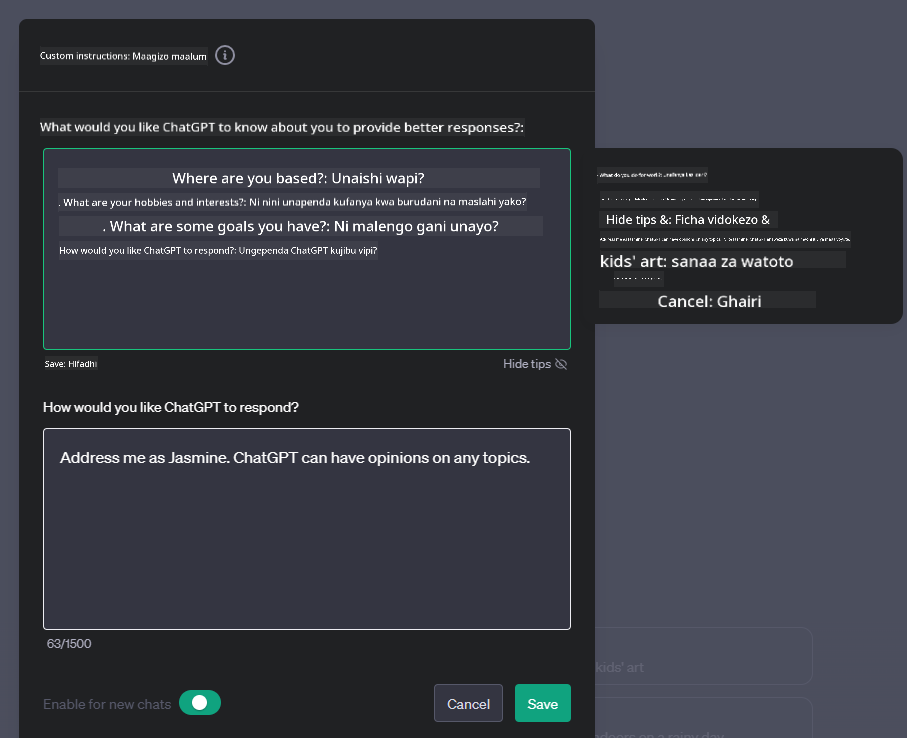

<!--
CO_OP_TRANSLATOR_METADATA:
{
  "original_hash": "ea4bbe640847aafbbba14dae4625e9af",
  "translation_date": "2025-06-25T15:50:20+00:00",
  "source_file": "07-building-chat-applications/README.md",
  "language_code": "sw"
}
-->
# Kujenga Programu za Mazungumzo Zinazoendeshwa na AI ya Kizazi

[](https://aka.ms/gen-ai-lessons7-gh?WT.mc_id=academic-105485-koreyst)

> _(Bofya picha hapo juu ili kutazama video ya somo hili)_

Sasa kwa kuwa tumeona jinsi tunavyoweza kujenga programu za kizazi cha maandishi, hebu tuangalie programu za mazungumzo.

Programu za mazungumzo zimekuwa sehemu ya maisha yetu ya kila siku, zikitoa zaidi ya njia ya mazungumzo ya kawaida. Ni sehemu muhimu za huduma kwa wateja, msaada wa kiufundi, na hata mifumo ya ushauri wa hali ya juu. Inawezekana umepata msaada kutoka kwa programu ya mazungumzo si muda mrefu uliopita. Tunapojumuisha teknolojia za hali ya juu zaidi kama AI ya kizazi kwenye majukwaa haya, ugumu huongezeka na changamoto pia.

Baadhi ya maswali yanayohitaji kujibiwa ni:

- **Kujenga programu**. Je, tunajenga kwa ufanisi na kuunganisha bila mshono programu hizi zinazoendeshwa na AI kwa matumizi maalum?
- **Ufuatiliaji**. Mara baada ya kupelekwa, tunawezaje kufuatilia na kuhakikisha kuwa programu zinafanya kazi kwa kiwango cha juu kabisa cha ubora, kwa upande wa utendaji kazi na kuzingatia [kanuni sita za AI inayowajibika](https://www.microsoft.com/ai/responsible-ai?WT.mc_id=academic-105485-koreyst)?

Tunapoendelea zaidi katika enzi inayofafanuliwa na otomatiki na mwingiliano wa bila mshono wa binadamu na mashine, kuelewa jinsi AI ya kizazi inavyobadilisha upeo, kina, na uwezo wa kubadilika wa programu za mazungumzo ni muhimu. Somo hili litachunguza vipengele vya usanifu vinavyounga mkono mifumo hii tata, kuchunguza mbinu za kuirekebisha kwa kazi maalum za kikoa, na kutathmini vipimo na maoni muhimu ili kuhakikisha utekelezaji wa AI inayowajibika.

## Utangulizi

Somo hili linashughulikia:

- Mbinu za kujenga na kuunganisha programu za mazungumzo kwa ufanisi.
- Jinsi ya kutumia ubinafsishaji na kurekebisha programu.
- Mikakati na maoni ya kufuatilia programu za mazungumzo kwa ufanisi.

## Malengo ya Kujifunza

Ifikapo mwisho wa somo hili, utaweza:

- Eleza maoni ya kujenga na kuunganisha programu za mazungumzo kwenye mifumo iliyopo.
- Kubinafsisha programu za mazungumzo kwa matumizi maalum.
- Tambua vipimo muhimu na maoni ya kufuatilia na kudumisha ubora wa programu za mazungumzo zinazoendeshwa na AI kwa ufanisi.
- Hakikisha programu za mazungumzo zinatumia AI kwa uwajibikaji.

## Kujumuisha AI ya Kizazi katika Programu za Mazungumzo

Kuinua programu za mazungumzo kupitia AI ya kizazi sio tu kuhusu kuzifanya ziwe na akili zaidi; ni kuhusu kuboresha usanifu wao, utendaji, na kiolesura cha mtumiaji ili kutoa uzoefu wa hali ya juu kwa mtumiaji. Hii inahusisha kuchunguza misingi ya usanifu, ujumuishaji wa API, na maoni ya kiolesura cha mtumiaji. Sehemu hii inalenga kukupa ramani ya kina ya kuabiri mandhari haya magumu, iwe unaziunganisha kwenye mifumo iliyopo au unazijenga kama majukwaa ya kujitegemea.

Ifikapo mwisho wa sehemu hii, utakuwa na utaalamu unaohitajika kujenga na kuingiza programu za mazungumzo kwa ufanisi.

### Chatbot au Programu ya Mazungumzo?

Kabla hatujaingia katika kujenga programu za mazungumzo, hebu tulinganishe 'chatbots' dhidi ya 'programu za mazungumzo zinazoendeshwa na AI,' ambazo zina majukumu na kazi tofauti. Kusudi kuu la chatbot ni kuboresha kazi maalum za mazungumzo, kama vile kujibu maswali yanayoulizwa mara kwa mara au kufuatilia kifurushi. Kwa kawaida, inatawaliwa na mantiki inayotegemea sheria au algorithimu za AI tata. Kinyume chake, programu ya mazungumzo inayotumia AI ni mazingira makubwa zaidi yaliyoundwa kuwezesha aina mbalimbali za mawasiliano ya kidijitali, kama vile maandishi, sauti, na video kati ya watumiaji wa binadamu. Kipengele chake kikuu ni ujumuishaji wa mfano wa AI wa kizazi unaosimulia mazungumzo ya kina, kama ya kibinadamu, na kutoa majibu kulingana na aina mbalimbali za pembejeo na vihisishi vya muktadha. Programu ya mazungumzo inayotumia AI ya kizazi inaweza kushiriki katika mijadala ya uwanja wazi, kubadilika na muktadha wa mazungumzo unaoendelea, na hata kutoa mazungumzo ya ubunifu au tata.

Jedwali hapa chini linaonyesha tofauti na mfanano muhimu ili kutusaidia kuelewa majukumu yao ya kipekee katika mawasiliano ya kidijitali.

| Chatbot                               | Programu ya Mazungumzo Inayoendeshwa na AI ya Kizazi |
| ------------------------------------- | ---------------------------------------------------- |
| Inalenga Kazi na inategemea sheria    | Inajua Muktadha                                       |
| Mara nyingi huunganishwa kwenye mifumo mikubwa | Inaweza kuwa na chatbot moja au zaidi                 |
| Inapunguzwa kwa kazi zilizopangwa     | Inajumuisha mifano ya AI ya kizazi                     |
| Mwingiliano Maalum na Ulioandaliwa    | Ina uwezo wa mijadala ya uwanja wazi                  |

### Kutumia Utendaji wa Awali na SDK na API

Unapojenga programu ya mazungumzo, hatua nzuri ya kwanza ni kutathmini kilicho tayari huko nje. Kutumia SDK na API kujenga programu za mazungumzo ni mkakati wenye manufaa kwa sababu mbalimbali. Kwa kuunganisha SDK na API zilizo na nyaraka nzuri, unaweka programu yako kimkakati kwa mafanikio ya muda mrefu, ukishughulikia wasiwasi wa upanuzi na matengenezo.

- **Inaharakisha mchakato wa maendeleo na kupunguza gharama za juu**: Kutegemea utendaji uliotengenezwa tayari badala ya mchakato wa gharama kubwa wa kuujenga mwenyewe hukuruhusu kuzingatia vipengele vingine vya programu yako ambavyo unaweza kuona ni muhimu zaidi, kama vile mantiki ya biashara.
- **Utendaji bora**: Unapojenga utendaji kutoka mwanzo, hatimaye utauliza "Inapima vipi? Je, programu hii inaweza kushughulikia wingi wa watumiaji ghafla?" SDK na API zilizohifadhiwa vizuri mara nyingi zina suluhisho zilizojengwa kwa ajili ya wasiwasi huu.
- **Matengenezo rahisi**: Sasisho na maboresho ni rahisi kusimamia kwani API na SDK nyingi zinahitaji tu sasisho la maktaba wakati toleo jipya linatolewa.
- **Ufikiaji wa teknolojia ya kisasa**: Kutumia mifano ambayo imeboreshwa na kufunzwa kwenye seti za data kubwa hutoa programu yako uwezo wa lugha asilia.

Kupata utendaji wa SDK au API kwa kawaida kunahusisha kupata ruhusa ya kutumia huduma zinazotolewa, ambayo mara nyingi ni kupitia matumizi ya ufunguo wa kipekee au tokeni ya uthibitishaji. Tutatumia Maktaba ya Python ya OpenAI ili kuchunguza jinsi hii inavyoonekana. Unaweza pia kujaribu mwenyewe kwenye [notebook ya OpenAI](../../../07-building-chat-applications/python/oai-assignment.ipynb) au [notebook ya Azure OpenAI Services](../../../07-building-chat-applications/python/aoai-assignment.ipynb) kwa somo hili.

```python
import os
from openai import OpenAI

API_KEY = os.getenv("OPENAI_API_KEY","")

client = OpenAI(
    api_key=API_KEY
    )

chat_completion = client.chat.completions.create(model="gpt-3.5-turbo", messages=[{"role": "user", "content": "Suggest two titles for an instructional lesson on chat applications for generative AI."}])
```

Mfano hapo juu unatumia mfano wa GPT-3.5 Turbo kukamilisha agizo, lakini angalia kuwa ufunguo wa API umewekwa kabla ya kufanya hivyo. Ungelipata kosa ikiwa usingeweka ufunguo.

## Uzoefu wa Mtumiaji (UX)

Kanuni za jumla za UX zinatumika kwa programu za mazungumzo, lakini hapa kuna baadhi ya maoni ya ziada ambayo yanakuwa muhimu hasa kutokana na vipengele vya ujifunzaji wa mashine vinavyohusika.

- **Mbinu ya kushughulikia utata**: Mifano ya AI ya kizazi wakati mwingine hutoa majibu yenye utata. Kipengele kinachoruhusu watumiaji kuuliza ufafanuzi kinaweza kusaidia wanapokutana na tatizo hili.
- **Uhifadhi wa muktadha**: Mifano ya hali ya juu ya AI ya kizazi ina uwezo wa kukumbuka muktadha ndani ya mazungumzo, ambayo inaweza kuwa mali muhimu kwa uzoefu wa mtumiaji. Kuwapa watumiaji uwezo wa kudhibiti na kusimamia muktadha kunaboresha uzoefu wa mtumiaji, lakini kunaleta hatari ya kuhifadhi taarifa nyeti za mtumiaji. Maoni juu ya muda gani taarifa hii inahifadhiwa, kama vile kuanzisha sera ya uhifadhi, inaweza kusawazisha hitaji la muktadha dhidi ya faragha.
- **Ubinafsishaji**: Kwa uwezo wa kujifunza na kubadilika, mifano ya AI inatoa uzoefu wa kibinafsi kwa mtumiaji. Kubinafsisha uzoefu wa mtumiaji kupitia vipengele kama vile maelezo ya mtumiaji si tu kunamfanya mtumiaji ajisikie kueleweka, lakini pia kunasaidia katika kutafuta majibu maalum, na kuunda mwingiliano bora na wa kuridhisha.

Mfano mmoja wa ubinafsishaji ni mipangilio ya "Maagizo ya Maalum" katika ChatGPT ya OpenAI. Inakuruhusu kutoa taarifa kuhusu wewe mwenyewe ambayo inaweza kuwa muktadha muhimu kwa maagizo yako. Hapa kuna mfano wa maagizo maalum.



Hii "wasifu" inasababisha ChatGPT kuunda mpango wa somo juu ya orodha zilizounganishwa. Angalia kwamba ChatGPT inazingatia kuwa mtumiaji anaweza kutaka mpango wa somo wa kina zaidi kulingana na uzoefu wake.


### Mfumo wa Ujumbe wa Mfumo wa Microsoft kwa Mifano Mikubwa ya Lugha

[Microsoft imepeana mwongozo](https://learn.microsoft.com/azure/ai-services/openai/concepts/system-message#define-the-models-output-format?WT.mc_id=academic-105485-koreyst) kwa kuandika ujumbe wa mfumo mzuri wakati wa kutoa majibu kutoka kwa LLMs uliovunjwa katika maeneo 4:

1. Kufafanua ni nani mfano ni kwa ajili ya, pamoja na uwezo wake na mapungufu.
2. Kufafanua muundo wa matokeo ya mfano.
3. Kutoa mifano maalum inayoonyesha tabia iliyokusudiwa ya mfano.
4. Kutoa vidhibiti vya ziada vya tabia.

### Upatikanaji

Iwe mtumiaji ana ulemavu wa kuona, kusikia, mwendo, au utambuzi, programu ya mazungumzo iliyoundwa vizuri inapaswa kuwa inayotumika na wote. Orodha ifuatayo inavunja vipengele maalum vinavyolenga kuboresha upatikanaji kwa ulemavu mbalimbali wa watumiaji.

- **Vipengele vya Ulemavu wa Kuona**: Mandhari ya tofauti ya juu na maandishi yanayoweza kubadilishwa, utangamano wa msomaji wa skrini.
- **Vipengele vya Ulemavu wa Kusikia**: Kazi za maandishi-kwa-hotuba na hotuba-kwa-maandishi, vihisishi vya kuona kwa arifa za sauti.
- **Vipengele vya Ulemavu wa Mwendo**: Usaidizi wa urambazaji wa kibodi, amri za sauti.
- **Vipengele vya Ulemavu wa Utambuzi**: Chaguo za lugha rahisi.

## Ubinafsishaji na Kurekebisha kwa Mifano ya Lugha Maalum ya Kikoa

Fikiria programu ya mazungumzo inayofahamu lugha ya kampuni yako na kutarajia maswali maalum ambayo watumiaji wake wanayo mara kwa mara. Kuna mbinu kadhaa zinazofaa kutajwa:

- **Kutumia mifano ya DSL**. DSL inasimama kwa lugha maalum ya kikoa. Unaweza kutumia mfano wa lugha maalum ya kikoa ambao umefunzwa kwenye kikoa maalum kuelewa dhana zake na hali zake.
- **Kutumia kurekebisha**. Kurekebisha ni mchakato wa kufundisha zaidi mfano wako na data maalum.

## Ubinafsishaji: Kutumia DSL

Kutumia mifano ya lugha maalum ya kikoa (DSL Models) kunaweza kuongeza ushiriki wa watumiaji kwa kutoa mwingiliano maalum, unaohusiana na muktadha. Ni mfano ambao umefunzwa au umeboreshwa kuelewa na kutoa maandishi yanayohusiana na uwanja maalum, tasnia, au somo. Chaguzi za kutumia mfano wa DSL zinaweza kutofautiana kutoka kwa kufundisha moja kutoka mwanzo, hadi kutumia zilizopo kupitia SDK na API. Chaguo jingine ni kurekebisha, ambayo inahusisha kuchukua mfano uliopo ulioboreshwa na kuubadilisha kwa kikoa maalum.

## Ubinafsishaji: Kutumia Kurekebisha

Kurekebisha mara nyingi huzingatiwa wakati mfano ulioboreshwa unakosa katika kikoa maalum au kazi maalum.

Kwa mfano, maswali ya matibabu ni magumu na yanahitaji muktadha mwingi. Wakati mtaalamu wa matibabu anapogundua mgonjwa, inategemea mambo mbalimbali kama vile mtindo wa maisha au hali zilizopo, na inaweza hata kutegemea majarida ya matibabu ya hivi karibuni ili kuthibitisha utambuzi wao. Katika hali kama hizi, programu ya mazungumzo ya AI ya kusudi la jumla haiwezi kuwa chanzo cha kutegemewa.

### Hali: programu ya matibabu

Fikiria programu ya mazungumzo iliyoundwa kusaidia wataalamu wa matibabu kwa kutoa marejeo ya haraka kwa miongozo ya matibabu, mwingiliano wa dawa, au matokeo ya utafiti wa hivi karibuni.

Mfano wa kusudi la jumla unaweza kuwa wa kutosha kwa kujibu maswali ya msingi ya matibabu au kutoa ushauri wa jumla, lakini inaweza kuwa na shida na yafuatayo:

- **Hali maalum au tata sana**. Kwa mfano, mtaalamu wa neva anaweza kuuliza programu, "Ni mazoea bora gani ya sasa ya kudhibiti kifafa kisichotibika kwa watoto?"
- **Ukosefu wa maendeleo ya hivi karibuni**. Mfano wa kusudi la jumla unaweza kuwa na shida kutoa jibu la sasa ambalo linajumuisha maendeleo ya hivi karibuni katika neurolojia na famakolojia.

Katika hali kama hizi, kurekebisha mfano na seti ya data maalum ya matibabu kunaweza kuboresha kwa kiasi kikubwa uwezo wake wa kushughulikia maswali haya ya matibabu tata kwa usahihi na kutegemewa zaidi. Hii inahitaji ufikiaji wa seti ya data kubwa na muhimu inayowakilisha changamoto na maswali maalum ya kikoa ambayo yanahitaji kushughulikiwa.

## Maoni kwa Uzoefu wa Juu wa Mazungumzo Unaotokana na AI

Sehemu hii inaelezea vigezo vya programu za mazungumzo za "ubora wa juu", ambazo zinajumuisha kukamata vipimo vinavyoweza kutekelezeka na kuzingatia mfumo unaotumia teknolojia ya AI kwa uwajibikaji.

### Vipimo Muhimu

Ili kudumisha utendaji wa ubora wa juu wa programu, ni muhimu kufuatilia vipimo muhimu na maoni. Vipimo hivi si tu vinahakikisha utendaji wa programu lakini pia vinatathmini ubora wa mfano wa AI na uzoefu wa mtumiaji. Hapa chini ni orodha inayoshughulikia vipimo vya msingi, AI, na uzoefu wa mtumiaji vya kuzingatia.

| Kipimo                         | Ufafanuzi                                                                                                               | Maoni kwa Mjenzi wa Mazungumzo                                           |
| ----------------------------- | ------------------------------------------------------------------------------------------------------------------------ | ------------------------------------------------------------------------ |
| **Muda wa Kufanya Kazi**      | Inapima muda ambao programu inafanya kazi na kupatikana kwa watumiaji.                                                   | Utapunguza vipi muda wa chini?                                           |
| **Muda wa Majibu**            | Muda unaochukuliwa na programu kujibu swali la mtumiaji.                                                                | Unawezaje kuboresha usindikaji wa maswali ili kuboresha muda wa majibu?  |
| **Usahihi**                   | Uwiano wa utabiri sahihi chanya kwa jumla ya utabiri chanya                                                             | Utathibitishaje usahihi wa mfano wako?                                   |
| **Kumbukumbu (Unyeti)**       | Uwiano wa utabiri sahihi chanya kwa idadi halisi ya chanya                                                              | Utapima na kuboresha kumbukumbu vipi?                                    |
| **Alama ya F1**               | Wastani wa harmonic wa usahihi na kumbukumbu, unaosawazisha biashara kati ya zote mbili.                                | Je, ni lengo lako la Alama ya F1? Unawezaje kusawazisha usahihi na kumbukumbu? |
| **Ugumu**                     | Inapima jinsi usambazaji wa uwezekano ulivyotabiri na mfano unavyolingana na usambazaji

**Kanusho**:  
Hati hii imetafsiriwa kwa kutumia huduma ya tafsiri ya AI [Co-op Translator](https://github.com/Azure/co-op-translator). Ingawa tunajitahidi kwa usahihi, tafadhali fahamu kuwa tafsiri za kiotomatiki zinaweza kuwa na makosa au kutokuwa sahihi. Hati asili katika lugha yake ya asili inapaswa kuzingatiwa kuwa chanzo cha mamlaka. Kwa taarifa muhimu, tafsiri ya kibinadamu ya kitaalamu inapendekezwa. Hatutawajibika kwa kutoelewana au tafsiri zisizo sahihi zinazotokana na matumizi ya tafsiri hii.