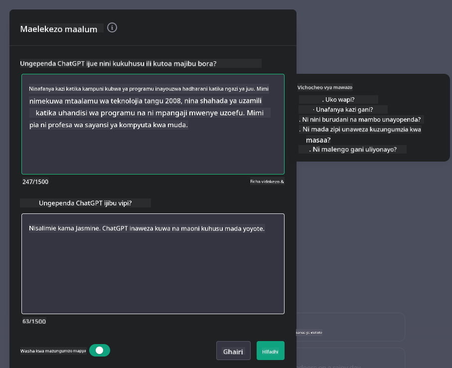

<!--
CO_OP_TRANSLATOR_METADATA:
{
  "original_hash": "ea4bbe640847aafbbba14dae4625e9af",
  "translation_date": "2025-07-09T12:36:58+00:00",
  "source_file": "07-building-chat-applications/README.md",
  "language_code": "sw"
}
-->
# Kujenga Programu za Mazungumzo Zinazotumia AI ya Kizazi

[](https://aka.ms/gen-ai-lessons7-gh?WT.mc_id=academic-105485-koreyst)

> _(Bonyeza picha hapo juu kutazama video ya somo hili)_

Sasa tumeona jinsi tunavyoweza kujenga programu za kizazi cha maandishi, hebu tuchunguze programu za mazungumzo.

Programu za mazungumzo zimejumuishwa katika maisha yetu ya kila siku, zikitoa zaidi ya njia ya mazungumzo ya kawaida. Ni sehemu muhimu za huduma kwa wateja, msaada wa kiufundi, na hata mifumo ya ushauri wa hali ya juu. Inawezekana umepata msaada kutoka kwa programu ya mazungumzo hivi karibuni. Tunapoingiza teknolojia za hali ya juu kama AI ya kizazi katika majukwaa haya, ugumu unaongezeka na changamoto pia.

Maswali ambayo tunahitaji majibu ni:

- **Kujenga programu**. Tunawezaje kujenga na kuunganisha programu hizi zinazoendeshwa na AI kwa ufanisi kwa matumizi maalum?
- **Ufuatiliaji**. Baada ya kuzinduliwa, tunawezaje kufuatilia na kuhakikisha programu zinafanya kazi kwa kiwango cha juu cha ubora, kwa upande wa utendaji na pia kufuata [kanuni sita za AI yenye uwajibikaji](https://www.microsoft.com/ai/responsible-ai?WT.mc_id=academic-105485-koreyst)?

Tunapoendelea katika enzi inayotawaliwa na uendeshaji wa kiotomatiki na mwingiliano usio na mshono kati ya binadamu na mashine, kuelewa jinsi AI ya kizazi inavyobadilisha upeo, kina, na uwezo wa kubadilika wa programu za mazungumzo ni muhimu. Somo hili litaangazia vipengele vya usanifu vinavyounga mkono mifumo hii tata, mbinu za kuiboresha kwa kazi maalum, na tathmini ya vipimo na mambo yanayohusiana na kuhakikisha matumizi ya AI kwa uwajibikaji.

## Utangulizi

Somo hili linajumuisha:

- Mbinu za kujenga na kuunganisha programu za mazungumzo kwa ufanisi.
- Jinsi ya kutumia ubinafsishaji na uboreshaji wa programu.
- Mikakati na mambo ya kuzingatia kufuatilia programu za mazungumzo kwa ufanisi.

## Malengo ya Kujifunza

Mwisho wa somo hili, utaweza:

- Kuelezea mambo ya kuzingatia wakati wa kujenga na kuunganisha programu za mazungumzo katika mifumo iliyopo.
- Kubinafsisha programu za mazungumzo kwa matumizi maalum.
- Kutambua vipimo muhimu na mambo ya kuzingatia kufuatilia na kudumisha ubora wa programu za mazungumzo zinazoendeshwa na AI.
- Kuhakikisha programu za mazungumzo zinatumia AI kwa uwajibikaji.

## Kuunganisha AI ya Kizazi katika Programu za Mazungumzo

Kuinua programu za mazungumzo kupitia AI ya kizazi si tu kuwafanya kuwa na akili zaidi; ni kuhusu kuboresha usanifu wao, utendaji, na muonekano wa mtumiaji ili kutoa uzoefu bora kwa mtumiaji. Hii inahusisha kuchunguza misingi ya usanifu, muunganisho wa API, na mambo ya kuzingatia muonekano wa mtumiaji. Sehemu hii inalenga kukupa ramani kamili ya kuongoza katika maeneo haya magumu, iwe unaziunganisha katika mifumo iliyopo au kuzijenga kama majukwaa huru.

Mwisho wa sehemu hii, utakuwa na ujuzi unaohitajika kujenga na kuingiza programu za mazungumzo kwa ufanisi.

### Chatbot au Programu ya Mazungumzo?

Kabla hatujaanza kujenga programu za mazungumzo, hebu tulinganishe 'chatbots' na 'programu za mazungumzo zinazoendeshwa na AI,' ambazo zina majukumu na kazi tofauti. Kusudi kuu la chatbot ni kuendesha kazi maalum za mazungumzo kwa njia ya kiotomatiki, kama kujibu maswali yanayoulizwa mara kwa mara au kufuatilia kifurushi. Kwa kawaida hutegemea mantiki ya kanuni au algoriti tata za AI. Kinyume chake, programu ya mazungumzo inayotumia AI ni mazingira pana zaidi yaliyoundwa kuwezesha aina mbalimbali za mawasiliano ya kidijitali, kama mazungumzo ya maandishi, sauti, na video kati ya watumiaji wa binadamu. Kipengele chake kikuu ni kuingiza mfano wa AI wa kizazi unaoiga mazungumzo ya kina, ya kibinadamu, ukizalisha majibu kulingana na aina mbalimbali za pembejeo na muktadha. Programu ya mazungumzo inayotumia AI ya kizazi inaweza kushiriki katika mijadala ya wazi, kubadilika kulingana na muktadha unaobadilika wa mazungumzo, na hata kuunda mazungumzo ya ubunifu au tata.

Jedwali hapa chini linaonyesha tofauti na mfanano muhimu kusaidia kuelewa majukumu yao ya kipekee katika mawasiliano ya kidijitali.

| Chatbot                               | Programu ya Mazungumzo Inayotumia AI ya Kizazi |
| ------------------------------------- | ---------------------------------------------- |
| Inazingatia kazi maalum na kanuni    | Inaelewa muktadha                              |
| Mara nyingi huunganishwa katika mifumo mikubwa | Inaweza kuwa mwenyeji wa chatbot moja au zaidi  |
| Inazingatia kazi zilizopangwa tu      | Inajumuisha mifano ya AI ya kizazi             |
| Mazungumzo maalum na yaliyopangwa     | Ina uwezo wa mijadala ya wazi                   |

### Kutumia vipengele vilivyotengenezwa tayari kwa SDK na API

Unapojenga programu ya mazungumzo, hatua nzuri ya kwanza ni kutathmini kile kilichopo tayari. Kutumia SDK na API kujenga programu za mazungumzo ni mkakati wenye faida kwa sababu mbalimbali. Kwa kuingiza SDK na API zilizoandikwa vizuri, unaweka programu yako katika nafasi nzuri ya mafanikio ya muda mrefu, ukitatua masuala ya upanuzi na matengenezo.

- **Hurahisisha mchakato wa maendeleo na kupunguza mzigo**: Kutegemea vipengele vilivyotengenezwa tayari badala ya mchakato wa gharama kubwa wa kuviunda mwenyewe kunakuwezesha kuzingatia sehemu nyingine za programu yako ambazo unaweza kuona ni muhimu zaidi, kama mantiki ya biashara.
- **Utendaji bora**: Unapojenga kipengele kutoka mwanzo, hatimaye utajiuliza "Je, kinaweza kupanuka vipi? Je, programu hii inaweza kushughulikia wateja wengi kwa ghafla?" SDK na API zilizoendelezwa vizuri mara nyingi zina suluhisho zilizojengwa kwa masuala haya.
- **Matengenezo rahisi**: Sasisho na maboresho ni rahisi kusimamia kwani API na SDK nyingi zinahitaji tu sasisho la maktaba wakati toleo jipya linapotolewa.
- **Kupata teknolojia ya kisasa**: Kutumia mifano iliyoboreshwa na kufunzwa kwa seti kubwa za data kunatoa programu yako uwezo wa lugha asilia.

Kupata huduma za SDK au API kawaida huhitaji ruhusa ya kutumia huduma zinazotolewa, mara nyingi kupitia ufunguo wa kipekee au tokeni ya uthibitishaji. Tutatumia Maktaba ya OpenAI Python kuchunguza mfano huu. Unaweza pia kujaribu mwenyewe katika [daftari la OpenAI](../../../07-building-chat-applications/python/oai-assignment.ipynb) au [daftari la Azure OpenAI Services](../../../07-building-chat-applications/python/aoai-assignment.ipynb) kwa somo hili.

```python
import os
from openai import OpenAI

API_KEY = os.getenv("OPENAI_API_KEY","")

client = OpenAI(
    api_key=API_KEY
    )

chat_completion = client.chat.completions.create(model="gpt-3.5-turbo", messages=[{"role": "user", "content": "Suggest two titles for an instructional lesson on chat applications for generative AI."}])
```

Mfano hapo juu unatumia mfano wa GPT-3.5 Turbo kukamilisha maelekezo, lakini angalia kuwa ufunguo wa API umewekwa kabla ya kufanya hivyo. Utapokea kosa kama hutaunda ufunguo huo.

## Uzoefu wa Mtumiaji (UX)

Kanuni za jumla za UX zinatumika kwa programu za mazungumzo, lakini hapa kuna mambo ya ziada ambayo yanakuwa muhimu hasa kutokana na vipengele vya kujifunza kwa mashine vinavyohusika.

- **Mbinu ya kushughulikia ukosefu wa uhakika**: Mifano ya AI ya kizazi mara nyingine huunda majibu yenye ukosefu wa uhakika. Kipengele kinachowezesha watumiaji kuomba ufafanuzi kinaweza kusaidia wanapokutana na tatizo hili.
- **Kuhifadhi muktadha**: Mifano ya AI ya kizazi ya hali ya juu ina uwezo wa kukumbuka muktadha ndani ya mazungumzo, jambo ambalo linaweza kuwa msaada muhimu kwa uzoefu wa mtumiaji. Kuwapa watumiaji uwezo wa kudhibiti na kusimamia muktadha huongeza uzoefu wa mtumiaji, lakini huleta hatari ya kuhifadhi taarifa nyeti za mtumiaji. Kujali kwa muda gani taarifa hizi zinahifadhiwa, kama kuanzisha sera ya uhifadhi, kunaweza kusawazisha hitaji la muktadha dhidi ya faragha.
- **Ubinafsishaji**: Kwa uwezo wa kujifunza na kubadilika, mifano ya AI hutoa uzoefu wa mtu binafsi kwa mtumiaji. Kubinafsisha uzoefu wa mtumiaji kupitia vipengele kama wasifu wa mtumiaji si tu hufanya mtumiaji ahisi kueleweka, bali pia husaidia katika kutafuta majibu maalum, na kuunda mwingiliano wenye ufanisi na kuridhisha zaidi.

Mfano mmoja wa ubinafsishaji ni mipangilio ya "Maelekezo Maalum" katika ChatGPT ya OpenAI. Inakuwezesha kutoa taarifa kuhusu wewe mwenyewe ambazo zinaweza kuwa muktadha muhimu kwa maelekezo yako. Hapa kuna mfano wa maelekezo maalum.



"Wasifu" huu unahimiza ChatGPT kuunda mpango wa somo kuhusu linked lists. Angalia kuwa ChatGPT inazingatia kuwa mtumiaji anaweza kutaka mpango wa somo wa kina zaidi kulingana na uzoefu wake.


### Mfumo wa Microsoft wa Ujumbe wa Mfumo kwa Mifano Mikubwa ya Lugha

[Microsoft imetoa mwongozo](https://learn.microsoft.com/azure/ai-services/openai/concepts/system-message#define-the-models-output-format?WT.mc_id=academic-105485-koreyst) wa kuandika ujumbe mzuri wa mfumo wakati wa kuzalisha majibu kutoka kwa LLMs uliogawanywa katika maeneo 4:

1. Kuelezea ni nani mfano ni kwa ajili yake, pamoja na uwezo na vikwazo vyake.
2. Kuelezea muundo wa matokeo ya mfano.
3. Kutoa mifano maalum inayoonyesha tabia inayotarajiwa ya mfano.
4. Kutoa mipaka ya ziada ya tabia.

### Upatikanaji

Iwe mtumiaji ana matatizo ya kuona, kusikia, mwendo, au akili, programu ya mazungumzo iliyoundwa vizuri inapaswa kutumika na wote. Orodha ifuatayo inaelezea vipengele maalum vinavyolenga kuboresha upatikanaji kwa aina mbalimbali za ulemavu wa mtumiaji.

- **Vipengele kwa Ulemavu wa Kuona**: Mandhari yenye tofauti kubwa ya rangi na maandishi yanayoweza kubadilika ukubwa, usaidizi wa kusoma skrini.
- **Vipengele kwa Ulemavu wa Kusikia**: Kazi za maandishi-kwa-sauti na sauti-kwa-maandishi, ishara za kuona kwa arifa za sauti.
- **Vipengele kwa Ulemavu wa Mwendo**: Msaada wa urambazaji kwa kibodi, amri za sauti.
- **Vipengele kwa Ulemavu wa Akili**: Chaguzi za lugha rahisi.

## Ubinafsishaji na Uboreshaji kwa Mifano ya Lugha Maalum kwa Sekta

Fikiria programu ya mazungumzo inayofahamu istilahi ya kampuni yako na kutabiri maswali maalum ambayo watumiaji wake mara nyingi huuliza. Kuna mbinu kadhaa zinazostahili kutajwa:

- **Kutumia mifano ya DSL**. DSL inasimama kwa domain specific language (lugha maalum ya sekta). Unaweza kutumia mfano wa DSL uliotengenezwa kwa sekta maalum kuelewa dhana na hali zake.
- **Tumia uboreshaji**. Uboreshaji ni mchakato wa kufunza zaidi mfano wako kwa data maalum.

## Ubinafsishaji: Kutumia DSL

Kutumia mifano ya lugha maalum ya sekta (DSL Models) kunaweza kuongeza ushiriki wa mtumiaji kwa kutoa mazungumzo maalum, yanayohusiana na muktadha. Ni mfano uliotengenezwa au kuboreshwa kuelewa na kuzalisha maandishi yanayohusiana na uwanja, sekta, au somo fulani. Chaguzi za kutumia mfano wa DSL zinaweza kuanzia kufunza mmoja kutoka mwanzo, hadi kutumia zilizopo kupitia SDK na API. Chaguo jingine ni uboreshaji, unaohusisha kuchukua mfano uliotanguliwa na kuubadilisha kwa sekta maalum.

## Ubinafsishaji: Tumia uboreshaji

Uboreshaji mara nyingi huzingatiwa wakati mfano uliotanguliwa haukidhi mahitaji katika sekta maalum au kazi fulani.

Kwa mfano, maswali ya matibabu ni magumu na yanahitaji muktadha mwingi. Wakati mtaalamu wa matibabu anapotathmini mgonjwa, hutegemea mambo mbalimbali kama mtindo wa maisha au hali zilizopo awali, na hata hutegemea majarida ya hivi karibuni ya matibabu kuthibitisha utambuzi wake. Katika hali hizi tata, programu ya mazungumzo ya AI ya matumizi ya jumla haiwezi kuwa chanzo cha kuaminika.

### Mfano: programu ya matibabu

Fikiria programu ya mazungumzo iliyoundwa kusaidia wataalamu wa matibabu kwa kutoa marejeleo ya haraka ya miongozo ya matibabu, mwingiliano wa dawa, au matokeo ya utafiti wa hivi karibuni.

Mfano wa matumizi ya jumla unaweza kutosha kujibu maswali ya msingi ya matibabu au kutoa ushauri wa jumla, lakini unaweza kushindwa na yafuatayo:

- **Hali maalum au ngumu sana**. Kwa mfano, mtaalamu wa neva anaweza kumuuliza programu, "Ni mbinu bora za sasa za kusimamia kifafa kisichojibu dawa kwa watoto?"
- **Ukosefu wa maendeleo ya hivi karibuni**. Mfano wa jumla unaweza kushindwa kutoa jibu la sasa linalojumuisha maendeleo ya hivi karibuni katika neurology na pharmacology.

Katika hali kama hizi, kuboresha mfano kwa seti maalum ya data za matibabu kunaweza kuboresha sana uwezo wake wa kushughulikia maswali haya magumu kwa usahihi na kuaminika zaidi. Hii inahitaji upatikanaji wa seti kubwa na husika ya data inayowakilisha changamoto na maswali maalum ya sekta yanayohitaji kushughulikiwa.

## Mambo ya Kuzingatia kwa Uzoefu wa Mazungumzo wa AI wa Ubora wa Juu

Sehemu hii inaelezea vigezo vya programu za mazungumzo "za ubora wa juu," vinavyojumuisha ukusanyaji wa vipimo vinavyoweza kuchukuliwa hatua na kufuata mfumo unaotumia teknolojia ya AI kwa uwajibikaji.

### Vipimo Muhimu

Ili kudumisha utendaji wa ubora wa juu wa programu, ni muhimu kufuatilia vipimo na mambo ya kuzingatia. Vipimo hivi si tu vinahakikisha utendaji wa programu bali pia hupima ubora wa mfano wa AI na uzoefu wa mtumiaji. Hapa chini ni orodha inayojumuisha vipimo vya msingi, AI, na uzoefu wa mtumiaji vya kuzingatia.

| Kipimo                       | Maelezo                                                                                                               | Mambo ya Kuzingatia kwa Mjenzi wa Programu za Mazungumzo             |
| ---------------------------- | --------------------------------------------------------------------------------------------------------------------- | -------------------------------------------------------------------- |
| **Uptime**                   | Hupima muda programu inavyofanya kazi na kupatikana kwa watumiaji.                                                   | Utapunguza vipi muda wa kutofanya kazi?                              |
| **Muda wa Kujibu**           | Muda unaochukuliwa na programu kujibu swali la mtumiaji.                                                             | Unawezaje kuboresha usindikaji wa maswali ili kupunguza muda wa kujibu? |
| **Usahihi**                  | Uwiano wa utabiri sahihi wa chanya kwa jumla ya utabiri chanya.                                                       | Utathmini vipi usahihi wa mfano wako?                               |
| **Kumbukumbu (Uwezo wa Kugundua)** | Uwiano wa utabiri sahihi wa chanya kwa idadi halisi ya chanya.                                                        | Utapima na kuboresha vipi kumbukumbu?                               |
| **Alama ya F1**              | Wastani wa harmonic wa usahihi na kumbukumbu, unaosawazisha mabadiliko kati ya vyote viwili.                          | Lengo lako la Alama ya F1 ni lipi? Utasawazisha vipi usahihi na kumbukumbu? |
| **Ugumu (Perplexity)**       | Hupima jinsi usambazaji wa uwezekano unaotabiriwa na mfano unavyolingana na usambazaji halisi wa data.                 | Utapunguza vipi ugumu?                                              |
| **Vipimo vya Kuridhika kwa Mtumiaji** | Hupima mtazamo wa mt
| **Ugunduzi wa Anomali**         | Zana na mbinu za kubaini mifumo isiyo ya kawaida ambayo haifuati tabia inayotarajiwa.                        | Utajibu vipi anomali?                                        |

### Kutekeleza Mazoea ya AI yenye Uwajibikaji katika Programu za Chat

Mbinu ya Microsoft kuhusu AI yenye Uwajibikaji imebaini kanuni sita ambazo zinapaswa kuongoza maendeleo na matumizi ya AI. Hapa chini ni kanuni hizo, ufafanuzi wake, na mambo ambayo mtaalamu wa chat anapaswa kuzingatia pamoja na sababu za kuzichukulia kwa umakini.

| Kanuni                 | Ufafanuzi wa Microsoft                                | Mambo ya Kuzingatia kwa Mtaalamu wa Chat                        | Kwa Nini Ni Muhimu                                                                     |
| ---------------------- | ----------------------------------------------------- | ---------------------------------------------------------------- | -------------------------------------------------------------------------------------- |
| Haki                   | Mifumo ya AI inapaswa kutendea watu wote kwa haki.   | Hakikisha programu ya chat haibaguani kwa misingi ya data za watumiaji. | Kujenga imani na ushirikishwaji miongoni mwa watumiaji; kuepuka matatizo ya kisheria.  |
| Uaminifu na Usalama    | Mifumo ya AI inapaswa kufanya kazi kwa uaminifu na usalama. | Tekeleza majaribio na mbinu za kuzuia makosa na hatari.          | Kuhakikisha kuridhika kwa mtumiaji na kuzuia madhara yanayoweza kutokea.               |
| Faragha na Usalama     | Mifumo ya AI inapaswa kuwa salama na kuheshimu faragha. | Tekeleza usimbaji fiche imara na hatua za kulinda data.          | Kulinda data nyeti za watumiaji na kuzingatia sheria za faragha.                      |
| Ushirikishwaji         | Mifumo ya AI inapaswa kuwawezesha watu wote na kuwashirikisha. | Tengeneza UI/UX inayopatikana na rahisi kutumia kwa hadhira mbalimbali. | Kuhakikisha watu wengi zaidi wanaweza kutumia programu kwa ufanisi.                    |
| Uwazi                  | Mifumo ya AI inapaswa kueleweka.                      | Toa nyaraka wazi na sababu za majibu ya AI.                      | Watumiaji wana uwezekano mkubwa wa kuamini mfumo ikiwa wanaelewa jinsi maamuzi yanavyofanywa. |
| Uwajibikaji            | Watu wanapaswa kuwajibika kwa mifumo ya AI.           | Weka mchakato wazi wa ukaguzi na kuboresha maamuzi ya AI.       | Kuwezesha maboresho endelevu na hatua za kurekebisha makosa yanapotokea.              |

## Kazi ya Nyumbani

Tazama [assignment](../../../07-building-chat-applications/python) itakupeleka kupitia mfululizo wa mazoezi kuanzia kuendesha maelekezo yako ya kwanza ya chat, hadi kuainisha na kufupisha maandishi na zaidi. Tambua kuwa kazi hizi zinapatikana kwa lugha mbalimbali za programu!

## Kazi Nzuri! Endelea Safari

Baada ya kumaliza somo hili, angalia [Mkusanyiko wa Kujifunza AI ya Kizazi](https://aka.ms/genai-collection?WT.mc_id=academic-105485-koreyst) ili kuendelea kuongeza ujuzi wako wa AI ya Kizazi!

Nenda kwenye Somo la 8 kuona jinsi unavyoweza kuanza [kujenga programu za utafutaji](../08-building-search-applications/README.md?WT.mc_id=academic-105485-koreyst)!

**Kiarifu cha Kutotegemea**:  
Hati hii imetafsiriwa kwa kutumia huduma ya tafsiri ya AI [Co-op Translator](https://github.com/Azure/co-op-translator). Ingawa tunajitahidi kwa usahihi, tafadhali fahamu kwamba tafsiri za kiotomatiki zinaweza kuwa na makosa au upungufu wa usahihi. Hati ya asili katika lugha yake ya asili inapaswa kuchukuliwa kama chanzo cha mamlaka. Kwa taarifa muhimu, tafsiri ya kitaalamu inayofanywa na binadamu inapendekezwa. Hatubebei dhamana kwa kutoelewana au tafsiri potofu zinazotokana na matumizi ya tafsiri hii.