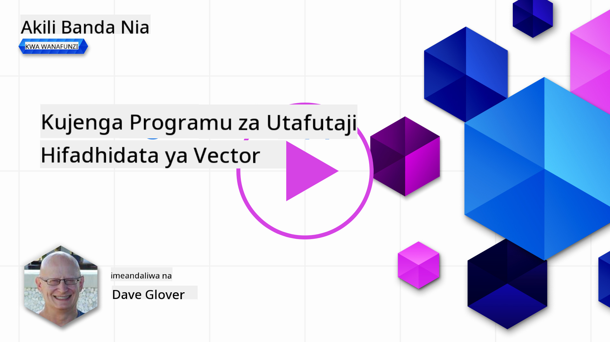
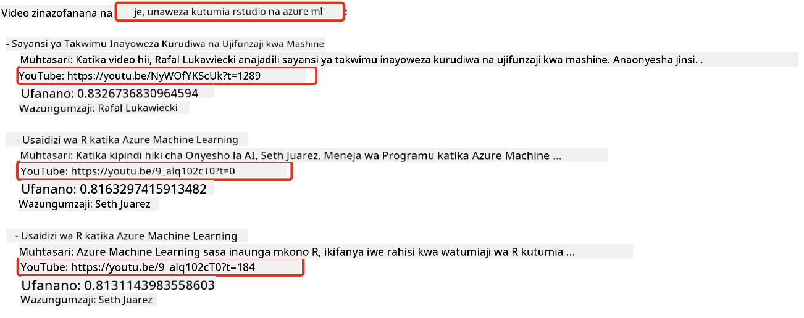
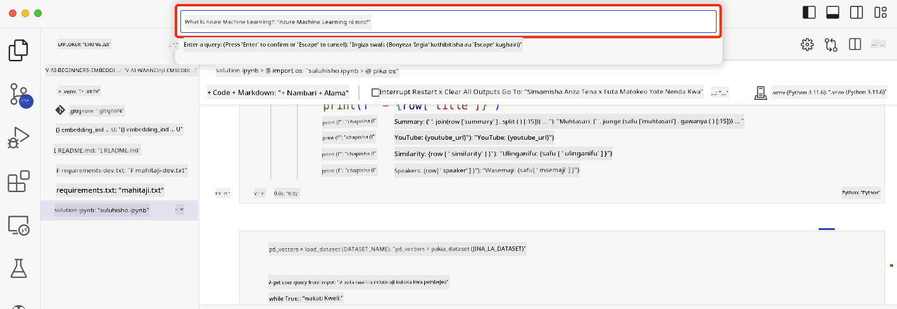

<!--
CO_OP_TRANSLATOR_METADATA:
{
  "original_hash": "d46aad0917a1a342d613e2c13d457da5",
  "translation_date": "2025-05-19T18:39:37+00:00",
  "source_file": "08-building-search-applications/README.md",
  "language_code": "sw"
}
-->
# Kujenga Programu za Utafutaji

[](https://aka.ms/gen-ai-lesson8-gh?WT.mc_id=academic-105485-koreyst)

> > _Bofya picha hapo juu kutazama video ya somo hili_

Kuna mengi zaidi kuhusu LLMs kuliko chatbots na uzalishaji wa maandishi. Inawezekana pia kujenga programu za utafutaji kwa kutumia Embeddings. Embeddings ni uwakilishi wa namba wa data pia hujulikana kama vectors, na zinaweza kutumika kwa utafutaji wa kimaana wa data.

Katika somo hili, utaenda kujenga programu ya utafutaji kwa ajili ya kuanzisha elimu yetu. Kuanzisha kwetu ni shirika lisilo la faida linalotoa elimu bure kwa wanafunzi katika nchi zinazoendelea. Kuanzisha kwetu kuna idadi kubwa ya video za YouTube ambazo wanafunzi wanaweza kutumia kujifunza kuhusu AI. Kuanzisha kwetu kunataka kujenga programu ya utafutaji inayoruhusu wanafunzi kutafuta video ya YouTube kwa kuandika swali.

Kwa mfano, mwanafunzi anaweza kuandika 'Jupyter Notebooks ni nini?' au 'Azure ML ni nini' na programu ya utafutaji itarejesha orodha ya video za YouTube zinazohusiana na swali, na bora zaidi, programu ya utafutaji itarejesha kiungo cha mahali katika video ambapo jibu la swali linapatikana.

## Utangulizi

Katika somo hili, tutashughulikia:

- Utafutaji wa Kimaana dhidi ya Utafutaji wa Maneno.
- Embeddings za Maandishi ni nini.
- Kuunda Kielezo cha Embeddings za Maandishi.
- Kutafuta Kielezo cha Embeddings za Maandishi.

## Malengo ya Kujifunza

Baada ya kumaliza somo hili, utaweza:

- Kutofautisha kati ya utafutaji wa kimaana na wa maneno.
- Kuelezea Embeddings za Maandishi ni nini.
- Kuunda programu kwa kutumia Embeddings kutafuta data.

## Kwa nini kujenga programu ya utafutaji?

Kuunda programu ya utafutaji kutakusaidia kuelewa jinsi ya kutumia Embeddings kutafuta data. Pia utajifunza jinsi ya kujenga programu ya utafutaji inayoweza kutumiwa na wanafunzi kupata habari haraka.

Somo linajumuisha Kielezo cha Embedding cha maandishi ya video za YouTube kwa kituo cha YouTube cha Microsoft [AI Show](https://www.youtube.com/playlist?list=PLlrxD0HtieHi0mwteKBOfEeOYf0LJU4O1). AI Show ni kituo cha YouTube kinachokufundisha kuhusu AI na ujifunzaji wa mashine. Kielezo cha Embedding kina Embeddings kwa kila moja ya maandishi ya video za YouTube hadi Oktoba 2023. Utatumia Kielezo cha Embedding kujenga programu ya utafutaji kwa kuanzisha kwetu. Programu ya utafutaji itarejesha kiungo cha mahali katika video ambapo jibu la swali linapatikana. Hii ni njia nzuri kwa wanafunzi kupata habari wanayohitaji haraka.

Ifuatayo ni mfano wa swali la kimaana kwa swali 'je, unaweza kutumia rstudio na azure ml?'. Angalia url ya YouTube, utaona url ina timestamp inayokupeleka mahali katika video ambapo jibu la swali linapatikana.



## Utafutaji wa kimaana ni nini?

Sasa unaweza kuwa unajiuliza, utafutaji wa kimaana ni nini? Utafutaji wa kimaana ni mbinu ya utafutaji inayotumia maana, au maana, ya maneno katika swali kurejesha matokeo yanayofaa.

Hapa kuna mfano wa utafutaji wa kimaana. Tuseme ulikuwa unatafuta kununua gari, unaweza kutafuta 'gari langu la ndoto', utafutaji wa kimaana unaelewa kuwa hauzungumzii juu ya gari, bali unatafuta kununua gari lako la ndoto. Utafutaji wa kimaana unaelewa nia yako na kurejesha matokeo yanayofaa. Njia mbadala ni ambayo ingekuwa inatafuta ndoto kuhusu magari na mara nyingi inarejesha matokeo yasiyofaa.

## Embeddings za Maandishi ni nini?

[Embeddings za maandishi](https://en.wikipedia.org/wiki/Word_embedding?WT.mc_id=academic-105485-koreyst) ni mbinu ya uwakilishi wa maandishi inayotumika katika [usindikaji wa lugha asilia](https://en.wikipedia.org/wiki/Natural_language_processing?WT.mc_id=academic-105485-koreyst). Embeddings za maandishi ni uwakilishi wa namba wa kimaana wa maandishi. Embeddings hutumiwa kuwakilisha data kwa njia ambayo ni rahisi kwa mashine kuelewa. Kuna mifano mingi ya kujenga embeddings za maandishi, katika somo hili, tutazingatia kuzalisha embeddings kwa kutumia Mfano wa Embedding wa OpenAI.

Hapa kuna mfano, fikiria maandishi yafuatayo yapo katika maandishi ya moja ya vipindi kwenye kituo cha YouTube cha AI Show:

```text
Today we are going to learn about Azure Machine Learning.
```

Tungetuma maandishi hayo kwa OpenAI Embedding API na ingerudisha embedding ifuatayo inayojumuisha namba 1536 inayojulikana kama vector. Kila namba katika vector inawakilisha kipengele tofauti cha maandishi. Kwa ufupi, hizi hapa ni namba 10 za kwanza katika vector.

```python
[-0.006655829958617687, 0.0026128944009542465, 0.008792596869170666, -0.02446001023054123, -0.008540431968867779, 0.022071078419685364, -0.010703742504119873, 0.003311325330287218, -0.011632772162556648, -0.02187200076878071, ...]
```

## Kielezo cha Embedding kinaundwaje?

Kielezo cha Embedding kwa somo hili kiliundwa kwa mfululizo wa scripts za Python. Utapata scripts pamoja na maelekezo katika [README](./scripts/README.md?WT.mc_id=academic-105485-koreyst) katika folda ya 'scripts' kwa somo hili. Huna haja ya kuendesha scripts hizi kukamilisha somo hili kwani Kielezo cha Embedding kimeandaliwa kwako.

Scripts zinafanya shughuli zifuatazo:

1. Maandishi ya kila video ya YouTube katika orodha ya kucheza ya [AI Show](https://www.youtube.com/playlist?list=PLlrxD0HtieHi0mwteKBOfEeOYf0LJU4O1) yanapakuliwa.
2. Kutumia [Functions za OpenAI](https://learn.microsoft.com/azure/ai-services/openai/how-to/function-calling?WT.mc_id=academic-105485-koreyst), jaribio linafanywa kutoa jina la msemaji kutoka dakika 3 za kwanza za maandishi ya YouTube. Jina la msemaji kwa kila video linahifadhiwa katika Kielezo cha Embedding kinachoitwa `embedding_index_3m.json`.
3. Maandishi ya maandishi yanagawanywa katika **vipande vya maandishi vya dakika 3**. Kipande kinajumuisha maneno 20 yanayofuatana kutoka kipande kinachofuata ili kuhakikisha kuwa Embedding ya kipande haikatwi na kutoa muktadha bora wa utafutaji.
4. Kila kipande cha maandishi kinasafirishwa kwa OpenAI Chat API ili kufupisha maandishi katika maneno 60. Muhtasari pia unahifadhiwa katika Kielezo cha Embedding `embedding_index_3m.json`.
5. Hatimaye, maandishi ya kipande yanatumwa kwa OpenAI Embedding API. Embedding API inarudisha vector ya namba 1536 zinazowakilisha maana ya kimaana ya kipande. Kipande pamoja na vector ya OpenAI Embedding kinahifadhiwa katika Kielezo cha Embedding `embedding_index_3m.json`.

### Hifadhidata za Vector

Kwa urahisi wa somo, Kielezo cha Embedding kinahifadhiwa katika faili ya JSON inayojulikana kama `embedding_index_3m.json` na kupakiwa katika Pandas DataFrame. Hata hivyo, katika uzalishaji, Kielezo cha Embedding kingehifadhiwa katika hifadhidata ya vector kama vile [Azure Cognitive Search](https://learn.microsoft.com/training/modules/improve-search-results-vector-search?WT.mc_id=academic-105485-koreyst), [Redis](https://cookbook.openai.com/examples/vector_databases/redis/readme?WT.mc_id=academic-105485-koreyst), [Pinecone](https://cookbook.openai.com/examples/vector_databases/pinecone/readme?WT.mc_id=academic-105485-koreyst), [Weaviate](https://cookbook.openai.com/examples/vector_databases/weaviate/readme?WT.mc_id=academic-105485-koreyst), kutaja chache tu.

## Kuelewa usawa wa cosine

Tumeelewa kuhusu embeddings za maandishi, hatua inayofuata ni kujifunza jinsi ya kutumia embeddings za maandishi kutafuta data na hasa kupata embeddings zinazofanana zaidi na swali lililotolewa kwa kutumia usawa wa cosine.

### Usawa wa cosine ni nini?

Usawa wa cosine ni kipimo cha kufanana kati ya vectors mbili, pia utasikia hii ikirejelewa kama `nearest neighbor search`. Ili kufanya utafutaji wa usawa wa cosine unahitaji _kufanya vector_ kwa maandishi ya _swali_ kwa kutumia OpenAI Embedding API. Kisha hesabu _usawa wa cosine_ kati ya vector ya swali na kila vector katika Kielezo cha Embedding. Kumbuka, Kielezo cha Embedding kina vector kwa kila kipande cha maandishi ya maandishi ya YouTube. Hatimaye, panga matokeo kwa usawa wa cosine na vipande vya maandishi vilivyo na usawa wa cosine wa juu zaidi ndivyo vinavyofanana zaidi na swali.

Kutoka kwa mtazamo wa kihesabu, usawa wa cosine hupima cosine ya pembe kati ya vectors mbili zilizoprojeka katika nafasi ya vipimo vingi. Kipimo hiki ni muhimu, kwa sababu ikiwa hati mbili ziko mbali kwa umbali wa Euclidean kwa sababu ya ukubwa, zinaweza bado kuwa na pembe ndogo kati yao na hivyo kuwa na usawa wa cosine wa juu. Kwa habari zaidi kuhusu usawa wa cosine, angalia [Usawa wa cosine](https://en.wikipedia.org/wiki/Cosine_similarity?WT.mc_id=academic-105485-koreyst).

## Kujenga programu yako ya kwanza ya utafutaji

Ifuatayo, tutaenda kujifunza jinsi ya kujenga programu ya utafutaji kwa kutumia Embeddings. Programu ya utafutaji itaruhusu wanafunzi kutafuta video kwa kuandika swali. Programu ya utafutaji itarejesha orodha ya video zinazohusiana na swali. Programu ya utafutaji pia itarejesha kiungo cha mahali katika video ambapo jibu la swali linapatikana.

Suluhisho hili lilijengwa na kujaribiwa kwenye Windows 11, macOS, na Ubuntu 22.04 kwa kutumia Python 3.10 au zaidi. Unaweza kupakua Python kutoka [python.org](https://www.python.org/downloads/?WT.mc_id=academic-105485-koreyst).

## Kazi - kujenga programu ya utafutaji, kuwawezesha wanafunzi

Tulianzisha kuanzisha kwetu mwanzoni mwa somo hili. Sasa ni wakati wa kuwawezesha wanafunzi kujenga programu ya utafutaji kwa ajili ya tathmini zao.

Katika kazi hii, utaunda Huduma za Azure OpenAI ambazo zitatumika kujenga programu ya utafutaji. Utaunda Huduma zifuatazo za Azure OpenAI. Utahitaji usajili wa Azure kukamilisha kazi hii.

### Anzisha Shell ya Azure Cloud

1. Ingia kwenye [Azure portal](https://portal.azure.com/?WT.mc_id=academic-105485-koreyst).
2. Chagua ikoni ya Cloud Shell katika kona ya juu-kulia ya Azure portal.
3. Chagua **Bash** kwa aina ya mazingira.

#### Unda kikundi cha rasilimali

> Kwa maelekezo haya, tunatumia kikundi cha rasilimali kinachoitwa "semantic-video-search" katika Mashariki mwa Marekani.
> Unaweza kubadilisha jina la kikundi cha rasilimali, lakini unapobadilisha eneo la rasilimali,
> angalia [jedwali la upatikanaji wa mifano](https://aka.ms/oai/models?WT.mc_id=academic-105485-koreyst).

```shell
az group create --name semantic-video-search --location eastus
```

#### Unda rasilimali ya Huduma ya Azure OpenAI

Kutoka kwenye Azure Cloud Shell, endesha amri ifuatayo kuunda rasilimali ya Huduma ya Azure OpenAI.

```shell
az cognitiveservices account create --name semantic-video-openai --resource-group semantic-video-search \
    --location eastus --kind OpenAI --sku s0
```

#### Pata mwisho na funguo za matumizi katika programu hii

Kutoka kwenye Azure Cloud Shell, endesha amri zifuatazo ili kupata mwisho na funguo za rasilimali ya Huduma ya Azure OpenAI.

```shell
az cognitiveservices account show --name semantic-video-openai \
   --resource-group  semantic-video-search | jq -r .properties.endpoint
az cognitiveservices account keys list --name semantic-video-openai \
   --resource-group semantic-video-search | jq -r .key1
```

#### Peleka mfano wa OpenAI Embedding

Kutoka kwenye Azure Cloud Shell, endesha amri ifuatayo ili kupeleka mfano wa OpenAI Embedding.

```shell
az cognitiveservices account deployment create \
    --name semantic-video-openai \
    --resource-group  semantic-video-search \
    --deployment-name text-embedding-ada-002 \
    --model-name text-embedding-ada-002 \
    --model-version "2"  \
    --model-format OpenAI \
    --sku-capacity 100 --sku-name "Standard"
```

## Suluhisho

Fungua [notebook ya suluhisho](../../../08-building-search-applications/python/aoai-solution.ipynb) katika GitHub Codespaces na fuata maelekezo katika Jupyter Notebook.

Unapoendesha notebook, utaombwa kuingiza swali. Kisanduku cha kuingiza kitaonekana kama hiki:



## Kazi Nzuri! Endelea Kujifunza

Baada ya kumaliza somo hili, angalia [mkusanyiko wetu wa Kujifunza AI ya Kizazi](https://aka.ms/genai-collection?WT.mc_id=academic-105485-koreyst) ili kuendelea kuongeza maarifa yako ya AI ya Kizazi!

Nenda kwenye Somo la 9 ambapo tutatazama jinsi ya [kujenga programu za kizazi cha picha](../09-building-image-applications/README.md?WT.mc_id=academic-105485-koreyst)!

**Kanusho**:  
Hati hii imetafsiriwa kwa kutumia huduma ya tafsiri ya AI [Co-op Translator](https://github.com/Azure/co-op-translator). Ingawa tunajitahidi kwa usahihi, tafadhali fahamu kwamba tafsiri za kiotomatiki zinaweza kuwa na makosa au dosari. Hati ya asili katika lugha yake ya kiasili inapaswa kuzingatiwa kama chanzo chenye mamlaka. Kwa taarifa muhimu, tafsiri ya kitaalamu ya binadamu inapendekezwa. Hatuwajibiki kwa kutoelewana au tafsiri potofu zinazotokana na matumizi ya tafsiri hii.