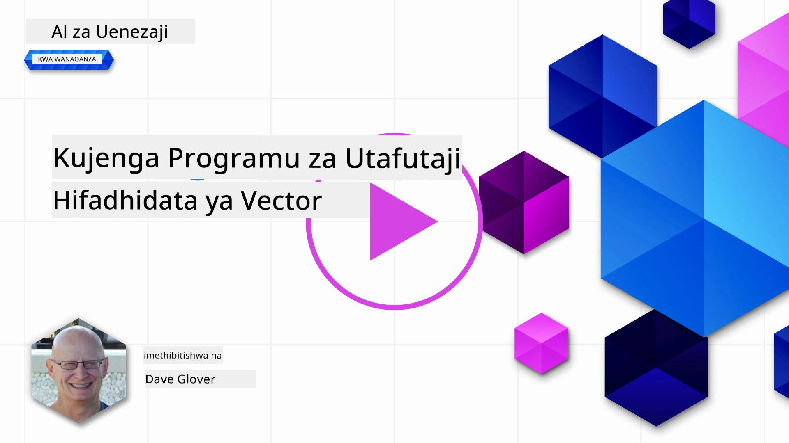
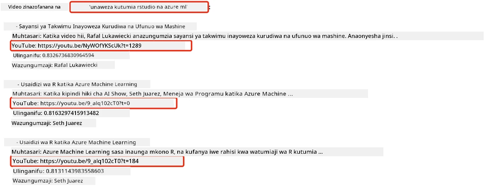
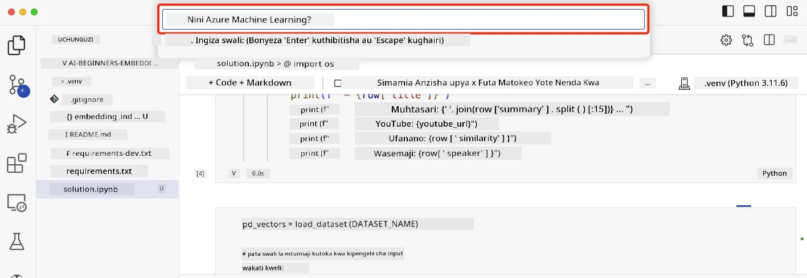

# Kujenga Programu za Utafutaji

[](https://youtu.be/W0-nzXjOjr0?si=GcsqiTTvd7RKbo7V)

> > _Bofya picha hapo juu kutazama video ya somo hili_

Kuna zaidi ya LLM kuliko roboti wa mazungumzo na kizazi cha maandishi. Pia inawezekana kujenga programu za utafutaji kwa kutumia Embeddings. Embeddings ni uwakilishi wa nambari za data unaojulikana pia kama vectors, na zinaweza kutumika kwa utafutaji wa maana kwa data.

Katika somo hili, utajenga programu ya utafutaji kwa ajili ya kuanzisha biashara yetu ya elimu. Biashara yetu ni shirika lisilo la faida linalotoa elimu ya bure kwa wanafunzi katika nchi zinazoendelea. Biashara yetu ina idadi kubwa ya video za YouTube ambazo wanafunzi wanaweza kutumia kujifunza kuhusu AI. Biashara yetu inataka kujenga programu ya utafutaji ambayo inaruhusu wanafunzi kutafuta video ya YouTube kwa kuandika swali.

Kwa mfano, mwanafunzi anaweza kuandika 'Nini ni Jupyter Notebooks?' au 'Nini ni Azure ML' na programu ya utafutaji itarudisha orodha ya video za YouTube zinazohusiana na swali, na bora zaidi, programu ya utafutaji itarudisha kiungo kwa sehemu ndani ya video ambapo jibu la swali lipo.

## Utangulizi

Katika somo hili, tutajifunza:

- Tofauti kati ya utafutaji wa maana na utafutaji wa maneno muhimu.
- Nini ni Text Embeddings.
- Kuunda Faharasa ya Text Embeddings.
- Kufanya utafutaji kwenye Faharasa ya Text Embeddings.

## Malengo ya Kujifunza

Baada ya kumaliza somo hili, utaweza:

- Tofautisha kati ya utafutaji wa maana na utafutaji wa maneno muhimu.
- Eleza ni nini Text Embeddings.
- Tengeneza programu kwa kutumia Embeddings kutafuta data.

## Kwanini kujenga programu ya utafutaji?

Kujenga programu ya utafutaji kutakusaidia kuelewa jinsi ya kutumia Embeddings kutafuta data. Pia utajifunza jinsi ya kujenga programu ya utafutaji ambayo wanafunzi wanaweza kutumia kupata taarifa kwa haraka.

Somo linajumuisha Faharasa ya Embedding ya manukuu za YouTube za kituo cha [AI Show](https://www.youtube.com/playlist?list=PLlrxD0HtieHi0mwteKBOfEeOYf0LJU4O1) cha YouTube cha Microsoft. AI Show ni kituo cha YouTube kinachokufundisha kuhusu AI na ujifunzaji wa mashine. Faharasa ya Embedding ina Embeddings za kila manukuu ya YouTube hadi Oktoba 2023. Utatumia Faharasa ya Embedding kujenga programu ya utafutaji kwa ajili ya startup yetu. Programu ya utafutaji itarudisha kiungo kwa sehemu ndani ya video ambapo jibu la swali lipo. Huu ni njia nzuri kwa wanafunzi kupata taarifa wanazohitaji kwa haraka.

Hapa chini ni mfano wa swali la maana kuhusu swali 'je, unaweza kutumia rstudio na azure ml?'. Angalia URL ya YouTube, utaona URL ina timestamp inayokupeleka sehemu ndani ya video ambapo jibu la swali lipo.



## Utafutaji wa maana ni nini?

Sasa unaweza kuwa unajiuliza, utafutaji wa maana ni nini? Utafutaji wa maana ni mbinu ya utafutaji inayotumia maana, au semantiki, ya maneno katika swali ili kurudisha matokeo yanayohusiana.

Hapa kuna mfano wa utafutaji wa maana. Tukisema unatafuta kununua gari, unaweza kutafuta 'gari la ndoto yangu', utafutaji wa maana unaelewa kuwa hutaota juu ya gari, bali unatafuta kununua gari lako la 'kila mtu analomani'. Utafutaji wa maana unaelewa nia yako na unarudisha matokeo yanayohusiana. Mbali na hiyo ni utafutaji wa maneno muhimu ambao utafuta namba halisi za maneno kama ndoto juu ya magari na mara nyingi hurudisha matokeo yasiyohusiana.

## Nini ni Text Embeddings?

[Text embeddings](https://en.wikipedia.org/wiki/Word_embedding?WT.mc_id=academic-105485-koreyst) ni mbinu ya uwakilishi wa maandishi inayotumika katika [usindikaji wa lugha ya asili](https://en.wikipedia.org/wiki/Natural_language_processing?WT.mc_id=academic-105485-koreyst). Text embeddings ni uwakilishi wa nambari wenye maana ya maandishi. Embeddings hutumiwa kuwasilisha data kwa njia inayoweza kueleweka kwa urahisi na mashine. Kuna modeli nyingi za kujenga text embeddings, katika somo hili, tutazingatia kuzalisha embeddings kwa kutumia OpenAI Embedding Model.

Hapa ni mfano, fikiria maandishi yafuatayo yamo katika manukuu kutoka mojawapo ya vipindi katika kituo cha AI Show cha YouTube:

```text
Today we are going to learn about Azure Machine Learning.
```

Tutapeleka maandishi kwa OpenAI Embedding API na itarudisha embedding ifuatayo yenye nambari 1536 inayojulikana kama vector. Kila nambari katika vector inaonyesha kipengele tofauti cha maandishi. Kwa ufupi, hapa kuna nambari 10 za kwanza katika vector.

```python
[-0.006655829958617687, 0.0026128944009542465, 0.008792596869170666, -0.02446001023054123, -0.008540431968867779, 0.022071078419685364, -0.010703742504119873, 0.003311325330287218, -0.011632772162556648, -0.02187200076878071, ...]
```

## Jinsi Faharasa ya Embedding inavyotengenezwa?

Faharasa ya Embedding kwa somo hili ilitengenezwa kwa mfululizo wa skiripti za Python. Utapata skiripti pamoja na maagizo katika [README](./scripts/README.md?WT.mc_id=academic-105485-koreyst) kwenye folda ya 'scripts' kwa somo hili. Huna haja ya kuendesha skiripti hizi kumaliza somo hili kwani Faharasa ya Embedding imetolewa tayari kwa ajili yako.

Skiripti zinafanya shughuli zifuatazo:

1. Manukuu ya kila video ya YouTube katika orodha ya [AI Show](https://www.youtube.com/playlist?list=PLlrxD0HtieHi0mwteKBOfEeOYf0LJU4O1) hupakuliwa.
2. Kwa kutumia [OpenAI Functions](https://learn.microsoft.com/azure/ai-foundry/openai/how-to/function-calling?WT.mc_id=academic-105485-koreyst), jaribio hufanywa kutoa jina la mzungumzaji kutoka kwa dakika 3 za mwanzo za manukuu ya YouTube. Jina la mzungumzaji kwa kila video linaandikwa katika Faharasa ya Embedding inayoitwa `embedding_index_3m.json`.
3. Maandishi ya manukuu hugawanywa katika **vipindi vya dakika 3** vya maandishi. Kipindi kina maneno takriban 20 yanayochanganyika kutoka sehemu inayofuata kuhakikisha kuwa Embedding ya kipindi haiyakatwi na kutoa muktadha bora wa utafutaji.
4. Kila kipindi cha maandishi hupitishwa kwa OpenAI Chat API ili kufupisha maandishi kufikia maneno 60. Muhtasari pia unaandikwa katika Faharasa ya Embedding `embedding_index_3m.json`.
5. Mwishowe, maandishi ya kipindi hupitishwa kwa OpenAI Embedding API. API ya Embedding inarudisha vector yenye nambari 1536 zinazoonyesha maana ya kihisia ya kipindi. Kipindi pamoja na vector ya OpenAI Embedding huhifadhiwa katika Faharasa ya Embedding `embedding_index_3m.json`.

### Hifadhidata za Vector

Kwa urahisi wa somo, Faharasa ya Embedding huhifadhiwa kama faili la JSON linaloitwa `embedding_index_3m.json` na kuingizwa DataFrame ya Pandas. Hata hivyo, katika uzalishaji, Faharasa ya Embedding itahifadhiwa katika hifadhidata ya vector kama [Azure Cognitive Search](https://learn.microsoft.com/training/modules/improve-search-results-vector-search?WT.mc_id=academic-105485-koreyst), [Redis](https://cookbook.openai.com/examples/vector_databases/redis/readme?WT.mc_id=academic-105485-koreyst), [Pinecone](https://cookbook.openai.com/examples/vector_databases/pinecone/readme?WT.mc_id=academic-105485-koreyst), [Weaviate](https://cookbook.openai.com/examples/vector_databases/weaviate/readme?WT.mc_id=academic-105485-koreyst), na zingine.

## Kuelewa usawa wa cosine

Tumejifunza kuhusu text embeddings, hatua inayofuata ni kujifunza jinsi ya kutumia text embeddings kutafuta data na hasa kupata embeddings zinazofanana zaidi na swali kwa kutumia usawa wa cosine.

### Usawa wa cosine ni nini?

Usawa wa cosine ni kipimo cha ujirani kati ya vectors mbili, pia utasikia kinaitwa `utaftaji wa jirani wa karibu`. Kufanya utafutaji wa usawa wa cosine unahitaji _kugeuza vectori_ kwa maandishi ya _swali_ kwa kutumia OpenAI Embedding API. Kisha hesabu _usawa wa cosine_ kati ya vector ya swali na kila vector katika Faharasa ya Embedding. Kumbuka, Faharasa ya Embedding ina vector kwa kila sehemu ya maandishi ya manukuu ya YouTube. Mwisho, panga matokeo kwa usawa wa cosine na sehemu za maandishi zenye usawa wa cosine wa juu ndizo zinazofanana zaidi na swali.

Kutoka kwa mtazamo wa hisabati, usawa wa cosine unapima cosine ya pembe kati ya vectors mbili zilizoonyeshwa katika nafasi ya mwelekeo mingi. Kipimo hiki kina manufaa, kwa sababu kama hati mbili ziko mbali kwa umbali wa Euclidean kwa sababu ya ukubwa, bado zinaweza kuwa na pembe ndogo kati yao na hivyo usawa wa cosine wa juu. Kwa habari zaidi kuhusu mizee ya usawa wa cosine, angalia [Usawa wa cosine](https://en.wikipedia.org/wiki/Cosine_similarity?WT.mc_id=academic-105485-koreyst).

## Kujenga programu yako ya kwanza ya utafutaji

Sasa, tutaenda kujifunza jinsi ya kujenga programu ya utafutaji kwa kutumia Embeddings. Programu ya utafutaji itaruhusu wanafunzi kutafuta video kwa kuandika swali. Programu ya utafutaji itarudisha orodha ya video zinazohusiana na swali. Programu ya utafutaji pia itarudisha kiungo kwenye sehemu ndani ya video ambapo jibu la swali lipo.

Suluhisho hili lilijengwa na kujaribiwa kwenye Windows 11, macOS, na Ubuntu 22.04 kwa kutumia Python 3.10 au baadaye. Unaweza kupakua Python kutoka [python.org](https://www.python.org/downloads/?WT.mc_id=academic-105485-koreyst).

## Kazi ya nyumbani - kujenga programu ya utafutaji, kuwezesha wanafunzi

Tulielezea startup yetu mwanzoni mwa somo hili. Sasa ni wakati wa kuwezesha wanafunzi kujenga programu ya utafutaji kwa ajili ya tathmini zao.

Katika kazi hii utaunda Huduma za Azure OpenAI ambazo zitatumika kujenga programu ya utafutaji. Utaunda Huduma zifuatazo za Azure OpenAI. Utahitaji usajili wa Azure kumaliza kazi hii.

### Anza Azure Cloud Shell

1. Ingia kwenye [portal ya Azure](https://portal.azure.com/?WT.mc_id=academic-105485-koreyst).
2. Chagua ikoni ya Cloud Shell upande wa juu kulia wa portal ya Azure.
3. Chagua **Bash** kwa aina ya mazingira.

#### Tengeneza kikundi cha rasilimali

> Kwa maelekezo haya, tunatumia kikundi cha rasilimali kinachoitwa "semantic-video-search" katika East US.
> Unaweza kubadilisha jina la kikundi cha rasilimali, lakini unapobadilisha eneo la rasilimali,
> angalia [jedwali la upatikanaji wa modeli](https://aka.ms/oai/models?WT.mc_id=academic-105485-koreyst).

```shell
az group create --name semantic-video-search --location eastus
```

#### Tengeneza rasilimali ya Huduma ya Azure OpenAI

Kutoka Azure Cloud Shell, endesha amri ifuatayo kutengeneza rasilimali ya Huduma ya Azure OpenAI.

```shell
az cognitiveservices account create --name semantic-video-openai --resource-group semantic-video-search \
    --location eastus --kind OpenAI --sku s0
```

#### Pata anwani na funguo za matumizi katika programu hii

Kutoka Azure Cloud Shell, endesha amri zifuatazo kupata anwani na funguo za rasilimali ya Huduma ya Azure OpenAI.

```shell
az cognitiveservices account show --name semantic-video-openai \
   --resource-group  semantic-video-search | jq -r .properties.endpoint
az cognitiveservices account keys list --name semantic-video-openai \
   --resource-group semantic-video-search | jq -r .key1
```

#### Sambaza modeli ya OpenAI Embedding

Kutoka Azure Cloud Shell, endesha amri ifuatayo kusambaza modeli ya OpenAI Embedding.

```shell
az cognitiveservices account deployment create \
    --name semantic-video-openai \
    --resource-group  semantic-video-search \
    --deployment-name text-embedding-ada-002 \
    --model-name text-embedding-ada-002 \
    --model-version "2"  \
    --model-format OpenAI \
    --sku-capacity 100 --sku-name "Standard"
```

## Suluhisho

Fungua [daftari la suluhisho](./python/aoai-solution.ipynb?WT.mc_id=academic-105485-koreyst) katika GitHub Codespaces na fuata maelekezo katika Jupyter Notebook.

Unapoendesha daftari, utaombwa kuingiza swali. Kisanduku cha ingizo kitaonekana kama hiki:



## Kazi nzuri! Endelea Kujifunza

Baada ya kumaliza somo hili, angalia [mkusanyiko wetu wa Kujifunza AI Janitivi](https://aka.ms/genai-collection?WT.mc_id=academic-105485-koreyst) kuendelea kuinua maarifa yako ya AI Janitivi!

Nenda kwenye Somo la 9 ambapo tutaangalia jinsi ya [kujenga programu za kizazi cha picha](../09-building-image-applications/README.md?WT.mc_id=academic-105485-koreyst)!

---

<!-- CO-OP TRANSLATOR DISCLAIMER START -->
**Kionyozo**:
Hati hii imetafsiriwa kwa kutumia huduma ya tafsiri ya AI [Co-op Translator](https://github.com/Azure/co-op-translator). Ingawa tunajitahidi kupata usahihi, tafadhali fahamu kwamba tafsiri za kiotomatiki zinaweza kuwa na makosa au upungufu wa usahihi. Hati ya asili katika lugha yake halisi inapaswa kuchukuliwa kama chanzo cha mamlaka. Kwa taarifa muhimu, tafsiri ya kitaalamu inayofanywa na binadamu inapendekezwa. Hatutojibu kwa kuelewa vibaya au tafsiri potofu zinazotokea kutokana na matumizi ya tafsiri hii.
<!-- CO-OP TRANSLATOR DISCLAIMER END -->