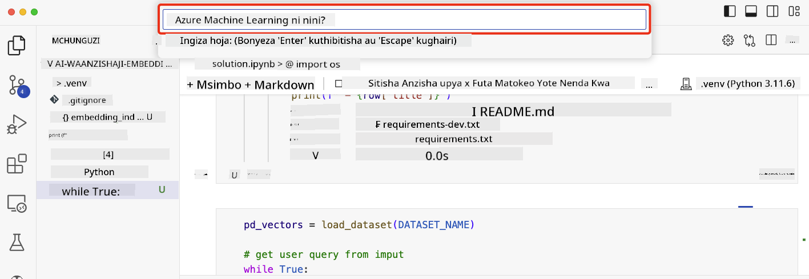

<!--
CO_OP_TRANSLATOR_METADATA:
{
  "original_hash": "d46aad0917a1a342d613e2c13d457da5",
  "translation_date": "2025-07-09T13:00:16+00:00",
  "source_file": "08-building-search-applications/README.md",
  "language_code": "sw"
}
-->
# Kujenga Programu za Utafutaji

[](https://aka.ms/gen-ai-lesson8-gh?WT.mc_id=academic-105485-koreyst)

> > _Bonyeza picha hapo juu kutazama video ya somo hili_

LLM siyo tu kwa ajili ya chatbots na uundaji wa maandishi. Pia inawezekana kujenga programu za utafutaji kwa kutumia Embeddings. Embeddings ni uwakilishi wa nambari wa data unaojulikana pia kama vectors, na unaweza kutumika kwa utafutaji wa maana ya data.

Katika somo hili, utajenga programu ya utafutaji kwa ajili ya startup yetu ya elimu. Startup yetu ni shirika lisilo la faida linalotoa elimu bure kwa wanafunzi katika nchi zinazoendelea. Startup yetu ina idadi kubwa ya video za YouTube ambazo wanafunzi wanaweza kutumia kujifunza kuhusu AI. Startup yetu inataka kujenga programu ya utafutaji inayowaruhusu wanafunzi kutafuta video za YouTube kwa kuandika swali.

Kwa mfano, mwanafunzi anaweza kuandika 'Jupyter Notebooks ni nini?' au 'Azure ML ni nini' na programu ya utafutaji itarudisha orodha ya video za YouTube zinazohusiana na swali hilo, na zaidi ya hayo, programu ya utafutaji itarudisha kiungo cha sehemu ya video ambapo jibu la swali hilo liko.

## Utangulizi

Katika somo hili, tutashughulikia:

- Utafutaji wa maana dhidi ya utafutaji wa maneno muhimu.
- Embeddings za Maandishi ni nini.
- Kuunda Kielekezi cha Embeddings za Maandishi.
- Kutafuta katika Kielekezi cha Embeddings za Maandishi.

## Malengo ya Kujifunza

Baada ya kumaliza somo hili, utaweza:

- Tofautisha kati ya utafutaji wa maana na utafutaji wa maneno muhimu.
- Eleza ni nini Embeddings za Maandishi.
- Tengeneza programu kwa kutumia Embeddings kutafuta data.

## Kwa nini kujenga programu ya utafutaji?

Kujenga programu ya utafutaji kutakusaidia kuelewa jinsi ya kutumia Embeddings kutafuta data. Pia utajifunza jinsi ya kujenga programu ya utafutaji ambayo wanafunzi wanaweza kutumia kupata taarifa haraka.

Somo hili linajumuisha Kielekezi cha Embeddings cha manukuu ya YouTube kwa ajili ya kituo cha Microsoft [AI Show](https://www.youtube.com/playlist?list=PLlrxD0HtieHi0mwteKBOfEeOYf0LJU4O1). AI Show ni kituo cha YouTube kinachokufundisha kuhusu AI na ujifunzaji wa mashine. Kielekezi cha Embeddings kina Embeddings za kila manukuu ya YouTube hadi Oktoba 2023. Utatumia Kielekezi hiki kujenga programu ya utafutaji kwa startup yetu. Programu ya utafutaji itarudisha kiungo cha sehemu ya video ambapo jibu la swali liko. Hii ni njia nzuri kwa wanafunzi kupata taarifa wanazohitaji haraka.

Hapa chini ni mfano wa swali la maana kwa swali 'je, unaweza kutumia rstudio na azure ml?'. Angalia url ya YouTube, utaona url ina alama ya wakati inayokupeleka sehemu ya video ambapo jibu la swali liko.


## Utafutaji wa maana ni nini?

Sasa unaweza kuwa unajiuliza, utafutaji wa maana ni nini? Utafutaji wa maana ni mbinu ya utafutaji inayotumia maana ya maneno katika swali ili kurudisha matokeo yanayofaa.

Hapa kuna mfano wa utafutaji wa maana. Tuseme unatafuta kununua gari, unaweza kutafuta 'gari la ndoto yangu', utafutaji wa maana unaelewa kuwa huna `ndoto` kuhusu gari, bali unatafuta kununua gari lako `linalokufaa`. Utafutaji wa maana unaelewa nia yako na kurudisha matokeo yanayofaa. Mbali na hilo ni `utafutaji wa maneno muhimu` ambao uta tafuta neno moja kwa moja na mara nyingi hurudisha matokeo yasiyohusiana.

## Embeddings za Maandishi ni nini?

[Embeddings za maandishi](https://en.wikipedia.org/wiki/Word_embedding?WT.mc_id=academic-105485-koreyst) ni mbinu ya uwakilishi wa maandishi inayotumika katika [usindikaji wa lugha asilia](https://en.wikipedia.org/wiki/Natural_language_processing?WT.mc_id=academic-105485-koreyst). Embeddings za maandishi ni uwakilishi wa nambari wa maana ya maandishi. Embeddings hutumika kuwakilisha data kwa njia ambayo ni rahisi kwa mashine kuelewa. Kuna mifano mingi ya kujenga embeddings za maandishi, katika somo hili, tutazingatia kuzalisha embeddings kwa kutumia Mfano wa OpenAI Embedding.

Hapa kuna mfano, fikiria maandishi yafuatayo ni katika manukuu ya moja ya vipindi kwenye kituo cha AI Show cha YouTube:

```text
Today we are going to learn about Azure Machine Learning.
```

Tutapita maandishi hayo kwa API ya OpenAI Embedding na itarudisha embedding ifuatayo yenye nambari 1536 inayojulikana kama vector. Kila nambari katika vector inawakilisha kipengele tofauti cha maandishi. Kwa ufupi, hapa ni nambari 10 za kwanza katika vector.

```python
[-0.006655829958617687, 0.0026128944009542465, 0.008792596869170666, -0.02446001023054123, -0.008540431968867779, 0.022071078419685364, -0.010703742504119873, 0.003311325330287218, -0.011632772162556648, -0.02187200076878071, ...]
```

## Jinsi Kielekezi cha Embedding kinavyoundwa?

Kielekezi cha Embedding kwa somo hili kilitengenezwa kwa mfululizo wa scripts za Python. Utapata scripts pamoja na maelekezo katika [README](./scripts/README.md?WT.mc_id=academic-105485-koreyst) katika folda ya 'scripts' kwa somo hili. Huhitaji kuendesha scripts hizi kumaliza somo hili kwani Kielekezi cha Embedding kimekwisha tolewa kwako.

Scripts hufanya yafuatayo:

1. Manukuu ya kila video ya YouTube katika orodha ya [AI Show](https://www.youtube.com/playlist?list=PLlrxD0HtieHi0mwteKBOfEeOYf0LJU4O1) yanapakuliwa.
2. Kwa kutumia [OpenAI Functions](https://learn.microsoft.com/azure/ai-services/openai/how-to/function-calling?WT.mc_id=academic-105485-koreyst), jaribio hufanywa kutoa jina la msemaji kutoka kwa dakika 3 za mwanzo za manukuu ya YouTube. Jina la msemaji kwa kila video linahifadhiwa katika Kielekezi cha Embedding kinachoitwa `embedding_index_3m.json`.
3. Maandishi ya manukuu yanagawanywa katika **vipindi vya dakika 3**. Kipindi kina maneno takriban 20 yanayojirudia kutoka kipindi kinachofuata ili kuhakikisha Embedding ya kipindi haikatwi na kutoa muktadha bora wa utafutaji.
4. Kila kipindi cha maandishi kinarudishwa kwa OpenAI Chat API ili kufupisha maandishi hadi maneno 60. Muhtasari pia unahifadhiwa katika Kielekezi cha Embedding `embedding_index_3m.json`.
5. Mwisho, maandishi ya kipindi yanapita kwa OpenAI Embedding API. API ya Embedding inarudisha vector ya nambari 1536 inayowakilisha maana ya kipindi. Kipindi pamoja na vector ya OpenAI Embedding vinahifadhiwa katika Kielekezi cha Embedding `embedding_index_3m.json`.

### Hifadhidata za Vector

Kwa urahisi wa somo, Kielekezi cha Embedding kinahifadhiwa katika faili la JSON linaloitwa `embedding_index_3m.json` na kupakiwa katika Pandas DataFrame. Hata hivyo, katika uzalishaji, Kielekezi cha Embedding kingehifadhiwa katika hifadhidata ya vector kama vile [Azure Cognitive Search](https://learn.microsoft.com/training/modules/improve-search-results-vector-search?WT.mc_id=academic-105485-koreyst), [Redis](https://cookbook.openai.com/examples/vector_databases/redis/readme?WT.mc_id=academic-105485-koreyst), [Pinecone](https://cookbook.openai.com/examples/vector_databases/pinecone/readme?WT.mc_id=academic-105485-koreyst), [Weaviate](https://cookbook.openai.com/examples/vector_databases/weaviate/readme?WT.mc_id=academic-105485-koreyst), na zingine kadhaa.

## Kuelewa Cosine Similarity

Tumejifunza kuhusu embeddings za maandishi, hatua inayofuata ni kujifunza jinsi ya kutumia embeddings za maandishi kutafuta data na hasa kupata embeddings zinazofanana zaidi na swali fulani kwa kutumia cosine similarity.

### Cosine similarity ni nini?

Cosine similarity ni kipimo cha kufanana kati ya vectors mbili, pia utaona hii ikitajwa kama `utafutaji wa jirani wa karibu`. Kufanya utafutaji wa cosine similarity unahitaji _kuweka vector_ kwa maandishi ya _swali_ kwa kutumia OpenAI Embedding API. Kisha hesabu _cosine similarity_ kati ya vector ya swali na kila vector katika Kielekezi cha Embedding. Kumbuka, Kielekezi cha Embedding kina vector kwa kila kipindi cha manukuu ya video ya YouTube. Mwisho, panga matokeo kwa cosine similarity na vipindi vya maandishi vyenye cosine similarity ya juu ni vinavyofanana zaidi na swali.

Kwa mtazamo wa hisabati, cosine similarity hupima cosine ya pembe kati ya vectors mbili zilizopangwa katika nafasi ya vipimo vingi. Kipimo hiki ni muhimu, kwa sababu kama hati mbili ziko mbali kwa umbali wa Euclidean kwa sababu ya ukubwa, bado zinaweza kuwa na pembe ndogo kati yao na hivyo cosine similarity kubwa. Kwa maelezo zaidi kuhusu mlinganyo wa cosine similarity, angalia [Cosine similarity](https://en.wikipedia.org/wiki/Cosine_similarity?WT.mc_id=academic-105485-koreyst).

## Kujenga programu yako ya kwanza ya utafutaji

Sasa, tutaenda kujifunza jinsi ya kujenga programu ya utafutaji kwa kutumia Embeddings. Programu ya utafutaji itaruhusu wanafunzi kutafuta video kwa kuandika swali. Programu ya utafutaji itarudisha orodha ya video zinazohusiana na swali. Programu ya utafutaji pia itarudisha kiungo cha sehemu ya video ambapo jibu la swali liko.

Suluhisho hili lilijengwa na kujaribiwa kwenye Windows 11, macOS, na Ubuntu 22.04 kwa kutumia Python 3.10 au zaidi. Unaweza kupakua Python kutoka [python.org](https://www.python.org/downloads/?WT.mc_id=academic-105485-koreyst).

## Kazi ya nyumbani - kujenga programu ya utafutaji, kuwezesha wanafunzi

Tulianzisha startup yetu mwanzoni mwa somo hili. Sasa ni wakati wa kuwezesha wanafunzi kujenga programu ya utafutaji kwa ajili ya tathmini zao.

Katika kazi hii, utaunda Huduma za Azure OpenAI ambazo zitatumika kujenga programu ya utafutaji. Utaunda Huduma zifuatazo za Azure OpenAI. Utahitaji usajili wa Azure kumaliza kazi hii.

### Anzisha Azure Cloud Shell

1. Ingia kwenye [Azure portal](https://portal.azure.com/?WT.mc_id=academic-105485-koreyst).
2. Chagua ikoni ya Cloud Shell upande wa juu kulia wa Azure portal.
3. Chagua **Bash** kwa aina ya mazingira.

#### Unda kundi la rasilimali

> Kwa maelekezo haya, tunatumia kundi la rasilimali linaloitwa "semantic-video-search" katika East US.
> Unaweza kubadilisha jina la kundi la rasilimali, lakini unapobadilisha eneo la rasilimali,
> angalia [jedwali la upatikanaji wa modeli](https://aka.ms/oai/models?WT.mc_id=academic-105485-koreyst).

```shell
az group create --name semantic-video-search --location eastus
```

#### Unda rasilimali ya Azure OpenAI Service

Kutoka Azure Cloud Shell, endesha amri ifuatayo kuunda rasilimali ya Azure OpenAI Service.

```shell
az cognitiveservices account create --name semantic-video-openai --resource-group semantic-video-search \
    --location eastus --kind OpenAI --sku s0
```

#### Pata endpoint na funguo za matumizi katika programu hii

Kutoka Azure Cloud Shell, endesha amri zifuatazo kupata endpoint na funguo za rasilimali ya Azure OpenAI Service.

```shell
az cognitiveservices account show --name semantic-video-openai \
   --resource-group  semantic-video-search | jq -r .properties.endpoint
az cognitiveservices account keys list --name semantic-video-openai \
   --resource-group semantic-video-search | jq -r .key1
```

#### Sambaza mfano wa OpenAI Embedding

Kutoka Azure Cloud Shell, endesha amri ifuatayo kusambaza mfano wa OpenAI Embedding.

```shell
az cognitiveservices account deployment create \
    --name semantic-video-openai \
    --resource-group  semantic-video-search \
    --deployment-name text-embedding-ada-002 \
    --model-name text-embedding-ada-002 \
    --model-version "2"  \
    --model-format OpenAI \
    --sku-capacity 100 --sku-name "Standard"
```

## Suluhisho

Fungua [daftari la suluhisho](../../../08-building-search-applications/python/aoai-solution.ipynb) katika GitHub Codespaces na fuata maelekezo katika Jupyter Notebook.

Unapoendesha daftari, utaombwa kuingiza swali. Kisanduku cha kuingiza kitaonekana kama hiki:



## Kazi nzuri! Endelea Kujifunza

Baada ya kumaliza somo hili, angalia [Mkusanyiko wetu wa Kujifunza AI ya Kizazi](https://aka.ms/genai-collection?WT.mc_id=academic-105485-koreyst) ili kuendelea kuongeza ujuzi wako wa AI ya Kizazi!

Nenda kwenye Somo la 9 ambapo tutaangalia jinsi ya [kujenga programu za uundaji picha](../09-building-image-applications/README.md?WT.mc_id=academic-105485-koreyst)!

**Kiarifu cha Kutotegemea**:  
Hati hii imetafsiriwa kwa kutumia huduma ya tafsiri ya AI [Co-op Translator](https://github.com/Azure/co-op-translator). Ingawa tunajitahidi kwa usahihi, tafadhali fahamu kwamba tafsiri za kiotomatiki zinaweza kuwa na makosa au upungufu wa usahihi. Hati ya asili katika lugha yake ya asili inapaswa kuchukuliwa kama chanzo cha mamlaka. Kwa taarifa muhimu, tafsiri ya kitaalamu inayofanywa na binadamu inapendekezwa. Hatubebei dhamana kwa kutoelewana au tafsiri potofu zinazotokana na matumizi ya tafsiri hii.