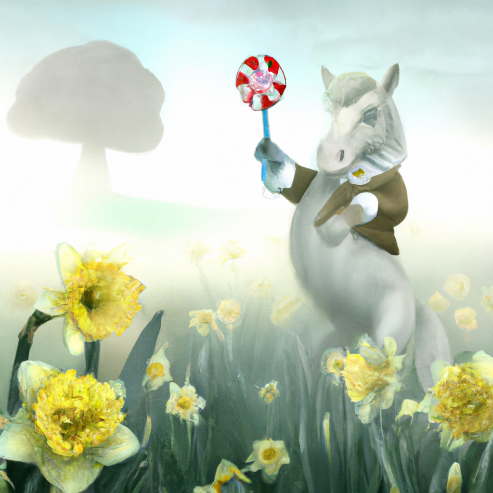

<!--
CO_OP_TRANSLATOR_METADATA:
{
  "original_hash": "7a655f30d1dcbdfe6eff2558eff249af",
  "translation_date": "2025-06-25T17:30:47+00:00",
  "source_file": "09-building-image-applications/README.md",
  "language_code": "sw"
}
-->
# Kujenga Programu za Uzalishaji wa Picha

[](https://aka.ms/gen-ai-lesson9-gh?WT.mc_id=academic-105485-koreyst)

Kuna zaidi kwa LLMs kuliko uzalishaji wa maandishi. Pia inawezekana kuzalisha picha kutoka kwa maelezo ya maandishi. Kuwa na picha kama njia inaweza kuwa muhimu sana katika maeneo kadhaa kutoka MedTech, usanifu, utalii, maendeleo ya michezo na zaidi. Katika sura hii, tutaangalia mifano miwili maarufu ya uzalishaji wa picha, DALL-E na Midjourney.

## Utangulizi

Katika somo hili, tutajadili:

- Uzalishaji wa picha na kwa nini ni muhimu.
- DALL-E na Midjourney, ni nini na jinsi zinavyofanya kazi.
- Jinsi unavyoweza kujenga programu ya uzalishaji wa picha.

## Malengo ya Kujifunza

Baada ya kukamilisha somo hili, utaweza:

- Kujenga programu ya uzalishaji wa picha.
- Kufafanua mipaka ya programu yako kwa kutumia maelekezo ya meta.
- Kufanya kazi na DALL-E na Midjourney.

## Kwa nini kujenga programu ya uzalishaji wa picha?

Programu za uzalishaji wa picha ni njia nzuri ya kuchunguza uwezo wa AI ya Kizazi. Zinaweza kutumika kwa mfano:

- **Uhariri na usanisi wa picha**. Unaweza kuzalisha picha kwa matumizi mbalimbali, kama vile uhariri wa picha na usanisi wa picha.

- **Kutumika katika sekta mbalimbali**. Pia zinaweza kutumika kuzalisha picha kwa sekta mbalimbali kama Medtech, Utalii, Maendeleo ya michezo na zaidi.

## Hali: Edu4All

Kama sehemu ya somo hili, tutaendelea kufanya kazi na kampuni yetu changa, Edu4All, katika somo hili. Wanafunzi wataunda picha kwa tathmini zao, ni picha gani ni juu ya wanafunzi, lakini zinaweza kuwa vielelezo vya hadithi yao ya hadithi au kuunda mhusika mpya kwa hadithi yao au kuwasaidia kuona mawazo na dhana zao.

Hapa kuna kile wanafunzi wa Edu4All wanaweza kuzalisha kwa mfano ikiwa wanafanya kazi darasani kwenye makaburi:


kutumia maelekezo kama

> "Mbwa karibu na Mnara wa Eiffel asubuhi mapema katika mwanga wa jua"

## DALL-E na Midjourney ni nini?

[DALL-E](https://openai.com/dall-e-2?WT.mc_id=academic-105485-koreyst) na [Midjourney](https://www.midjourney.com/?WT.mc_id=academic-105485-koreyst) ni mifano miwili maarufu ya uzalishaji wa picha, zinakuwezesha kutumia maelekezo kuzalisha picha.

### DALL-E

Tuanzie na DALL-E, ambayo ni mfano wa AI ya Kizazi ambao huzalisha picha kutoka kwa maelezo ya maandishi.

> [DALL-E ni mchanganyiko wa mifano miwili, CLIP na diffused attention](https://towardsdatascience.com/openais-dall-e-and-clip-101-a-brief-introduction-3a4367280d4e?WT.mc_id=academic-105485-koreyst).

- **CLIP**, ni mfano unaozalisha embeddings, ambazo ni uwakilishi wa data kwa njia ya nambari, kutoka kwa picha na maandishi.

- **Diffused attention**, ni mfano unaozalisha picha kutoka kwa embeddings. DALL-E imefundishwa kwenye seti ya data ya picha na maandishi na inaweza kutumika kuzalisha picha kutoka kwa maelezo ya maandishi. Kwa mfano, DALL-E inaweza kutumika kuzalisha picha za paka aliyevaa kofia, au mbwa mwenye mohawk.

### Midjourney

Midjourney inafanya kazi kwa njia sawa na DALL-E, inazalisha picha kutoka kwa maelekezo ya maandishi. Midjourney, pia inaweza kutumika kuzalisha picha kwa kutumia maelekezo kama "paka aliyevaa kofia", au "mbwa mwenye mohawk".


_Cred ya picha Wikipedia, picha iliyozalishwa na Midjourney_

## Jinsi DALL-E na Midjourney Zinavyofanya Kazi

Kwanza, [DALL-E](https://arxiv.org/pdf/2102.12092.pdf?WT.mc_id=academic-105485-koreyst). DALL-E ni mfano wa AI ya Kizazi unaotegemea usanifu wa transformer na _autoregressive transformer_.

_Autoregressive transformer_ inafafanua jinsi mfano unavyozalisha picha kutoka kwa maelezo ya maandishi, inazalisha pikseli moja kwa wakati, na kisha kutumia pikseli zilizozalishwa kuzalisha pikseli inayofuata. Kupitia tabaka nyingi katika mtandao wa neva, hadi picha ikamilike.

Kwa mchakato huu, DALL-E, inadhibiti sifa, vitu, tabia, na zaidi katika picha inayoizalisha. Hata hivyo, DALL-E 2 na 3 zina udhibiti zaidi juu ya picha inayozalishwa.

## Kujenga programu yako ya kwanza ya uzalishaji wa picha

Kwa hiyo inachukua nini kujenga programu ya uzalishaji wa picha? Unahitaji maktaba zifuatazo:

- **python-dotenv**, inashauriwa sana kutumia maktaba hii kuweka siri zako kwenye faili ya _.env_ mbali na msimbo.
- **openai**, maktaba hii ndiyo utakayotumia kuingiliana na API ya OpenAI.
- **pillow**, kufanya kazi na picha katika Python.
- **requests**, kusaidia kufanya maombi ya HTTP.

1. Unda faili _.env_ yenye maudhui yafuatayo:

   ```text
   AZURE_OPENAI_ENDPOINT=<your endpoint>
   AZURE_OPENAI_API_KEY=<your key>
   ```

   Pata taarifa hii katika Azure Portal kwa rasilimali yako katika sehemu ya "Keys and Endpoint".

1. Kusanya maktaba zilizo hapo juu katika faili inayoitwa _requirements.txt_ kama ifuatavyo:

   ```text
   python-dotenv
   openai
   pillow
   requests
   ```

1. Kisha, unda mazingira ya kawaida na usakinishe maktaba:

   ```bash
   python3 -m venv venv
   source venv/bin/activate
   pip install -r requirements.txt
   ```

   Kwa Windows, tumia amri zifuatazo kuunda na kuamsha mazingira yako ya kawaida:

   ```bash
   python3 -m venv venv
   venv\Scripts\activate.bat
   ```

1. Ongeza msimbo ufuatao katika faili inayoitwa _app.py_:

   ```python
   import openai
   import os
   import requests
   from PIL import Image
   import dotenv

   # import dotenv
   dotenv.load_dotenv()

   # Get endpoint and key from environment variables
   openai.api_base = os.environ['AZURE_OPENAI_ENDPOINT']
   openai.api_key = os.environ['AZURE_OPENAI_API_KEY']

   # Assign the API version (DALL-E is currently supported for the 2023-06-01-preview API version only)
   openai.api_version = '2023-06-01-preview'
   openai.api_type = 'azure'


   try:
       # Create an image by using the image generation API
       generation_response = openai.Image.create(
           prompt='Bunny on horse, holding a lollipop, on a foggy meadow where it grows daffodils',    # Enter your prompt text here
           size='1024x1024',
           n=2,
           temperature=0,
       )
       # Set the directory for the stored image
       image_dir = os.path.join(os.curdir, 'images')

       # If the directory doesn't exist, create it
       if not os.path.isdir(image_dir):
           os.mkdir(image_dir)

       # Initialize the image path (note the filetype should be png)
       image_path = os.path.join(image_dir, 'generated-image.png')

       # Retrieve the generated image
       image_url = generation_response["data"][0]["url"]  # extract image URL from response
       generated_image = requests.get(image_url).content  # download the image
       with open(image_path, "wb") as image_file:
           image_file.write(generated_image)

       # Display the image in the default image viewer
       image = Image.open(image_path)
       image.show()

   # catch exceptions
   except openai.InvalidRequestError as err:
       print(err)

   ```

Tueleze msimbo huu:

- Kwanza, tunapakia maktaba tunazohitaji, ikiwa ni pamoja na maktaba ya OpenAI, maktaba ya dotenv, maktaba ya requests, na maktaba ya Pillow.

  ```python
  import openai
  import os
  import requests
  from PIL import Image
  import dotenv
  ```

- Kisha, tunapakia vigezo vya mazingira kutoka kwa faili ya _.env_.

  ```python
  # import dotenv
  dotenv.load_dotenv()
  ```

- Baada ya hapo, tunasetisha endpoint, ufunguo kwa API ya OpenAI, toleo na aina.

  ```python
  # Get endpoint and key from environment variables
  openai.api_base = os.environ['AZURE_OPENAI_ENDPOINT']
  openai.api_key = os.environ['AZURE_OPENAI_API_KEY']

  # add version and type, Azure specific
  openai.api_version = '2023-06-01-preview'
  openai.api_type = 'azure'
  ```

- Kisha, tunazalisha picha:

  ```python
  # Create an image by using the image generation API
  generation_response = openai.Image.create(
      prompt='Bunny on horse, holding a lollipop, on a foggy meadow where it grows daffodils',    # Enter your prompt text here
      size='1024x1024',
      n=2,
      temperature=0,
  )
  ```

  Msimbo hapo juu unajibu na kitu cha JSON ambacho kina URL ya picha iliyozalishwa. Tunaweza kutumia URL kupakua picha na kuihifadhi kwenye faili.

- Mwisho, tunafungua picha na kutumia kionesha picha cha kawaida kuiangalia:

  ```python
  image = Image.open(image_path)
  image.show()
  ```

### Maelezo zaidi juu ya kuzalisha picha

Hebu tuangalie msimbo unaozalisha picha kwa undani zaidi:

```python
generation_response = openai.Image.create(
        prompt='Bunny on horse, holding a lollipop, on a foggy meadow where it grows daffodils',    # Enter your prompt text here
        size='1024x1024',
        n=2,
        temperature=0,
    )
```

- **prompt**, ni maelekezo ya maandishi yanayotumika kuzalisha picha. Katika kesi hii, tunatumia maelekezo "Sungura juu ya farasi, ameshika pipi, katika uwanda wenye ukungu ambapo zinamea daffodils".
- **size**, ni ukubwa wa picha inayozalishwa. Katika kesi hii, tunazalisha picha ambayo ni pikseli 1024x1024.
- **n**, ni idadi ya picha zinazozalishwa. Katika kesi hii, tunazalisha picha mbili.
- **temperature**, ni kigezo kinachodhibiti nasibu ya matokeo ya mfano wa AI ya Kizazi. Joto ni thamani kati ya 0 na 1 ambapo 0 inamaanisha kuwa matokeo ni ya uhakika na 1 inamaanisha kuwa matokeo ni ya nasibu. Thamani ya kawaida ni 0.7.

Kuna mambo zaidi unaweza kufanya na picha ambayo tutajadili katika sehemu inayofuata.

## Uwezo wa ziada wa uzalishaji wa picha

Umeona hadi sasa jinsi tulivyoweza kuzalisha picha kwa mistari michache katika Python. Hata hivyo, kuna mambo zaidi unaweza kufanya na picha.

Unaweza pia kufanya yafuatayo:

- **Kufanya uhariri**. Kwa kutoa picha iliyopo na mask na maelekezo, unaweza kubadilisha picha. Kwa mfano, unaweza kuongeza kitu kwenye sehemu ya picha. Fikiria picha yetu ya sungura, unaweza kuongeza kofia kwa sungura. Jinsi unavyofanya hivyo ni kwa kutoa picha, mask (kutambulisha sehemu ya eneo la mabadiliko) na maelekezo ya maandishi kusema nini kinachopaswa kufanywa.

  ```python
  response = openai.Image.create_edit(
    image=open("base_image.png", "rb"),
    mask=open("mask.png", "rb"),
    prompt="An image of a rabbit with a hat on its head.",
    n=1,
    size="1024x1024"
  )
  image_url = response['data'][0]['url']
  ```

  Picha ya msingi ingekuwa na sungura pekee lakini picha ya mwisho ingekuwa na kofia kwenye sungura.

- **Kuzalisha tofauti**. Wazo ni kwamba unachukua picha iliyopo na kuomba kwamba tofauti zitengenezwe. Ili kuunda tofauti, unatoa picha na maelekezo ya maandishi na msimbo kama ifuatavyo:

  ```python
  response = openai.Image.create_variation(
    image=open("bunny-lollipop.png", "rb"),
    n=1,
    size="1024x1024"
  )
  image_url = response['data'][0]['url']
  ```

  > Kumbuka, hii inasaidiwa tu kwenye OpenAI

## Joto

Joto ni kigezo kinachodhibiti nasibu ya matokeo ya mfano wa AI ya Kizazi. Joto ni thamani kati ya 0 na 1 ambapo 0 inamaanisha kuwa matokeo ni ya uhakika na 1 inamaanisha kuwa matokeo ni ya nasibu. Thamani ya kawaida ni 0.7.

Hebu tuangalie mfano wa jinsi joto linavyofanya kazi, kwa kuendesha maelekezo haya mara mbili:

> Maelekezo : "Sungura juu ya farasi, ameshika pipi, katika uwanda wenye ukungu ambapo zinamea daffodils"


Sasa hebu tuendeshe maelekezo hayo tena ili kuona kwamba hatutapata picha sawa mara mbili:



Kama unavyoona, picha zinafanana, lakini si sawa. Hebu jaribu kubadilisha thamani ya joto hadi 0.1 na kuona kinachotokea:

```python
 generation_response = openai.Image.create(
        prompt='Bunny on horse, holding a lollipop, on a foggy meadow where it grows daffodils',    # Enter your prompt text here
        size='1024x1024',
        n=2
    )
```

### Kubadilisha joto

Kwa hiyo hebu jaribu kufanya jibu liwe la uhakika zaidi. Tunaweza kuona kutoka kwa picha mbili tulizozalisha kwamba katika picha ya kwanza, kuna sungura na katika picha ya pili, kuna farasi, kwa hiyo picha zinatofautiana sana.

Kwa hiyo hebu tubadilishe msimbo wetu na kuweka joto hadi 0, kama ifuatavyo:

```python
generation_response = openai.Image.create(
        prompt='Bunny on horse, holding a lollipop, on a foggy meadow where it grows daffodils',    # Enter your prompt text here
        size='1024x1024',
        n=2,
        temperature=0
    )
```

Sasa unapoendesha msimbo huu, unapata picha hizi mbili:

- 
- 

Hapa unaweza kuona wazi jinsi picha zinavyofanana zaidi.

## Jinsi ya kufafanua mipaka ya programu yako kwa metaprompts

Kwa demo yetu, tayari tunaweza kuzalisha picha kwa wateja wetu. Hata hivyo, tunahitaji kuunda mipaka kwa programu yetu.

Kwa mfano, hatutaki kuzalisha picha ambazo si salama kwa kazi, au ambazo hazifai kwa watoto.

Tunaweza kufanya hivyo kwa _metaprompts_. Metaprompts ni maelekezo ya maandishi yanayotumika kudhibiti matokeo ya mfano wa AI ya Kizazi. Kwa mfano, tunaweza kutumia metaprompts kudhibiti matokeo, na kuhakikisha kwamba picha zinazozalishwa ni salama kwa kazi, au zinafaa kwa watoto.

### Inafanyaje kazi?

Sasa, metaprompts hufanyaje kazi?

Metaprompts ni maelekezo ya maandishi yanayotumika kudhibiti matokeo ya mfano wa AI ya Kizazi, yanapangwa kabla ya maelekezo ya maandishi, na yanatumika kudhibiti matokeo ya mfano na kupachikwa katika programu kudhibiti matokeo ya mfano. Inachukua maelekezo ya maingizo na maelekezo ya meta katika maelekezo moja ya maandishi.

Mfano mmoja wa maelekezo ya meta ungekuwa kama ifuatavyo:

```text
You are an assistant designer that creates images for children.

The image needs to be safe for work and appropriate for children.

The image needs to be in color.

The image needs to be in landscape orientation.

The image needs to be in a 16:9 aspect ratio.

Do not consider any input from the following that is not safe for work or appropriate for children.

(Input)

```

Sasa, hebu tuone jinsi tunavyoweza kutumia maelekezo ya meta katika demo yetu.

```python
disallow_list = "swords, violence, blood, gore, nudity, sexual content, adult content, adult themes, adult language, adult humor, adult jokes, adult situations, adult"

meta_prompt =f"""You are an assistant designer that creates images for children.

The image needs to be safe for work and appropriate for children.

The image needs to be in color.

The image needs to be in landscape orientation.

The image needs to be in a 16:9 aspect ratio.

Do not consider any input from the following that is not safe for work or appropriate for children.
{disallow_list}
"""

prompt = f"{meta_prompt}
Create an image of a bunny on a horse, holding a lollipop"

# TODO add request to generate image
```

Kutoka kwa maelekezo hapo juu, unaweza kuona jinsi picha zote zinazoundwa zinavyozingatia metaprompt.

## Kazi - hebu tuwawezeshe wanafunzi

Tulianzisha Edu4All mwanzoni mwa somo hili. Sasa ni wakati wa kuwawezesha wanafunzi kuzalisha picha kwa tathmini zao.

Wanafunzi wataunda picha kwa tathmini zao zinazohusisha makaburi, ni makaburi gani ni juu ya wanafunzi. Wanafunzi wanahimizwa kutumia ubunifu wao katika kazi hii kuweka makaburi haya katika muktadha tofauti.

## Suluhisho

Hapa kuna suluhisho moja linalowezekana:

```python
import openai
import os
import requests
from PIL import Image
import dotenv

# import dotenv
dotenv.load_dotenv()

# Get endpoint and key from environment variables
openai.api_base = "<replace with endpoint>"
openai.api_key = "<replace with api key>"

# Assign the API version (DALL-E is currently supported for the 2023-06-01-preview API version only)
openai.api_version = '2023-06-01-preview'
openai.api_type = 'azure'

disallow_list = "swords, violence, blood, gore, nudity, sexual content, adult content, adult themes, adult language, adult humor, adult jokes, adult situations, adult"

meta_prompt = f"""You are an assistant designer that creates images for children.

The image needs to be safe for work and appropriate for children.

The image needs to be in color.

The image needs to be in landscape orientation.

The image needs to be in a 16:9 aspect ratio.

Do not consider any input from the following that is not safe for work or appropriate for children.
{disallow_list}"""

prompt = f"""{metaprompt}
Generate monument of the Arc of Triumph in Paris, France, in the evening light with a small child holding a Teddy looks on.
""""

try:
    # Create an image by using the image generation API
    generation_response = openai.Image.create(
        prompt=prompt,    # Enter your prompt text here
        size='1024x1024',
        n=2,
        temperature=0,
    )
    # Set the directory for the stored image
    image_dir = os.path.join(os.curdir, 'images')

    # If the directory doesn't exist, create it
    if not os.path.isdir(image_dir):
        os.mkdir(image_dir)

    # Initialize the image path (note the filetype should be png)
    image_path = os.path.join(image_dir, 'generated-image.png')

    # Retrieve the generated image
    image_url = generation_response["data"][0]["url"]  # extract image URL from response
    generated_image = requests.get(image_url).content  # download the image
    with open(image_path, "wb") as image_file:
        image_file.write(generated_image)

    # Display the image in the default image viewer
    image = Image.open(image_path)
    image.show()

# catch exceptions
except openai.InvalidRequestError as err:
    print(err)
```

## Kazi Nzuri! Endelea Kujifunza Kwako

Baada ya kukamilisha somo hili, angalia [mkusanyiko wetu wa Kujifunza AI ya Kizazi](https://aka.ms/genai-collection?WT.mc_id=academic-105485-koreyst) ili kuendelea kuongeza maarifa yako ya AI ya Kizazi!

Nenda kwenye Somo la 10 ambapo tutaangalia jinsi ya [kujenga programu za AI kwa kutumia msimbo mdogo](../10-building-low-code-ai-applications/README.md?WT.mc_id=academic-105485-koreyst)

**Kanusho**:  
Hati hii imetafsiriwa kwa kutumia huduma ya kutafsiri ya AI [Co-op Translator](https://github.com/Azure/co-op-translator). Ingawa tunajitahidi kwa usahihi, tafadhali fahamu kuwa tafsiri za kiotomatiki zinaweza kuwa na makosa au kutokuwa sahihi. Hati asili katika lugha yake ya asili inapaswa kuzingatiwa kama chanzo cha mamlaka. Kwa taarifa muhimu, tafsiri ya kitaalamu ya kibinadamu inapendekezwa. Hatutawajibika kwa kutoelewana au tafsiri zisizo sahihi zinazotokana na matumizi ya tafsiri hii.