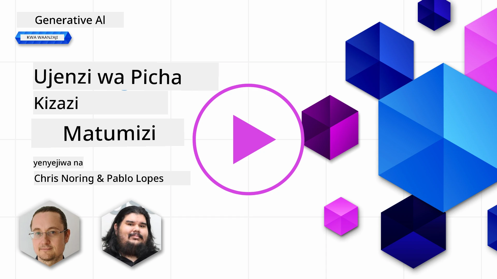

# Kujenga Programu za Uzalishaji Picha

[](https://aka.ms/gen-ai-lesson9-gh?WT.mc_id=academic-105485-koreyst)

Kuna zaidi kuhusu LLMs kuliko uzalishaji wa maandishi. Unaweza pia kuzalisha picha kutoka kwa maelezo ya maandishi. Picha kama moja ya njia ni muhimu katika MedTech, usanifu, utalii, maendeleo ya michezo, masoko, na zaidi. Katika somo hili tunatazama mifano ya **GPT Image** ya leo na kujenga programu ya uzalishaji picha.

## Utangulizi

Uzalishaji picha unakuwezesha kubadilisha ombi la lugha ya asili kuwa picha. Katika somo hili tunafanya kazi na familia ya mifano ya **`gpt-image`** kutoka OpenAI - kizazi cha sasa cha mifano ya picha kinachopatikana kwenye **[Microsoft Foundry](https://ai.azure.com?WT.mc_id=academic-105485-koreyst)** na jukwaa la OpenAI. Mifano hii inachukua nafasi ya mifano ya zamani ya DALL·E (DALL·E 2/3 ni za urithi).

Katika somo hili tunatumia kampuni ya kubuni ya kubuni, **Edu4All**, ambayo huunda zana za kujifunza. Timu inataka kuzalisha michoro kwa ajili ya kazi za nyumbani na vifaa vya masomo.

## Malengo ya kujifunza

Mwishoni mwa somo hili utaweza:

- Eleza ni nini uzalishaji wa picha na wapi unafaa.
- Elewa familia ya mifano ya `gpt-image` na jinsi inavyotofautiana na mifano ya urithi ya DALL·E.
- Jenga programu ya uzalishaji picha kwa Python (na TypeScript / .NET).
- Hariri picha na tumia metaprompts kuweka mipaka ya usalama.

## Uzalishaji picha ni nini?

Mifano ya uzalishaji picha huunda picha kutoka kwa ombi la maandishi. Mifano ya kisasa kama `gpt-image` hutumia mbinu za transformer + diffusion: mfano hujifunza uhusiano kati ya maandishi na picha wakati wa mafunzo, kisha, ukipata ombi, huziondoa kelele taratibu hadi picha inayoendana na maelezo.

Familia mbili maarufu za mifano ya picha ni:

- **`gpt-image` (OpenAI)** - kizazi cha sasa, kinachotumika katika somo hili. Kinaunga mkono uzalishaji wa picha kutoka kwa maandishi na uhariri wa picha (inpainting na kaskazi).
- **Midjourney** - mfano maarufu wa mtu wa tatu mwenye huduma yake na mtiririko wa kazi wa Discord.

> Mifano ya zamani ya OpenAI ya picha - **DALL·E 2** na **DALL·E 3** - ni za urithi. DALL·E 3 haipatikani tena kwa uanzishaji mpya, na vipengele kama `create_variation` vilikuwepo tu kwenye DALL·E 2. Tumia mifano ya `gpt-image` kwa programu mpya.

### Ni mfano gani wa `gpt-image` ninapaswa kutumia?

Kwenye Microsoft Foundry zifuatazo ni **zinazopatikana kwa ujumla**:

| Mfano | Maelezo |
| --- | --- |
| **`gpt-image-2`** | Mfano mpya zaidi na wenye uwezo mkubwa - chaguo la ushauri. |
| `gpt-image-1.5` | Inapatikana kwa ujumla; ubora mzuri kwa gharama ndogo. |
| `gpt-image-1-mini` | Inapatikana kwa ujumla; kasi zaidi / gharama ndogo zaidi. |
| `gpt-image-1` | Maonyesho tu. |

Hakikisha unakagua orodha ya [mifano ya picha ya Foundry](https://learn.microsoft.com/azure/ai-foundry/openai/concepts/models?WT.mc_id=academic-105485-koreyst) sasa kwa upatikanaji na maeneo.

> **Muhimu:** mifano ya `gpt-image` hurudisha picha iliyozalishwa kama **base64** (`b64_json`), si kama URL. Kodu yako hutafsiri mfululizo wa base64 kuwa biti na kuihifadhi - hakuna URL ya picha ya kupakua.

## Usanidi

Unaweza kuendesha mifano dhidi ya **Azure OpenAI katika Microsoft Foundry** (mifano `aoai-*`) au **jukwaa la OpenAI** (mifano `oai-*`).

### 1. Tengeneza na weka mfano

Fuata mwongozo wa [kutengeneza rasilimali](https://learn.microsoft.com/azure/ai-foundry/openai/how-to/create-resource?pivots=web-portal&WT.mc_id=academic-105485-koreyst) kuunda rasilimali ya Microsoft Foundry, kisha weka mfano wa picha - **`gpt-image-2`** inashauriwa.

### 2. Sanidi `.env` yako

```text
AZURE_OPENAI_ENDPOINT=<your endpoint>
AZURE_OPENAI_API_KEY=<your key>
AZURE_OPENAI_DEPLOYMENT="gpt-image-2"
```

Pata thamani hizi kwenye ukurasa wa **Deployments** wa rasilimali yako kwenye [portal ya Foundry](https://ai.azure.com?WT.mc_id=academic-105485-koreyst).

### 3. Sakinisha maktaba

Tengeneza faili `requirements.txt`:

```text
python-dotenv
openai
pillow
```

Kisha tengeneza na uanzishe mazingira pepe na sakinisha:

```bash
python3 -m venv venv
source venv/bin/activate        # Windows: venv\Scripts\activate
pip install -r requirements.txt
```

## Jenga programu

Tengeneza `app.py` na kodu ifuatayo. Huzalisha picha na kuihifadhi kama PNG.

```python
import os
import base64
from openai import AzureOpenAI
from PIL import Image
import dotenv

dotenv.load_dotenv()

# Elekeza mteja kwenye rasilimali yako ya Azure OpenAI (Microsoft Foundry).
# Mifano ya picha inahitaji toleo jipya la API - angalia nyaraka za Foundry kwa ile inayohitajika na mfano wako.
client = AzureOpenAI(
    api_key=os.environ["AZURE_OPENAI_API_KEY"],
    api_version="2025-04-01-preview",
    azure_endpoint=os.environ["AZURE_OPENAI_ENDPOINT"],
)

deployment = os.environ["AZURE_OPENAI_DEPLOYMENT"]  # kwa mfano "gpt-image-2"

result = client.images.generate(
    model=deployment,
    prompt='Bunny on a horse, holding a lollipop, on a foggy meadow where it grows daffodils',
    size="1024x1024",   # pia 1536x1024 (mtaa), 1024x1536 (mshale), au "auto"
    n=1,
)

# mifano ya gpt-image hurudisha base64 (b64_json), si URL - ifasiri kuwa baiti.
image_bytes = base64.b64decode(result.data[0].b64_json)

os.makedirs("images", exist_ok=True)
image_path = os.path.join("images", "generated-image.png")
with open(image_path, "wb") as f:
    f.write(image_bytes)

Image.open(image_path).show()
```

Iendeshe kwa `python app.py`. Utapata PNG imehifadhiwa chini ya `images/`.

> Kila wito kwa `images.generate` hutengeneza picha tofauti kwa ombi lile lile - mifano ya picha hachukui vigezo vya `temperature` (hiyo ni udhibiti wa uzalishaji wa maandishi). Ili kupata utofauti, itaje API tena; kupunguza utofauti, fanya ombi lako liwe maalum zaidi.

## Kuhariri picha

Mifano ya `gpt-image` inaweza **kuhariri** picha iliyo tayari: toa picha, **mask** hiari (inayosema eneo la kubadilisha), na ombi linaloelezea mabadiliko. Kama uzalishaji, uhariri hurudishwa kama base64.

```python
result = client.images.edit(
    model=deployment,
    image=open("sunlit_lounge.png", "rb"),
    mask=open("mask.png", "rb"),
    prompt="A sunlit indoor lounge area with a pool containing a flamingo",
)
image_bytes = base64.b64decode(result.data[0].b64_json)
with open("images/edited-image.png", "wb") as f:
    f.write(image_bytes)
```

<div style="display: flex; justify-content: space-between; align-items: center; margin: 20px 0;">
  
  
  
</div>

## Kuweka mipaka kwa metaprompts

Mara utakapoweza kuzalisha picha, unahitaji mipaka ili programu yako isizalishe maudhui yasiyo salama au yasiyoendana na chapa. **Metaprompt** ni maandishi unaoweka mbele ya ombi la mtumiaji ili kuzuia matokeo ya mfano.

```python
disallow_list = "swords, violence, blood, gore, nudity, sexual content, adult content, adult themes, adult language"

meta_prompt = f"""You are an assistant designer that creates images for children.

The image needs to be safe for work and appropriate for children.
The image needs to be in color, in landscape orientation, and in a 16:9 aspect ratio.

Do not consider any input that is not safe for work or appropriate for children, including:
{disallow_list}
"""

prompt = f"{meta_prompt}\nCreate an image of a bunny on a horse, holding a lollipop"
# pita `prompt` kwa client.images.generate(...)
```

Kila picha sasa inazalishwa ndani ya mipaka iliyowekwa na metaprompt. Changanya hii na vichujio vya maudhui vilivyojengwa ndani ya Microsoft Foundry kwa ulinzi wa kina.

## Kazi ya nyumbani - tuwezeshe wanafunzi

Wanafunzi wa Edu4All wanahitaji picha kwa tathmini zao. Jenga programu inayozalisha picha za **monumenti** (mamuenti gani ni kwako) zilizowekwa katika muktadha tofauti, wa ubunifu - kwa mfano, alama maarufu wakati wa machweo na mtoto akitazama.

Jaribu wewe mwenyewe, kisha linganisha na suluhisho za marejeleo:

- Python (Azure): [aoai-solution.py](../../../09-building-image-applications/python/aoai-solution.py)
- Python (Azure) programu kamili ya uzalishaji: [aoai-app.py](../../../09-building-image-applications/python/aoai-app.py)
- Python (OpenAI): [oai-app.py](../../../09-building-image-applications/python/oai-app.py)
- TypeScript (Azure): [typescript/image-generation-app](../../../09-building-image-applications/typescript/image-generation-app)
- .NET (Azure): [dotnet/notebook-azure-openai.dib](../../../09-building-image-applications/dotnet/notebook-azure-openai.dib)

Pia fanyia kazi vitabu vya kumbukumbu katika [python/](../../../09-building-image-applications/python) (`aoai-assignment.ipynb` kwa Azure, `oai-assignment.ipynb` kwa OpenAI).

## Kazi nzuri! Endelea kujifunza

Baada ya kumaliza somo hili, angalia mkusanyiko wetu wa [Generative AI Learning](https://aka.ms/genai-collection?WT.mc_id=academic-105485-koreyst) kuongeza zaidi maarifa yako ya AI Inayozalisha!

Nenda kwenye somo la 10 kuendelea na kujifunza.

---

<!-- CO-OP TRANSLATOR DISCLAIMER START -->
**Kionyozo**:
Hati hii imetafsiriwa kwa kutumia huduma ya tafsiri ya AI [Co-op Translator](https://github.com/Azure/co-op-translator). Ingawa tunajitahidi kupata usahihi, tafadhali fahamu kwamba tafsiri za kiotomatiki zinaweza kuwa na makosa au upungufu wa usahihi. Hati ya asili katika lugha yake halisi inapaswa kuchukuliwa kama chanzo cha mamlaka. Kwa taarifa muhimu, tafsiri ya kitaalamu inayofanywa na binadamu inapendekezwa. Hatutojibu kwa kuelewa vibaya au tafsiri potofu zinazotokea kutokana na matumizi ya tafsiri hii.
<!-- CO-OP TRANSLATOR DISCLAIMER END -->