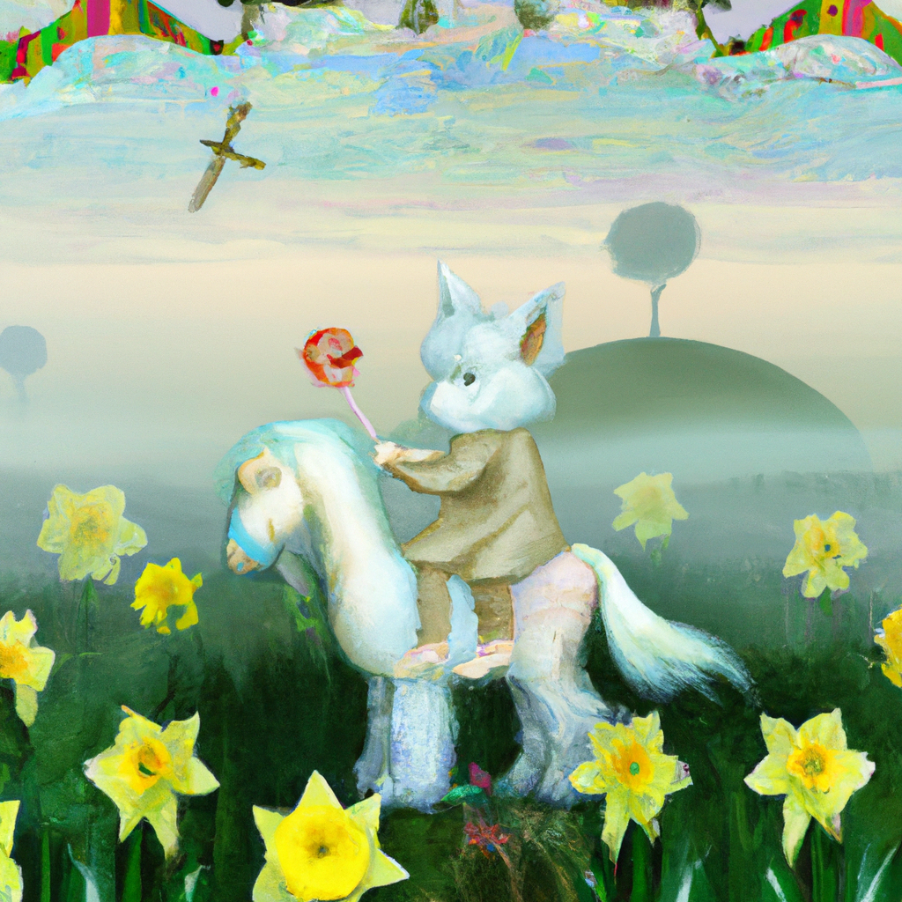

<!--
CO_OP_TRANSLATOR_METADATA:
{
  "original_hash": "ef74ad58fc01f7ad80788f79505f9816",
  "translation_date": "2025-08-26T18:45:59+00:00",
  "source_file": "09-building-image-applications/README.md",
  "language_code": "sw"
}
-->
# Kujenga Programu za Kuzalisha Picha

[](https://aka.ms/gen-ai-lesson9-gh?WT.mc_id=academic-105485-koreyst)

LLMs hazihusiani tu na utengenezaji wa maandishi. Inawezekana pia kuzalisha picha kutokana na maelezo ya maandishi. Kuwa na picha kama njia ya mawasiliano kunaweza kuwa na manufaa makubwa katika maeneo mengi kama vile MedTech, usanifu majengo, utalii, utengenezaji wa michezo na mengine mengi. Katika sura hii, tutaangalia mifano miwili maarufu ya kuzalisha picha, DALL-E na Midjourney.

## Utangulizi

Katika somo hili, tutajadili:

- Kuzalisha picha na kwa nini ni muhimu.
- DALL-E na Midjourney, ni nini na jinsi zinavyofanya kazi.
- Jinsi ya kujenga programu ya kuzalisha picha.

## Malengo ya Kujifunza

Baada ya kukamilisha somo hili, utaweza:

- Kujenga programu ya kuzalisha picha.
- Kuweka mipaka ya programu yako kwa kutumia meta prompts.
- Kufanya kazi na DALL-E na Midjourney.

## Kwa nini ujenge programu ya kuzalisha picha?

Programu za kuzalisha picha ni njia nzuri ya kuchunguza uwezo wa AI ya kizazi. Zinaweza kutumika kwa mfano:

- **Kuhariri na kutengeneza picha**. Unaweza kuzalisha picha kwa matumizi mbalimbali, kama vile kuhariri picha na kutengeneza picha mpya.

- **Kutumika katika sekta mbalimbali**. Pia zinaweza kutumika kuzalisha picha kwa sekta mbalimbali kama Medtech, Utalii, Utengenezaji wa michezo na nyinginezo.

## Kisa: Edu4All

Kama sehemu ya somo hili, tutaendelea kufanya kazi na kampuni yetu changa, Edu4All. Wanafunzi wataunda picha kwa ajili ya tathmini zao, ni picha gani watachagua ni juu yao, lakini wanaweza kuchora michoro kwa hadithi zao za kubuni au kuunda mhusika mpya kwa hadithi yao au kuwasaidia kuona mawazo na dhana zao.

Hivi ndivyo wanafunzi wa Edu4All wanaweza kuzalisha, kwa mfano, kama wanajifunza darasani kuhusu makumbusho:


kwa kutumia prompt kama

> "Mbwa karibu na Mnara wa Eiffel katika mwanga wa asubuhi mapema"

## DALL-E na Midjourney ni nini?

[DALL-E](https://openai.com/dall-e-2?WT.mc_id=academic-105485-koreyst) na [Midjourney](https://www.midjourney.com/?WT.mc_id=academic-105485-koreyst) ni mifano miwili maarufu ya kuzalisha picha, zinakuwezesha kutumia prompts kuzalisha picha.

### DALL-E

Tuanze na DALL-E, ambayo ni mfano wa AI ya kizazi unaozalisha picha kutokana na maelezo ya maandishi.

> [DALL-E ni mchanganyiko wa mifano miwili, CLIP na diffused attention](https://towardsdatascience.com/openais-dall-e-and-clip-101-a-brief-introduction-3a4367280d4e?WT.mc_id=academic-105485-koreyst).

- **CLIP**, ni mfano unaotengeneza embeddings, ambazo ni uwakilishi wa data kwa namba, kutoka kwenye picha na maandishi.

- **Diffused attention**, ni mfano unaozalisha picha kutoka kwenye embeddings. DALL-E imefundishwa kwa seti kubwa ya picha na maandishi na inaweza kutumika kuzalisha picha kutokana na maelezo ya maandishi. Kwa mfano, DALL-E inaweza kutumika kutengeneza picha ya paka aliyevaa kofia, au mbwa mwenye mohawk.

### Midjourney

Midjourney inafanya kazi kwa njia inayofanana na DALL-E, inazalisha picha kutokana na prompts za maandishi. Midjourney pia inaweza kutumika kuzalisha picha kwa kutumia prompts kama “paka aliyevaa kofia”, au “mbwa mwenye mohawk”.


_Picha kwa hisani ya Wikipedia, picha imezalishwa na Midjourney_

## DALL-E na Midjourney zinafanyaje kazi

Kwanza, [DALL-E](https://arxiv.org/pdf/2102.12092.pdf?WT.mc_id=academic-105485-koreyst). DALL-E ni mfano wa AI ya kizazi unaotumia usanifu wa transformer na _autoregressive transformer_.

_Autoregressive transformer_ inaelezea jinsi mfano unavyozalisha picha kutokana na maelezo ya maandishi, inazalisha pixel moja kwa wakati, kisha inatumia pixel zilizozalishwa kutengeneza pixel inayofuata. Inapita kwenye tabaka nyingi za mtandao wa neva, hadi picha ikamilike.

Kwa mchakato huu, DALL-E inadhibiti sifa, vitu, tabia na zaidi kwenye picha inayoizalisha. Hata hivyo, DALL-E 2 na 3 zina udhibiti zaidi juu ya picha inayozalishwa.

## Kujenga programu yako ya kwanza ya kuzalisha picha

Kwa hiyo, inahitajika nini kujenga programu ya kuzalisha picha? Unahitaji maktaba zifuatazo:

- **python-dotenv**, inashauriwa sana kutumia maktaba hii kuweka siri zako kwenye faili _.env_ mbali na msimbo.
- **openai**, hii ndiyo maktaba utakayotumia kuwasiliana na OpenAI API.
- **pillow**, kufanya kazi na picha kwenye Python.
- **requests**, kusaidia kufanya maombi ya HTTP.

## Tengeneza na weka mfano wa Azure OpenAI

Kama bado hujafanya, fuata maelekezo kwenye ukurasa wa [Microsoft Learn](https://learn.microsoft.com/azure/ai-foundry/openai/how-to/create-resource?pivots=web-portal)
kutengeneza rasilimali na mfano wa Azure OpenAI. Chagua DALL-E 3 kama mfano.  

## Tengeneza programu

1. Tengeneza faili _.env_ yenye maudhui yafuatayo:

   ```text
   AZURE_OPENAI_ENDPOINT=<your endpoint>
   AZURE_OPENAI_API_KEY=<your key>
   AZURE_OPENAI_DEPLOYMENT="dall-e-3"
   ```

   Tafuta taarifa hii kwenye Azure OpenAI Foundry Portal kwa rasilimali yako kwenye sehemu ya "Deployments".

1. Kusanya maktaba zilizo juu kwenye faili inayoitwa _requirements.txt_ kama ifuatavyo:

   ```text
   python-dotenv
   openai
   pillow
   requests
   ```

1. Kisha, tengeneza mazingira pepe na usakinishe maktaba:

   ```bash
   python3 -m venv venv
   source venv/bin/activate
   pip install -r requirements.txt
   ```

   Kwa Windows, tumia amri zifuatazo kutengeneza na kuamsha mazingira yako pepe:

   ```bash
   python3 -m venv venv
   venv\Scripts\activate.bat
   ```

1. Ongeza msimbo ufuatao kwenye faili inayoitwa _app.py_:

    ```python
    import openai
    import os
    import requests
    from PIL import Image
    import dotenv
    from openai import OpenAI, AzureOpenAI
    
    # import dotenv
    dotenv.load_dotenv()
    
    # configure Azure OpenAI service client 
    client = AzureOpenAI(
      azure_endpoint = os.environ["AZURE_OPENAI_ENDPOINT"],
      api_key=os.environ['AZURE_OPENAI_API_KEY'],
      api_version = "2024-02-01"
      )
    try:
        # Create an image by using the image generation API
        generation_response = client.images.generate(
                                prompt='Bunny on horse, holding a lollipop, on a foggy meadow where it grows daffodils',
                                size='1024x1024', n=1,
                                model=os.environ['AZURE_OPENAI_DEPLOYMENT']
                              )

        # Set the directory for the stored image
        image_dir = os.path.join(os.curdir, 'images')

        # If the directory doesn't exist, create it
        if not os.path.isdir(image_dir):
            os.mkdir(image_dir)

        # Initialize the image path (note the filetype should be png)
        image_path = os.path.join(image_dir, 'generated-image.png')

        # Retrieve the generated image
        image_url = generation_response.data[0].url  # extract image URL from response
        generated_image = requests.get(image_url).content  # download the image
        with open(image_path, "wb") as image_file:
            image_file.write(generated_image)

        # Display the image in the default image viewer
        image = Image.open(image_path)
        image.show()

    # catch exceptions
    except openai.InvalidRequestError as err:
        print(err)
   ```

Hebu tuelezee msimbo huu:

- Kwanza, tunaingiza maktaba tunazohitaji, ikiwemo maktaba ya OpenAI, dotenv, requests, na Pillow.

  ```python
  import openai
  import os
  import requests
  from PIL import Image
  import dotenv
  ```

- Kisha, tunapakia vigezo vya mazingira kutoka kwenye faili _.env_.

  ```python
  # import dotenv
  dotenv.load_dotenv()
  ```

- Baada ya hapo, tunasanidi mteja wa huduma ya Azure OpenAI 

  ```python
  # Get endpoint and key from environment variables
  client = AzureOpenAI(
      azure_endpoint = os.environ["AZURE_OPENAI_ENDPOINT"],
      api_key=os.environ['AZURE_OPENAI_API_KEY'],
      api_version = "2024-02-01"
      )
  ```

- Kisha, tunazalisha picha:

  ```python
  # Create an image by using the image generation API
  generation_response = client.images.generate(
                        prompt='Bunny on horse, holding a lollipop, on a foggy meadow where it grows daffodils',
                        size='1024x1024', n=1,
                        model=os.environ['AZURE_OPENAI_DEPLOYMENT']
                      )
  ```

  Msimbo hapo juu unajibu na kitu cha JSON chenye URL ya picha iliyozalishwa. Tunaweza kutumia URL hiyo kupakua picha na kuihifadhi kwenye faili.

- Mwisho, tunafungua picha na kutumia kionesha picha cha kawaida kuionyesha:

  ```python
  image = Image.open(image_path)
  image.show()
  ```

### Maelezo zaidi kuhusu kuzalisha picha

Hebu tuangalie msimbo unaozalisha picha kwa undani zaidi:

    ```python
      generation_response = client.images.generate(
                                prompt='Bunny on horse, holding a lollipop, on a foggy meadow where it grows daffodils',
                                size='1024x1024', n=1,
                                model=os.environ['AZURE_OPENAI_DEPLOYMENT']
                            )
    ```

- **prompt**, ni maandishi yanayotumika kuzalisha picha. Katika mfano huu, tunatumia prompt "Sungura juu ya farasi, ameshika pipi, kwenye uwanda wenye ukungu ambapo zinamea daffodils".
- **size**, ni ukubwa wa picha inayozalishwa. Katika mfano huu, tunazalisha picha ya 1024x1024 pixels.
- **n**, ni idadi ya picha zinazozalishwa. Katika mfano huu, tunazalisha picha mbili.
- **temperature**, ni kigezo kinachodhibiti utofauti wa matokeo ya mfano wa AI ya kizazi. Temperature ni thamani kati ya 0 na 1 ambapo 0 inamaanisha matokeo ni yale yale na 1 inamaanisha matokeo ni ya kubahatisha. Thamani chaguo-msingi ni 0.7.

Kuna mambo mengine zaidi unaweza kufanya na picha ambayo tutajadili kwenye sehemu inayofuata.

## Uwezo wa ziada wa kuzalisha picha

Umeona hadi sasa jinsi tulivyoweza kuzalisha picha kwa mistari michache tu ya Python. Hata hivyo, kuna mambo mengine zaidi unaweza kufanya na picha.

Pia unaweza kufanya yafuatayo:

- **Kufanya uhariri**. Kwa kutoa picha iliyopo, mask na prompt, unaweza kubadilisha picha. Kwa mfano, unaweza kuongeza kitu kwenye sehemu ya picha. Fikiria picha yetu ya sungura, unaweza kuongeza kofia kwa sungura. Unachofanya ni kutoa picha, mask (inayoonyesha sehemu ya kubadilisha) na prompt ya maandishi kueleza nini kifanyike. 
> Note: hii haijaungwa mkono kwenye DALL-E 3. 
 
Hapa kuna mfano ukitumia GPT Image:

    ```python
    response = client.images.edit(
        model="gpt-image-1",
        image=open("sunlit_lounge.png", "rb"),
        mask=open("mask.png", "rb"),
        prompt="A sunlit indoor lounge area with a pool containing a flamingo"
    )
    image_url = response.data[0].url
    ```

  Picha ya msingi itakuwa na sebule yenye bwawa tu lakini picha ya mwisho itakuwa na flamingo:

<div style="display: flex; justify-content: space-between; align-items: center; margin: 20px 0;">
  
  
  
</div>


- **Kutengeneza tofauti**. Wazo ni kwamba unachukua picha iliyopo na kuomba zitengenezwe tofauti zake. Ili kutengeneza tofauti, unatoa picha na prompt ya maandishi na msimbo kama ifuatavyo:

  ```python
  response = openai.Image.create_variation(
    image=open("bunny-lollipop.png", "rb"),
    n=1,
    size="1024x1024"
  )
  image_url = response['data'][0]['url']
  ```

  > Note, hii inapatikana tu kwenye OpenAI

## Temperature

Temperature ni kigezo kinachodhibiti utofauti wa matokeo ya mfano wa AI ya kizazi. Temperature ni thamani kati ya 0 na 1 ambapo 0 inamaanisha matokeo ni yale yale na 1 inamaanisha matokeo ni ya kubahatisha. Thamani chaguo-msingi ni 0.7.

Hebu tuangalie mfano wa jinsi temperature inavyofanya kazi, kwa kuendesha prompt hii mara mbili:

> Prompt : "Sungura juu ya farasi, ameshika pipi, kwenye uwanda wenye ukungu ambapo zinamea daffodils"



Sasa hebu tuendeshe prompt hiyo hiyo ili tuone kwamba hatutapata picha ile ile mara mbili:


Kama unavyoona, picha zinafanana, lakini si sawa kabisa. Hebu tujaribu kubadilisha thamani ya temperature kuwa 0.1 na tuone kinachotokea:

```python
 generation_response = client.images.create(
        prompt='Bunny on horse, holding a lollipop, on a foggy meadow where it grows daffodils',    # Enter your prompt text here
        size='1024x1024',
        n=2
    )
```

### Kubadilisha temperature

Sasa hebu tujaribu kufanya majibu yawe ya uhakika zaidi. Tunaweza kuona kutoka kwenye picha mbili tulizozalisha kwamba kwenye picha ya kwanza, kuna sungura na kwenye ya pili, kuna farasi, hivyo picha zinatofautiana sana.

Kwa hiyo, hebu tubadilishe msimbo wetu na kuweka temperature kuwa 0, kama ifuatavyo:

```python
generation_response = client.images.create(
        prompt='Bunny on horse, holding a lollipop, on a foggy meadow where it grows daffodils',    # Enter your prompt text here
        size='1024x1024',
        n=2,
        temperature=0
    )
```

Sasa ukiendesha msimbo huu, utapata picha hizi mbili:

- 
- 

Hapa unaweza kuona wazi jinsi picha zinavyofanana zaidi.

## Jinsi ya kuweka mipaka ya programu yako kwa kutumia metaprompts

Kwa mfano wetu, tayari tunaweza kuzalisha picha kwa wateja wetu. Hata hivyo, tunahitaji kuweka mipaka fulani kwenye programu yetu.

Kwa mfano, hatutaki kuzalisha picha ambazo si salama kwa mazingira ya kazi, au ambazo hazifai kwa watoto.

Tunaweza kufanya hivi kwa kutumia _metaprompts_. Metaprompts ni prompts za maandishi zinazotumika kudhibiti matokeo ya mfano wa AI ya kizazi. Kwa mfano, tunaweza kutumia metaprompts kudhibiti matokeo, na kuhakikisha kwamba picha zinazozalishwa ni salama kwa kazi, au zinafaa kwa watoto.

### Inafanyaje kazi?

Sasa, metaprompts zinafanyaje kazi?

Metaprompts ni prompts za maandishi zinazotumika kudhibiti matokeo ya mfano wa AI ya kizazi, zinawekwa kabla ya prompt ya maandishi, na hutumika kudhibiti matokeo ya mfano na kuingizwa kwenye programu ili kudhibiti matokeo ya mfano. Zinajumuisha prompt ya mtumiaji na meta prompt kwenye prompt moja ya maandishi.

Mfano mmoja wa meta prompt unaweza kuwa huu:

```text
You are an assistant designer that creates images for children.

The image needs to be safe for work and appropriate for children.

The image needs to be in color.

The image needs to be in landscape orientation.

The image needs to be in a 16:9 aspect ratio.

Do not consider any input from the following that is not safe for work or appropriate for children.

(Input)

```

Sasa, hebu tuone jinsi tunavyoweza kutumia meta prompts kwenye mfano wetu.

```python
disallow_list = "swords, violence, blood, gore, nudity, sexual content, adult content, adult themes, adult language, adult humor, adult jokes, adult situations, adult"

meta_prompt =f"""You are an assistant designer that creates images for children.

The image needs to be safe for work and appropriate for children.

The image needs to be in color.

The image needs to be in landscape orientation.

The image needs to be in a 16:9 aspect ratio.

Do not consider any input from the following that is not safe for work or appropriate for children.
{disallow_list}
"""

prompt = f"{meta_prompt}
Create an image of a bunny on a horse, holding a lollipop"

# TODO add request to generate image
```

Kutoka kwenye prompt hapo juu, unaweza kuona jinsi picha zote zinazotengenezwa zinazingatia metaprompt.

## Kazi - tuwape wanafunzi uwezo

Tulitambulisha Edu4All mwanzoni mwa somo hili. Sasa ni wakati wa kuwapa wanafunzi uwezo wa kuzalisha picha kwa ajili ya tathmini zao.

Wanafunzi wataunda picha kwa ajili ya tathmini zao zinazohusisha makumbusho, ni makumbusho gani ni juu yao. Wanafunzi wanaombwa kutumia ubunifu wao kwenye kazi hii kuweka makumbusho haya katika muktadha tofauti.

## Suluhisho

Hapa kuna suluhisho mojawapo:

```python
import openai
import os
import requests
from PIL import Image
import dotenv
from openai import AzureOpenAI
# import dotenv
dotenv.load_dotenv()

# Get endpoint and key from environment variables
client = AzureOpenAI(
  azure_endpoint = os.environ["AZURE_OPENAI_ENDPOINT"],
  api_key=os.environ['AZURE_OPENAI_API_KEY'],
  api_version = "2024-02-01"
  )


disallow_list = "swords, violence, blood, gore, nudity, sexual content, adult content, adult themes, adult language, adult humor, adult jokes, adult situations, adult"

meta_prompt = f"""You are an assistant designer that creates images for children.

The image needs to be safe for work and appropriate for children.

The image needs to be in color.

The image needs to be in landscape orientation.

The image needs to be in a 16:9 aspect ratio.

Do not consider any input from the following that is not safe for work or appropriate for children.
{disallow_list}
"""

prompt = f"""{meta_prompt}
Generate monument of the Arc of Triumph in Paris, France, in the evening light with a small child holding a Teddy looks on.
""""

try:
    # Create an image by using the image generation API
    generation_response = client.images.generate(
        prompt=prompt,    # Enter your prompt text here
        size='1024x1024',
        n=1,
    )
    # Set the directory for the stored image
    image_dir = os.path.join(os.curdir, 'images')

    # If the directory doesn't exist, create it
    if not os.path.isdir(image_dir):
        os.mkdir(image_dir)

    # Initialize the image path (note the filetype should be png)
    image_path = os.path.join(image_dir, 'generated-image.png')

    # Retrieve the generated image
    image_url = generation_response.data[0].url  # extract image URL from response
    generated_image = requests.get(image_url).content  # download the image
    with open(image_path, "wb") as image_file:
        image_file.write(generated_image)

    # Display the image in the default image viewer
    image = Image.open(image_path)
    image.show()

# catch exceptions
except openai.BadRequestError as err:
    print(err)
```

## Kazi nzuri! Endelea kujifunza
Baada ya kukamilisha somo hili, angalia [mkusanyiko wetu wa Kujifunza AI Jenereta](https://aka.ms/genai-collection?WT.mc_id=academic-105485-koreyst) ili kuendelea kuongeza ujuzi wako kuhusu AI Jenereta!

Nenda kwenye Somo la 10 ambapo tutaangalia jinsi ya [kutengeneza programu za AI kwa kutumia low-code](../10-building-low-code-ai-applications/README.md?WT.mc_id=academic-105485-koreyst)

---

**Kanusho**:  
Hati hii imetafsiriwa kwa kutumia huduma ya kutafsiri ya AI [Co-op Translator](https://github.com/Azure/co-op-translator). Ingawa tunajitahidi kuhakikisha usahihi, tafadhali fahamu kwamba tafsiri za kiotomatiki zinaweza kuwa na makosa au kutokuwa sahihi. Hati asili katika lugha yake ya asili inapaswa kuchukuliwa kama chanzo cha mamlaka. Kwa taarifa muhimu, inashauriwa kutumia huduma ya utafsiri wa binadamu wa kitaalamu. Hatutawajibika kwa kutoelewana au tafsiri potofu zinazotokana na matumizi ya tafsiri hii.