# Kujenga Programu za AI za Low Code

[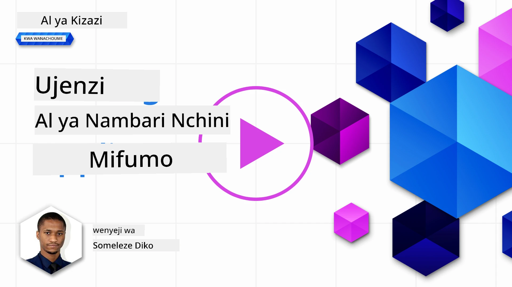](https://youtu.be/1vzq3Nd8GBA?si=h6LHWJXdmqf6mhDg)

> _(Bofya picha hapo juu kutazama video ya somo hili)_

## Utangulizi

Sasa tumejifunza jinsi ya kujenga programu za kuunda picha, hebu tuzungumze kuhusu low code. AI inayozalisha inaweza kutumika kwa maeneo mbalimbali ikiwemo low code, lakini low code ni nini na tunawezaje kuongeza AI ndani yake?

Kujenga programu na suluhisho kumekuwa rahisi kwa waendelezaji wa jadi na wasiotekeleza programu kupitia matumizi ya Majukwaa ya Maendeleo ya Low Code. Majukwaa ya Maendeleo ya Low Code yanakuwezesha kujenga programu na suluhisho kwa kutumia nambari kidogo au bila nambari kabisa. Hii hupatikana kwa kutoa mazingira ya maendeleo yenye kuona ambayo yanakuwezesha kuburuta na kuachilia vipengele vya kujenga programu na suluhisho. Hii inakuwezesha kujenga programu na suluhisho kwa kasi zaidi na kwa rasilimali chache. Katika somo hili, tutaelewa kwa kina jinsi ya kutumia Low Code na jinsi ya kuboresha maendeleo ya low code kwa kutumia AI kupitia Power Platform.

Power Platform inawapa mashirika fursa ya kuwawezesha timu zao kujenga suluhisho zao wenyewe kupitia mazingira yenye low-code au no-code yenye kueleweka kwa urahisi. Mazingira haya husaidia kurahisisha mchakato wa kujenga suluhisho. Kwa Power Platform, suluhisho zinaweza kujengwa kwa siku au wiki badala ya miezi au miaka. Power Platform ina bidhaa kuu tano: Power Apps, Power Automate, Power BI, Power Pages na Copilot Studio.

Somo hili linajumuisha:

- Utangulizi wa AI inayozalisha katika Power Platform
- Utangulizi wa Copilot na jinsi ya kuitumia
- Kutumia AI inayozalisha kuunda programu na mitiririko katika Power Platform
- Kuelewa Modeli za AI katika Power Platform kwa kutumia AI Builder
- Kujenga mawakala wa akili kwa Microsoft Copilot Studio

## Malengo ya Kujifunza

Mwisho wa somo hili, utaweza:

- Kuelewa jinsi Copilot inavyofanya kazi katika Power Platform.

- Kujenga Programu ya Kufuata Kazi za Wanafunzi kwa ajili ya startup yetu ya elimu.

- Kujenga Mtiririko wa Usindikaji wa Ankara unaotumia AI kutoa taarifa kutoka kwenye ankara.

- Kutumia mbinu bora wakati wa kutumia Modeli ya AI ya Create Text na GPT.

- Kuelewa Microsoft Copilot Studio ni nini na jinsi ya kujenga mawakala wa akili nalo.

Vyombo na teknolojia utakazotumia katika somo hili ni:

- **Power Apps**, kwa programu ya Student Assignment Tracker, inayotoa mazingira ya maendeleo ya low-code kwa ajili ya kujenga programu za kufuatilia, kusimamia na kuingiliana na data.

- **Dataverse**, kwa kuhifadhi data za programu ya Student Assignment Tracker ambapo Dataverse itatoa jukwaa la data la low-code kuhifadhi data za programu.

- **Power Automate**, kwa mtiririko wa Usindikaji wa Ankara ambapo utakuwa na mazingira ya maendeleo ya low-code kwa ajili ya kujenga mitiririko ya kazi ya kuendesha usindikaji wa ankara.

- **AI Builder**, kwa Modeli ya AI ya Usindikaji wa Ankara ambapo utatumia Modeli za AI zilizojengwa tayari kusindika ankara za startup yetu.

## AI Inayozalisha katika Power Platform

Kuboresha maendeleo ya low-code na programu kwa kutumia AI inayozalisha ni eneo muhimu kwa Power Platform. Lengo ni kuwawezesha kila mtu kujenga programu, tovuti, dashibodi zinazotumia AI, na kuendesha michakato kiotomatiki na AI, _bila haja ya utaalamu wowote wa sayansi ya data_. Lengo hili linafanikiwa kwa kuingiza AI inayozalisha katika uzoefu wa maendeleo ya low-code katika Power Platform kwa njia ya Copilot na AI Builder.

### Hii inafanya kazi vipi?

Copilot ni msaidizi wa AI anayekuza uwezo wa kujenga suluhisho za Power Platform kwa kuelezea mahitaji yako kupitia hatua za mazungumzo kwa lugha ya asili. Kwa mfano, unaweza kusema msaidizi wako wa AI niache aeleze ni mashamba gani programu yako itatumia na itaunda programu pamoja na mfano wa data unaoishi nyuma, au unaweza kuelezea jinsi ya kuweka mtiririko katika Power Automate.

Unaweza kutumia vipengele vinavyotumiwa na Copilot katika skrini za programu yako kuwezesha watumiaji kugundua maarifa kupitia mazungumzo ya maingiliano.

AI Builder ni uwezo wa AI wa low-code unaopatikana katika Power Platform unaokuza kutumia Modeli za AI kusaidia kuendesha michakato kiotomatiki na kutabiri matokeo. Kwa AI Builder unaweza kuleta AI katika programu zako na mitiririko inayounganisha na data yako katika Dataverse au vyanzo mbalimbali vya data za mtandao, kama vile SharePoint, OneDrive au Azure.

Copilot inapatikana katika bidhaa zote za Power Platform: Power Apps, Power Automate, Power BI, Power Pages na Copilot Studio (zamani Power Virtual Agents). AI Builder inapatikana katika Power Apps na Power Automate. Katika somo hili, tutazingatia jinsi ya kutumia Copilot na AI Builder katika Power Apps na Power Automate kujenga suluhisho kwa startup yetu ya elimu.

### Copilot katika Power Apps

Kama sehemu ya Power Platform, Power Apps hutoa mazingira ya maendeleo ya low-code kwa ajili ya kujenga programu za kufuatilia, kusimamia na kuingiliana na data. Ni mkusanyiko wa huduma za maendeleo ya programu zenye jukwaa la data linaloweza kupanuka na uwezo wa kuungana na huduma za mtandao na data za eneo la ndani. Power Apps inaruhusu kujenga programu zinazoendeshwa kwenye vivinjari, vidonge, na simu, na kuweza kushirikishwa na wenzako. Power Apps inarahisisha watumiaji kuingia katika maendeleo ya programu kwa njia rahisi, ili kila mtumiaji wa biashara au mtaalamu wa maendeleo aweze kujenga programu maalum. Uzoefu wa maendeleo ya programu pia umeboreshwa na AI inayozalisha kupitia Copilot.

Kipengele cha msaidizi wa AI Copilot katika Power Apps kinakuruhusu kuelezea aina gani ya programu unahitaji na ni taarifa gani unataka programu yako ifuatilie, ikusanye, au ionyeshe. Copilot basi hutengeneza programu ya Canvas inayorespondi kulingana na maelezo yako. Kisha unaweza kubinafsisha programu ili kukidhi mahitaji yako. AI Copilot pia hutengeneza na kupendekeza Jedwali la Dataverse lenye mashamba unayohitaji kuhifadhi data unayotaka kufuatilia pamoja na sampuli za data. Tutachunguza kile Dataverse ni na jinsi unavyoweza kuitumia katika Power Apps baadaye katika somo hili. Baadaye unaweza kubinafsisha jedwali kwa kutumia kipengele cha msaidizi wa AI Copilot kupitia hatua za mazungumzo. Kipengele hiki kinapatikana moja kwa moja kutoka kwenye skrini ya nyumbani ya Power Apps.

### Copilot katika Power Automate

Kama sehemu ya Power Platform, Power Automate inaruhusu watumiaji kuunda mitiririko ya kazi kiotomatiki kati ya programu na huduma. Inasaidia kuendesha taratibu za biashara zinazojirudia kama mawasiliano, ukusanyaji wa data, na idhini za maamuzi. Kiolesura chake rahisi kinaruhusu watumiaji wenye kila kiwango cha ujuzi wa kiufundi (kuanzia wanaoanza hadi waendelezaji wenye uzoefu) kuendesha kazi zao kiotomatiki. Uzoefu wa maendeleo ya mitiririko ya kazi pia umeboreshwa na AI inayozalisha kupitia Copilot.

Kipengele cha msaidizi wa AI Copilot katika Power Automate kinakuruhusu kuelezea aina gani ya mtiririko unahitaji na ni vitendo gani unataka mtiririko wako ufanye. Copilot basi hutengeneza mtiririko kulingana na maelezo yako. Kisha unaweza kubinafsisha mtiririko kwa mahitaji yako. AI Copilot pia hutengeneza na kupendekeza vitendo unavyohitaji kutekeleza kazi unayotaka kuendesha kiotomatiki. Tutachunguza nini mtiririko ni na jinsi unavyoweza kuitumia Power Automate baadaye katika somo hili. Kisha unaweza kubinafsisha vitendo kwa mahitaji yako kwa kutumia kipengele cha msaidizi wa AI Copilot kupitia hatua za mazungumzo. Kipengele hiki kinapatikana moja kwa moja kutoka kwenye skrini ya nyumbani ya Power Automate.

## Kujenga Mawakala wa Akili kwa Microsoft Copilot Studio

[Microsoft Copilot Studio](https://learn.microsoft.com/microsoft-copilot-studio/fundamentals-what-is-copilot-studio?WT.mc_id=academic-105485-koreyst) (zamani Power Virtual Agents) ni mshiriki wa low-code wa Power Platform kwa ajili ya kujenga **mawakala wa AI** — mawakala wa mazungumzo wanaoweza kujibu maswali, kuchukua hatua, na kuendesha kazi kwa niaba ya watumiaji wako. Kama ilivyo kwa Power Platform yote, unajenga mawakala hawa kupitia uzoefu wa kuona, wa kwanza kwa lugha ya asili: unaelezea unachotaka wakala afanye, na Copilot Studio husaidia kupanga maelekezo, maarifa, na vitendo vyake.

Kwa startup yetu ya elimu, unaweza kujenga wakala anayeweza kujibu maswali ya wanafunzi kuhusu kozi, kuangalia tarehe za kazi za nyumbani, na hata kutuma barua pepe kwa mwalimu — yote haya bila kuandika nambari.

Hapa kuna baadhi ya uwezo wa hivi karibuni unaofanya Copilot Studio kuwa na nguvu:

- **Majibu yanayotokana na maarifa yako**. Badala ya kuandika mazungumzo yote kwa mkono, unaweza kuunganisha **vyanzo vya maarifa** — tovuti za umma, SharePoint, OneDrive, Dataverse, faili zilizoingizwa, au data za shirika kupitia viunganishi — na wakala hutengeneza majibu yanayotokana na vyanzo hivyo.

- **Utaratibu wa uzalishaji**. Badala ya kutegemea misemo thabiti ya kuanzisha, wakala hutumia AI kuelewa ombi na kuamua kwa nguvu vyanzo vya maarifa, mada, na vitendo vinavyochanganywa kutekeleza ombi hilo, ikiwa ni pamoja na kuunganisha hatua kadhaa pamoja.

- **Vitendo na viunganishi**. Mawakala wanaweza *kutenda* mambo, si mazungumzo tu. Unaweza kumpa wakala vitendo vinavyotegemea viunganishi vya Power Platform zaidi ya 1,500, mitiririko ya Power Automate, APA za REST za kawaida, maagizo, au seva za **Model Context Protocol (MCP)**.

- **Mawakala huru**. Mawakala hayana kikomo cha kujibu tu kwenye dirisha la mazungumzo. Unaweza kujenga **mawakala huru** wanaochochewa na matukio — kama barua pepe mpya, rekodi mpya katika Dataverse, au faili lililoingizwa — kisha wafanye kazi kwa siri kukamilisha kazi.

- **Utaratibu wa mawakala wengi**. Mawakala wanaweza kumpigia simu wakala wengine. Wakala katika Copilot Studio anaweza kuhamisha kazi au kupanuliwa na mawakala wengine, wakiwemo mawakala waliotangazwa kwa Microsoft 365 Copilot na mawakala waliotengenezwa katika Microsoft Foundry.

- **Chaguo la modeli**. Zaidi ya modeli zilizojengwa ndani, unaweza kuleta modeli kutoka kwenye katalo ya modeli ya Microsoft Foundry kubinafsisha jinsi wakala wako anavyofikiria na kujibu.

- **Chapisha mahali popote**. Mara baada ya kujengwa, wakala anaweza kuchapishwa katika njia nyingi — Microsoft Teams, Microsoft 365 Copilot, tovuti au programu maalum, na zaidi — na usalama, uthibitisho, na uchambuzi vinadhibitiwa kupitia uzoefu wa msimamizi wa Power Platform.

Unaweza kuanza kujenga wakala wako wa kwanza kwenye [copilotstudio.microsoft.com](https://copilotstudio.microsoft.com?WT.mc_id=academic-105485-koreyst) na kujifunza zaidi katika [nyaraka za Microsoft Copilot Studio](https://learn.microsoft.com/microsoft-copilot-studio/?WT.mc_id=academic-105485-koreyst).

## Kazi: Dhibiti kazi za wanafunzi na ankara kwa startup yetu, ukitumia Copilot

Startup yetu hutoa kozi za mtandaoni kwa wanafunzi. Startup imekua kwa kasi na sasa inapata matatizo kufuatilia mahitaji ya kozi zake. Startup imenajiri wewe kama mtaalamu wa Power Platform kusaidia kujenga suluhisho la low code kusaidia kusimamia kazi za wanafunzi na ankara zao. Suluhisho lao linafaa kusaidia kufuatilia na kusimamia kazi za wanafunzi kupitia programu na kuendesha usindikaji wa ankara kupitia mtiririko wa kazi. Umeombwa kutumia AI inayozalisha kuendeleza suluhisho hili.

Unapoanza kutumia Copilot, unaweza kutumia [Maktaba ya Maagizo ya Power Platform Copilot](https://github.com/pnp/powerplatform-prompts?WT.mc_id=academic-109639-somelezediko) kupata maagizo ya kuanzia. Maktaba hii ina orodha ya maagizo ambayo unaweza kutumia kujenga programu na mitiririko kwa Copilot. Pia unaweza kutumia maagizo yaliyomo kwenye maktaba kupata wazo la jinsi ya kuelezea mahitaji yako kwa Copilot.

### Jenga Programu ya Kufuata Kazi za Wanafunzi kwa Startup Yetu

Walimu katika startup yetu wamekuwa na ugumu kufuatilia kazi za wanafunzi. Wamekuwa wakitumia lahajedwali kufuatilia kazi hizo lakini imekuwa vigumu kusimamia kutokana na kuongezeka kwa idadi ya wanafunzi. Wamekuomba ujenge programu itakayosaidia kufuatilia na kusimamia kazi za wanafunzi. Programu inapaswa kuwawezesha kuongeza kazi mpya, kutazama kazi, kusasisha kazi na kufuta kazi. Programu inapaswa pia kuwawezesha walimu na wanafunzi kuona kazi ambazo zimepimwa na zile ambazo hazijapimwa.

Utajenga programu ukitumia Copilot katika Power Apps kwa kufuata hatua zifuatazo:

1. Nenda kwenye [skrini ya nyumbani ya Power Apps](https://make.powerapps.com?WT.mc_id=academic-105485-koreyst).

1. Tumia eneo la maandishi kwenye skrini ya nyumbani kuelezea programu unayotaka kujenga. Kwa mfano, **_Nataka kujenga programu ya kufuatilia na kusimamia kazi za wanafunzi_**. Bofya kitufe cha **Tuma** kutuma maelezo kwa AI Copilot.

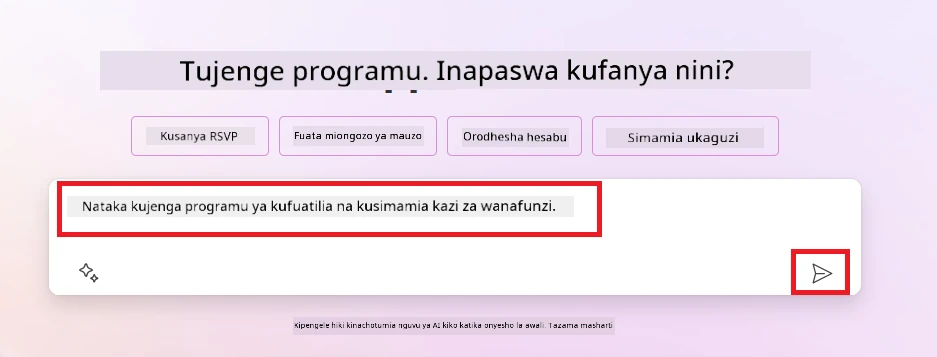

1. AI Copilot itapendekeza Jedwali la Dataverse lenye mashamba unayohitaji kuhifadhi data unayotaka kufuatilia na sampuli ya data. Kisha unaweza kubinafsisha jedwali kufikia mahitaji yako kwa kutumia kipengele cha msaidizi wa AI Copilot kupitia hatua za mazungumzo.

   > **Muhimu**: Dataverse ni jukwaa la data linaloshikiliwa nyuma la Power Platform. Ni jukwaa la data la low-code la kuhifadhi data za programu. Ni huduma inayosimamiwa kikamilifu inayohifadhi data salama katika Microsoft Cloud na imeanzishwa ndani ya mazingira yako ya Power Platform. Inakuja na uwezo wa usimamizi wa data umejengwa ndani, kama vile uainishaji wa data, asili ya data, udhibiti wa upatikanaji wa kina, na zaidi. Unaweza kujifunza zaidi kuhusu Dataverse [hapa](https://learn.microsoft.com/power-apps/maker/data-platform/data-platform-intro?WT.mc_id=academic-109639-somelezediko).

   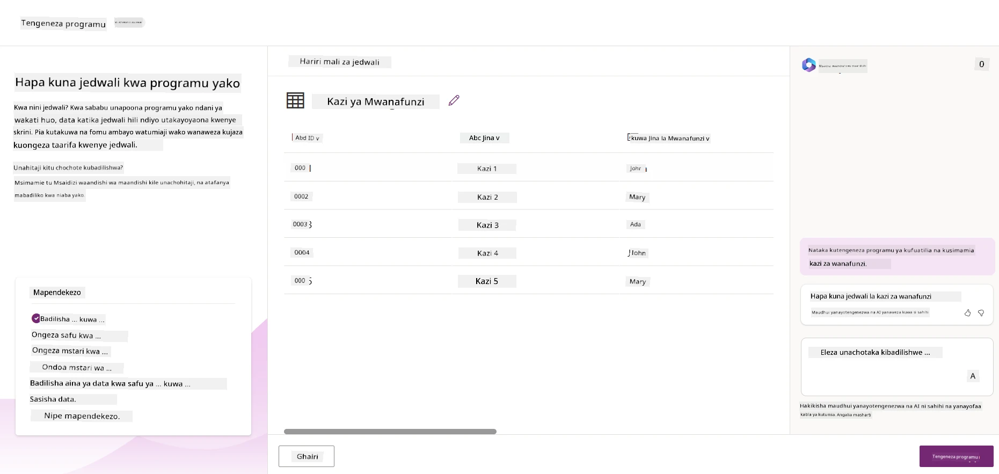

1. Walimu wanataka kutuma barua pepe kwa wanafunzi waliowasilisha kazi zao ili kuwahabarisha maendeleo ya kazi zao. Unaweza kutumia Copilot kuongeza shamba jipya kwenye jedwali kuhifadhi barua pepe za wanafunzi. Kwa mfano, unaweza kutumia maagizo yafuatayo kuongeza shamba jipya kwenye jedwali: **_Nataka kuongeza safu kuhifadhi barua pepe za wanafunzi_**. Bofya kitufe cha **Tuma** kutuma maelezo kwa AI Copilot.

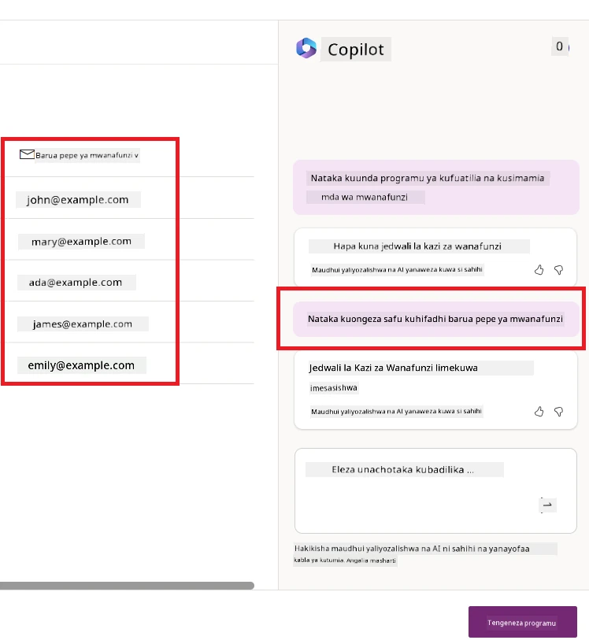

1. AI Copilot itatengeneza shamba jipya na kisha unaweza kubinafsisha shamba hilo kufikia mahitaji yako.

1. Ukimaliza na jedwali, bofya kitufe cha **Create app** kuunda programu.

1. AI Copilot itaunda programu ya Canvas inayoweza kujibu kulingana na maelezo yako. Kisha unaweza kubinafsisha programu ili kukidhi mahitaji yako.

1. Kwa waelimishaji kutuma barua pepe kwa wanafunzi, unaweza kutumia Copilot kuongeza skrini mpya kwenye programu. Kwa mfano, unaweza kutumia onyo lifuatalo kuongeza skrini mpya kwenye programu: **_Nataka kuongeza skrini ya kutuma barua pepe kwa wanafunzi_**. Bofya kitufe cha **Send** kutuma onyo hilo kwa AI Copilot.

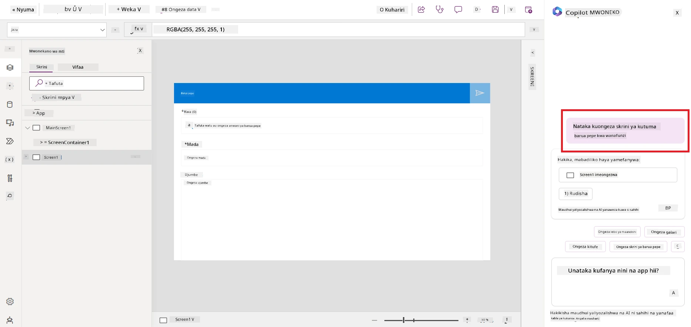

1. AI Copilot itaunda skrini mpya na kisha unaweza kubinafsisha skrini hiyo ili kukidhi mahitaji yako.

1. Ukimaliza na programu, bofya kitufe cha **Save** kuhifadhi programu.

1. Kushiriki programu na waelimishaji, bofya kitufe cha **Share** kisha bofya tena kitufe cha **Share**. Kisha unaweza kushiriki programu na waelimishaji kwa kuingiza anwani zao za barua pepe.

> **Kazi yako ya nyumbani**: Programu uliyounda ni mwanzo mzuri lakini inaweza kuboreshwa. Kwa kipengele cha barua pepe, waelimishaji wanaweza kutuma barua pepe kwa wanafunzi kwa mikono kwa kuandika anwani zao za barua pepe. Je, unaweza kutumia Copilot kujenga utaratibu wa kiotomatiki utakaowawezesha waelimishaji kutuma barua pepe kwa wanafunzi moja kwa moja wanapowasilisha majukumu yao? Kidokezo chako ni kwa onyo sahihi unaweza kutumia Copilot katika Power Automate kujenga hili.

### Jenga Jedwali la Taarifa za Ankara kwa Kuanza Biashara Yetu

Timu ya fedha ya kuanza biashara yetu imekuwa na shida kufuatilia ankara. Wamekuwa wakitumia lahajedwali kufuatilia ankara lakini imekuwa vigumu kusimamia kwani idadi ya ankara imeongezeka. Wamekuomba uunde jedwali litakalo kuwasaidia kuhifadhi, kufuatilia na kusimamia taarifa za ankara walizopokea. Jedwali hili litatumiwa kujenga utaratibu utakaotoa taarifa zote za ankara na kuzihifadhi kwenye jedwali. Pia, jedwali litawawezesha watu wa fedha kuona ankara zilizolipwa na zile ambazo hazijalipwa.

Power Platform ina jukwaa la msingi la data linaloitwa Dataverse ambalo linakuwezesha kuhifadhi data za programu na suluhisho zako. Dataverse hutoa jukwaa la data linalotumia kidogo coding kuhifadhi data za programu. Ni huduma inayosimamiwa kikamilifu inayohifadhi data kwa usalama katika Microsoft Cloud na hutolewa ndani ya mazingira yako ya Power Platform. Inakuja na uwezo wa usimamizi wa data uliowekwa tayari, kama vile uainishaji wa data, asili ya data, udhibiti wa upatikanaji kwa usahihi, na zaidi. Unaweza kujifunza zaidi [kuhusu Dataverse hapa](https://learn.microsoft.com/power-apps/maker/data-platform/data-platform-intro?WT.mc_id=academic-109639-somelezediko).

Kwanini tunapaswa kutumia Dataverse kwa kuanza biashara yetu? Jedwali za kawaida na za kawaida ndani ya Dataverse hutoa chaguo salama na la kuhifadhi kwenye wingu kwa data yako. Majedwali hukuwezesha kuhifadhi aina tofauti za data, kama unavyotumia mashuka mengi katika kitabu kimoja cha Excel. Unaweza kutumia jedwali kuhifadhi data ambazo ni maalum kwa shirika lako au mahitaji ya biashara. Baadhi ya faida zitakazopatikana kwenye kuanza biashara yetu kwa kutumia Dataverse ni pamoja na lakini siyo tu:

- **Rahisi kusimamia**: Metadata na data zote zinahifadhiwa kwenye wingu, hivyo hauhitaji kuwa na wasiwasi kuhusu maelezo ya jinsi zinavyohifadhiwa au kusimamiwa. Unaweza kuzingatia kujenga programu na suluhisho zako.

- **Salama**: Dataverse hutoa chaguo salama na linalotegemea wingu la kuhifadhi data zako. Unaweza kudhibiti nani ana upatikanaji wa data kwenye jedwali lako na jinsi wanavyoweza kuipata kwa kutumia usalama wa majukumu.

- **Metadata tajiri**: Aina za data na uhusiano hutumika moja kwa moja ndani ya Power Apps

- **Mantiki na uthibitisho**: Unaweza kutumia kanuni za biashara, viwanja vilivyohesabiwa, na kanuni za uthibitisho kutekeleza mantiki ya biashara na kudumisha usahihi wa data.

Sasa unajua Dataverse ni nini na kwanini unapaswa kuitumia, tuchunguze jinsi unavyoweza kutumia Copilot kuunda jedwali katika Dataverse ili kukidhi mahitaji ya timu yetu ya fedha.

> **Kumbuka** : Utautumia jedwali hili katika sehemu inayofuata kujenga utaratibu utakaotoa taarifa zote za ankara na kuzihifadhi kwenye jedwali.

Kuunda jedwali katika Dataverse kwa kutumia Copilot, fuata hatua zifuatazo:

1. Nenda kwenye [Power Apps](https://make.powerapps.com?WT.mc_id=academic-105485-koreyst) skrini kuu.

2. Kwenye bar ya mwelekeo wa kushoto, chagua **Tables** kisha bofya **Describe the new Table**.

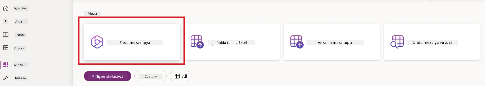

1. Kwenye skrini ya **Describe the new Table**, tumia eneo la maandishi kuelezea jedwali unalotaka kuunda. Kwa mfano, **_Nataka kuunda jedwali kuhifadhi taarifa za ankara_**. Bofya kitufe cha **Send** kutuma onyo kwa AI Copilot.

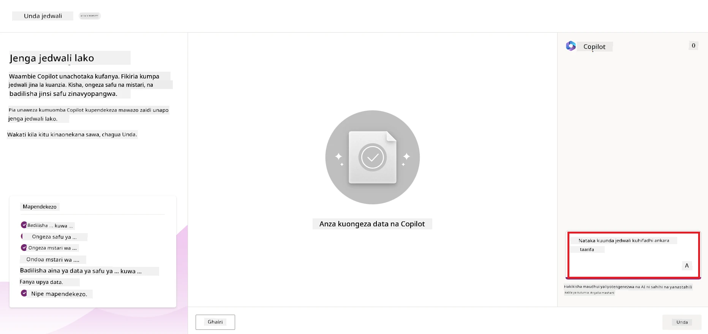

1. AI Copilot itapendekeza Jedwali la Dataverse lenye viwanja unavyohitaji kuhifadhi data unayotaka kufuatilia pamoja na data ya mfano. Kisha unaweza kubinafsisha jedwali ili kukidhi mahitaji yako ukitumia kipengele cha msaidizi wa AI Copilot kupitia hatua za mazungumzo.

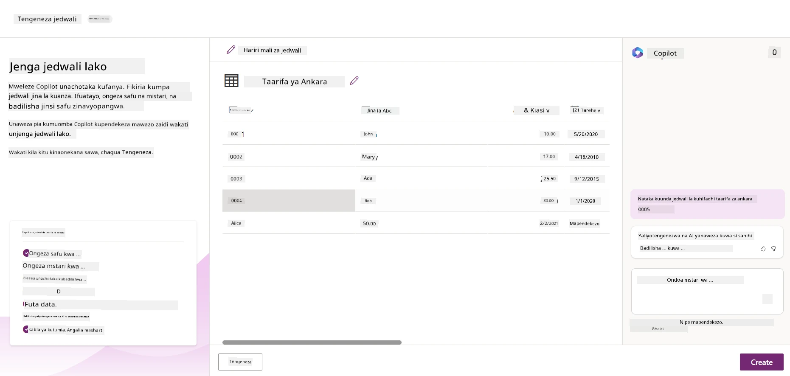

1. Timu ya fedha inataka kutuma barua pepe kwa muuzaji kuwajulisha kuhusu hali ya sasa ya ankara yao. Unaweza kutumia Copilot kuongeza uwanja mpya kwenye jedwali kuhifadhi barua pepe ya muuzaji. Kwa mfano, unaweza kutumia onyo lifuatalo kuongeza uwanja mpya kwenye jedwali: **_Nataka kuongeza safu kuhifadhi barua pepe ya muuzaji_**. Bofya kitufe cha **Send** kutuma onyo kwa AI Copilot.

1. AI Copilot itaunda uwanja mpya na kisha unaweza kubinafsisha uwanja huo ili kukidhi mahitaji yako.

1. Ukimaliza na jedwali, bofya kitufe cha **Create** kuunda jedwali.

## Miundo ya AI katika Power Platform na AI Builder

AI Builder ni uwezo wa AI wa kidhibiti kidogo unaopatikana katika Power Platform unaokuwezesha kutumia Miundo ya AI kusaidia kuendesha michakato na kutabiri matokeo. Ukiwa na AI Builder unaweza kuleta AI katika programu na mifuriko inayounganisha na data zako katika Dataverse au katika vyanzo tofauti vya data vya wingu, kama vile SharePoint, OneDrive au Azure.

## Miundo ya AI Ilijengwa Kabla vs Miundo ya AI Maalumu

AI Builder hutoa aina mbili za Miundo ya AI: Miundo ya AI Ilijengwa Kabla na Miundo ya AI Maalumu. Miundo ya AI Ilijengwa Kabla ni miundo tayari kwa matumizi iliyo funzwa na Microsoft na inapatikana katika Power Platform. Hii inakusaidia kuongeza akili kwenye programu na mifuriko bila kuwa na haja ya kukusanya data kisha kujenga, kufunza na kuchapisha miundo yako mwenyewe. Unaweza kutumia miundo hii kuendesha michakato na kutabiri matokeo.

Baadhi ya Miundo ya AI Ilijengwa Kabla inayopatikana katika Power Platform ni pamoja na:

- **Uchimbaji wa Kauli Muhimu**: Mfano huu huchimba kauli muhimu kutoka kwenye maandishi.
- **Ugunduzi wa Lugha**: Mfano huu hugundua lugha ya maandishi.
- **Uchambuzi wa Hisia**: Mfano huu hugundua hisia chanya, hasi, huru, au mchanganyiko wa hisia katika maandishi.
- **Msomaji wa Kadi za Biashara**: Mfano huu huchimba taarifa kutoka kwa kadi za biashara.
- **Utambuzi wa Maandishi**: Mfano huu huchimba maandishi kutoka kwenye picha.
- **Utambuzi wa Vitu**: Mfano huu hugundua na kuchimba vitu kutoka picha.
- **Usindikaji wa Hati**: Mfano huu huchimba taarifa kutoka katika fomu.
- **Usindikaji wa Ankara**: Mfano huu huchimba taarifa kutoka kwa ankara.

Ukiwa na Miundo ya AI Maalumu unaweza kuleta mfano wako binafsi katika AI Builder ili ifanye kazi kama mfano yeyote wa AI Builder maalumu, ikiwa omba kifundishwe mfano kwa kutumia data yako mwenyewe. Unaweza kutumia miundo hii kuendesha michakato na kutabiri matokeo katika Power Apps na Power Automate. Unapotumia mfano wako kuna vizingiti vinavyotumika. Soma zaidi kuhusu [vizingiti hivi](https://learn.microsoft.com/ai-builder/byo-model#limitations?WT.mc_id=academic-105485-koreyst).

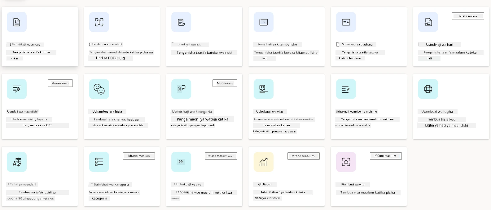

## Kazi ya Nyumbani #2 - Jenga Mtiririko wa Usindikaji Ankara kwa Kuanza Biashara Yetu

Timu ya fedha imekuwa na shida kusindika ankara. Wamekuwa wakitumia lahajedwali kufuatilia ankara lakini imekuwa vigumu kusimamia kwa sababu ya ongezeko la idadi ya ankara. Wamekuomba uunde mtiririko wa kazi utakaowawezesha kusindika ankara kwa kutumia AI. Mtiririko huo unapaswa kuwawezesha kutoa taarifa kutoka ankara na kuhifadhi taarifa katika jedwali la Dataverse. Pia mtiririko huo unapaswa kuwawezesha kutuma barua pepe kwa timu ya fedha ikiwa na taarifa zilizochimbwa.

Sasa unajua AI Builder ni nini na kwa nini unapaswa kuitumia, tuchunguze jinsi ya kutumia Mfano wa AI wa Usindikaji Ankara katika AI Builder, ambao tulijadili hapo awali, kujenga mtiririko wa kazi utakaosaidia timu ya fedha kusindika ankara.

Kujenga mtiririko wa kazi utakaosaidia timu ya fedha kusindika ankara kwa kutumia Mfano wa AI wa Usindikaji Ankara katika AI Builder, fuata hatua zifuatazo:

1. Nenda kwenye [Power Automate](https://make.powerautomate.com?WT.mc_id=academic-105485-koreyst) skrini kuu.

2. Tumia eneo la maandishi kwenye skrini kuu kuelezea mtiririko wa kazi unayotaka kujenga. Kwa mfano, **_Sindikiza ankara inapofika kwenye boksi langu la barua pepe_**. Bofya kitufe cha **Send** kutuma onyo kwa AI Copilot.

   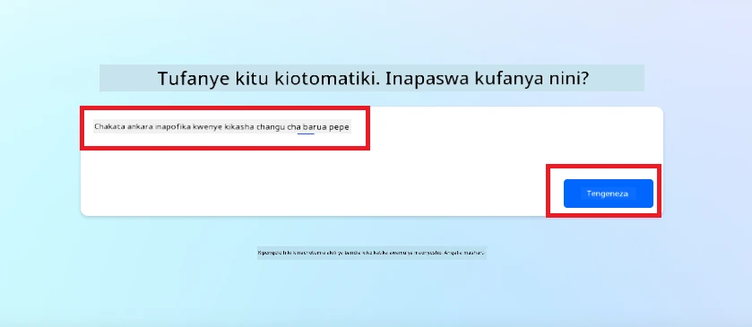

3. AI Copilot itapendekeza vitendo unavyohitaji kufanya kazi unayotaka kuendesha kwa otomatiki. Unaweza kubofya kitufe cha **Next** kupita hatua zinazofuata.

4. Kwenye hatua inayofuata, Power Automate itakuomba usanidi muunganisho unaohitajika kwa mtiririko. Ukimaliza, bofya kitufe cha **Create flow** kuunda mtiririko.

5. AI Copilot itaunda mtiririko na kisha unaweza kubinafsisha mtiririko kukidhi mahitaji yako.

6. Sasisha kichocheo cha mtiririko na weka **Folder** kwenye folda ambapo ankara zitahifadhiwa. Kwa mfano, unaweza kuweka folda kuwa **Inbox**. Bofya **Show advanced options** na weka **Only with Attachments** kuwa **Yes**. Hii itahakikisha mtiririko unatekelezwa tu barua pepe yenye Kiambatisho inapopokelewa kwenye folda.

7. Ondoa vitendo vifuatavyo katika mtiririko: **HTML to text**, **Compose**, **Compose 2**, **Compose 3** na **Compose 4** kwa sababu hutatumia vitendo hivyo.

8. Ondoa kitendo cha **Condition** kutoka mtiririko kwa sababu hutatumia. Kitakuwa na muonekano kama kwenye picha ifuatayo:

   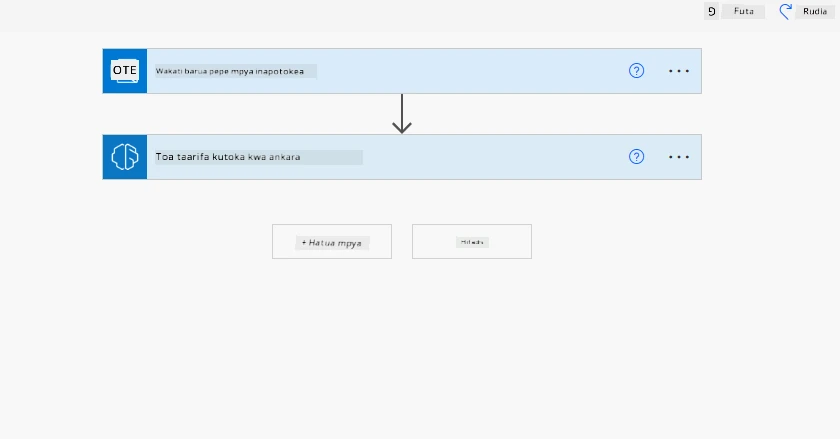

9. Bofya kitufe cha **Add an action** na tafuta **Dataverse**. Chagua kitendo cha **Add a new row**.

10. Kwenye kitendo cha **Extract Information from invoices**, sasisha **Invoice File** kuelekeza kwenye **Attachment Content** kutoka barua pepe. Hii itahakikisha mtiririko unachimba taarifa kutoka kiambatisho cha ankara.

11. Chagua **Table** uliyounda awali. Kwa mfano, unaweza kuchagua jedwali la **Invoice Information**. Chagua maudhui yanayobadilika kutoka kitendo kilichotangulia kujaza viwanja vifuatavyo:

    - ID
    - Kiasi
    - Tarehe
    - Jina
    - Hali - Weka **Hali** kuwa **Pending**.
    - Barua pepe ya Supplier - Tumia maudhui ya mabadiliko ya **From** kutoka kichocheo cha **When a new email arrives**.

    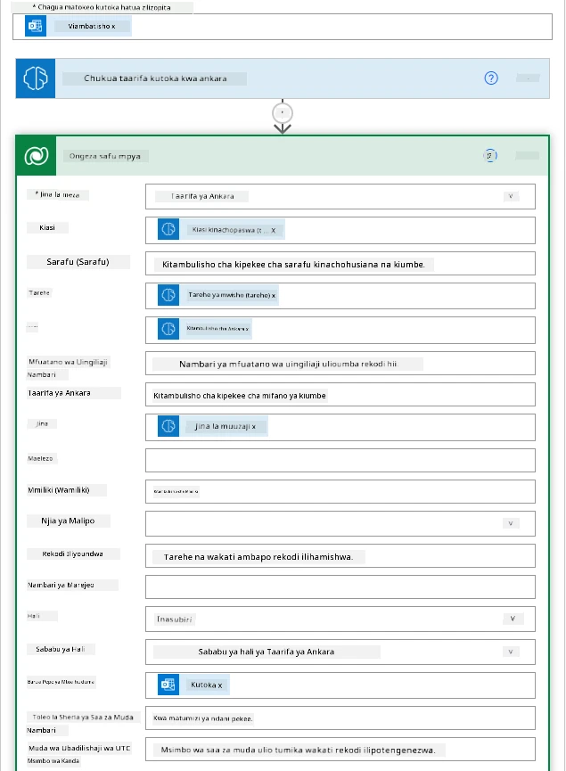

12. Ukimaliza na mtiririko, bofya kitufe cha **Save** kuhifadhi mtiririko. Kisha unaweza kujaribu mtiririko kwa kutuma barua pepe iliyo na ankara kwenye folda uliyobainisha kwenye kichocheo.

> **Kazi yako ya nyumbani**: Mtiririko uliounganisha ni mwanzo mzuri, sasa unahitaji kufikiria jinsi unavyoweza kujenga utaratibu wa kiotomatiki utakaowawezesha timu yetu ya fedha kutuma barua pepe kwa muuzaji kuwajulisha kuhusu hali ya sasa ya ankara yao. Kidokezo chako: mtiririko lazima uanze kazi wakati hali ya ankara inabadilika.

## Tumia Mfano wa AI wa Uundaji Maandishi katika Power Automate

Mfano wa AI wa Create Text na GPT katika AI Builder unakuwezesha kuzalisha maandishi kulingana na onyo na unategemea Huduma ya Microsoft Azure OpenAI. Kwa uwezo huu, unaweza kuingiza teknolojia ya GPT (Generative Pre-Trained Transformer) katika programu na mifuriko yako kujenga aina mbalimbali za mtiririko wa kazi wa kiotomatiki na maombi yenye maarifa.

Miundo ya GPT hupitia mafunzo makubwa kwa takwimu nyingi, ikiwawezesha kuzalisha maandishi yanayofanana na lugha ya binadamu wanapopatiwa onyo. Ikiwa imeunganishwa na otomatiki ya mtiririko wa kazi, miundo ya AI kama GPT inaweza kutumiwa kuwezesha na kuendesha kazi nyingi tofauti kwa ufanisi.

Kwa mfano, unaweza kujenga mifuriko kuzalisha maandishi kiotomatiki kwa matumizi mbalimbali, kama rasimu za barua pepe, maelezo ya bidhaa, na zaidi. Pia unaweza kutumia mfano huo kuzalisha maandishi kwa maombi mbalimbali, kama vile chatbots na programu za huduma kwa wateja zinazowawezesha maajenti wa huduma kwa wateja kujibu maswali ya wateja kwa ufanisi na ufanisi.

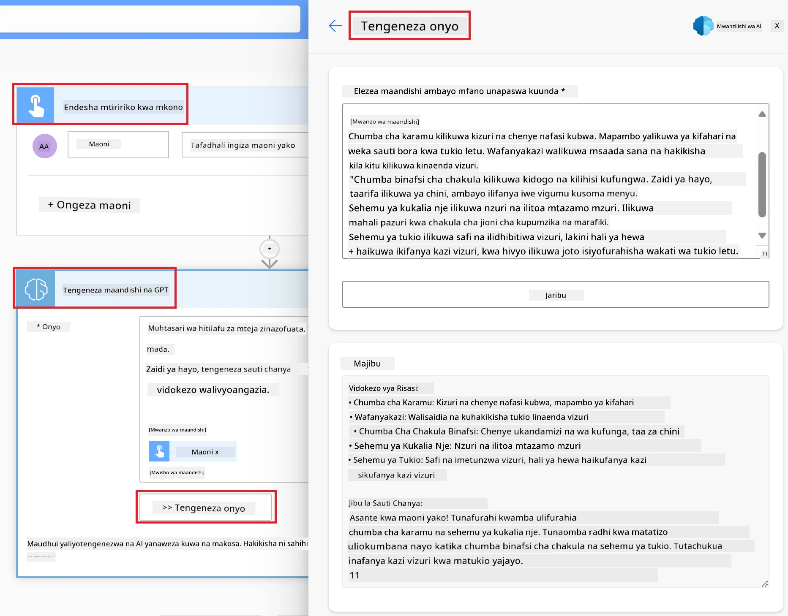

Ili kujifunza jinsi ya kutumia Hali hii ya AI katika Power Automate, pitia moduli ya [Ongeza akili na AI Builder na GPT](https://learn.microsoft.com/training/modules/ai-builder-text-generation/?WT.mc_id=academic-109639-somelezediko).

## Kazi Nzuri! Endelea Kujifunza

Baada ya kukamilisha somo hili, angalia [Mkusanyiko wa Kujifunza AI ya Kizazi](https://aka.ms/genai-collection?WT.mc_id=academic-105485-koreyst) ili kuendelea kuongeza maarifa yako ya AI ya Kizazi!

Unataka kubinafsisha na kupata zaidi kutoka Copilot? Chunguza [Awesome Copilot](https://github.com/github/awesome-copilot?WT.mc_id=academic-105485-koreyst) — mkusanyiko wa jamii uliochangia wa maagizo, mawakala, ujuzi, na usanidi ili kukusaidia kutumia GitHub Copilot vizuri zaidi.

Nenda kwenye Somo la 11 ambapo tutaangalia jinsi ya [kuunganisha AI ya Kizazi na Function Calling](../11-integrating-with-function-calling/README.md?WT.mc_id=academic-105485-koreyst)!

---

<!-- CO-OP TRANSLATOR DISCLAIMER START -->
**Kionyozo**:
Hati hii imetafsiriwa kwa kutumia huduma ya tafsiri ya AI [Co-op Translator](https://github.com/Azure/co-op-translator). Ingawa tunajitahidi kupata usahihi, tafadhali fahamu kwamba tafsiri za kiotomatiki zinaweza kuwa na makosa au upungufu wa usahihi. Hati ya asili katika lugha yake halisi inapaswa kuchukuliwa kama chanzo cha mamlaka. Kwa taarifa muhimu, tafsiri ya kitaalamu inayofanywa na binadamu inapendekezwa. Hatutojibu kwa kuelewa vibaya au tafsiri potofu zinazotokea kutokana na matumizi ya tafsiri hii.
<!-- CO-OP TRANSLATOR DISCLAIMER END -->