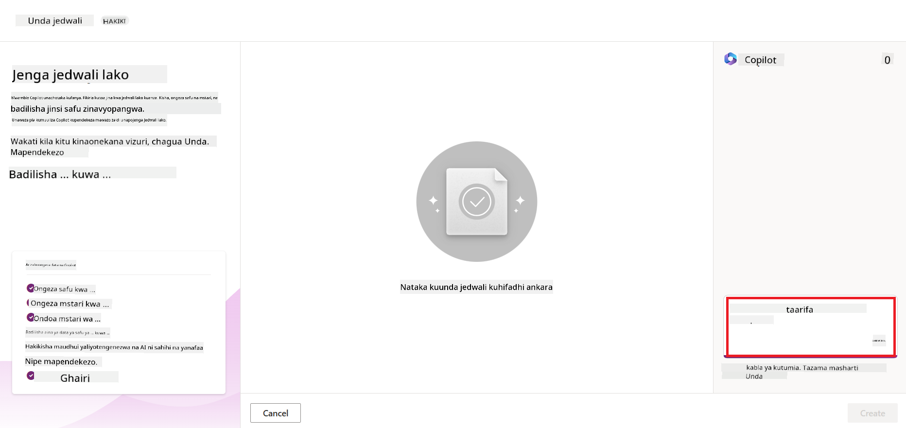
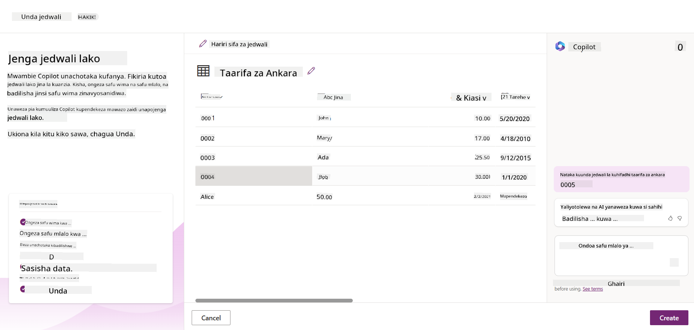
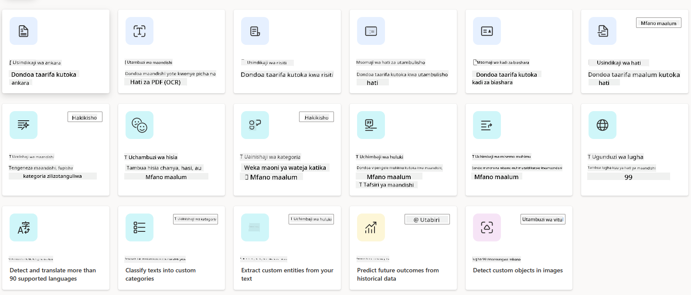
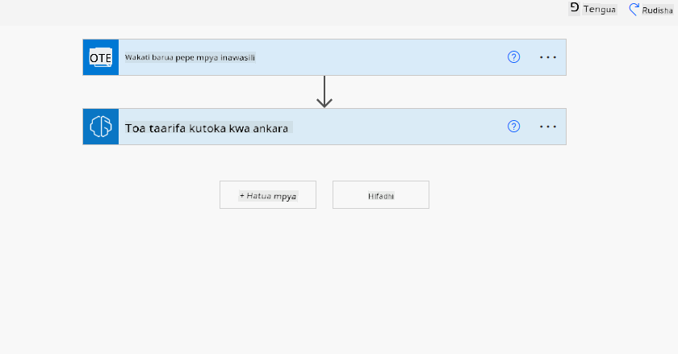
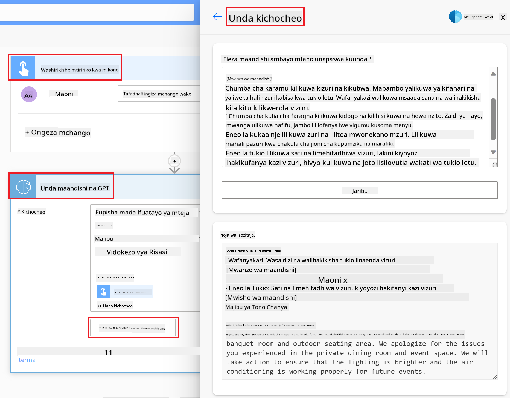

<!--
CO_OP_TRANSLATOR_METADATA:
{
  "original_hash": "846ac8e3b7dcfb697d3309fec05f0fea",
  "translation_date": "2025-10-17T21:14:12+00:00",
  "source_file": "10-building-low-code-ai-applications/README.md",
  "language_code": "sw"
}
-->
# Kujenga Programu za AI kwa Kutumia Nambari Kidogo

> _(Bonyeza picha hapo juu kutazama video ya somo hili)_

## Utangulizi

Sasa tumejifunza jinsi ya kujenga programu za kuzalisha picha, hebu tuzungumze kuhusu nambari kidogo. AI ya kizazi inaweza kutumika katika maeneo mbalimbali ikiwa ni pamoja na nambari kidogo, lakini nambari kidogo ni nini na tunawezaje kuongeza AI ndani yake?

Kujenga programu na suluhisho imekuwa rahisi kwa watengenezaji wa jadi na wasio watengenezaji kupitia matumizi ya Majukwaa ya Maendeleo ya Nambari Kidogo. Majukwaa haya yanakuwezesha kujenga programu na suluhisho kwa kutumia nambari kidogo au bila nambari kabisa. Hii inafanikishwa kwa kutoa mazingira ya maendeleo ya kuona yanayokuwezesha kuburuta na kuachia vipengele ili kujenga programu na suluhisho. Hii inakuwezesha kujenga programu na suluhisho haraka na kwa rasilimali chache. Katika somo hili, tunachunguza kwa kina jinsi ya kutumia nambari kidogo na jinsi ya kuboresha maendeleo ya nambari kidogo kwa AI kwa kutumia Power Platform.

Power Platform inatoa fursa kwa mashirika kuwawezesha timu zao kujenga suluhisho zao wenyewe kupitia mazingira ya nambari kidogo au bila nambari. Mazingira haya husaidia kurahisisha mchakato wa kujenga suluhisho. Kwa Power Platform, suluhisho zinaweza kujengwa kwa siku au wiki badala ya miezi au miaka. Power Platform ina bidhaa tano kuu: Power Apps, Power Automate, Power BI, Power Pages na Copilot Studio.

Somo hili linashughulikia:

- Utangulizi wa AI ya kizazi katika Power Platform
- Utangulizi wa Copilot na jinsi ya kuitumia
- Kutumia AI ya kizazi kujenga programu na mtiririko katika Power Platform
- Kuelewa Miundo ya AI katika Power Platform kwa kutumia AI Builder

## Malengo ya Kujifunza

Mwisho wa somo hili, utaweza:

- Kuelewa jinsi Copilot inavyofanya kazi katika Power Platform.

- Kujenga Programu ya Ufuatiliaji wa Kazi za Wanafunzi kwa ajili ya kampuni yetu ya elimu.

- Kujenga Mtiririko wa Usindikaji wa Ankara unaotumia AI kutoa taarifa kutoka kwa ankara.

- Kutumia mbinu bora wakati wa kutumia Mfano wa AI wa Kuunda Maandishi kwa GPT.

Zana na teknolojia utakazotumia katika somo hili ni:

- **Power Apps**, kwa programu ya Ufuatiliaji wa Kazi za Wanafunzi, ambayo inatoa mazingira ya maendeleo ya nambari kidogo kwa ajili ya kujenga programu za kufuatilia, kusimamia na kuingiliana na data.

- **Dataverse**, kwa kuhifadhi data ya programu ya Ufuatiliaji wa Kazi za Wanafunzi ambapo Dataverse itatoa jukwaa la data la nambari kidogo kwa kuhifadhi data ya programu.

- **Power Automate**, kwa mtiririko wa Usindikaji wa Ankara ambapo utakuwa na mazingira ya maendeleo ya nambari kidogo kwa ajili ya kujenga mtiririko wa kazi ili kuendesha mchakato wa Usindikaji wa Ankara.

- **AI Builder**, kwa Mfano wa AI wa Usindikaji wa Ankara ambapo utatumia Miundo ya AI iliyojengwa tayari kusindika ankara za kampuni yetu.

## AI ya Kizazi katika Power Platform

Kuboresha maendeleo ya nambari kidogo na programu kwa AI ya kizazi ni eneo muhimu la Power Platform. Lengo ni kuwezesha kila mtu kujenga programu, tovuti, dashibodi zenye nguvu za AI na kuendesha michakato kwa AI, _bila kuhitaji utaalamu wa sayansi ya data_. Lengo hili linatimizwa kwa kuunganisha AI ya kizazi katika uzoefu wa maendeleo ya nambari kidogo katika Power Platform kwa njia ya Copilot na AI Builder.

### Hii inafanyaje kazi?

Copilot ni msaidizi wa AI anayekuwezesha kujenga suluhisho za Power Platform kwa kuelezea mahitaji yako katika mfululizo wa hatua za mazungumzo kwa kutumia lugha ya kawaida. Kwa mfano, unaweza kumwelekeza msaidizi wako wa AI kusema ni sehemu gani programu yako itatumia na itaunda programu pamoja na mfano wa data wa msingi au unaweza kueleza jinsi ya kuanzisha mtiririko katika Power Automate.

Unaweza kutumia vipengele vinavyotokana na Copilot kama kipengele katika skrini za programu yako ili kuwezesha watumiaji kugundua maarifa kupitia mazungumzo.

AI Builder ni uwezo wa AI wa nambari kidogo unaopatikana katika Power Platform unaokuwezesha kutumia Miundo ya AI kukusaidia kuendesha michakato na kutabiri matokeo. Kwa AI Builder unaweza kuleta AI kwenye programu na mtiririko unaounganisha data yako katika Dataverse au katika vyanzo mbalimbali vya data vya wingu, kama SharePoint, OneDrive au Azure.

Copilot inapatikana katika bidhaa zote za Power Platform: Power Apps, Power Automate, Power BI, Power Pages na Power Virtual Agents. AI Builder inapatikana katika Power Apps na Power Automate. Katika somo hili, tutazingatia jinsi ya kutumia Copilot na AI Builder katika Power Apps na Power Automate kujenga suluhisho kwa kampuni yetu ya elimu.

### Copilot katika Power Apps

Kama sehemu ya Power Platform, Power Apps inatoa mazingira ya maendeleo ya nambari kidogo kwa ajili ya kujenga programu za kufuatilia, kusimamia na kuingiliana na data. Ni seti ya huduma za maendeleo ya programu yenye jukwaa la data linaloweza kupanuka na uwezo wa kuunganishwa na huduma za wingu na data ya ndani. Power Apps inakuwezesha kujenga programu zinazofanya kazi kwenye vivinjari, vidonge, na simu, na zinaweza kushirikiwa na wafanyakazi wenzako. Power Apps inarahisisha watumiaji kuingia katika maendeleo ya programu kwa kiolesura rahisi, ili kila mtumiaji wa biashara au mtengenezaji mtaalamu aweze kujenga programu maalum. Uzoefu wa maendeleo ya programu pia umeimarishwa na AI ya kizazi kupitia Copilot.

Kipengele cha msaidizi wa AI Copilot katika Power Apps kinakuruhusu kuelezea ni aina gani ya programu unayohitaji na ni taarifa gani unayotaka programu yako ifuatilie, ikusanye, au ionyeshe. Copilot kisha hutengeneza programu ya Canvas inayojibika kulingana na maelezo yako. Unaweza kisha kubinafsisha programu ili kukidhi mahitaji yako. Copilot ya AI pia hutengeneza na kupendekeza Jedwali la Dataverse lenye sehemu unazohitaji kuhifadhi data unayotaka kufuatilia na baadhi ya data ya mfano. Tutatazama Dataverse ni nini na jinsi unavyoweza kuitumia katika Power Apps katika somo hili baadaye. Unaweza kisha kubinafsisha jedwali ili kukidhi mahitaji yako kwa kutumia kipengele cha msaidizi wa AI Copilot kupitia hatua za mazungumzo. Kipengele hiki kinapatikana moja kwa moja kutoka skrini ya nyumbani ya Power Apps.

### Copilot katika Power Automate

Kama sehemu ya Power Platform, Power Automate inawawezesha watumiaji kuunda mtiririko wa kazi otomatiki kati ya programu na huduma. Inasaidia kuendesha michakato ya biashara inayojirudia kama mawasiliano, ukusanyaji wa data, na idhini za maamuzi. Kiolesura chake rahisi kinawawezesha watumiaji wa kila kiwango cha kiufundi (kutoka wanaoanza hadi watengenezaji wenye uzoefu) kuendesha kazi. Uzoefu wa maendeleo ya mtiririko wa kazi pia umeimarishwa na AI ya kizazi kupitia Copilot.

Kipengele cha msaidizi wa AI Copilot katika Power Automate kinakuruhusu kuelezea ni aina gani ya mtiririko unahitaji na ni hatua gani unataka mtiririko wako ufanye. Copilot kisha hutengeneza mtiririko kulingana na maelezo yako. Unaweza kisha kubinafsisha mtiririko ili kukidhi mahitaji yako. Copilot ya AI pia hutengeneza na kupendekeza hatua unazohitaji kufanya kazi unayotaka kuendesha. Tutatazama mtiririko ni nini na jinsi unavyoweza kuutumia katika Power Automate katika somo hili baadaye. Unaweza kisha kubinafsisha hatua ili kukidhi mahitaji yako kwa kutumia kipengele cha msaidizi wa AI Copilot kupitia hatua za mazungumzo. Kipengele hiki kinapatikana moja kwa moja kutoka skrini ya nyumbani ya Power Automate.

## Kazi: Simamia kazi za wanafunzi na ankara kwa kampuni yetu, kwa kutumia Copilot

Kampuni yetu inatoa kozi za mtandaoni kwa wanafunzi. Kampuni imekua haraka na sasa inajitahidi kufikia mahitaji ya kozi zake. Kampuni imekuajiri kama mtengenezaji wa Power Platform ili kuwasaidia kujenga suluhisho la nambari kidogo kusaidia kusimamia kazi za wanafunzi na ankara. Suluhisho lao linapaswa kuwa na uwezo wa kuwasaidia kufuatilia na kusimamia kazi za wanafunzi kupitia programu na kuendesha mchakato wa usindikaji wa ankara kupitia mtiririko wa kazi. Umeombwa kutumia AI ya kizazi kuendeleza suluhisho.

Unapoanza kutumia Copilot, unaweza kutumia [Maktaba ya Maelezo ya Copilot ya Power Platform](https://github.com/pnp/powerplatform-prompts?WT.mc_id=academic-109639-somelezediko) kuanza na maelezo. Maktaba hii ina orodha ya maelezo unayoweza kutumia kujenga programu na mtiririko kwa Copilot. Unaweza pia kutumia maelezo katika maktaba kupata wazo la jinsi ya kuelezea mahitaji yako kwa Copilot.

### Jenga Programu ya Ufuatiliaji wa Kazi za Wanafunzi kwa Kampuni Yetu

Walimu katika kampuni yetu wamekuwa wakijitahidi kufuatilia kazi za wanafunzi. Wamekuwa wakitumia lahajedwali kufuatilia kazi lakini hii imekuwa ngumu kusimamia kadri idadi ya wanafunzi imeongezeka. Wamekuomba ujenge programu itakayowasaidia kufuatilia na kusimamia kazi za wanafunzi. Programu inapaswa kuwawezesha kuongeza kazi mpya, kutazama kazi, kusasisha kazi na kufuta kazi. Programu inapaswa pia kuwawezesha walimu na wanafunzi kutazama kazi ambazo zimepimwa na zile ambazo hazijapimwa.

Utajenga programu kwa kutumia Copilot katika Power Apps ukifuata hatua zifuatazo:

1. Nenda kwenye skrini ya nyumbani ya [Power Apps](https://make.powerapps.com?WT.mc_id=academic-105485-koreyst).

1. Tumia eneo la maandishi kwenye skrini ya nyumbani kuelezea programu unayotaka kujenga. Kwa mfano, **_Nataka kujenga programu ya kufuatilia na kusimamia kazi za wanafunzi_**. Bonyeza kitufe cha **Tuma** kutuma maelezo kwa AI Copilot.

1. AI Copilot itapendekeza Jedwali la Dataverse lenye sehemu unazohitaji kuhifadhi data unayotaka kufuatilia na baadhi ya data ya mfano. Unaweza kisha kubinafsisha jedwali ili kukidhi mahitaji yako kwa kutumia kipengele cha msaidizi wa AI Copilot kupitia hatua za mazungumzo.

   > **Muhimu**: Dataverse ni jukwaa la data la msingi kwa Power Platform. Ni jukwaa la data la nambari kidogo kwa kuhifadhi data ya programu. Ni huduma inayosimamiwa kikamilifu inayohifadhi data kwa usalama katika Microsoft Cloud na hutolewa ndani ya mazingira yako ya Power Platform. Inakuja na uwezo wa usimamizi wa data uliojengwa ndani, kama uainishaji wa data, mfuatano wa data, udhibiti wa ufikiaji wa kina, na zaidi. Unaweza kujifunza zaidi kuhusu Dataverse [hapa](https://docs.microsoft.com/powerapps/maker/data-platform/data-platform-intro?WT.mc_id=academic-109639-somelezediko).

   

1. Walimu wanataka kutuma barua pepe kwa wanafunzi waliowasilisha kazi zao ili kuwafahamisha kuhusu maendeleo ya kazi zao. Unaweza kutumia Copilot kuongeza sehemu mpya kwenye jedwali kuhifadhi barua pepe za wanafunzi. Kwa mfano, unaweza kutumia maelezo yafuatayo kuongeza sehemu mpya kwenye jedwali: **_Nataka kuongeza safu kuhifadhi barua pepe za wanafunzi_**. Bonyeza kitufe cha **Tuma** kutuma maelezo kwa AI Copilot.

1. AI Copilot itatengeneza sehemu mpya na unaweza kisha kubinafsisha sehemu hiyo ili kukidhi mahitaji yako.

1. Ukimaliza na jedwali, bonyeza kitufe cha **Tengeneza programu** ili kutengeneza programu.

1. AI Copilot itatengeneza programu ya Canvas inayojibika kulingana na maelezo yako. Unaweza kisha kubinafsisha programu ili kukidhi mahitaji yako.

1. Ili walimu waweze kutuma barua pepe kwa wanafunzi, unaweza kutumia Copilot kuongeza skrini mpya kwenye programu. Kwa mfano, unaweza kutumia maelezo yafuatayo kuongeza skrini mpya kwenye programu: **_Nataka kuongeza skrini ya kutuma barua pepe kwa wanafunzi_**. Bonyeza kitufe cha **Tuma** kutuma maelezo kwa AI Copilot.

1. AI Copilot itatengeneza skrini mpya na unaweza kisha kubinafsisha skrini hiyo ili kukidhi mahitaji yako.

1. Ukimaliza na programu, bonyeza kitufe cha **Hifadhi** ili kuhifadhi programu.

1. Ili kushiriki programu na walimu, bonyeza kitufe cha **Shiriki** kisha bonyeza kitufe cha **Shiriki** tena. Unaweza kisha kushiriki programu na walimu kwa kuingiza anwani zao za barua pepe.

> **Kazi yako ya nyumbani**: Programu uliyotengeneza ni mwanzo mzuri lakini inaweza kuboreshwa. Kwa kipengele cha barua pepe, walimu wanaweza tu kutuma barua pepe kwa wanafunzi kwa mikono kwa kuandika barua pepe zao. Je, unaweza kutumia Copilot kujenga otomatiki itakayowawezesha walimu kutuma barua pepe kwa wanafunzi moja kwa moja wanapowasilisha kazi zao? Kidokezo chako ni kwamba kwa maelezo sahihi unaweza kutumia Copilot katika Power Automate kujenga hili.

### Jenga Jedwali la Taarifa za Ankara kwa Kampuni Yetu

Timu ya fedha ya kampuni yetu imekuwa ikijitahidi kufuatilia ankara. Wamekuwa wakitumia lahajedwali kufuatilia ankara lakini hii imekuwa ngumu kusimamia kadri idadi ya ankara imeongezeka. Wamekuomba ujenge jedwali litakalowasaidia kuhifadhi, kufuatilia na kusimamia taarifa za ankara wanazopokea. Jedwali linapaswa kutumika kujenga otomatiki itakayotoa taarifa zote za ankara na kuzihifadhi kwenye jedwali. Jedwali linapaswa pia kuwawezesha timu ya fedha kutazama ankara ambazo zimeshalipwa na zile ambazo hazijalipwa.

Power Platform ina jukwaa la data la msingi linaloitwa Dataverse linalokuwezesha kuhifadhi data kwa programu na suluhisho zako. Dataverse hutoa jukwaa la data la nambari kidogo kwa kuhifadhi data ya programu. Ni huduma inayosimamiwa kikamilifu inayohifadhi data kwa usalama katika Microsoft Cloud na hutolewa ndani ya mazingira yako ya Power Platform. Inakuja na uwezo wa usimamizi wa data uliojengwa ndani, kama uainishaji wa data, mfuatano wa data, udhibiti wa ufikiaji wa kina, na zaidi. Unaweza kujifunza zaidi [kuhusu Dataverse hapa](https://docs.microsoft.com/powerapps/maker/data-platform/data-platform-intro?WT.mc_id=academic-109639-somelezediko).
Kwa nini tunapaswa kutumia Dataverse kwa kampuni yetu changa? Jedwali za kawaida na za kipekee ndani ya Dataverse zinatoa chaguo salama na la kuhifadhi data kwa njia ya wingu. Jedwali zinakuruhusu kuhifadhi aina tofauti za data, sawa na jinsi unavyoweza kutumia karatasi nyingi za kazi katika kitabu kimoja cha Excel. Unaweza kutumia jedwali kuhifadhi data inayohusiana na mahitaji ya shirika au biashara yako. Baadhi ya faida ambazo kampuni yetu changa itapata kwa kutumia Dataverse ni pamoja na:

- **Rahisi kusimamia**: Metadata na data zote zinahifadhiwa kwenye wingu, kwa hivyo huna haja ya kuwa na wasiwasi kuhusu maelezo ya jinsi zinavyohifadhiwa au kusimamiwa. Unaweza kuzingatia kujenga programu na suluhisho zako.

- **Salama**: Dataverse inatoa chaguo salama na la kuhifadhi data kwa njia ya wingu. Unaweza kudhibiti nani anaweza kufikia data katika jedwali zako na jinsi wanavyoweza kufikia kwa kutumia usalama wa msingi wa majukumu.

- **Metadata tajiri**: Aina za data na mahusiano zinatumika moja kwa moja ndani ya Power Apps.

- **Mantiki na uthibitisho**: Unaweza kutumia sheria za biashara, sehemu zilizokokotwa, na sheria za uthibitisho kutekeleza mantiki ya biashara na kudumisha usahihi wa data.

Sasa kwa kuwa unajua Dataverse ni nini na kwa nini unapaswa kuitumia, hebu tuangalie jinsi unavyoweza kutumia Copilot kuunda jedwali katika Dataverse ili kukidhi mahitaji ya timu yetu ya fedha.

> **Note**: Utatumia jedwali hili katika sehemu inayofuata kujenga otomatiki ambayo itatoa taarifa zote za ankara na kuzihifadhi kwenye jedwali.

Ili kuunda jedwali katika Dataverse kwa kutumia Copilot, fuata hatua zifuatazo:

1. Nenda kwenye [Power Apps](https://make.powerapps.com?WT.mc_id=academic-105485-koreyst) skrini ya nyumbani.

2. Kwenye upau wa urambazaji wa kushoto, chagua **Tables** kisha bonyeza **Describe the new Table**.

3. Kwenye skrini ya **Describe the new Table**, tumia eneo la maandishi kuelezea jedwali unayotaka kuunda. Kwa mfano, **_Nataka kuunda jedwali kuhifadhi taarifa za ankara_**. Bonyeza kitufe cha **Send** kutuma maelezo kwa AI Copilot.

4. AI Copilot itapendekeza Jedwali la Dataverse lenye sehemu unazohitaji kuhifadhi data unayotaka kufuatilia na baadhi ya data ya mfano. Unaweza kubinafsisha jedwali ili kukidhi mahitaji yako kwa kutumia kipengele cha msaidizi wa AI Copilot kupitia hatua za mazungumzo.

5. Timu ya fedha inataka kutuma barua pepe kwa muuzaji kuwajulisha hali ya sasa ya ankara yao. Unaweza kutumia Copilot kuongeza sehemu mpya kwenye jedwali kuhifadhi barua pepe ya muuzaji. Kwa mfano, unaweza kutumia maelezo yafuatayo kuongeza sehemu mpya kwenye jedwali: **_Nataka kuongeza safu kuhifadhi barua pepe ya muuzaji_**. Bonyeza kitufe cha **Send** kutuma maelezo kwa AI Copilot.

6. AI Copilot itazalisha sehemu mpya na unaweza kubinafsisha sehemu hiyo ili kukidhi mahitaji yako.

7. Ukimaliza na jedwali, bonyeza kitufe cha **Create** kuunda jedwali.

## Miundo ya AI katika Power Platform na AI Builder

AI Builder ni uwezo wa AI wa kiwango cha chini unaopatikana katika Power Platform ambao unakuwezesha kutumia Miundo ya AI kusaidia kuendesha michakato na kutabiri matokeo. Kwa AI Builder unaweza kuleta AI kwenye programu na mtiririko unaounganisha data yako katika Dataverse au vyanzo mbalimbali vya data vya wingu, kama SharePoint, OneDrive au Azure.

## Miundo ya AI Iliyotengenezwa Tayari vs Miundo ya AI ya Kipekee

AI Builder inatoa aina mbili za Miundo ya AI: Miundo ya AI Iliyotengenezwa Tayari na Miundo ya AI ya Kipekee. Miundo ya AI Iliyotengenezwa Tayari ni miundo ya AI iliyotengenezwa na Microsoft na inapatikana katika Power Platform. Hii inakusaidia kuongeza akili kwenye programu na mtiririko bila haja ya kukusanya data na kisha kujenga, kufundisha na kuchapisha miundo yako mwenyewe. Unaweza kutumia miundo hii kuendesha michakato na kutabiri matokeo.

Baadhi ya Miundo ya AI Iliyotengenezwa Tayari inayopatikana katika Power Platform ni:

- **Uchimbaji wa Maneno Muhimu**: Muundo huu unachimba maneno muhimu kutoka kwa maandishi.
- **Utambuzi wa Lugha**: Muundo huu unatambua lugha ya maandishi.
- **Uchambuzi wa Hisia**: Muundo huu unatambua hisia chanya, hasi, za kawaida, au mchanganyiko katika maandishi.
- **Msomaji wa Kadi za Biashara**: Muundo huu unachimba taarifa kutoka kwa kadi za biashara.
- **Utambuzi wa Maandishi**: Muundo huu unachimba maandishi kutoka kwa picha.
- **Utambuzi wa Vitu**: Muundo huu unatambua na kuchimba vitu kutoka kwa picha.
- **Usindikaji wa Nyaraka**: Muundo huu unachimba taarifa kutoka kwa fomu.
- **Usindikaji wa Ankara**: Muundo huu unachimba taarifa kutoka kwa ankara.

Kwa Miundo ya AI ya Kipekee unaweza kuleta muundo wako mwenyewe katika AI Builder ili uweze kufanya kazi kama muundo wowote wa kipekee wa AI Builder, ukiruhusu kufundisha muundo kwa kutumia data yako mwenyewe. Unaweza kutumia miundo hii kuendesha michakato na kutabiri matokeo katika Power Apps na Power Automate. Unapotumia muundo wako mwenyewe kuna vikwazo vinavyotumika. Soma zaidi kuhusu [vikwazo hivi](https://learn.microsoft.com/ai-builder/byo-model#limitations?WT.mc_id=academic-105485-koreyst).

## Kazi #2 - Jenga Mtiririko wa Usindikaji wa Ankara kwa Kampuni Yetu Changa

Timu ya fedha imekuwa ikipata changamoto kusindika ankara. Wamekuwa wakitumia lahajedwali kufuatilia ankara lakini hili limekuwa gumu kusimamia kadri idadi ya ankara inavyoongezeka. Wamekuomba ujenge mtiririko ambao utawasaidia kusindika ankara kwa kutumia AI. Mtiririko unapaswa kuwawezesha kuchimba taarifa kutoka kwa ankara na kuhifadhi taarifa hizo kwenye jedwali la Dataverse. Mtiririko pia unapaswa kuwawezesha kutuma barua pepe kwa timu ya fedha na taarifa zilizochimbwa.

Sasa kwa kuwa unajua AI Builder ni nini na kwa nini unapaswa kuitumia, hebu tuangalie jinsi unavyoweza kutumia Muundo wa Usindikaji wa Ankara wa AI Builder, ambao tulizungumzia awali, kujenga mtiririko ambao utasaidia timu ya fedha kusindika ankara.

Ili kujenga mtiririko ambao utasaidia timu ya fedha kusindika ankara kwa kutumia Muundo wa Usindikaji wa Ankara wa AI Builder, fuata hatua zifuatazo:

1. Nenda kwenye [Power Automate](https://make.powerautomate.com?WT.mc_id=academic-105485-koreyst) skrini ya nyumbani.

2. Tumia eneo la maandishi kwenye skrini ya nyumbani kuelezea mtiririko unaotaka kujenga. Kwa mfano, **_Sindika ankara inapofika kwenye sanduku langu la barua_**. Bonyeza kitufe cha **Send** kutuma maelezo kwa AI Copilot.

   

3. AI Copilot itapendekeza hatua unazohitaji kutekeleza kazi unayotaka kuendesha. Unaweza kubonyeza kitufe cha **Next** kupitia hatua zinazofuata.

4. Katika hatua inayofuata, Power Automate itakuomba uweke miunganisho inayohitajika kwa mtiririko. Ukimaliza, bonyeza kitufe cha **Create flow** kuunda mtiririko.

5. AI Copilot itazalisha mtiririko na unaweza kubinafsisha mtiririko ili kukidhi mahitaji yako.

6. Sasisha kichocheo cha mtiririko na weka **Folder** kwenye folda ambapo ankara zitahifadhiwa. Kwa mfano, unaweza kuweka folda kuwa **Inbox**. Bonyeza **Show advanced options** na weka **Only with Attachments** kuwa **Yes**. Hii itahakikisha kwamba mtiririko unafanya kazi tu wakati barua pepe yenye kiambatisho inapokelewa kwenye folda.

7. Ondoa hatua zifuatazo kutoka kwa mtiririko: **HTML to text**, **Compose**, **Compose 2**, **Compose 3** na **Compose 4** kwa sababu hautazitumia.

8. Ondoa hatua ya **Condition** kutoka kwa mtiririko kwa sababu hautaitumia. Inapaswa kuonekana kama picha ifuatayo:

   

9. Bonyeza kitufe cha **Add an action** na tafuta **Dataverse**. Chagua hatua ya **Add a new row**.

10. Katika hatua ya **Extract Information from invoices**, sasisha **Invoice File** kuelekeza kwenye **Attachment Content** kutoka kwa barua pepe. Hii itahakikisha kwamba mtiririko unachimba taarifa kutoka kwa kiambatisho cha ankara.

11. Chagua **Table** ulilounda awali. Kwa mfano, unaweza kuchagua jedwali la **Invoice Information**. Chagua maudhui ya nguvu kutoka kwa hatua ya awali kujaza sehemu zifuatazo:

    - ID
    - Amount
    - Date
    - Name
    - Status - Weka **Status** kuwa **Pending**.
    - Supplier Email - Tumia maudhui ya nguvu ya **From** kutoka kwa kichocheo cha **When a new email arrives**.

    

12. Ukimaliza na mtiririko, bonyeza kitufe cha **Save** kuhifadhi mtiririko. Unaweza kisha kujaribu mtiririko kwa kutuma barua pepe yenye ankara kwenye folda uliyoainisha kwenye kichocheo.

> **Kazi yako ya nyumbani**: Mtiririko ulioujenga ni mwanzo mzuri, sasa unahitaji kufikiria jinsi unavyoweza kujenga otomatiki ambayo itawawezesha timu yetu ya fedha kutuma barua pepe kwa muuzaji kuwajulisha hali ya sasa ya ankara yao. Kidokezo chako: mtiririko lazima uanze wakati hali ya ankara inabadilika.

## Tumia Muundo wa AI wa Uzalishaji wa Maandishi katika Power Automate

Muundo wa Kuunda Maandishi na GPT katika AI Builder unakuwezesha kuzalisha maandishi kulingana na maelezo na unatumia huduma ya Microsoft Azure OpenAI. Kwa uwezo huu, unaweza kuingiza teknolojia ya GPT (Generative Pre-Trained Transformer) kwenye programu na mtiririko ili kujenga mtiririko wa kiotomatiki na programu zenye maarifa.

Miundo ya GPT hupitia mafunzo makubwa kwa kutumia data nyingi, ikiruhusu kuzalisha maandishi yanayofanana na lugha ya binadamu unapotoa maelezo. Unapounganisha na otomatiki ya mtiririko wa kazi, miundo ya AI kama GPT inaweza kutumika kurahisisha na kuendesha kazi mbalimbali.

Kwa mfano, unaweza kujenga mtiririko wa kuzalisha maandishi kiotomatiki kwa matumizi mbalimbali, kama: rasimu za barua pepe, maelezo ya bidhaa, na zaidi. Unaweza pia kutumia muundo kuzalisha maandishi kwa programu mbalimbali, kama vile chatbots na programu za huduma kwa wateja zinazowawezesha mawakala wa huduma kwa wateja kujibu maswali ya wateja kwa ufanisi.

Ili kujifunza jinsi ya kutumia Muundo huu wa AI katika Power Automate, pitia moduli ya [Ongeza akili na AI Builder na GPT](https://learn.microsoft.com/training/modules/ai-builder-text-generation/?WT.mc_id=academic-109639-somelezediko).

## Kazi Nzuri! Endelea Kujifunza

Baada ya kukamilisha somo hili, angalia mkusanyiko wetu wa [Generative AI Learning](https://aka.ms/genai-collection?WT.mc_id=academic-105485-koreyst) ili kuendelea kuongeza maarifa yako ya Generative AI!

Nenda kwenye Somo la 11 ambapo tutatazama jinsi ya [kuunganisha Generative AI na Function Calling](../11-integrating-with-function-calling/README.md?WT.mc_id=academic-105485-koreyst)!

---

**Kanusho**:  
Hati hii imetafsiriwa kwa kutumia huduma ya tafsiri ya AI [Co-op Translator](https://github.com/Azure/co-op-translator). Ingawa tunajitahidi kwa usahihi, tafadhali fahamu kuwa tafsiri za kiotomatiki zinaweza kuwa na makosa au kutokuwa sahihi. Hati ya asili katika lugha yake ya awali inapaswa kuzingatiwa kama chanzo cha mamlaka. Kwa taarifa muhimu, tafsiri ya kitaalamu ya binadamu inapendekezwa. Hatutawajibika kwa kutoelewana au tafsiri zisizo sahihi zinazotokana na matumizi ya tafsiri hii.