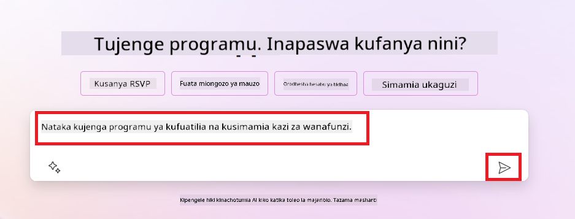
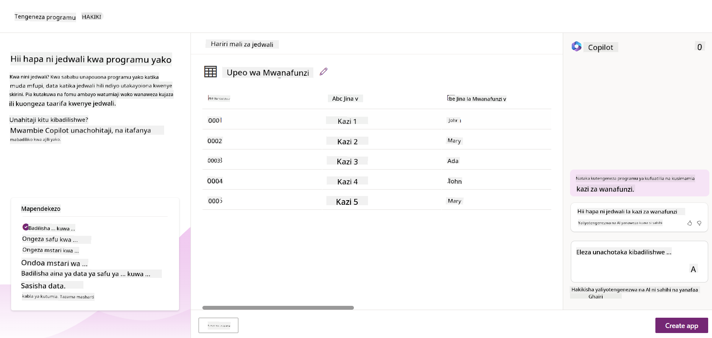
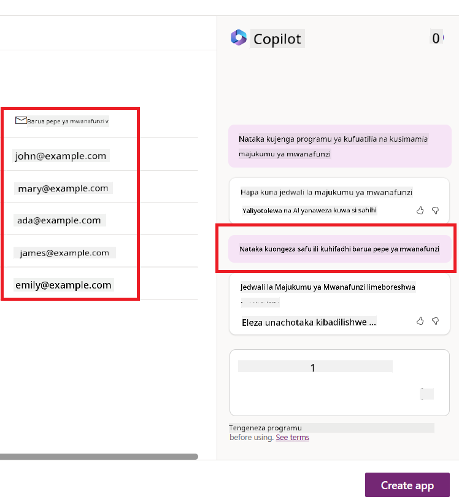
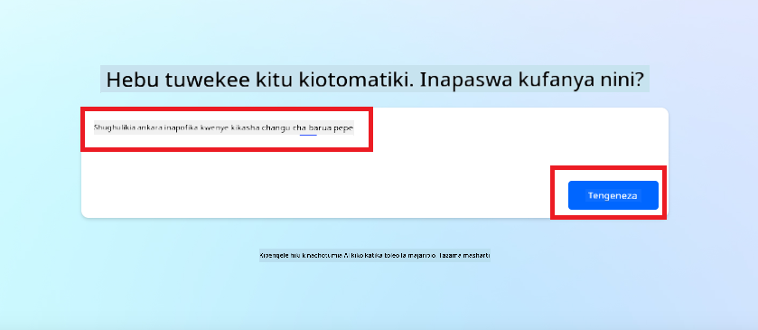
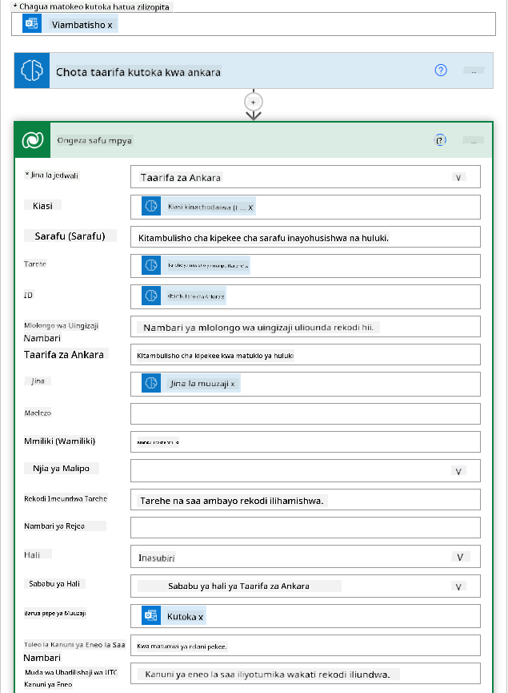

<!--
CO_OP_TRANSLATOR_METADATA:
{
  "original_hash": "f5ff3b6204a695a117d6f452403c95f7",
  "translation_date": "2025-07-09T14:09:49+00:00",
  "source_file": "10-building-low-code-ai-applications/README.md",
  "language_code": "sw"
}
-->
# Kujenga Programu za AI za Low Code

> _(Bonyeza picha hapo juu kutazama video ya somo hili)_

## Utangulizi

Sasa tunapojifunza jinsi ya kujenga programu zinazozalisha picha, hebu tuzungumze kuhusu low code. AI ya kizazi inaweza kutumika katika maeneo mbalimbali ikiwemo low code, lakini low code ni nini na tunawezaje kuongeza AI ndani yake?

Kujenga programu na suluhisho kumeweza kuwa rahisi kwa watengenezaji wa jadi na wasiotengeneza programu kupitia matumizi ya Low Code Development Platforms. Low Code Development Platforms hukuwezesha kujenga programu na suluhisho kwa kutumia kidogo au bila kutumia msimbo kabisa. Hii inafanikishwa kwa kutoa mazingira ya maendeleo ya kuona ambapo unaweza kuburuta na kuachia vipengele ili kujenga programu na suluhisho. Hii inakuwezesha kujenga programu na suluhisho kwa haraka zaidi na kwa rasilimali chache. Katika somo hili, tutachunguza kwa kina jinsi ya kutumia Low Code na jinsi ya kuboresha maendeleo ya low code kwa kutumia AI kupitia Power Platform.

Power Platform huwapa mashirika fursa ya kuwawezesha timu zao kujenga suluhisho zao kupitia mazingira rahisi ya low-code au no-code. Mazingira haya husaidia kurahisisha mchakato wa kujenga suluhisho. Kwa Power Platform, suluhisho zinaweza kujengwa kwa siku au wiki badala ya miezi au miaka. Power Platform ina bidhaa kuu tano: Power Apps, Power Automate, Power BI, Power Pages na Copilot Studio.

Somo hili linajumuisha:

- Utangulizi wa Generative AI katika Power Platform  
- Utangulizi wa Copilot na jinsi ya kuitumia  
- Kutumia Generative AI kujenga programu na mtiririko katika Power Platform  
- Kuelewa AI Models katika Power Platform kwa kutumia AI Builder  

## Malengo ya Kujifunza

Mwisho wa somo hili, utaweza:

- Kuelewa jinsi Copilot inavyofanya kazi katika Power Platform.  
- Kujenga Programu ya Kufuatilia Kazi za Wanafunzi kwa ajili ya startup yetu ya elimu.  
- Kujenga Mtiririko wa Usindikaji wa Ankara unaotumia AI kutoa taarifa kutoka kwa ankara.  
- Kutumia mbinu bora wakati wa kutumia Create Text na GPT AI Model.  

Zana na teknolojia utakazotumia katika somo hili ni:

- **Power Apps**, kwa ajili ya Programu ya Kufuatilia Kazi za Wanafunzi, inayotoa mazingira ya maendeleo ya low-code kwa ajili ya kujenga programu za kufuatilia, kusimamia na kuingiliana na data.  
- **Dataverse**, kwa kuhifadhi data za Programu ya Kufuatilia Kazi za Wanafunzi ambapo Dataverse itatoa jukwaa la data la low-code kuhifadhi data za programu.  
- **Power Automate**, kwa mtiririko wa Usindikaji wa Ankara ambapo utakuwa na mazingira ya maendeleo ya low-code kwa ajili ya kujenga mtiririko wa kazi za kuendesha mchakato wa Usindikaji wa Ankara.  
- **AI Builder**, kwa AI Model ya Usindikaji wa Ankara ambapo utatumia AI Models zilizojengwa tayari kusindika ankara kwa ajili ya startup yetu.  

## Generative AI katika Power Platform

Kuboresha maendeleo ya low-code na programu kwa kutumia generative AI ni eneo kuu la mkazo kwa Power Platform. Lengo ni kuwawezesha watu wote kujenga programu, tovuti, dashibodi na kuendesha mchakato kwa AI, _bila hitaji la ujuzi wa sayansi ya data_. Lengo hili linafikiwa kwa kuingiza generative AI katika uzoefu wa maendeleo ya low-code katika Power Platform kwa njia ya Copilot na AI Builder.

### Hii hufanya kazi vipi?

Copilot ni msaidizi wa AI anayekuwezesha kujenga suluhisho za Power Platform kwa kuelezea mahitaji yako kupitia hatua za mazungumzo kwa lugha ya kawaida. Kwa mfano, unaweza kumuagiza msaidizi wako wa AI kueleza ni sehemu gani programu yako itatumia na ataunda programu pamoja na mfano wa data unaoendeshwa au unaweza kuelezea jinsi ya kuanzisha mtiririko katika Power Automate.

Unaweza kutumia vipengele vinavyoendeshwa na Copilot kama kipengele katika skrini za programu zako ili kuwasaidia watumiaji kupata maarifa kupitia mazungumzo.

AI Builder ni uwezo wa AI wa low-code unaopatikana katika Power Platform unaokuwezesha kutumia AI Models kusaidia kuendesha mchakato na kutabiri matokeo. Kwa AI Builder unaweza kuleta AI katika programu na mitiririko inayounganisha na data zako katika Dataverse au vyanzo mbalimbali vya data za wingu kama SharePoint, OneDrive au Azure.

Copilot inapatikana katika bidhaa zote za Power Platform: Power Apps, Power Automate, Power BI, Power Pages na Power Virtual Agents. AI Builder inapatikana katika Power Apps na Power Automate. Katika somo hili, tutazingatia jinsi ya kutumia Copilot na AI Builder katika Power Apps na Power Automate kujenga suluhisho kwa startup yetu ya elimu.

### Copilot katika Power Apps

Kama sehemu ya Power Platform, Power Apps hutoa mazingira ya maendeleo ya low-code kwa ajili ya kujenga programu za kufuatilia, kusimamia na kuingiliana na data. Ni huduma ya maendeleo ya programu yenye jukwaa la data linaloweza kupanuka na uwezo wa kuunganishwa na huduma za wingu na data za ndani. Power Apps hukuwezesha kujenga programu zinazotumika kwenye vivinjari, vidonge, na simu, na zinaweza kushirikiwa na wenzako kazini. Power Apps hufanya maendeleo ya programu kuwa rahisi kwa watumiaji kwa kutumia kiolesura rahisi, ili kila mtumiaji wa biashara au mtaalamu wa maendeleo aweze kujenga programu za kawaida. Uzoefu wa maendeleo ya programu pia umeboreshwa kwa kutumia Generative AI kupitia Copilot.

Kipengele cha msaidizi wa AI Copilot katika Power Apps hukuwezesha kuelezea aina ya programu unayohitaji na taarifa unayotaka programu yako ifuatilie, ikusanye, au ionyeshe. Copilot kisha hutengeneza programu ya Canvas inayojibu kulingana na maelezo yako. Baadaye unaweza kubadilisha programu ili ikidhi mahitaji yako. AI Copilot pia hutengeneza na kupendekeza Jedwali la Dataverse lenye sehemu unazohitaji kuhifadhi data unayotaka kufuatilia pamoja na sampuli za data. Tutatazama Dataverse ni nini na jinsi unavyoweza kuitumia katika Power Apps katika somo hili baadaye. Baadaye unaweza kubadilisha jedwali ili likidhi mahitaji yako kwa kutumia kipengele cha msaidizi wa AI Copilot kupitia hatua za mazungumzo. Kipengele hiki kinapatikana moja kwa moja kutoka kwenye skrini kuu ya Power Apps.

### Copilot katika Power Automate

Kama sehemu ya Power Platform, Power Automate huwasaidia watumiaji kuunda mitiririko ya kazi ya kiotomatiki kati ya programu na huduma. Husaidia kuendesha mchakato wa biashara unaorudiwa kama mawasiliano, ukusanyaji wa data, na idhini za maamuzi. Kiolesura chake rahisi huruhusu watumiaji wa viwango vyote vya ujuzi (kuanzia wanaoanza hadi watengenezaji wenye uzoefu) kuendesha kazi za kiotomatiki. Uzoefu wa maendeleo ya mtiririko pia umeboreshwa kwa kutumia Generative AI kupitia Copilot.

Kipengele cha msaidizi wa AI Copilot katika Power Automate hukuwezesha kuelezea aina ya mtiririko unayohitaji na hatua unazotaka mtiririko wako ufanye. Copilot kisha hutengeneza mtiririko kulingana na maelezo yako. Baadaye unaweza kubadilisha mtiririko ili ukidhi mahitaji yako. AI Copilot pia hutengeneza na kupendekeza hatua unazohitaji kufanya kazi unayotaka kuendesha kiotomatiki. Tutatazama ni nini mitiririko na jinsi unavyoweza kuitumia Power Automate katika somo hili baadaye. Baadaye unaweza kubadilisha hatua ili zikidhi mahitaji yako kwa kutumia kipengele cha msaidizi wa AI Copilot kupitia hatua za mazungumzo. Kipengele hiki kinapatikana moja kwa moja kutoka kwenye skrini kuu ya Power Automate.

## Kazi ya Nyumbani: Simamia kazi za wanafunzi na ankara kwa startup yetu, ukitumia Copilot

Startup yetu hutoa kozi mtandaoni kwa wanafunzi. Startup imekua kwa kasi na sasa inapata shida kufuatilia mahitaji ya kozi zake. Startup imekuajiri wewe kama mtengenezaji wa Power Platform kusaidia kujenga suluhisho la low code kusaidia kusimamia kazi za wanafunzi na ankara zao. Suluhisho lao linapaswa kusaidia kufuatilia na kusimamia kazi za wanafunzi kupitia programu na kuendesha mchakato wa usindikaji wa ankara kupitia mtiririko wa kazi. Umeombwa kutumia Generative AI kuendeleza suluhisho hilo.

Unapoanza kutumia Copilot, unaweza kutumia [Power Platform Copilot Prompt Library](https://github.com/pnp/powerplatform-prompts?WT.mc_id=academic-109639-somelezediko) kupata maelekezo ya kuanzia. Maktaba hii ina orodha ya maelekezo unayoweza kutumia kujenga programu na mitiririko kwa Copilot. Pia unaweza kutumia maelekezo katika maktaba kupata wazo la jinsi ya kuelezea mahitaji yako kwa Copilot.

### Jenga Programu ya Kufuatilia Kazi za Wanafunzi kwa Startup Yetu

Wafundishaji katika startup yetu wamekuwa wakipata shida kufuatilia kazi za wanafunzi. Wamekuwa wakitumia jedwali la Excel kufuatilia kazi lakini imekuwa vigumu kusimamia kadri idadi ya wanafunzi inavyoongezeka. Wamekuomba ujenge programu itakayowasaidia kufuatilia na kusimamia kazi za wanafunzi. Programu inapaswa kuwawezesha kuongeza kazi mpya, kuona kazi, kusasisha kazi na kufuta kazi. Programu pia inapaswa kuwawezesha wafundishaji na wanafunzi kuona kazi zilizopimwa na zile ambazo hazijapimwa.

Utajenga programu kwa kutumia Copilot katika Power Apps ukifuata hatua zifuatazo:

1. Nenda kwenye [skrini kuu ya Power Apps](https://make.powerapps.com?WT.mc_id=academic-105485-koreyst).

1. Tumia eneo la maandishi kwenye skrini kuu kuelezea programu unayotaka kujenga. Kwa mfano, **_Nataka kujenga programu ya kufuatilia na kusimamia kazi za wanafunzi_**. Bonyeza kitufe cha **Send** kutuma maelekezo kwa AI Copilot.

1. AI Copilot itapendekeza Jedwali la Dataverse lenye sehemu unazohitaji kuhifadhi data unayotaka kufuatilia pamoja na sampuli za data. Baadaye unaweza kubadilisha jedwali ili likidhi mahitaji yako kwa kutumia kipengele cha msaidizi wa AI Copilot kupitia hatua za mazungumzo.

   > **Muhimu**: Dataverse ni jukwaa la data linaloendesha Power Platform. Ni jukwaa la data la low-code kwa kuhifadhi data za programu. Ni huduma inayosimamiwa kikamilifu inayohifadhi data kwa usalama katika Microsoft Cloud na imewekwa ndani ya mazingira yako ya Power Platform. Inakuja na uwezo wa usimamizi wa data kama vile upangaji wa data, asili ya data, udhibiti wa upatikanaji wa kina, na zaidi. Unaweza kujifunza zaidi kuhusu Dataverse [hapa](https://docs.microsoft.com/powerapps/maker/data-platform/data-platform-intro?WT.mc_id=academic-109639-somelezediko).

   

1. Wafundishaji wanataka kutuma barua pepe kwa wanafunzi waliowasilisha kazi zao ili kuwaarifu kuhusu maendeleo ya kazi zao. Unaweza kutumia Copilot kuongeza sehemu mpya kwenye jedwali kuhifadhi barua pepe za wanafunzi. Kwa mfano, unaweza kutumia maelekezo yafuatayo kuongeza sehemu mpya kwenye jedwali: **_Nataka kuongeza safu kuhifadhi barua pepe za wanafunzi_**. Bonyeza kitufe cha **Send** kutuma maelekezo kwa AI Copilot.

1. AI Copilot itatengeneza sehemu mpya na baadaye unaweza kubadilisha sehemu hiyo ili ikidhi mahitaji yako.

1. Ukimaliza na jedwali, bonyeza kitufe cha **Create app** kuunda programu.

1. AI Copilot itatengeneza programu ya Canvas inayojibu kulingana na maelezo yako. Baadaye unaweza kubadilisha programu ili ikidhi mahitaji yako.

1. Kwa ajili ya wafundishaji kutuma barua pepe kwa wanafunzi, unaweza kutumia Copilot kuongeza skrini mpya kwenye programu. Kwa mfano, unaweza kutumia maelekezo yafuatayo kuongeza skrini mpya: **_Nataka kuongeza skrini ya kutuma barua pepe kwa wanafunzi_**. Bonyeza kitufe cha **Send** kutuma maelekezo kwa AI Copilot.

1. AI Copilot itatengeneza skrini mpya na baadaye unaweza kubadilisha skrini hiyo ili ikidhi mahitaji yako.

1. Ukimaliza na programu, bonyeza kitufe cha **Save** kuhifadhi programu.

1. Kushiriki programu na wafundishaji, bonyeza kitufe cha **Share** kisha bonyeza tena kitufe cha **Share**. Baadaye unaweza kushiriki programu kwa wafundishaji kwa kuingiza anwani zao za barua pepe.

> **Kazi yako ya nyumbani**: Programu uliyotengeneza ni mwanzo mzuri lakini inaweza kuboreshwa. Kwa kipengele cha barua pepe, wafundishaji wanaweza kutuma barua pepe kwa wanafunzi kwa mikono kwa kuandika barua pepe zao. Je, unaweza kutumia Copilot kujenga otomatiki itakayowawezesha wafundishaji kutuma barua pepe kwa wanafunzi moja kwa moja wanapowasilisha kazi zao? Dokezo lako ni kwa kutumia maelekezo sahihi unaweza kutumia Copilot katika Power Automate kujenga hii.

### Jenga Jedwali la Taarifa za Ankara kwa Startup Yetu

Timu ya fedha ya startup yetu imekuwa ikipata shida kufuatilia ankara. Wamekuwa wakitumia jedwali la Excel kufuatilia ankara lakini imekuwa vigumu kusimamia kadri idadi ya ankara inavyoongezeka. Wamekuomba ujenge jedwali litakalowasaidia kuhifadhi, kufuatilia na kusimamia taarifa za ankara wanazopokea. Jedwali linapaswa kutumika kujenga otomatiki itakayochukua taarifa zote za ankara na kuzihifadhi kwenye jedwali. Jedwali pia linapaswa kuwawezesha timu ya fedha kuona ankara zilizolipwa na zile ambazo hazijalipwa.

Power Platform ina jukwaa la data linaloitwa Dataverse ambalo linakuwezesha kuhifadhi data za programu na suluhisho zako. Dataverse hutoa jukwaa la data la low-code kwa kuhifadhi data za programu. Ni huduma inayosimamiwa kikamilifu inayohifadhi data kwa usalama katika Microsoft Cloud na imewekwa ndani ya mazingira yako ya Power Platform. Inakuja na uwezo wa usimamizi wa data kama upangaji wa data, asili ya data, udhibiti wa upatikanaji wa kina, na zaidi. Unaweza kujifunza zaidi [kuhusu Dataverse hapa](https://docs.microsoft.com/powerapps/maker/data-platform/data-platform-intro?WT.mc_id=academic-109639-somelezediko).

Kwa nini tunapaswa kutumia Dataverse kwa startup yetu? Jedwali za kawaida na maalum ndani ya Dataverse hutoa chaguo salama na la kuhifadhi data kwa wingu kwa data zako. Jedwali hukuwezesha kuhifadhi aina tofauti za data, kama vile unavyoweza kutumia karatasi nyingi katika kitabu kimoja cha Excel. Unaweza kutumia jedwali kuhifadhi data inayohusiana na shirika lako au mahitaji ya biashara. Baadhi ya faida ambazo startup yetu itapata kwa kutumia Dataverse ni pamoja na lakini si tu:
- **Rahisi kusimamia**: Metadata na data zote huhifadhiwa katika wingu, hivyo huna haja ya kuwa na wasiwasi kuhusu jinsi zinavyohifadhiwa au kusimamiwa. Unaweza kuzingatia kujenga programu na suluhisho zako.

- **Salama**: Dataverse hutoa chaguo salama na la kuhifadhi data kwenye wingu. Unaweza kudhibiti nani anaweza kufikia data katika meza zako na jinsi wanavyoweza kuifikia kwa kutumia usalama unaotegemea majukumu.

- **Metadata tajiri**: Aina za data na uhusiano hutumika moja kwa moja ndani ya Power Apps

- **Mantiki na uthibitisho**: Unaweza kutumia sheria za biashara, sehemu zilizohesabiwa, na sheria za uthibitisho ili kutekeleza mantiki ya biashara na kudumisha usahihi wa data.

Sasa unajua Dataverse ni nini na kwa nini unapaswa kuitumia, tuchunguze jinsi unavyoweza kutumia Copilot kuunda meza katika Dataverse ili kukidhi mahitaji ya timu yetu ya fedha.

> **Note** : Utatumia meza hii katika sehemu inayofuata kujenga otomatiki itakayochukua taarifa zote za ankara na kuzihifadhi kwenye meza.

Ili kuunda meza katika Dataverse ukitumia Copilot, fuata hatua zilizo hapa chini:

1. Nenda kwenye skrini ya nyumbani ya [Power Apps](https://make.powerapps.com?WT.mc_id=academic-105485-koreyst).

2. Kwenye upau wa urambazaji wa kushoto, chagua **Tables** kisha bonyeza **Describe the new Table**.

3. Kwenye skrini ya **Describe the new Table**, tumia eneo la maandishi kuelezea meza unayotaka kuunda. Kwa mfano, **_Nataka kuunda meza kuhifadhi taarifa za ankara_**. Bonyeza kitufe cha **Send** kutuma ombi kwa AI Copilot.

4. AI Copilot itapendekeza Meza ya Dataverse yenye sehemu unazohitaji kuhifadhi data unayotaka kufuatilia pamoja na sampuli ya data. Kisha unaweza kubinafsisha meza ili kukidhi mahitaji yako kwa kutumia kipengele cha msaidizi wa AI Copilot kupitia hatua za mazungumzo.

5. Timu ya fedha inataka kutuma barua pepe kwa muuzaji kuwajulisha hali ya sasa ya ankara yao. Unaweza kutumia Copilot kuongeza sehemu mpya kwenye meza kuhifadhi barua pepe ya muuzaji. Kwa mfano, unaweza kutumia ombi lifuatalo kuongeza sehemu mpya kwenye meza: **_Nataka kuongeza safu kuhifadhi barua pepe ya muuzaji_**. Bonyeza kitufe cha **Send** kutuma ombi kwa AI Copilot.

6. AI Copilot itaunda sehemu mpya na kisha unaweza kubinafsisha sehemu hiyo ili kukidhi mahitaji yako.

7. Ukimaliza na meza, bonyeza kitufe cha **Create** kuunda meza.

## AI Models katika Power Platform na AI Builder

AI Builder ni uwezo wa AI wa nambari kidogo unaopatikana katika Power Platform unaokuwezesha kutumia AI Models kusaidia kuendesha michakato kiotomatiki na kutabiri matokeo. Kwa AI Builder unaweza kuleta AI kwenye programu na mtiririko unaounganisha na data yako katika Dataverse au vyanzo mbalimbali vya data vya wingu, kama vile SharePoint, OneDrive au Azure.

## AI Models Zilizojengwa Awali dhidi ya AI Models Maalum

AI Builder hutoa aina mbili za AI Models: AI Models Zilizojengwa Awali na AI Models Maalum. AI Models Zilizojengwa Awali ni AI Models tayari kutumia zilizofunzwa na Microsoft na zinapatikana katika Power Platform. Hizi zinakusaidia kuongeza akili kwenye programu na mtiririko bila ya kukusanya data kisha kujenga, kufunza na kuchapisha modeli zako mwenyewe. Unaweza kutumia modeli hizi kuendesha michakato kiotomatiki na kutabiri matokeo.

Baadhi ya AI Models Zilizojengwa Awali zinazopatikana katika Power Platform ni:

- **Key Phrase Extraction**: Modeli hii hutambua maneno muhimu kutoka kwenye maandishi.
- **Language Detection**: Modeli hii hutambua lugha ya maandishi.
- **Sentiment Analysis**: Modeli hii hutambua hisia chanya, hasi, huru, au mchanganyiko wa hisia katika maandishi.
- **Business Card Reader**: Modeli hii hutambua taarifa kutoka kwenye kadi za biashara.
- **Text Recognition**: Modeli hii hutambua maandishi kutoka kwenye picha.
- **Object Detection**: Modeli hii hutambua na kutoa vitu kutoka kwenye picha.
- **Document processing**: Modeli hii hutambua taarifa kutoka kwenye fomu.
- **Invoice Processing**: Modeli hii hutambua taarifa kutoka kwenye ankara.

Kwa AI Models Maalum unaweza kuleta modeli yako mwenyewe ndani ya AI Builder ili ifanye kazi kama modeli yoyote maalum ya AI Builder, ikikuruhusu kufunza modeli kwa kutumia data yako mwenyewe. Unaweza kutumia modeli hizi kuendesha michakato kiotomatiki na kutabiri matokeo katika Power Apps na Power Automate. Unapotumia modeli yako mwenyewe kuna vikwazo vinavyotumika. Soma zaidi kuhusu [vikwazo hivi](https://learn.microsoft.com/ai-builder/byo-model#limitations?WT.mc_id=academic-105485-koreyst).

## Kazi ya Nyumbani #2 - Jenga Mtiririko wa Kusindika Ankara kwa Startup Yetu

Timu ya fedha imekuwa na shida kusindika ankara. Wamekuwa wakitumia lahajedwali kufuatilia ankara lakini imekuwa vigumu kusimamia kadri ankara zinavyoongezeka. Wamekuomba ujenge mtiririko utakaowasaidia kusindika ankara kwa kutumia AI. Mtiririko unapaswa kuwawezesha kutoa taarifa kutoka kwenye ankara na kuhifadhi taarifa hizo kwenye meza ya Dataverse. Mtiririko pia unapaswa kuwawezesha kutuma barua pepe kwa timu ya fedha na taarifa zilizotolewa.

Sasa unajua AI Builder ni nini na kwa nini unapaswa kuitumia, tuchunguze jinsi unavyoweza kutumia Invoice Processing AI Model katika AI Builder, tuliyojifunza awali, kujenga mtiririko utakaosaidia timu ya fedha kusindika ankara.

Ili kujenga mtiririko utakaosaidia timu ya fedha kusindika ankara kwa kutumia Invoice Processing AI Model katika AI Builder, fuata hatua hizi:

1. Nenda kwenye skrini ya nyumbani ya [Power Automate](https://make.powerautomate.com?WT.mc_id=academic-105485-koreyst).

2. Tumia eneo la maandishi kwenye skrini ya nyumbani kuelezea mtiririko unayotaka kujenga. Kwa mfano, **_Sindikiza ankara inapoingia kwenye kisanduku changu cha barua pepe_**. Bonyeza kitufe cha **Send** kutuma ombi kwa AI Copilot.

   

3. AI Copilot itapendekeza hatua unazohitaji kufanya kazi unayotaka kuendesha kiotomatiki. Unaweza kubonyeza kitufe cha **Next** kuendelea na hatua zinazofuata.

4. Katika hatua inayofuata, Power Automate itakuomba kuweka muunganisho unaohitajika kwa mtiririko. Ukimaliza, bonyeza kitufe cha **Create flow** kuunda mtiririko.

5. AI Copilot itaunda mtiririko na kisha unaweza kubinafsisha mtiririko ili kukidhi mahitaji yako.

6. Sasisha kichocheo cha mtiririko na weka **Folder** kuwa folda ambapo ankara zitahifadhiwa. Kwa mfano, unaweza kuweka folda kuwa **Inbox**. Bonyeza **Show advanced options** na weka **Only with Attachments** kuwa **Yes**. Hii itahakikisha mtiririko unaendeshwa tu wakati barua pepe yenye kiambatisho inapopokelewa katika folda hiyo.

7. Ondoa hatua zifuatazo kutoka kwenye mtiririko: **HTML to text**, **Compose**, **Compose 2**, **Compose 3** na **Compose 4** kwa sababu hutazitumia.

8. Ondoa hatua ya **Condition** kutoka kwenye mtiririko kwa sababu hutaitumia. Itakuwa kama inavyoonekana kwenye picha ifuatayo:

   

9. Bonyeza kitufe cha **Add an action** na tafuta **Dataverse**. Chagua hatua ya **Add a new row**.

10. Kwenye hatua ya **Extract Information from invoices**, sasisha **Invoice File** ili iunganishe na **Attachment Content** kutoka kwenye barua pepe. Hii itahakikisha mtiririko unachukua taarifa kutoka kwenye kiambatisho cha ankara.

11. Chagua **Table** uliyounda awali. Kwa mfano, unaweza kuchagua meza ya **Invoice Information**. Chagua maudhui ya mabadiliko kutoka hatua iliyopita kujaza sehemu zifuatazo:

    - ID
    - Amount
    - Date
    - Name
    - Status - Weka **Status** kuwa **Pending**.
    - Supplier Email - Tumia maudhui ya mabadiliko ya **From** kutoka kwenye kichocheo cha **When a new email arrives**.

    

12. Ukimaliza na mtiririko, bonyeza kitufe cha **Save** kuhifadhi mtiririko. Kisha unaweza kujaribu mtiririko kwa kutuma barua pepe yenye ankara kwenye folda uliyotaja kwenye kichocheo.

> **Kazi yako ya nyumbani**: Mtiririko uliouunda ni mwanzo mzuri, sasa fikiria jinsi unavyoweza kujenga otomatiki itakayowawezesha timu yetu ya fedha kutuma barua pepe kwa muuzaji kuwajulisha hali ya sasa ya ankara yao. Kidokezo chako: mtiririko lazima uendeshwe wakati hali ya ankara inabadilika.

## Tumia AI Model ya Uundaji Maandishi katika Power Automate

Create Text with GPT AI Model katika AI Builder inakuwezesha kuunda maandishi kulingana na ombi na inategemea huduma ya Microsoft Azure OpenAI. Kwa uwezo huu, unaweza kuingiza teknolojia ya GPT (Generative Pre-Trained Transformer) kwenye programu na mtiririko wako kujenga aina mbalimbali za mtiririko wa kiotomatiki na programu zenye maarifa.

Modeli za GPT hupitia mafunzo makubwa kwa kutumia data nyingi, na hivyo kuweza kutoa maandishi yanayofanana na lugha ya binadamu pale zinapopewa ombi. Zinapounganishwa na otomatiki ya mtiririko, modeli za AI kama GPT zinaweza kutumika kurahisisha na kuendesha kazi nyingi kiotomatiki.

Kwa mfano, unaweza kujenga mitiririko ya kuunda maandishi kiotomatiki kwa matumizi mbalimbali kama: rasimu za barua pepe, maelezo ya bidhaa, na mengineyo. Pia unaweza kutumia modeli hii kuunda maandishi kwa programu mbalimbali kama chatbots na programu za huduma kwa wateja zinazowawezesha mawakala wa huduma kujibu maswali ya wateja kwa ufanisi na haraka.

Ili kujifunza jinsi ya kutumia AI Model hii katika Power Automate, pitia moduli ya [Add intelligence with AI Builder and GPT](https://learn.microsoft.com/training/modules/ai-builder-text-generation/?WT.mc_id=academic-109639-somelezediko).

## Kazi Nzuri! Endelea Kujifunza

Baada ya kumaliza somo hili, tembelea mkusanyiko wetu wa [Generative AI Learning collection](https://aka.ms/genai-collection?WT.mc_id=academic-105485-koreyst) ili kuendelea kuongeza ujuzi wako wa Generative AI!

Nenda kwenye Somo la 11 ambapo tutaangalia jinsi ya [kuunganisha Generative AI na Function Calling](../11-integrating-with-function-calling/README.md?WT.mc_id=academic-105485-koreyst)!

**Kiarifu cha Kutotegemea**:  
Hati hii imetafsiriwa kwa kutumia huduma ya tafsiri ya AI [Co-op Translator](https://github.com/Azure/co-op-translator). Ingawa tunajitahidi kwa usahihi, tafadhali fahamu kuwa tafsiri za kiotomatiki zinaweza kuwa na makosa au upungufu wa usahihi. Hati ya asili katika lugha yake ya asili inapaswa kuchukuliwa kama chanzo cha mamlaka. Kwa taarifa muhimu, tafsiri ya kitaalamu inayofanywa na binadamu inapendekezwa. Hatubebei dhamana kwa kutoelewana au tafsiri potofu zinazotokana na matumizi ya tafsiri hii.