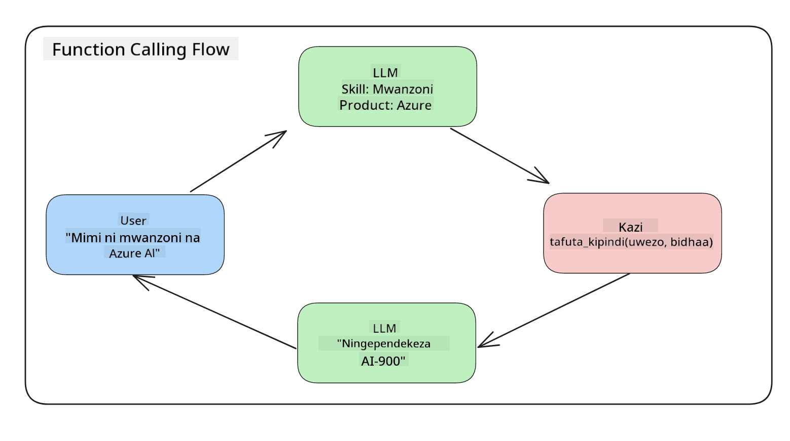
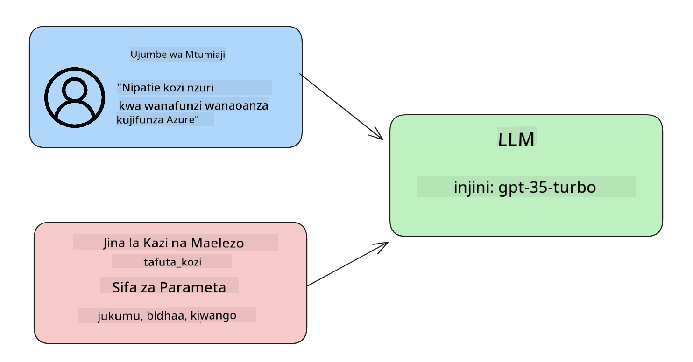

<!--
CO_OP_TRANSLATOR_METADATA:
{
  "original_hash": "77a48a201447be19aa7560706d6f93a0",
  "translation_date": "2025-05-19T21:35:33+00:00",
  "source_file": "11-integrating-with-function-calling/README.md",
  "language_code": "sw"
}
-->
# Kujumuisha na kupiga simu kwa kazi

Umejifunza mengi hadi sasa katika masomo yaliyopita. Hata hivyo, tunaweza kuboresha zaidi. Baadhi ya mambo tunayotaka kushughulikia ni jinsi tunavyoweza kupata muundo wa majibu ulio thabiti zaidi ili iwe rahisi kufanya kazi na majibu hayo. Pia, tunaweza kutaka kuongeza data kutoka vyanzo vingine ili kuboresha programu yetu.

Masuala yaliyotajwa hapo juu ni yale sura hii inataka kushughulikia.

## Utangulizi

Somu hili litaangazia:

- Eleza nini kinachoitwa kupiga simu kwa kazi na matumizi yake.
- Kuunda simu ya kazi kutumia Azure OpenAI.
- Jinsi ya kuunganisha simu ya kazi katika programu.

## Malengo ya Kujifunza

Mwisho wa somo hili, utaweza:

- Eleza madhumuni ya kutumia kupiga simu kwa kazi.
- Seti Simu ya Kazi kutumia Huduma ya Azure OpenAI.
- Buni simu za kazi zinazofaa kwa matumizi ya programu yako.

## Muktadha: Kuboresha chatbot yetu na kazi

Kwa somo hili, tunataka kujenga kipengele kwa kuanza kwetu kwa elimu kinachoruhusu watumiaji kutumia chatbot kutafuta kozi za kiufundi. Tutapendekeza kozi zinazofaa kiwango chao cha ujuzi, jukumu lao la sasa na teknolojia wanayovutiwa nayo.

Kukamilisha muktadha huu, tutatumia mchanganyiko wa:

- `Azure OpenAI` kuunda uzoefu wa mazungumzo kwa mtumiaji.
- `Microsoft Learn Catalog API` kusaidia watumiaji kutafuta kozi kulingana na ombi la mtumiaji.
- `Function Calling` kuchukua swali la mtumiaji na kupeleka kwenye kazi ili kufanya ombi la API.

Ili kuanza, hebu tuangalie kwa nini tungependa kutumia kupiga simu kwa kazi:

## Kwa nini Kupiga Simu kwa Kazi

Kabla ya kupiga simu kwa kazi, majibu kutoka LLM hayakuwa na muundo na hayakuwa thabiti. Waendelezaji walihitajika kuandika kanuni ngumu za kuthibitisha ili kuhakikisha wanaweza kushughulikia kila tofauti ya jibu. Watumiaji hawakuweza kupata majibu kama "Hali ya hewa ya sasa huko Stockholm ni ipi?". Hii ni kwa sababu mifano ilikuwa imewekewa kikomo kwa wakati data ilipofunzwa.

Kupiga Simu kwa Kazi ni kipengele cha Huduma ya Azure OpenAI kushinda vikwazo vifuatavyo:

- **Muundo wa majibu thabiti**. Ikiwa tunaweza kudhibiti vyema muundo wa majibu tunaweza kuunganisha majibu hayo kwa urahisi zaidi kwenye mifumo mingine.
- **Data ya nje**. Uwezo wa kutumia data kutoka vyanzo vingine vya programu katika muktadha wa mazungumzo.

## Kuonyesha tatizo kupitia muktadha

> Tunapendekeza utumie [notebook iliyojumuishwa](../../../11-integrating-with-function-calling/python/aoai-assignment.ipynb) ikiwa unataka kuendesha muktadha ulio chini. Unaweza pia kusoma tu kama tunavyojaribu kuonyesha tatizo ambapo kazi zinaweza kusaidia kushughulikia tatizo.

Hebu tuangalie mfano unaoonyesha tatizo la muundo wa majibu:

Tuseme tunataka kuunda hifadhidata ya data ya wanafunzi ili tuweze kupendekeza kozi sahihi kwao. Hapo chini tuna maelezo mawili ya wanafunzi ambayo yanafanana sana katika data wanayo.

1. Unda muunganisho kwa rasilimali yetu ya Azure OpenAI:

   ```python
   import os
   import json
   from openai import AzureOpenAI
   from dotenv import load_dotenv
   load_dotenv()

   client = AzureOpenAI(
   api_key=os.environ['AZURE_OPENAI_API_KEY'],  # this is also the default, it can be omitted
   api_version = "2023-07-01-preview"
   )

   deployment=os.environ['AZURE_OPENAI_DEPLOYMENT']
   ```

   Hapo chini kuna baadhi ya kanuni za Python za kusanidi muunganisho wetu na Azure OpenAI ambapo tunaset `api_type`, `api_base`, `api_version` and `api_key`.

1. Creating two student descriptions using variables `student_1_description` and `student_2_description`.

   ```python
   student_1_description="Emily Johnson is a sophomore majoring in computer science at Duke University. She has a 3.7 GPA. Emily is an active member of the university's Chess Club and Debate Team. She hopes to pursue a career in software engineering after graduating."

   student_2_description = "Michael Lee is a sophomore majoring in computer science at Stanford University. He has a 3.8 GPA. Michael is known for his programming skills and is an active member of the university's Robotics Club. He hopes to pursue a career in artificial intelligence after finishing his studies."
   ```

   Tunataka kutuma maelezo ya wanafunzi hapo juu kwa LLM ili kuchambua data. Data hii inaweza kutumika baadaye katika programu yetu na kutumwa kwa API au kuhifadhiwa katika hifadhidata.

1. Hebu tuunde maombi mawili yanayofanana ambapo tunamwagiza LLM kuhusu taarifa tunazovutiwa nazo:

   ```python
   prompt1 = f'''
   Please extract the following information from the given text and return it as a JSON object:

   name
   major
   school
   grades
   club

   This is the body of text to extract the information from:
   {student_1_description}
   '''

   prompt2 = f'''
   Please extract the following information from the given text and return it as a JSON object:

   name
   major
   school
   grades
   club

   This is the body of text to extract the information from:
   {student_2_description}
   '''
   ```

   Maombi hapo juu yanamwagiza LLM kutoa taarifa na kurudisha majibu katika muundo wa JSON.

1. Baada ya kusanidi maombi na muunganisho na Azure OpenAI, sasa tutatuma maombi kwa LLM kwa kutumia `openai.ChatCompletion`. We store the prompt in the `messages` variable and assign the role to `user`. Hii ni kuiga ujumbe kutoka kwa mtumiaji unaoandikwa kwa chatbot.

   ```python
   # response from prompt one
   openai_response1 = client.chat.completions.create(
   model=deployment,
   messages = [{'role': 'user', 'content': prompt1}]
   )
   openai_response1.choices[0].message.content

   # response from prompt two
   openai_response2 = client.chat.completions.create(
   model=deployment,
   messages = [{'role': 'user', 'content': prompt2}]
   )
   openai_response2.choices[0].message.content
   ```

Sasa tunaweza kutuma maombi yote mawili kwa LLM na kuchunguza majibu tunayopokea kwa kuyapata kama `openai_response1['choices'][0]['message']['content']`.

1. Lastly, we can convert the response to JSON format by calling `json.loads`:

   ```python
   # Loading the response as a JSON object
   json_response1 = json.loads(openai_response1.choices[0].message.content)
   json_response1
   ```

   Jibu 1:

   ```json
   {
     "name": "Emily Johnson",
     "major": "computer science",
     "school": "Duke University",
     "grades": "3.7",
     "club": "Chess Club"
   }
   ```

   Jibu 2:

   ```json
   {
     "name": "Michael Lee",
     "major": "computer science",
     "school": "Stanford University",
     "grades": "3.8 GPA",
     "club": "Robotics Club"
   }
   ```

   Ingawa maombi ni sawa na maelezo yanafanana, tunaona thamani za `Grades` property formatted differently, as we can sometimes get the format `3.7` or `3.7 GPA` for example.

   This result is because the LLM takes unstructured data in the form of the written prompt and returns also unstructured data. We need to have a structured format so that we know what to expect when storing or using this data

So how do we solve the formatting problem then? By using functional calling, we can make sure that we receive structured data back. When using function calling, the LLM does not actually call or run any functions. Instead, we create a structure for the LLM to follow for its responses. We then use those structured responses to know what function to run in our applications.



We can then take what is returned from the function and send this back to the LLM. The LLM will then respond using natural language to answer the user's query.

## Use Cases for using function calls

There are many different use cases where function calls can improve your app like:

- **Calling External Tools**. Chatbots are great at providing answers to questions from users. By using function calling, the chatbots can use messages from users to complete certain tasks. For example, a student can ask the chatbot to "Send an email to my instructor saying I need more assistance with this subject". This can make a function call to `send_email(to: string, body: string)`

- **Create API or Database Queries**. Users can find information using natural language that gets converted into a formatted query or API request. An example of this could be a teacher who requests "Who are the students that completed the last assignment" which could call a function named `get_completed(student_name: string, assignment: int, current_status: string)`

- **Creating Structured Data**. Users can take a block of text or CSV and use the LLM to extract important information from it. For example, a student can convert a Wikipedia article about peace agreements to create AI flashcards. This can be done by using a function called `get_important_facts(agreement_name: string, date_signed: string, parties_involved: list)`

## Creating Your First Function Call

The process of creating a function call includes 3 main steps:

1. **Calling** the Chat Completions API with a list of your functions and a user message.
2. **Reading** the model's response to perform an action i.e. execute a function or API Call.
3. **Making** another call to Chat Completions API with the response from your function to use that information to create a response to the user.



### Step 1 - creating messages

The first step is to create a user message. This can be dynamically assigned by taking the value of a text input or you can assign a value here. If this is your first time working with the Chat Completions API, we need to define the `role` and the `content` of the message.

The `role` can be either `system` (creating rules), `assistant` (the model) or `user` (the end-user). For function calling, we will assign this as `user` na swali la mfano.

```python
messages= [ {"role": "user", "content": "Find me a good course for a beginner student to learn Azure."} ]
```

Kwa kugawa majukumu tofauti, inakuwa wazi kwa LLM ikiwa ni mfumo unaosema kitu au mtumiaji, ambayo husaidia kujenga historia ya mazungumzo ambayo LLM inaweza kujenga juu yake.

### Hatua ya 2 - kuunda kazi

Ifuatayo, tutafafanua kazi na vigezo vya kazi hiyo. Tutatumia kazi moja tu hapa inayoitwa `search_courses` but you can create multiple functions.

> **Important** : Functions are included in the system message to the LLM and will be included in the amount of available tokens you have available.

Below, we create the functions as an array of items. Each item is a function and has properties `name`, `description` and `parameters`:

```python
functions = [
   {
      "name":"search_courses",
      "description":"Retrieves courses from the search index based on the parameters provided",
      "parameters":{
         "type":"object",
         "properties":{
            "role":{
               "type":"string",
               "description":"The role of the learner (i.e. developer, data scientist, student, etc.)"
            },
            "product":{
               "type":"string",
               "description":"The product that the lesson is covering (i.e. Azure, Power BI, etc.)"
            },
            "level":{
               "type":"string",
               "description":"The level of experience the learner has prior to taking the course (i.e. beginner, intermediate, advanced)"
            }
         },
         "required":[
            "role"
         ]
      }
   }
]
```

Hebu tueleze kila tukio la kazi kwa undani zaidi hapa chini:

- `name` - The name of the function that we want to have called.
- `description` - This is the description of how the function works. Here it's important to be specific and clear.
- `parameters` - A list of values and format that you want the model to produce in its response. The parameters array consists of items where the items have the following properties:
  1.  `type` - The data type of the properties will be stored in.
  1.  `properties` - List of the specific values that the model will use for its response
      1. `name` - The key is the name of the property that the model will use in its formatted response, for example, `product`.
      1. `type` - The data type of this property, for example, `string`.
      1. `description` - Description of the specific property.

There's also an optional property `required` - required property for the function call to be completed.

### Step 3 - Making the function call

After defining a function, we now need to include it in the call to the Chat Completion API. We do this by adding `functions` to the request. In this case `functions=functions`.

There is also an option to set `function_call` to `auto`. This means we will let the LLM decide which function should be called based on the user message rather than assigning it ourselves.

Here's some code below where we call `ChatCompletion.create`, note how we set `functions=functions` and `function_call="auto"` na hivyo kumpa LLM chaguo wakati wa kupiga simu kazi tunazompa:

```python
response = client.chat.completions.create(model=deployment,
                                        messages=messages,
                                        functions=functions,
                                        function_call="auto")

print(response.choices[0].message)
```

Majibu yanayorudi sasa yanaonekana kama hivi:

```json
{
  "role": "assistant",
  "function_call": {
    "name": "search_courses",
    "arguments": "{\n  \"role\": \"student\",\n  \"product\": \"Azure\",\n  \"level\": \"beginner\"\n}"
  }
}
```

Hapa tunaweza kuona jinsi kazi `search_courses` was called and with what arguments, as listed in the `arguments` property in the JSON response.

The conclusion the LLM was able to find the data to fit the arguments of the function as it was extracting it from the value provided to the `messages` parameter in the chat completion call. Below is a reminder of the `messages` thamani:

```python
messages= [ {"role": "user", "content": "Find me a good course for a beginner student to learn Azure."} ]
```

Kama unavyoona, `student`, `Azure` and `beginner` was extracted from `messages` and set as input to the function. Using functions this way is a great way to extract information from a prompt but also to provide structure to the LLM and have reusable functionality.

Next, we need to see how we can use this in our app.

## Integrating Function Calls into an Application

After we have tested the formatted response from the LLM, we can now integrate this into an application.

### Managing the flow

To integrate this into our application, let's take the following steps:

1. First, let's make the call to the OpenAI services and store the message in a variable called `response_message`.

   ```python
   response_message = response.choices[0].message
   ```

1. Sasa tutafafanua kazi itakayopiga simu kwa Microsoft Learn API kupata orodha ya kozi:

   ```python
   import requests

   def search_courses(role, product, level):
     url = "https://learn.microsoft.com/api/catalog/"
     params = {
        "role": role,
        "product": product,
        "level": level
     }
     response = requests.get(url, params=params)
     modules = response.json()["modules"]
     results = []
     for module in modules[:5]:
        title = module["title"]
        url = module["url"]
        results.append({"title": title, "url": url})
     return str(results)
   ```

   Angalia jinsi tunavyounda kazi halisi ya Python inayolingana na majina ya kazi yaliyotambulishwa katika `functions` variable. We're also making real external API calls to fetch the data we need. In this case, we go against the Microsoft Learn API to search for training modules.

Ok, so we created `functions` variables and a corresponding Python function, how do we tell the LLM how to map these two together so our Python function is called?

1. To see if we need to call a Python function, we need to look into the LLM response and see if `function_call` ni sehemu yake na kupiga simu kazi iliyotajwa. Hivi ndivyo unavyoweza kufanya ukaguzi ulioonyeshwa hapa chini:

   ```python
   # Check if the model wants to call a function
   if response_message.function_call.name:
    print("Recommended Function call:")
    print(response_message.function_call.name)
    print()

    # Call the function.
    function_name = response_message.function_call.name

    available_functions = {
            "search_courses": search_courses,
    }
    function_to_call = available_functions[function_name]

    function_args = json.loads(response_message.function_call.arguments)
    function_response = function_to_call(**function_args)

    print("Output of function call:")
    print(function_response)
    print(type(function_response))


    # Add the assistant response and function response to the messages
    messages.append( # adding assistant response to messages
        {
            "role": response_message.role,
            "function_call": {
                "name": function_name,
                "arguments": response_message.function_call.arguments,
            },
            "content": None
        }
    )
    messages.append( # adding function response to messages
        {
            "role": "function",
            "name": function_name,
            "content":function_response,
        }
    )
   ```

   Mistari hii mitatu, inahakikisha tunatoa jina la kazi, hoja na kupiga simu:

   ```python
   function_to_call = available_functions[function_name]

   function_args = json.loads(response_message.function_call.arguments)
   function_response = function_to_call(**function_args)
   ```

   Hapo chini ni matokeo kutoka kuendesha kanuni yetu:

   **Matokeo**

   ```Recommended Function call:
   {
     "name": "search_courses",
     "arguments": "{\n  \"role\": \"student\",\n  \"product\": \"Azure\",\n  \"level\": \"beginner\"\n}"
   }

   Output of function call:
   [{'title': 'Describe concepts of cryptography', 'url': 'https://learn.microsoft.com/training/modules/describe-concepts-of-cryptography/?
   WT.mc_id=api_CatalogApi'}, {'title': 'Introduction to audio classification with TensorFlow', 'url': 'https://learn.microsoft.com/en-
   us/training/modules/intro-audio-classification-tensorflow/?WT.mc_id=api_CatalogApi'}, {'title': 'Design a Performant Data Model in Azure SQL
   Database with Azure Data Studio', 'url': 'https://learn.microsoft.com/training/modules/design-a-data-model-with-ads/?
   WT.mc_id=api_CatalogApi'}, {'title': 'Getting started with the Microsoft Cloud Adoption Framework for Azure', 'url':
   'https://learn.microsoft.com/training/modules/cloud-adoption-framework-getting-started/?WT.mc_id=api_CatalogApi'}, {'title': 'Set up the
   Rust development environment', 'url': 'https://learn.microsoft.com/training/modules/rust-set-up-environment/?WT.mc_id=api_CatalogApi'}]
   <class 'str'>
   ```

1. Sasa tutatuma ujumbe uliosasishwa, `messages` kwa LLM ili tuweze kupokea majibu ya lugha asili badala ya majibu ya muundo wa API JSON.

   ```python
   print("Messages in next request:")
   print(messages)
   print()

   second_response = client.chat.completions.create(
      messages=messages,
      model=deployment,
      function_call="auto",
      functions=functions,
      temperature=0
         )  # get a new response from GPT where it can see the function response


   print(second_response.choices[0].message)
   ```

   **Matokeo**

   ```python
   {
     "role": "assistant",
     "content": "I found some good courses for beginner students to learn Azure:\n\n1. [Describe concepts of cryptography] (https://learn.microsoft.com/training/modules/describe-concepts-of-cryptography/?WT.mc_id=api_CatalogApi)\n2. [Introduction to audio classification with TensorFlow](https://learn.microsoft.com/training/modules/intro-audio-classification-tensorflow/?WT.mc_id=api_CatalogApi)\n3. [Design a Performant Data Model in Azure SQL Database with Azure Data Studio](https://learn.microsoft.com/training/modules/design-a-data-model-with-ads/?WT.mc_id=api_CatalogApi)\n4. [Getting started with the Microsoft Cloud Adoption Framework for Azure](https://learn.microsoft.com/training/modules/cloud-adoption-framework-getting-started/?WT.mc_id=api_CatalogApi)\n5. [Set up the Rust development environment](https://learn.microsoft.com/training/modules/rust-set-up-environment/?WT.mc_id=api_CatalogApi)\n\nYou can click on the links to access the courses."
   }

   ```

## Kazi

Ili kuendelea kujifunza Kupiga Simu kwa Kazi ya Azure OpenAI unaweza kujenga:

- Vigezo zaidi vya kazi ambavyo vinaweza kusaidia wanafunzi kupata kozi zaidi.
- Unda simu nyingine ya kazi inayochukua taarifa zaidi kutoka kwa mwanafunzi kama lugha yao ya asili
- Unda utunzaji wa makosa wakati simu ya kazi na/au simu ya API hairudishi kozi zinazofaa

Kidokezo: Fuata ukurasa wa [Learn API reference documentation](https://learn.microsoft.com/training/support/catalog-api-developer-reference?WT.mc_id=academic-105485-koreyst) ili kuona jinsi na wapi data hii inapatikana.

## Kazi Nzuri! Endelea na Safari

Baada ya kukamilisha somo hili, angalia mkusanyiko wetu wa [Generative AI Learning collection](https://aka.ms/genai-collection?WT.mc_id=academic-105485-koreyst) ili kuendelea kuongeza maarifa yako ya Generative AI!

Nenda kwenye Somo la 12, ambapo tutatazama jinsi ya [kubuni UX kwa programu za AI](../12-designing-ux-for-ai-applications/README.md?WT.mc_id=academic-105485-koreyst)!

**Kanusho**: 
Hati hii imetafsiriwa kwa kutumia huduma ya tafsiri ya AI [Co-op Translator](https://github.com/Azure/co-op-translator). Ingawa tunajitahidi kwa usahihi, tafadhali fahamu kwamba tafsiri za kiotomatiki zinaweza kuwa na makosa au kutokuwa sahihi. Hati asili katika lugha yake ya asili inapaswa kuchukuliwa kuwa chanzo cha mamlaka. Kwa taarifa muhimu, tafsiri ya kitaalamu ya binadamu inapendekezwa. Hatuwajibiki kwa kutoelewana au kutafsiri vibaya kunakotokana na matumizi ya tafsiri hii.