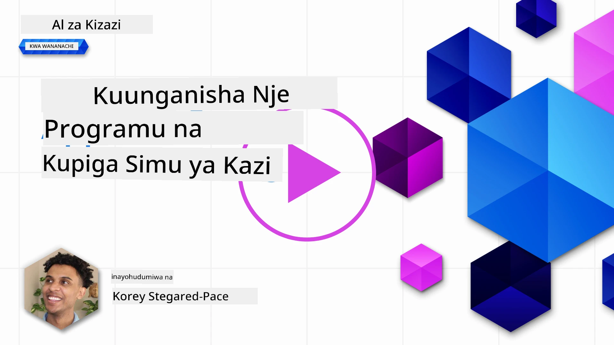
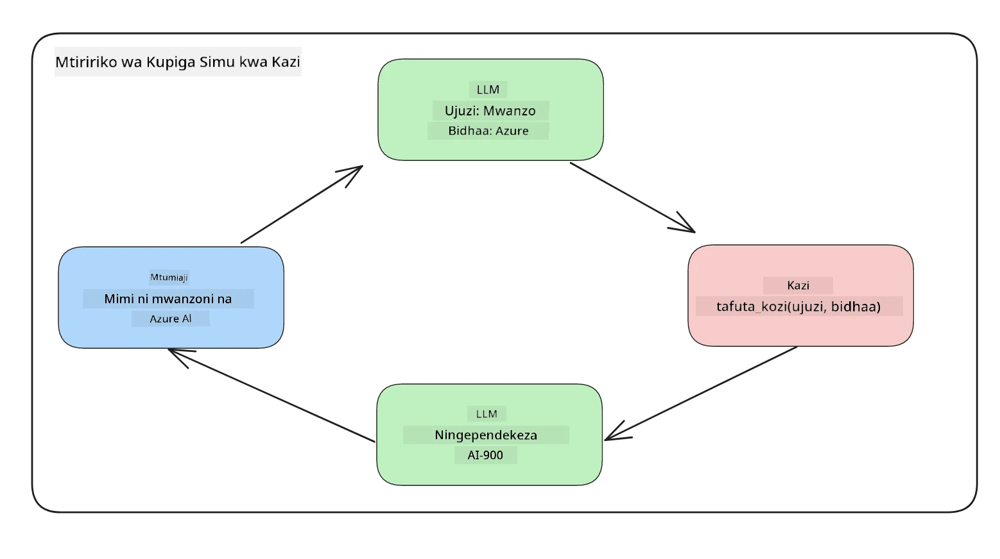
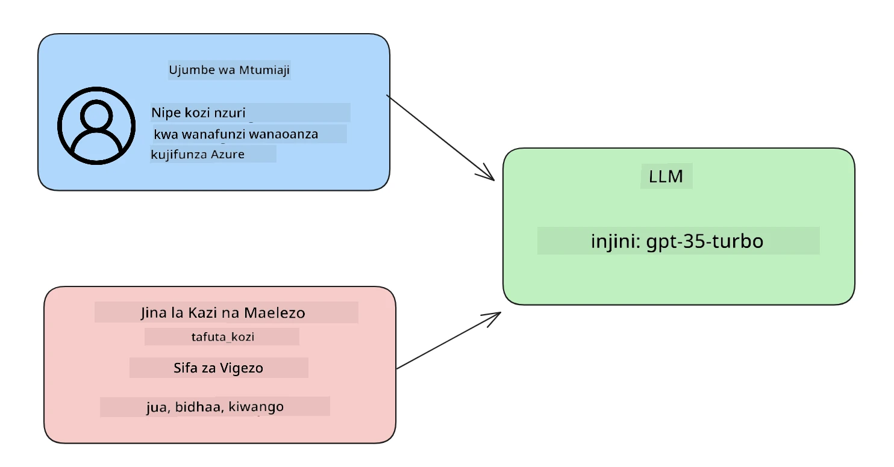

# Kuingiza pamoja na kupiga simu za kazi

[](https://youtu.be/DgUdCLX8qYQ?si=f1ouQU5HQx6F8Gl2)

Umejifunza mambo mengi hadi sasa katika masomo ya awali. Hata hivyo, tunaweza kuboresha zaidi. Mambo fulani tunayoweza kushughulikia ni jinsi tunavyoweza kupata muundo wa jibu unaoendelea zaidi ili kurahisisha kufanya kazi na jibu hapo baadaye. Pia, tungependa kuongeza data kutoka vyanzo vingine ili kufanya maombi yetu kuwa ya kina zaidi.

Matatizo yaliyojadiliwa hapo juu ndiyo msingi wa sura hii kujaribu kuyatatua.

## Utangulizi

Somo hili litajumuisha:

- Eleza ni nini kupiga simu za kazi na matumizi yake.
- Kuunda simu ya kazi kwa kutumia Azure OpenAI.
- Jinsi ya kuingiza simu ya kazi ndani ya programu.

## Malengo ya Kujifunza

Mwishoni mwa somo hili, utaweza:

- Eleza madhumuni ya kutumia kupiga simu za kazi.
- Sanidi Simu ya Kazi kwa kutumia Huduma ya Azure OpenAI.
- Tengeneza simu za kazi madhubuti kwa ajili ya matumizi ya programu yako.

## Hali Halisi: Kuboresha chatbot yetu na kazi

Kwa somo hili, tunataka kujenga kipengele kwa ajili ya kampuni yetu ya elimu kinachomruhusu mtumiaji kutumia chatbot kupata kozi za kiufundi. Tutapendekeza kozi zinazofaa kiwango chao cha ujuzi, nafasi ya kazi walizonayo na teknolojia wanayovutiwa nayo.

Ili kukamilisha hali hii, tutatumia mchanganyiko wa:

- `Azure OpenAI` kuunda uzoefu wa mazungumzo kwa mtumiaji.
- `Microsoft Learn Catalog API` kusaidia watumiaji kupata kozi kulingana na ombi lao.
- `Function Calling` kuichukua swali la mtumiaji na kuituma kwa function kufanya ombi la API.

Ili kuanza, tuchunguze kwa nini tungependa kutumia kupiga simu za kazi kwanza:

## Kwa Nini Kupiga Simu za Kazi

Kabla ya kupiga simu za kazi, majibu kutoka kwa LLM yalikuwa yasiyo na muundo na hayakuwa ya kuaminika. Waendelezaji walilazimika kuandika nambari ngumu za uthibitishaji kuhakikisha wanaweza kushughulikia kila tofauti ya jibu. Watumiaji hawawezi kupata majibu kama "Mna hali gani ya hewa sasa Stockholm?". Hii ni kwa sababu mifano ilikuwa na vikwazo kwa wakati ambayo data ilifundishwa.

Kupiga Simu za Kazi ni kipengele cha Huduma ya Azure OpenAI kushinda vikwazo vifuatavyo:

- **Muundo wa jibu unaoendelea**. Ikiwa tunaweza kudhibiti vizuri muundo wa jibu tunaweza kuunganisha kwa urahisi majibu haya kwa mifumo mingine.
- **Data ya Nje**. Uwezo wa kutumia data kutoka vyanzo vingine vya programu katika muktadha wa mazungumzo.

## Kuonyesha tatizo kupitia hali halisi

> Tunapendekeza utumie [daftari lililoambatanishwa](./python/aoai-assignment.ipynb?WT.mc_id=academic-105485-koreyst) ikiwa unataka kuendesha hali iliyo chini. Unaweza pia kusoma tu tunapojaribu kuonyesha tatizo ambapo kazi zinaweza kusaidia kutatua tatizo hilo.

Tuchunguze mfano unaoonyesha tatizo la muundo wa jibu:

Tuseme tunataka kuunda hifadhidata ya data za wanafunzi ili tuweze kupendekeza kozi sahihi kwao. Hapa chini tuna maelezo mawili ya wanafunzi ambayo ni sawa sana kwa data wanayo nayo.

1. Unda muunganisho kwa rasilimali yetu ya Azure OpenAI:

   ```python
   import os
   import json
   from openai import OpenAI
   from dotenv import load_dotenv
   load_dotenv()

   # API ya Majibu inatolewa kutoka kwenye Azure OpenAI (Microsoft Foundry) v1
   # mwisho wa njia, hivyo tunamwelekeza mteja wa OpenAI kwa <your-endpoint>/openai/v1/.
   endpoint = os.environ['AZURE_OPENAI_ENDPOINT']
   client = OpenAI(
   api_key=os.environ['AZURE_OPENAI_API_KEY'],
   base_url=f"{endpoint.rstrip('/')}/openai/v1/",
   )

   deployment=os.environ['AZURE_OPENAI_DEPLOYMENT']
   ```

   Hapa chini ni baadhi ya nambari za Python za kusanidi muunganisho wetu wa Azure OpenAI. Kwa kuwa tunatumia kiungo cha v1, tunahitaji tu kuweka `api_key` na `base_url` (hapana `api_version` inahitajika).

1. Kuunda maelezo mawili ya wanafunzi kwa kutumia vigezo `student_1_description` na `student_2_description`.

   ```python
   student_1_description="Emily Johnson is a sophomore majoring in computer science at Duke University. She has a 3.7 GPA. Emily is an active member of the university's Chess Club and Debate Team. She hopes to pursue a career in software engineering after graduating."

   student_2_description = "Michael Lee is a sophomore majoring in computer science at Stanford University. He has a 3.8 GPA. Michael is known for his programming skills and is an active member of the university's Robotics Club. He hopes to pursue a career in artificial intelligence after finishing his studies."
   ```

   Tunataka kutuma maelezo ya wanafunzi hapo juu kwa LLM ili kuchambua data. Data hii inaweza kutumika baadaye katika programu yetu na kutumwa kwa API au kuhifadhiwa katika hifadhidata.

1. Tufanye viamsha sawa viwili ambapo tunaelekeza LLM habari ambazo tunavutiwa nazo:

   ```python
   prompt1 = f'''
   Please extract the following information from the given text and return it as a JSON object:

   name
   major
   school
   grades
   club

   This is the body of text to extract the information from:
   {student_1_description}
   '''

   prompt2 = f'''
   Please extract the following information from the given text and return it as a JSON object:

   name
   major
   school
   grades
   club

   This is the body of text to extract the information from:
   {student_2_description}
   '''
   ```

   Viamsha hapo juu vinaelekeza LLM kutoa taarifa na kurudisha majibu kwa muundo wa JSON.

1. Baada ya kuandaa viamsha na muunganisho kwa Azure OpenAI, sasa tutatuma viamsha kwa LLM kwa kutumia `client.responses.create`. Tunahifadhi kiamsha kwa `input` na kuteua jukumu `user`. Hii ni kuiga ujumbe kutoka kwa mtumiaji unaoandikwa kwenye chatbot.

   ```python
   # jibu kutoka kwa amri ya kwanza
   openai_response1 = client.responses.create(
   model=deployment,
   input = [{'role': 'user', 'content': prompt1}],
   store=False,
   )
   openai_response1.output_text

   # jibu kutoka kwa amri ya pili
   openai_response2 = client.responses.create(
   model=deployment,
   input = [{'role': 'user', 'content': prompt2}],
   store=False,
   )
   openai_response2.output_text
   ```

Sasa tunaweza kutuma maombi yote mawili kwa LLM na kuchunguza jibu tunalopokea kwa kuutafuta kwa njia hii `openai_response1.output_text`.

1. Mwishowe, tunaweza kubadilisha jibu kuwa muundo wa JSON kwa kutumia `json.loads`:

   ```python
   # Kupakia majibu kama kitu cha JSON
   json_response1 = json.loads(openai_response1.output_text)
   json_response1
   ```

   Jibu 1:

   ```json
   {
     "name": "Emily Johnson",
     "major": "computer science",
     "school": "Duke University",
     "grades": "3.7",
     "club": "Chess Club"
   }
   ```

   Jibu 2:

   ```json
   {
     "name": "Michael Lee",
     "major": "computer science",
     "school": "Stanford University",
     "grades": "3.8 GPA",
     "club": "Robotics Club"
   }
   ```

   Ingawa viamsha ni sawa na maelezo ni fanane, tunaona thamani za mali ya `Grades` zimetengenezwa katika mitindo tofauti, kama vile mara nyingine tunaweza kupata muundo `3.7` au `3.7 GPA` kwa mfano.

   Matokeo haya ni kwa sababu LLM inachukua data isiyo na muundo katika muundo wa kiamsha kilichoandikwa na kurudisha pia data isiyo na muundo. Tunahitaji kuwa na muundo uliopangwa ili tujue nini cha kutarajia tunapohifadhi au kutumia data hii

Basi tunatatuaje tatizo la muundo? Kwa kutumia kupiga simu za kazi, tunaweza kuhakikisha tunarudisha data yenye muundo. Tunapotumia kupiga simu za kazi, LLM haipigi au kuendesha kazi yoyote. Badala yake, tunaunda muundo wa LLM kufuata kwa majibu yake. Kisha tunatumia majibu yaliyopangwa yale kujua ni kazi gani itakayotekelezwa katika programu zetu.



Kisha tunaweza kuchukua kile kinachorudiwa kutoka kwa kazi na kurudisha hii kwenye LLM. LLM itajibu kwa kutumia lugha ya kawaida kujibu swali la mtumiaji.

## Matumizi ya Kupiga Simu za Kazi

Kuna matumizi mengi tofauti ambapo kupiga simu za kazi kunaweza kuboresha programu yako kama vile:

- **Kupigia Simu Vifaa vya Nje**. Chatbot ni nzuri kutoa majibu kwa maswali kutoka kwa watumiaji. Kwa kutumia kupiga simu za kazi, chatbot zinaweza kutumia ujumbe kutoka kwa watumiaji kumaliza kazi fulani. Kwa mfano, mwanafunzi anaweza kumuomba chatbot "Tuma barua pepe kwa mwalimu wangu nikisema ninahitaji msaada zaidi kwa somo hili". Hii inaweza kufanya simu kwa kazi `send_email(to: string, body: string)`

- **Kuunda Maswali ya API au Hifadhidata**. Watumiaji wanaweza kupata taarifa kwa kutumia lugha ya kawaida ambayo hubadilishwa kuwa swali lililopangwa au ombi la API. Mfano wa hili ni mwalimu anayeuliza "Ni nani wanafunzi waliomaliza kazi ya mwisho" ambayo inaweza kupiga simu kwa kazi inayoitwa `get_completed(student_name: string, assignment: int, current_status: string)`

- **Kuunda Data Yenye Muundo**. Watumiaji wanaweza kuchukua kipande cha maandishi au CSV na kutumia LLM kutoa taarifa muhimu kutoka kwake. Kwa mfano, mwanafunzi anaweza kubadilisha makala ya Wikipedia kuhusu makubaliano ya amani kuunda kadi za kumbukumbu za AI. Hii inaweza kufanyika kwa kutumia kazi inayoitwa `get_important_facts(agreement_name: string, date_signed: string, parties_involved: list)`

## Kuunda Simu Yako ya Kwanza ya Kazi

Mchakato wa kuunda simu ya kazi unajumuisha hatua kuu 3:

1. **Kupiga simu** kwa API ya Majibu na orodha ya kazi zako (zana) na ujumbe wa mtumiaji.
2. **Kusoma** jibu la mfano kufanya kitendo mfano kuendesha kazi au simu ya API.
3. **Kufanya** simu nyingine kwa API ya Majibu na jibu kutoka kwa kazi yako kutumia taarifa hiyo kuunda jibu kwa mtumiaji.



### Hatua ya 1 - kuunda ujumbe

Hatua ya kwanza ni kuunda ujumbe wa mtumiaji. Huu unaweza kupewa thamani kwa njia ya mtiririko kwa kuchukua thamani ya kiingilio cha maandishi au unaweza kupatia thamani hapa. Ikiwa hii ni mara yako ya kwanza kutumia API ya Majibu, tunahitaji kufafanua `role` na `content` ya ujumbe.

`role` inaweza kuwa `system` (kuunda sheria), `assistant` (mfano) au `user` (mtumiaji wa mwisho). Kwa kupiga simu za kazi, tutateua hii kama `user` na swali la mfano.

```python
messages= [ {"role": "user", "content": "Find me a good course for a beginner student to learn Azure."} ]
```

Kwa kuteua majukumu tofauti, inafanya iwe wazi kwa LLM kama ni mfumo unasema kitu au mtumiaji, ambacho husaidia kujenga historia ya mazungumzo ambayo LLM inaweza kujenga juu yake.

### Hatua ya 2 - kuunda kazi

Ifuatayo, tutaeleza kazi na vigezo vya kazi hiyo. Tutatumia kazi moja hapa inayoitwa `search_courses` lakini unaweza kuunda kazi nyingi.

> **Muhimu** : Kazi zinajumuishwa katika ujumbe wa mfumo kwa LLM na zitahesabiwa katika tokes zinazopatikana.

Hapa chini, tunaunda kazi kama safu ya vitu. Kila kipengee ni zana katika muundo wa API ya Majibu ulio wima, na mali `type`, `name`, `description` na `parameters`:

```python
functions = [
   {
      "type":"function",
      "name":"search_courses",
      "description":"Retrieves courses from the search index based on the parameters provided",
      "parameters":{
         "type":"object",
         "properties":{
            "role":{
               "type":"string",
               "description":"The role of the learner (i.e. developer, data scientist, student, etc.)"
            },
            "product":{
               "type":"string",
               "description":"The product that the lesson is covering (i.e. Azure, Power BI, etc.)"
            },
            "level":{
               "type":"string",
               "description":"The level of experience the learner has prior to taking the course (i.e. beginner, intermediate, advanced)"
            }
         },
         "required":[
            "role"
         ]
      }
   }
]
```

Tueleze kila mfano wa kazi kwa undani zaidi hapa chini:

- `name` - Jina la kazi tunayotaka iitwe.
- `description` - Huu ni maelezo ya jinsi kazi inavyofanya kazi. Hapa ni muhimu kuwa maalum na wazi.
- `parameters` - Orodha ya thamani na muundo unaotaka mfano utengeneze katika jibu lake. Safu ya vigezo ina vitu ambapo vitu vina mali zifuatazo:
  1.  `type` - Aina ya data ambapo mali zitahifadhiwa.
  1.  `properties` - Orodha ya thamani maalum ambazo mfano atatumia kwa jibu lake
      1. `name` - Funguo ni jina la mali ambayo mfano atatumia katika jibu lake lililotengenezwa, kwa mfano, `product`.
      1. `type` - Aina ya data ya mali hii, kwa mfano, `string`.
      1. `description` - Maelezo ya mali hiyo maalum.

Pia kuna mali chaguo `required` - mali inayohitajika kwa simu ya kazi kukamilika.

### Hatua ya 3 - Kufanya simu ya kazi

Baada ya kufafanua kazi, sasa tunahitaji kuingiza kwa simu ya API ya Majibu. Tunafanya hivi kwa kuongeza `tools` kwenye ombi. Katika kesi hii `tools=functions`.

Pia kuna chaguo la kuweka `tool_choice` kuwa `auto`. Hii ina maana tutamruhusu LLM kuchagua ni kazi gani iitwe kulingana na ujumbe wa mtumiaji badala ya kuitoa sisi wenyewe.

Hapa chini ni nambari ambapo tunaita `client.responses.create`, angalia jinsi tunavyoweka `tools=functions` na `tool_choice="auto"` na hivyo kuipa LLM haki ya kuchagua lini kupiga simu za kazi tunazompatia:

```python
response = client.responses.create(model=deployment,
                                        input=messages,
                                        tools=functions,
                                        tool_choice="auto",
                                        store=False)

print(response.output)
```

Jibu linarudi sasa linajumuisha kipengee cha `function_call` katika `response.output` kinavyoonekana hivi:

```json
{
  "type": "function_call",
  "name": "search_courses",
  "call_id": "call_abc123",
  "arguments": "{\n  \"role\": \"student\",\n  \"product\": \"Azure\",\n  \"level\": \"beginner\"\n}"
}
```

Hapa tunaweza kuona jinsi kazi `search_courses` ilivyopigiwa simu na kwa hoja gani, kama zilivyoorodheshwa katika mali `arguments` katika jibu la JSON.

Hitimisho ni kwamba LLM iliweza kupata data za kufaa kwa hoja za kazi hiyo kama ilivyotumia thamani iliyotolewa kwa parameta ya `input` katika simu ya API ya Majibu. Hapa chini ni ukumbusho wa thamani za `messages`:

```python
messages= [ {"role": "user", "content": "Find me a good course for a beginner student to learn Azure."} ]
```

Kama unavyoona, `student`, `Azure` na `beginner` zilichukuliwa kutoka `messages` na kuwekwa kama ingizo kwa kazi. Kutumia kazi kwa njia hii ni njia nzuri ya kutoa taarifa kutoka kwa kiamsha lakini pia kutoa muundo kwa LLM na kuwa na utendaji unaoweza kutumika tena.

Ifuatayo, tunahitaji kuona jinsi tunavyoweza kutumia hii katika programu yetu.

## Kuingiza Piga Simu za Kazi ndani ya Programu

Baada ya kushiriki jibu lililopangwa kutoka kwa LLM, sasa tunaweza kuingiza hii ndani ya programu.

### Kusimamia mtiririko

Ili kuingiza hii ndani ya programu yetu, chukua hatua zifuatazo:

1. Kwanza, fanya simu kwa huduma za OpenAI na toa vipengee vya simu za kazi kutoka kwa jibu `output`.

   ```python
   response_items = response.output
   tool_calls = [item for item in response_items if item.type == "function_call"]
   ```

1. Sasa tutaeleza kazi itakayopiga API ya Microsoft Learn kupata orodha ya kozi:

   ```python
   import requests

   def search_courses(role, product, level):
     url = "https://learn.microsoft.com/api/catalog/"
     params = {
        "role": role,
        "product": product,
        "level": level
     }
     response = requests.get(url, params=params)
     modules = response.json()["modules"]
     results = []
     for module in modules[:5]:
        title = module["title"]
        url = module["url"]
        results.append({"title": title, "url": url})
     return str(results)
   ```

   Angalia jinsi tunavyounda kazi halisi ya Python inayofanana na majina ya kazi yaliyoainishwa katika `functions`. Pia tunafanya simu halisi za API za nje kupata data tunayohitaji. Katika kesi hii, tunapiga API ya Microsoft Learn kutafuta moduli za mafunzo.

Sawa, tumeunda vigezo `functions` na kazi inayolingana ya Python, tunasemaje kwa LLM jinsi ya kuunganisha hizi mbili ili kazi yetu ya Python ipigwe simu?

1. Ili kuona ikiwa tunahitaji kupiga simu ya kazi ya Python, tunahitaji kuchunguza jibu la LLM kuona kama kuna kipengee cha `function_call` na kupiga kazi iliyotajwa. Hapa chini ni jinsi unavyoweza kufanya ukaguzi huo:

   ```python
   # Angalia ikiwa mfano unataka kuita kazi
   if tool_calls:
    for tool_call in tool_calls:
     print("Recommended Function call:")
     print(tool_call.name)
     print()

     # Ita kazi.
     function_name = tool_call.name

     available_functions = {
             "search_courses": search_courses,
     }
     function_to_call = available_functions[function_name]

     function_args = json.loads(tool_call.arguments)
     function_response = function_to_call(**function_args)

     print("Output of function call:")
     print(function_response)
     print(type(function_response))

     # Ongeza wito wa kazi na matokeo yake tena kwenye mazungumzo.
     # Kipengee cha function_call cha mfano kinapaswa kuongezwa kabla ya matokeo yake.
     messages.append(tool_call)  # kipengee cha function_call cha msaidizi
     messages.append( # matokeo ya kazi
         {
             "type": "function_call_output",
             "call_id": tool_call.call_id,
             "output": function_response,
         }
     )
   ```

   Mistari hii mitatu, inahakikisha tunaondoa jina la kazi, hoja na kufanya simu:

   ```python
   function_to_call = available_functions[function_name]

   function_args = json.loads(tool_call.arguments)
   function_response = function_to_call(**function_args)
   ```

   Hapa chini ni matokeo ya kuendesha nambari yetu:

   **Matokeo**

   ```Recommended Function call:
   {
     "name": "search_courses",
     "arguments": "{\n  \"role\": \"student\",\n  \"product\": \"Azure\",\n  \"level\": \"beginner\"\n}"
   }

   Output of function call:
   [{'title': 'Describe concepts of cryptography', 'url': 'https://learn.microsoft.com/training/modules/describe-concepts-of-cryptography/?
   WT.mc_id=api_CatalogApi'}, {'title': 'Introduction to audio classification with TensorFlow', 'url': 'https://learn.microsoft.com/en-
   us/training/modules/intro-audio-classification-tensorflow/?WT.mc_id=api_CatalogApi'}, {'title': 'Design a Performant Data Model in Azure SQL
   Database with Azure Data Studio', 'url': 'https://learn.microsoft.com/training/modules/design-a-data-model-with-ads/?
   WT.mc_id=api_CatalogApi'}, {'title': 'Getting started with the Microsoft Cloud Adoption Framework for Azure', 'url':
   'https://learn.microsoft.com/training/modules/cloud-adoption-framework-getting-started/?WT.mc_id=api_CatalogApi'}, {'title': 'Set up the
   Rust development environment', 'url': 'https://learn.microsoft.com/training/modules/rust-set-up-environment/?WT.mc_id=api_CatalogApi'}]
   <class 'str'>
   ```

1. Sasa tutatuma ujumbe ulio sasishwa, `messages` kwa LLM ili tupate jibu kwa lugha ya kawaida badala ya jibu la API lililopangwa JSON.

   ```python
   print("Messages in next request:")
   print(messages)
   print()

   second_response = client.responses.create(
      input=messages,
      model=deployment,
      tool_choice="auto",
      tools=functions,
      temperature=0,
      store=False,
         )  # pata jibu jipya kutoka kwa mfano ambapo unaweza kuona jibu la kazi


   print(second_response.output_text)
   ```

   **Matokeo**

   ```text
   I found some good courses for beginner students to learn Azure:

   1. [Describe concepts of cryptography](https://learn.microsoft.com/training/modules/describe-concepts-of-cryptography/?WT.mc_id=api_CatalogApi)
   2. [Introduction to audio classification with TensorFlow](https://learn.microsoft.com/training/modules/intro-audio-classification-tensorflow/?WT.mc_id=api_CatalogApi)
   3. [Design a Performant Data Model in Azure SQL Database with Azure Data Studio](https://learn.microsoft.com/training/modules/design-a-data-model-with-ads/?WT.mc_id=api_CatalogApi)
   4. [Getting started with the Microsoft Cloud Adoption Framework for Azure](https://learn.microsoft.com/training/modules/cloud-adoption-framework-getting-started/?WT.mc_id=api_CatalogApi)
   5. [Set up the Rust development environment](https://learn.microsoft.com/training/modules/rust-set-up-environment/?WT.mc_id=api_CatalogApi)

   You can click on the links to access the courses.
   ```

## Kufanya Zoezi

Ili kuendelea na kujifunza kwa Kupiga Simu za Kazi za Azure OpenAI unaweza kujenga:

- Vigezo zaidi vya kazi ambavyo vinaweza kusaidia wanafunzi kupata kozi zaidi.

- Tengeneza wito mwingine wa kazi unaochukua habari zaidi kutoka kwa mwanafunzi kama lugha yao ya asili
- Tengeneza usimamizi wa makosa wakati wito wa kazi na/au wito wa API hauzurudishi kozi zinazofaa

Vidokezo: Fuata ukurasa wa [Learn API reference documentation](https://learn.microsoft.com/training/support/catalog-api-developer-reference?WT.mc_id=academic-105485-koreyst) kuona jinsi na wapi data hii inapatikana.

## Kazi Kuu! Endelea Safari

Baada ya kumaliza somo hili, angalia [Generative AI Learning collection](https://aka.ms/genai-collection?WT.mc_id=academic-105485-koreyst) yetu kuendelea kuongeza ujuzi wako wa Generative AI!

Nenda kwenye Somo la 12, ambapo tutaangalia jinsi ya [kubuni UX kwa programu za AI](../12-designing-ux-for-ai-applications/README.md?WT.mc_id=academic-105485-koreyst)!

---

<!-- CO-OP TRANSLATOR DISCLAIMER START -->
**Kionyozo**:
Hati hii imetafsiriwa kwa kutumia huduma ya tafsiri ya AI [Co-op Translator](https://github.com/Azure/co-op-translator). Ingawa tunajitahidi kupata usahihi, tafadhali fahamu kwamba tafsiri za kiotomatiki zinaweza kuwa na makosa au upungufu wa usahihi. Hati ya asili katika lugha yake halisi inapaswa kuchukuliwa kama chanzo cha mamlaka. Kwa taarifa muhimu, tafsiri ya kitaalamu inayofanywa na binadamu inapendekezwa. Hatutojibu kwa kuelewa vibaya au tafsiri potofu zinazotokea kutokana na matumizi ya tafsiri hii.
<!-- CO-OP TRANSLATOR DISCLAIMER END -->