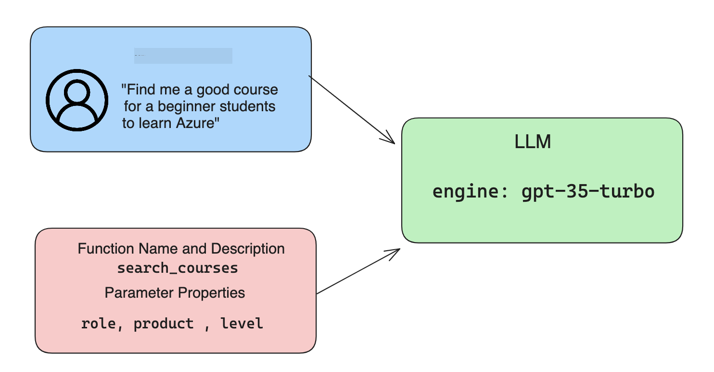

<!--
CO_OP_TRANSLATOR_METADATA:
{
  "original_hash": "77a48a201447be19aa7560706d6f93a0",
  "translation_date": "2025-07-09T14:40:43+00:00",
  "source_file": "11-integrating-with-function-calling/README.md",
  "language_code": "sw"
}
-->
# Kuunganisha na kuitisha function

[](https://aka.ms/gen-ai-lesson11-gh?WT.mc_id=academic-105485-koreyst)

Umejifunza mambo mengi hadi sasa katika masomo yaliyopita. Hata hivyo, tunaweza kuboresha zaidi. Baadhi ya mambo tunayoweza kushughulikia ni jinsi ya kupata muundo wa majibu unaoendelea ili kurahisisha kazi na majibu hayo baadaye. Pia, tunaweza kutaka kuongeza data kutoka vyanzo vingine ili kuimarisha zaidi programu yetu.

Matatizo yaliyotajwa hapo juu ndiyo sura hii inalenga kuyashughulikia.

## Utangulizi

Somu hili litajumuisha:

- Kuelezea ni nini kuitisha function na matumizi yake.
- Kuunda kuitisho la function kwa kutumia Azure OpenAI.
- Jinsi ya kuunganisha kuitisho la function katika programu.

## Malengo ya Kujifunza

Mwisho wa somo hili, utaweza:

- Kuelezea madhumuni ya kutumia kuitisha function.
- Kuweka Kituo cha Kuitisha Function kwa kutumia Azure OpenAI Service.
- Kubuni kuitisho za function zinazofaa kwa matumizi ya programu yako.

## Hali ya Mfano: Kuboresha chatbot yetu kwa functions

Kwa somo hili, tunataka kujenga kipengele kwa startup yetu ya elimu kinachowezesha watumiaji kutumia chatbot kutafuta kozi za kiufundi. Tutapendekeza kozi zinazofaa kwa kiwango chao cha ujuzi, nafasi yao ya kazi na teknolojia wanayovutiwa nayo.

Ili kukamilisha hali hii, tutatumia mchanganyiko wa:

- `Azure OpenAI` kuunda uzoefu wa mazungumzo kwa mtumiaji.
- `Microsoft Learn Catalog API` kusaidia watumiaji kupata kozi kulingana na ombi la mtumiaji.
- `Function Calling` kuchukua swali la mtumiaji na kulituma kwa function ili kufanya ombi la API.

Ili kuanza, tuchunguze kwanini tungetaka kutumia kuitisha function kwa mara ya kwanza:

## Kwanini Kuitisha Function

Kabla ya kuitisha function, majibu kutoka LLM yalikuwa yasiyo na muundo na hayakuwa thabiti. Waendelezaji walilazimika kuandika msimbo mgumu wa uthibitishaji ili kuhakikisha wanaweza kushughulikia kila aina ya jibu. Watumiaji hawakuweza kupata majibu kama "Hali ya hewa ya sasa Stockholm ni nini?". Hii ni kwa sababu modeli zilikuwa na kikomo kwa data iliyofundishwa.

Kuitisha Function ni kipengele cha Azure OpenAI Service kinachoshinda vikwazo vifuatavyo:

- **Muundo thabiti wa jibu**. Ikiwa tunaweza kudhibiti muundo wa jibu vizuri, tunaweza kuunganisha majibu kwa urahisi zaidi na mifumo mingine.
- **Data ya Nje**. Uwezo wa kutumia data kutoka vyanzo vingine vya programu katika muktadha wa mazungumzo.

## Kuelezea tatizo kupitia hali ya mfano

> Tunapendekeza utumie [daftari lililojumuishwa](../../../11-integrating-with-function-calling/python/aoai-assignment.ipynb) ikiwa unataka kuendesha hali ifuatayo. Unaweza pia kusoma tu tunapojaribu kuonyesha tatizo ambapo functions zinaweza kusaidia kulitatua.

Tuchunguze mfano unaoonyesha tatizo la muundo wa jibu:

Tuseme tunataka kuunda hifadhidata ya data za wanafunzi ili tuweze kupendekeza kozi sahihi kwao. Hapa chini tuna maelezo mawili ya wanafunzi ambayo ni karibu sawa katika data wanayoshikilia.

1. Tengeneza muunganisho na rasilimali yetu ya Azure OpenAI:

   ```python
   import os
   import json
   from openai import AzureOpenAI
   from dotenv import load_dotenv
   load_dotenv()

   client = AzureOpenAI(
   api_key=os.environ['AZURE_OPENAI_API_KEY'],  # this is also the default, it can be omitted
   api_version = "2023-07-01-preview"
   )

   deployment=os.environ['AZURE_OPENAI_DEPLOYMENT']
   ```

   Hapa chini ni msimbo wa Python wa kusanidi muunganisho wetu na Azure OpenAI ambapo tunaweka `api_type`, `api_base`, `api_version` na `api_key`.

1. Kuunda maelezo mawili ya wanafunzi kwa kutumia vigezo `student_1_description` na `student_2_description`.

   ```python
   student_1_description="Emily Johnson is a sophomore majoring in computer science at Duke University. She has a 3.7 GPA. Emily is an active member of the university's Chess Club and Debate Team. She hopes to pursue a career in software engineering after graduating."

   student_2_description = "Michael Lee is a sophomore majoring in computer science at Stanford University. He has a 3.8 GPA. Michael is known for his programming skills and is an active member of the university's Robotics Club. He hopes to pursue a career in artificial intelligence after finishing his studies."
   ```

   Tunataka kutuma maelezo ya wanafunzi hapo juu kwa LLM ili ichambue data. Data hii inaweza kutumika baadaye katika programu yetu na kutumwa kwa API au kuhifadhiwa katika hifadhidata.

1. Tufanye maelekezo mawili sawa ambapo tunaelekeza LLM ni taarifa gani tunazotaka:

   ```python
   prompt1 = f'''
   Please extract the following information from the given text and return it as a JSON object:

   name
   major
   school
   grades
   club

   This is the body of text to extract the information from:
   {student_1_description}
   '''

   prompt2 = f'''
   Please extract the following information from the given text and return it as a JSON object:

   name
   major
   school
   grades
   club

   This is the body of text to extract the information from:
   {student_2_description}
   '''
   ```

   Maelekezo hapo juu yanaelekeza LLM kutoa taarifa na kurudisha jibu kwa muundo wa JSON.

1. Baada ya kusanidi maelekezo na muunganisho wa Azure OpenAI, sasa tutatuma maelekezo kwa LLM kwa kutumia `openai.ChatCompletion`. Tunahifadhi maelekezo katika `messages` na kuteua nafasi ya `user`. Hii ni kuiga ujumbe kutoka kwa mtumiaji unaoandikwa kwa chatbot.

   ```python
   # response from prompt one
   openai_response1 = client.chat.completions.create(
   model=deployment,
   messages = [{'role': 'user', 'content': prompt1}]
   )
   openai_response1.choices[0].message.content

   # response from prompt two
   openai_response2 = client.chat.completions.create(
   model=deployment,
   messages = [{'role': 'user', 'content': prompt2}]
   )
   openai_response2.choices[0].message.content
   ```

Sasa tunaweza kutuma maombi yote mawili kwa LLM na kuchunguza jibu tunalopokea kwa kulipata hivi `openai_response1['choices'][0]['message']['content']`.

1. Mwisho, tunaweza kubadilisha jibu kuwa muundo wa JSON kwa kuitisha `json.loads`:

   ```python
   # Loading the response as a JSON object
   json_response1 = json.loads(openai_response1.choices[0].message.content)
   json_response1
   ```

   Jibu 1:

   ```json
   {
     "name": "Emily Johnson",
     "major": "computer science",
     "school": "Duke University",
     "grades": "3.7",
     "club": "Chess Club"
   }
   ```

   Jibu 2:

   ```json
   {
     "name": "Michael Lee",
     "major": "computer science",
     "school": "Stanford University",
     "grades": "3.8 GPA",
     "club": "Robotics Club"
   }
   ```

   Ingawa maelekezo ni sawa na maelezo ni karibu, tunaona thamani za mali ya `Grades` zikiwa na muundo tofauti, kwa mfano, wakati mwingine tunaweza kupata muundo `3.7` au `3.7 GPA`.

   Matokeo haya ni kwa sababu LLM inachukua data isiyo na muundo kwa njia ya maelekezo yaliyoandikwa na kurudisha pia data isiyo na muundo. Tunahitaji kuwa na muundo uliopangwa ili tujue nini tunatarajia tunapohifadhi au kutumia data hii.

Basi tunatatuaje tatizo la muundo? Kwa kutumia kuitisha function, tunaweza kuhakikisha tunapata data yenye muundo. Tunapoitisha function, LLM haifanyi au kuitisha function yoyote moja kwa moja. Badala yake, tunaunda muundo ambao LLM inafuata kwa majibu yake. Kisha tunatumia majibu hayo yenye muundo kujua ni function gani ya kuitisha katika programu zetu.


Kisha tunaweza kuchukua kile kinachorejeshwa na function na kurudisha kwa LLM. LLM itajibu kwa lugha ya kawaida kujibu swali la mtumiaji.

## Matumizi ya kuitisha function

Kuna matumizi mengi tofauti ambapo kuitisha function kunaweza kuboresha programu yako kama:

- **Kuitisha Zana za Nje**. Chatbots ni nzuri kutoa majibu kwa maswali kutoka kwa watumiaji. Kwa kutumia kuitisha function, chatbots zinaweza kutumia ujumbe kutoka kwa watumiaji kutekeleza kazi fulani. Kwa mfano, mwanafunzi anaweza kumuomba chatbot "Tuma barua pepe kwa mwalimu wangu nikisema nahitaji msaada zaidi kwa somo hili". Hii inaweza kuitisha function `send_email(to: string, body: string)`

- **Kuunda API au Maswali ya Hifadhidata**. Watumiaji wanaweza kupata taarifa kwa kutumia lugha ya kawaida ambayo hubadilishwa kuwa swali lililopangwa au ombi la API. Mfano ni mwalimu anayeomba "Nani wanafunzi waliomaliza kazi ya mwisho" ambayo inaweza kuitisha function `get_completed(student_name: string, assignment: int, current_status: string)`

- **Kuunda Data Yenye Muundo**. Watumiaji wanaweza kuchukua kipande cha maandishi au CSV na kutumia LLM kutoa taarifa muhimu kutoka ndani yake. Kwa mfano, mwanafunzi anaweza kubadilisha makala ya Wikipedia kuhusu makubaliano ya amani kuunda kadi za maswali za AI. Hii inaweza kufanywa kwa kutumia function `get_important_facts(agreement_name: string, date_signed: string, parties_involved: list)`

## Kuunda Kuitisho Chako cha Kwanza cha Function

Mchakato wa kuunda kuitisho la function unajumuisha hatua kuu 3:

1. **Kuitisha** API ya Chat Completions na orodha ya functions zako na ujumbe wa mtumiaji.
2. **Kusoma** jibu la modeli ili kufanya kitendo, yaani kutekeleza function au API Call.
3. **Kufanya** kuitisho mwingine kwa Chat Completions API na jibu kutoka kwa function yako kutumia taarifa hiyo kuunda jibu kwa mtumiaji.



### Hatua 1 - kuunda ujumbe

Hatua ya kwanza ni kuunda ujumbe wa mtumiaji. Huu unaweza kuwekwa kwa nguvu kwa kuchukua thamani ya ingizo la maandishi au unaweza kuweka thamani hapa. Ikiwa huu ni mara yako ya kwanza kutumia Chat Completions API, tunahitaji kufafanua `role` na `content` ya ujumbe.

`role` inaweza kuwa `system` (kuunda sheria), `assistant` (modeli) au `user` (mtumiaji wa mwisho). Kwa kuitisha function, tutateua hii kama `user` na swali la mfano.

```python
messages= [ {"role": "user", "content": "Find me a good course for a beginner student to learn Azure."} ]
```

Kwa kuteua nafasi tofauti, inafahamisha LLM kama ni mfumo unaosema kitu au mtumiaji, jambo linalosaidia kujenga historia ya mazungumzo ambayo LLM inaweza kuijenga.

### Hatua 2 - kuunda functions

Ifuatayo, tutaeleza function na vigezo vya function hiyo. Tutatumia function moja tu hapa iitwayo `search_courses` lakini unaweza kuunda functions nyingi.

> **Muhimu** : Functions zinajumuishwa katika ujumbe wa mfumo kwa LLM na zitahesabiwa katika idadi ya tokeni zinazopatikana kwako.

Hapa chini, tunaunda functions kama orodha ya vitu. Kila kitu ni function na kina mali `name`, `description` na `parameters`:

```python
functions = [
   {
      "name":"search_courses",
      "description":"Retrieves courses from the search index based on the parameters provided",
      "parameters":{
         "type":"object",
         "properties":{
            "role":{
               "type":"string",
               "description":"The role of the learner (i.e. developer, data scientist, student, etc.)"
            },
            "product":{
               "type":"string",
               "description":"The product that the lesson is covering (i.e. Azure, Power BI, etc.)"
            },
            "level":{
               "type":"string",
               "description":"The level of experience the learner has prior to taking the course (i.e. beginner, intermediate, advanced)"
            }
         },
         "required":[
            "role"
         ]
      }
   }
]
```

Tuelezee kila mfano wa function kwa undani hapa chini:

- `name` - Jina la function tunayotaka kuitisha.
- `description` - Hii ni maelezo ya jinsi function inavyofanya kazi. Hapa ni muhimu kuwa maalum na wazi.
- `parameters` - Orodha ya thamani na muundo unaotaka modeli itengeneze katika jibu lake. Orodha ya parameters ina vitu ambavyo vina mali zifuatazo:
  1.  `type` - Aina ya data ambayo mali itahifadhiwa.
  1.  `properties` - Orodha ya thamani maalum ambazo modeli itatumia kwa jibu lake
      1. `name` - Funguo ni jina la mali ambayo modeli itatumia katika jibu lake lililopangwa, kwa mfano, `product`.
      1. `type` - Aina ya data ya mali hii, kwa mfano, `string`.
      1. `description` - Maelezo ya mali maalum.

Kuna pia mali ya hiari `required` - mali inayohitajika ili kuitisha function kufanikisha.

### Hatua 3 - Kufanya kuitisho la function

Baada ya kufafanua function, sasa tunahitaji kuijumuisha katika kuitisho kwa Chat Completion API. Tunafanya hivi kwa kuongeza `functions` kwenye ombi. Katika kesi hii `functions=functions`.

Pia kuna chaguo la kuweka `function_call` kuwa `auto`. Hii ina maana tunamruhusu LLM kuamua function gani inapaswa kuitwa kulingana na ujumbe wa mtumiaji badala ya kuiteua sisi wenyewe.

Hapa kuna msimbo hapa chini ambapo tunaita `ChatCompletion.create`, angalia jinsi tunavyoweka `functions=functions` na `function_call="auto"` na hivyo kumpa LLM chaguo la lini kuitisha functions tunazompatia:

```python
response = client.chat.completions.create(model=deployment,
                                        messages=messages,
                                        functions=functions,
                                        function_call="auto")

print(response.choices[0].message)
```

Jibu linalorejea sasa linaonekana hivi:

```json
{
  "role": "assistant",
  "function_call": {
    "name": "search_courses",
    "arguments": "{\n  \"role\": \"student\",\n  \"product\": \"Azure\",\n  \"level\": \"beginner\"\n}"
  }
}
```

Hapa tunaona jinsi function `search_courses` ilivyotumiwa na kwa hoja gani, kama ilivyoorodheshwa katika mali ya `arguments` katika jibu la JSON.

Hitimisho ni kwamba LLM ilifanikiwa kupata data inayolingana na hoja za function kwa kuwa ilikuwa inachukua kutoka kwa thamani iliyotolewa kwa parameter ya `messages` katika kuitisho cha chat completion. Hapa chini ni kumbukumbu ya thamani ya `messages`:

```python
messages= [ {"role": "user", "content": "Find me a good course for a beginner student to learn Azure."} ]
```

Kama unavyoona, `student`, `Azure` na `beginner` vilichukuliwa kutoka `messages` na kuwekwa kama ingizo kwa function. Kutumia functions kwa njia hii ni njia nzuri ya kutoa taarifa kutoka kwa maelekezo lakini pia kutoa muundo kwa LLM na kuwa na utendaji unaoweza kutumika tena.

Ifuatayo, tunahitaji kuona jinsi tunavyoweza kutumia hii katika programu yetu.

## Kuunganisha Kuitisho za Function katika Programu

Baada ya kujaribu jibu lililopangwa kutoka kwa LLM, sasa tunaweza kuunganisha hii katika programu.

### Kusimamia mtiririko

Ili kuunganisha hii katika programu yetu, tuchukue hatua zifuatazo:

1. Kwanza, tufanye kuitisho kwa huduma za OpenAI na kuhifadhi ujumbe katika variable iitwayo `response_message`.

   ```python
   response_message = response.choices[0].message
   ```

1. Sasa tutaeleza function itakayoitisha Microsoft Learn API kupata orodha ya kozi:

   ```python
   import requests

   def search_courses(role, product, level):
     url = "https://learn.microsoft.com/api/catalog/"
     params = {
        "role": role,
        "product": product,
        "level": level
     }
     response = requests.get(url, params=params)
     modules = response.json()["modules"]
     results = []
     for module in modules[:5]:
        title = module["title"]
        url = module["url"]
        results.append({"title": title, "url": url})
     return str(results)
   ```

   Angalia jinsi sasa tunaunda function halisi ya Python inayolingana na majina ya function yaliyotangazwa katika variable ya `functions`. Pia tunafanya miito halisi ya API za nje kupata data tunayohitaji. Katika kesi hii, tunaenda dhidi ya Microsoft Learn API kutafuta moduli za mafunzo.

Sawa, tumetengeneza variable ya `functions` na function ya Python inayolingana, tunamwambiaje LLM jinsi ya kuoanisha hizi mbili ili function yetu ya Python iitwe?

1. Ili kuona kama tunahitaji kuitisha function ya Python, tunahitaji kuangalia jibu la LLM na kuona kama `function_call` ipo na kuitisha function iliyotajwa. Hapa chini ni jinsi unavyoweza kufanya ukaguzi huo:

   ```python
   # Check if the model wants to call a function
   if response_message.function_call.name:
    print("Recommended Function call:")
    print(response_message.function_call.name)
    print()

    # Call the function.
    function_name = response_message.function_call.name

    available_functions = {
            "search_courses": search_courses,
    }
    function_to_call = available_functions[function_name]

    function_args = json.loads(response_message.function_call.arguments)
    function_response = function_to_call(**function_args)

    print("Output of function call:")
    print(function_response)
    print(type(function_response))


    # Add the assistant response and function response to the messages
    messages.append( # adding assistant response to messages
        {
            "role": response_message.role,
            "function_call": {
                "name": function_name,
                "arguments": response_message.function_call.arguments,
            },
            "content": None
        }
    )
    messages.append( # adding function response to messages
        {
            "role": "function",
            "name": function_name,
            "content":function_response,
        }
    )
   ```

   Mistari hii mitatu, inahakikisha tunachukua jina la function, hoja na kufanya kuitisho:

   ```python
   function_to_call = available_functions[function_name]

   function_args = json.loads(response_message.function_call.arguments)
   function_response = function_to_call(**function_args)
   ```

   Hapa chini ni matokeo ya kuendesha msimbo wetu:

   **Matokeo**

   ```Recommended Function call:
   {
     "name": "search_courses",
     "arguments": "{\n  \"role\": \"student\",\n  \"product\": \"Azure\",\n  \"level\": \"beginner\"\n}"
   }

   Output of function call:
   [{'title': 'Describe concepts of cryptography', 'url': 'https://learn.microsoft.com/training/modules/describe-concepts-of-cryptography/?
   WT.mc_id=api_CatalogApi'}, {'title': 'Introduction to audio classification with TensorFlow', 'url': 'https://learn.microsoft.com/en-
   us/training/modules/intro-audio-classification-tensorflow/?WT.mc_id=api_CatalogApi'}, {'title': 'Design a Performant Data Model in Azure SQL
   Database with Azure Data Studio', 'url': 'https://learn.microsoft.com/training/modules/design-a-data-model-with-ads/?
   WT.mc_id=api_CatalogApi'}, {'title': 'Getting started with the Microsoft Cloud Adoption Framework for Azure', 'url':
   'https://learn.microsoft.com/training/modules/cloud-adoption-framework-getting-started/?WT.mc_id=api_CatalogApi'}, {'title': 'Set up the
   Rust development environment', 'url': 'https://learn.microsoft.com/training/modules/rust-set-up-environment/?WT.mc_id=api_CatalogApi'}]
   <class 'str'>
   ```

1. Sasa tutatuma ujumbe uliosasishwa, `messages` kwa LLM ili tupate jibu la lugha ya kawaida badala ya jibu la API lililopangwa kwa JSON.

   ```python
   print("Messages in next request:")
   print(messages)
   print()

   second_response = client.chat.completions.create(
      messages=messages,
      model=deployment,
      function_call="auto",
      functions=functions,
      temperature=0
         )  # get a new response from GPT where it can see the function response


   print(second_response.choices[0].message)
   ```

   **Matokeo**

   ```python
   {
     "role": "assistant",
     "content": "I found some good courses for beginner students to learn Azure:\n\n1. [Describe concepts of cryptography] (https://learn.microsoft.com/training/modules/describe-concepts-of-cryptography/?WT.mc_id=api_CatalogApi)\n2. [Introduction to audio classification with TensorFlow](https://learn.microsoft.com/training/modules/intro-audio-classification-tensorflow/?WT.mc_id=api_CatalogApi)\n3. [Design a Performant Data Model in Azure SQL Database with Azure Data Studio](https://learn.microsoft.com/training/modules/design-a-data-model-with-ads/?WT.mc_id=api_CatalogApi)\n4. [Getting started with the Microsoft Cloud Adoption Framework for Azure](https://learn.microsoft.com/training/modules/cloud-adoption-framework-getting-started/?WT.mc_id=api_CatalogApi)\n5. [Set up the Rust development environment](https://learn.microsoft.com/training/modules/rust-set-up-environment/?WT.mc_id=api_CatalogApi)\n\nYou can click on the links to access the courses."
   }

   ```

## Kazi ya Nyumbani

Ili kuendelea na kujifunza kwa Azure OpenAI Function Calling unaweza kujenga:

- Vigezo zaidi vya function ambavyo vinaweza kusaidia wanafunzi kupata kozi zaidi.
- Kuunda kuitisho kingine cha function kinachochukua taarifa zaidi kutoka kwa mwanafunzi kama lugha yao ya asili
- Kuunda usimamizi wa makosa wakati kuitisho la function na/au ombi la API halirejeshi kozi zinazofaa yoyote
## Kazi Nzuri! Endelea Safari

Baada ya kumaliza somo hili, angalia mkusanyiko wetu wa [Generative AI Learning](https://aka.ms/genai-collection?WT.mc_id=academic-105485-koreyst) ili kuendelea kuongeza ujuzi wako wa Generative AI!

Nenda kwenye Somo la 12, ambapo tutaangalia jinsi ya [kubuni UX kwa programu za AI](../12-designing-ux-for-ai-applications/README.md?WT.mc_id=academic-105485-koreyst)!

**Kiarifu cha Kutotegemea**:  
Hati hii imetafsiriwa kwa kutumia huduma ya tafsiri ya AI [Co-op Translator](https://github.com/Azure/co-op-translator). Ingawa tunajitahidi kwa usahihi, tafadhali fahamu kwamba tafsiri za kiotomatiki zinaweza kuwa na makosa au upungufu wa usahihi. Hati ya asili katika lugha yake ya asili inapaswa kuchukuliwa kama chanzo cha mamlaka. Kwa taarifa muhimu, tafsiri ya kitaalamu inayofanywa na binadamu inashauriwa. Hatuna wajibu wowote kwa kutoelewana au tafsiri potofu zinazotokana na matumizi ya tafsiri hii.