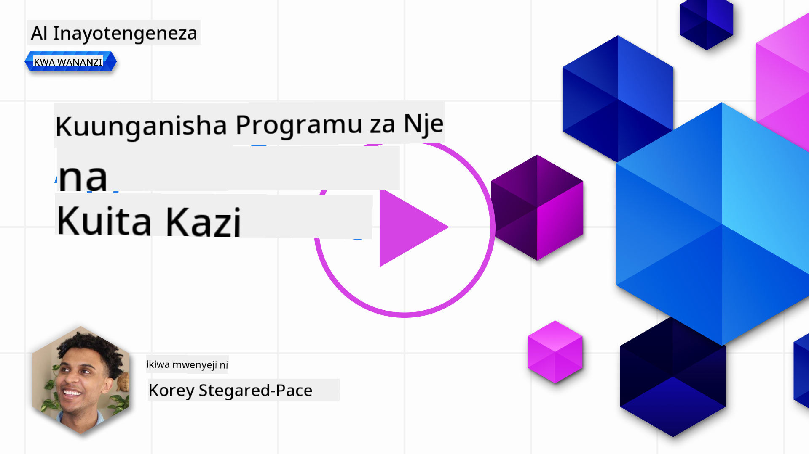

<!--
CO_OP_TRANSLATOR_METADATA:
{
  "original_hash": "f6f84f9ef2d066cd25850cab93580a50",
  "translation_date": "2025-10-17T21:10:31+00:00",
  "source_file": "11-integrating-with-function-calling/README.md",
  "language_code": "sw"
}
-->
# Kujumuisha na Kupiga Kazi

[](https://youtu.be/DgUdCLX8qYQ?si=f1ouQU5HQx6F8Gl2)

Umejifunza mambo mengi hadi sasa katika masomo yaliyopita. Hata hivyo, tunaweza kuboresha zaidi. Baadhi ya mambo tunayotaka kushughulikia ni jinsi tunavyoweza kupata muundo wa majibu unaoeleweka zaidi ili kurahisisha kufanya kazi na majibu hayo baadaye. Pia, tunaweza kutaka kuongeza data kutoka vyanzo vingine ili kuboresha zaidi programu yetu.

Masuala yaliyotajwa hapo juu ndiyo sura hii inatafuta kushughulikia.

## Utangulizi

Somu hii itashughulikia:

- Kuelezea nini maana ya kupiga kazi na matumizi yake.
- Kuunda kupiga kazi kwa kutumia Azure OpenAI.
- Jinsi ya kujumuisha kupiga kazi katika programu.

## Malengo ya Kujifunza

Mwisho wa somo hili, utaweza:

- Kuelezea madhumuni ya kutumia kupiga kazi.
- Kuweka Kupiga Kazi kwa kutumia Huduma ya Azure OpenAI.
- Kubuni kupiga kazi kwa ufanisi kwa matumizi ya programu yako.

## Hali: Kuboresha chatbot yetu kwa kazi

Kwa somo hili, tunataka kujenga kipengele kwa ajili ya kampuni yetu ya elimu kinachoruhusu watumiaji kutumia chatbot kutafuta kozi za kiufundi. Tutapendekeza kozi zinazofaa kiwango chao cha ujuzi, nafasi yao ya sasa, na teknolojia wanayopenda.

Ili kukamilisha hali hii, tutatumia mchanganyiko wa:

- `Azure OpenAI` kuunda uzoefu wa mazungumzo kwa mtumiaji.
- `Microsoft Learn Catalog API` kusaidia watumiaji kupata kozi kulingana na ombi lao.
- `Kupiga Kazi` kuchukua swali la mtumiaji na kulipeleka kwenye kazi ili kufanya ombi la API.

Ili kuanza, hebu tuangalie kwa nini tungependa kutumia kupiga kazi kwanza:

## Kwa Nini Kupiga Kazi

Kabla ya kupiga kazi, majibu kutoka kwa LLM yalikuwa hayana muundo na hayakuwa thabiti. Waendelezaji walihitajika kuandika msimbo mgumu wa uthibitishaji ili kuhakikisha wanaweza kushughulikia kila tofauti ya jibu. Watumiaji hawakuweza kupata majibu kama "Hali ya hewa ya sasa huko Stockholm ni ipi?". Hii ni kwa sababu mifano ilikuwa imefungwa na muda ambao data ilifundishwa.

Kupiga Kazi ni kipengele cha Huduma ya Azure OpenAI kinachoshinda mapungufu yafuatayo:

- **Muundo wa majibu thabiti**. Ikiwa tunaweza kudhibiti muundo wa majibu vizuri, tunaweza kujumuisha majibu hayo kwa urahisi katika mifumo mingine.
- **Data ya nje**. Uwezo wa kutumia data kutoka vyanzo vingine vya programu katika muktadha wa mazungumzo.

## Kuonyesha tatizo kupitia hali

> Tunapendekeza utumie [notebook iliyojumuishwa](./python/aoai-assignment.ipynb?WT.mc_id=academic-105485-koreyst) ikiwa unataka kuendesha hali iliyo hapa chini. Unaweza pia kusoma tu ili kuelewa tatizo ambalo kazi zinaweza kusaidia kulitatua.

Hebu tuangalie mfano unaoonyesha tatizo la muundo wa majibu:

Tuseme tunataka kuunda hifadhidata ya data ya wanafunzi ili tuweze kupendekeza kozi sahihi kwao. Hapa chini tuna maelezo mawili ya wanafunzi ambayo yanafanana sana katika data wanayobeba.

1. Unda muunganisho na rasilimali yetu ya Azure OpenAI:

   ```python
   import os
   import json
   from openai import AzureOpenAI
   from dotenv import load_dotenv
   load_dotenv()

   client = AzureOpenAI(
   api_key=os.environ['AZURE_OPENAI_API_KEY'],  # this is also the default, it can be omitted
   api_version = "2023-07-01-preview"
   )

   deployment=os.environ['AZURE_OPENAI_DEPLOYMENT']
   ```

   Hapa chini kuna msimbo wa Python wa kusanidi muunganisho wetu na Azure OpenAI ambapo tunaweka `api_type`, `api_base`, `api_version` na `api_key`.

1. Kuunda maelezo mawili ya wanafunzi kwa kutumia vigezo `student_1_description` na `student_2_description`.

   ```python
   student_1_description="Emily Johnson is a sophomore majoring in computer science at Duke University. She has a 3.7 GPA. Emily is an active member of the university's Chess Club and Debate Team. She hopes to pursue a career in software engineering after graduating."

   student_2_description = "Michael Lee is a sophomore majoring in computer science at Stanford University. He has a 3.8 GPA. Michael is known for his programming skills and is an active member of the university's Robotics Club. He hopes to pursue a career in artificial intelligence after finishing his studies."
   ```

   Tunataka kutuma maelezo ya wanafunzi hapo juu kwa LLM ili kuchambua data. Data hii inaweza kutumika baadaye katika programu yetu na kutumwa kwa API au kuhifadhiwa katika hifadhidata.

1. Hebu tuunde maelezo mawili sawa ambapo tunamwelekeza LLM kuhusu taarifa tunayoihitaji:

   ```python
   prompt1 = f'''
   Please extract the following information from the given text and return it as a JSON object:

   name
   major
   school
   grades
   club

   This is the body of text to extract the information from:
   {student_1_description}
   '''

   prompt2 = f'''
   Please extract the following information from the given text and return it as a JSON object:

   name
   major
   school
   grades
   club

   This is the body of text to extract the information from:
   {student_2_description}
   '''
   ```

   Maelezo hapo juu yanaelekeza LLM kutoa taarifa na kurudisha majibu katika muundo wa JSON.

1. Baada ya kusanidi maelezo na muunganisho kwa Azure OpenAI, sasa tutatuma maelezo kwa LLM kwa kutumia `openai.ChatCompletion`. Tunahifadhi maelezo katika kigezo cha `messages` na kupeana jukumu la `user`. Hii ni kuiga ujumbe kutoka kwa mtumiaji unaoandikwa kwa chatbot.

   ```python
   # response from prompt one
   openai_response1 = client.chat.completions.create(
   model=deployment,
   messages = [{'role': 'user', 'content': prompt1}]
   )
   openai_response1.choices[0].message.content

   # response from prompt two
   openai_response2 = client.chat.completions.create(
   model=deployment,
   messages = [{'role': 'user', 'content': prompt2}]
   )
   openai_response2.choices[0].message.content
   ```

Sasa tunaweza kutuma maombi yote mawili kwa LLM na kuchunguza majibu tunayopokea kwa kuyapata kama ifuatavyo `openai_response1['choices'][0]['message']['content']`.

1. Mwisho, tunaweza kubadilisha majibu kuwa muundo wa JSON kwa kupiga `json.loads`:

   ```python
   # Loading the response as a JSON object
   json_response1 = json.loads(openai_response1.choices[0].message.content)
   json_response1
   ```

   Jibu 1:

   ```json
   {
     "name": "Emily Johnson",
     "major": "computer science",
     "school": "Duke University",
     "grades": "3.7",
     "club": "Chess Club"
   }
   ```

   Jibu 2:

   ```json
   {
     "name": "Michael Lee",
     "major": "computer science",
     "school": "Stanford University",
     "grades": "3.8 GPA",
     "club": "Robotics Club"
   }
   ```

   Ingawa maelezo ni sawa na maelezo yanafanana, tunaona thamani ya mali ya `Grades` imeundwa tofauti, ambapo tunaweza kupata muundo wa `3.7` au `3.7 GPA` kwa mfano.

   Matokeo haya ni kwa sababu LLM inachukua data isiyo na muundo katika mfumo wa maelezo yaliyoandikwa na kurudisha pia data isiyo na muundo. Tunahitaji kuwa na muundo thabiti ili tujue tunachotarajia tunapohifadhi au kutumia data hii.

Kwa hivyo tunatatua tatizo la muundo vipi? Kwa kutumia kupiga kazi, tunaweza kuhakikisha tunapokea data iliyoundwa. Tunapotumia kupiga kazi, LLM haifanyi kazi au kuendesha kazi yoyote. Badala yake, tunaunda muundo wa LLM kufuata kwa majibu yake. Kisha tunatumia majibu hayo yaliyoundwa kujua ni kazi gani ya kuendesha katika programu zetu.


Tunaweza kisha kuchukua kile kinachorudishwa kutoka kwa kazi na kutuma hii tena kwa LLM. LLM kisha itajibu kwa kutumia lugha ya asili kujibu swali la mtumiaji.

## Matumizi ya Kupiga Kazi

Kuna matumizi mengi tofauti ambapo kupiga kazi kunaweza kuboresha programu yako kama:

- **Kupiga Zana za Nje**. Chatbots ni nzuri katika kutoa majibu ya maswali kutoka kwa watumiaji. Kwa kutumia kupiga kazi, chatbots zinaweza kutumia ujumbe kutoka kwa watumiaji kukamilisha kazi fulani. Kwa mfano, mwanafunzi anaweza kuuliza chatbot "Tuma barua pepe kwa mwalimu wangu kusema nahitaji msaada zaidi na somo hili". Hii inaweza kufanya kupiga kazi kwa `send_email(to: string, body: string)`.

- **Kuunda Maombi ya API au Hifadhidata**. Watumiaji wanaweza kupata taarifa kwa kutumia lugha ya asili ambayo inabadilishwa kuwa ombi lililoundwa au ombi la API. Mfano wa hili linaweza kuwa mwalimu anayeuliza "Ni nani wanafunzi waliokamilisha kazi ya mwisho" ambayo inaweza kupiga kazi iitwayo `get_completed(student_name: string, assignment: int, current_status: string)`.

- **Kuunda Data Iliyounganishwa**. Watumiaji wanaweza kuchukua maandishi au CSV na kutumia LLM kutoa taarifa muhimu kutoka kwayo. Kwa mfano, mwanafunzi anaweza kubadilisha makala ya Wikipedia kuhusu makubaliano ya amani ili kuunda kadi za maswali za AI. Hii inaweza kufanywa kwa kutumia kazi iitwayo `get_important_facts(agreement_name: string, date_signed: string, parties_involved: list)`.

## Kuunda Kupiga Kazi Kwako kwa Mara ya Kwanza

Mchakato wa kuunda kupiga kazi unajumuisha hatua 3 kuu:

1. **Kupiga** API ya Chat Completions na orodha ya kazi zako na ujumbe wa mtumiaji.
2. **Kusoma** majibu ya mfano ili kutekeleza hatua yaani kuendesha kazi au ombi la API.
3. **Kutuma** ombi lingine kwa API ya Chat Completions na majibu kutoka kwa kazi yako ili kutumia taarifa hiyo kuunda jibu kwa mtumiaji.


### Hatua ya 1 - kuunda ujumbe

Hatua ya kwanza ni kuunda ujumbe wa mtumiaji. Hii inaweza kupewa thamani kwa njia ya pembejeo ya maandishi au unaweza kupeana thamani hapa. Ikiwa ni mara yako ya kwanza kufanya kazi na API ya Chat Completions, tunahitaji kufafanua `role` na `content` ya ujumbe.

`Role` inaweza kuwa `system` (kuunda sheria), `assistant` (mfano) au `user` (mtumiaji wa mwisho). Kwa kupiga kazi, tutapeana hii kama `user` na swali la mfano.

```python
messages= [ {"role": "user", "content": "Find me a good course for a beginner student to learn Azure."} ]
```

Kwa kupeana majukumu tofauti, inakuwa wazi kwa LLM ikiwa ni mfumo unaosema kitu au mtumiaji, ambayo husaidia kujenga historia ya mazungumzo ambayo LLM inaweza kujenga juu yake.

### Hatua ya 2 - kuunda kazi

Kisha, tutafafanua kazi na vigezo vya kazi hiyo. Tutatumia kazi moja tu hapa iitwayo `search_courses` lakini unaweza kuunda kazi nyingi.

> **Muhimu** : Kazi zinajumuishwa katika ujumbe wa mfumo kwa LLM na zitajumuishwa katika idadi ya tokeni zinazopatikana ulizonazo.

Hapa chini, tunaunda kazi kama safu ya vitu. Kila kipengee ni kazi na kina mali `name`, `description` na `parameters`:

```python
functions = [
   {
      "name":"search_courses",
      "description":"Retrieves courses from the search index based on the parameters provided",
      "parameters":{
         "type":"object",
         "properties":{
            "role":{
               "type":"string",
               "description":"The role of the learner (i.e. developer, data scientist, student, etc.)"
            },
            "product":{
               "type":"string",
               "description":"The product that the lesson is covering (i.e. Azure, Power BI, etc.)"
            },
            "level":{
               "type":"string",
               "description":"The level of experience the learner has prior to taking the course (i.e. beginner, intermediate, advanced)"
            }
         },
         "required":[
            "role"
         ]
      }
   }
]
```

Hebu tuelezee kila mfano wa kazi kwa undani zaidi hapa chini:

- `name` - Jina la kazi tunayotaka kuitwa.
- `description` - Hii ni maelezo ya jinsi kazi inavyofanya kazi. Hapa ni muhimu kuwa maalum na wazi.
- `parameters` - Orodha ya thamani na muundo ambao tunataka mfano kutoa katika majibu yake. Safu ya vigezo ina vitu ambapo vitu vina mali zifuatazo:
  1.  `type` - Aina ya data ambayo mali zitahifadhiwa.
  1.  `properties` - Orodha ya thamani maalum ambayo mfano utatumia kwa majibu yake
      1. `name` - Kitufe ni jina la mali ambayo mfano utatumia katika majibu yake yaliyoundwa, kwa mfano, `product`.
      1. `type` - Aina ya data ya mali hii, kwa mfano, `string`.
      1. `description` - Maelezo ya mali maalum.

Kuna pia mali ya hiari `required` - mali inayohitajika kwa kupiga kazi kukamilika.

### Hatua ya 3 - Kufanya kupiga kazi

Baada ya kufafanua kazi, sasa tunahitaji kuijumuisha katika ombi kwa API ya Chat Completion. Tunafanya hivi kwa kuongeza `functions` kwenye ombi. Katika kesi hii `functions=functions`.

Kuna pia chaguo la kuweka `function_call` kuwa `auto`. Hii inamaanisha tutaruhusu LLM kuamua ni kazi gani inapaswa kuitwa kulingana na ujumbe wa mtumiaji badala ya kupeana sisi wenyewe.

Hapa kuna msimbo hapa chini ambapo tunapiga `ChatCompletion.create`, angalia jinsi tunavyoweka `functions=functions` na `function_call="auto"` na hivyo kutoa LLM chaguo la wakati wa kupiga kazi tunazozitoa:

```python
response = client.chat.completions.create(model=deployment,
                                        messages=messages,
                                        functions=functions,
                                        function_call="auto")

print(response.choices[0].message)
```

Majibu yanayorudi sasa yanaonekana kama hivi:

```json
{
  "role": "assistant",
  "function_call": {
    "name": "search_courses",
    "arguments": "{\n  \"role\": \"student\",\n  \"product\": \"Azure\",\n  \"level\": \"beginner\"\n}"
  }
}
```

Hapa tunaweza kuona jinsi kazi `search_courses` ilivyopigwa na kwa hoja gani, kama ilivyoorodheshwa katika mali ya `arguments` katika majibu ya JSON.

Hitimisho ni kwamba LLM iliweza kupata data inayofaa hoja za kazi kama ilivyokuwa ikitoa kutoka kwa thamani iliyotolewa kwa kigezo cha `messages` katika kupiga mazungumzo. Hapa chini ni ukumbusho wa thamani ya `messages`:

```python
messages= [ {"role": "user", "content": "Find me a good course for a beginner student to learn Azure."} ]
```

Kama unavyoona, `student`, `Azure` na `beginner` vilitolewa kutoka `messages` na kuwekwa kama pembejeo kwa kazi. Kutumia kazi kwa njia hii ni njia nzuri ya kutoa taarifa kutoka kwa maelezo lakini pia kutoa muundo kwa LLM na kuwa na utendaji unaoweza kutumika tena.

Ifuatayo, tunahitaji kuona jinsi tunavyoweza kutumia hii katika programu yetu.

## Kujumuisha Kupiga Kazi katika Programu

Baada ya kujaribu majibu yaliyoundwa kutoka kwa LLM, sasa tunaweza kujumuisha hii katika programu yetu.

### Kusimamia mchakato

Ili kujumuisha hii katika programu yetu, hebu tuchukue hatua zifuatazo:

1. Kwanza, hebu tupige huduma za OpenAI na kuhifadhi ujumbe katika kigezo kinachoitwa `response_message`.

   ```python
   response_message = response.choices[0].message
   ```

1. Sasa tutafafanua kazi ambayo itapiga Microsoft Learn API kupata orodha ya kozi:

   ```python
   import requests

   def search_courses(role, product, level):
     url = "https://learn.microsoft.com/api/catalog/"
     params = {
        "role": role,
        "product": product,
        "level": level
     }
     response = requests.get(url, params=params)
     modules = response.json()["modules"]
     results = []
     for module in modules[:5]:
        title = module["title"]
        url = module["url"]
        results.append({"title": title, "url": url})
     return str(results)
   ```

   Angalia jinsi tunavyounda kazi halisi ya Python inayolingana na majina ya kazi yaliyoletwa katika kigezo cha `functions`. Pia tunafanya maombi halisi ya API ya nje kupata data tunayoihitaji. Katika kesi hii, tunapiga Microsoft Learn API kutafuta moduli za mafunzo.

Sawa, kwa hivyo tumeunda vigezo vya `functions` na kazi ya Python inayolingana, tunafanyaje LLM kujua jinsi ya kuunganisha hizi mbili pamoja ili kazi yetu ya Python ipigwe?

1. Ili kuona ikiwa tunahitaji kupiga kazi ya Python, tunahitaji kuangalia majibu ya LLM na kuona ikiwa `function_call` ni sehemu yake na kupiga kazi iliyotajwa. Hapa kuna jinsi unavyoweza kufanya ukaguzi ulioelezwa hapa chini:

   ```python
   # Check if the model wants to call a function
   if response_message.function_call.name:
    print("Recommended Function call:")
    print(response_message.function_call.name)
    print()

    # Call the function.
    function_name = response_message.function_call.name

    available_functions = {
            "search_courses": search_courses,
    }
    function_to_call = available_functions[function_name]

    function_args = json.loads(response_message.function_call.arguments)
    function_response = function_to_call(**function_args)

    print("Output of function call:")
    print(function_response)
    print(type(function_response))


    # Add the assistant response and function response to the messages
    messages.append( # adding assistant response to messages
        {
            "role": response_message.role,
            "function_call": {
                "name": function_name,
                "arguments": response_message.function_call.arguments,
            },
            "content": None
        }
    )
    messages.append( # adding function response to messages
        {
            "role": "function",
            "name": function_name,
            "content":function_response,
        }
    )
   ```

   Mistari hii mitatu, inahakikisha tunatoa jina la kazi, hoja na kupiga kazi:

   ```python
   function_to_call = available_functions[function_name]

   function_args = json.loads(response_message.function_call.arguments)
   function_response = function_to_call(**function_args)
   ```

   Hapa chini ni matokeo kutoka kwa kuendesha msimbo wetu:

   **Matokeo**

   ```Recommended Function call:
   {
     "name": "search_courses",
     "arguments": "{\n  \"role\": \"student\",\n  \"product\": \"Azure\",\n  \"level\": \"beginner\"\n}"
   }

   Output of function call:
   [{'title': 'Describe concepts of cryptography', 'url': 'https://learn.microsoft.com/training/modules/describe-concepts-of-cryptography/?
   WT.mc_id=api_CatalogApi'}, {'title': 'Introduction to audio classification with TensorFlow', 'url': 'https://learn.microsoft.com/en-
   us/training/modules/intro-audio-classification-tensorflow/?WT.mc_id=api_CatalogApi'}, {'title': 'Design a Performant Data Model in Azure SQL
   Database with Azure Data Studio', 'url': 'https://learn.microsoft.com/training/modules/design-a-data-model-with-ads/?
   WT.mc_id=api_CatalogApi'}, {'title': 'Getting started with the Microsoft Cloud Adoption Framework for Azure', 'url':
   'https://learn.microsoft.com/training/modules/cloud-adoption-framework-getting-started/?WT.mc_id=api_CatalogApi'}, {'title': 'Set up the
   Rust development environment', 'url': 'https://learn.microsoft.com/training/modules/rust-set-up-environment/?WT.mc_id=api_CatalogApi'}]
   <class 'str'>
   ```

1. Sasa tutatuma ujumbe uliosasishwa, `messages` kwa LLM ili tuweze kupokea jibu la lugha ya asili badala ya majibu ya API yaliyoundwa kwa JSON.

   ```python
   print("Messages in next request:")
   print(messages)
   print()

   second_response = client.chat.completions.create(
      messages=messages,
      model=deployment,
      function_call="auto",
      functions=functions,
      temperature=0
         )  # get a new response from GPT where it can see the function response


   print(second_response.choices[0].message)
   ```

   **Matokeo**

   ```python
   {
     "role": "assistant",
     "content": "I found some good courses for beginner students to learn Azure:\n\n1. [Describe concepts of cryptography] (https://learn.microsoft.com/training/modules/describe-concepts-of-cryptography/?WT.mc_id=api_CatalogApi)\n2. [Introduction to audio classification with TensorFlow](https://learn.microsoft.com/training/modules/intro-audio-classification-tensorflow/?WT.mc_id=api_CatalogApi)\n3. [Design a Performant Data Model in Azure SQL Database with Azure Data Studio](https://learn.microsoft.com/training/modules/design-a-data-model-with-ads/?WT.mc_id=api_CatalogApi)\n4. [Getting started with the Microsoft Cloud Adoption Framework for Azure](https://learn.microsoft.com/training/modules/cloud-adoption-framework-getting-started/?WT.mc_id=api_CatalogApi)\n5. [Set up the Rust development environment](https://learn.microsoft.com/training/modules/rust-set-up-environment/?WT.mc_id=api_CatalogApi)\n\nYou can click on the links to access the courses."
   }

   ```

## Kazi

Ili kuendelea kujifunza kuhusu Azure OpenAI Kupiga Kazi unaweza kujenga:

- Vigezo zaidi vya kazi ambavyo vinaweza kusaidia wanafunzi kupata kozi zaidi.
- Unda kupiga kazi nyingine inayochukua taarifa zaidi kutoka kwa mwanafunzi kama lugha yao ya asili.
- Unda utaratibu wa kushughulikia makosa pale ambapo mwito wa kazi au mwito wa API hauleti kozi zinazofaa

Kidokezo: Fuata ukurasa wa [Learn API reference documentation](https://learn.microsoft.com/training/support/catalog-api-developer-reference?WT.mc_id=academic-105485-koreyst) ili kuona jinsi na wapi data hii inapatikana.

## Kazi Nzuri! Endelea na Safari

Baada ya kukamilisha somo hili, angalia [mkusanyiko wa Kujifunza kuhusu AI Jenereta](https://aka.ms/genai-collection?WT.mc_id=academic-105485-koreyst) ili kuendelea kuongeza maarifa yako kuhusu AI Jenereta!

Nenda kwenye Somo la 12, ambapo tutaangalia jinsi ya [kubuni UX kwa programu za AI](../12-designing-ux-for-ai-applications/README.md?WT.mc_id=academic-105485-koreyst)!

---

**Kanusho**:  
Hati hii imetafsiriwa kwa kutumia huduma ya tafsiri ya AI [Co-op Translator](https://github.com/Azure/co-op-translator). Ingawa tunajitahidi kwa usahihi, tafadhali fahamu kuwa tafsiri za kiotomatiki zinaweza kuwa na makosa au kutokuwa sahihi. Hati ya asili katika lugha yake ya awali inapaswa kuzingatiwa kama chanzo cha mamlaka. Kwa taarifa muhimu, tafsiri ya kitaalamu ya binadamu inapendekezwa. Hatutawajibika kwa kutoelewana au tafsiri zisizo sahihi zinazotokana na matumizi ya tafsiri hii.