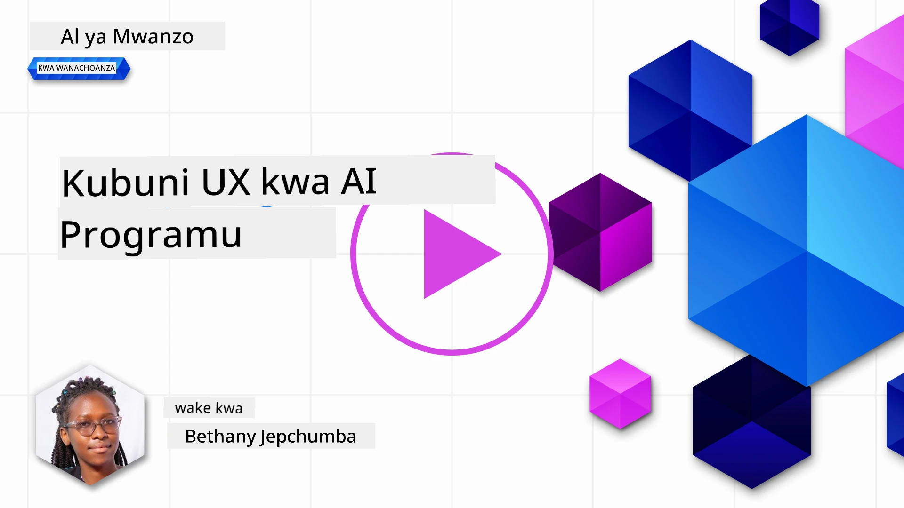
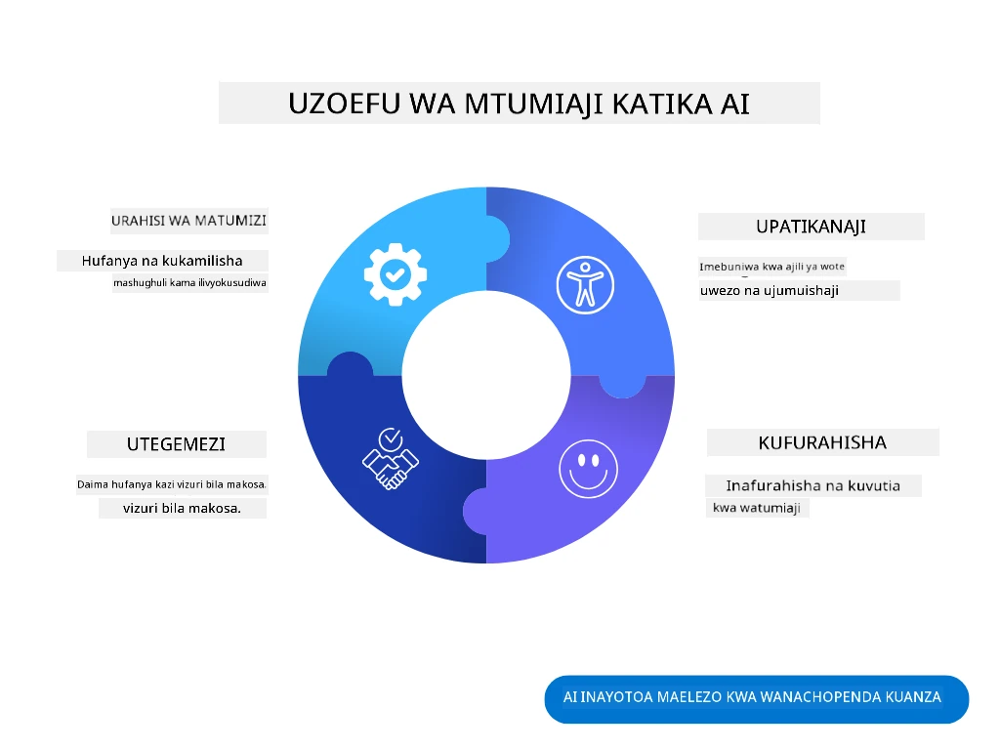
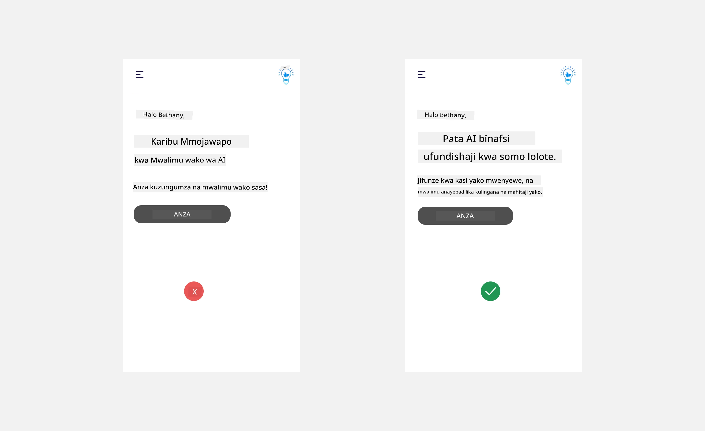
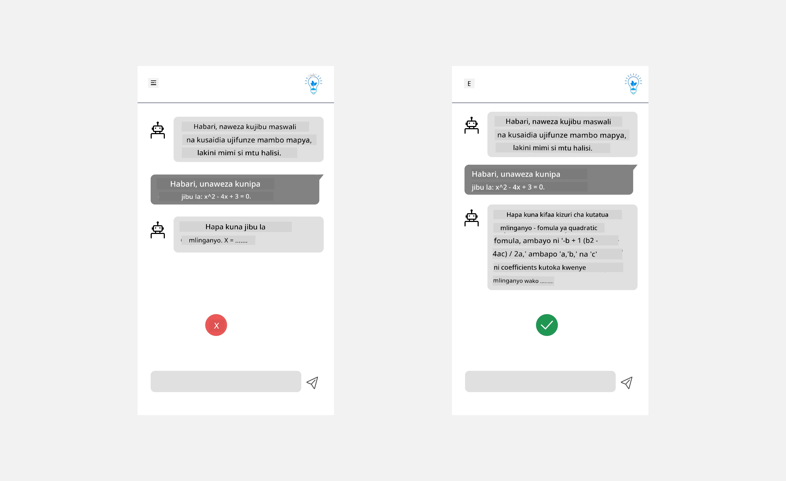
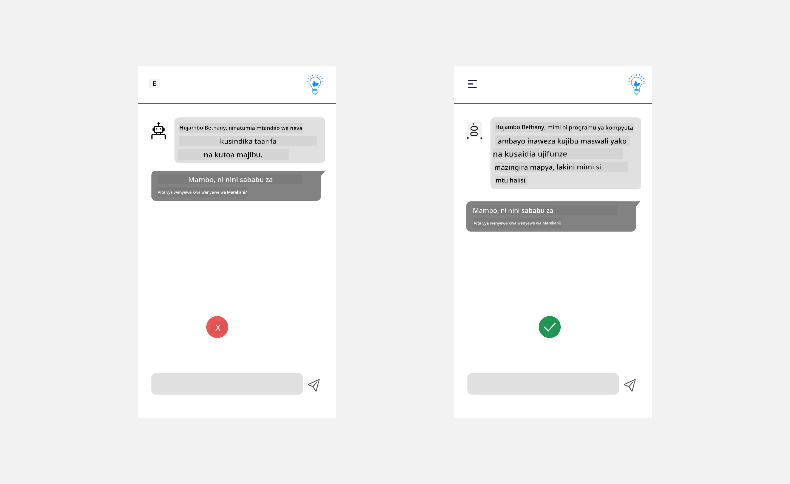
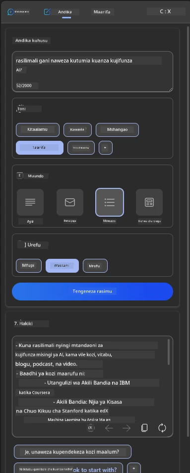
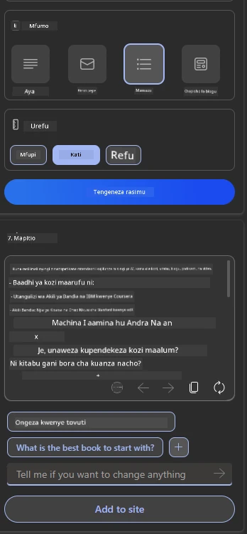
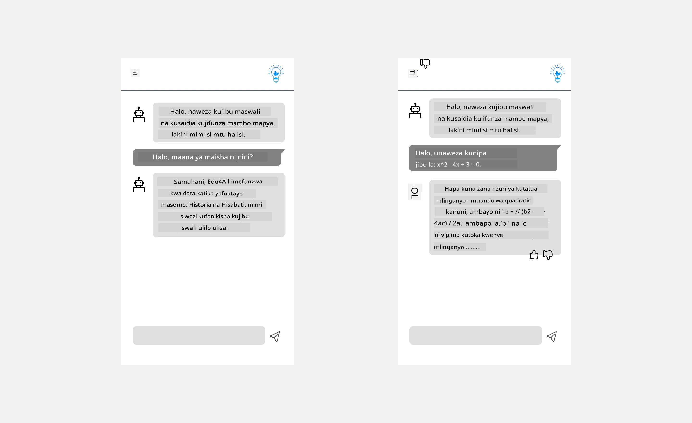

# Kubuni UX kwa Programu za AI

> _(Bofya picha hapo juu kutazama video ya somo hili)_

Uzoefu wa mtumiaji ni jambo muhimu sana katika kuunda programu. Watumiaji wanahitaji kuwa na uwezo wa kutumia programu yako kwa njia bora ili kutekeleza kazi. Kuwa na ufanisi ni jambo moja lakini pia unahitaji kubuni programu ili ziweze kutumiwa na kila mtu, kuwafanya _kupatikana_. Sura hii itazingatia eneo hili ili kwa matumaini mwisho uundaji programu ambayo watu wanaweza na wanataka kutumia.

## Utangulizi

Uzoefu wa mtumiaji ni jinsi mtumiaji anavyoshirikiana na kutumia bidhaa au huduma fulani iwe ni mfumo, zana, au muundo. Wakati wa kuendeleza programu za AI, waendelezaji hawazingatii tu kuhakikisha uzoefu wa mtumiaji ni mzuri bali pia wa maadili. Katika somo hili, tutafundisha jinsi ya kujenga Programu za Akili Bandia (AI) zinazokidhi mahitaji ya watumiaji.

Somo litashughulikia maeneo yafuatayo:

- Utangulizi wa Uzoefu wa Mtumiaji na Kuelewa Mahitaji ya Mtumiaji
- Kubuni Programu za AI kwa Ajili ya Uaminifu na Uwazi
- Kubuni Programu za AI kwa Ajili ya Ushirikiano na Maoni

## Malengo ya Kujifunza

Baada ya kuchukua somo hili, utaweza:

- Kuelewa jinsi ya kujenga programu za AI zinazokidhi mahitaji ya mtumiaji.
- Kubuni programu za AI zinazokuza uaminifu na ushirikiano.

### Yanayotakiwa Kujua Kabla

Chukua muda na soma zaidi kuhusu [uzoefu wa mtumiaji na fikira ya kubuni.](https://learn.microsoft.com/training/modules/ux-design?WT.mc_id=academic-105485-koreyst)

## Utangulizi wa Uzoefu wa Mtumiaji na Kuelewa Mahitaji ya Mtumiaji

Katika kampuni yetu ya elimu ya kubuniwa, tunao watumiaji wawili wakuu, walimu na wanafunzi. Kila mtumiaji ana mahitaji ya kipekee. Ubunifu unaomjikita mtumiaji unawalenga watumiaji kuhakikisha bidhaa ni zinazohitajika na kufaa kwa wale inalenga kufikia.

Programu inapaswa kuwa **faida, inayoaminika, inapatikana na ya kupendeza** ili kutoa uzoefu mzuri kwa mtumiaji.

### Uwezo wa Kutumika

Kuwa na faida kunamaanisha programu ina kazi inayolingana na madhumuni yake, kama vile kuotomatisha mchakato wa ukadiriaji au kutengeneza kadi za marejeleo. Programu inayotoa ukadiriaji inapaswa kuwa na uwezo wa kuweka alama kwa usahihi na ufanisi kwa kazi za wanafunzi kulingana na kriteria zilizowekwa. Vivyo hivyo, programu inayotengeneza kadi za marejeleo inapaswa kuweza kuunda maswali yanayohusika na tofauti kulingana na data yake.

### Uaminifu

Kuwa na uaminifu kunamaanisha programu inaweza kutekeleza kazi yake kwa uthabiti na bila makosa. Hata hivyo, AI kama binadamu si kamili na inaweza kufanya makosa. Programu zinaweza kukumbana na makosa au hali zisizotarajiwa zinazohitaji uingiliaji wa binadamu au marekebisho. Je, unashughulikia makosa vipi? Katika sehemu ya mwisho ya somo hili, tutaangazia jinsi mifumo na programu za AI zinavyoundwa kwa ajili ya ushirikiano na maoni.

### Upatikanaji

Kuwa na upatikanaji kunamaanisha kupanua uzoefu wa mtumiaji kwa watumiaji wenye uwezo tofauti, ikiwa ni pamoja na watu wenye ulemavu, kuhakikisha hakuna anayebaguliwa. Kwa kufuata miongozo na kanuni za upatikanaji, suluhisho za AI zinakuwa jumuishi, rahisi kutumika, na zenye manufaa kwa watumiaji wote.

### Kupendeza

Kuwa wa kupendeza kunamaanisha programu ni ya kufurahisha kutumia. Uzoefu wa mtumiaji wa kuvutia unaweza kuwa na athari nzuri kwa mtumiaji kumshawishi kurudi kutumia programu hiyo na kuongeza mapato ya biashara.

Sio kila changamoto inaweza kutatuliwa na AI. AI huja ili kuongeza uzoefu wako wa mtumiaji, iwe ni kuotomatisha kazi za mikono, au kubinafsisha uzoefu wa mtumiaji.

## Kubuni Programu za AI kwa Ajili ya Uaminifu na Uwazifu

Kujenga uaminifu ni muhimu wakati wa kubuni programu za AI. Uaminifu hufanya mtumiaji awe na uhakika kwamba programu itakamilisha kazi, kutoa matokeo kwa uthabiti na matokeo ni yale mtumiaji anahitaji. Hatari katika eneo hili ni kutokuwa na uaminifu na kuamini kupita kiasi. Kutokuwa na uaminifu hutokea pale mtumiaji anapokuwa na uaminifu mdogo au hakuna kabisa kwa mfumo wa AI, hii husababisha mtumiaji kukataa programu yako. Kuamini kupita kiasi hutokea pale mtumiaji anapoviamini uwezo wa mfumo wa AI kupita kiasi, na kusababisha watumiaji kuamini mfumo wa AI kupita kiasi. Kwa mfano, mfumo wa ukadiriaji otomatiki katika kesi ya kuamini kupita kiasi unaweza kumfanya mwalimu asiangalie baadhi ya karatasi kuhakikisha mfumo wa ukadiriaji unafanya kazi vizuri. Hii inaweza kusababisha alama zisizo za haki au zisizo sahihi kwa wanafunzi, au kupoteza fursa za maoni na maboresho.

Njia mbili za kuhakikisha uaminifu unawekwa katikati ya muundo ni ufafanuzi na udhibiti.

### Ufafanuzi

AI wakati inasaidia kutoa maamuzi kama vile kuelimisha vizazi vijavyo, ni muhimu kwa walimu na wazazi kuelewa jinsi maamuzi ya AI yanavyotolewa. Hii ni ufafanuzi - kuelewa jinsi programu za AI zinavyotoa maamuzi. Kubuni kwa ajili ya ufafanuzi kunajumuisha kuongeza maelezo yanayoonyesha jinsi AI ilivyofikia matokeo. Hadhira inapaswa kufahamu kwamba matokeo yanatokana na AI na si binadamu. Kwa mfano, badala ya kusema "Anza kuzungumza na mwalimu wako sasa" sema "Tumia mwalimu wa AI anayebadilika kulingana na mahitaji yako na kukusaidia kujifunza kwa kasi yako."

Mfano mwingine ni jinsi AI inavyotumia data za mtumiaji na binafsi. Kwa mfano, mtumiaji mwenye hadhira ya mwanafunzi anaweza kuwa na vikwazo kulingana na hadhira yake. AI huenda isiweze kufichua majibu ya maswali lakini inaweza kusaidia kumwelekeza mtumiaji kufikiri jinsi ya kutatua tatizo.

Sehemu muhimu ya mwisho ya ufafanuzi ni kurahisisha maelezo. Wanafunzi na walimu huenda wasiwe wataalamu wa AI, kwa hivyo maelezo ya kile programu inaweza au haiwezi kufanya yanapaswa kurahisiwa na kuwa rahisi kuelewa.

### Udhibiti

AI yenye uzalishaji huunda ushirikiano kati ya AI na mtumiaji, ambapo kwa mfano mtumiaji anaweza kubadilisha maelekezo kwa matokeo tofauti. Zaidi ya hayo, mara baada ya matokeo kutolewa, watumiaji wanapaswa kuwa na uwezo wa kubadilisha matokeo na hivyo kupata hisia ya udhibiti. Kwa mfano, wakati wa kutumia Microsoft Copilot (awali Bing Chat), unaweza kubinafsisha maelekezo yako kulingana na muundo, sauti na urefu. Zaidi ya hayo, unaweza kuongeza mabadiliko kwenye matokeo yako na kuyarekebisha kama inavyoonyeshwa hapa chini:

Kipengele kingine katika Microsoft Copilot kinachomruhusu mtumiaji kuwa na udhibiti wa programu ni uwezo wa kuchagua kuingia na kutoka kwenye ukusanyaji wa data AI hutumia. Kwa ajili ya programu ya shule, mwanafunzi anaweza kutaka kutumia vidokezo vyake pamoja na rasilimali za walimu kama nyenzo za marejeleo.

> Wakati wa kubuni programu za AI, nia ni muhimu kuhakikisha watumiaji hawalazwi kuamini kupita kiasi kwa kuweka matarajio yasiyowezekana juu ya uwezo wa programu hiyo. Njia moja ya kufanya hivi ni kwa kuleta kuchelewa kati ya maelekezo na matokeo. Kumbusha mtumiaji, kwamba hii ni AI na si binadamu mwenzako.

## Kubuni Programu za AI kwa Ushirikiano na Maoni

Kama ilivyotajwa awali, AI yenye uzalishaji huunda ushirikiano kati ya mtumiaji na AI. Muktadha mwingi ni mtumiaji kuingiza maelekezo na AI kutoa matokeo. Je, matokeo ni yasiyo sahihi? Programu inashughulikia makosa vipi ikiwa yatatokea? AI hulaumu mtumiaji au hupata muda wa kufafanua kosa?

Programu za AI zinapaswa kujengwa ili kupokea na kutoa maoni. Hii si tu kusaidia mfumo wa AI kuboresha bali pia hujenga uaminifu na watumiaji. Mzunguko wa maoni unapaswa kuzingatiwa katika muundo, mfano unaweza kuwa kidole gumba cha kidole cha juu au chini juu ya matokeo.

Njia nyingine ya kushughulikia hili ni kuwasiliana wazi uwezo na vikwazo vya mfumo. Wakati mtumiaji anapofanya kosa kwa kuomba kitu kinachozidi uwezo wa AI, pia inapaswa kuwepo njia ya kushughulikia hili, kama inavyoonyeshwa hapa chini.

Makosa ya mfumo ni ya kawaida katika programu ambapo mtumiaji anaweza kuhitaji msaada wa habari nje ya wigo wa AI au programu inaweza kuwa na kikomo cha maswali/somo kiasi gani mtumiaji anaweza kuanzisha muhtasari. Kwa mfano, programu ya AI iliyofunzwa na data juu ya masomo machache kama Historia na Hisabati huenda isiweze kushughulikia maswali kuhusu Jiografia. Ili kupunguza hili, mfumo wa AI unaweza kutoa jibu kama: "Samahani, bidhaa yetu imeshulizwa data katika masomo yafuatayo....., siwezi kujibu swali uliloomba."

Programu za AI si kamili, kwa hivyo zitafanya makosa. Unapounda programu zako, unapaswa kuhakikisha unaweka nafasi ya maoni kutoka kwa watumiaji na utambuzi wa makosa kwa njia rahisi na inayoeleweka.

## Zawadi ya Kazi

Chukua programu yoyote ya AI ulioijenga hadi sasa, fikiria kutekeleza hatua zifuatazo katika programu yako:

- **Kupendeza:** Fikiria jinsi ya kufanya programu yako iwe ya kufurahisha zaidi. Je, unaongeza maelezo kila mahali? Je, unawahamasisha watumiaji kuchunguza? Unavyosema ujumbe wa makosa yako vipi?

- **Uwezo wa Kutumika:** Kujenga programu ya wavuti. Hakikisha programu yako inavigwa kwa panya na kibodi.

- **Uaminifu na uwazi:** Usiamini AI kabisa na matokeo yake, fikiria jinsi unavyoweza kuongeza mtu wa kweli katika mchakato wa kuthibitisha matokeo. Pia, fikiria na utekeleze njia nyingine za kufanikisha uaminifu na uwazi.

- **Udhibiti:** Mpe mtumiaji udhibiti wa data wanazotoa kwa programu. Tekeleza njia mtumiaji anaweza kuchagua kujiunga na kuacha ukusanyaji data katika programu ya AI.

<!-- ## [Post-lecture quiz](../../../12-designing-ux-for-ai-applications/quiz-url) -->

## Endelea Kujifunza!

Baada ya kumaliza somo hili, angalia [Mkusanyiko wa Kujifunza AI Yenye Uzalishaji](https://aka.ms/genai-collection?WT.mc_id=academic-105485-koreyst) kuendelea kuongeza maarifa yako ya AI!

Nenda kwenye Somo la 13, ambapo tutaangalia jinsi ya [kukuaidia usalama wa programu za AI](../13-securing-ai-applications/README.md?WT.mc_id=academic-105485-koreyst)!

---

<!-- CO-OP TRANSLATOR DISCLAIMER START -->
**Kionyozo**:
Hati hii imetafsiriwa kwa kutumia huduma ya tafsiri ya AI [Co-op Translator](https://github.com/Azure/co-op-translator). Ingawa tunajitahidi kupata usahihi, tafadhali fahamu kwamba tafsiri za kiotomatiki zinaweza kuwa na makosa au upungufu wa usahihi. Hati ya asili katika lugha yake halisi inapaswa kuchukuliwa kama chanzo cha mamlaka. Kwa taarifa muhimu, tafsiri ya kitaalamu inayofanywa na binadamu inapendekezwa. Hatutojibu kwa kuelewa vibaya au tafsiri potofu zinazotokea kutokana na matumizi ya tafsiri hii.
<!-- CO-OP TRANSLATOR DISCLAIMER END -->