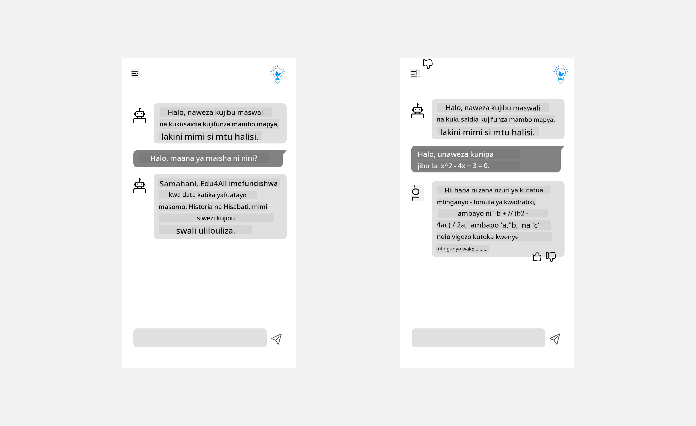

<!--
CO_OP_TRANSLATOR_METADATA:
{
  "original_hash": "747668e4c53d067369f06e9ec2e6313e",
  "translation_date": "2025-08-26T18:46:52+00:00",
  "source_file": "12-designing-ux-for-ai-applications/README.md",
  "language_code": "sw"
}
-->
# Kubuni UX kwa Programu za AI

> _(Bofya picha hapo juu kutazama video ya somo hili)_

Uzoefu wa mtumiaji ni kipengele muhimu sana katika utengenezaji wa programu. Watumiaji wanahitaji kutumia programu yako kwa njia rahisi na bora ili kutekeleza majukumu yao. Kuwa na ufanisi ni jambo moja, lakini pia unapaswa kubuni programu ili ziweze kutumiwa na kila mtu, yaani ziwe _rahisi kufikiwa_. Sura hii itazingatia eneo hili ili hatimaye ubuni programu ambayo watu wanaweza na wanataka kuitumia.

## Utangulizi

Uzoefu wa mtumiaji ni jinsi mtumiaji anavyoshirikiana na kutumia bidhaa au huduma fulani iwe ni mfumo, zana, au muundo. Unapounda programu za AI, watengenezaji hawazingatii tu kuhakikisha uzoefu wa mtumiaji ni bora, bali pia ni wa kimaadili. Katika somo hili, tunajadili jinsi ya kujenga programu za Akili Bandia (AI) zinazokidhi mahitaji ya watumiaji.

Somo hili litashughulikia maeneo yafuatayo:

- Utangulizi wa Uzoefu wa Mtumiaji na Kuelewa Mahitaji ya Mtumiaji
- Kubuni Programu za AI kwa Ajili ya Uaminifu na Uwazi
- Kubuni Programu za AI kwa Ajili ya Ushirikiano na Maoni

## Malengo ya Kujifunza

Baada ya kuchukua somo hili, utaweza:

- Kuelewa jinsi ya kujenga programu za AI zinazokidhi mahitaji ya mtumiaji.
- Kubuni programu za AI zinazokuza uaminifu na ushirikiano.

### Sharti la Awali

Tenga muda na usome zaidi kuhusu [uzoefu wa mtumiaji na fikra za kubuni.](https://learn.microsoft.com/training/modules/ux-design?WT.mc_id=academic-105485-koreyst)

## Utangulizi wa Uzoefu wa Mtumiaji na Kuelewa Mahitaji ya Mtumiaji

Katika kampuni yetu ya elimu ya kubuniwa, tuna watumiaji wakuu wawili, walimu na wanafunzi. Kila mmoja ana mahitaji yake maalum. Kubuni kwa kuzingatia mtumiaji kunampa kipaumbele mtumiaji na kuhakikisha bidhaa ni muhimu na inafaa kwa wale waliokusudiwa.

Programu inapaswa kuwa **muhimu, ya kuaminika, rahisi kufikiwa na ya kuvutia** ili kutoa uzoefu mzuri kwa mtumiaji.

### Ufanisi

Kuwa muhimu maana yake programu ina uwezo unaolingana na kusudi lake, kama vile kurahisisha mchakato wa kutoa alama au kutengeneza kadi za maswali kwa ajili ya marudio. Programu inayorahisisha kutoa alama inapaswa kutoa alama kwa usahihi na haraka kwa kazi za wanafunzi kulingana na vigezo vilivyowekwa. Vivyo hivyo, programu inayotengeneza kadi za maswali inapaswa kuunda maswali yanayofaa na tofauti kulingana na data iliyonayo.

### Uaminifu

Kuwa ya kuaminika maana yake programu inaweza kufanya kazi yake kwa uendelevu na bila makosa. Hata hivyo, AI kama binadamu si kamilifu na inaweza kukosea. Programu zinaweza kukutana na makosa au hali zisizotarajiwa zinazohitaji msaada au marekebisho ya binadamu. Unashughulikiaje makosa? Katika sehemu ya mwisho ya somo hili, tutajadili jinsi mifumo na programu za AI zinavyobuniwa kwa ajili ya ushirikiano na maoni.

### Ufikiaji

Kuwa rahisi kufikiwa maana yake ni kupanua uzoefu wa mtumiaji kwa watumiaji wenye uwezo tofauti, wakiwemo wenye ulemavu, ili kuhakikisha hakuna anayebaguliwa. Kwa kufuata miongozo na kanuni za ufikiaji, suluhisho za AI zinakuwa jumuishi zaidi, rahisi kutumia na zenye manufaa kwa watumiaji wote.

### Kuvutia

Kuwa ya kuvutia maana yake programu inafurahisha kuitumia. Uzoefu wa kuvutia unaweza kuwa na athari chanya kwa mtumiaji na kumhamasisha kurudi kutumia programu na kuongeza mapato ya biashara.

Si kila changamoto inaweza kutatuliwa na AI. AI inakuja kuongeza uzoefu wa mtumiaji, iwe ni kurahisisha kazi za mikono au kubinafsisha uzoefu wa mtumiaji.

## Kubuni Programu za AI kwa Ajili ya Uaminifu na Uwazi

Kujenga uaminifu ni muhimu sana unapobuni programu za AI. Uaminifu unahakikisha mtumiaji ana uhakika kuwa programu itafanya kazi, itatoa matokeo kwa uendelevu na matokeo hayo ni yale anayohitaji. Hatari katika eneo hili ni kutokuaminiana na kuamini kupita kiasi. Kutokuaminiana hutokea mtumiaji anapokuwa na imani ndogo au hana imani kabisa na mfumo wa AI, na hii husababisha mtumiaji kukataa programu yako. Kuamini kupita kiasi hutokea mtumiaji anapothamini uwezo wa mfumo wa AI kupita kiasi, na hivyo kuamini sana mfumo wa AI. Kwa mfano, mfumo wa kutoa alama kiotomatiki ukiaminiwa kupita kiasi unaweza kumfanya mwalimu asikague baadhi ya karatasi ili kuhakikisha mfumo unafanya kazi vizuri. Hii inaweza kusababisha alama zisizo sahihi au zisizo sawa kwa wanafunzi, au kukosa fursa za maoni na kuboresha.

Njia mbili za kuhakikisha uaminifu unakuwa kiini cha muundo ni kuelezeka na udhibiti.

### Kuelezeka

AI inaposaidia kutoa maamuzi kama vile kufundisha vizazi vijavyo, ni muhimu kwa walimu na wazazi kuelewa jinsi maamuzi ya AI yanavyofanyika. Hii ndiyo kuelezeka - kuelewa jinsi programu za AI zinavyofanya maamuzi. Kubuni kwa ajili ya kuelezeka kunajumuisha kuongeza maelezo yanayoonyesha jinsi AI ilivyofikia matokeo. Watazamaji lazima wajue kuwa matokeo yametolewa na AI na si binadamu. Kwa mfano, badala ya kusema "Anza kuzungumza na mwalimu wako sasa" sema "Tumia mwalimu wa AI anayebadilika kulingana na mahitaji yako na anakusaidia kujifunza kwa kasi yako."

Mfano mwingine ni jinsi AI inavyotumia data ya mtumiaji na binafsi. Kwa mfano, mtumiaji mwenye persona ya mwanafunzi anaweza kuwa na mipaka kulingana na persona yake. AI inaweza isiweze kutoa majibu ya maswali moja kwa moja lakini inaweza kumsaidia mtumiaji kufikiria jinsi ya kutatua tatizo.

Sehemu ya mwisho muhimu ya kuelezeka ni kurahisisha maelezo. Wanafunzi na walimu si wataalamu wa AI, hivyo maelezo ya kile programu inaweza au haiwezi kufanya yanapaswa kuwa rahisi na ya kueleweka.

### Udhibiti

AI inayozalisha inaunda ushirikiano kati ya AI na mtumiaji, ambapo mtumiaji anaweza kubadilisha maelekezo ili kupata matokeo tofauti. Pia, baada ya matokeo kutolewa, watumiaji wanapaswa kuwa na uwezo wa kubadilisha matokeo na hivyo kupata hisia ya udhibiti. Kwa mfano, unapotumia Bing, unaweza kurekebisha maelekezo yako kulingana na muundo, mtindo na urefu. Pia, unaweza kuongeza mabadiliko kwenye matokeo yako na kuyabadilisha kama inavyoonekana hapa chini:

Kipengele kingine katika Bing kinachompa mtumiaji udhibiti wa programu ni uwezo wa kuchagua kutumia au kutotumia data ambayo AI inatumia. Kwa programu ya shule, mwanafunzi anaweza kutaka kutumia noti zake pamoja na rasilimali za walimu kama nyenzo za marudio.

> Unapobuni programu za AI, makusudi ni muhimu ili kuhakikisha watumiaji hawaamini kupita kiasi na kuweka matarajio yasiyo halisi kuhusu uwezo wake. Njia moja ya kufanya hivi ni kwa kuweka vikwazo kati ya maelekezo na matokeo. Kumkumbusha mtumiaji kuwa hii ni AI na si binadamu mwenzake

## Kubuni Programu za AI kwa Ajili ya Ushirikiano na Maoni

Kama ilivyotajwa awali, AI inayozalisha inaunda ushirikiano kati ya mtumiaji na AI. Mara nyingi, mtumiaji anaingiza maelekezo na AI inatoa matokeo. Je, kama matokeo si sahihi? Programu inashughulikiaje makosa yanapotokea? Je, AI inamlaumu mtumiaji au inachukua muda kuelezea kosa?

Programu za AI zinapaswa kujengwa ili kupokea na kutoa maoni. Hii husaidia mfumo wa AI kuboresha na pia kujenga uaminifu na watumiaji. Mzunguko wa maoni unapaswa kujumuishwa kwenye muundo, mfano unaweza kuwa alama ya kidole juu au chini kwenye matokeo.

Njia nyingine ya kushughulikia hili ni kuwasiliana wazi uwezo na mipaka ya mfumo. Mtumiaji anapokosea kuomba kitu nje ya uwezo wa AI, inapaswa kuwepo njia ya kushughulikia hili, kama inavyoonekana hapa chini.

Makosa ya mfumo ni ya kawaida kwenye programu ambapo mtumiaji anaweza kuhitaji msaada na taarifa nje ya uwezo wa AI au programu inaweza kuwa na kikomo cha idadi ya maswali/masomo ambayo mtumiaji anaweza kupata muhtasari. Kwa mfano, programu ya AI iliyofundishwa na data ya masomo machache kama Historia na Hisabati inaweza isiweze kushughulikia maswali kuhusu Jiografia. Ili kukabiliana na hili, mfumo wa AI unaweza kutoa jibu kama: "Samahani, bidhaa yetu imefundishwa na data ya masomo yafuatayo....., siwezi kujibu swali ulilouliza."

Programu za AI si kamilifu, hivyo zinaweza kukosea. Unapobuni programu zako, hakikisha unatoa nafasi ya kupokea maoni kutoka kwa watumiaji na kushughulikia makosa kwa njia rahisi na inayoelezeka.

## Kazi ya Nyumbani

Chukua programu yoyote ya AI uliyotengeneza hadi sasa, fikiria kutekeleza hatua zifuatazo kwenye programu yako:

- **Kuvutia:** Fikiria jinsi unavyoweza kufanya programu yako iwe ya kuvutia zaidi. Je, unaongeza maelezo kila mahali? Je, unamhamasisha mtumiaji kuchunguza? Umeandika vipi ujumbe wa makosa?

- **Ufanisi:** Unatengeneza programu ya wavuti. Hakikisha programu yako inaweza kutumika kwa panya na kibodi.

- **Uaminifu na uwazi:** Usiiamini AI kabisa na matokeo yake, fikiria jinsi unavyoweza kuongeza binadamu kwenye mchakato ili kuthibitisha matokeo. Pia, fikiria na tekeleza njia nyingine za kufikia uaminifu na uwazi.

- **Udhibiti:** Mpe mtumiaji udhibiti wa data anayotoa kwenye programu. Tekeleza njia ambayo mtumiaji anaweza kuchagua kushiriki au kutoshiriki data kwenye programu ya AI.

## Endelea Kujifunza!

Baada ya kumaliza somo hili, angalia [mkusanyiko wetu wa Kujifunza AI Inayozalisha](https://aka.ms/genai-collection?WT.mc_id=academic-105485-koreyst) ili kuendelea kuongeza maarifa yako ya AI Inayozalisha!

Nenda kwenye Somo la 13, ambapo tutaangalia jinsi ya [kulinda programu za AI](../13-securing-ai-applications/README.md?WT.mc_id=academic-105485-koreyst)!

---

**Kanusho**:  
Hati hii imetafsiriwa kwa kutumia huduma ya kutafsiri ya AI [Co-op Translator](https://github.com/Azure/co-op-translator). Ingawa tunajitahidi kuhakikisha usahihi, tafadhali fahamu kwamba tafsiri za kiotomatiki zinaweza kuwa na makosa au kutokuwa sahihi. Hati asili katika lugha yake ya asili inapaswa kuchukuliwa kama chanzo cha mamlaka. Kwa taarifa muhimu, inashauriwa kutumia huduma ya utafsiri wa binadamu wa kitaalamu. Hatutawajibika kwa kutoelewana au tafsiri zisizo sahihi zitakazotokana na matumizi ya tafsiri hii.