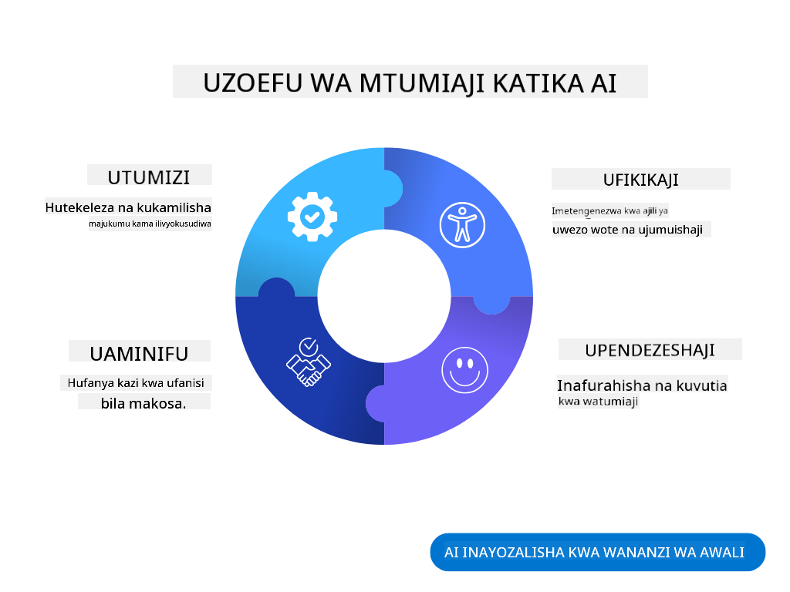
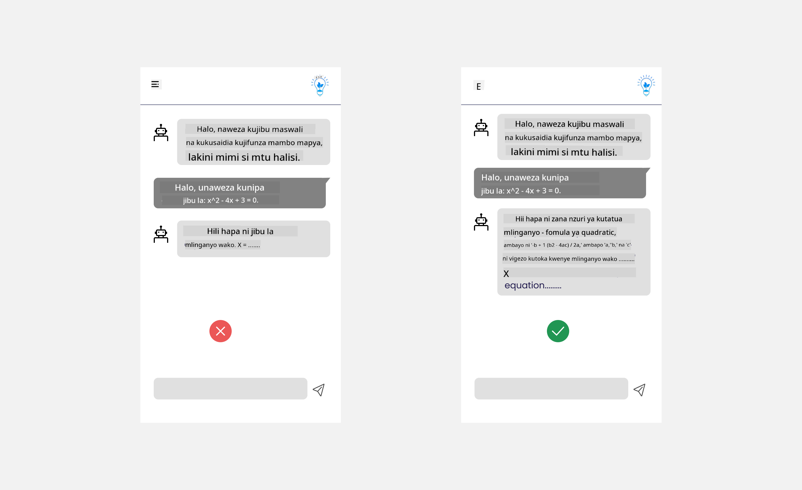
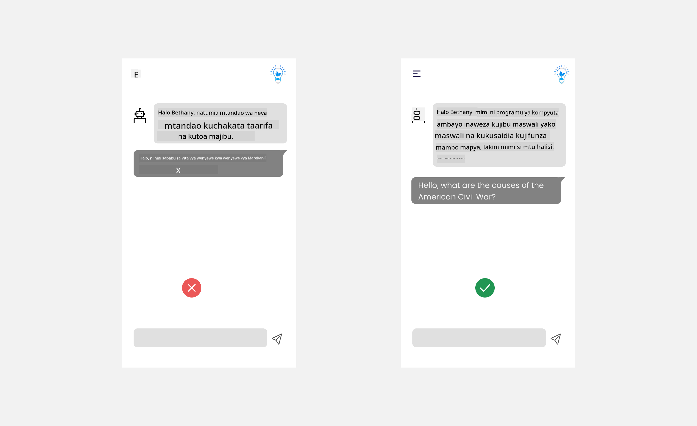

<!--
CO_OP_TRANSLATOR_METADATA:
{
  "original_hash": "78bbeed50fd4dc9fdee931f5daf98cb3",
  "translation_date": "2025-10-17T21:09:36+00:00",
  "source_file": "12-designing-ux-for-ai-applications/README.md",
  "language_code": "sw"
}
-->
# Kubuni UX kwa Programu za AI

> _(Bofya picha hapo juu kutazama video ya somo hili)_

Uzoefu wa mtumiaji ni kipengele muhimu sana katika kujenga programu. Watumiaji wanahitaji kuwa na uwezo wa kutumia programu yako kwa njia bora ili kutekeleza majukumu yao. Kuwa na ufanisi ni jambo moja, lakini pia unahitaji kubuni programu ili ziweze kutumiwa na kila mtu, na kuzifanya _kupatikana kwa urahisi_. Sura hii itazingatia eneo hili ili uweze kubuni programu ambayo watu wanaweza na wanataka kuitumia.

## Utangulizi

Uzoefu wa mtumiaji ni jinsi mtumiaji anavyoshirikiana na kutumia bidhaa au huduma fulani iwe ni mfumo, zana, au muundo. Wakati wa kuunda programu za AI, watengenezaji hawazingatii tu kuhakikisha uzoefu wa mtumiaji ni mzuri bali pia ni wa kimaadili. Katika somo hili, tutajadili jinsi ya kujenga programu za Akili Bandia (AI) zinazokidhi mahitaji ya watumiaji.

Somo litajumuisha maeneo yafuatayo:

- Utangulizi wa Uzoefu wa Mtumiaji na Kuelewa Mahitaji ya Watumiaji
- Kubuni Programu za AI kwa Ajili ya Uaminifu na Uwazi
- Kubuni Programu za AI kwa Ushirikiano na Maoni

## Malengo ya Kujifunza

Baada ya kuchukua somo hili, utaweza:

- Kuelewa jinsi ya kujenga programu za AI zinazokidhi mahitaji ya watumiaji.
- Kubuni programu za AI zinazochochea uaminifu na ushirikiano.

### Sharti la Awali

Tafadhali chukua muda na soma zaidi kuhusu [uzoefu wa mtumiaji na mawazo ya kubuni.](https://learn.microsoft.com/training/modules/ux-design?WT.mc_id=academic-105485-koreyst)

## Utangulizi wa Uzoefu wa Mtumiaji na Kuelewa Mahitaji ya Watumiaji

Katika kampuni yetu ya elimu ya kubuniwa, tuna watumiaji wakuu wawili, walimu na wanafunzi. Kila mmoja kati ya watumiaji hawa ana mahitaji ya kipekee. Ubunifu unaozingatia mtumiaji unazingatia mtumiaji kuhakikisha bidhaa ni muhimu na zenye manufaa kwa wale ambao zinalengwa.

Programu inapaswa kuwa **ya manufaa, ya kuaminika, inayopatikana kwa urahisi na ya kupendeza** ili kutoa uzoefu mzuri wa mtumiaji.

### Urahisi wa Kutumia

Kuwa na manufaa inamaanisha kuwa programu ina uwezo wa kufanya kazi kulingana na kusudi lake, kama vile kuendesha mchakato wa kutoa alama au kuunda kadi za maswali kwa ajili ya marudio. Programu inayosaidia kutoa alama inapaswa kuwa na uwezo wa kutoa alama kwa kazi za wanafunzi kwa usahihi na kwa ufanisi kulingana na vigezo vilivyowekwa. Vivyo hivyo, programu inayounda kadi za maswali ya marudio inapaswa kuwa na uwezo wa kuunda maswali yanayofaa na yenye utofauti kulingana na data yake.

### Uaminifu

Kuwa wa kuaminika inamaanisha kuwa programu inaweza kutekeleza kazi zake kwa uthabiti na bila makosa. Hata hivyo, AI kama binadamu si kamilifu na inaweza kukumbwa na makosa. Programu zinaweza kukutana na makosa au hali zisizotarajiwa zinazohitaji uingiliaji au marekebisho ya binadamu. Unashughulikiaje makosa? Katika sehemu ya mwisho ya somo hili, tutajadili jinsi mifumo ya AI na programu zinavyobuniwa kwa ajili ya ushirikiano na maoni.

### Upatikanaji

Kuwa rahisi kupatikana inamaanisha kupanua uzoefu wa mtumiaji kwa watumiaji wenye uwezo mbalimbali, ikiwa ni pamoja na wale wenye ulemavu, kuhakikisha hakuna anayebaki nje. Kwa kufuata miongozo na kanuni za upatikanaji, suluhisho za AI zinakuwa za kujumuisha zaidi, zinazoweza kutumika, na zenye manufaa kwa watumiaji wote.

### Kupendeza

Kuwa wa kupendeza inamaanisha kuwa programu ni ya kufurahisha kutumia. Uzoefu wa mtumiaji unaovutia unaweza kuwa na athari chanya kwa mtumiaji, kumhimiza kurudi kutumia programu na kuongeza mapato ya biashara.

Si kila changamoto inaweza kutatuliwa na AI. AI huja kusaidia uzoefu wa mtumiaji, iwe ni kuendesha kazi za mikono, au kubinafsisha uzoefu wa mtumiaji.

## Kubuni Programu za AI kwa Ajili ya Uaminifu na Uwazi

Kujenga uaminifu ni muhimu sana wakati wa kubuni programu za AI. Uaminifu unahakikisha mtumiaji ana uhakika kuwa programu itafanya kazi, kutoa matokeo kwa uthabiti na matokeo hayo ni yale ambayo mtumiaji anahitaji. Hatari katika eneo hili ni kutokuwa na imani au kuwa na imani kupita kiasi. Kutokuwa na imani hutokea wakati mtumiaji hana imani au ana imani ndogo na mfumo wa AI, hali hii husababisha mtumiaji kukataa programu yako. Kuwa na imani kupita kiasi hutokea wakati mtumiaji anadhani mfumo wa AI una uwezo wa juu sana, hali inayosababisha watumiaji kuamini mfumo wa AI kupita kiasi. Kwa mfano, mfumo wa kutoa alama kiotomatiki katika hali ya kuwa na imani kupita kiasi unaweza kusababisha mwalimu kutokagua baadhi ya karatasi ili kuhakikisha mfumo wa kutoa alama unafanya kazi vizuri. Hii inaweza kusababisha alama zisizo za haki au zisizo sahihi kwa wanafunzi, au fursa zilizopotea za maoni na maboresho.

Njia mbili za kuhakikisha kuwa uaminifu unakuwa katikati ya ubunifu ni kueleweka na udhibiti.

### Uelewevu

Wakati AI inasaidia kutoa maamuzi kama vile kufundisha vizazi vijavyo, ni muhimu kwa walimu na wazazi kuelewa jinsi maamuzi ya AI yanavyofanywa. Hii ni uelewevu - kuelewa jinsi programu za AI zinavyofanya maamuzi. Kubuni kwa ajili ya uelewevu kunajumuisha kuongeza maelezo yanayoonyesha jinsi AI ilivyofikia matokeo. Hadhira inapaswa kufahamu kuwa matokeo yanatolewa na AI na si binadamu. Kwa mfano, badala ya kusema "Anza kuzungumza na mwalimu wako sasa" sema "Tumia mwalimu wa AI anayejibadilisha kulingana na mahitaji yako na kukusaidia kujifunza kwa kasi yako."

Mfano mwingine ni jinsi AI inavyotumia data ya mtumiaji na ya kibinafsi. Kwa mfano, mtumiaji mwenye tabia ya mwanafunzi anaweza kuwa na mipaka kulingana na tabia yake. AI inaweza kuwa hawezi kufichua majibu ya maswali lakini inaweza kusaidia kumwelekeza mtumiaji kufikiria jinsi ya kutatua tatizo.

Sehemu nyingine muhimu ya uelewevu ni urahisi wa maelezo. Wanafunzi na walimu huenda si wataalamu wa AI, kwa hivyo maelezo ya kile ambacho programu inaweza au haiwezi kufanya yanapaswa kuwa rahisi na rahisi kueleweka.

### Udhibiti

AI ya kizazi huunda ushirikiano kati ya AI na mtumiaji, ambapo kwa mfano mtumiaji anaweza kurekebisha maelezo ya maombi ili kupata matokeo tofauti. Zaidi ya hayo, mara matokeo yanapotolewa, watumiaji wanapaswa kuwa na uwezo wa kurekebisha matokeo hayo na kuwapa hisia ya udhibiti. Kwa mfano, wakati wa kutumia Bing, unaweza kubadilisha maelezo ya maombi kulingana na muundo, sauti na urefu. Zaidi ya hayo, unaweza kuongeza mabadiliko kwenye matokeo yako na kurekebisha matokeo kama inavyoonyeshwa hapa chini:

Kipengele kingine katika Bing kinachomruhusu mtumiaji kuwa na udhibiti juu ya programu ni uwezo wa kuchagua kuingia au kutoka kwa data ambayo AI inatumia. Kwa programu ya shule, mwanafunzi anaweza kutaka kutumia noti zake pamoja na rasilimali za walimu kama nyenzo za marudio.

> Wakati wa kubuni programu za AI, makusudi ni muhimu katika kuhakikisha watumiaji hawana imani kupita kiasi na kuweka matarajio yasiyo ya kweli kuhusu uwezo wake. Njia moja ya kufanya hili ni kwa kuunda vikwazo kati ya maombi na matokeo. Kumbusha mtumiaji kuwa hii ni AI na si binadamu mwingine.

## Kubuni Programu za AI kwa Ushirikiano na Maoni

Kama ilivyotajwa awali, AI ya kizazi huunda ushirikiano kati ya mtumiaji na AI. Mwingiliano mwingi ni mtumiaji akiweka maombi na AI ikitoa matokeo. Je, ikiwa matokeo si sahihi? Programu inashughulikiaje makosa yanapotokea? Je, AI inamlaumu mtumiaji au inachukua muda kuelezea kosa?

Programu za AI zinapaswa kujengwa ili kupokea na kutoa maoni. Hii haimsaidii tu mfumo wa AI kuboresha lakini pia hujenga uaminifu na watumiaji. Mzunguko wa maoni unapaswa kujumuishwa katika muundo, mfano unaweza kuwa alama rahisi ya kupenda au kutopenda kwenye matokeo.

Njia nyingine ya kushughulikia hili ni kuwasilisha wazi uwezo na mipaka ya mfumo. Wakati mtumiaji anafanya kosa akiomba kitu ambacho kiko nje ya uwezo wa AI, pia inapaswa kuwa na njia ya kushughulikia hili, kama inavyoonyeshwa hapa chini.

Makosa ya mfumo ni ya kawaida katika programu ambapo mtumiaji anaweza kuhitaji msaada na taarifa nje ya wigo wa AI au programu inaweza kuwa na kikomo cha maswali/masomo ambayo mtumiaji anaweza kuunda muhtasari. Kwa mfano, programu ya AI iliyofundishwa na data ya masomo machache kama Historia na Hisabati inaweza kuwa hawezi kushughulikia maswali kuhusu Jiografia. Ili kupunguza hili, mfumo wa AI unaweza kutoa jibu kama: "Samahani, bidhaa yetu imefundishwa na data katika masomo yafuatayo....., siwezi kujibu swali ulilouliza."

Programu za AI si kamilifu, kwa hivyo, zinaweza kufanya makosa. Wakati wa kubuni programu zako, unapaswa kuhakikisha unaunda nafasi ya maoni kutoka kwa watumiaji na kushughulikia makosa kwa njia rahisi na inayoweza kueleweka.

## Kazi ya Nyumbani

Chukua programu yoyote ya AI ambayo umeshajenga, fikiria kutekeleza hatua zifuatazo katika programu yako:

- **Kupendeza:** Fikiria jinsi unavyoweza kufanya programu yako iwe ya kupendeza zaidi. Je, unaongeza maelezo kila mahali? Je, unahimiza mtumiaji kuchunguza? Unatumiaje maneno katika ujumbe wa makosa?

- **Urahisi wa Kutumia:** Unajenga programu ya wavuti. Hakikisha programu yako inaweza kutumika kwa panya na kibodi.

- **Uaminifu na uwazi:** Usiamini AI kabisa na matokeo yake, fikiria jinsi unavyoweza kuongeza binadamu katika mchakato wa kuthibitisha matokeo. Pia, fikiria na utekeleze njia nyingine za kufanikisha uaminifu na uwazi.

- **Udhibiti:** Mpe mtumiaji udhibiti wa data wanayotoa kwa programu. Tekeleza njia ambayo mtumiaji anaweza kuchagua kuingia au kutoka kwa ukusanyaji wa data katika programu ya AI.

## Endelea Kujifunza!

Baada ya kukamilisha somo hili, angalia [Mkusanyiko wa Kujifunza AI ya Kizazi](https://aka.ms/genai-collection?WT.mc_id=academic-105485-koreyst) ili kuendelea kuongeza maarifa yako ya AI ya Kizazi!

Nenda kwenye Somo la 13, ambapo tutajadili jinsi ya [kulinda programu za AI](../13-securing-ai-applications/README.md?WT.mc_id=academic-105485-koreyst)!

---

**Kanusho**:  
Hati hii imetafsiriwa kwa kutumia huduma ya tafsiri ya AI [Co-op Translator](https://github.com/Azure/co-op-translator). Ingawa tunajitahidi kwa usahihi, tafadhali fahamu kuwa tafsiri za kiotomatiki zinaweza kuwa na makosa au kutokuwa sahihi. Hati ya asili katika lugha yake ya kiasili inapaswa kuzingatiwa kama chanzo cha mamlaka. Kwa taarifa muhimu, tafsiri ya kitaalamu ya binadamu inapendekezwa. Hatutawajibika kwa kutoelewana au tafsiri zisizo sahihi zinazotokana na matumizi ya tafsiri hii.