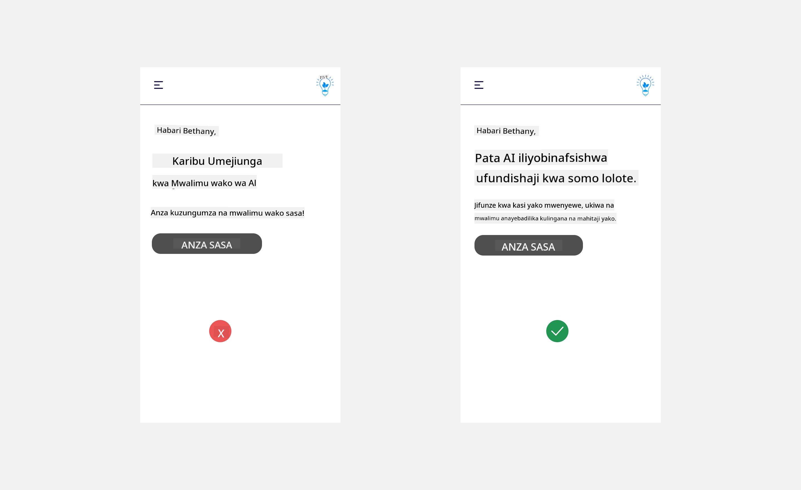

<!--
CO_OP_TRANSLATOR_METADATA:
{
  "original_hash": "ec385b41ee50579025d50cc03bfb3a25",
  "translation_date": "2025-07-09T15:02:44+00:00",
  "source_file": "12-designing-ux-for-ai-applications/README.md",
  "language_code": "sw"
}
-->
# Kubuni UX kwa Programu za AI

> _(Bonyeza picha hapo juu kutazama video ya somo hili)_

Uzoefu wa mtumiaji ni sehemu muhimu sana katika kujenga programu. Watumiaji wanahitaji kuwa na uwezo wa kutumia programu yako kwa njia bora ili kutekeleza kazi. Kuwa na ufanisi ni jambo moja lakini pia unahitaji kubuni programu ambazo zinaweza kutumiwa na kila mtu, ili kuzifanya _kupatikana kwa wote_. Sura hii itazingatia eneo hili ili uweze kubuni programu ambayo watu wanaweza na wanataka kuitumia.

## Utangulizi

Uzoefu wa mtumiaji ni jinsi mtumiaji anavyoshirikiana na kutumia bidhaa au huduma fulani iwe ni mfumo, chombo, au muundo. Wakati wa kuendeleza programu za AI, waendelezaji hawazingatii tu kuhakikisha uzoefu wa mtumiaji ni mzuri bali pia wa maadili. Katika somo hili, tunazungumzia jinsi ya kujenga Programu za Akili Bandia (AI) zinazokidhi mahitaji ya watumiaji.

Somo litashughulikia maeneo yafuatayo:

- Utangulizi wa Uzoefu wa Mtumiaji na Kuelewa Mahitaji ya Mtumiaji
- Kubuni Programu za AI kwa Ajili ya Uaminifu na Uwajibikaji
- Kubuni Programu za AI kwa Ajili ya Ushirikiano na Maoni

## Malengo ya Kujifunza

Baada ya kuchukua somo hili, utaweza:

- Kuelewa jinsi ya kujenga programu za AI zinazokidhi mahitaji ya mtumiaji.
- Kubuni programu za AI zinazokuza uaminifu na ushirikiano.

### Sharti la Awali

Chukua muda na soma zaidi kuhusu [uzoefu wa mtumiaji na fikra za kubuni.](https://learn.microsoft.com/training/modules/ux-design?WT.mc_id=academic-105485-koreyst)

## Utangulizi wa Uzoefu wa Mtumiaji na Kuelewa Mahitaji ya Mtumiaji

Katika kampuni yetu ya elimu ya kubuniwa, tuna watumiaji wakuu wawili, walimu na wanafunzi. Kila mtumiaji ana mahitaji yake ya kipekee. Ubunifu unaomzingatia mtumiaji huweka mtumiaji mbele kuhakikisha bidhaa ni muhimu na zina manufaa kwa wale walizokusudiwa.

Programu inapaswa kuwa **inayofaa, ya kuaminika, inayopatikana kwa wote na yenye kufurahisha** ili kutoa uzoefu mzuri wa mtumiaji.

### Urahisi wa Matumizi

Kuwa na manufaa inamaanisha programu ina kazi zinazolingana na madhumuni yake, kama vile kuendesha mchakato wa alama kiotomatiki au kutengeneza kadi za maswali kwa ajili ya marejeleo. Programu inayofanya alama kiotomatiki inapaswa kuwa na uwezo wa kutoa alama kwa usahihi na kwa ufanisi kwa kazi za wanafunzi kulingana na vigezo vilivyowekwa. Vivyo hivyo, programu inayotengeneza kadi za maswali inapaswa kuweza kuunda maswali yanayofaa na tofauti kulingana na data yake.

### Uaminifu

Kuwa wa kuaminika inamaanisha programu inaweza kutekeleza kazi yake kwa uthabiti na bila makosa. Hata hivyo, AI kama binadamu si kamilifu na inaweza kufanya makosa. Programu zinaweza kukumbana na makosa au hali zisizotarajiwa zinazohitaji usaidizi wa binadamu au marekebisho. Je, unashughulikiaje makosa? Katika sehemu ya mwisho ya somo hili, tutazungumzia jinsi mifumo na programu za AI zinavyobuniwa kwa ajili ya ushirikiano na maoni.

### Upatikanaji

Kuwa na upatikanaji inamaanisha kupanua uzoefu wa mtumiaji kwa watumiaji wenye uwezo tofauti, ikiwa ni pamoja na wale wenye ulemavu, kuhakikisha hakuna mtu anayebaki nje. Kwa kufuata miongozo na kanuni za upatikanaji, suluhisho za AI zinakuwa jumuishi zaidi, rahisi kutumia, na zenye manufaa kwa watumiaji wote.

### Kufurahisha

Kuwa na kufurahisha inamaanisha programu ni ya kufurahisha kutumia. Uzoefu mzuri wa mtumiaji unaweza kuwa na athari chanya kwa mtumiaji na kumhamasisha kurudi kwenye programu na kuongeza mapato ya biashara.

Sio kila changamoto inaweza kutatuliwa kwa AI. AI huja kusaidia uzoefu wako wa mtumiaji, iwe ni kwa kuendesha kazi za mikono kiotomatiki, au kubinafsisha uzoefu wa mtumiaji.

## Kubuni Programu za AI kwa Ajili ya Uaminifu na Uwajibikaji

Kujenga uaminifu ni muhimu wakati wa kubuni programu za AI. Uaminifu huhakikisha mtumiaji ana imani kuwa programu itakamilisha kazi, kutoa matokeo kwa uthabiti na matokeo ni yale mtumiaji anayotaka. Hatari katika eneo hili ni kutoaminiana na kuamini kupita kiasi. Kutoaminiana hutokea mtumiaji akiwa na imani kidogo au hana imani kabisa na mfumo wa AI, jambo linalosababisha mtumiaji kukataa programu yako. Kuamini kupita kiasi hutokea mtumiaji anapovizia uwezo wa mfumo wa AI, na kusababisha watumiaji kuamini sana mfumo wa AI. Kwa mfano, mfumo wa alama kiotomatiki katika hali ya kuamini kupita kiasi unaweza kusababisha mwalimu kutokukagua baadhi ya karatasi kuhakikisha mfumo wa alama unafanya kazi vizuri. Hii inaweza kusababisha alama zisizo za haki au zisizo sahihi kwa wanafunzi, au kupoteza fursa za maoni na maboresho.

Njia mbili za kuhakikisha uaminifu unawekwa katikati ya muundo ni ufafanuzi na udhibiti.

### Ufafanuzi

Wakati AI inasaidia kutoa maamuzi kama vile kufundisha maarifa kwa vizazi vijavyo, ni muhimu kwa walimu na wazazi kuelewa jinsi maamuzi ya AI yanavyofanywa. Hii ni ufafanuzi - kuelewa jinsi programu za AI zinavyofanya maamuzi. Kubuni kwa ajili ya ufafanuzi kunajumuisha kuongeza maelezo ya mifano ya kile programu ya AI inaweza kufanya. Kwa mfano, badala ya "Anza na mwalimu wa AI", mfumo unaweza kutumia: "Fupisha maelezo yako kwa ajili ya marejeleo rahisi kwa kutumia AI."

Mfano mwingine ni jinsi AI inavyotumia data za mtumiaji na binafsi. Kwa mfano, mtumiaji mwenye persona ya mwanafunzi anaweza kuwa na vikwazo kulingana na persona yake. AI inaweza isiweze kufichua majibu ya maswali lakini inaweza kusaidia kumwelekeza mtumiaji kufikiria jinsi ya kutatua tatizo.

Sehemu nyingine muhimu ya ufafanuzi ni kurahisisha maelezo. Wanafunzi na walimu huenda si wataalamu wa AI, kwa hivyo maelezo ya kile programu inaweza au haiwezi kufanya yanapaswa kuwa rahisi na kueleweka kwa urahisi.

### Udhibiti

AI ya kizazi huunda ushirikiano kati ya AI na mtumiaji, ambapo kwa mfano mtumiaji anaweza kubadilisha maelekezo kwa matokeo tofauti. Zaidi ya hayo, mara baada ya matokeo kutolewa, watumiaji wanapaswa kuwa na uwezo wa kubadilisha matokeo na hivyo kupata hisia ya udhibiti. Kwa mfano, unapotumia Bing, unaweza kubinafsisha maelekezo yako kulingana na muundo, sauti na urefu. Zaidi ya hayo, unaweza kuongeza mabadiliko kwenye matokeo na kuyarekebisha kama inavyoonyeshwa hapa chini:

Sifa nyingine katika Bing inayomruhusu mtumiaji kudhibiti programu ni uwezo wa kuchagua kuingia au kutoka kwenye ukusanyaji wa data zinazotumiwa na AI. Kwa programu ya shule, mwanafunzi anaweza kutaka kutumia maelezo yake pamoja na rasilimali za walimu kama vifaa vya marejeleo.

> Wakati wa kubuni programu za AI, nia ni muhimu kuhakikisha watumiaji hawamwamini AI kupita kiasi na kuweka matarajio yasiyo halisi ya uwezo wake. Njia moja ya kufanya hivyo ni kwa kuleta ugumu kati ya maelekezo na matokeo. Kumbusha mtumiaji, kwamba hii ni AI na si binadamu mwenzako.

## Kubuni Programu za AI kwa Ushirikiano na Maoni

Kama ilivyotajwa awali, AI ya kizazi huunda ushirikiano kati ya mtumiaji na AI. Mwingi wa mwingiliano ni mtumiaji kuingiza maelekezo na AI kutoa matokeo. Je, matokeo ni makosa? Programu inashughulikiaje makosa yanapotokea? AI inamkashifu mtumiaji au inachukua muda kuelezea kosa?

Programu za AI zinapaswa kujengwa kupokea na kutoa maoni. Hii si tu husaidia mfumo wa AI kuboresha bali pia hujenga uaminifu na watumiaji. Mzunguko wa maoni unapaswa kujumuishwa katika muundo, mfano unaweza kuwa kidole gumba juu au chini kwa matokeo.

Njia nyingine ya kushughulikia hili ni kuwasilisha wazi uwezo na vikwazo vya mfumo. Wakati mtumiaji anafanya kosa kuomba kitu zaidi ya uwezo wa AI, pia inapaswa kuwepo njia ya kushughulikia hili, kama inavyoonyeshwa hapa chini.

Makosa ya mfumo ni ya kawaida katika programu ambapo mtumiaji anaweza kuhitaji msaada wa taarifa nje ya uwezo wa AI au programu inaweza kuwa na kikomo cha maswali/masomo ambayo mtumiaji anaweza kutengeneza muhtasari. Kwa mfano, programu ya AI iliyofunzwa kwa data ya masomo machache kama Historia na Hisabati inaweza isishughulikie maswali kuhusu Jiografia. Ili kupunguza hili, mfumo wa AI unaweza kutoa jibu kama: "Samahani, bidhaa yetu imetengenezwa kwa data ya masomo yafuatayo....., siwezi kujibu swali uliloomba."

Programu za AI si kamilifu, kwa hivyo zitafanya makosa. Wakati wa kubuni programu zako, hakikisha unaweka nafasi ya maoni kutoka kwa watumiaji na usimamizi wa makosa kwa njia rahisi na inayoweza kueleweka kwa urahisi.

## Kazi ya Nyumbani

Chukua programu yoyote za AI ulizojenga hadi sasa, fikiria kutekeleza hatua zifuatazo katika programu yako:

- **Kufurahisha:** Fikiria jinsi unavyoweza kufanya programu yako iwe ya kufurahisha zaidi. Je, unaongeza maelezo kila mahali? Je, unahamasisha mtumiaji kuchunguza? Unavyosema vipi ujumbe wa makosa?

- **Urahisi wa Matumizi:** Kujenga programu ya wavuti. Hakikisha programu yako inaweza kuvinjariwa kwa panya na kibodi.

- **Uaminifu na Uwajibikaji:** Usiamini AI kabisa na matokeo yake, fikiria jinsi unavyoweza kuongeza mtu katika mchakato wa kuthibitisha matokeo. Pia, fikiria na utekeleze njia nyingine za kufanikisha uaminifu na uwajibikaji.

- **Udhibiti:** Mpe mtumiaji udhibiti wa data wanazotoa kwa programu. Tekeleza njia ambayo mtumiaji anaweza kuchagua kuingia au kutoka kwenye ukusanyaji wa data katika programu ya AI.

## Endelea Kujifunza!

Baada ya kumaliza somo hili, tembelea [Mkusanyiko wa Kujifunza AI ya Kizazi](https://aka.ms/genai-collection?WT.mc_id=academic-105485-koreyst) ili kuendelea kuongeza ujuzi wako wa AI ya Kizazi!

Nenda kwenye Somo la 13, ambapo tutaangalia jinsi ya [kusalama programu za AI](../13-securing-ai-applications/README.md?WT.mc_id=academic-105485-koreyst)!

**Kiarifu cha Kutotegemea**:  
Hati hii imetafsiriwa kwa kutumia huduma ya tafsiri ya AI [Co-op Translator](https://github.com/Azure/co-op-translator). Ingawa tunajitahidi kwa usahihi, tafadhali fahamu kuwa tafsiri za kiotomatiki zinaweza kuwa na makosa au upungufu wa usahihi. Hati ya asili katika lugha yake ya asili inapaswa kuchukuliwa kama chanzo cha mamlaka. Kwa taarifa muhimu, tafsiri ya kitaalamu inayofanywa na binadamu inapendekezwa. Hatubebei dhamana kwa kutoelewana au tafsiri potofu zinazotokana na matumizi ya tafsiri hii.