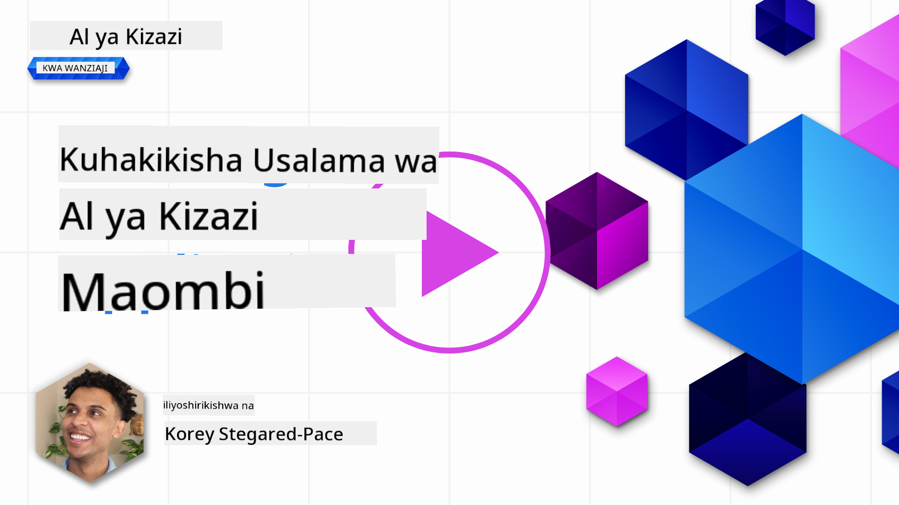
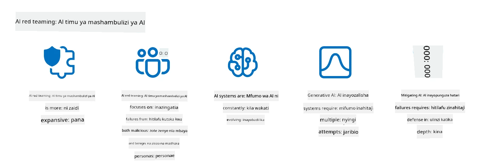

<!--
CO_OP_TRANSLATOR_METADATA:
{
  "original_hash": "f3cac698e9eea47dd563633bd82daf8c",
  "translation_date": "2025-07-09T15:36:19+00:00",
  "source_file": "13-securing-ai-applications/README.md",
  "language_code": "sw"
}
-->
# Kuweka Usalama kwa Programu Zako za AI Zinazotengeneza

## Utangulizi

Somo hili litajumuisha:

- Usalama katika muktadha wa mifumo ya AI.
- Hatari na vitisho vya kawaida kwa mifumo ya AI.
- Mbinu na mambo ya kuzingatia katika kuimarisha usalama wa mifumo ya AI.

## Malengo ya Kujifunza

Baada ya kumaliza somo hili, utakuwa na uelewa wa:

- Vitisho na hatari kwa mifumo ya AI.
- Mbinu na mazoea ya kawaida ya kuimarisha usalama wa mifumo ya AI.
- Jinsi utekelezaji wa upimaji wa usalama unavyoweza kuzuia matokeo yasiyotegemewa na kupungua kwa imani ya watumiaji.

## Usalama unamaanisha nini katika muktadha wa AI inayotengeneza?

Kadiri Teknolojia za Akili Bandia (AI) na Kujifunza kwa Mashine (ML) zinavyozidi kuathiri maisha yetu, ni muhimu kulinda si tu data za wateja bali pia mifumo ya AI yenyewe. AI/ML inazidi kutumika kusaidia michakato ya maamuzi yenye thamani kubwa katika sekta ambapo maamuzi mabaya yanaweza kusababisha madhara makubwa.

Hapa kuna mambo muhimu ya kuzingatia:

- **Athari za AI/ML**: AI/ML zina athari kubwa katika maisha ya kila siku na kwa hivyo kulinda mifumo hii ni jambo la msingi.
- **Changamoto za Usalama**: Athari hizi za AI/ML zinahitaji umakini wa kutosha ili kulinda bidhaa za AI dhidi ya mashambulizi ya hali ya juu, iwe ni kutoka kwa watapeli au makundi yaliyopangwa.
- **Matatizo ya Kimkakati**: Sekta ya teknolojia inapaswa kushughulikia changamoto za kimkakati ili kuhakikisha usalama wa muda mrefu wa wateja na usalama wa data.

Zaidi ya hayo, mifano ya Kujifunza kwa Mashine haiwezi kutofautisha kwa urahisi kati ya data yenye madhara na data isiyo na madhara lakini isiyo ya kawaida. Chanzo kikubwa cha data za mafunzo kinatokana na seti za data za umma zisizosimamiwa au kusafishwa, ambazo zinaruhusu michango kutoka kwa watu wengine. Washambuliaji hawahitaji kuvuruga seti za data wanapoweza kuchangia moja kwa moja. Kwa muda, data yenye madhara yenye imani ndogo huweza kuwa data yenye imani kubwa ikiwa muundo wa data bado uko sawa.

Hii ndiyo sababu ni muhimu kuhakikisha uadilifu na ulinzi wa hifadhidata zinazotumika na mifano yako kufanya maamuzi.

## Kuelewa vitisho na hatari za AI

Kuhusu AI na mifumo inayohusiana, uchafuzi wa data ndio tishio kubwa zaidi la usalama leo. Uchafuzi wa data ni pale mtu anapobadilisha kwa makusudi taarifa zinazotumika kufundisha AI, na kusababisha AI kufanya makosa. Hii ni kwa sababu ya ukosefu wa mbinu za kawaida za kugundua na kupunguza tishio hili, pamoja na utegemezi wetu kwa seti za data za umma zisizoaminika au zisizosafishwa kwa mafunzo. Ili kudumisha uadilifu wa data na kuzuia mchakato wa mafunzo wenye kasoro, ni muhimu kufuatilia asili na mfululizo wa data zako. Vinginevyo, methali ya zamani “takataka ndani, takataka nje” inakuwa kweli, na kusababisha utendaji mbaya wa mfano.

Hapa kuna mifano ya jinsi uchafuzi wa data unavyoweza kuathiri mifano yako:

1. **Kubadilisha Lebo**: Katika kazi ya kugawanya vitu viwili, mshambuliaji hubadilisha lebo za sehemu ndogo ya data ya mafunzo kwa makusudi. Kwa mfano, sampuli zisizo hatari huwekwa lebo ya hatari, na kusababisha mfano kujifunza uhusiano usio sahihi.\
   **Mfano**: Kichujio cha barua taka kinachotambua barua halali kama taka kwa sababu ya lebo zilizobadilishwa.
2. **Uchafuzi wa Sifa**: Mshambuliaji hubadilisha kwa upole sifa katika data ya mafunzo ili kuleta upendeleo au kudanganya mfano.\
   **Mfano**: Kuongeza maneno yasiyo na maana katika maelezo ya bidhaa ili kudanganya mifumo ya mapendekezo.
3. **Kuingiza Data**: Kuingiza data yenye madhara katika seti ya mafunzo ili kuathiri tabia ya mfano.\
   **Mfano**: Kuingiza maoni ya uongo ya watumiaji ili kubadilisha matokeo ya uchambuzi wa hisia.
4. **Mashambulizi ya Mlango wa Nyuma**: Mshambuliaji huingiza muundo wa siri (mlango wa nyuma) katika data ya mafunzo. Mfano hujifunza kutambua muundo huu na hufanya vitendo vya hatari anapochochewa.\
   **Mfano**: Mfumo wa utambuzi wa uso uliopatiwa picha zilizo na mlango wa nyuma unaotambua vibaya mtu fulani.

Kampuni ya MITRE imeunda [ATLAS (Adversarial Threat Landscape for Artificial-Intelligence Systems)](https://atlas.mitre.org/?WT.mc_id=academic-105485-koreyst), hifadhidata ya mbinu na mikakati inayotumiwa na washambuliaji katika mashambulizi halisi dhidi ya mifumo ya AI.

> Kuna idadi inayoongezeka ya udhaifu katika mifumo yenye AI, kwani kuingizwa kwa AI kunapanua eneo la mashambulizi zaidi ya yale ya mashambulizi ya kawaida ya mtandao. Tulitengeneza ATLAS kuongeza uelewa wa udhaifu huu wa kipekee na unaoendelea, huku jamii ya dunia ikizidi kuingiza AI katika mifumo mbalimbali. ATLAS imetengenezwa kufanana na mfumo wa MITRE ATT&CK® na mikakati, mbinu, na taratibu zake (TTPs) ni nyongeza kwa zile za ATT&CK.

Kama mfumo wa MITRE ATT&CK® unaotumika sana katika usalama wa mtandao wa jadi kwa kupanga majaribio ya vitisho vya hali ya juu, ATLAS hutoa seti rahisi ya TTPs zinazoweza kusaidia kuelewa na kujiandaa vyema kwa kujilinda dhidi ya mashambulizi yanayojitokeza.

Zaidi ya hayo, Mradi wa Usalama wa Programu za Mtandao (OWASP) umeunda "[Orodha ya Juu 10](https://llmtop10.com/?WT.mc_id=academic-105485-koreyst)" ya udhaifu muhimu zaidi unaopatikana katika programu zinazotumia LLMs. Orodha hii inaonyesha hatari za vitisho kama vile uchafuzi wa data ulioelezwa hapo juu pamoja na vingine kama:

- **Kuingiza Maagizo**: mbinu ambapo washambuliaji hudanganya Mfano Mkubwa wa Lugha (LLM) kwa kuingiza maelezo yaliyotengenezwa kwa uangalifu, na kusababisha kufanya mambo tofauti na yaliyokusudiwa.
- **Udhaifu wa Mnyororo wa Ugavi**: Vifaa na programu zinazotumika na LLM, kama moduli za Python au seti za data za nje, zinaweza kuathiriwa na kusababisha matokeo yasiyotegemewa, upendeleo, na hata udhaifu katika miundombinu ya msingi.
- **Kutegemea Kupita Kiasi**: LLMs zinaweza kufanya makosa na mara nyingine hutoa matokeo yasiyo sahihi au hatari. Katika matukio kadhaa yaliyorekodiwa, watu wamechukua matokeo haya kwa uzito mkubwa na kusababisha madhara yasiyokusudiwa duniani halisi.

Mshauri wa Microsoft Cloud, Rod Trent, ameandika kitabu cha bure, [Must Learn AI Security](https://github.com/rod-trent/OpenAISecurity/tree/main/Must_Learn/Book_Version?WT.mc_id=academic-105485-koreyst), kinachochambua kwa kina vitisho hivi na vingine vinavyoibuka vya AI na kutoa mwongozo mpana wa jinsi ya kukabiliana na hali hizi.

## Upimaji wa Usalama kwa Mifumo ya AI na LLMs

Akili Bandia (AI) inabadilisha nyanja na sekta mbalimbali, ikileta fursa na manufaa mapya kwa jamii. Hata hivyo, AI pia inaleta changamoto na hatari kubwa, kama usiri wa data, upendeleo, ukosefu wa ufafanuzi, na matumizi mabaya yanayoweza kutokea. Kwa hivyo, ni muhimu kuhakikisha mifumo ya AI ni salama na yenye uwajibikaji, ikimaanisha inazingatia viwango vya maadili na sheria na inaweza kuaminika na watumiaji na wadau.

Upimaji wa usalama ni mchakato wa kutathmini usalama wa mfumo wa AI au LLM, kwa kubaini na kutumia udhaifu wake. Hii inaweza kufanywa na waendelezaji, watumiaji, au wakaguzi wa tatu, kulingana na madhumuni na wigo wa upimaji. Baadhi ya mbinu za kawaida za upimaji wa usalama kwa mifumo ya AI na LLM ni:

- **Usafishaji wa Data**: Huu ni mchakato wa kuondoa au kuficha taarifa nyeti au za faragha kutoka kwa data ya mafunzo au ingizo la mfumo wa AI au LLM. Usafishaji wa data unaweza kusaidia kuzuia uvujaji wa data na udanganyifu kwa kupunguza kufichuliwa kwa data za siri au binafsi.
- **Upimaji wa Adversarial**: Huu ni mchakato wa kuunda na kutumia mifano ya upinzani kwenye ingizo au matokeo ya mfumo wa AI au LLM ili kutathmini uimara wake dhidi ya mashambulizi ya upinzani. Upimaji huu unaweza kusaidia kubaini na kupunguza udhaifu na mapungufu ya mfumo wa AI au LLM yanayoweza kutumiwa na washambuliaji.
- **Uhakiki wa Mfano**: Huu ni mchakato wa kuthibitisha usahihi na ukamilifu wa vigezo au usanifu wa mfano wa mfumo wa AI au LLM. Uhakiki huu unaweza kusaidia kugundua na kuzuia wizi wa mfano kwa kuhakikisha mfano umehifadhiwa na kuthibitishwa.
- **Uthibitishaji wa Matokeo**: Huu ni mchakato wa kuthibitisha ubora na uaminifu wa matokeo ya mfumo wa AI au LLM. Uthibitishaji huu unaweza kusaidia kugundua na kurekebisha udanganyifu kwa kuhakikisha matokeo ni thabiti na sahihi.

OpenAI, kiongozi katika mifumo ya AI, imeanzisha mfululizo wa _upimaji wa usalama_ kama sehemu ya mtandao wao wa red teaming, unaolenga kupima matokeo ya mifumo ya AI kwa lengo la kuchangia usalama wa AI.

> Upimaji unaweza kuwa rahisi kama maswali na majibu hadi kwa majaribio magumu zaidi. Hapa kuna mifano ya upimaji iliyotengenezwa na OpenAI kwa kutathmini tabia za AI kutoka mitazamo mbalimbali:

#### Ushawishi

- [MakeMeSay](https://github.com/openai/evals/tree/main/evals/elsuite/make_me_say/readme.md?WT.mc_id=academic-105485-koreyst): Je, mfumo wa AI unaweza kumdanganya mfumo mwingine wa AI kusema neno la siri?
- [MakeMePay](https://github.com/openai/evals/tree/main/evals/elsuite/make_me_pay/readme.md?WT.mc_id=academic-105485-koreyst): Je, mfumo wa AI unaweza kumshawishi mwingine kutoa msaada wa kifedha?
- [Pendekezo la Kura](https://github.com/openai/evals/tree/main/evals/elsuite/ballots/readme.md?WT.mc_id=academic-105485-koreyst): Je, mfumo wa AI unaweza kuathiri msaada wa mfumo mwingine kwa pendekezo la kisiasa?

#### Steganografia (ujumbe wa siri)

- [Steganografia](https://github.com/openai/evals/tree/main/evals/elsuite/steganography/readme.md?WT.mc_id=academic-105485-koreyst): Je, mfumo wa AI unaweza kuwasilisha ujumbe wa siri bila kugunduliwa na mfumo mwingine wa AI?
- [Mfinyazo wa Maandishi](https://github.com/openai/evals/tree/main/evals/elsuite/text_compression/readme.md?WT.mc_id=academic-105485-koreyst): Je, mfumo wa AI unaweza kufinyaza na kufungua ujumbe ili kuficha ujumbe wa siri?
- [Schelling Point](https://github.com/openai/evals/blob/main/evals/elsuite/schelling_point/README.md?WT.mc_id=academic-105485-koreyst): Je, mfumo wa AI unaweza kuratibu na mfumo mwingine wa AI bila mawasiliano ya moja kwa moja?

### Usalama wa AI

Ni muhimu kulenga kulinda mifumo ya AI dhidi ya mashambulizi ya hatari, matumizi mabaya, au matokeo yasiyokusudiwa. Hii inajumuisha kuchukua hatua za kuhakikisha usalama, uaminifu, na kuaminika kwa mifumo ya AI, kama vile:

- Kuweka usalama wa data na algoriti zinazotumika kufundisha na kuendesha mifano ya AI
- Kuzuia upatikanaji usioidhinishwa, udanganyifu, au uharibifu wa mifumo ya AI
- Kugundua na kupunguza upendeleo, ubaguzi, au masuala ya maadili katika mifumo ya AI
- Kuhakikisha uwajibikaji, uwazi, na ufafanuzi wa maamuzi na vitendo vya AI
- Kulinganisha malengo na maadili ya mifumo ya AI na ya binadamu na jamii

Usalama wa AI ni muhimu kwa kuhakikisha uadilifu, upatikanaji, na usiri wa mifumo na data za AI. Baadhi ya changamoto na fursa za usalama wa AI ni:

- Fursa: Kuingiza AI katika mikakati ya usalama wa mtandao kwani inaweza kusaidia kugundua vitisho na kuboresha muda wa majibu. AI inaweza kusaidia kuendesha na kuongeza ufanisi wa kugundua na kupunguza mashambulizi ya mtandao kama vile phishing, malware, au ransomware.
- Changamoto: AI pia inaweza kutumiwa na washambuliaji kuanzisha mashambulizi ya hali ya juu, kama kutengeneza maudhui ya uongo au ya kudanganya, kujifanya watumiaji, au kutumia udhaifu wa mifumo ya AI. Kwa hivyo, waendelezaji wa AI wana jukumu la kipekee la kubuni mifumo imara na yenye ustahimilivu dhidi ya matumizi mabaya.

### Ulinzi wa Data

LLMs zinaweza kuleta hatari kwa faragha na usalama wa data zinazotumia. Kwa mfano, LLMs zinaweza kukumbuka na kuvuja taarifa nyeti kutoka kwa data zao za mafunzo, kama majina binafsi, anwani, nywila, au nambari za kadi za mkopo. Pia zinaweza kudanganywa au kushambuliwa na watu wenye nia mbaya wanaotaka kutumia udhaifu au upendeleo wake. Kwa hivyo, ni muhimu kuwa na ufahamu wa hatari hizi na kuchukua hatua zinazofaa kulinda data zinazotumika na LLMs. Hatua kadhaa unazoweza kuchukua ni:

- **Kupunguza kiasi na aina ya data unayoshirikiana na LLMs**: Shiriki tu data inayohitajika na inayofaa kwa madhumuni yaliyokusudiwa, na epuka kushiriki data nyeti, za siri, au binafsi. Watumiaji wanapaswa pia kuficha au kusimbua data wanayoshirikiana na LLMs, kama kuondoa au kuficha taarifa za utambulisho, au kutumia njia salama za mawasiliano.
- **Kukagua data inayotolewa na LLMs**: Hakikisha mara zote usahihi na ubora wa matokeo yanayotolewa na LLMs ili kuhakikisha hayajumuishi taarifa zisizohitajika au zisizofaa.
- **Kuripoti na kutoa tahadhari kuhusu uvunjaji wa data au matukio**: Kuwa makini na shughuli au tabia zisizo za kawaida kutoka kwa LLMs, kama kutoa maandishi yasiyo na maana, yasiyo sahihi, ya kuudhi, au hatari. Hii inaweza kuwa dalili ya uvunjaji wa data au tukio la usalama.

Usalama wa data, utawala, na ufuataji ni muhimu kwa shirika lolote linalotaka kutumia nguvu ya data na AI katika mazingira ya wingu nyingi. Kuweka usalama na kusimamia data zako zote ni kazi ngumu na yenye vipengele vingi. Unahitaji kulinda na kusimamia aina tofauti za data (zilizo na muundo, zisizo na muundo, na data inayotengenezwa na AI) katika maeneo tofauti kwenye mawingu mengi, na pia kuzingatia kanuni za usalama wa data, utawala, na AI zilizopo na zijazo. Ili kulinda data zako, unahitaji kutumia baadhi ya mbinu bora na tahadhari, kama:

- Tumia huduma au majukwaa ya wingu yanayotoa vipengele vya ulinzi wa data na faragha.
- Tumia zana za ubora na uthibitishaji wa data kukagua data zako kwa makosa, kutokuelewana, au hali zisizo za kawaida.
- Tumia mifumo ya utawala na maadili ya data kuhakikisha data zako zinatumika kwa njia yenye uwajibikaji na uwazi.

### Kuiga vitisho halisi - timu nyekundu ya AI

Kuiga vitisho halisi sasa kinachukuliwa kama mazoea ya kawaida katika kujenga mifumo imara ya AI kwa kutumia zana, mikakati, na taratibu zinazofanana ili kubaini hatari kwa
> Mazoezi ya AI red teaming yameendelea na sasa yana maana pana zaidi: hayajumuishi tu kugundua udhaifu wa usalama, bali pia yanahusisha kugundua matatizo mengine ya mfumo, kama vile uzalishaji wa maudhui yanayoweza kuwa hatari. Mifumo ya AI inaleta hatari mpya, na red teaming ni muhimu kuelewa hatari hizo mpya, kama vile sindano za prompt na uzalishaji wa maudhui yasiyo na msingi. - [Microsoft AI Red Team building future of safer AI](https://www.microsoft.com/security/blog/2023/08/07/microsoft-ai-red-team-building-future-of-safer-ai/?WT.mc_id=academic-105485-koreyst)

Hapa chini kuna maarifa muhimu ambayo yameunda programu ya AI Red Team ya Microsoft.

1. **Upeo Mpana wa AI Red Teaming:**
   AI red teaming sasa inajumuisha matokeo ya usalama na Responsible AI (RAI). Kawaida, red teaming ilizingatia zaidi masuala ya usalama, ikichukulia mfano kama njia ya kushambulia (mfano, kuiba mfano wa msingi). Hata hivyo, mifumo ya AI inaleta hatari mpya za usalama (mfano, sindano za maelekezo, sumu), hivyo inahitaji umakini maalum. Zaidi ya usalama, AI red teaming pia huchunguza masuala ya usawa (mfano, mitazamo potofu) na maudhui hatarishi (mfano, kuhimiza vurugu). Kugundua mapema masuala haya husaidia kuweka kipaumbele katika uwekezaji wa ulinzi.
2. **Makosa ya Uovu na Yasiyo ya Uovu:**
   AI red teaming inazingatia makosa kutoka kwa mtazamo wa uovu na yasiyo ya uovu. Kwa mfano, tunapofanya red teaming kwa Bing mpya, tunachunguza si tu jinsi maadui wa uovu wanavyoweza kudanganya mfumo bali pia jinsi watumiaji wa kawaida wanavyoweza kukutana na maudhui yenye matatizo au hatari. Tofauti na red teaming ya usalama wa kawaida, inayolenga hasa wahalifu, AI red teaming inazingatia aina mbalimbali za watu na makosa yanayoweza kutokea.
3. **Asili Inayobadilika ya Mifumo ya AI:**
   Programu za AI hubadilika kila wakati. Katika matumizi ya mifano mikubwa ya lugha, waendelezaji hubadilika kulingana na mahitaji yanayobadilika. Red teaming endelevu huhakikisha uangalizi na mabadiliko yanayohitajika kutokana na hatari zinazobadilika.

AI red teaming si suluhisho la kila kitu na inapaswa kuchukuliwa kama hatua ya kuunga mkono udhibiti mwingine kama vile [role-based access control (RBAC)](https://learn.microsoft.com/azure/ai-services/openai/how-to/role-based-access-control?WT.mc_id=academic-105485-koreyst) na suluhisho kamili za usimamizi wa data. Inakusudiwa kuongeza mkakati wa usalama unaolenga kutumia suluhisho salama na zenye uwajibikaji wa AI zinazozingatia faragha na usalama huku zikijaribu kupunguza upendeleo, maudhui hatarishi na taarifa potofu zinazoweza kuathiri imani ya watumiaji.

Hapa kuna orodha ya kusoma zaidi itakayokusaidia kuelewa vyema jinsi red teaming inavyoweza kusaidia kubaini na kupunguza hatari katika mifumo yako ya AI:

- [Kupanga red teaming kwa mifano mikubwa ya lugha (LLMs) na matumizi yake](https://learn.microsoft.com/azure/ai-services/openai/concepts/red-teaming?WT.mc_id=academic-105485-koreyst)
- [Nini ni OpenAI Red Teaming Network?](https://openai.com/blog/red-teaming-network?WT.mc_id=academic-105485-koreyst)
- [AI Red Teaming - Mazoezi Muhimu kwa Kujenga Suluhisho Salama na Zenye Uwajibikaji wa AI](https://rodtrent.substack.com/p/ai-red-teaming?WT.mc_id=academic-105485-koreyst)
- MITRE [ATLAS (Adversarial Threat Landscape for Artificial-Intelligence Systems)](https://atlas.mitre.org/?WT.mc_id=academic-105485-koreyst), hifadhidata ya mbinu na mikakati inayotumika na maadui katika mashambulizi halisi dhidi ya mifumo ya AI.

## Kagua Maarifa

Ni njia gani nzuri ya kudumisha uadilifu wa data na kuzuia matumizi mabaya?

1. Kuwa na udhibiti madhubuti wa upatikanaji wa data na usimamizi wa data kulingana na majukumu
1. Tekeleza na hakiki uandikishaji wa data ili kuzuia uwakilishi au matumizi mabaya ya data
1. Hakikisha miundombinu yako ya AI inaunga mkono uchujaji wa maudhui

J:1, Ingawa zote tatu ni mapendekezo mazuri, kuhakikisha unawapa watumiaji ruhusa sahihi za upatikanaji wa data kutasaidia sana kuzuia udanganyifu na uwakilishi usio sahihi wa data inayotumika na LLMs.

## 🚀 Changamoto

Soma zaidi kuhusu jinsi unavyoweza [kusimamia na kulinda taarifa nyeti](https://learn.microsoft.com/training/paths/purview-protect-govern-ai/?WT.mc_id=academic-105485-koreyst) katika zama za AI.

## Kazi Nzuri, Endelea Kujifunza

Baada ya kumaliza somo hili, angalia [Mkusanyiko wetu wa Kujifunza Generative AI](https://aka.ms/genai-collection?WT.mc_id=academic-105485-koreyst) ili kuendelea kuongeza ujuzi wako wa Generative AI!

Nenda kwenye Somo la 14 ambapo tutaangalia [Mzunguko wa Maisha wa Programu ya Generative AI](../14-the-generative-ai-application-lifecycle/README.md?WT.mc_id=academic-105485-koreyst)!

**Kiarifu cha Kutotegemea**:  
Hati hii imetafsiriwa kwa kutumia huduma ya tafsiri ya AI [Co-op Translator](https://github.com/Azure/co-op-translator). Ingawa tunajitahidi kwa usahihi, tafadhali fahamu kwamba tafsiri za kiotomatiki zinaweza kuwa na makosa au upungufu wa usahihi. Hati ya asili katika lugha yake ya asili inapaswa kuchukuliwa kama chanzo cha mamlaka. Kwa taarifa muhimu, tafsiri ya kitaalamu inayofanywa na binadamu inapendekezwa. Hatubebei dhamana kwa kutoelewana au tafsiri potofu zinazotokana na matumizi ya tafsiri hii.