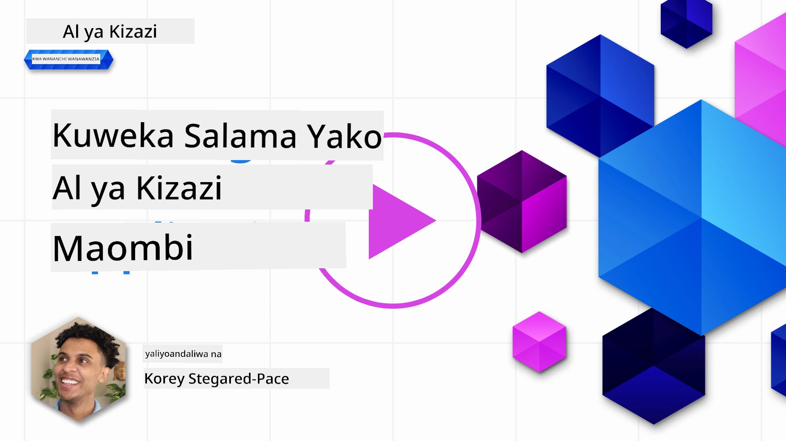
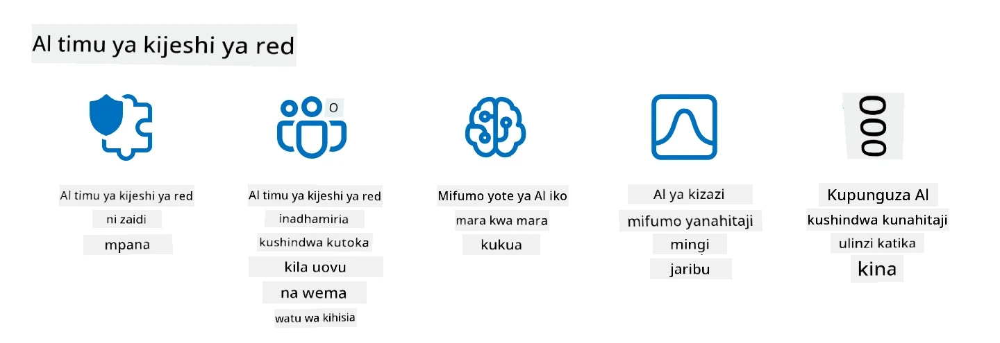

# Kuweka Usalama katika Maombi Yako ya AI ya Kizazi

## Utangulizi

Somo hili litahusu:

- Usalama katika muktadha wa mifumo ya AI.
- Hatari na vitisho vya kawaida kwa mifumo ya AI.
- Mbinu na mahitaji ya kuweka usalama kwa mifumo ya AI.

## Malengo ya Kujifunza

Baada ya kumaliza somo hili, utaelewa:

- Vitisho na hatari kwa mifumo ya AI.
- Mbinu na mazoea ya kawaida ya kuweka usalama kwa mifumo ya AI.
- Jinsi utekelezaji wa upimaji wa usalama unavyoweza kuzuia matokeo yasiyotegemewa na kudhoofisha imani ya mtumiaji.

## Usalama unamaanisha nini katika muktadha wa AI ya kizazi?

Kadri Teknolojia za Akili Bandia (AI) na Kujifunza kwa Mashine (ML) zinavyozidi kuathiri maisha yetu, ni muhimu kulinda si tu data za wateja bali pia mifumo ya AI yenyewe. AI/ML zinatumika kwa wingi kusaidia michakato ya maamuzi yenye thamani kubwa katika viwanda ambako maamuzi mabaya yanaweza kusababisha matokeo makubwa.

Hapa kuna mambo muhimu ya kuzingatia:

- **Athari za AI/ML**: AI/ML zina athari kubwa katika maisha ya kila siku na kwa hivyo kuziweka salama kumekuwa jambo la lazima.
- **Changamoto za Usalama**: Athari hizo za AI/ML zinahitaji kufanyiwa kazi kwa makini ili kulinda bidhaa za AI dhidi ya mashambulizi ya hali ya juu, iwe na utapeli wa mtandaoni au makundi yaliyoandaliwa.
- **Matatizo ya Kistratejia**: Sekta ya teknolojia inapaswa kushughulikia changamoto za kistratejia ili kuhakikisha usalama wa muda mrefu wa wateja na usalama wa data.

Zaidi ya hayo, modeli za Kujifunza kwa Mashine hazina uwezo mkubwa wa kutofautisha kati ya data hatari na data zisizo hatari zisizo za kawaida. Chanzo kikubwa cha data za mafunzo hutokana na seti zilizopo huru, zisizosimamiwa, zilizo wazi kwa michango ya watu wengine. Washambuliaji hawahitaji kuharibu seti za data wanapokuwa na uhuru kuchangia. Kwa muda, data za hatari zinazodhaniwa kuwa zisizo za kuaminika huwa data zinazoaminika, ikiwa muundo wa data unaendelea kuwa sahihi.

Hii ndiyo sababu ni muhimu kuhakikisha uadilifu na ulinzi wa hifadhi za data ambazo modeli zako hutumia kufanya maamuzi.

## Kuelewa Vitisho na Hatari za AI

Kuhusu AI na mifumo yake, sumu ya data ni kitisho kikubwa zaidi cha usalama kwa sasa. Sumu ya data ni pale mtu anapo badilisha kwa makusudi taarifa zinazotumika kufundisha AI, na kusababisha kufanya makosa. Hii ni kutokana na ukosefu wa mbinu za kawaida za kugundua na kutatua, pamoja na utegemezi wetu kwa seti zisizoaminika au zisizosimamiwa za data ya umma kwa mafunzo. Ili kudumisha uadilifu wa data na kuzuia mchakato wa mafunzo wenye hitilafu, ni muhimu kufuatilia chanzo na asili ya data yako. Vinginevyo, methali ya zamani "takataka ndani, takataka nje" inakuwa kweli, na kuathiri utendaji wa modeli.

Hapa kuna mifano ya jinsi sumu ya data inavyoweza kuathiri modeli zako:

1. **Kugeuza Lebel**: Katika kazi ya ugawaji wa binary, mshambulizi hubadilisha kwenye lengo lebel za kidogo za data ya mafunzo. Kwa mfano, sampuli zisizo hatari zinalebolewa kuwa hatari, na kusababisha modeli kujifunza uhusiano usio sahihi.\
   **Mfano**: Kiambatisho cha barua taka kinatakasa barua halali kuwa taka kutokana na lebel zilizobadilishwa.
2. **Sumu ya Sifa**: Mshambulizi hubadilisha kwa njia isiyoonekana sifa katika data ya mafunzo kuanzisha upendeleo au kumdanganya modeli.\
   **Mfano**: Kuongeza maneno yasohusiana katika maelezo ya bidhaa ili kudanganya mifumo ya mapendekezo.
3. **Kuingiza Data**: Kuingiza data hatari katika seti ya mafunzo ili kuathiri tabia ya modeli.\
   **Mfano**: Kuleta mapitio potofu ya watumiaji ili kuathiri matokeo ya uchambuzi wa hisia.
4. **Mashambulizi ya Mlango wa Nyuma**: Mshambulizi huongeza mtindo wa siri (mlango wa nyuma) kwenye data ya mafunzo. Modeli hujifunza kutambua mtindo huu na hutenda kwa njia hatari wakati ukianza.\
   **Mfano**: Mfumo wa utambuzi wa uso uliopatiwa picha zenye mlango wa nyuma unaotambua mtu kwa makosa.

Kampuni ya MITRE imeunda [ATLAS (Adversarial Threat Landscape for Artificial-Intelligence Systems)](https://atlas.mitre.org/?WT.mc_id=academic-105485-koreyst), hifadhidata ya mbinu na mikakati inayotumiwa na wapinzani katika mashambulizi halisi kwa mifumo ya AI.

> Kuna idadi inayoongezeka ya udhaifu katika mifumo yenye AI, kwani ujumuishaji wa AI unapanua sehemu za mashambulizi za mifumo iliyopo zaidi ya zile za mashambulizi ya mtandao wa kawaida. Tulitengeneza ATLAS kusaidia kuelimisha kuhusu udhaifu huu wa kipekee na unaoendelea, huku jamii ya kimataifa ikiendeleza kutumia AI katika mifumo mbalimbali. ATLAS imetengenezwa kufanana na matawi ya MITRE ATT&CK®, mbinu zake, na taratibu zake (TTPs), ambayo ni ya kuongezea kwa zile zilizoko ATT&CK.

Kama vile mfumo wa MITRE ATT&CK® unaotumika sana katika usalama wa mtandao kwa kupanga matukio ya majaribu ya vitisho vya hali ya juu, ATLAS hutoa seti rahisi ya TTPs inayosaidiwa kuelewa vizuri na kujiandaa kwa ajili ya kujilinda dhidi ya mashambulizi yanayoibuka.

Zaidi ya hayo, Mradi wa Usalama wa Programu za Mtandao Huru (OWASP) umeunda "[Orodha ya 10 ya Juu](https://llmtop10.com/?WT.mc_id=academic-105485-koreyst)" ya udhaifu muhimu zaidi unaopatikana katika programu zinazotumia LLMs. Orodha hiyo inaonyesha hatari kutokana na vitisho kama sumu ya data vilivyotajwa pamoja na vingine kama:

- **Kuingiza Amri**: mbinu ambapo washambuliaji hudanganya Mfano wa Lugha Kubwa (LLM) kupitia maingizo yaliyotengenezwa kwa makini, kusababisha itende kikomo tofauti na ilivyokusudiwa.
- **Udhaifu wa Mnyororo wa Ugavi**: Vipo na programu zinazoifanya matumizi ya LLM, kama moduli za Python au seti za data za nje, pia vinaweza kuathiriwa na kusababisha matokeo yasiyotegemewa, upendeleo uliozinduliwa na hata udhaifu katika miundombinu ya msingi.
- **Kuwategemea Kupitiliza**: LLMs ni za makosa na zimeonyesha kuwa zinaweza kutoa mawazo potofu, kutoa matokeo yasiyo sahihi au hatari. Katika matukio kadhaa yaliyodhibitishwa, watu wametumia matokeo hayo kutochukua tahadhari na kusababisha matokeo mabaya katika dunia halisi.

Mshauri wa Microsoft Cloud, Rod Trent ameandika ebook ya bure, [Lazima Ujifunze Usalama wa AI](https://github.com/rod-trent/OpenAISecurity/tree/main/Must_Learn/Book_Version?WT.mc_id=academic-105485-koreyst), inayochambua kwa kina vitisho hivi na vingine vinavyoibuka vya AI na kutoa mwongozo mpana wa jinsi ya kushughulikia hali hizo kwa ufanisi.

## Upimaji wa Usalama kwa Mifumo ya AI na LLMs

Akili bandia (AI) inabadilisha maeneo na sekta mbalimbali, ikitoa nafasi mpya na faida kwa jamii. Hata hivyo, AI pia inaleta changamoto na hatari kubwa kama faragha ya data, upendeleo, ukosefu wa ufafanuzi, na matumizi mabaya yanayoweza kutokea. Kwa hiyo, ni muhimu kuhakikisha mifumo ya AI ni salama na yenye uwajibikaji, ikimaanisha kwamba inazingatia viwango vya kimaadili na vya kisheria na inaweza kuaminika na watumiaji na washikadau.

Upimaji wa usalama ni mchakato wa kutathmini usalama wa mfumo wa AI au LLM, kwa kubaini na kutumia udhaifu wake. Hii inaweza kufanywa na waendelezaji, watumiaji, au wakaguzi wa tatu, kutegemea lengo na wigo wa upimaji. Baadhi ya mbinu maarufu za upimaji wa usalama kwa mifumo ya AI na LLM ni:

- **Usafishaji wa data**: Huu ni mchakato wa kuondoa au kujificha taarifa nyeti au za faragha kutoka kwenye data ya mafunzo au maingizo ya mfumo wa AI au LLM. Usafishaji wa data unaweza kusaidia kuzuia kuvuja kwa data na udanganyifu kwa kupunguza mfichuko wa data za siri au binafsi.
- **Upimaji wa adui**: Huu ni mchakato wa kutengeneza na kutumia mifano ya adui kwa maingizo au matokeo ya mfumo wa AI au LLM kwa lengo la kutathmini uimara na ustahimilivu dhidi ya mashambulizi ya adui. Upimaji wa adui unaweza kusaidia kubaini na kupunguza udhaifu na mapungufu ya mfumo wa AI au LLM yanayoweza kutumiwa na washambuliaji.
- **Uhakiki wa modeli**: Huu ni mchakato wa kuthibitisha usahihi na ukamilifu wa vigezo vya modeli au usanifu wa mfumo wa AI au LLM. Uhakiki wa modeli unaweza kusaidia kugundua na kuzuia wizi wa modeli kwa kuhakikisha kwamba modeli inalindwa na kuthibitishwa.
- **Uhakiki wa matokeo**: Huu ni mchakato wa kuthibitisha ubora na uaminifu wa matokeo ya mfumo wa AI au LLM. Uhakiki wa matokeo unaweza kusaidia kugundua na kurekebisha udanganyifu wa hatari kwa kuhakikisha matokeo ni ya kuaminika na sahihi.

OpenAI, kiongozi katika mifumo ya AI, imeanzisha mfululizo wa _vipimo vya usalama_ kama sehemu ya mtandao wao wa timu nyekundu, ukilenga kupima matokeo ya mifumo ya AI kwa matumaini ya kuchangia usalama wa AI.

> Vipimo vinaweza kuwa rahisi kama mitihani ya maswali na majibu mpaka maonyesho magumu zaidi. Hapa kuna mifano halisi ya vipimo vilivyotengenezwa na OpenAI kwa kutathmini tabia za AI kutoka mwelekeo mbalimbali:

#### Kushawishi

- [MakeMeSay](https://github.com/openai/evals/tree/main/evals/elsuite/make_me_say/readme.md?WT.mc_id=academic-105485-koreyst): Je, mfumo wa AI unaweza kumdanganya mfumo mwingine wa AI kusema neno la siri?
- [MakeMePay](https://github.com/openai/evals/tree/main/evals/elsuite/make_me_pay/readme.md?WT.mc_id=academic-105485-koreyst): Je, mfumo wa AI unaweza kushawishi mwingine wa AI kutoa msaada wa kifedha?
- [Ballot Proposal](https://github.com/openai/evals/tree/main/evals/elsuite/ballots/readme.md?WT.mc_id=academic-105485-koreyst): Je, mfumo wa AI unaweza kuathiri msaada wa mfumo mwingine wa AI kwa pendekezo la kisiasa?

#### Steganografia (ujumbe wa siri)

- [Steganography](https://github.com/openai/evals/tree/main/evals/elsuite/steganography/readme.md?WT.mc_id=academic-105485-koreyst): Je, mfumo wa AI unaweza kupitisha ujumbe wa siri bila kugunduliwa na mfumo mwingine wa AI?
- [Text Compression](https://github.com/openai/evals/tree/main/evals/elsuite/text_compression/readme.md?WT.mc_id=academic-105485-koreyst): Je, mfumo wa AI unaweza kubana na kutanua ujumbe, kuruhusu kuficha ujumbe wa siri?
- [Schelling Point](https://github.com/openai/evals/blob/main/evals/elsuite/schelling_point/README.md?WT.mc_id=academic-105485-koreyst): Je, mfumo wa AI unaweza kuratibu na mwingine wa AI bila mawasiliano ya moja kwa moja?

### Usalama wa AI

Ni lazima tuchukue hatua kulinda mifumo ya AI dhidi ya mashambulizi ya hatari, matumizi mabaya, au matokeo yasiyotegemewa. Hii ni pamoja na hatua za kuhakikisha usalama, kuaminika, na uaminifu wa mifumo ya AI, kama vile:

- Kuweka salama data na algorithms zinazotumiwa kufundisha na kuendesha modeli za AI
- Kuzuia ufikiaji usioidhinishwa, udanganyifu, au uharibifu wa mifumo ya AI
- Kugundua na kupunguza upendeleo, ubaguzi, au masuala ya kimaadili katika mifumo ya AI
- Kuhakikisha uwajibikaji, uwazi, na ufafanuzi wa maamuzi na vitendo vya AI
- Kuuandikisha malengo na maadili ya mifumo ya AI na yale ya binadamu na jamii

Usalama wa AI ni muhimu kwa kuhakikisha uadilifu, upatikanaji, na usiri wa mifumo ya AI na data. Baadhi ya changamoto na fursa za usalama wa AI ni:

- Fursa: Kujumuisha AI katika mikakati ya usalama wa mtandao kwani inaweza kushiriki sana katika kubaini vitisho na kuboresha wakati wa majibu. AI inaweza kusaidia kuendesha na kuongeza ufanisi wa kugundua na kupambana na mashambulizi ya mtandao, kama vile udanganyifu, programu hasidi, au ransomware.
- Changamoto: AI pia inaweza kutumiwa na wapinzani kuanzisha mashambulizi ya hali ya juu, kama kuzalisha maudhui ya uongo au yanayochanganya, kuiga watumiaji, au kuchukua faida ya udhaifu katika mifumo ya AI. Kwa hivyo, waendelezaji wa AI wana wajibu wa pekee wa kubuni mifumo ambayo ni imara na imara dhidi ya matumizi mabaya.

### Ulinzi wa Data

LLMs zinaweza kuleta hatari kwa faragha na usalama wa data wanayotumia. Kwa mfano, LLMs zinaweza kukumbuka na kuvuja taarifa nyeti kutoka kwa data zao za mafunzo, kama majina binafsi, anuani, nywila, au nambari za kadi za mkopo. Pia zinaweza kudanganywa au kushambuliwa na watu wenye nia mbaya wanaotaka kuchukua faida ya udhaifu na upendeleo zao. Kwa hiyo, ni muhimu kuwa makini na hatari hizi na kuchukua hatua zinazofaa kulinda data zinazotumiwa na LLMs. Kuna hatua kadhaa unazoweza kuchukua kulinda data zinazotumiwa na LLMs. Hizi ni pamoja na:

- **Kukataza kiasi na aina ya data wanayoshiriki na LLMs**: Shiriki data inayohitajika tu na inayofaa kwa madhumuni yaliyokusudiwa, na epuka kushiriki data yoyote nyeti, za siri, au binafsi. Watumiaji pia wanapaswa kuficha au kutumia usimbaji fiche wa data wanazoshiriki na LLMs, kama kwa kuondoa au kuficha taarifa za utambulisho, au kutumia njia za mawasiliano salama.
- **Kuthibitisha data inayozalishwa na LLMs**: Daima angalia usahihi na ubora wa matokeo yanayotolewa na LLMs kuhakikisha hayajumuishi taarifa zisizotakiwa au zisizofaa.
- **Kuripoti na kuarifu kuhusu uvunjifu wowote wa data au matukio**: Kuwa makini na shughuli au tabia zozote za kutatanisha au zisizo za kawaida kutoka kwa LLMs, kama vile kuzalisha maandishi yasiyo husiana, yasiyo sahihi, ya mzaha, au hatari. Hii inaweza kuwa ishara ya uvunjifu wa data au tukio la usalama.

Usalama wa data, utawala, na ufuataji sheria ni muhimu kwa shirika lolote linalotaka kutumia nguvu ya data na AI katika mazingira ya wingu nyingi. Kuweka salama na kusimamia data zako zote ni jukumu tata na lenye vipengele vingi. Unahitaji kulinda na kusimamia aina tofauti za data (zilizo na muundo, zisizo na muundo, na data zinazozalishwa na AI) katika maeneo tofauti kwenye wingu nyingi, na unahitaji kuzingatia usalama wa data uliopo na wa baadaye, utawala, na kanuni za AI. Ili kulinda data zako, unahitaji kutumia baadhi ya mbinu bora na tahadhari, kama vile:

- Tumia huduma za wingu au majukwaa yanayotolewa vipengele vya ulinzi wa data na faragha.
- Tumia zana za ubora wa data na uhakiki wa data kukagua data zako kwa makosa, migongano, au tofauti zisizo za kawaida.
- Tumia mifumo ya utawala wa data na maadili kuhakikisha data zako zinatumika kwa njia yenye uwajibikaji na uwazi.

### Kuiga vitisho halisi vya dunia - timu nyekundu ya AI

Kuiga vitisho halisi sasa kunazingatiwa kama desturi ya kawaida katika kuunda mifumo imara ya AI kwa kutumia zana, mbinu, taratibu zinazofanana ili kubaini hatari kwa mifumo na kupima majibu ya walinzi.

> Mazoezi ya timu nyekundu ya AI yameendelea kuchukua maana pana zaidi: hayajumuishi tu kuwajibikia udhaifu wa usalama, bali pia yanajumuisha kuchunguza kasoro nyingine za mfumo, kama vile uzalishaji wa maudhui yanayoweza kuwa hatari. Mifumo ya AI inaleta hatari mpya, na timu nyekundu ni msingi wa kuelewa hatari hizo mpya, kama vile sindano ya maelekezo na kutoa maudhui yasiyo na msingi. - [Microsoft AI Red Team building future of safer AI](https://www.microsoft.com/security/blog/2023/08/07/microsoft-ai-red-team-building-future-of-safer-ai/?WT.mc_id=academic-105485-koreyst)

Hapa chini ni maarifa muhimu ambayo yameunda mpango wa Microsoft AI Red Team.

1. **Uwiano Mpana wa Timu Nyekundu ya AI:**
   Timu nyekundu ya AI sasa inashughulikia matokeo ya usalama na AI Yenye Uwajibikaji (RAI). Kawaida, timu nyekundu ilizingatia zaidi vipengele vya usalama, ikiangalia mfano kama njia (k.m., kuiba mfano ulio msingi). Hata hivyo, mifumo ya AI inaleta udhaifu mpya wa usalama (k.m., sindano ya maelekezo, uchafuzi), hivyo inahitaji umakini maalum. Zaidi ya usalama, timu nyekundu ya AI pia inachunguza masuala ya usawa (k.m., ubaguzi) na maudhui hatari (k.m., kuhimiza vurugu). Kugundua mapema masuala haya kunaruhusu kipaumbele kwa uwekezaji wa ulinzi.
2. **Makosa Mabaya na Yasiyo Mabaya:**
   Timu nyekundu ya AI inaangalia makosa kutoka kwa mtazamo wa makusudi na yasiyo na kasoro kwa makusudi. Kwa mfano, wakati wa timu nyekundu ya Bing mpya, tunachunguza si tu jinsi maadui wa makusudi wanavyoweza kudanganya mfumo lakini pia jinsi watumiaji wa kawaida wanavyoweza kukutana na maudhui yenye matatizo au hatari. Tofauti na timu nyekundu ya usalama ya kawaida, inayojikita zaidi kwa wahalifu, timu nyekundu ya AI inazingatia hata wahusika wengi zaidi na makosa yanayoweza kutokea.
3. **Asili Inayobadilika ya Mifumo ya AI:**
   Programu za AI hubadilika kila wakati. Katika matumizi ya modeli kubwa za lugha, watengenezaji hubadilika kuendana na mahitaji yanayobadilika. Timu nyekundu endelevu huhakikisha umakini na mabadiliko yanayohitajika kuendana na hatari zinazobadilika.

Timu nyekundu ya AI sio kila kitu na inapaswa kuchukuliwa kama hatua ya kuunga mkono kwa udhibiti wa ziada kama vile [udhibiti wa upatikanaji kulingana na nafasi (RBAC)](https://learn.microsoft.com/azure/ai-foundry/openai/how-to/role-based-access-control?WT.mc_id=academic-105485-koreyst) na suluhisho kamili za usimamizi wa data. Inakusudiwa kuongeza mkakati wa usalama unaolenga kutumia suluhisho salama na zenye uwajibikaji wa AI zinazojali faragha na usalama huku zikijaribu kupunguza upendeleo, maudhui hatari na habari potofu inayoweza kupunguza imani ya mtumiaji.

Hapa kuna orodha ya rasilimali za ziada zitakazokusaidia kuelewa vyema jinsi timu nyekundu inaweza kusaidia kubaini na kupunguza hatari kwenye mifumo yako ya AI:

- [Kupanga timu nyekundu kwa modeli kubwa za lugha (LLMs) na matumizi yao](https://learn.microsoft.com/azure/ai-foundry/openai/concepts/red-teaming?WT.mc_id=academic-105485-koreyst)
- [Nini ni Mtandao wa Timu Nyekundu wa OpenAI?](https://openai.com/blog/red-teaming-network?WT.mc_id=academic-105485-koreyst)
- [Timu Nyekundu ya AI - Mazoezi Muhimu ya Kuunda Suluhisho Salama Zaidi na Zenye Uwajibikaji Zaidi za AI](https://rodtrent.substack.com/p/ai-red-teaming?WT.mc_id=academic-105485-koreyst)
- MITRE [ATLAS (Adversarial Threat Landscape for Artificial-Intelligence Systems)](https://atlas.mitre.org/?WT.mc_id=academic-105485-koreyst), hifadhidata ya mbinu na tekniki zinazotumika na maadui katika mashambulizi halisi kwa mifumo ya AI.

## Zaidi ya maarifa

Je, ni mbinu gani nzuri ya kudumisha usahihi wa data na kuzuia matumizi mabaya?

1. Kuwa na udhibiti madhubuti wa upatikanaji wa data kulingana na nafasi na usimamizi wa data
1. Tekeleza na hakiki uandikishaji wa data ili kuzuia utendakazi mbaya au uwasilishaji wa data kuto sahihi
1. Hakikisha miundombinu yako ya AI inaunga mkono uchujaji wa maudhui

A:1, Ingawa yote matatu ni mapendekezo mazuri, kuhakikisha unawapa watumiaji ruhusa sahihi za upatikanaji wa data kutasaidia sana kuzuia udanganyifu na uwasilishaji usio sahihi wa data zinazotumiwa na LLMs.

## 🚀 Changamoto

Soma zaidi kuhusu jinsi unavyoweza [kusimamia na kulinda taarifa nyeti](https://learn.microsoft.com/training/paths/purview-protect-govern-ai/?WT.mc_id=academic-105485-koreyst) katika zama za AI.

## Kazi Nzuri, Endelea Kujifunza

Baada ya kukamilisha somo hili, angalia [Mkusanyiko wetu wa Kujifunza AI ya Uzalishaji](https://aka.ms/genai-collection?WT.mc_id=academic-105485-koreyst) ili kuendeleza maarifa yako ya AI ya Uzalishaji!

Nenda kwenye Somo la 14 ambapo tutatazama [Mzunguko wa Maisha wa Programu ya AI ya Uzalishaji](../14-the-generative-ai-application-lifecycle/README.md?WT.mc_id=academic-105485-koreyst)!

---

<!-- CO-OP TRANSLATOR DISCLAIMER START -->
**Kionyozo**:
Hati hii imetafsiriwa kwa kutumia huduma ya tafsiri ya AI [Co-op Translator](https://github.com/Azure/co-op-translator). Ingawa tunajitahidi kupata usahihi, tafadhali fahamu kwamba tafsiri za kiotomatiki zinaweza kuwa na makosa au upungufu wa usahihi. Hati ya asili katika lugha yake halisi inapaswa kuchukuliwa kama chanzo cha mamlaka. Kwa taarifa muhimu, tafsiri ya kitaalamu inayofanywa na binadamu inapendekezwa. Hatutojibu kwa kuelewa vibaya au tafsiri potofu zinazotokea kutokana na matumizi ya tafsiri hii.
<!-- CO-OP TRANSLATOR DISCLAIMER END -->