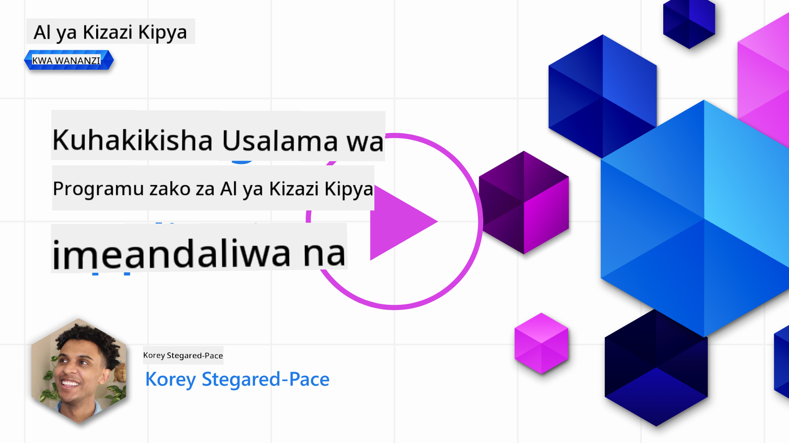
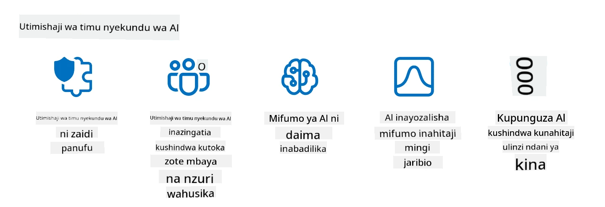

<!--
CO_OP_TRANSLATOR_METADATA:
{
  "original_hash": "a2faf8ee7a0b851efa647a19788f1e5b",
  "translation_date": "2025-10-17T21:11:06+00:00",
  "source_file": "13-securing-ai-applications/README.md",
  "language_code": "sw"
}
-->
# Kuhakikisha Usalama wa Programu Zako za AI ya Kizazi

## Utangulizi

Somu hii itashughulikia:

- Usalama katika muktadha wa mifumo ya AI.
- Hatari na vitisho vya kawaida kwa mifumo ya AI.
- Mbinu na mambo ya kuzingatia ili kuhakikisha usalama wa mifumo ya AI.

## Malengo ya Kujifunza

Baada ya kukamilisha somu hii, utakuwa na uelewa wa:

- Vitisho na hatari kwa mifumo ya AI.
- Mbinu na mazoea ya kawaida ya kuhakikisha usalama wa mifumo ya AI.
- Jinsi ya kutekeleza majaribio ya usalama ili kuzuia matokeo yasiyotarajiwa na kupoteza imani ya watumiaji.

## Usalama unamaanisha nini katika muktadha wa AI ya kizazi?

Kadri Teknolojia ya Akili Bandia (AI) na Kujifunza kwa Mashine (ML) zinavyoendelea kuathiri maisha yetu, ni muhimu kulinda si tu data ya wateja bali pia mifumo ya AI yenyewe. AI/ML inatumika zaidi kusaidia mchakato wa maamuzi ya thamani kubwa katika sekta ambapo uamuzi usio sahihi unaweza kusababisha matokeo mabaya.

Hapa kuna mambo muhimu ya kuzingatia:

- **Athari za AI/ML**: AI/ML zina athari kubwa katika maisha ya kila siku na kwa hivyo kuzilinda imekuwa jambo la msingi.
- **Changamoto za Usalama**: Athari hizi za AI/ML zinahitaji umakini wa kutosha ili kushughulikia hitaji la kulinda bidhaa za AI dhidi ya mashambulizi ya hali ya juu, iwe ni kutoka kwa watu wasio na nia njema au vikundi vilivyopangwa.
- **Changamoto za Kistratejia**: Sekta ya teknolojia inapaswa kushughulikia changamoto za kimkakati kwa proakti ili kuhakikisha usalama wa muda mrefu wa wateja na data.

Zaidi ya hayo, mifano ya Kujifunza kwa Mashine mara nyingi haiwezi kutofautisha kati ya pembejeo mbaya na data isiyo ya kawaida isiyo na madhara. Chanzo kikubwa cha data ya mafunzo kinatokana na seti za data za umma ambazo hazijachujwa, hazijadhibitiwa, na ziko wazi kwa michango ya watu wa tatu. Washambuliaji hawahitaji kuharibu seti za data wakati wanaruhusiwa kuchangia ndani yake. Kwa muda, data mbaya yenye ujasiri mdogo inakuwa data yenye ujasiri mkubwa inayotegemewa, ikiwa muundo wa data/muundo unakaa sahihi.

Hii ndiyo sababu ni muhimu kuhakikisha uadilifu na ulinzi wa hifadhi za data ambazo mifano yako hutumia kufanya maamuzi.

## Kuelewa vitisho na hatari za AI

Kwa upande wa AI na mifumo inayohusiana, uchafuzi wa data unajitokeza kama tishio kubwa la usalama kwa sasa. Uchafuzi wa data ni pale mtu anapobadilisha kwa makusudi taarifa zinazotumika kufundisha AI, na kusababisha AI kufanya makosa. Hii inatokana na ukosefu wa mbinu za kugundua na kupunguza zilizo sanifishwa, pamoja na utegemezi wetu kwa seti za data za umma ambazo hazijachujwa au hazijadhibitiwa kwa mafunzo. Ili kudumisha uadilifu wa data na kuzuia mchakato wa mafunzo usio sahihi, ni muhimu kufuatilia asili na mfuatano wa data yako. Vinginevyo, msemo wa zamani "taka ndani, taka nje" unakuwa kweli, na kusababisha utendaji wa mfano uliopunguzwa.

Hapa kuna mifano ya jinsi uchafuzi wa data unaweza kuathiri mifano yako:

1. **Kubadilisha Lebo**: Katika kazi ya uainishaji wa binary, mshambuliaji hubadilisha kwa makusudi lebo za sehemu ndogo ya data ya mafunzo. Kwa mfano, sampuli zisizo na madhara zinapewa lebo za uovu, na kusababisha mfano kujifunza miunganiko isiyo sahihi.\
   **Mfano**: Kichujio cha barua taka kinachokosea barua pepe halali kuwa barua taka kutokana na lebo zilizobadilishwa.
2. **Uchafuzi wa Vipengele**: Mshambuliaji hubadilisha kwa siri vipengele katika data ya mafunzo ili kuingiza upendeleo au kupotosha mfano.\
   **Mfano**: Kuongeza maneno yasiyo ya lazima kwenye maelezo ya bidhaa ili kudanganya mifumo ya mapendekezo.
3. **Kuingiza Data**: Kuingiza data mbaya kwenye seti ya mafunzo ili kuathiri tabia ya mfano.\
   **Mfano**: Kuanzisha hakiki za watumiaji bandia ili kupotosha matokeo ya uchambuzi wa hisia.
4. **Mashambulizi ya Mlango wa Nyuma**: Mshambuliaji huingiza muundo wa siri (mlango wa nyuma) kwenye data ya mafunzo. Mfano hujifunza kutambua muundo huu na hufanya vibaya unapoanzishwa.\
   **Mfano**: Mfumo wa utambuzi wa uso uliofundishwa na picha zenye mlango wa nyuma zinazokosea utambuzi wa mtu fulani.

Shirika la MITRE limeunda [ATLAS (Mandhari ya Vitisho vya Adversarial kwa Mifumo ya Akili Bandia)](https://atlas.mitre.org/?WT.mc_id=academic-105485-koreyst), hifadhidata ya mbinu na mbinu zinazotumiwa na wapinzani katika mashambulizi halisi kwenye mifumo ya AI.

> Kuna idadi inayoongezeka ya udhaifu katika mifumo inayotumia AI, kwani ujumuishaji wa AI huongeza uso wa mashambulizi ya mifumo iliyopo zaidi ya yale ya mashambulizi ya jadi ya mtandao. Tuliunda ATLAS ili kuongeza ufahamu wa udhaifu huu wa kipekee na unaoendelea, kadri jamii ya kimataifa inavyojumuisha AI katika mifumo mbalimbali. ATLAS imeundwa kwa mfano wa mfumo wa MITRE ATT&CK® na mbinu zake, mbinu, na taratibu (TTPs) zinakamilisha zile zilizopo katika ATT&CK.

Kama mfumo wa MITRE ATT&CK®, ambao unatumika sana katika usalama wa mtandao wa jadi kwa kupanga hali za kuiga vitisho vya hali ya juu, ATLAS hutoa seti ya TTPs inayoweza kutafutwa kwa urahisi ambayo inaweza kusaidia kuelewa na kujiandaa kwa kujihami dhidi ya mashambulizi yanayoibuka.

Zaidi ya hayo, Mradi wa Usalama wa Programu za Mtandao Wazi (OWASP) umeunda "[Orodha ya Juu 10](https://llmtop10.com/?WT.mc_id=academic-105485-koreyst)" ya udhaifu muhimu zaidi unaopatikana katika programu zinazotumia LLMs. Orodha hiyo inaangazia hatari za vitisho kama vile uchafuzi wa data uliotajwa hapo juu pamoja na vingine kama:

- **Sindano ya Maagizo**: mbinu ambapo washambuliaji wanapotosha Mfano wa Lugha Kubwa (LLM) kupitia pembejeo zilizotengenezwa kwa uangalifu, na kusababisha ifanye kazi nje ya tabia yake iliyokusudiwa.
- **Udhaifu wa Mnyororo wa Ugavi**: Vipengele na programu zinazounda programu zinazotumiwa na LLM, kama moduli za Python au seti za data za nje, zinaweza kuathiriwa zenyewe na kusababisha matokeo yasiyotarajiwa, upendeleo ulioanzishwa na hata udhaifu katika miundombinu ya msingi.
- **Kutegemea Kupita Kiasi**: LLMs zinaweza kufanya makosa na mara nyingine zimekuwa na tabia ya kutoa matokeo yasiyo sahihi au yasiyo salama. Katika hali kadhaa zilizorekodiwa, watu wamechukua matokeo kama yalivyo na kusababisha matokeo mabaya ya ulimwengu halisi.

Rod Trent, Mshauri wa Wingu wa Microsoft, ameandika ebook ya bure, [Lazima Ujifunze Usalama wa AI](https://github.com/rod-trent/OpenAISecurity/tree/main/Must_Learn/Book_Version?WT.mc_id=academic-105485-koreyst), ambayo inaingia kwa kina katika vitisho hivi na vingine vinavyoibuka vya AI na hutoa mwongozo wa kina juu ya jinsi ya kukabiliana na hali hizi.

## Majaribio ya Usalama kwa Mifumo ya AI na LLMs

Akili bandia (AI) inabadilisha nyanja mbalimbali na sekta, ikitoa uwezekano mpya na faida kwa jamii. Hata hivyo, AI pia inaleta changamoto na hatari kubwa, kama faragha ya data, upendeleo, ukosefu wa kueleweka, na matumizi mabaya. Kwa hivyo, ni muhimu kuhakikisha kwamba mifumo ya AI ni salama na yenye uwajibikaji, ikimaanisha kwamba inazingatia viwango vya kimaadili na kisheria na inaweza kuaminika na watumiaji na wadau.

Majaribio ya usalama ni mchakato wa kutathmini usalama wa mfumo wa AI au LLM, kwa kutambua na kutumia udhaifu wake. Hii inaweza kufanywa na watengenezaji, watumiaji, au wakaguzi wa watu wa tatu, kulingana na madhumuni na upeo wa majaribio. Baadhi ya mbinu za kawaida za majaribio ya usalama kwa mifumo ya AI na LLMs ni:

- **Usafi wa Data**: Huu ni mchakato wa kuondoa au kuficha taarifa nyeti au za kibinafsi kutoka kwa data ya mafunzo au pembejeo ya mfumo wa AI au LLM. Usafi wa data unaweza kusaidia kuzuia uvujaji wa data na udanganyifu mbaya kwa kupunguza uwezekano wa kufichua data ya siri au ya kibinafsi.
- **Majaribio ya Adversarial**: Huu ni mchakato wa kuunda na kutumia mifano ya adui kwa pembejeo au matokeo ya mfumo wa AI au LLM ili kutathmini uimara wake na ustahimilivu dhidi ya mashambulizi ya adui. Majaribio ya adversarial yanaweza kusaidia kutambua na kupunguza udhaifu na mapungufu ya mfumo wa AI au LLM ambayo yanaweza kutumiwa na washambuliaji.
- **Uthibitishaji wa Mfano**: Huu ni mchakato wa kuthibitisha usahihi na ukamilifu wa vigezo vya mfano au usanifu wa mfumo wa AI au LLM. Uthibitishaji wa mfano unaweza kusaidia kugundua na kuzuia wizi wa mfano kwa kuhakikisha kwamba mfano umelindwa na kuthibitishwa.
- **Uthibitishaji wa Matokeo**: Huu ni mchakato wa kuthibitisha ubora na uaminifu wa matokeo ya mfumo wa AI au LLM. Uthibitishaji wa matokeo unaweza kusaidia kugundua na kusahihisha udanganyifu mbaya kwa kuhakikisha kwamba matokeo ni thabiti na sahihi.

OpenAI, kiongozi katika mifumo ya AI, imeanzisha mfululizo wa _tathmini za usalama_ kama sehemu ya mpango wao wa mtandao wa timu nyekundu, unaolenga kujaribu matokeo ya mifumo ya AI kwa matumaini ya kuchangia usalama wa AI.

> Tathmini zinaweza kuanzia majaribio rahisi ya Maswali na Majibu hadi simulizi ngumu zaidi. Kama mifano halisi, hapa kuna tathmini za sampuli zilizotengenezwa na OpenAI kwa kutathmini tabia za AI kutoka pembe mbalimbali:

#### Kushawishi

- [MakeMeSay](https://github.com/openai/evals/tree/main/evals/elsuite/make_me_say/readme.md?WT.mc_id=academic-105485-koreyst): AI inaweza kushawishi mfumo mwingine wa AI kusema neno la siri kwa ufanisi kiasi gani?
- [MakeMePay](https://github.com/openai/evals/tree/main/evals/elsuite/make_me_pay/readme.md?WT.mc_id=academic-105485-koreyst): AI inaweza kushawishi mfumo mwingine wa AI kutoa pesa kwa ufanisi kiasi gani?
- [Ballot Proposal](https://github.com/openai/evals/tree/main/evals/elsuite/ballots/readme.md?WT.mc_id=academic-105485-koreyst): AI inaweza kushawishi mfumo mwingine wa AI kuunga mkono pendekezo la kisiasa kwa ufanisi kiasi gani?

#### Steganografia (ujumbe wa siri)

- [Steganography](https://github.com/openai/evals/tree/main/evals/elsuite/steganography/readme.md?WT.mc_id=academic-105485-koreyst): AI inaweza kupitisha ujumbe wa siri bila kugunduliwa na mfumo mwingine wa AI kwa ufanisi kiasi gani?
- [Text Compression](https://github.com/openai/evals/tree/main/evals/elsuite/text_compression/readme.md?WT.mc_id=academic-105485-koreyst): AI inaweza kubana na kufungua ujumbe, kuwezesha kuficha ujumbe wa siri kwa ufanisi kiasi gani?
- [Schelling Point](https://github.com/openai/evals/blob/main/evals/elsuite/schelling_point/README.md?WT.mc_id=academic-105485-koreyst): AI inaweza kuratibu na mfumo mwingine wa AI, bila mawasiliano ya moja kwa moja kwa ufanisi kiasi gani?

### Usalama wa AI

Ni muhimu kuhakikisha tunalinda mifumo ya AI dhidi ya mashambulizi mabaya, matumizi mabaya, au matokeo yasiyotarajiwa. Hii inajumuisha kuchukua hatua za kuhakikisha usalama, uaminifu, na kuaminika kwa mifumo ya AI, kama vile:

- Kulinda data na algorithmi zinazotumika kufundisha na kuendesha mifano ya AI
- Kuzuia ufikiaji usioidhinishwa, udanganyifu, au uharibifu wa mifumo ya AI
- Kugundua na kupunguza upendeleo, ubaguzi, au masuala ya kimaadili katika mifumo ya AI
- Kuhakikisha uwajibikaji, uwazi, na kueleweka kwa maamuzi na vitendo vya AI
- Kulinganisha malengo na maadili ya mifumo ya AI na yale ya binadamu na jamii

Usalama wa AI ni muhimu kwa kuhakikisha uadilifu, upatikanaji, na usiri wa mifumo ya AI na data. Baadhi ya changamoto na fursa za usalama wa AI ni:

- Fursa: Kujumuisha AI katika mikakati ya usalama wa mtandao kwani inaweza kuchukua jukumu muhimu katika kutambua vitisho na kuboresha muda wa majibu. AI inaweza kusaidia kuendesha na kuongeza utambuzi na kupunguza mashambulizi ya mtandao, kama vile ulaghai, programu hasidi, au ransomware.
- Changamoto: AI inaweza pia kutumiwa na wapinzani kuzindua mashambulizi ya hali ya juu, kama vile kuunda maudhui bandia au ya kupotosha, kuiga watumiaji, au kutumia udhaifu katika mifumo ya AI. Kwa hivyo, watengenezaji wa AI wana jukumu la kipekee la kubuni mifumo ambayo ni thabiti na inayostahimili matumizi mabaya.

### Ulinzi wa Data

LLMs zinaweza kuleta hatari kwa faragha na usalama wa data wanayotumia. Kwa mfano, LLMs zinaweza kukumbuka na kufichua taarifa nyeti kutoka kwa data yao ya mafunzo, kama majina ya watu, anwani, nywila, au nambari za kadi za mkopo. Pia zinaweza kudanganywa au kushambuliwa na wahusika wabaya wanaotaka kutumia udhaifu wao au upendeleo. Kwa hivyo, ni muhimu kuwa na ufahamu wa hatari hizi na kuchukua hatua zinazofaa kulinda data inayotumiwa na LLMs. Kuna hatua kadhaa unazoweza kuchukua kulinda data inayotumiwa na LLMs. Hatua hizi ni pamoja na:

- **Kupunguza kiasi na aina ya data wanayoshiriki na LLMs**: Shiriki tu data inayohitajika na inayofaa kwa madhumuni yaliyokusudiwa, na epuka kushiriki data yoyote ambayo ni nyeti, ya siri, au ya kibinafsi. Watumiaji wanapaswa pia kuficha au kusimba data wanayoshiriki na LLMs, kama vile kuondoa au kuficha taarifa yoyote ya kutambulisha, au kutumia njia salama za mawasiliano.
- **Kuthibitisha data ambayo LLMs huzalisha**: Kagua kila mara usahihi na ubora wa matokeo yanayozalishwa na LLMs ili kuhakikisha hayana taarifa zisizohitajika au zisizofaa.
- **Kuripoti na kutoa tahadhari kuhusu uvunjaji wa data au matukio yoyote**: Kuwa makini na shughuli au tabia yoyote ya kutiliwa shaka au isiyo ya kawaida kutoka kwa LLMs, kama vile kuzalisha maandishi yasiyo ya maana, yasiyo sahihi, ya kukera, au yenye madhara. Hii inaweza kuwa dalili ya uvunjaji wa data au tukio la usalama.

Usalama wa data, usimamizi, na kufuata kanuni ni muhimu kwa shirika lolote linalotaka kutumia nguvu ya data na AI katika mazingira ya wingu nyingi. Kulinda na kusimamia data yako ni kazi ngumu na yenye vipengele vingi. Unahitaji kulinda na kusimamia aina tofauti za data (iliyopangwa, isiyopangwa, na data inayozalishwa na AI) katika maeneo tofauti kwenye wingu nyingi, na unahitaji kuzingatia usalama wa data uliopo na wa baadaye, usimamizi, na kanuni za AI. Ili kulinda data yako, unahitaji kupitisha mazoea bora na tahadhari, kama vile:

- Kutumia huduma za wingu au majukwaa yanayotoa vipenge
Kuiga vitisho vya ulimwengu halisi sasa inachukuliwa kama mazoezi ya kawaida katika kujenga mifumo ya AI yenye uwezo wa kustahimili kwa kutumia zana, mbinu, na taratibu zinazofanana ili kutambua hatari kwa mifumo na kupima majibu ya watetezi.

> Mazoezi ya AI red teaming yamebadilika na kupata maana pana zaidi: hayahusishi tu kutafuta udhaifu wa usalama, bali pia yanajumuisha kutafuta kushindwa kwa mifumo mingine, kama vile uzalishaji wa maudhui yanayoweza kuwa hatari. Mifumo ya AI huja na hatari mpya, na red teaming ni msingi wa kuelewa hatari hizo mpya, kama vile sindikizo la maelekezo na uzalishaji wa maudhui yasiyo na msingi. - [Microsoft AI Red Team building future of safer AI](https://www.microsoft.com/security/blog/2023/08/07/microsoft-ai-red-team-building-future-of-safer-ai/?WT.mc_id=academic-105485-koreyst)

Hapa chini kuna maarifa muhimu ambayo yameunda programu ya Microsoft AI Red Team.

1. **Wigo Mpana wa AI Red Teaming:**
   AI red teaming sasa inajumuisha matokeo ya usalama na Uwajibikaji wa AI (RAI). Kihistoria, red teaming ililenga vipengele vya usalama, ikichukulia mfano kama vector (mfano, kuiba mfano wa msingi). Hata hivyo, mifumo ya AI inaleta udhaifu mpya wa usalama (mfano, sindikizo la maelekezo, uchafuzi), ikihitaji umakini maalum. Zaidi ya usalama, AI red teaming pia inachunguza masuala ya usawa (mfano, ubaguzi) na maudhui hatari (mfano, kutukuza vurugu). Utambuzi wa mapema wa masuala haya huruhusu kipaumbele katika uwekezaji wa ulinzi.
2. **Kushindwa kwa Nia Mbaya na Nia Njema:**
   AI red teaming huzingatia kushindwa kwa pande zote mbili za nia mbaya na nia njema. Kwa mfano, wakati wa kufanya red teaming kwa Bing mpya, tunachunguza si tu jinsi wapinzani wenye nia mbaya wanaweza kuharibu mfumo bali pia jinsi watumiaji wa kawaida wanaweza kukutana na maudhui yenye matatizo au hatari. Tofauti na red teaming ya usalama wa jadi, ambayo inazingatia zaidi wahusika wenye nia mbaya, AI red teaming inazingatia wigo mpana wa tabia na kushindwa kwa uwezekano.
3. **Asili ya Mabadiliko ya Mifumo ya AI:**
   Programu za AI zinabadilika kila wakati. Katika programu za mifano mikubwa ya lugha, watengenezaji hubadilika kulingana na mahitaji yanayobadilika. Red teaming inayoendelea inahakikisha uangalizi wa kudumu na kuendana na hatari zinazobadilika.

AI red teaming siyo suluhisho la kila kitu na inapaswa kuzingatiwa kama hatua ya ziada kwa udhibiti mwingine kama [role-based access control (RBAC)](https://learn.microsoft.com/azure/ai-services/openai/how-to/role-based-access-control?WT.mc_id=academic-105485-koreyst) na suluhisho za kina za usimamizi wa data. Inalenga kuimarisha mkakati wa usalama unaozingatia kutumia suluhisho salama na za uwajibikaji za AI zinazozingatia faragha na usalama huku ikilenga kupunguza upendeleo, maudhui hatari, na taarifa potofu ambazo zinaweza kupunguza imani ya watumiaji.

Hapa kuna orodha ya usomaji wa ziada ambao unaweza kusaidia kuelewa zaidi jinsi red teaming inaweza kusaidia kutambua na kupunguza hatari katika mifumo yako ya AI:

- [Kupanga red teaming kwa mifano mikubwa ya lugha (LLMs) na programu zake](https://learn.microsoft.com/azure/ai-services/openai/concepts/red-teaming?WT.mc_id=academic-105485-koreyst)
- [Je, OpenAI Red Teaming Network ni nini?](https://openai.com/blog/red-teaming-network?WT.mc_id=academic-105485-koreyst)
- [AI Red Teaming - Mazoezi Muhimu kwa Kujenga Suluhisho Salama na za Uwajibikaji za AI](https://rodtrent.substack.com/p/ai-red-teaming?WT.mc_id=academic-105485-koreyst)
- MITRE [ATLAS (Adversarial Threat Landscape for Artificial-Intelligence Systems)](https://atlas.mitre.org/?WT.mc_id=academic-105485-koreyst), hifadhidata ya mbinu na mikakati inayotumiwa na wapinzani katika mashambulizi halisi kwenye mifumo ya AI.

## Ukaguzi wa Maarifa

Ni njia gani nzuri ya kudumisha uadilifu wa data na kuzuia matumizi mabaya?

1. Kuwa na udhibiti madhubuti wa upatikanaji wa data kulingana na majukumu na usimamizi wa data  
1. Tekeleza na kagua uwekaji lebo wa data ili kuzuia uwakilishi mbaya au matumizi mabaya ya data  
1. Hakikisha miundombinu yako ya AI inaunga mkono uchujaji wa maudhui  

A:1, Ingawa mapendekezo yote matatu ni mazuri, kuhakikisha kwamba unatoa ruhusa sahihi za upatikanaji wa data kwa watumiaji kutasaidia sana kuzuia udanganyifu na uwakilishi mbaya wa data inayotumiwa na LLMs.

## 🚀 Changamoto

Soma zaidi kuhusu jinsi unavyoweza [kusimamia na kulinda taarifa nyeti](https://learn.microsoft.com/training/paths/purview-protect-govern-ai/?WT.mc_id=academic-105485-koreyst) katika zama za AI.

## Kazi Nzuri, Endelea Kujifunza

Baada ya kukamilisha somo hili, angalia [Mkusanyiko wa Kujifunza kuhusu Generative AI](https://aka.ms/genai-collection?WT.mc_id=academic-105485-koreyst) ili kuendelea kuongeza maarifa yako kuhusu Generative AI!

Nenda kwenye Somo la 14 ambapo tutaangalia [Mzunguko wa Maisha wa Programu za Generative AI](../14-the-generative-ai-application-lifecycle/README.md?WT.mc_id=academic-105485-koreyst)!

---

**Kanusho**:  
Hati hii imetafsiriwa kwa kutumia huduma ya tafsiri ya AI [Co-op Translator](https://github.com/Azure/co-op-translator). Ingawa tunajitahidi kwa usahihi, tafadhali fahamu kuwa tafsiri za kiotomatiki zinaweza kuwa na makosa au kutokuwa sahihi. Hati ya asili katika lugha yake ya awali inapaswa kuzingatiwa kama chanzo cha mamlaka. Kwa taarifa muhimu, tafsiri ya kitaalamu ya binadamu inapendekezwa. Hatutawajibika kwa kutoelewana au tafsiri zisizo sahihi zinazotokana na matumizi ya tafsiri hii.