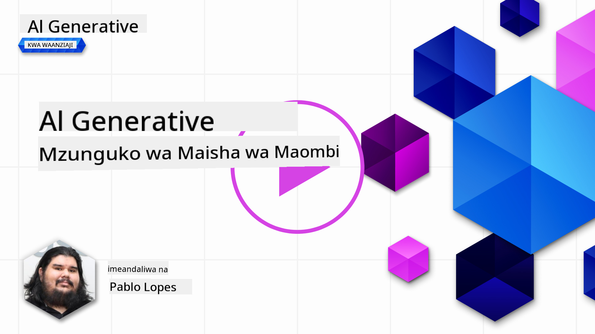
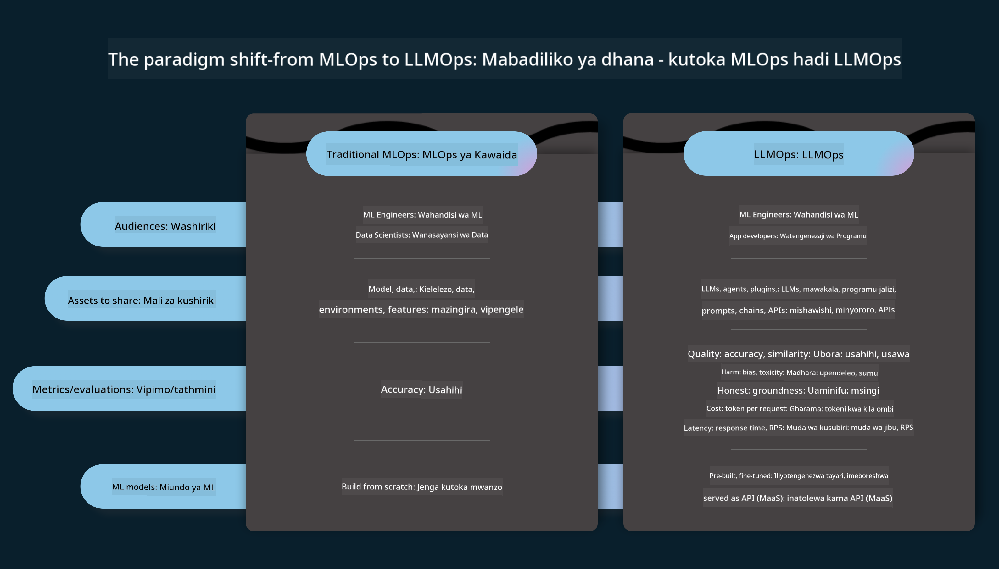
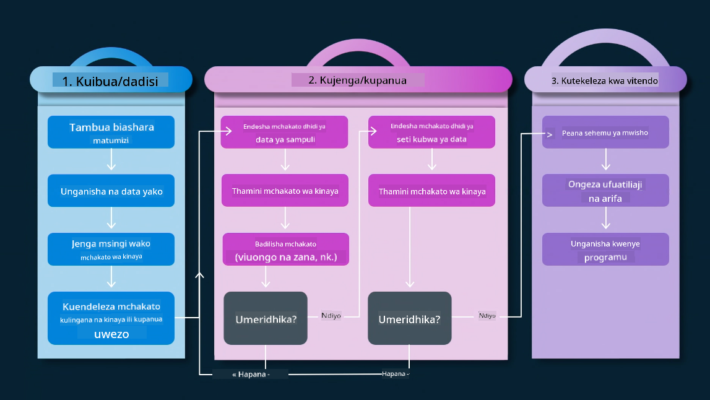
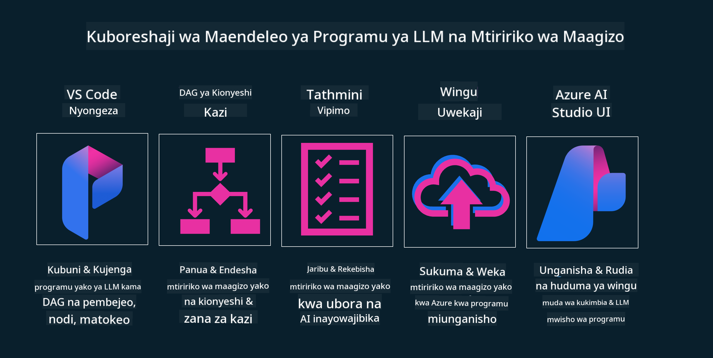

<!--
CO_OP_TRANSLATOR_METADATA:
{
  "original_hash": "27a5347a5022d5ef0a72ab029b03526a",
  "translation_date": "2025-05-20T00:54:15+00:00",
  "source_file": "14-the-generative-ai-application-lifecycle/README.md",
  "language_code": "sw"
}
-->

# Mzunguko wa Maisha wa Maombi ya AI Inayotengeneza

Swali muhimu kwa maombi yote ya AI ni umuhimu wa vipengele vya AI, kwani AI ni uwanja unaoendelea kwa kasi. Ili kuhakikisha kwamba programu yako inabaki kuwa muhimu, ya kuaminika, na imara, unahitaji kuifuatilia, kuikadiria, na kuiboresha kila wakati. Hapa ndipo mzunguko wa maisha wa AI inayotengeneza unapokuja.

Mzunguko wa maisha wa AI inayotengeneza ni mfumo unaokuongoza kupitia hatua za kuendeleza, kupeleka, na kudumisha programu ya AI inayotengeneza. Hukusaidia kufafanua malengo yako, kupima utendaji wako, kutambua changamoto zako, na kutekeleza suluhisho zako. Pia hukusaidia kulinganisha programu yako na viwango vya maadili na sheria za uwanja wako na wadau wako. Kwa kufuata mzunguko wa maisha wa AI inayotengeneza, unaweza kuhakikisha kuwa programu yako inatoa thamani kila wakati na inaridhisha watumiaji wako.

## Utangulizi

Katika sura hii, uta:

- Elewa Mabadiliko ya Paradigm kutoka MLOps hadi LLMOps
- Mzunguko wa Maisha wa LLM
- Zana za Mzunguko wa Maisha
- Upimaji na Tathmini ya Mzunguko wa Maisha

## Elewa Mabadiliko ya Paradigm kutoka MLOps hadi LLMOps

LLMs ni chombo kipya katika zana za Akili Bandia, zina nguvu kubwa katika kazi za uchambuzi na uzalishaji kwa maombi, hata hivyo nguvu hii ina matokeo fulani katika jinsi tunavyoruhusu kazi za AI na Ujifunzaji wa Mashine wa Kawaida.

Kwa hili, tunahitaji Paradigm mpya ili kuendana na chombo hiki kwa njia inayobadilika, kwa motisha sahihi. Tunaweza kuainisha programu za zamani za AI kama "Programu za ML" na Programu mpya za AI kama "Programu za GenAI" au tu "Programu za AI", ikionyesha teknolojia na mbinu kuu zinazotumika wakati huo. Hii inabadilisha hadithi yetu kwa njia nyingi, angalia ulinganisho ufuatao.

Kumbuka kuwa katika LLMOps, tunazingatia zaidi Waendelezaji wa Programu, kutumia ujumuishaji kama sehemu muhimu, kutumia "Mifano-kama-Huduma" na kufikiria katika vidokezo vifuatavyo kwa vipimo.

- Ubora: Ubora wa majibu
- Madhara: AI yenye uwajibikaji
- Uaminifu: Uhalisia wa majibu (Ina maana? Ni sahihi?)
- Gharama: Bajeti ya Suluhisho
- Muda wa Kusubiri: Wakati wa wastani kwa majibu ya tokeni

## Mzunguko wa Maisha wa LLM

Kwanza, kuelewa mzunguko wa maisha na marekebisho, wacha tuangalie infographic ifuatayo.

Kama unavyoweza kuona, hii ni tofauti na Mizunguko ya Maisha ya kawaida kutoka MLOps. LLMs zina mahitaji mapya mengi, kama Kutoa Maagizo, mbinu tofauti za kuboresha ubora (Kufanya Kazi Bora, RAG, Meta-Prompts), tathmini tofauti na uwajibikaji na AI yenye uwajibikaji, na mwisho, vipimo vipya vya tathmini (Ubora, Madhara, Uaminifu, Gharama na Muda wa Kusubiri).

Kwa mfano, angalia jinsi tunavyofikiria. Kutumia uhandisi wa maagizo kujaribu LLMs mbalimbali ili kuchunguza uwezekano wa kujaribu ikiwa Hypothesis yao inaweza kuwa sahihi.

Kumbuka kuwa hii sio ya mstari, bali ni mizunguko iliyounganishwa, inayorudiwa na yenye mzunguko wa jumla.

Je, tunawezaje kuchunguza hatua hizo? Wacha tuingie kwa undani jinsi tunaweza kujenga mzunguko wa maisha.

Hii inaweza kuonekana kuwa ngumu kidogo, wacha tuzingatie hatua tatu kubwa kwanza.

1. Kufikiria/Kuchunguza: Uchunguzi, hapa tunaweza kuchunguza kulingana na mahitaji yetu ya biashara. Kuunda prototaipu, kuunda [PromptFlow](https://microsoft.github.io/promptflow/index.html?WT.mc_id=academic-105485-koreyst) na kujaribu ikiwa ni bora vya kutosha kwa Hypothesis yetu.
2. Kujenga/Kukuza: Utekelezaji, sasa, tunaanza kutathmini kwa seti kubwa za data kutekeleza mbinu, kama Kufanya Kazi Bora na RAG, ili kuangalia uimara wa suluhisho letu. Ikiwa haifanyi kazi, kuitekeleza upya, kuongeza hatua mpya katika mtiririko wetu au kuunda upya data, inaweza kusaidia. Baada ya kujaribu mtiririko wetu na kiwango chetu, ikiwa inafanya kazi na kuangalia vipimo vyetu, iko tayari kwa hatua inayofuata.
3. Kufanya Kazi: Ujumuishaji, sasa kuongeza Mifumo ya Ufuatiliaji na Tahadhari kwenye mfumo wetu, kupeleka na ujumuishaji wa programu kwenye Programu yetu.

Kisha, tuna mzunguko wa jumla wa Usimamizi, unaozingatia usalama, uzingatiaji na utawala.

Hongera, sasa una Programu yako ya AI tayari na inafanya kazi. Kwa uzoefu wa vitendo, angalia [Demo ya Mazungumzo ya Contoso.](https://nitya.github.io/contoso-chat/?WT.mc_id=academic-105485-koreys)

Sasa, ni zana gani tunaweza kutumia?

## Zana za Mzunguko wa Maisha

Kwa Zana, Microsoft inatoa [Jukwaa la Azure AI](https://azure.microsoft.com/solutions/ai/?WT.mc_id=academic-105485-koreys) na [PromptFlow](https://microsoft.github.io/promptflow/index.html?WT.mc_id=academic-105485-koreyst) kuwezesha na kufanya mzunguko wako kuwa rahisi kutekeleza na tayari kwenda.

[Jukwaa la Azure AI](https://azure.microsoft.com/solutions/ai/?WT.mc_id=academic-105485-koreys), hukuruhusu kutumia [AI Studio](https://ai.azure.com/?WT.mc_id=academic-105485-koreys). AI Studio ni lango la wavuti linalokuruhusu Kuchunguza mifano, sampuli na zana. Kusimamia rasilimali zako, mtiririko wa maendeleo ya UI na chaguo za SDK/CLI kwa maendeleo ya Kwanza ya Nambari.

Azure AI, inakuruhusu kutumia rasilimali nyingi, kusimamia shughuli zako, huduma, miradi, utaftaji wa vekta na mahitaji ya hifadhidata.

Jenga, kutoka kwa Uthibitisho-wa-Dhana (POC) hadi programu za kiwango kikubwa na PromptFlow:

- Buni na Jenga programu kutoka kwa VS Code, na zana za kuona na kufanya kazi
- Jaribu na boresha programu zako kwa AI bora, kwa urahisi.
- Tumia Azure AI Studio kujumuisha na kurudia na wingu, Kusukuma na Kupeleka kwa ujumuishaji wa haraka.

## Nzuri! Endelea Kujifunza!

Ajabu, sasa jifunze zaidi kuhusu jinsi tunavyounda programu kutumia dhana na [Programu ya Mazungumzo ya Contoso](https://nitya.github.io/contoso-chat/?WT.mc_id=academic-105485-koreyst), ili kuangalia jinsi Utetezi wa Wingu unavyoongeza dhana hizo katika maonyesho. Kwa maudhui zaidi, angalia [kipindi cha kuvunja cha Ignite!
](https://www.youtube.com/watch?v=DdOylyrTOWg)

Sasa, angalia Somo la 15, kuelewa jinsi [Uzalishaji wa Kuzingatia Urejeshaji na Hifadhidata za Vekta](../15-rag-and-vector-databases/README.md?WT.mc_id=academic-105485-koreyst) zinavyoathiri AI Inayotengeneza na kufanya Maombi ya kuvutia zaidi!

**Kanusho**: 
Hati hii imetafsiriwa kwa kutumia huduma ya tafsiri ya AI [Co-op Translator](https://github.com/Azure/co-op-translator). Ingawa tunajitahidi kwa usahihi, tafadhali fahamu kwamba tafsiri za kiotomatiki zinaweza kuwa na makosa au kutokuwa sahihi. Hati ya asili katika lugha yake ya asili inapaswa kuzingatiwa kama chanzo chenye mamlaka. Kwa taarifa muhimu, tafsiri ya kitaalamu ya kibinadamu inapendekezwa. Hatutawajibika kwa kutoelewana au tafsiri zisizo sahihi zinazotokana na matumizi ya tafsiri hii.