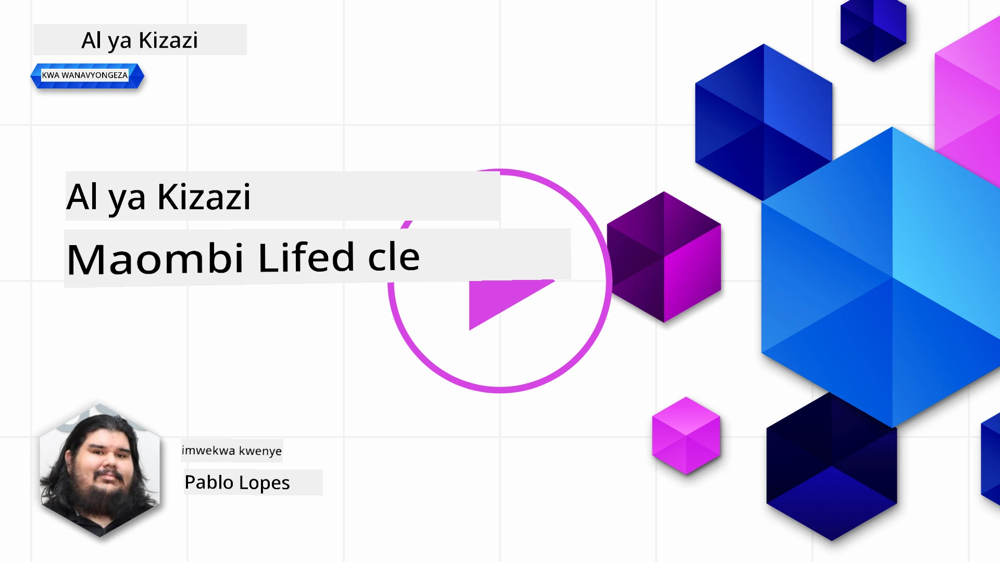
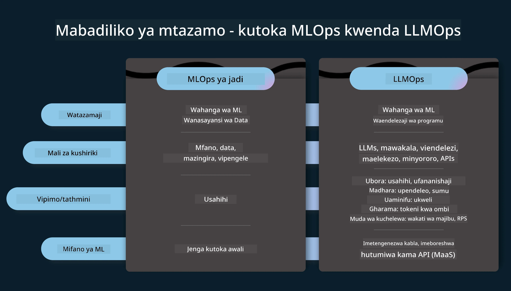
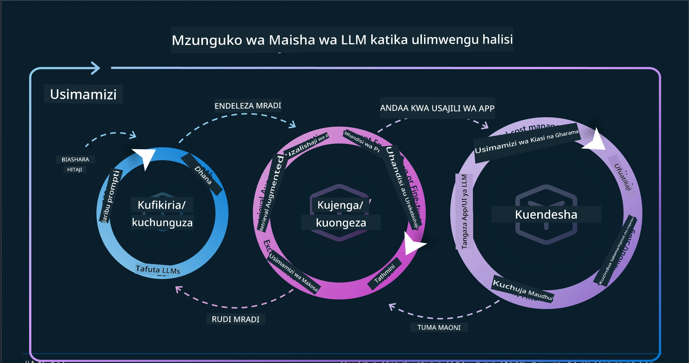
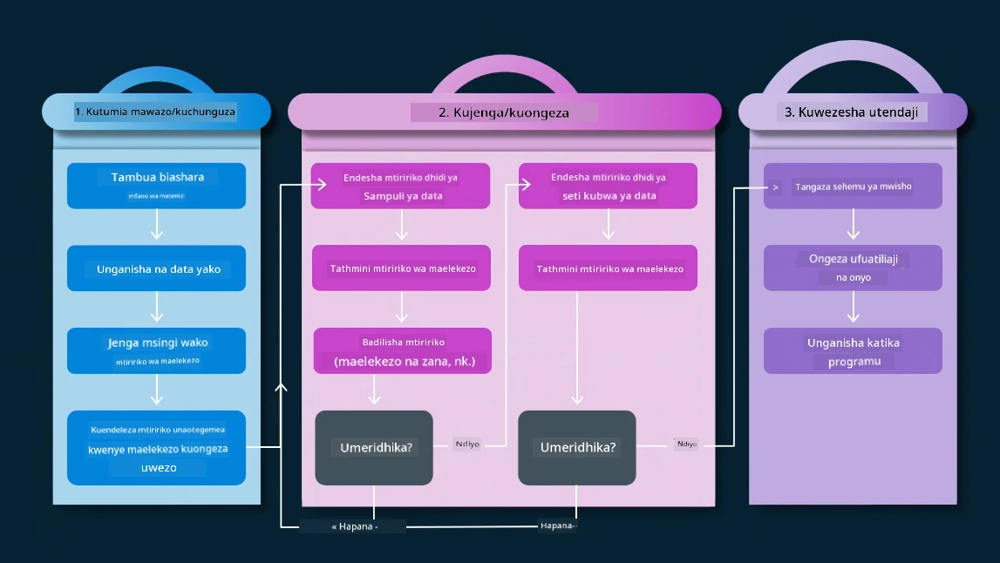
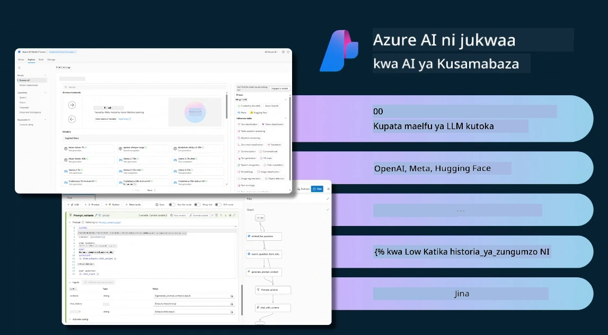
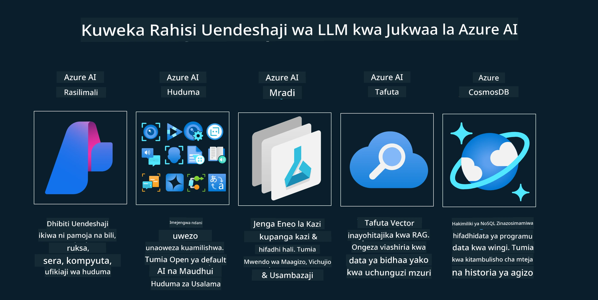
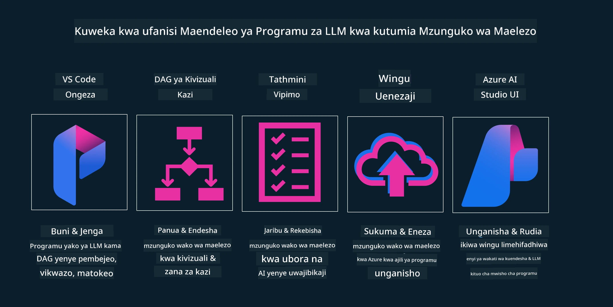

# Mzunguko wa Maisha wa Programu za AI Zinazotengeneza

Swali muhimu kwa programu zote za AI ni umuhimu wa sifa za AI, kwani AI ni eneo linalobadilika haraka, kuhakikisha kwamba programu yako inabaki muhimu, ya kuaminika, na thabiti, unahitaji kuifuatilia, kuipima, na kuiboresha kila wakati. Hapa ndipo mzunguko wa maisha wa AI zinazotengeneza unakuja.

Mzunguko wa maisha wa AI zinazotengeneza ni mfumo unaokuongoza kupitia hatua za kuunda, kupeleka, na kudumisha programu ya AI inayotengeneza. Unakusaidia kufafanua malengo yako, kupima utendaji wako, kubaini changamoto zako, na kutekeleza suluhisho zako. Pia unakusaidia kuoanisha programu yako na viwango vya maadili na sheria katika maeneo yako na wadau wako. Kwa kufuata mzunguko wa maisha wa AI zinazotengeneza, unaweza kuhakikisha kuwa programu yako daima inatoa thamani na kuwafurahisha watumiaji wako.

## Utangulizi

Katika sura hii, utajifunza:

- Kuelewa Mabadiliko ya Mfumo kutoka MLOps kwenda LLMOps
- Mzunguko wa Maisha wa LLM
- Vifaa vya Mzunguko wa Maisha
- Kupima na Kutathmini Mzunguko wa Maisha

## Kuelewa Mabadiliko ya Mfumo kutoka MLOps kwenda LLMOps

LLMs ni chombo kipya katika silaha ya Akili Bandia, ni yenye nguvu sana katika kazi za uchambuzi na uzalishaji kwa programu, hata hivyo nguvu hii ina athari fulani jinsi tunavyoratibu kazi za AI na Mafunzo ya Kifundi ya Kawaida.

Kwa hili, tunahitaji Mfumo mpya wa kuoanisha chombo hiki kwa njia ya nguvu, na vivutio sahihi. Tunaweza kuainisha programu za AI za zamani kama "Programu za ML" na programu mpya zaidi za AI kama "Programu za GenAI" au tu "Programu za AI", zikionyesha teknolojia kuu na mbinu zilizotumika kwa wakati huo. Hii hubadilisha simulizi yetu kwa njia nyingi, angalia kulinganisha lifuatalo.

Tambua kwamba katika LLMOps, tunazingatia zaidi Waendelezaji wa Programu, tukitumia muunganiko kama nukta muhimu, tukitumia "Models-as-a-Service" na kufikiria kwa vidokezo vifuatavyo kuwa vipimo.

- Ubora: Ubora wa majibu
- Madhara: AI ya Kuwajibika
- Uaminifu: Kushikamana kwa majibu (Inamaanisha? Ni sahihi?)
- Gharama: Bajeti ya Suluhisho
- Muda wa kuchelewa: Wastani wa muda wa maelezo ya tokeni

## Mzunguko wa Maisha wa LLM

Kwanza, kuelewa mzunguko wa maisha na maboresho, tuchukulie infographic ifuatayo.

Kama unavyoona, hii ni tofauti na Mzunguko wa Maisha ya kawaida kutoka MLOps. LLMs zina mahitaji mapya mengi, kama Prompting, mbinu tofauti za kuboresha ubora (Fine-Tuning, RAG, Meta-Prompts), tathmini tofauti na uwajibikaji wa AI yenye uwajibikaji, mwisho, vipimo vipya vya tathmini (Ubora, Madhara, Uaminifu, Gharama na Muda wa kuchelewa).

Kwa mfano, angalia jinsi tunavyojieleza mawazo. Kutumia uhandisi wa prompt kujaribu LLMs mbalimbali kuchunguza uwezekano wa kujaribu kama Nadharia zao zinaweza kuwa sahihi.

Tambua hii si mwelekeo wa mstari, bali ni mizunguko iliyojumuishwa, ya kurudia na mzunguko mkubwa ulio kati.

Tunawezaje kuchunguza hatua hizo? Tukae kwa undani jinsi tunavyoweza kujenga mzunguko wa maisha.

Hii inaweza kuonekana ngumu kidogo, twende tukizingatia hatua kuu tatu kwanza.

1. Kueleza Mawazo/Kuchunguza: Uchunguzi, hapa tunaweza kuchunguza kulingana na mahitaji ya biashara yetu. Kutengeneza mfano, kuunda [PromptFlow](https://microsoft.github.io/promptflow/index.html?WT.mc_id=academic-105485-koreyst) na kujaribu kama ni bora vya kutosha kwa Nadharia yetu.
1. Kujenga/Kuongeza: Utekelezaji, sasa, tunaanza kutathmini kwa seti kubwa za data kutumia mbinu, kama Fine-tuning na RAG, ili kukagua uimara wa suluhisho letu. Ikiwa haifanyi kazi, kuutekeleza tena, kuongeza hatua mpya katika mtiririko wetu au kuandaa upya data, inaweza kusaidia. Baada ya kujaribu mtiririko wetu na kiwango chetu, ikiwa vinafanya kazi na kukagua Vipimo vyetu, iko tayari kwa hatua inayofuata.
1. Kuendesha Kazi: Muungano, sasa kuongezea Mfumo wa Ufuatiliaji na Onyo kwa mfumo wetu, kupeleka na kuunganisha programu kwa Programu yetu.

Kisha, tuna mzunguko mkubwa wa Usimamizi, ukilenga usalama, ufuatiliaji na utawala.

Hongera, sasa unayo Programu yako ya AI tayari kwenda na kufanya kazi. Kwa uzoefu wa vitendo, tazama [Maonyesho ya Gumzo la Contoso.](https://nitya.github.io/contoso-chat/?WT.mc_id=academic-105485-koreyst)

Sasa, ni zana gani tunaweza kutumia?

## Vifaa vya Mzunguko wa Maisha

Kwa vifaa, Microsoft hutoa [Jukwaa la Azure AI](https://azure.microsoft.com/solutions/ai/?WT.mc_id=academic-105485-koreyst) na [PromptFlow](https://microsoft.github.io/promptflow/index.html?WT.mc_id=academic-105485-koreyst) kuwezesha na kufanya mzunguko wako uwe rahisi kutekeleza na tayari kwenda.

[Jukwaa la Azure AI](https://azure.microsoft.com/solutions/ai/?WT.mc_id=academic-105485-koreyst), linakuruhusu kutumia [AI Studio](https://ai.azure.com/?WT.mc_id=academic-105485-koreyst). AI Studio ni lango la wavuti linalokuruhusu Kuchunguza mifano, sampuli na zana. Kusimamia rasilimali zako, mtiririko wa maendeleo wa kiolesura na chaguzi za SDK/CLI kwa maendeleo ya Kwanza na Msimbo.

Azure AI, inakuruhusu kutumia rasilimali nyingi, kusimamia shughuli zako, huduma, miradi, utafutaji wa vector na mahitaji ya hifadhidata.

Jenga, kutoka kwa Proof-of-Concept(POC) hadi programu kubwa kwa PromptFlow:

- Tengeneza na Jenga programu kutoka VS Code, kwa zana za kuona na za kazi
- Jaribu na fine-tune programu zako kwa AI ya ubora, kwa urahisi.
- Tumia Azure AI Studio kuunganisha na Kurudia na wingu, Sukuma na Telekeza kwa muunganiko haraka.

## Vizuri! Endelea kujifunza!

Ajabu, sasa jifunze zaidi kuhusu jinsi tunavyopanga programu kutumia dhana kwa [Programu ya Gumzo la Contoso](https://nitya.github.io/contoso-chat/?WT.mc_id=academic-105485-koreyst), ili kuangalia jinsi Cloud Advocacy huongeza dhana hizo kwenye maonyesho. Kwa maudhui zaidi, angalia [kikao chetu cha Ignite!
](https://www.youtube.com/watch?v=DdOylyrTOWg)

Sasa, angalia Somo la 15, kuelewa jinsi [Uzalishaji ulioimarishwa na Upatikanaji na Hifadhidata za Vector](../15-rag-and-vector-databases/README.md?WT.mc_id=academic-105485-koreyst) unavyoathiri AI Zinazotengeneza na kutengeneza Programu zinazovutia zaidi!

---

<!-- CO-OP TRANSLATOR DISCLAIMER START -->
**Kumbusho**:
Nyaraka hii imetafsiriwa kwa kutumia huduma ya tafsiri ya AI [Co-op Translator](https://github.com/Azure/co-op-translator). Ingawa tunajitahidi kwa usahihi, tafadhali fahamu kuwa tafsiri za kiotomatiki zinaweza kuwa na makosa au ukosefu wa usahihi. Nyaraka asili katika lugha yake ya asili inapaswa kuchukuliwa kama chanzo cha mamlaka. Kwa taarifa muhimu, tafsiri ya kitaalamu na ya kibinadamu inapendekezwa. Hatubebeki dhamana kwa kutoelewana au tafsiri potofu zinazotokana na matumizi ya tafsiri hii.
<!-- CO-OP TRANSLATOR DISCLAIMER END -->