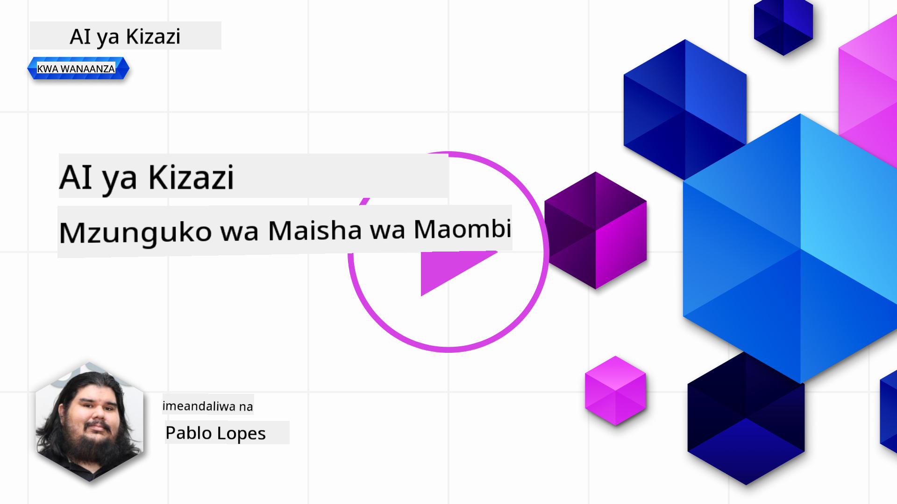
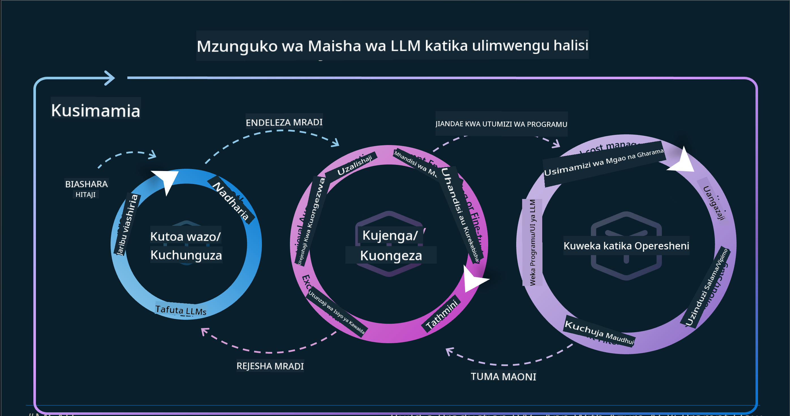
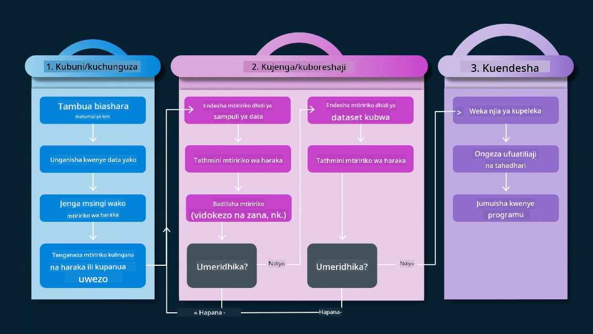
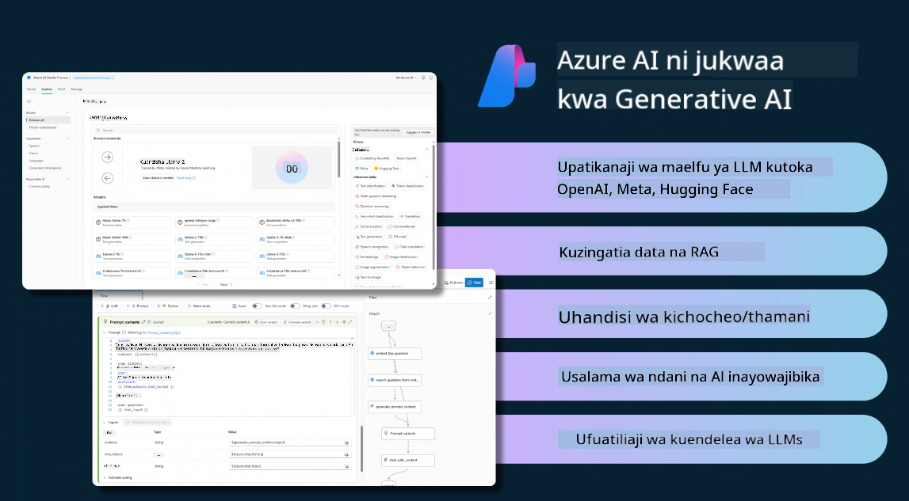
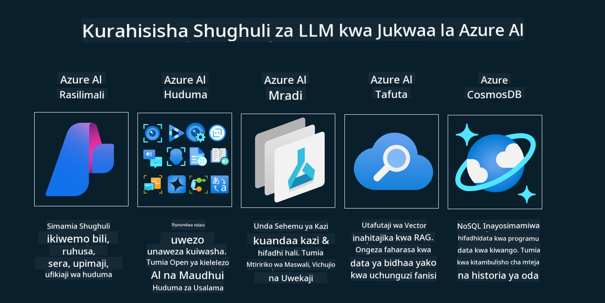
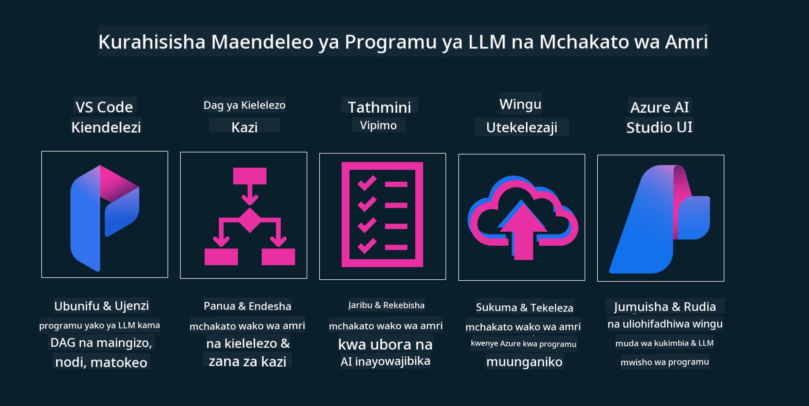

<!--
CO_OP_TRANSLATOR_METADATA:
{
  "original_hash": "27a5347a5022d5ef0a72ab029b03526a",
  "translation_date": "2025-06-25T22:08:31+00:00",
  "source_file": "14-the-generative-ai-application-lifecycle/README.md",
  "language_code": "sw"
}
-->

# Mzunguko wa Maisha wa Programu ya AI Inayotengeneza

Swali muhimu kwa programu zote za AI ni umuhimu wa vipengele vya AI, kwani AI ni uwanja unaoendelea kwa kasi, kuhakikisha programu yako inabaki kuwa muhimu, ya kuaminika, na imara, unahitaji kuifuatilia, kuipima, na kuiboresha kila mara. Hapa ndipo mzunguko wa maisha wa AI inayotengeneza unapoingia.

Mzunguko wa maisha wa AI inayotengeneza ni mfumo unaokuongoza kupitia hatua za kuendeleza, kupeleka, na kudumisha programu ya AI inayotengeneza. Hukusaidia kufafanua malengo yako, kupima utendaji wako, kutambua changamoto zako, na kutekeleza suluhisho zako. Pia hukusaidia kuoanisha programu yako na viwango vya kimaadili na kisheria vya uwanja wako na wadau wako. Kwa kufuata mzunguko wa maisha wa AI inayotengeneza, unaweza kuhakikisha kuwa programu yako daima inatoa thamani na kuridhisha watumiaji wako.

## Utangulizi

Katika sura hii, utajifunza:

- Kuelewa Mabadiliko ya Mtazamo kutoka MLOps hadi LLMOps
- Mzunguko wa Maisha wa LLM
- Zana za Mzunguko wa Maisha
- Upimaji na Tathmini ya Mzunguko wa Maisha

## Kuelewa Mabadiliko ya Mtazamo kutoka MLOps hadi LLMOps

LLMs ni zana mpya katika silaha ya Akili Bandia, zina nguvu sana katika kazi za uchambuzi na uzalishaji kwa programu, hata hivyo nguvu hii ina matokeo fulani katika jinsi tunavyorahisisha kazi za AI na Kujifunza kwa Mashine za Kawaida.

Kwa hili, tunahitaji mtazamo mpya wa kubadilisha zana hii kwa njia inayobadilika, na motisha sahihi. Tunaweza kuainisha programu za AI za zamani kama "Programu za ML" na Programu mpya za AI kama "Programu za GenAI" au tu "Programu za AI", ikionyesha teknolojia na mbinu kuu zinazotumika wakati huo. Hii inabadilisha hadithi yetu kwa njia nyingi, angalia kulinganisha ifuatayo.

Angalia kwamba katika LLMOps, tunalenga zaidi kwa Watengenezaji wa Programu, kutumia ujumuishaji kama sehemu muhimu, kutumia "Models-as-a-Service" na kufikiria katika vidokezo vifuatavyo kwa metrics.

- Ubora: Ubora wa majibu
- Madhara: AI yenye uwajibikaji
- Uaminifu: Msingi wa majibu (Inaleta maana? Ni sahihi?)
- Gharama: Bajeti ya suluhisho
- Usumbufu: Wastani wa muda wa majibu ya tokeni

## Mzunguko wa Maisha wa LLM

Kwanza, kuelewa mzunguko wa maisha na mabadiliko, hebu tuchunguze infographic inayofuata.

Kama unavyoweza kuona, hii ni tofauti na Mizunguko ya Maisha ya kawaida kutoka MLOps. LLM zina mahitaji mengi mapya, kama Kutoa Maelekezo, mbinu tofauti za kuboresha ubora (Kufanya Marekebisho, RAG, Meta-Prompts), tathmini tofauti na uwajibikaji na AI yenye uwajibikaji, mwisho, metrics mpya za tathmini (Ubora, Madhara, Uaminifu, Gharama na Usumbufu).

Kwa mfano, angalia jinsi tunavyofikiria. Kutumia uhandisi wa kutoa maelekezo kujaribu LLMs mbalimbali kuchunguza uwezekano wa kupima ikiwa Hypothesis yao inaweza kuwa sahihi.

Angalia kwamba hii si ya moja kwa moja, bali ni mizunguko iliyojumuishwa, inayorudiwa na yenye mzunguko wa jumla.

Je, tunawezaje kuchunguza hatua hizo? Hebu tuingie kwa undani jinsi tunavyoweza kujenga mzunguko wa maisha.

Hii inaweza kuonekana kuwa ngumu kidogo, hebu tuzingatie hatua kubwa tatu kwanza.

1. Kufikiria/Kuchunguza: Uchunguzi, hapa tunaweza kuchunguza kulingana na mahitaji ya biashara yetu. Kuunda mfano, kuunda [PromptFlow](https://microsoft.github.io/promptflow/index.html?WT.mc_id=academic-105485-koreyst) na kupima ikiwa ni bora vya kutosha kwa Hypothesis yetu.
2. Kujenga/Kuongeza: Utekelezaji, sasa, tunaanza kupima kwa seti kubwa za data kutekeleza mbinu, kama Kufanya Marekebisho na RAG, ili kuangalia uimara wa suluhisho letu. Ikiwa haifanyi kazi, kuitekeleza upya, kuongeza hatua mpya katika mtiririko wetu au kubadilisha data, inaweza kusaidia. Baada ya kupima mtiririko wetu na kiwango chetu, ikiwa inafanya kazi na kuangalia metrics zetu, iko tayari kwa hatua inayofuata.
3. Kuendesha: Ujumuishaji, sasa kuongeza Mfumo wa Ufuatiliaji na Arifa kwa mfumo wetu, kupeleka na ujumuishaji wa programu kwa Programu yetu.

Kisha, tuna mzunguko wa jumla wa Usimamizi, ukizingatia usalama, uzingatiaji na utawala.

Hongera, sasa una Programu yako ya AI tayari kuendelea na kufanya kazi. Kwa uzoefu wa vitendo, angalia [Demo ya Mazungumzo ya Contoso.](https://nitya.github.io/contoso-chat/?WT.mc_id=academic-105485-koreys)

Sasa, ni zana gani tunaweza kutumia?

## Zana za Mzunguko wa Maisha

Kwa Zana, Microsoft inatoa [Jukwaa la Azure AI](https://azure.microsoft.com/solutions/ai/?WT.mc_id=academic-105485-koreys) na [PromptFlow](https://microsoft.github.io/promptflow/index.html?WT.mc_id=academic-105485-koreyst) kuwezesha na kufanya mzunguko wako kuwa rahisi kutekeleza na tayari kuanza.

[Jukwaa la Azure AI](https://azure.microsoft.com/solutions/ai/?WT.mc_id=academic-105485-koreys), hukuruhusu kutumia [AI Studio](https://ai.azure.com/?WT.mc_id=academic-105485-koreys). AI Studio ni lango la wavuti linalokuruhusu Kuchunguza mifano, sampuli na zana. Kusimamia rasilimali zako, mtiririko wa maendeleo ya UI na chaguo za SDK/CLI kwa maendeleo ya Code-First.

Azure AI, hukuruhusu kutumia rasilimali nyingi, kusimamia shughuli zako, huduma, miradi, utafutaji wa vekta na mahitaji ya hifadhidata.

Jenga, kutoka kwa Dhibitisho la Dhana (POC) hadi programu za kiwango kikubwa na PromptFlow:

- Kubuni na Kujenga programu kutoka VS Code, na zana za kuona na za kazi
- Kupima na kurekebisha programu zako kwa AI bora, kwa urahisi.
- Tumia Azure AI Studio kuunganisha na Kurudia na wingu, Kusukuma na Kuweka kwa ujumuishaji wa haraka.

## Vizuri! Endelea Kujifunza!

Ajabu, sasa jifunze zaidi kuhusu jinsi tunavyopanga programu kutumia dhana na [Programu ya Mazungumzo ya Contoso](https://nitya.github.io/contoso-chat/?WT.mc_id=academic-105485-koreyst), ili kuangalia jinsi Utetezi wa Wingu unavyoongeza dhana hizo katika maonyesho. Kwa maudhui zaidi, angalia [kikao cha kuvunja cha Ignite!
](https://www.youtube.com/watch?v=DdOylyrTOWg)

Sasa, angalia Somo la 15, kuelewa jinsi [Uzalishaji Ulioimarishwa wa Upatikanaji na Hifadhidata za Vekta](../15-rag-and-vector-databases/README.md?WT.mc_id=academic-105485-koreyst) zinavyoathiri AI inayotengeneza na kufanya Programu zaidi za kuvutia!

**Kanusho**: 
Hati hii imetafsiriwa kwa kutumia huduma ya tafsiri ya AI [Co-op Translator](https://github.com/Azure/co-op-translator). Wakati tunajitahidi kwa usahihi, tafadhali fahamu kwamba tafsiri za kiotomatiki zinaweza kuwa na makosa au kutokuwa sahihi. Hati ya asili katika lugha yake ya asili inapaswa kuzingatiwa kama chanzo chenye mamlaka. Kwa taarifa muhimu, inashauriwa kupata tafsiri ya kitaalamu ya binadamu. Hatutawajibika kwa kutoelewana au tafsiri zisizo sahihi zinazotokana na matumizi ya tafsiri hii.