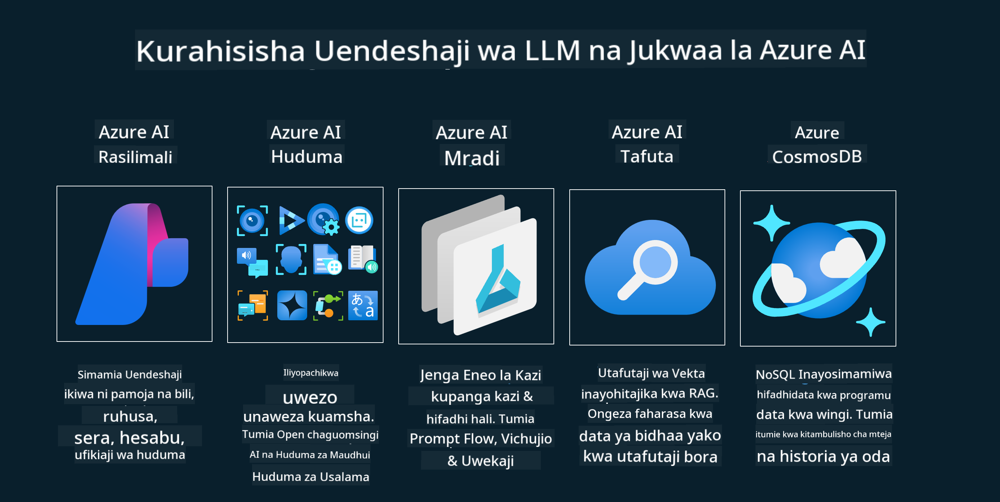
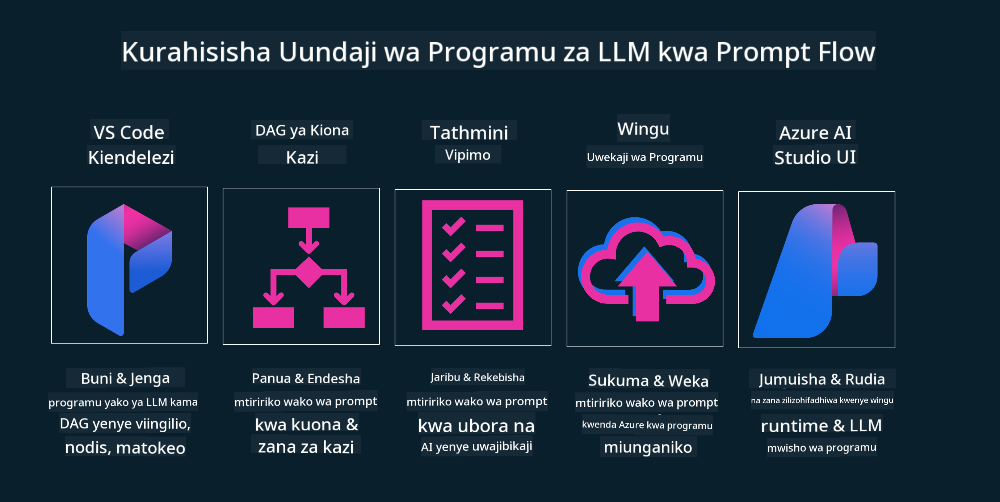

<!--
CO_OP_TRANSLATOR_METADATA:
{
  "original_hash": "27a5347a5022d5ef0a72ab029b03526a",
  "translation_date": "2025-07-09T15:57:16+00:00",
  "source_file": "14-the-generative-ai-application-lifecycle/README.md",
  "language_code": "sw"
}
-->

# Mzunguko wa Maisha wa Programu za AI Zinazozalisha

Swali muhimu kwa programu zote za AI ni umuhimu wa vipengele vya AI, kwani AI ni uwanja unaokua kwa kasi, kuhakikisha programu yako inabaki kuwa ya maana, ya kuaminika, na imara, unahitaji kuifuatilia, kuipima, na kuiboresha kila wakati. Hapa ndipo mzunguko wa maisha wa AI zinazozalisha unapoingia.

Mzunguko wa maisha wa AI zinazozalisha ni mfumo unaokuongoza kupitia hatua za kuunda, kupeleka, na kudumisha programu ya AI inayozalisha. Unakusaidia kuweka malengo yako, kupima utendaji wako, kubaini changamoto zako, na kutekeleza suluhisho zako. Pia unakusaidia kuoanisha programu yako na viwango vya maadili na sheria za eneo lako na wadau wako. Kwa kufuata mzunguko wa maisha wa AI zinazozalisha, unaweza kuhakikisha programu yako daima inatoa thamani na kuridhisha watumiaji wako.

## Utangulizi

Katika sura hii, utajifunza:

- Kuelewa Mabadiliko ya Paradigm kutoka MLOps hadi LLMOps
- Mzunguko wa Maisha wa LLM
- Zana za Mzunguko wa Maisha
- Upimaji na Tathmini ya Mzunguko wa Maisha

## Kuelewa Mabadiliko ya Paradigm kutoka MLOps hadi LLMOps

LLM ni zana mpya katika silaha ya Akili Bandia, zina nguvu kubwa sana katika kazi za uchambuzi na uzalishaji kwa programu, hata hivyo nguvu hii ina athari fulani katika jinsi tunavyoratibu kazi za AI na Machine Learning za Klasiki.

Kwa hivyo, tunahitaji Paradigm mpya ili kuendana na zana hii kwa njia inayobadilika, na motisha sahihi. Tunaweza kugawanya programu za AI za zamani kama "ML Apps" na programu mpya za AI kama "GenAI Apps" au tu "AI Apps", kuonyesha teknolojia na mbinu kuu zinazotumika wakati huo. Hii inabadilisha hadithi yetu kwa njia nyingi, angalia kulinganisha ifuatayo.

Tambua kwamba katika LLMOps, tunazingatia zaidi Waendelezaji wa Programu, tukitumia muunganiko kama jambo kuu, tukitumia "Models-as-a-Service" na kufikiria mambo yafuatayo kwa vipimo.

- Ubora: Ubora wa majibu
- Madhara: AI yenye uwajibikaji
- Uaminifu: Msingi wa majibu (Inaeleweka? Ni sahihi?)
- Gharama: Bajeti ya suluhisho
- Muda wa kuchelewa: Wakati wa wastani wa jibu la tokeni

## Mzunguko wa Maisha wa LLM

Kwanza, kuelewa mzunguko wa maisha na mabadiliko, tazama mchoro ufuatao.

Kama unavyoona, huu ni tofauti na Mzunguko wa Maisha wa kawaida wa MLOps. LLM zina mahitaji mapya mengi, kama Prompting, mbinu tofauti za kuboresha ubora (Fine-Tuning, RAG, Meta-Prompts), tathmini tofauti na uwajibikaji wa AI yenye uwajibikaji, na hatimaye, vipimo vipya vya tathmini (Ubora, Madhara, Uaminifu, Gharama na Muda wa kuchelewa).

Kwa mfano, angalia jinsi tunavyobuni mawazo. Kutumia uhandisi wa prompt kujaribu LLM mbalimbali kuchunguza uwezekano wa kujaribu kama nadharia zao zinaweza kuwa sahihi.

Kumbuka hii si mchakato wa mstari moja, bali ni mizunguko iliyojumuishwa, ya kurudia na yenye mzunguko mkubwa.

Tunawezaje kuchunguza hatua hizo? Hebu tuchunguze kwa undani jinsi tunavyoweza kujenga mzunguko wa maisha.

Hii inaweza kuonekana ngumu kidogo, tuanze kwa kuzingatia hatua kuu tatu kwanza.

1. Kubuni/Kuchunguza: Uchunguzi, hapa tunaweza kuchunguza kulingana na mahitaji ya biashara yetu. Kutengeneza mfano, kuunda [PromptFlow](https://microsoft.github.io/promptflow/index.html?WT.mc_id=academic-105485-koreyst) na kujaribu kama ni bora vya kutosha kwa nadharia yetu.
1. Kujenga/Kuongeza: Utekelezaji, sasa, tunaanza kupima kwa seti kubwa za data, kutekeleza mbinu kama Fine-tuning na RAG, kuangalia uimara wa suluhisho letu. Ikiwa haitoshi, kutekeleza tena, kuongeza hatua mpya katika mzunguko wetu au kupanga upya data kunaweza kusaidia. Baada ya kujaribu mzunguko wetu na kiwango chetu, ikiwa kinafanya kazi na kuangalia vipimo vyetu, iko tayari kwa hatua inayofuata.
1. Kuendesha Kazi: Muunganiko, sasa kuongeza mifumo ya Ufuatiliaji na Onyo kwenye mfumo wetu, kupeleka na kuunganisha programu kwenye Programu yetu.

Kisha, tuna mzunguko mkubwa wa Usimamizi, ukizingatia usalama, ufuataji wa sheria na utawala.

Hongera, sasa una Programu yako ya AI tayari kuanza na kuendesha. Kwa uzoefu wa vitendo, angalia [Contoso Chat Demo.](https://nitya.github.io/contoso-chat/?WT.mc_id=academic-105485-koreys)

Sasa, ni zana gani tunaweza kutumia?

## Zana za Mzunguko wa Maisha

Kwa zana, Microsoft hutoa [Azure AI Platform](https://azure.microsoft.com/solutions/ai/?WT.mc_id=academic-105485-koreys) na [PromptFlow](https://microsoft.github.io/promptflow/index.html?WT.mc_id=academic-105485-koreyst) zinazorahisisha na kufanya mzunguko wako uwe rahisi kutekeleza na tayari kuanza.

[Azure AI Platform](https://azure.microsoft.com/solutions/ai/?WT.mc_id=academic-105485-koreys), inakuwezesha kutumia [AI Studio](https://ai.azure.com/?WT.mc_id=academic-105485-koreys). AI Studio ni lango la mtandao linalokuwezesha Kuchunguza mifano, sampuli na zana. Kusimamia rasilimali zako, mtiririko wa maendeleo ya UI na chaguzi za SDK/CLI kwa maendeleo ya Code-First.

Azure AI, inakuwezesha kutumia rasilimali nyingi, kusimamia shughuli zako, huduma, miradi, utafutaji wa vector na mahitaji ya hifadhidata.

Jenga, kutoka Proof-of-Concept(POC) hadi programu kubwa kwa PromptFlow:

- Tengeneza na Jenga programu kutoka VS Code, kwa zana za kuona na za kazi
- Jaribu na boresha programu zako kwa AI bora, kwa urahisi.
- Tumia Azure AI Studio kuunganisha na kurudia na wingu, Push na Deploy kwa muunganiko wa haraka.

## Vizuri! Endelea Kujifunza!

Ajabu, sasa jifunze zaidi jinsi tunavyopanga programu kutumia dhana hizo na [Contoso Chat App](https://nitya.github.io/contoso-chat/?WT.mc_id=academic-105485-koreyst), ili kuona jinsi Cloud Advocacy inavyoongeza dhana hizo katika maonyesho. Kwa maudhui zaidi, angalia [Ignite breakout session!](https://www.youtube.com/watch?v=DdOylyrTOWg)

Sasa, angalia Somo la 15, kuelewa jinsi [Retrieval Augmented Generation and Vector Databases](../15-rag-and-vector-databases/README.md?WT.mc_id=academic-105485-koreyst) zinavyoathiri AI zinazozalisha na kufanya Programu ziwe za kuvutia zaidi!

**Kiarifu cha Kutotegemea**:  
Hati hii imetafsiriwa kwa kutumia huduma ya tafsiri ya AI [Co-op Translator](https://github.com/Azure/co-op-translator). Ingawa tunajitahidi kuhakikisha usahihi, tafadhali fahamu kwamba tafsiri za kiotomatiki zinaweza kuwa na makosa au upungufu wa usahihi. Hati ya asili katika lugha yake ya asili inapaswa kuchukuliwa kama chanzo cha mamlaka. Kwa taarifa muhimu, tafsiri ya kitaalamu inayofanywa na binadamu inapendekezwa. Hatubebei dhamana kwa kutoelewana au tafsiri potofu zinazotokana na matumizi ya tafsiri hii.