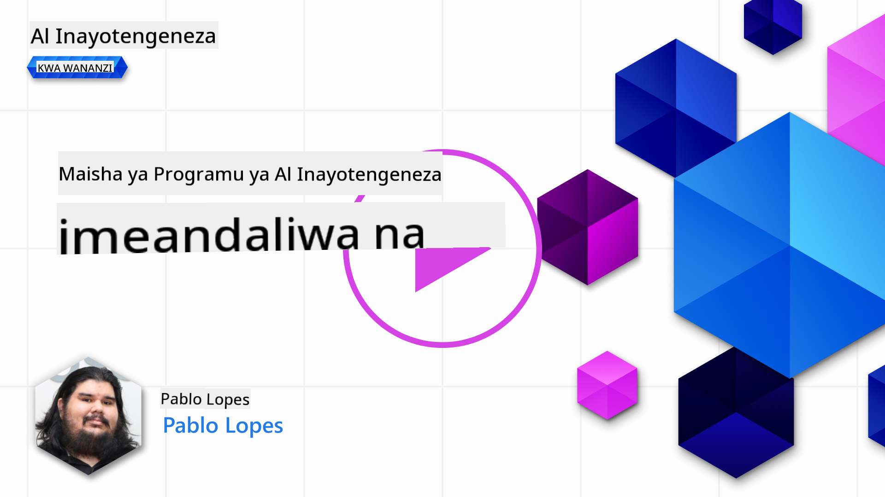
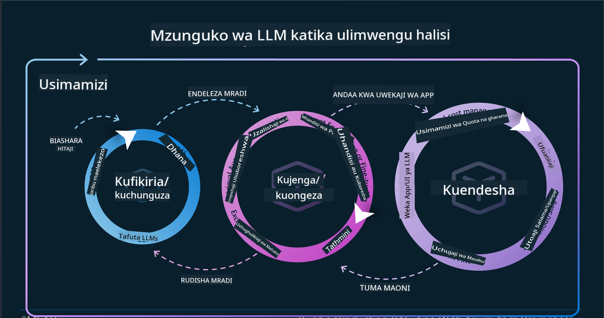

<!--
CO_OP_TRANSLATOR_METADATA:
{
  "original_hash": "b9d32511b27373a1b21b5789d4fda057",
  "translation_date": "2025-10-17T21:15:44+00:00",
  "source_file": "14-the-generative-ai-application-lifecycle/README.md",
  "language_code": "sw"
}
-->

# Mzunguko wa Maisha wa Programu ya AI ya Kizazi

Swali muhimu kwa programu zote za AI ni umuhimu wa vipengele vya AI, kwani AI ni uwanja unaokua haraka. Ili kuhakikisha programu yako inabaki kuwa muhimu, ya kuaminika, na thabiti, unahitaji kuifuatilia, kuipima, na kuiboresha mara kwa mara. Hapa ndipo mzunguko wa maisha wa AI ya kizazi unapoingia.

Mzunguko wa maisha wa AI ya kizazi ni mfumo unaokuongoza kupitia hatua za kuendeleza, kupeleka, na kudumisha programu ya AI ya kizazi. Unakusaidia kufafanua malengo yako, kupima utendaji wako, kutambua changamoto zako, na kutekeleza suluhisho zako. Pia unakusaidia kuoanisha programu yako na viwango vya kimaadili na kisheria vya uwanja wako na wadau wako. Kwa kufuata mzunguko wa maisha wa AI ya kizazi, unaweza kuhakikisha kuwa programu yako inatoa thamani kila wakati na inaridhisha watumiaji wako.

## Utangulizi

Katika sura hii, utajifunza:

- Kuelewa Mabadiliko ya Paradigm kutoka MLOps hadi LLMOps
- Mzunguko wa Maisha wa LLM
- Zana za Mzunguko wa Maisha
- Upimaji na Tathmini ya Mzunguko wa Maisha

## Kuelewa Mabadiliko ya Paradigm kutoka MLOps hadi LLMOps

LLMs ni zana mpya katika hazina ya Akili Bandia, zina nguvu sana katika kazi za uchambuzi na kizazi kwa programu, hata hivyo nguvu hii ina athari fulani katika jinsi tunavyoratibu kazi za AI na Ujifunzaji wa Mashine wa Kawaida.

Kwa hili, tunahitaji Paradigm mpya ya kuzoea zana hii kwa njia ya nguvu, na motisha sahihi. Tunaweza kuainisha programu za zamani za AI kama "Programu za ML" na Programu mpya za AI kama "Programu za GenAI" au tu "Programu za AI", zikionyesha teknolojia kuu na mbinu zinazotumika wakati huo. Hii inabadilisha hadithi yetu kwa njia nyingi, angalia kulinganisha ifuatayo.

Angalia kwamba katika LLMOps, tunazingatia zaidi Watengenezaji wa Programu, tukitumia miunganisho kama sehemu muhimu, tukitumia "Models-as-a-Service" na kufikiria mambo yafuatayo kwa vipimo.

- Ubora: Ubora wa majibu
- Madhara: AI inayowajibika
- Uaminifu: Uhalisia wa majibu (Je, yana mantiki? Je, ni sahihi?)
- Gharama: Bajeti ya suluhisho
- Muda wa kusubiri: Wastani wa muda wa majibu ya tokeni

## Mzunguko wa Maisha wa LLM

Kwanza, ili kuelewa mzunguko wa maisha na marekebisho yake, hebu tuangalie infographic ifuatayo.

Kama unavyoweza kuona, hii ni tofauti na Mizunguko ya Maisha ya kawaida kutoka MLOps. LLM zina mahitaji mapya mengi, kama vile Prompting, mbinu tofauti za kuboresha ubora (Fine-Tuning, RAG, Meta-Prompts), tathmini tofauti na uwajibikaji na AI inayowajibika, na hatimaye, vipimo vipya vya tathmini (Ubora, Madhara, Uaminifu, Gharama na Muda wa kusubiri).

Kwa mfano, angalia jinsi tunavyobuni. Kutumia uhandisi wa maelekezo (prompt engineering) kujaribu LLM mbalimbali ili kuchunguza uwezekano wa kujaribu ikiwa dhana yao inaweza kuwa sahihi.

Kumbuka kuwa hii si mchakato wa mstari, bali ni mizunguko iliyounganishwa, inayorudiwa na yenye mzunguko wa jumla.

Je, tunaweza kuchunguza hatua hizo vipi? Hebu tuingie kwa undani jinsi tunavyoweza kujenga mzunguko wa maisha.

Hii inaweza kuonekana kuwa ngumu kidogo, hebu tuzingatie hatua kuu tatu kwanza.

1. Kubuni/Kuchunguza: Uchunguzi, hapa tunaweza kuchunguza kulingana na mahitaji ya biashara yetu. Kuunda mfano, kuunda [PromptFlow](https://microsoft.github.io/promptflow/index.html?WT.mc_id=academic-105485-koreyst) na kujaribu ikiwa inatosha kwa dhana yetu.
1. Kujenga/Kuongeza: Utekelezaji, sasa, tunaanza kutathmini kwa seti kubwa za data, kutekeleza mbinu kama Fine-tuning na RAG, ili kuangalia uimara wa suluhisho letu. Ikiwa haifanyi kazi, kuitekeleza tena, kuongeza hatua mpya katika mtiririko wetu au kuunda upya data, kunaweza kusaidia. Baada ya kujaribu mtiririko wetu na kiwango chetu, ikiwa inafanya kazi na kuangalia vipimo vyetu, iko tayari kwa hatua inayofuata.
1. Kuweka katika Uendeshaji: Muunganisho, sasa tunaongeza mifumo ya ufuatiliaji na arifa kwa mfumo wetu, kupeleka na kuunganisha programu kwa Programu yetu.

Kisha, tuna mzunguko wa jumla wa Usimamizi, unaozingatia usalama, uzingatiaji na utawala.

Hongera, sasa una Programu yako ya AI tayari kuanza na kufanya kazi. Kwa uzoefu wa vitendo, angalia [Demo ya Contoso Chat.](https://nitya.github.io/contoso-chat/?WT.mc_id=academic-105485-koreys)

Sasa, ni zana gani tunaweza kutumia?

## Zana za Mzunguko wa Maisha

Kwa zana, Microsoft inatoa [Jukwaa la Azure AI](https://azure.microsoft.com/solutions/ai/?WT.mc_id=academic-105485-koreys) na [PromptFlow](https://microsoft.github.io/promptflow/index.html?WT.mc_id=academic-105485-koreyst) ili kurahisisha na kufanya mzunguko wako uwe rahisi kutekeleza na tayari kuanza.

[Jukwaa la Azure AI](https://azure.microsoft.com/solutions/ai/?WT.mc_id=academic-105485-koreys), linakuruhusu kutumia [AI Studio](https://ai.azure.com/?WT.mc_id=academic-105485-koreys). AI Studio ni portal ya wavuti inayokuruhusu Kuchunguza mifano, sampuli na zana. Kusimamia rasilimali zako, mtiririko wa maendeleo ya UI na chaguo za SDK/CLI kwa maendeleo ya Kwanza-Kwa-Kanuni.

Azure AI, inakuruhusu kutumia rasilimali nyingi, kusimamia shughuli zako, huduma, miradi, utafutaji wa vector na mahitaji ya hifadhidata.

Jenga, kutoka kwa Dhibitisho la Dhana (POC) hadi programu za kiwango kikubwa na PromptFlow:

- Buni na Jenga programu kutoka VS Code, na zana za kuona na za kiutendaji
- Jaribu na rekebisha programu zako kwa AI ya ubora, kwa urahisi.
- Tumia Azure AI Studio kuunganisha na kurudia na wingu, Kusukuma na Kupeleka kwa muunganisho wa haraka.

## Nzuri! Endelea Kujifunza!

Ajabu, sasa jifunze zaidi kuhusu jinsi tunavyounda programu kutumia dhana na [Programu ya Contoso Chat](https://nitya.github.io/contoso-chat/?WT.mc_id=academic-105485-koreyst), ili kuangalia jinsi Cloud Advocacy inavyoongeza dhana hizo katika maonyesho. Kwa maudhui zaidi, angalia [Kipindi cha kuvutia cha Ignite!
](https://www.youtube.com/watch?v=DdOylyrTOWg)

Sasa, angalia Somo la 15, ili kuelewa jinsi [Kizazi cha Urejeshaji na Hifadhidata za Vector](../15-rag-and-vector-databases/README.md?WT.mc_id=academic-105485-koreyst) zinavyoathiri AI ya Kizazi na kufanya Programu ziwe za kuvutia zaidi!

---

**Kanusho**:  
Hati hii imetafsiriwa kwa kutumia huduma ya tafsiri ya AI [Co-op Translator](https://github.com/Azure/co-op-translator). Ingawa tunajitahidi kwa usahihi, tafadhali fahamu kuwa tafsiri za kiotomatiki zinaweza kuwa na makosa au kutokuwa sahihi. Hati ya asili katika lugha yake ya asili inapaswa kuzingatiwa kama chanzo cha mamlaka. Kwa taarifa muhimu, tafsiri ya kitaalamu ya binadamu inapendekezwa. Hatutawajibika kwa kutoelewana au tafsiri zisizo sahihi zinazotokana na matumizi ya tafsiri hii.