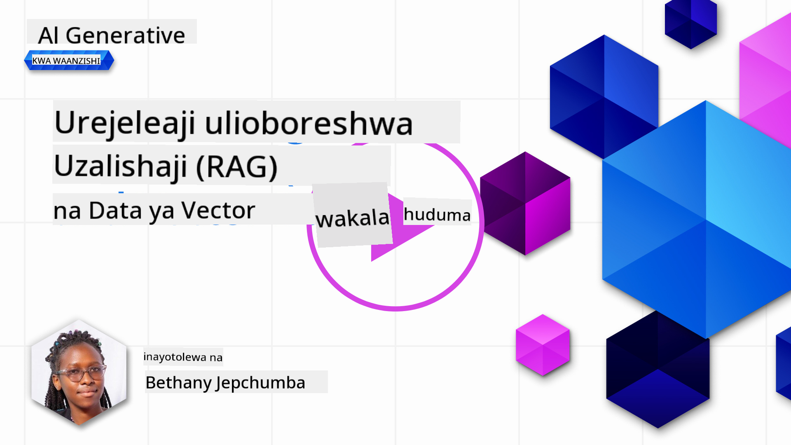
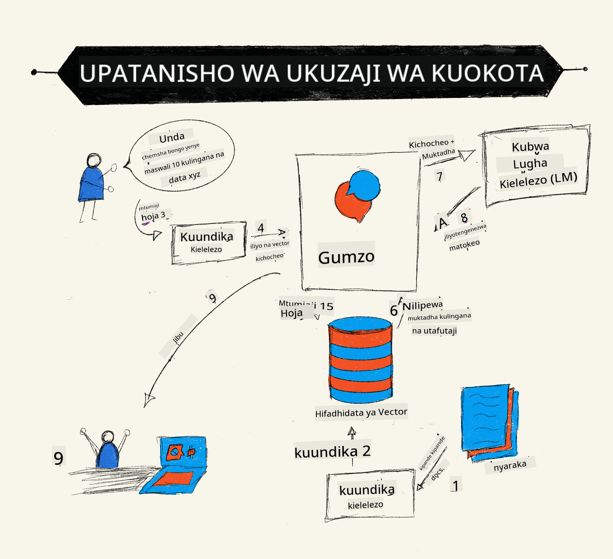
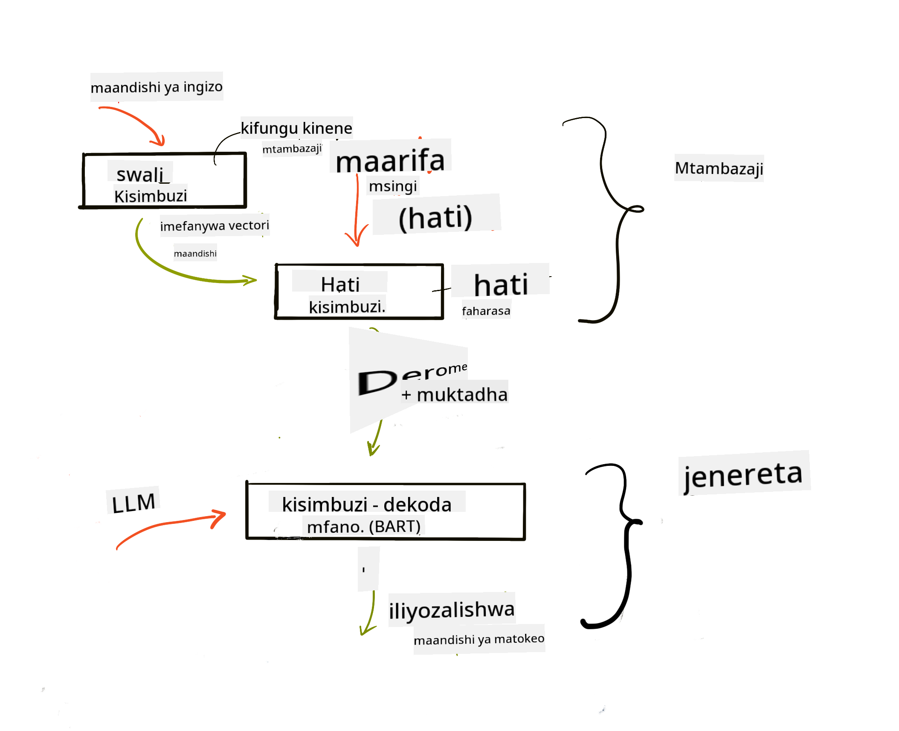
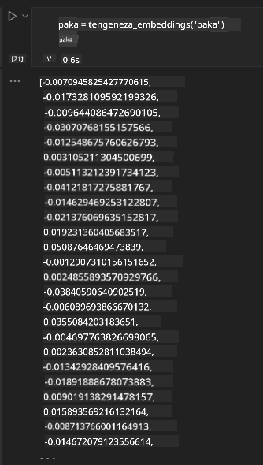

<!--
CO_OP_TRANSLATOR_METADATA:
{
  "original_hash": "e2861bbca91c0567ef32bc77fe054f9e",
  "translation_date": "2025-07-09T16:18:00+00:00",
  "source_file": "15-rag-and-vector-databases/README.md",
  "language_code": "sw"
}
-->
# Uundaji wa Kupitia Urejeshaji (RAG) na Hifadhidata za Vector

[](https://aka.ms/gen-ai-lesson15-gh?WT.mc_id=academic-105485-koreyst)

Katika somo la matumizi ya utafutaji, tulijifunza kwa ufupi jinsi ya kuingiza data yako mwenyewe katika Modeli Kubwa za Lugha (LLMs). Katika somo hili, tutaangazia zaidi dhana za kuimarisha data yako katika programu yako ya LLM, jinsi mchakato unavyofanya kazi na mbinu za kuhifadhi data, ikiwa ni pamoja na embeddings na maandishi.

> **Video Itakuja Hivi Karibuni**

## Utangulizi

Katika somo hili tutashughulikia yafuatayo:

- Utangulizi wa RAG, ni nini na kwa nini hutumika katika AI (akili bandia).

- Kuelewa ni nini hifadhidata za vector na jinsi ya kuunda moja kwa ajili ya programu yetu.

- Mfano wa vitendo wa jinsi ya kuingiza RAG katika programu.

## Malengo ya Kujifunza

Baada ya kumaliza somo hili, utaweza:

- Kueleza umuhimu wa RAG katika urejeshaji na usindikaji wa data.

- Kusanidi programu ya RAG na kuimarisha data yako kwa LLM

- Kuunganisha kwa ufanisi RAG na Hifadhidata za Vector katika Programu za LLM.

## Hali Yetu: kuboresha LLM zetu kwa data yetu wenyewe

Kwa somo hili, tunataka kuongeza maelezo yetu binafsi katika kuanzisha elimu, ambayo inaruhusu chatbot kupata taarifa zaidi kuhusu masomo mbalimbali. Kwa kutumia maelezo tuliyonayo, wanafunzi wataweza kusoma vizuri na kuelewa mada tofauti, na hivyo kurahisisha mapitio yao kwa ajili ya mitihani. Ili kuunda hali yetu, tutatumia:

- `Azure OpenAI:` LLM tutakayotumia kuunda chatbot yetu

- `Somo la AI kwa wanaoanza kuhusu Mitandao ya Neva`: hii itakuwa data tunayoimarisha LLM yetu nayo

- `Azure AI Search` na `Azure Cosmos DB:` hifadhidata za vector kuhifadhi data yetu na kuunda faharasa ya utafutaji

Watumiaji wataweza kuunda maswali ya mazoezi kutoka kwa maelezo yao, kadi za mapitio na kuyafupisha kuwa muhtasari mfupi. Ili kuanza, tuchunguze ni nini RAG na jinsi inavyofanya kazi:

## Uundaji wa Kupitia Urejeshaji (RAG)

Chatbot inayotumia LLM huchakata maelekezo ya mtumiaji ili kutoa majibu. Imeundwa kuwa na mwingiliano na kuzungumza na watumiaji kuhusu mada mbalimbali. Hata hivyo, majibu yake yanategemea muktadha uliotolewa na data ya mafunzo ya msingi. Kwa mfano, GPT-4 ina kikomo cha maarifa hadi Septemba 2021, maana yake haijui matukio yaliyotokea baada ya tarehe hiyo. Zaidi ya hayo, data iliyotumika kufundisha LLM haijumuishi taarifa za siri kama vile maelezo binafsi au mwongozo wa bidhaa za kampuni.

### Jinsi RAG (Uundaji wa Kupitia Urejeshaji) inavyofanya kazi



Fikiria unataka kuanzisha chatbot inayotengeneza maswali kutoka kwa maelezo yako, utahitaji muunganisho na hifadhidata ya maarifa. Hapa ndipo RAG inakuja kusaidia. RAG hufanya kazi kama ifuatavyo:

- **Hifadhidata ya maarifa:** Kabla ya urejeshaji, hati hizi zinahitaji kuingizwa na kusindika awali, kawaida kwa kugawanya hati kubwa kuwa vipande vidogo, kubadilisha kuwa embeddings za maandishi na kuhifadhi katika hifadhidata.

- **Swali la Mtumiaji:** mtumiaji anauliza swali

- **Urejeshaji:** Mtindo wa embedding hurejesha taarifa zinazohusiana kutoka hifadhidata yetu ya maarifa ili kutoa muktadha zaidi ambao utaingizwa kwenye maelekezo.

- **Uundaji ulioboreshwa:** LLM huongeza jibu lake kulingana na data iliyorejeshwa. Hii inaruhusu jibu lisitengenezwe tu kwa data ya mafunzo bali pia kwa taarifa zinazohusiana kutoka muktadha uliowekwa. Data iliyorejeshwa hutumika kuongeza majibu ya LLM. Kisha LLM hurudisha jibu kwa swali la mtumiaji.



Usanifu wa RAG unatekelezwa kwa kutumia transformers zenye sehemu mbili: encoder na decoder. Kwa mfano, mtumiaji anapouliza swali, maandishi ya ingizo 'huwekwa kwenye vector' zinazoshikilia maana ya maneno na vector hizo 'hutafsiriwa' kwenye faharasa ya hati na kutengeneza maandishi mapya kulingana na swali la mtumiaji. LLM hutumia mtindo wa encoder-decoder kutoa matokeo.

Mbinu mbili za kutekeleza RAG kulingana na karatasi iliyopendekezwa: [Retrieval-Augmented Generation for Knowledge intensive NLP Tasks](https://arxiv.org/pdf/2005.11401.pdf?WT.mc_id=academic-105485-koreyst) ni:

- **_RAG-Sequence_** kutumia hati zilizorejeshwa kutabiri jibu bora zaidi kwa swali la mtumiaji

- **RAG-Token** kutumia hati kutengeneza token inayofuata, kisha kuzipata tena kujibu swali la mtumiaji

### Kwa nini utumie RAG?

- **Utajiri wa taarifa:** huhakikisha majibu ya maandishi ni ya kisasa na ya sasa. Hivyo, huongeza utendaji katika kazi maalum kwa kufikia hifadhidata ya maarifa ya ndani.

- Hupunguza uongo kwa kutumia **data inayothibitishwa** katika hifadhidata kutoa muktadha kwa maswali ya watumiaji.

- Ni **gharama nafuu** kwani ni ya kiuchumi zaidi ikilinganishwa na kurekebisha LLM moja kwa moja

## Kuunda hifadhidata ya maarifa

Programu yetu inategemea data yetu binafsi ya somo la Mitandao ya Neva katika mtaala wa AI Kwa Wanaoanza.

### Hifadhidata za Vector

Hifadhidata ya vector, tofauti na hifadhidata za kawaida, ni hifadhidata maalum iliyoundwa kuhifadhi, kusimamia na kutafuta vector zilizojazwa. Huhifadhi uwakilishi wa nambari wa hati. Kugawanya data kuwa embeddings za nambari hufanya mfumo wetu wa AI kuelewa na kusindika data kwa urahisi zaidi.

Huhifadhi embeddings zetu katika hifadhidata za vector kwa sababu LLM zina kikomo cha idadi ya tokeni zinazokubali kama ingizo. Kwa kuwa huwezi kuingiza embeddings zote kwa LLM moja kwa moja, tunahitaji kuzigawanya vipande na mtumiaji anapouliza swali, embeddings zinazofanana zaidi na swali zitarejeshwa pamoja na maelekezo. Kugawanya pia hupunguza gharama kwa idadi ya tokeni zinazopitishwa kwenye LLM.

Baadhi ya hifadhidata maarufu za vector ni Azure Cosmos DB, Clarifyai, Pinecone, Chromadb, ScaNN, Qdrant na DeepLake. Unaweza kuunda mfano wa Azure Cosmos DB kwa kutumia Azure CLI kwa amri ifuatayo:

```bash
az login
az group create -n <resource-group-name> -l <location>
az cosmosdb create -n <cosmos-db-name> -r <resource-group-name>
az cosmosdb list-keys -n <cosmos-db-name> -g <resource-group-name>
```

### Kutoka maandishi hadi embeddings

Kabla ya kuhifadhi data yetu, tunahitaji kuibadilisha kuwa vector embeddings kabla ya kuhifadhiwa kwenye hifadhidata. Ikiwa unafanya kazi na hati kubwa au maandishi marefu, unaweza kuyagawanya kulingana na maswali unayotarajia. Kugawanya kunaweza kufanywa kwa sentensi au aya. Kwa kuwa kugawanya kunachukua maana kutoka kwa maneno yanayozunguka, unaweza kuongeza muktadha mwingine kwa kipande, kwa mfano, kwa kuongeza kichwa cha hati au kuingiza maandishi kabla au baada ya kipande. Unaweza kugawanya data kama ifuatavyo:

```python
def split_text(text, max_length, min_length):
    words = text.split()
    chunks = []
    current_chunk = []

    for word in words:
        current_chunk.append(word)
        if len(' '.join(current_chunk)) < max_length and len(' '.join(current_chunk)) > min_length:
            chunks.append(' '.join(current_chunk))
            current_chunk = []

    # If the last chunk didn't reach the minimum length, add it anyway
    if current_chunk:
        chunks.append(' '.join(current_chunk))

    return chunks
```

Baada ya kugawanya, tunaweza kisha kuweka maandishi yetu kwa kutumia modeli tofauti za embedding. Baadhi ya modeli unazoweza kutumia ni: word2vec, ada-002 ya OpenAI, Azure Computer Vision na nyingine nyingi. Uchaguzi wa modeli utategemea lugha unazotumia, aina ya maudhui yaliyowekwa (maandishi/picha/sauti), ukubwa wa ingizo unaoweza kuweka na urefu wa matokeo ya embedding.

Mfano wa maandishi yaliyowekwa kwa kutumia modeli ya OpenAI `text-embedding-ada-002` ni:


## Urejeshaji na Utafutaji wa Vector

Mtumiaji anapouliza swali, retriever hubadilisha kuwa vector kwa kutumia query encoder, kisha hufanya utafutaji katika faharasa yetu ya hati kwa vector zinazohusiana na ingizo. Baada ya hapo, hubadilisha vector zote za ingizo na hati kuwa maandishi na kuzipeleka kwa LLM.

### Urejeshaji

Urejeshaji hutokea wakati mfumo unapotafuta haraka hati kutoka kwenye faharasa zinazokidhi vigezo vya utafutaji. Lengo la retriever ni kupata hati zitakazotumika kutoa muktadha na kuimarisha LLM kwa data yako.

Kuna njia kadhaa za kufanya utafutaji ndani ya hifadhidata yetu kama:

- **Utafutaji kwa maneno muhimu** - hutumika kwa utafutaji wa maandishi

- **Utafutaji wa maana (semantic)** - hutumia maana ya maneno

- **Utafutaji wa vector** - hubadilisha hati kutoka maandishi hadi uwakilishi wa vector kwa kutumia modeli za embedding. Urejeshaji hufanywa kwa kuuliza hati zilizo na vector zinazofanana zaidi na swali la mtumiaji.

- **Mchanganyiko (Hybrid)** - mchanganyiko wa utafutaji wa maneno muhimu na vector.

Changamoto katika urejeshaji hutokea pale ambapo hakuna jibu linalofanana na swali katika hifadhidata, mfumo hutarajia kutoa taarifa bora zaidi anazoweza kupata, hata hivyo, unaweza kutumia mbinu kama kuweka umbali wa juu zaidi kwa umuhimu au kutumia utafutaji mchanganyiko unaochanganya maneno muhimu na vector. Katika somo hili tutatumia utafutaji mchanganyiko, mchanganyiko wa utafutaji wa vector na maneno muhimu. Tutahifadhi data yetu katika dataframe yenye safu zenye vipande pamoja na embeddings.

### Ulinganifu wa Vector

Retriever atatafuta katika hifadhidata ya maarifa kwa embeddings zinazofanana karibu, jirani wa karibu zaidi, kwa kuwa ni maandishi yanayofanana. Katika hali ambapo mtumiaji anauliza swali, kwanza huwekwa embedding kisha kulinganishwa na embeddings zinazofanana. Kipimo kinachotumika mara nyingi kupima ulinganifu wa vector ni cosine similarity inayotegemea pembe kati ya vector mbili.

Tunaweza kupima ulinganifu kwa mbadala kama umbali wa Euclidean ambao ni mstari wa moja kwa moja kati ya ncha za vector na dot product inayopima jumla ya bidhaa za vipengele vinavyolingana vya vector mbili.

### Faharasa ya utafutaji

Wakati wa urejeshaji, tunahitaji kujenga faharasa ya utafutaji kwa hifadhidata yetu ya maarifa kabla ya kufanya utafutaji. Faharasa itahifadhi embeddings zetu na inaweza kurejesha haraka vipande vinavyofanana zaidi hata katika hifadhidata kubwa. Tunaweza kuunda faharasa yetu kwa ndani kwa kutumia:

```python
from sklearn.neighbors import NearestNeighbors

embeddings = flattened_df['embeddings'].to_list()

# Create the search index
nbrs = NearestNeighbors(n_neighbors=5, algorithm='ball_tree').fit(embeddings)

# To query the index, you can use the kneighbors method
distances, indices = nbrs.kneighbors(embeddings)
```

### Upangaji upya (Re-ranking)

Baada ya kuuliza hifadhidata, unaweza kuhitaji kupanga matokeo kutoka yale yenye umuhimu zaidi. LLM ya upangaji upya hutumia Machine Learning kuboresha umuhimu wa matokeo ya utafutaji kwa kuyapanga kutoka muhimu zaidi. Kwa kutumia Azure AI Search, upangaji upya hufanywa moja kwa moja kwa kutumia semantic reranker. Mfano wa jinsi upangaji upya unavyofanya kazi kwa kutumia majirani wa karibu:

```python
# Find the most similar documents
distances, indices = nbrs.kneighbors([query_vector])

index = []
# Print the most similar documents
for i in range(3):
    index = indices[0][i]
    for index in indices[0]:
        print(flattened_df['chunks'].iloc[index])
        print(flattened_df['path'].iloc[index])
        print(flattened_df['distances'].iloc[index])
    else:
        print(f"Index {index} not found in DataFrame")
```

## Kuunganisha yote pamoja

Hatua ya mwisho ni kuongeza LLM yetu ili kupata majibu yanayoimarishwa na data yetu. Tunaweza kutekeleza kama ifuatavyo:

```python
user_input = "what is a perceptron?"

def chatbot(user_input):
    # Convert the question to a query vector
    query_vector = create_embeddings(user_input)

    # Find the most similar documents
    distances, indices = nbrs.kneighbors([query_vector])

    # add documents to query  to provide context
    history = []
    for index in indices[0]:
        history.append(flattened_df['chunks'].iloc[index])

    # combine the history and the user input
    history.append(user_input)

    # create a message object
    messages=[
        {"role": "system", "content": "You are an AI assistant that helps with AI questions."},
        {"role": "user", "content": history[-1]}
    ]

    # use chat completion to generate a response
    response = openai.chat.completions.create(
        model="gpt-4",
        temperature=0.7,
        max_tokens=800,
        messages=messages
    )

    return response.choices[0].message

chatbot(user_input)
```

## Kutathmini programu yetu

### Vigezo vya Tathmini

- Ubora wa majibu yaliyotolewa kuhakikisha yanasikika ya asili, yenye mtiririko na kama ya binadamu

- Uimarishaji wa data: kutathmini kama jibu lililotoka kwenye hati zilizotolewa

- Umuhimu: kutathmini kama jibu linaendana na swali liloulizwa

- Mtiririko - kama jibu linaeleweka kisarufi

## Matumizi ya RAG (Uundaji wa Kupitia Urejeshaji) na hifadhidata za vector

Kuna matumizi mengi tofauti ambapo simu za kazi zinaweza kuboresha programu yako kama:

- Maswali na Majibu: kuimarisha data ya kampuni yako kwa mazungumzo yanayotumika na wafanyakazi kuuliza maswali.

- Mifumo ya Mapendekezo: ambapo unaweza kuunda mfumo unaolingana na thamani zinazofanana zaidi kama sinema, migahawa na mengine mengi.

- Huduma za Chatbot: unaweza kuhifadhi historia ya mazungumzo na kubinafsisha mazungumzo kulingana na data ya mtumiaji.

- Utafutaji wa picha kwa kutumia embeddings za vector, muhimu wakati wa utambuzi wa picha na kugundua kasoro.

## Muhtasari

Tumefunika maeneo muhimu ya RAG kuanzia kuongeza data yetu kwenye programu, swali la mtumiaji na matokeo. Ili kurahisisha uundaji wa RAG, unaweza kutumia mifumo kama Semanti Kernel, Langchain au Autogen.

## Kazi ya Nyumbani

Ili kuendelea na kujifunza kwa Uundaji wa Kupitia Urejeshaji (RAG) unaweza kujenga:

- Tengeneza sehemu ya mbele ya programu kwa kutumia mfumo wa chaguo lako

- Tumia mfumo, iwe LangChain au Semantic Kernel, na uunde tena programu yako.

Hongera kwa kumaliza somo 👏.

## Kujifunza hakukomi hapa, endelea Safari

Baada ya kumaliza somo hili, angalia [Mkusanyiko wetu wa Kujifunza AI ya Kizazi](https://aka.ms/genai-collection?WT.mc_id=academic-105485-koreyst) ili kuendelea kuongeza maarifa yako ya AI ya Kizazi!

**Kiarifu cha Kutotegemea**:  
Hati hii imetafsiriwa kwa kutumia huduma ya tafsiri ya AI [Co-op Translator](https://github.com/Azure/co-op-translator). Ingawa tunajitahidi kwa usahihi, tafadhali fahamu kwamba tafsiri za kiotomatiki zinaweza kuwa na makosa au upungufu wa usahihi. Hati ya asili katika lugha yake ya asili inapaswa kuchukuliwa kama chanzo cha mamlaka. Kwa taarifa muhimu, tafsiri ya kitaalamu inayofanywa na binadamu inashauriwa. Hatuna dhamana kwa kutoelewana au tafsiri potofu zinazotokana na matumizi ya tafsiri hii.