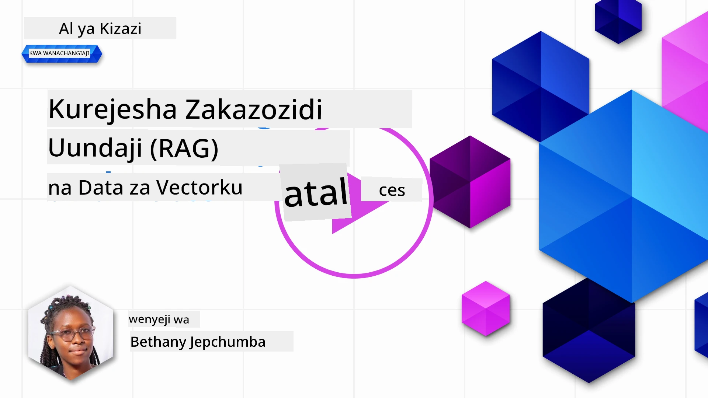
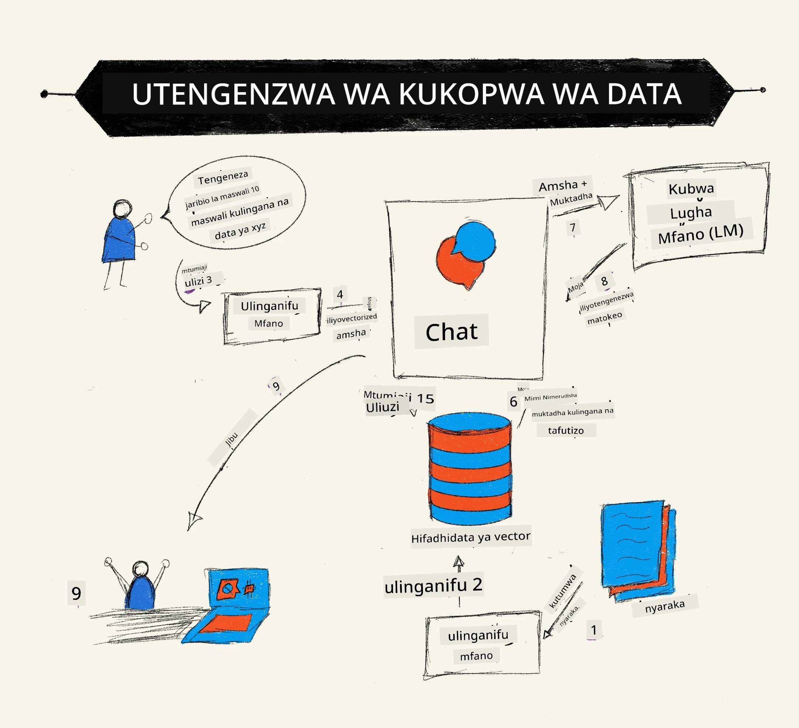
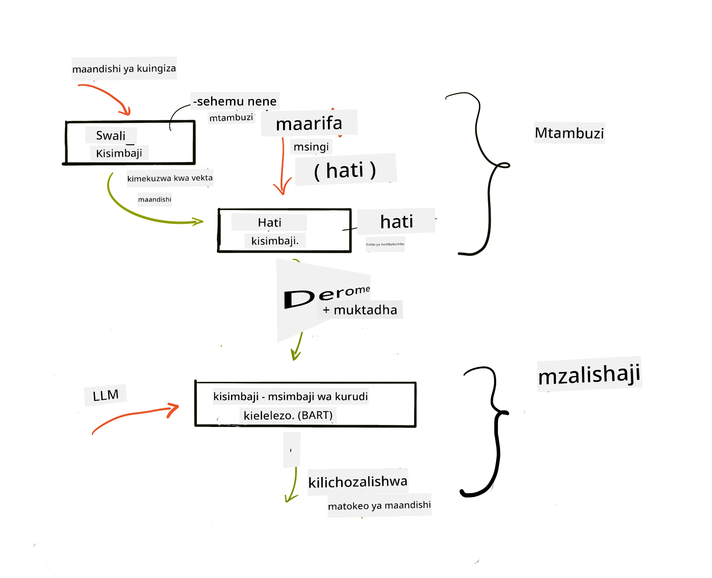

# Uundaji Ulioboreshwa kwa Kupata Taarifa (RAG) na Hifadhidata za Vector

[](https://youtu.be/4l8zhHUBeyI?si=BmvDmL1fnHtgQYkL)

Katika somo la programu za utafutaji, tulijifunza kwa kifupi jinsi ya kuunganisha data yako mwenyewe ndani ya Mifumo ya Lugha Kubwa (LLMs). Katika somo hili, tutaelekea zaidi katika dhana za kuweka data yako kwenye programu yako ya LLM, mbinu za mchakato na njia za kuhifadhi data, ikijumuisha embeddings na maandishi.

> **Video Inakuja Karibu**

## Utangulizi

Katika somo hili tutashughulikia yafuatayo:

- Utangulizi wa RAG, ni nini na kwa nini inatumika katika AI (akili bandia).

- Kuelewa ni nini hifadhidata za vector na kuunda moja kwa ajili ya programu yetu.

- Mfano wa vitendo jinsi ya kuingiza RAG katika programu.

## Malengo ya Kujifunza

Baada ya kumaliza somo hili, utaweza:

- Eleza umuhimu wa RAG katika kupata na kuchakata data.

- Sanidi programu ya RAG na uweke data zako kwenye LLM

- Uingiliano mzuri wa RAG na Hifadhidata za Vector katika Programu za LLM.

## Muktadha Wetu: kuboresha LLM zetu na data zetu wenyewe

Kwa somo hili, tunataka kuongeza maelezo yetu binafsi kwenye kuanzishwa kwa elimu, ambayo huruhusu chatbot kupata taarifa zaidi juu ya masomo tofauti. Kwa kutumia maelezo tuliyonayo, wanafunzi wataweza kusoma kwa ufanisi zaidi na kuelewa mada tofauti, na kurahisisha mapitio ya mitihani yao. Kuunda muktadha wetu, tutatumia:

- `Azure OpenAI:` LLM tutakayotumia kuunda chatbot yetu

- `Somo la AI kwa Waanzilishi kuhusu Mitandao ya Neva`: hii itakuwa data tunayoweka kwenye LLM yetu

- `Azure AI Search` na `Azure Cosmos DB:` hifadhidata za vector kuhifadhi data yetu na kuunda kiashiria cha utafutaji

Watumiaji wataweza kuunda mazoezi ya maswali kutoka kwa maelezo yao, kadi za mapitio na kufupisha maelezo kuwa muhtasari mfupi. Ili kuanza, tuchunguze ni nini RAG na jinsi inavyofanya kazi:

## Uundaji Ulioboreshwa kwa Kupata Taarifa (RAG)

Chatbot inayotumia LLM inashughulikia maagizo ya watumiaji kutengeneza majibu. Imesanifiwa kuwa na mwingiliano na kuwahudumia watumiaji kwa mada nyingi. Hata hivyo, majibu yake yanategemea muktadha uliotolewa na data ya msingi ya mafunzo. Kwa mfano, GPT-4 inajua hadi Septemba 2021, maana yake haina taarifa za matukio baada ya muda huo. Zaidi ya hayo, data inayotumiwa kufundisha LLM haijumuishi taarifa za siri kama maelezo binafsi au mwongozo wa bidhaa za kampuni.

### Jinsi RAG (Uundaji Ulioboreshwa kwa Kupata Taarifa) inavyofanya kazi



Fikiria unataka kuanzisha chatbot inayounda maswali kutoka kwa maelezo yako, utahitaji muunganisho na hifadhidata ya maarifa. Hapa ndipo RAG inapoingia. RAG inafanya kazi kama ifuatavyo:

- **Hifadhidata ya Maarifa:** Kabla ya kupata, nyaraka hizi zinapaswa kuingizwa na kuandaliwa, kawaida kwa kugawanya nyaraka kubwa sehemu ndogo, kubadilisha kuwa embeddings za maandishi na kuhifadhi katika hifadhidata.

- **Swali la Mtumiaji:** mtumiaji anauliza swali

- **Upatikanaji:** Mtandao wa embeddings unapata taarifa muhimu kutoka hifadhidata yetu ili kutoa muktadha zaidi unaoingizwa kwenye ombi.

- **Uundaji Ulioboreshwa:** LLM huboresha jibu lake kulingana na data yenyewe iliyopatikana. Inaruhusu jibu si tu juu ya data ya mafunzo bali pia taarifa muhimu kutoka muktadha ulioongezwa. Data iliyopatikana hutumika kuongeza majibu ya LLM. Kisha LLM hurudisha jibu kwa swali la mtumiaji.



Usanifu wa RAG unatekelezwa kwa kutumia transformers zinazojumuisha sehemu mbili: encoder na decoder. Kwa mfano, mtumiaji anapoomba swali, maandishi yake hugeuzwa kuwa vectors zinazoonyesha maana ya maneno na vectors hizi hurejelewa kwenye kiashiria chetu cha nyaraka na kutengeneza maandishi mapya kulingana na swali la mtumiaji. LLM hutumia modeli za encoder-decoder kutoa matokeo.

Mbinu mbili wakati wa kutekeleza RAG kulingana na karatasi iliyopendekezwa: [Retrieval-Augmented Generation for Knowledge intensive NLP (natural language processing software) Tasks](https://arxiv.org/pdf/2005.11401.pdf?WT.mc_id=academic-105485-koreyst) ni:

- **_RAG-Sequence_** kutumia nyaraka zilizopatikana kutabiri jibu bora kwa swali la mtumiaji

- **RAG-Token** kutumia nyaraka kutengeneza token inayofuata, kisha kuzipata tena kutoa jibu la swali la mtumiaji

### Kwa nini utumie RAG? 

- **Utoaji wa taarifa za kina:** huhakikisha majibu ya maandishi ni ya sasa na ya hivi punde. Hii huboresha utendaji katika kazi za maeneo maalum kwa kupata hifadhidata ya ndani.

- Hupunguza habari za uongo kwa kutumia **data inayethibitishwa** katika hifadhidata kutoa muktadha kwa maswali ya watumiaji.

- Ni **gharama nafuu** kwani ni ya kiuchumi zaidi ikilinganishwa na kurekebisha LLM

## Kuunda Hifadhidata ya Maarifa

Programu yetu inategemea data yetu binafsi ya somo la Mitandao ya Neva katika mafunzo ya AI Kwa Waanzilishi.

### Hifadhidata za Vector

Hifadhidata ya vector, tofauti na hifadhidata za kawaida, ni hifadhidata maalum iliyoundwa kuhifadhi, kusimamia na kutafuta vectors zilizoingizwa. Hifadhi mawakilisho ya nambari ya nyaraka. Kugawanya data kuwa embeddings za nambari hufanya mfumo wetu wa AI kuelewa na kuchakata data kirahisi.

Tunaweka embeddings zetu katika hifadhidata za vector kwani LLM zina kikomo cha idadi ya tokens zinazokubali kama ingizo. Kwa kuwa huwezi kuingiza embeddings zote kwa LLM, tunapaswa kuzigawanya sehemu na mtumiaji anapoomba swali, embeddings zinazofanana zaidi na swali zitarejeshwa pamoja na ombi. Kugawanya husaidia pia kupunguza gharama kwa tokens zinazopita kwenye LLM.

Baadhi ya hifadhidata maarufu za vector ni Azure Cosmos DB, Clarifyai, Pinecone, Chromadb, ScaNN, Qdrant na DeepLake. Unaweza kuunda mfano wa Azure Cosmos DB kwa kutumia Azure CLI kwa amri ifuatayo:

```bash
az login
az group create -n <resource-group-name> -l <location>
az cosmosdb create -n <cosmos-db-name> -r <resource-group-name>
az cosmosdb list-keys -n <cosmos-db-name> -g <resource-group-name>
```

### Kutoka maandishi hadi embeddings

Kabla ya kuhifadhi data yetu, tunahitaji kuibadilisha kuwa vector embeddings kabla ya kuhifadhiwa kwenye hifadhidata. Ikiwa unafanya kazi na nyaraka kubwa au maandishi marefu, unaweza kuzitenganisha kulingana na maswali unayotarajia. Ugawanyo unaweza kufanywa kwa sentensi, au aya. Ugawanyo huchukua maana kutoka kwa maneno yanayozunguka, unaweza kuongeza muktadha mwingine kwenye kifungu, kwa mfano, kwa kuongeza kichwa cha hati au kuingiza maandishi kabla au baada ya kifungu. Unaweza kugawanya data kama ifuatavyo:

```python
def split_text(text, max_length, min_length):
    words = text.split()
    chunks = []
    current_chunk = []

    for word in words:
        current_chunk.append(word)
        if len(' '.join(current_chunk)) < max_length and len(' '.join(current_chunk)) > min_length:
            chunks.append(' '.join(current_chunk))
            current_chunk = []

    # Ikiwa kipande cha mwisho hakifikii urefu wa chini kabisa, ongeza hata hivyo
    if current_chunk:
        chunks.append(' '.join(current_chunk))

    return chunks
```

Mara baada ya kugawanywa, tunaweza kisha kuwekeza maandishi yetu kwa kutumia modeli tofauti za embedding. Baadhi ya modeli unazoweza kutumia ni: word2vec, ada-002 ya OpenAI, Azure Computer Vision na nyingine nyingi. Kuchagua modeli kutegemea lugha unazotumia, aina ya maudhui yaliyofichwa (maandishi/picha/sauti), ukubwa wa input inayoweza kufichwa na urefu wa output wa embedding.

Mfano wa maandishi yaliyoingizwa kwa kutumia mfano wa OpenAI `text-embedding-ada-002` ni:


## Upatikanaji na Utafutaji wa Vector

Mtumiaji anapoomba swali, retriever hubadilisha kuwa vector kwa kutumia query encoder, kisha inatafuta katika kiashiria chetu cha nyaraka vectors zinazohusiana na ingizo. Baada ya hapo, hubadilisha vector za ingizo na nyaraka kuwa maandishi na kuzipitisha kwa LLM.

### Upatikanaji

Upatikanaji hutokea wakati mfumo unapojaribu haraka kupata nyaraka kutoka kiashiria kinachokidhi vigezo vya utafutaji. Lengo la retriever ni kupata nyaraka zitakazotumika kutoa muktadha na kuweka msingi wa LLM kwenye data zako.

Kuna njia tofauti za kufanya utafutaji ndani ya hifadhidata yetu kama:

- **Utafutaji kwa Maneno Muhimu** - hutumiwa kwa utafutaji wa maandishi

- **Utafutaji wa Vector** - hubadilisha nyaraka kutoka maandishi hadi mawakilisho ya vector kwa kutumia modeli za embedding, kuruhusu **utafutaji wa maana** kwa kutumia maana ya maneno. Upatikanaji unafanywa kwa kuuliza nyaraka zilizo na vectors karibu zaidi na swali la mtumiaji.

- **Mchanganyiko** - mchanganyiko wa utafutaji wa Maneno Muhimu na Vector.

Changamoto ya upatikanaji hutokea pale hakuna jibu linalofanana na swali katika hifadhidata, basi mfumo utarejesha taarifa bora anazoweza kupata, hata hivyo, unaweza kutumia mbinu kama kuweka umbali mkubwa zaidi kwa umuhimu au kutumia utafutaji mchanganyiko unaochanganya maneno muhimu na vector. Katika somo hili tutatumia utafutaji mchanganyiko, mchanganyiko wa utafutaji wa vector na maneno muhimu. Tutahifadhi data yetu katika dataframe yenye safu zenye sehemu zilizogawanyika pamoja na embeddings.

### Ufanano wa Vector

Retriever atatafuta ndani ya hifadhidata maarifa kwa ajili ya embeddings zilizo karibu, jirani wa karibu zaidi, kwani ni maandishi yanayofanana. Katika muktadha mtumiaji anapoomba swali, kwanza huwekewa embedding kisha kulinganishwa na embeddings zinazofanana. Kipimo kinachotumika mara nyingi kuamua jinsi vectors tofauti zinavyofanana ni cosine similarity inayotegemea pembe kati ya vectors mbili.

Tunaweza kupima ufanano kwa kutumia mbadala nyingine kama Euclidean distance ambayo ni mstari wa moja kwa moja kati ya ncha za vector na dot product inayopima jumla ya bidhaa za vipengele vinavyolingana vya vectors mbili.

### Kiashiria cha utafutaji

Tunapofanya upatikanaji, tunahitaji kuunda kiashiria cha utafutaji kwa hifadhidata yetu kabla ya kufanya utafutaji. Kiashiria kitahifadhi embeddings zetu na kwa haraka kurudisha sehemu zinazofanana zaidi hata kwenye hifadhidata kubwa. Tunaweza kuunda kiashiria chetu kwa ndani kwa kutumia:

```python
from sklearn.neighbors import NearestNeighbors

embeddings = flattened_df['embeddings'].to_list()

# Unda faharasa ya utafutaji
nbrs = NearestNeighbors(n_neighbors=5, algorithm='ball_tree').fit(embeddings)

# Kuuliza faharasa, unaweza kutumia njia ya kneighbors
distances, indices = nbrs.kneighbors(embeddings)
```

### Kuandaa upya matokeo

Mara unauliza hifadhidata, unaweza kuhitaji kupanga matokeo kutoka yale yenye umuhimu mkubwa zaidi. Reranking LLM hutumia Machine Learning kuboresha umuhimu wa matokeo ya utafutaji kwa kuwapanga kutoka wenye umuhimu zaidi. Kwa kutumia Azure AI Search, kuandaa upya matokeo hufanyika kiotomatiki kwa kutumia semantic reranker. Mfano wa jinsi reranking inavyofanya kazi kwa kutumia majirani wa karibu:

```python
# Pata nyaraka zinazofanana zaidi
distances, indices = nbrs.kneighbors([query_vector])

index = []
# Chapisha nyaraka zinazofanana zaidi
for i in range(3):
    index = indices[0][i]
    for index in indices[0]:
        print(flattened_df['chunks'].iloc[index])
        print(flattened_df['path'].iloc[index])
        print(flattened_df['distances'].iloc[index])
    else:
        print(f"Index {index} not found in DataFrame")
```

## Kuweka yote pamoja

Hatua ya mwisho ni kuongeza LLM yetu kwenye mchanganyiko ili kupata majibu yaliyosimama kwenye data yetu. Tunaweza kutekeleza kama ifuatavyo:

```python
user_input = "what is a perceptron?"

def chatbot(user_input):
    # Badilisha swali kuwa vector ya uchunguzi
    query_vector = create_embeddings(user_input)

    # Tafuta nyaraka zinazofanana zaidi
    distances, indices = nbrs.kneighbors([query_vector])

    # ongeza nyaraka kwa uchunguzi ili kutoa muktadha
    history = []
    for index in indices[0]:
        history.append(flattened_df['chunks'].iloc[index])

    # changanya historia na ingizo la mtumiaji
    history.append(user_input)

    # tengeneza kitu cha ujumbe
    messages=[
        {"role": "system", "content": "You are an AI assistant that helps with AI questions."},
        {"role": "user", "content": "\n\n".join(history) }
    ]

    # tumia API ya Majibu kuunda jibu
    response = client.responses.create(
        model="gpt-5-mini",
        max_output_tokens=800,
        input=messages,
        store=False,
    )

    return response.output_text

chatbot(user_input)
```

## Kutathmini programu yetu

### Vigezo vya Tathmini

- Ubora wa majibu yaliyotolewa kuhakikisha yanasikika kwa asili, kwa ufasaha na kama ya mwanadamu

- Kuweka msingi wa data: kutathmini iwapo jibu lililotolewa linatokana na nyaraka zilizotolewa

- Umuhimu: kutathmini kama jibu linaendana na swali liloulizwa

- Ufasaha - kama jibu lina mantiki kisarufi

## Matumizi ya RAG (Uundaji Ulioboreshwa kwa Kupata Taarifa) na hifadhidata za vector

Kuna matumizi mengi ambapo simu za kazi zinaweza kuboresha programu yako kama:

- Maswali na Majibu: kuweka data ya kampuni yako kwenye mazungumzo yanayotumiwa na wafanyakazi kuuliza maswali.

- Mifumo ya Mapendekezo: ambapo unaweza kuunda mfumo unaolinganya thamani zinazofanana zaidi mfano filamu, migahawa na mengine mengi.

- Huduma za Chatbot: unaweza kuhifadhi kumbukumbu za mazungumzo na kubinafsisha mazungumzo kulingana na data ya mtumiaji.

- Utafutaji wa picha kulingana na embeddings za vector, muhimu kwa utambuzi wa picha na kugundua kasoro.

## Muhtasari

Tumekuzungumzia maeneo msingi ya RAG kutoka kuongeza data kwenye programu, swali la mtumiaji na matokeo. Ili kurahisisha uundaji wa RAG, unaweza kutumia mifumo kama Semanti Kernel, Langchain au Autogen.

## Kazi

Kuendelea na kujifunza kwako kuhusu Uundaji Ulioboreshwa kwa Kupata Taarifa (RAG) unaweza kuunda:

- Jenga sehemu ya mbele ya programu kwa kutumia mfumo wa uchaguzi wako

- Tumia mfumo, LangChain au Semantic Kernel, na ubadilishe tena programu yako.

Hongera kwa kumaliza somo 👏.

## Kujifunza hakumalizwi hapa, endelea Safari

Baada ya kumaliza somo hili, angalia [Mkusanyiko wetu wa Kujifunza AI Inayounda](https://aka.ms/genai-collection?WT.mc_id=academic-105485-koreyst) ili kuendelea kuongeza maarifa yako ya AI Inayounda!

---

<!-- CO-OP TRANSLATOR DISCLAIMER START -->
**Kionyozo**:
Hati hii imetafsiriwa kwa kutumia huduma ya tafsiri ya AI [Co-op Translator](https://github.com/Azure/co-op-translator). Ingawa tunajitahidi kupata usahihi, tafadhali fahamu kwamba tafsiri za kiotomatiki zinaweza kuwa na makosa au upungufu wa usahihi. Hati ya asili katika lugha yake halisi inapaswa kuchukuliwa kama chanzo cha mamlaka. Kwa taarifa muhimu, tafsiri ya kitaalamu inayofanywa na binadamu inapendekezwa. Hatutojibu kwa kuelewa vibaya au tafsiri potofu zinazotokea kutokana na matumizi ya tafsiri hii.
<!-- CO-OP TRANSLATOR DISCLAIMER END -->