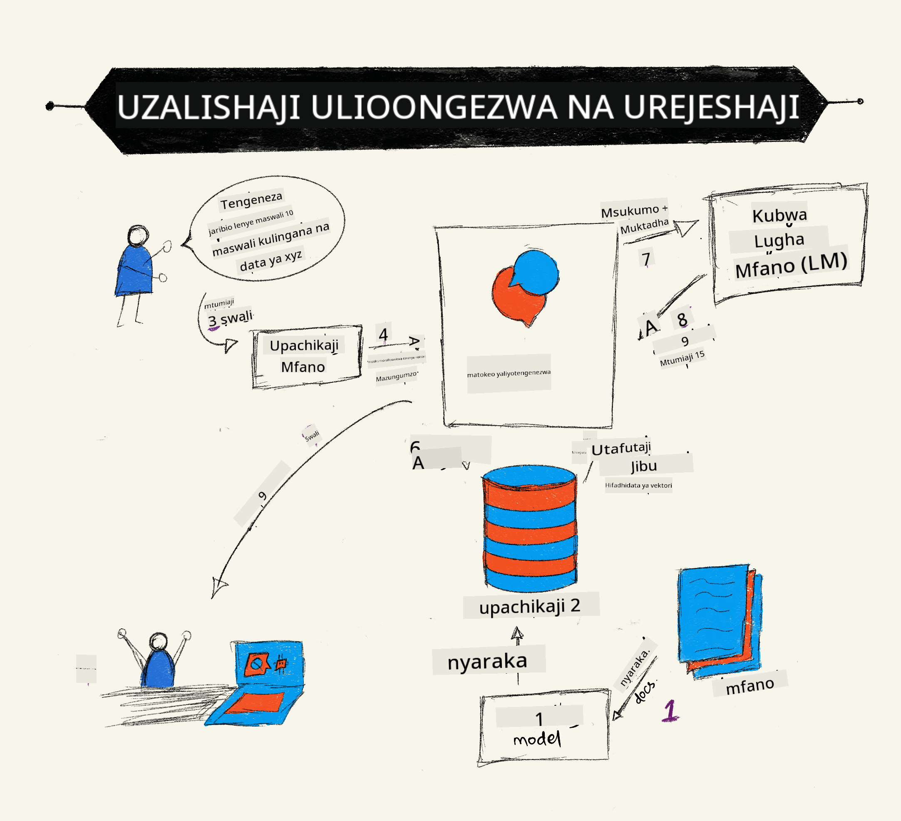

<!--
CO_OP_TRANSLATOR_METADATA:
{
  "original_hash": "b4b0266fbadbba7ded891b6485adc66d",
  "translation_date": "2025-10-17T21:12:51+00:00",
  "source_file": "15-rag-and-vector-databases/README.md",
  "language_code": "sw"
}
-->
# Urejeshaji wa Uzalishaji Ulioimarishwa (RAG) na Hifadhidata za Vector

[](https://youtu.be/4l8zhHUBeyI?si=BmvDmL1fnHtgQYkL)

Katika somo la programu za utafutaji, tulijifunza kwa kifupi jinsi ya kuunganisha data yako mwenyewe kwenye Miundo Mikubwa ya Lugha (LLMs). Katika somo hili, tutachunguza zaidi dhana za kuimarisha data yako katika programu ya LLM, mbinu za mchakato na njia za kuhifadhi data, ikiwa ni pamoja na embeddings na maandishi.

> **Video Inakuja Hivi Karibuni**

## Utangulizi

Katika somo hili tutashughulikia yafuatayo:

- Utangulizi wa RAG, ni nini na kwa nini inatumika katika AI (akili bandia).

- Kuelewa hifadhidata za vector ni nini na kuunda moja kwa programu yetu.

- Mfano wa vitendo wa jinsi ya kuunganisha RAG katika programu.

## Malengo ya Kujifunza

Baada ya kukamilisha somo hili, utaweza:

- Kuelezea umuhimu wa RAG katika urejeshaji na usindikaji wa data.

- Kuweka programu ya RAG na kuimarisha data yako kwa LLM.

- Kuunganisha kwa ufanisi RAG na Hifadhidata za Vector katika Programu za LLM.

## Hali Yetu: Kuimarisha LLM zetu kwa data yetu wenyewe

Kwa somo hili, tunataka kuongeza maelezo yetu wenyewe katika kampuni ya elimu, ambayo inaruhusu chatbot kupata maelezo zaidi kuhusu mada mbalimbali. Kwa kutumia maelezo tuliyonayo, wanafunzi wataweza kusoma vizuri zaidi na kuelewa mada mbalimbali, na kufanya iwe rahisi kujiandaa kwa mitihani yao. Ili kuunda hali yetu, tutatumia:

- `Azure OpenAI:` LLM tutakayotumia kuunda chatbot yetu.

- `Somo la AI kwa wanaoanza kuhusu Mitandao ya Neural:` hii itakuwa data tunayoimarisha LLM yetu.

- `Azure AI Search` na `Azure Cosmos DB:` hifadhidata ya vector kuhifadhi data yetu na kuunda index ya utafutaji.

Watumiaji wataweza kuunda mazoezi ya maswali kutoka kwa maelezo yao, kadi za kukumbuka kwa marudio na kuyafupisha kwa muhtasari mfupi. Ili kuanza, hebu tuangalie RAG ni nini na jinsi inavyofanya kazi:

## Urejeshaji wa Uzalishaji Ulioimarishwa (RAG)

Chatbot inayotumia LLM inachakata maelezo ya mtumiaji ili kutoa majibu. Imeundwa kuwa ya maingiliano na inashirikiana na watumiaji kuhusu mada mbalimbali. Hata hivyo, majibu yake yanapunguzwa na muktadha uliotolewa na data yake ya msingi ya mafunzo. Kwa mfano, maarifa ya GPT-4 yanakoma Septemba 2021, ikimaanisha, haina maarifa ya matukio yaliyotokea baada ya kipindi hiki. Aidha, data iliyotumika kufundisha LLMs haijumuishi maelezo ya siri kama maelezo ya kibinafsi au mwongozo wa bidhaa wa kampuni.

### Jinsi RAGs (Urejeshaji wa Uzalishaji Ulioimarishwa) zinavyofanya kazi



Tuseme unataka kuanzisha chatbot inayounda maswali ya mazoezi kutoka kwa maelezo yako, utahitaji muunganisho na hifadhidata ya maarifa. Hapa ndipo RAG inakuja kusaidia. RAGs hufanya kazi kama ifuatavyo:

- **Hifadhidata ya maarifa:** Kabla ya urejeshaji, nyaraka hizi zinahitaji kuingizwa na kuchakatwa, kwa kawaida kugawanya nyaraka kubwa kuwa vipande vidogo, kuzibadilisha kuwa embeddings za maandishi na kuzihifadhi katika hifadhidata.

- **Swali la mtumiaji:** mtumiaji anauliza swali.

- **Urejeshaji:** Wakati mtumiaji anauliza swali, modeli ya embedding inarejesha maelezo husika kutoka kwa hifadhidata yetu ya maarifa ili kutoa muktadha zaidi ambao utaingizwa katika maelezo.

- **Uzalishaji Ulioimarishwa:** LLM inaboresha jibu lake kulingana na data iliyorejeshwa. Inaruhusu jibu lililotolewa kuwa si tu kulingana na data ya mafunzo ya awali bali pia maelezo husika kutoka kwa muktadha ulioongezwa. Data iliyorejeshwa hutumika kuimarisha majibu ya LLM. LLM kisha inarudisha jibu kwa swali la mtumiaji.


Usanifu wa RAGs unatekelezwa kwa kutumia transformers zinazojumuisha sehemu mbili: encoder na decoder. Kwa mfano, wakati mtumiaji anauliza swali, maandishi ya pembejeo 'yanakodishwa' kuwa vectors zinazoshika maana ya maneno na vectors 'zinakodolewa' katika index ya nyaraka zetu na kuzalisha maandishi mapya kulingana na swali la mtumiaji. LLM hutumia modeli ya encoder-decoder kuzalisha matokeo.

Njia mbili za kutekeleza RAG kulingana na karatasi iliyopendekezwa: [Urejeshaji wa Uzalishaji Ulioimarishwa kwa Kazi za NLP (usindikaji wa lugha asilia)](https://arxiv.org/pdf/2005.11401.pdf?WT.mc_id=academic-105485-koreyst) ni:

- **_RAG-Sequence_** kutumia nyaraka zilizorejeshwa kutabiri jibu bora zaidi kwa swali la mtumiaji.

- **RAG-Token** kutumia nyaraka kuzalisha tokeni inayofuata, kisha kuzirejesha kujibu swali la mtumiaji.

### Kwa nini utumie RAGs? 

- **Utajiri wa maelezo:** huhakikisha majibu ya maandishi ni ya kisasa na ya sasa. Kwa hivyo, huongeza utendaji kwenye kazi maalum za kikoa kwa kufikia hifadhidata ya ndani.

- Hupunguza uzushi kwa kutumia **data inayothibitishwa** katika hifadhidata ya maarifa kutoa muktadha kwa maswali ya mtumiaji.

- Ni **ghali kidogo** kwani ni ya kiuchumi zaidi ikilinganishwa na kurekebisha LLM.

## Kuunda hifadhidata ya maarifa

Programu yetu inategemea data yetu binafsi yaani, somo la Mitandao ya Neural katika mtaala wa AI kwa Wanaoanza.

### Hifadhidata za Vector

Hifadhidata ya vector, tofauti na hifadhidata za jadi, ni hifadhidata maalum iliyoundwa kuhifadhi, kudhibiti na kutafuta vectors zilizowekwa. Inahifadhi uwakilishi wa nambari wa nyaraka. Kuvunja data kuwa embeddings za nambari hufanya iwe rahisi kwa mfumo wetu wa AI kuelewa na kuchakata data.

Tunapohifadhi embeddings zetu katika hifadhidata za vector kwa kuwa LLMs zina kikomo cha idadi ya tokeni wanazokubali kama pembejeo. Kwa kuwa huwezi kupitisha embeddings zote kwa LLM, tutahitaji kuzivunja kuwa vipande na wakati mtumiaji anauliza swali, embeddings zinazofanana zaidi na swali zitarudishwa pamoja na maelezo. Kuvunja pia hupunguza gharama za idadi ya tokeni zinazopitishwa kupitia LLM.

Baadhi ya hifadhidata maarufu za vector ni pamoja na Azure Cosmos DB, Clarifyai, Pinecone, Chromadb, ScaNN, Qdrant na DeepLake. Unaweza kuunda modeli ya Azure Cosmos DB kwa kutumia Azure CLI na amri ifuatayo:

```bash
az login
az group create -n <resource-group-name> -l <location>
az cosmosdb create -n <cosmos-db-name> -r <resource-group-name>
az cosmosdb list-keys -n <cosmos-db-name> -g <resource-group-name>
```

### Kutoka maandishi hadi embeddings

Kabla ya kuhifadhi data yetu, tutahitaji kuibadilisha kuwa embeddings za vector kabla ya kuhifadhiwa katika hifadhidata. Ikiwa unafanya kazi na nyaraka kubwa au maandishi marefu, unaweza kuyavunja kulingana na maswali unayotarajia. Kuvunja kunaweza kufanywa katika kiwango cha sentensi, au katika kiwango cha aya. Kwa kuwa kuvunja kunachukua maana kutoka kwa maneno yanayozunguka, unaweza kuongeza muktadha mwingine kwa kipande, kwa mfano, kwa kuongeza kichwa cha nyaraka au kujumuisha maandishi fulani kabla au baada ya kipande. Unaweza kuvunja data kama ifuatavyo:

```python
def split_text(text, max_length, min_length):
    words = text.split()
    chunks = []
    current_chunk = []

    for word in words:
        current_chunk.append(word)
        if len(' '.join(current_chunk)) < max_length and len(' '.join(current_chunk)) > min_length:
            chunks.append(' '.join(current_chunk))
            current_chunk = []

    # If the last chunk didn't reach the minimum length, add it anyway
    if current_chunk:
        chunks.append(' '.join(current_chunk))

    return chunks
```

Mara baada ya kuvunjwa, tunaweza kisha kuweka maandishi yetu kwa kutumia modeli tofauti za embedding. Baadhi ya modeli unazoweza kutumia ni pamoja na: word2vec, ada-002 na OpenAI, Azure Computer Vision na nyingine nyingi. Kuchagua modeli ya kutumia kutategemea lugha unazotumia, aina ya maudhui yanayowekwa (maandishi/picha/sauti), ukubwa wa pembejeo inayoweza kuwekwa na urefu wa matokeo ya embedding.

Mfano wa maandishi yaliyowekwa kwa kutumia modeli ya OpenAI `text-embedding-ada-002` ni:


## Urejeshaji na Utafutaji wa Vector

Wakati mtumiaji anauliza swali, retriever hubadilisha kuwa vector kwa kutumia encoder ya swali, kisha hutafuta kupitia index ya utafutaji wa nyaraka zetu kwa vectors husika katika nyaraka zinazohusiana na pembejeo. Mara baada ya kumaliza, inabadilisha vector ya pembejeo na vectors za nyaraka kuwa maandishi na kuyapitisha kupitia LLM.

### Urejeshaji

Urejeshaji hutokea wakati mfumo unajaribu kupata haraka nyaraka kutoka kwa index zinazokidhi vigezo vya utafutaji. Lengo la retriever ni kupata nyaraka ambazo zitatumika kutoa muktadha na kuimarisha LLM kwenye data yako.

Kuna njia kadhaa za kufanya utafutaji ndani ya hifadhidata yetu kama:

- **Utafutaji wa maneno muhimu** - hutumika kwa utafutaji wa maandishi.

- **Utafutaji wa semantiki** - hutumia maana ya semantiki ya maneno.

- **Utafutaji wa vector** - hubadilisha nyaraka kutoka maandishi hadi uwakilishi wa vector kwa kutumia modeli za embedding. Urejeshaji utafanywa kwa kuuliza nyaraka ambazo uwakilishi wa vector ni karibu zaidi na swali la mtumiaji.

- **Mseto** - mchanganyiko wa utafutaji wa maneno muhimu na utafutaji wa vector.

Changamoto na urejeshaji huja wakati hakuna jibu linalofanana na swali katika hifadhidata, mfumo basi utarudisha maelezo bora wanayoweza kupata, hata hivyo, unaweza kutumia mbinu kama kuweka umbali wa juu kwa umuhimu au kutumia utafutaji mseto unaochanganya maneno muhimu na utafutaji wa vector. Katika somo hili tutatumia utafutaji mseto, mchanganyiko wa utafutaji wa vector na maneno muhimu. Tutahifadhi data yetu katika dataframe yenye safu zenye vipande pamoja na embeddings.

### Usawa wa Vector

Retriever itatafuta kupitia hifadhidata ya maarifa kwa embeddings ambazo ziko karibu, jirani wa karibu zaidi, kwa kuwa ni maandishi yanayofanana. Katika hali mtumiaji anauliza swali, kwanza linawekwa kisha kulinganishwa na embeddings zinazofanana. Kipimo cha kawaida kinachotumika kupata jinsi vectors tofauti zinavyofanana ni usawa wa cosine ambao unategemea pembe kati ya vectors mbili.

Tunaweza kupima usawa kwa kutumia njia mbadala kama vile umbali wa Euclidean ambao ni mstari wa moja kwa moja kati ya ncha za vector na bidhaa ya nukta ambayo hupima jumla ya bidhaa za vipengele vinavyolingana vya vectors mbili.

### Index ya Utafutaji

Wakati wa kufanya urejeshaji, tutahitaji kujenga index ya utafutaji kwa hifadhidata yetu ya maarifa kabla ya kufanya utafutaji. Index itahifadhi embeddings zetu na inaweza kurejesha haraka vipande vinavyofanana hata katika hifadhidata kubwa. Tunaweza kuunda index yetu kwa ndani kwa kutumia:

```python
from sklearn.neighbors import NearestNeighbors

embeddings = flattened_df['embeddings'].to_list()

# Create the search index
nbrs = NearestNeighbors(n_neighbors=5, algorithm='ball_tree').fit(embeddings)

# To query the index, you can use the kneighbors method
distances, indices = nbrs.kneighbors(embeddings)
```

### Kuorodhesha tena

Mara baada ya kuuliza hifadhidata, unaweza kuhitaji kupanga matokeo kutoka kwa yale yanayohusiana zaidi. LLM ya kuorodhesha tena hutumia Kujifunza kwa Mashine kuboresha umuhimu wa matokeo ya utafutaji kwa kuyapanga kutoka kwa yale yanayohusiana zaidi. Kwa kutumia Azure AI Search, kuorodhesha tena hufanywa kiotomatiki kwa kutumia reranker ya semantiki. Mfano wa jinsi kuorodhesha tena kunavyofanya kazi kwa kutumia majirani wa karibu zaidi:

```python
# Find the most similar documents
distances, indices = nbrs.kneighbors([query_vector])

index = []
# Print the most similar documents
for i in range(3):
    index = indices[0][i]
    for index in indices[0]:
        print(flattened_df['chunks'].iloc[index])
        print(flattened_df['path'].iloc[index])
        print(flattened_df['distances'].iloc[index])
    else:
        print(f"Index {index} not found in DataFrame")
```

## Kuleta yote pamoja

Hatua ya mwisho ni kuongeza LLM yetu katika mchanganyiko ili tuweze kupata majibu ambayo yameimarishwa na data yetu. Tunaweza kutekeleza kama ifuatavyo:

```python
user_input = "what is a perceptron?"

def chatbot(user_input):
    # Convert the question to a query vector
    query_vector = create_embeddings(user_input)

    # Find the most similar documents
    distances, indices = nbrs.kneighbors([query_vector])

    # add documents to query  to provide context
    history = []
    for index in indices[0]:
        history.append(flattened_df['chunks'].iloc[index])

    # combine the history and the user input
    history.append(user_input)

    # create a message object
    messages=[
        {"role": "system", "content": "You are an AI assistant that helps with AI questions."},
        {"role": "user", "content": history[-1]}
    ]

    # use chat completion to generate a response
    response = openai.chat.completions.create(
        model="gpt-4",
        temperature=0.7,
        max_tokens=800,
        messages=messages
    )

    return response.choices[0].message

chatbot(user_input)
```

## Kutathmini programu yetu

### Vipimo vya Tathmini

- Ubora wa majibu yanayotolewa kuhakikisha yanaonekana ya asili, yenye ufasaha na ya kibinadamu.

- Uimarishaji wa data: kutathmini ikiwa jibu lililotoka kwenye nyaraka zilizotolewa.

- Umuhimu: kutathmini ikiwa jibu linalingana na linahusiana na swali lililoulizwa.

- Ufasaha - ikiwa jibu linaeleweka kisarufi.

## Matumizi ya RAG (Urejeshaji wa Uzalishaji Ulioimarishwa) na hifadhidata za vector

Kuna matumizi mengi tofauti ambapo miito ya kazi inaweza kuboresha programu yako kama:

- Maswali na Majibu: kuimarisha data ya kampuni yako kwa mazungumzo ambayo yanaweza kutumiwa na wafanyakazi kuuliza maswali.

- Mifumo ya Mapendekezo: ambapo unaweza kuunda mfumo unaolingana na maadili yanayofanana zaidi kama vile filamu, mikahawa na mengine mengi.

- Huduma za Chatbot: unaweza kuhifadhi historia ya mazungumzo na kubinafsisha mazungumzo kulingana na data ya mtumiaji.

- Utafutaji wa picha kulingana na embeddings za vector, muhimu wakati wa kutambua picha na kugundua kasoro.

## Muhtasari

Tumeshughulikia maeneo ya msingi ya RAG kutoka kuongeza data yetu kwenye programu, swali la mtumiaji na matokeo. Ili kurahisisha uundaji wa RAG, unaweza kutumia mifumo kama Semanti Kernel, Langchain au Autogen.

## Kazi ya Nyumbani

Ili kuendelea kujifunza kuhusu Urejeshaji wa Uzalishaji Ulioimarishwa (RAG) unaweza kujenga:

- Jenga sehemu ya mbele ya programu kwa kutumia mfumo wa chaguo lako.

- Tumia mfumo, aidha LangChain au Semantic Kernel, na uunde upya programu yako.

Hongera kwa kukamilisha somo 👏.

## Kujifunza hakuishii hapa, endelea na Safari

Baada ya kukamilisha somo hili, angalia [Mkusanyiko wa Kujifunza AI ya Kizazi](https://aka.ms/genai-collection?WT.mc_id=academic-105485-koreyst) ili kuendelea kukuza maarifa yako ya AI ya Kizazi!

---

**Kanusho**:  
Hati hii imetafsiriwa kwa kutumia huduma ya kutafsiri ya AI [Co-op Translator](https://github.com/Azure/co-op-translator). Ingawa tunajitahidi kwa usahihi, tafadhali fahamu kuwa tafsiri za kiotomatiki zinaweza kuwa na makosa au kutokuwa sahihi. Hati ya asili katika lugha yake ya asili inapaswa kuzingatiwa kama chanzo cha mamlaka. Kwa taarifa muhimu, tafsiri ya kitaalamu ya binadamu inapendekezwa. Hatutawajibika kwa kutoelewana au tafsiri zisizo sahihi zinazotokana na matumizi ya tafsiri hii.