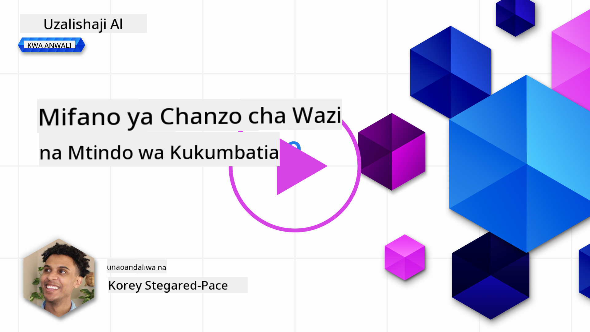
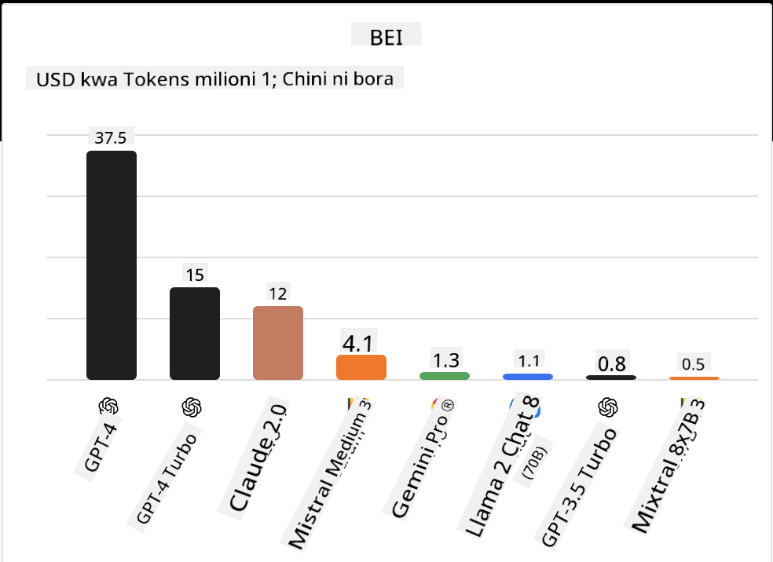
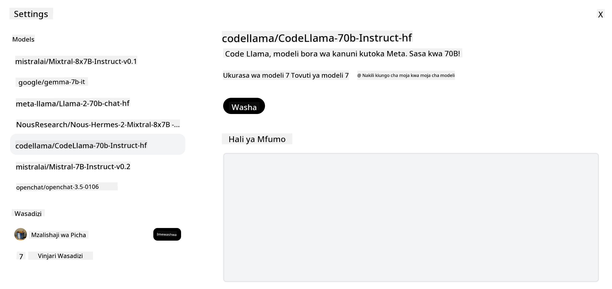
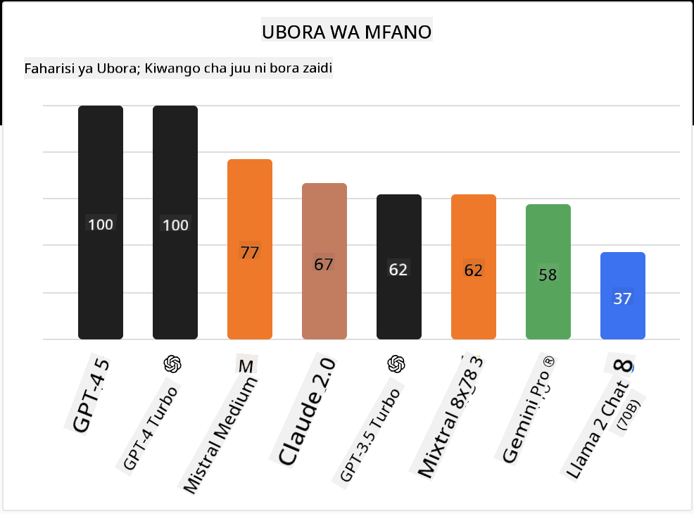

<!--
CO_OP_TRANSLATOR_METADATA:
{
  "original_hash": "0bba96e53ab841d99db731892a51fab8",
  "translation_date": "2025-07-09T17:13:33+00:00",
  "source_file": "16-open-source-models/README.md",
  "language_code": "sw"
}
-->

## Utangulizi

Ulimwengu wa LLM za chanzo huria ni wa kusisimua na unaendelea kubadilika kila wakati. Somo hili lina lengo la kutoa mtazamo wa kina kuhusu mifano ya chanzo huria. Ikiwa unatafuta taarifa kuhusu jinsi mifano ya miliki inavyolinganishwa na mifano ya chanzo huria, nenda kwenye somo la ["Kuchunguza na Kulinganisha LLM Tofauti"](../02-exploring-and-comparing-different-llms/README.md?WT.mc_id=academic-105485-koreyst). Somo hili pia litashughulikia mada ya kurekebisha kwa usahihi (fine-tuning) lakini maelezo ya kina zaidi yanaweza kupatikana katika somo la ["Kurekebisha LLM"](../18-fine-tuning/README.md?WT.mc_id=academic-105485-koreyst).

## Malengo ya Kujifunza

- Kupata uelewa wa Mifano ya Chanzo Huria  
- Kuelewa faida za kufanya kazi na Mifano ya Chanzo Huria  
- Kuchunguza mifano huria inayopatikana kwenye Hugging Face na Azure AI Studio  

## Mifano ya Chanzo Huria ni Nini?

Programu za chanzo huria zimekuwa na mchango mkubwa katika ukuaji wa teknolojia katika nyanja mbalimbali. Shirika la Open Source Initiative (OSI) limefafanua [vigezo 10 vya programu](https://web.archive.org/web/20241126001143/https://opensource.org/osd?WT.mc_id=academic-105485-koreyst) ili kuainisha kama ni chanzo huria. Msimbo wa chanzo lazima usambazwe wazi chini ya leseni iliyokubaliwa na OSI.

Ingawa maendeleo ya LLM yana vipengele vinavyofanana na maendeleo ya programu, mchakato si sawa kabisa. Hii imesababisha mijadala mingi katika jamii kuhusu ufafanuzi wa chanzo huria katika muktadha wa LLM. Ili mfano uweze kuendana na ufafanuzi wa jadi wa chanzo huria, taarifa zifuatazo zinapaswa kupatikana hadharani:

- Seti za data zilizotumika kufundisha mfano.  
- Uzito kamili wa mfano kama sehemu ya mafunzo.  
- Msimbo wa tathmini.  
- Msimbo wa kurekebisha kwa usahihi (fine-tuning).  
- Uzito kamili wa mfano na vipimo vya mafunzo.  

Kwa sasa kuna mifano michache tu inayokidhi vigezo hivi. [Mfano wa OLMo ulioanzishwa na Taasisi ya Allen ya Akili Bandia (AllenAI)](https://huggingface.co/allenai/OLMo-7B?WT.mc_id=academic-105485-koreyst) ni mmoja anayefaa katika kundi hili.

Kwa somo hili, tutarejelea mifano kama "mifano huria" kuanzia sasa kwani huenda haikidhi vigezo vilivyotajwa wakati wa kuandika.

## Faida za Mifano Huria

**Inayoweza Kubadilishwa kwa Urahisi** - Kwa kuwa mifano huria hutolewa na taarifa za kina za mafunzo, watafiti na waendelezaji wanaweza kubadilisha mambo ya ndani ya mfano. Hii inaruhusu kuunda mifano maalum sana iliyorekebishwa kwa kazi au eneo fulani la utafiti. Mifano ya hili ni kama uzalishaji wa msimbo, hesabu na biolojia.

**Gharama** - Gharama kwa kila tokeni kwa kutumia na kupeleka mifano hii ni chini kuliko ile ya mifano ya miliki. Unapojenga programu za AI za kizazi, ni muhimu kuangalia utendaji dhidi ya bei unapotumia mifano hii kwa matumizi yako.

  
Chanzo: Artificial Analysis

**Uwezo wa Kubadilika** - Kufanya kazi na mifano huria kunakuwezesha kuwa na uhuru wa kutumia mifano tofauti au kuziunganisha. Mfano wa hili ni [HuggingChat Assistants](https://huggingface.co/chat?WT.mc_id=academic-105485-koreyst) ambapo mtumiaji anaweza kuchagua mfano unaotumika moja kwa moja kwenye kiolesura cha mtumiaji:

## Kuchunguza Mifano Huria Tofauti

### Llama 2

[LLama2](https://huggingface.co/meta-llama?WT.mc_id=academic-105485-koreyst), iliyotengenezwa na Meta ni mfano huria ulioboreshwa kwa matumizi ya mazungumzo. Hii ni kutokana na njia yake ya kurekebisha kwa usahihi, ambayo ilijumuisha mazungumzo mengi na maoni ya binadamu. Kwa njia hii, mfano hutoa matokeo yanayolingana zaidi na matarajio ya binadamu na hivyo kuboresha uzoefu wa mtumiaji.

Mifano ya toleo lililorekebishwa la Llama ni kama [Japanese Llama](https://huggingface.co/elyza/ELYZA-japanese-Llama-2-7b?WT.mc_id=academic-105485-koreyst), inayobobea katika Kijapani na [Llama Pro](https://huggingface.co/TencentARC/LLaMA-Pro-8B?WT.mc_id=academic-105485-koreyst), toleo lililoboreshwa la mfano wa msingi.

### Mistral

[Mistral](https://huggingface.co/mistralai?WT.mc_id=academic-105485-koreyst) ni mfano huria unaolenga utendaji bora na ufanisi. Inatumia mbinu ya Mixture-of-Experts inayochanganya kundi la mifano maalum ya wataalamu kuwa mfumo mmoja ambapo kulingana na ingizo, mifano fulani huchaguliwa kutumika. Hii hufanya hesabu kuwa bora zaidi kwani mifano inashughulikia tu ingizo walilobobea.

Mifano ya toleo lililorekebishwa la Mistral ni kama [BioMistral](https://huggingface.co/BioMistral/BioMistral-7B?text=Mon+nom+est+Thomas+et+mon+principal?WT.mc_id=academic-105485-koreyst), inayolenga sekta ya tiba na [OpenMath Mistral](https://huggingface.co/nvidia/OpenMath-Mistral-7B-v0.1-hf?WT.mc_id=academic-105485-koreyst), inayofanya hesabu za hisabati.

### Falcon

[Falcon](https://huggingface.co/tiiuae?WT.mc_id=academic-105485-koreyst) ni LLM iliyotengenezwa na Technology Innovation Institute (**TII**). Falcon-40B ilifundishwa kwa kutumia vigezo bilioni 40 na imeonyesha utendaji bora zaidi kuliko GPT-3 kwa bajeti ndogo ya kompyuta. Hii ni kutokana na matumizi ya algoriti ya FlashAttention na multiquery attention inayomuwezesha kupunguza mahitaji ya kumbukumbu wakati wa utambuzi. Kwa kupunguza muda wa utambuzi, Falcon-40B ni bora kwa matumizi ya mazungumzo.

Mifano ya toleo lililorekebishwa la Falcon ni kama [OpenAssistant](https://huggingface.co/OpenAssistant/falcon-40b-sft-top1-560?WT.mc_id=academic-105485-koreyst), msaidizi aliyejengwa kwa mifano huria na [GPT4ALL](https://huggingface.co/nomic-ai/gpt4all-falcon?WT.mc_id=academic-105485-koreyst), inayotoa utendaji bora zaidi kuliko mfano wa msingi.

## Jinsi ya Kuchagua

Hakuna jibu moja la kuchagua mfano huria. Mahali pazuri pa kuanza ni kutumia kipengele cha kuchuja kwa kazi katika Azure AI Studio. Hii itakusaidia kuelewa aina za kazi ambazo mfano umefundishwa. Hugging Face pia ina LLM Leaderboard inayokuonyesha mifano bora zaidi kulingana na vipimo fulani.

Unapotaka kulinganisha LLM kati ya aina tofauti, [Artificial Analysis](https://artificialanalysis.ai/?WT.mc_id=academic-105485-koreyst) ni rasilimali nzuri pia:

  
Chanzo: Artificial Analysis

Ikiwa unafanya kazi kwa matumizi maalum, kutafuta toleo lililorekebishwa linalolenga eneo hilo linaweza kuwa na ufanisi. Ku jaribu mifano huria mingi kuona jinsi inavyotimiza matarajio yako na ya watumiaji ni mbinu nzuri pia.

## Hatua Zifuatazo

Sehemu bora kuhusu mifano huria ni kwamba unaweza kuanza kufanya kazi nayo haraka. Angalia [Azure AI Studio Model Catalog](https://ai.azure.com?WT.mc_id=academic-105485-koreyst), ambayo ina mkusanyiko maalum wa Hugging Face wenye mifano tuliyojadili hapa.

## Kujifunza hakukomi hapa, endelea Safari

Baada ya kumaliza somo hili, angalia [Mkusanyiko wa Kujifunza AI ya Kizazi](https://aka.ms/genai-collection?WT.mc_id=academic-105485-koreyst) ili kuendelea kuongeza ujuzi wako wa AI ya Kizazi!

**Kiarifu cha Kutotegemea**:  
Hati hii imetafsiriwa kwa kutumia huduma ya tafsiri ya AI [Co-op Translator](https://github.com/Azure/co-op-translator). Ingawa tunajitahidi kwa usahihi, tafadhali fahamu kwamba tafsiri za kiotomatiki zinaweza kuwa na makosa au upungufu wa usahihi. Hati ya asili katika lugha yake ya asili inapaswa kuchukuliwa kama chanzo cha mamlaka. Kwa taarifa muhimu, tafsiri ya kitaalamu inayofanywa na binadamu inapendekezwa. Hatubebei dhamana kwa kutoelewana au tafsiri potofu zinazotokana na matumizi ya tafsiri hii.