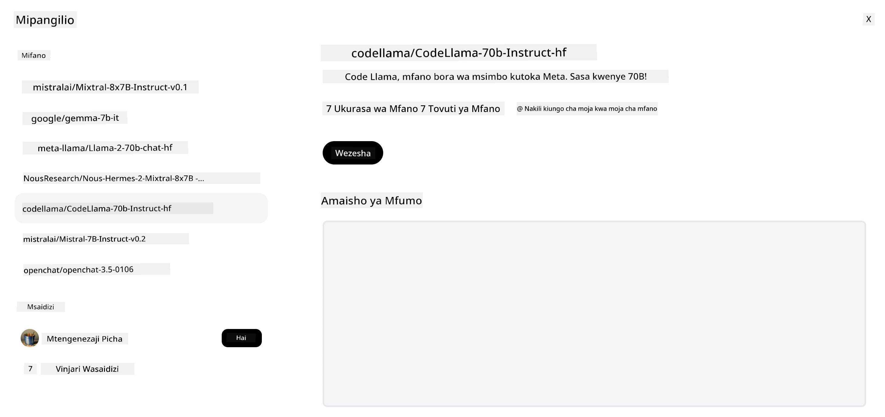

<!--
CO_OP_TRANSLATOR_METADATA:
{
  "original_hash": "85b754d4dc980f270f264d17116d9a5f",
  "translation_date": "2025-12-19T16:29:25+00:00",
  "source_file": "16-open-source-models/README.md",
  "language_code": "sw"
}
-->

## Utangulizi

Ulimwengu wa LLM za chanzo huria ni wa kusisimua na unaendelea kubadilika kila wakati. Somo hili linalenga kutoa mtazamo wa kina juu ya mifano ya chanzo huria. Ikiwa unatafuta taarifa juu ya jinsi mifano ya umiliki inavyolinganishwa na mifano ya chanzo huria, nenda kwenye somo la ["Kuchunguza na Kulinganisha LLM Tofauti"](../02-exploring-and-comparing-different-llms/README.md?WT.mc_id=academic-105485-koreyst). Somo hili pia litashughulikia mada ya urekebishaji wa kina lakini maelezo zaidi yanaweza kupatikana katika somo la ["Urekebishaji wa Kina wa LLM"](../18-fine-tuning/README.md?WT.mc_id=academic-105485-koreyst).

## Malengo ya Kujifunza

- Kupata uelewa wa Mifano ya Chanzo Huria
- Kuelewa faida za kufanya kazi na Mifano ya Chanzo Huria
- Kuchunguza mifano huria inayopatikana kwenye Hugging Face na Azure AI Studio

## Mifano ya Chanzo Huria ni Nini?

Programu za chanzo huria zimekuwa na jukumu muhimu katika ukuaji wa teknolojia katika nyanja mbalimbali. Shirika la Chanzo Huria (OSI) limefafanua [vigezo 10 vya programu](https://web.archive.org/web/20241126001143/https://opensource.org/osd?WT.mc_id=academic-105485-koreyst) ili kuainisha kama chanzo huria. Msimbo wa chanzo lazima usambazwe wazi chini ya leseni iliyokubaliwa na OSI.

Wakati maendeleo ya LLM yana vipengele vinavyofanana na maendeleo ya programu, mchakato si sawa kabisa. Hii imesababisha mijadala mingi katika jamii juu ya ufafanuzi wa chanzo huria katika muktadha wa LLM. Ili mfano uwe sambamba na ufafanuzi wa jadi wa chanzo huria, taarifa zifuatazo zinapaswa kupatikana hadharani:

- Seti za data zilizotumika kufundisha mfano.
- Uzito kamili wa mfano kama sehemu ya mafunzo.
- Msimbo wa tathmini.
- Msimbo wa urekebishaji wa kina.
- Uzito kamili wa mfano na vipimo vya mafunzo.

Kwa sasa kuna mifano michache tu inayokidhi vigezo hivi. [Mfano wa OLMo ulioanzishwa na Taasisi ya Allen ya Akili Bandia (AllenAI)](https://huggingface.co/allenai/OLMo-7B?WT.mc_id=academic-105485-koreyst) ni mmoja anayefaa katika kategoria hii.

Kwa somo hili, tutarejelea mifano kama "mifano huria" kuendelea kwani huenda haikidhi vigezo hapo juu wakati wa kuandika.

## Faida za Mifano Huria

**Inayoweza Kubadilishwa kwa Kina** - Kwa kuwa mifano huria hutolewa na taarifa za kina za mafunzo, watafiti na waendelezaji wanaweza kubadilisha mambo ya ndani ya mfano. Hii inaruhusu kuunda mifano maalum sana iliyorekebishwa kwa kazi au eneo fulani la utafiti. Mifano ya hii ni kama uzalishaji wa msimbo, operesheni za hisabati na biolojia.

**Gharama** - Gharama kwa tokeni kwa kutumia na kupeleka mifano hii ni chini kuliko ile ya mifano ya umiliki. Unapojenga programu za AI za kizazi, kuangalia utendaji dhidi ya bei unapotumia mifano hii kwa matumizi yako ni muhimu.

Chanzo: Artificial Analysis

**Uwezo wa Kubadilika** - Kufanya kazi na mifano huria kunakuwezesha kuwa na uhuru wa kutumia mifano tofauti au kuziunganisha. Mfano wa hili ni [HuggingChat Assistants](https://huggingface.co/chat?WT.mc_id=academic-105485-koreyst) ambapo mtumiaji anaweza kuchagua mfano unaotumika moja kwa moja kwenye kiolesura cha mtumiaji:

## Kuchunguza Mifano Huria Tofauti

### Llama 2

[LLama2](https://huggingface.co/meta-llama?WT.mc_id=academic-105485-koreyst), iliyotengenezwa na Meta ni mfano huria ulioboreshwa kwa matumizi ya mazungumzo. Hii ni kutokana na njia yake ya urekebishaji wa kina, ambayo ilijumuisha mazungumzo mengi na maoni ya binadamu. Kwa njia hii, mfano hutoa matokeo zaidi yanayolingana na matarajio ya binadamu ambayo yanatoa uzoefu bora kwa mtumiaji.

Mifano ya toleo zilizorekebishwa za Llama ni pamoja na [Japanese Llama](https://huggingface.co/elyza/ELYZA-japanese-Llama-2-7b?WT.mc_id=academic-105485-koreyst), inayobobea katika Kijapani na [Llama Pro](https://huggingface.co/TencentARC/LLaMA-Pro-8B?WT.mc_id=academic-105485-koreyst), toleo lililoboreshwa la mfano wa msingi.

### Mistral

[Mistral](https://huggingface.co/mistralai?WT.mc_id=academic-105485-koreyst) ni mfano huria wenye msisitizo mkubwa wa utendaji na ufanisi. Inatumia mbinu ya Mixture-of-Experts inayochanganya kundi la mifano maalum ya wataalamu katika mfumo mmoja ambapo kulingana na ingizo, mifano fulani huchaguliwa kutumika. Hii hufanya hesabu kuwa bora zaidi kwani mifano inashughulikia tu ingizo walilobobea.

Mifano ya toleo zilizorekebishwa za Mistral ni pamoja na [BioMistral](https://huggingface.co/BioMistral/BioMistral-7B?text=Mon+nom+est+Thomas+et+mon+principal?WT.mc_id=academic-105485-koreyst), inayolenga eneo la tiba na [OpenMath Mistral](https://huggingface.co/nvidia/OpenMath-Mistral-7B-v0.1-hf?WT.mc_id=academic-105485-koreyst), inayofanya hesabu za hisabati.

### Falcon

[Falcon](https://huggingface.co/tiiuae?WT.mc_id=academic-105485-koreyst) ni LLM iliyotengenezwa na Taasisi ya Ubunifu wa Teknolojia (**TII**). Falcon-40B ilifundishwa kwa vigezo bilioni 40 ambavyo vimeonyesha kufanya vizuri zaidi kuliko GPT-3 kwa bajeti ndogo ya kompyuta. Hii ni kutokana na matumizi ya algoriti ya FlashAttention na multiquery attention inayomruhusu kupunguza mahitaji ya kumbukumbu wakati wa utambuzi. Kwa kupunguzwa kwa muda wa utambuzi, Falcon-40B ni bora kwa matumizi ya mazungumzo.

Mifano ya toleo zilizorekebishwa za Falcon ni pamoja na [OpenAssistant](https://huggingface.co/OpenAssistant/falcon-40b-sft-top1-560?WT.mc_id=academic-105485-koreyst), msaidizi aliyejengwa kwa mifano huria na [GPT4ALL](https://huggingface.co/nomic-ai/gpt4all-falcon?WT.mc_id=academic-105485-koreyst), inayotoa utendaji bora zaidi kuliko mfano wa msingi.

## Jinsi ya Kuchagua

Hakuna jibu moja la kuchagua mfano huria. Mahali pazuri pa kuanza ni kutumia kipengele cha kuchuja kwa kazi cha Azure AI Studio. Hii itakusaidia kuelewa aina za kazi ambazo mfano umefundishwa. Hugging Face pia ina LLM Leaderboard inayokuonyesha mifano bora zaidi kulingana na vipimo fulani.

Unapotaka kulinganisha LLM kati ya aina tofauti, [Artificial Analysis](https://artificialanalysis.ai/?WT.mc_id=academic-105485-koreyst) ni rasilimali nyingine nzuri:

Chanzo: Artificial Analysis

Ikiwa unafanya kazi kwa matumizi maalum, kutafuta toleo zilizorekebishwa zinazolenga eneo hilo linaweza kuwa na ufanisi. Ku jaribu mifano huria mingi kuona jinsi inavyofanya kazi kulingana na matarajio yako na ya watumiaji ni mazoezi mazuri pia.

## Hatua Zifuatazo

Sehemu bora kuhusu mifano huria ni kwamba unaweza kuanza kufanya kazi nayo haraka. Angalia [Azure AI Foundry Model Catalog](https://ai.azure.com?WT.mc_id=academic-105485-koreyst), ambayo ina mkusanyiko maalum wa Hugging Face na mifano tuliyojadili hapa.

## Kujifunza hakukomi hapa, endelea Safari

Baada ya kumaliza somo hili, angalia [Mkusanyiko wa Kujifunza AI ya Kizazi](https://aka.ms/genai-collection?WT.mc_id=academic-105485-koreyst) ili kuendelea kuongeza maarifa yako ya AI ya Kizazi!

---

<!-- CO-OP TRANSLATOR DISCLAIMER START -->
**Kiarifu cha Msamaha**:
Hati hii imetafsiriwa kwa kutumia huduma ya tafsiri ya AI [Co-op Translator](https://github.com/Azure/co-op-translator). Ingawa tunajitahidi kwa usahihi, tafadhali fahamu kuwa tafsiri za kiotomatiki zinaweza kuwa na makosa au upungufu wa usahihi. Hati ya asili katika lugha yake ya asili inapaswa kuchukuliwa kama chanzo cha mamlaka. Kwa taarifa muhimu, tafsiri ya kitaalamu ya binadamu inapendekezwa. Hatubebei dhamana kwa kutoelewana au tafsiri potofu zinazotokana na matumizi ya tafsiri hii.
<!-- CO-OP TRANSLATOR DISCLAIMER END -->