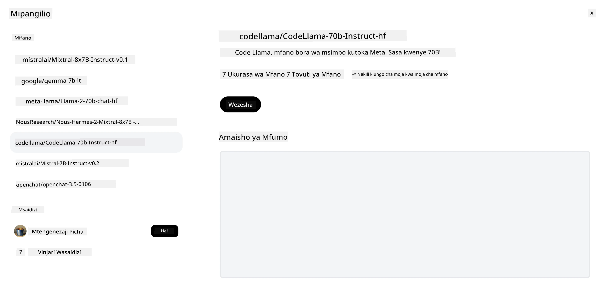

## Utangulizi

Ulimwengu wa LLM za chanzo huria ni wa kusisimua na unaendelea kubadilika kila wakati. Somo hili linakusudia kutoa muonekano wa kina wa mifano ya chanzo huria. Ikiwa unatafuta taarifa juu ya jinsi mifano ya mmiliki inavyolinganishwa na mifano ya chanzo huria, nenda kwa somo la ["Kuchunguza na Kulinganisha LLMs Zote Tofauti"](../02-exploring-and-comparing-different-llms/README.md?WT.mc_id=academic-105485-koreyst). Somo hili pia litashughulikia mada ya urekebishaji wa kina lakini maelezo ya kina zaidi yanaweza kupatikana katika somo la ["Urekebishaji wa Kina wa LLMs"](../18-fine-tuning/README.md?WT.mc_id=academic-105485-koreyst).

## Malengo ya Kujifunza

- Kupata uelewa wa Mifano ya Chanzo Huria
- Kuelewa faida za kufanya kazi na Mifano ya Chanzo Huria
- Kuchunguza mifano huria inayopatikana kwenye Hugging Face na katalogi ya mifano ya Microsoft Foundry

## Mifano ya Chanzo Huria ni Nini?

Programu za chanzo huria zimekuwa na mchango mkubwa katika ukuaji wa teknolojia katika nyanja mbalimbali. Jukwaa la Chanzo Huria (OSI) limetangaza [vigezo 10 vya programu](https://web.archive.org/web/20241126001143/https://opensource.org/osd?WT.mc_id=academic-105485-koreyst) ili kupimwa kama chanzo huria. Chanzo cha msimbo kinategemea kushirikiwa wazi chini ya leseni inayokubalika na OSI.

Ingawa maendeleo ya LLM yana vipengele vinavyofanana na maendeleo ya programu, mchakato sio sawa kabisa. Hili limesababisha mijadala mingi katika jamii juu ya ufafanuzi wa chanzo huria kwa muktadha wa LLMs. Ili mfano uwe sawa na ufafanuzi wa jadi wa chanzo huria, taarifa zifuatazo zinapaswa kupatikana hadharani:

- Seti za data zilizotumika kufundisha mfano.
- Uzito kamili wa mfano kama sehemu ya mafunzo.
- Msimbo wa tathmini.
- Msimbo wa urekebishaji wa kina.
- Uzito kamili wa mfano na vipimo vya mafunzo.

Hivi sasa kuna mifano michache tu inayokidhi vigezo hivi. [Mfano wa OLMo uliotengenezwa na Taasisi ya Allen kwa ajili ya Akili Bandia (AllenAI)](https://huggingface.co/allenai/OLMo-7B?WT.mc_id=academic-105485-koreyst) ni mmoja anayekidhi kategoria hii.

Kwa somo hili, tutataja mifano kama "mifano huria" kuanzia sasa kwani huenda isilingane kabisa na vigezo vya hapo juu wakati wa kuandika.

## Faida za Mifano Huria

**Inayoweza Kubadilishwa kwa Kina** - Kwa kuwa mifano huria hutolewa pamoja na taarifa za kina za mafunzo, watafiti na waendelezaji wanaweza kurekebisha mambo ya ndani ya mfano. Hii inaruhusu uundaji wa mifano maalum ambayo imerekebishwa kwa kazi au eneo fulani la utafiti. Mifano ya mfano ni kama utengenezaji wa msimbo, operesheni za hisabati na biyolojia.

**Gharama** - Gharama kwa kila tokeni kwa kutumia na kupeleka mifano hii ni chini kuliko ile ya mifano ya mmiliki. Unapojenga programu za AI za kizazi, ni muhimu kuangalia utendaji dhidi ya bei unapotumia mifano hii kwa matumizi yako.

Chanzo: Artificial Analysis

**Uwezo Kubwa wa Kubadilika** - Kufanya kazi na mifano huria kunakuwezesha kubadilika kwa kutumia mifano tofauti au kuziunganisha. Mfano wa hili ni [Msaidizi wa HuggingChat](https://huggingface.co/chat?WT.mc_id=academic-105485-koreyst) ambapo mtumiaji anaweza kuchagua mfano unaotumika moja kwa moja kwenye kiolesura cha mtumiaji:

## Kuchunguza Mifano Huria Tofauti

### Llama 2

[LLama2](https://huggingface.co/meta-llama?WT.mc_id=academic-105485-koreyst), iliyotengenezwa na Meta ni mfano huria ulioboreshwa kwa ajili ya programu za mazungumzo. Hii ni kutokana na mbinu yake ya urekebishaji wa kina, ambayo ilijumuisha mazungumzo mengi na maoni ya binadamu. Kwa mbinu hii, mfano hutoa matokeo yanayoendana na matarajio ya binadamu, ambayo hutoa uzoefu bora kwa mtumiaji.

Mifano mingine ya toleo la Llama iliyorekebishwa ni [Japanese Llama](https://huggingface.co/elyza/ELYZA-japanese-Llama-2-7b?WT.mc_id=academic-105485-koreyst), inayobobea kwa Kijapani na [Llama Pro](https://huggingface.co/TencentARC/LLaMA-Pro-8B?WT.mc_id=academic-105485-koreyst), toleo lililoboreshwa la mfano wa msingi.

### Mistral

[Mistral](https://huggingface.co/mistralai?WT.mc_id=academic-105485-koreyst) ni mfano huria yenye mkazo mkubwa wa utendaji mzuri na ufanisi. Inatumia mbinu ya Mchanganyiko-wa-Mtaalamu ambayo huunganisha kundi la mifano maalum ya wataalamu kwenye mfumo mmoja ambapo kulingana na ingizo, mifano fulani huchaguliwa kutumika. Hii inafanya hesabu kuwa na ufanisi zaidi kwa kuwa mifano inashughulikia tu ingizo ambalo wamebobea nalo.

Mifano mingine ya toleo la Mistral iliyorekebishwa ni [BioMistral](https://huggingface.co/BioMistral/BioMistral-7B?text=Mon+nom+est+Thomas+et+mon+principal?WT.mc_id=academic-105485-koreyst), inayolenga eneo la tiba na [OpenMath Mistral](https://huggingface.co/nvidia/OpenMath-Mistral-7B-v0.1-hf?WT.mc_id=academic-105485-koreyst), inayofanya hesabu za hisabati.

### Falcon

[Falcon](https://huggingface.co/tiiuae?WT.mc_id=academic-105485-koreyst) ni LLM iliyotengenezwa na Taasisi ya Ubunifu wa Teknolojia (**TII**). Falcon-40B ilifundishwa kwa kutumia parameta bilioni 40 ambayo imeonyesha utendaji bora zaidi kuliko GPT-3 kwa bajeti ndogo ya kompyuta. Hii ni kutokana na matumizi ya algoriti ya FlashAttention na utambuzi wa multiquery unaoruhusu kupunguza mahitaji ya kumbukumbu wakati wa utambuzi. Kwa kipindi kifupi cha utambuzi, Falcon-40B ni bora kwa ajili ya programu za mazungumzo.

Mifano mingine ya toleo la Falcon iliyorekebishwa ni [OpenAssistant](https://huggingface.co/OpenAssistant/falcon-40b-sft-top1-560?WT.mc_id=academic-105485-koreyst), msaidizi aliyetengenezwa kwa kutumia mifano huria na [GPT4ALL](https://huggingface.co/nomic-ai/gpt4all-falcon?WT.mc_id=academic-105485-koreyst), inayotoa utendaji bora zaidi kuliko mfano wa msingi.

## Jinsi ya Kuchagua

Hakuna jibu moja la kuchagua mfano huria. Mahali pazuri pa kuanza ni kwa kutumia kichujio cha kazi katika katalogi ya mfano ya Microsoft Foundry. Hii itakusaidia kuelewa aina za kazi ambazo mfano umefundishwa. Hugging Face pia ina Jopo la Viongozi la LLM linaloonyesha mifano bora zaidi kulingana na vipimo fulani.

Unapotaka kulinganisha LLMs kati ya aina tofauti, [Artificial Analysis](https://artificialanalysis.ai/?WT.mc_id=academic-105485-koreyst) ni rasilimali nzuri pia:

Chanzo: Artificial Analysis

Ikiwa unafanya kazi kwa matumizi maalum, kutafuta toleo lililorekebishwa linalolenga eneo lile lile linaweza kuwa na ufanisi. Kupima mifano huria mingi na kuona jinsi inavyotenda kulingana na matarajio yako na ya watumiaji wako ni tamasha nzuri pia.

## Hatua Zinazofuata

Sehemu bora kuhusu mifano huria ni kwamba unaweza kuanza kuyatumia haraka sana. Angalia [katalogi ya mfano ya Microsoft Foundry](https://ai.azure.com?WT.mc_id=academic-105485-koreyst), ambayo ina mkusanyiko maalum wa Hugging Face wenye mifano tuliyojadili hapa.

## Kujifunza hakukomi hapa, endelea Safari

Baada ya kumaliza somo hili, angalia [mkusanyiko wetu wa Kujifunza AI ya Kizazi](https://aka.ms/genai-collection?WT.mc_id=academic-105485-koreyst) kuendelea kuimarisha maarifa yako ya AI ya Kizazi!

---

<!-- CO-OP TRANSLATOR DISCLAIMER START -->
**Kionyozo**:
Hati hii imetafsiriwa kwa kutumia huduma ya tafsiri ya AI [Co-op Translator](https://github.com/Azure/co-op-translator). Ingawa tunajitahidi kupata usahihi, tafadhali fahamu kwamba tafsiri za kiotomatiki zinaweza kuwa na makosa au upungufu wa usahihi. Hati ya asili katika lugha yake halisi inapaswa kuchukuliwa kama chanzo cha mamlaka. Kwa taarifa muhimu, tafsiri ya kitaalamu inayofanywa na binadamu inapendekezwa. Hatutojibu kwa kuelewa vibaya au tafsiri potofu zinazotokea kutokana na matumizi ya tafsiri hii.
<!-- CO-OP TRANSLATOR DISCLAIMER END -->