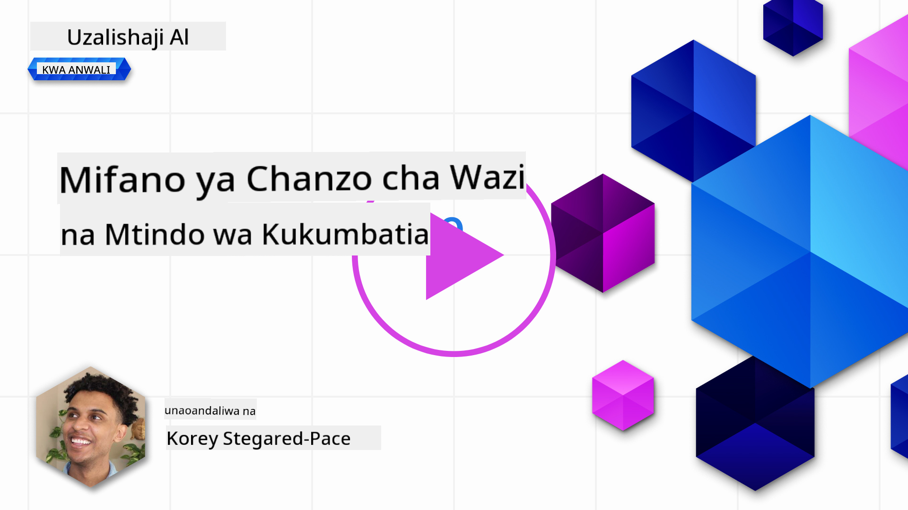
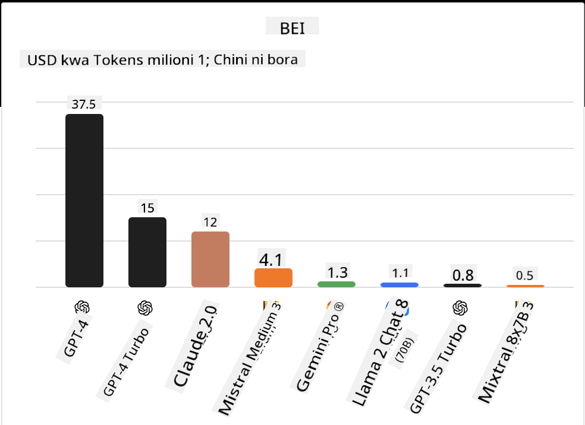
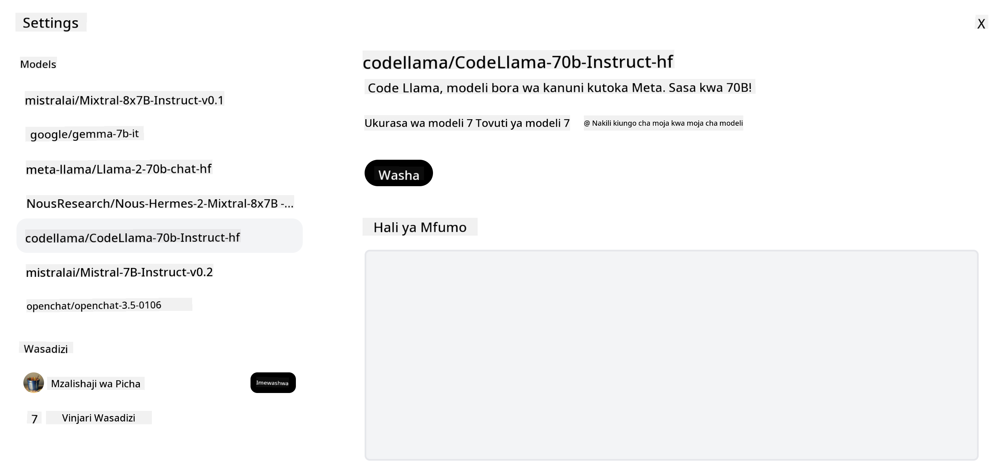
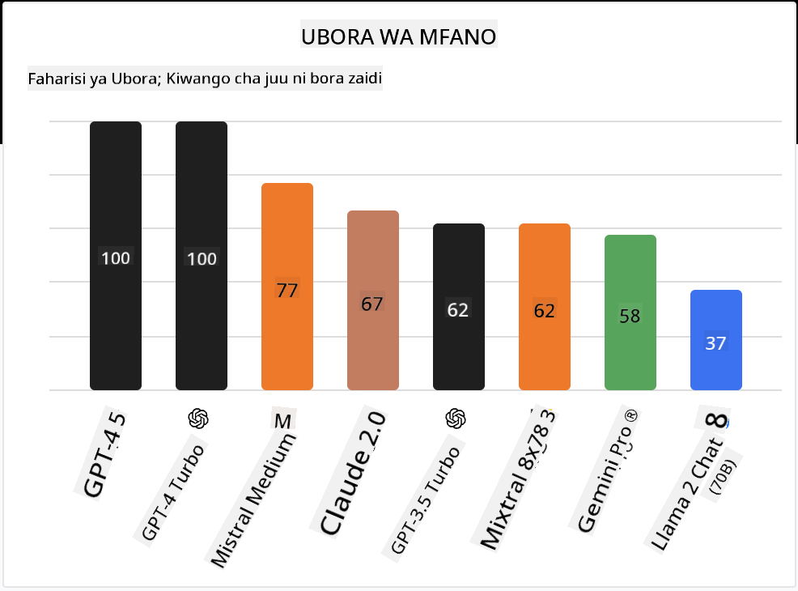

<!--
CO_OP_TRANSLATOR_METADATA:
{
  "original_hash": "0bba96e53ab841d99db731892a51fab8",
  "translation_date": "2025-06-26T00:01:53+00:00",
  "source_file": "16-open-source-models/README.md",
  "language_code": "sw"
}
-->

## Utangulizi

Dunia ya LLMs za chanzo huria ni ya kusisimua na inabadilika kila mara. Somo hili linakusudia kutoa mtazamo wa kina juu ya mifano ya chanzo huria. Ikiwa unatafuta taarifa kuhusu jinsi mifano ya umiliki inavyolinganishwa na mifano ya chanzo huria, nenda kwenye somo la ["Kuchunguza na Kulinganisha LLMs Tofauti"](../02-exploring-and-comparing-different-llms/README.md?WT.mc_id=academic-105485-koreyst). Somo hili pia litashughulikia mada ya kurekebisha kwa undani, lakini maelezo zaidi yanaweza kupatikana katika somo la ["Kurekebisha LLMs"](../18-fine-tuning/README.md?WT.mc_id=academic-105485-koreyst).

## Malengo ya Kujifunza

- Pata uelewa wa Mifano ya Chanzo Huria
- Kuelewa faida za kufanya kazi na Mifano ya Chanzo Huria
- Kuchunguza mifano ya wazi inayopatikana kwenye Hugging Face na Azure AI Studio

## Mifano ya Chanzo Huria ni nini?

Programu ya chanzo huria imechukua nafasi muhimu katika ukuaji wa teknolojia katika nyanja mbalimbali. Mpango wa Chanzo Huria (OSI) umefafanua [vigezo 10 vya programu](https://web.archive.org/web/20241126001143/https://opensource.org/osd?WT.mc_id=academic-105485-koreyst) ili kuainishwa kama chanzo huria. Msimbo wa chanzo lazima ushirikishwe wazi chini ya leseni iliyoidhinishwa na OSI.

Wakati maendeleo ya LLMs yana vipengele sawa na kuendeleza programu, mchakato si sawa kabisa. Hii imeleta mjadala mwingi katika jamii kuhusu ufafanuzi wa chanzo huria katika muktadha wa LLMs. Ili mfano ulingane na ufafanuzi wa jadi wa chanzo huria, habari ifuatayo inapaswa kuwa wazi:

- Seti za data zilizotumika kufundisha mfano.
- Uzito kamili wa mfano kama sehemu ya mafunzo.
- Msimbo wa tathmini.
- Msimbo wa kurekebisha.
- Uzito kamili wa mfano na metriki za mafunzo.

Kwa sasa, kuna mifano michache tu inayolingana na vigezo hivi. [Mfano wa OLMo ulioanzishwa na Taasisi ya Allen ya Akili ya Kifahamu (AllenAI)](https://huggingface.co/allenai/OLMo-7B?WT.mc_id=academic-105485-koreyst) ni mojawapo inayofaa katika kundi hili.

Kwa somo hili, tutarejelea mifano kama "mifano ya wazi" kuendelea mbele kwani inaweza isilingane na vigezo hapo juu wakati wa kuandika.

## Faida za Mifano ya Wazi

**Inaweza Kubadilishwa Sana** - Kwa kuwa mifano ya wazi inatolewa na taarifa za mafunzo za kina, watafiti na watengenezaji wanaweza kubadilisha mambo ya ndani ya mfano. Hii inawezesha uundaji wa mifano maalum sana ambayo imebadilishwa kwa kazi maalum au eneo la masomo. Baadhi ya mifano ya hii ni kizazi cha msimbo, operesheni za hisabati na biolojia.

**Gharama** - Gharama kwa kila tokeni kwa kutumia na kusambaza mifano hii ni ya chini kuliko ile ya mifano ya umiliki. Wakati wa kujenga programu za AI za kizazi, kuangalia utendaji dhidi ya bei wakati wa kufanya kazi na mifano hii kwenye kesi yako ya matumizi inapaswa kufanywa.

 Chanzo: Uchambuzi wa Kifahamu

**Kubadilika** - Kufanya kazi na mifano ya wazi kunakuwezesha kuwa na kubadilika kwa kutumia mifano tofauti au kuziunganisha. Mfano wa hii ni [HuggingChat Assistants](https://huggingface.co/chat?WT.mc_id=academic-105485-koreyst) ambapo mtumiaji anaweza kuchagua mfano unaotumika moja kwa moja kwenye kiolesura cha mtumiaji:

## Kuchunguza Mifano Tofauti ya Wazi

### Llama 2

[LLama2](https://huggingface.co/meta-llama?WT.mc_id=academic-105485-koreyst), iliyotengenezwa na Meta ni mfano wazi ambao umeboreshwa kwa matumizi ya mazungumzo. Hii ni kutokana na mbinu yake ya kurekebisha, ambayo ilijumuisha kiasi kikubwa cha mazungumzo na maoni ya binadamu. Kwa mbinu hii, mfano hutoa matokeo zaidi yanayolingana na matarajio ya binadamu ambayo hutoa uzoefu bora wa mtumiaji.

Baadhi ya mifano ya Llama iliyorekebishwa ni pamoja na [Japanese Llama](https://huggingface.co/elyza/ELYZA-japanese-Llama-2-7b?WT.mc_id=academic-105485-koreyst), inayojikita katika Kijapani na [Llama Pro](https://huggingface.co/TencentARC/LLaMA-Pro-8B?WT.mc_id=academic-105485-koreyst), ambayo ni toleo lililoboreshwa la mfano wa msingi.

### Mistral

[Mistral](https://huggingface.co/mistralai?WT.mc_id=academic-105485-koreyst) ni mfano wazi wenye mkazo mkubwa wa utendaji wa juu na ufanisi. Inatumia mbinu ya Mchanganyiko-wa-Wataalamu ambayo inachanganya kundi la mifano ya wataalamu maalum katika mfumo mmoja ambapo kulingana na pembejeo, mifano fulani huchaguliwa kutumika. Hii inafanya hesabu kuwa bora zaidi kwani mifano inashughulikia tu pembejeo ambazo wamebobea.

Baadhi ya mifano ya Mistral iliyorekebishwa ni pamoja na [BioMistral](https://huggingface.co/BioMistral/BioMistral-7B?text=Mon+nom+est+Thomas+et+mon+principal?WT.mc_id=academic-105485-koreyst), inayolenga uwanja wa matibabu na [OpenMath Mistral](https://huggingface.co/nvidia/OpenMath-Mistral-7B-v0.1-hf?WT.mc_id=academic-105485-koreyst), inayofanya hesabu za kihisabati.

### Falcon

[Falcon](https://huggingface.co/tiiuae?WT.mc_id=academic-105485-koreyst) ni LLM iliyoundwa na Taasisi ya Ubunifu wa Teknolojia (**TII**). Falcon-40B ilifundishwa kwenye vigezo bilioni 40 ambavyo vimeonyeshwa kufanya vizuri zaidi kuliko GPT-3 na bajeti ndogo ya hesabu. Hii ni kutokana na matumizi yake ya algorithm ya FlashAttention na umakini wa maswali mengi ambayo inawezesha kupunguza mahitaji ya kumbukumbu wakati wa uamuzi. Kwa muda huu uliopunguzwa wa uamuzi, Falcon-40B inafaa kwa matumizi ya mazungumzo.

Baadhi ya mifano ya Falcon iliyorekebishwa ni [OpenAssistant](https://huggingface.co/OpenAssistant/falcon-40b-sft-top1-560?WT.mc_id=academic-105485-koreyst), msaidizi aliyejengwa kwenye mifano ya wazi na [GPT4ALL](https://huggingface.co/nomic-ai/gpt4all-falcon?WT.mc_id=academic-105485-koreyst), ambayo inatoa utendaji wa juu kuliko mfano wa msingi.

## Jinsi ya Kuchagua

Hakuna jibu moja kwa kuchagua mfano wazi. Mahali pazuri pa kuanza ni kwa kutumia kipengele cha kuchuja kwa kazi cha Azure AI Studio. Hii itakusaidia kuelewa aina gani za kazi ambazo mfano umefundishwa. Hugging Face pia inadumisha LLM Leaderboard inayokuonyesha mifano inayofanya vizuri zaidi kulingana na metriki fulani.

Unapotaka kulinganisha LLMs katika aina tofauti, [Uchambuzi wa Kifahamu](https://artificialanalysis.ai/?WT.mc_id=academic-105485-koreyst) ni rasilimali nyingine nzuri:

 Chanzo: Uchambuzi wa Kifahamu

Ikiwa unafanya kazi kwenye kesi maalum ya matumizi, kutafuta mifano iliyorekebishwa inayolenga eneo sawa inaweza kuwa na ufanisi. Kujaribu mifano mingi ya wazi ili kuona jinsi inavyofanya kazi kulingana na matarajio yako na ya watumiaji wako ni mazoezi mengine mazuri.

## Hatua Zifuatazo

Sehemu bora kuhusu mifano ya wazi ni kwamba unaweza kuanza kufanya kazi nayo haraka. Angalia [Katalogi ya Mfano wa Azure AI Studio](https://ai.azure.com?WT.mc_id=academic-105485-koreyst), ambayo ina mkusanyiko maalum wa Hugging Face na mifano hii tuliyojadili hapa.

## Kujifunza hakusimami hapa, endelea na Safari

Baada ya kukamilisha somo hili, angalia mkusanyiko wetu wa [Kujifunza AI ya Kizazi](https://aka.ms/genai-collection?WT.mc_id=academic-105485-koreyst) ili kuendelea kuongeza ujuzi wako wa AI ya Kizazi!

**Kanusho**:  
Hati hii imetafsiriwa kwa kutumia huduma ya tafsiri ya AI [Co-op Translator](https://github.com/Azure/co-op-translator). Ingawa tunajitahidi kwa usahihi, tafadhali fahamu kwamba tafsiri za kiotomatiki zinaweza kuwa na makosa au kutokuwa sahihi. Hati ya asili katika lugha yake ya asili inapaswa kuzingatiwa kama chanzo cha mamlaka. Kwa habari muhimu, tafsiri ya kitaalamu ya binadamu inapendekezwa. Hatutawajibika kwa kutoelewana au tafsiri zisizo sahihi zinazotokana na matumizi ya tafsiri hii.