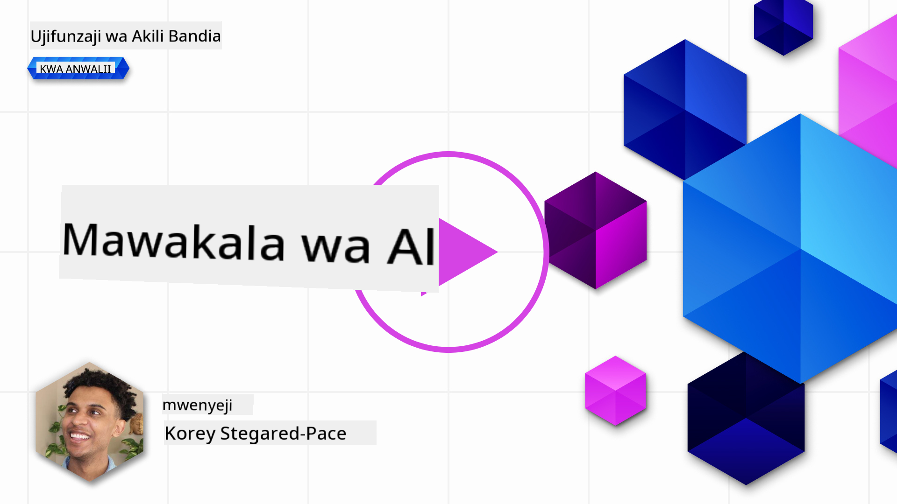
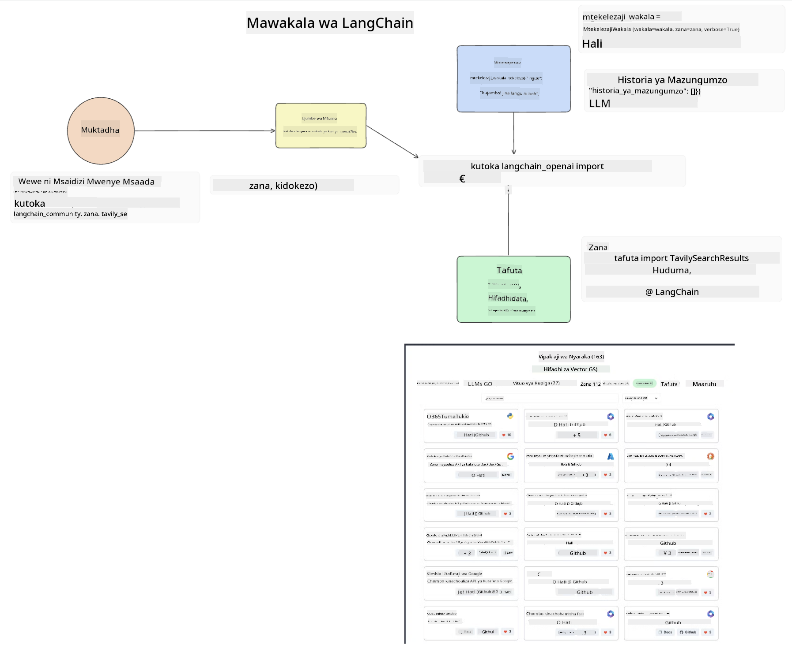
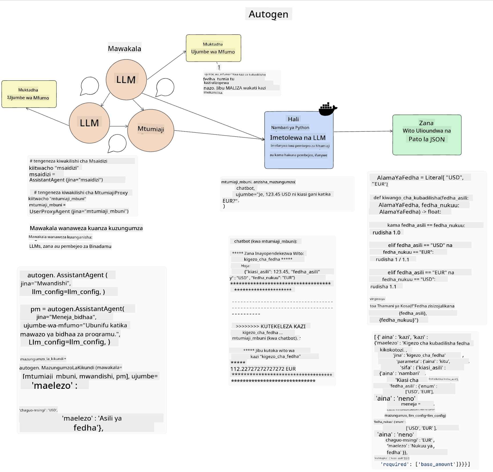
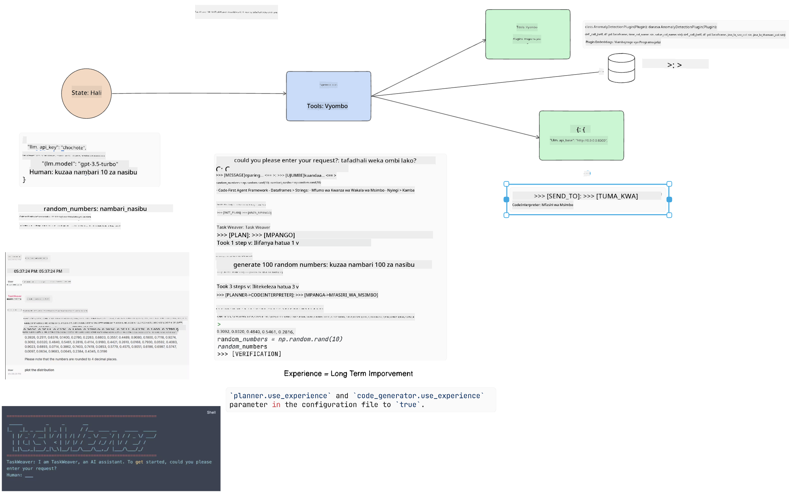
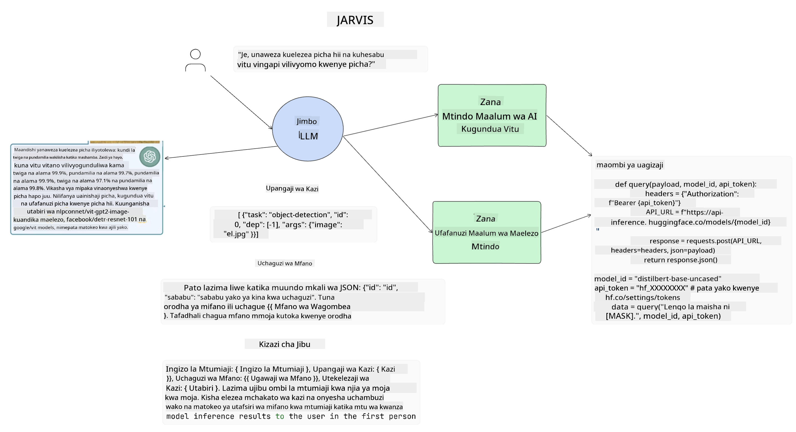

<!--
CO_OP_TRANSLATOR_METADATA:
{
  "original_hash": "11f03c81f190d9cbafd0f977dcbede6c",
  "translation_date": "2025-05-20T07:29:34+00:00",
  "source_file": "17-ai-agents/README.md",
  "language_code": "sw"
}
-->
[](https://aka.ms/gen-ai-lesson17-gh?WT.mc_id=academic-105485-koreyst)

## Utangulizi

Wakala wa AI ni maendeleo ya kusisimua katika AI ya Kiangeni, ikiruhusu Mifano Mikubwa ya Lugha (LLMs) kubadilika kutoka wasaidizi kuwa mawakala wanaoweza kuchukua hatua. Mifumo ya Wakala wa AI inawawezesha watengenezaji kuunda programu zinazowapa LLMs ufikiaji wa zana na usimamizi wa hali. Mifumo hii pia inaboresha mwonekano, ikiruhusu watumiaji na watengenezaji kufuatilia hatua zilizopangwa na LLMs, hivyo kuboresha usimamizi wa uzoefu.

Somo litafunika maeneo yafuatayo:

- Kuelewa wakala wa AI ni nini - Wakala wa AI ni nini hasa?
- Kuchunguza mifumo minne tofauti ya Wakala wa AI - Nini kinachowafanya kuwa wa kipekee?
- Kutumia mawakala hawa wa AI kwa matumizi tofauti - Ni lini tunapaswa kutumia mawakala wa AI?

## Malengo ya Kujifunza

Baada ya kuchukua somo hili, utaweza:

- Kueleza wakala wa AI ni nini na jinsi wanavyoweza kutumika.
- Kuwa na uelewa wa tofauti kati ya baadhi ya mifumo maarufu ya Wakala wa AI, na jinsi wanavyotofautiana.
- Kuelewa jinsi mawakala wa AI wanavyofanya kazi ili kujenga programu nao.

## Wakala wa AI ni nini?

Wakala wa AI ni uwanja wa kusisimua sana katika ulimwengu wa AI ya Kiangeni. Pamoja na msisimko huu wakati mwingine kuna mkanganyiko wa maneno na matumizi yao. Ili kuweka mambo rahisi na kujumuisha zana nyingi zinazorejelea mawakala wa AI, tutatumia ufafanuzi huu:

Wakala wa AI huruhusu Mifano Mikubwa ya Lugha (LLMs) kutekeleza majukumu kwa kuwapa ufikiaji wa **hali** na **zana**.


Hebu tueleze maneno haya:

**Mifano Mikubwa ya Lugha** - Hizi ni mifano iliyorejelewa katika kozi hii kama vile GPT-3.5, GPT-4, Llama-2, nk.

**Hali** - Hii inahusu muktadha ambao LLM inafanya kazi ndani. LLM hutumia muktadha wa vitendo vyake vya zamani na muktadha wa sasa, kuongoza maamuzi yake kwa vitendo vinavyofuata. Mifumo ya Wakala wa AI inawawezesha watengenezaji kudumisha muktadha huu kwa urahisi zaidi.

**Zana** - Ili kukamilisha jukumu ambalo mtumiaji ameomba na ambalo LLM imepanga, LLM inahitaji ufikiaji wa zana. Baadhi ya mifano ya zana inaweza kuwa hifadhidata, API, programu ya nje au hata LLM nyingine!

Ufafanuzi huu utatumaini kukupa msingi mzuri tunapoangalia jinsi wanavyotekelezwa. Hebu tuchunguze mifumo kadhaa tofauti ya Wakala wa AI:

## Mawakala wa LangChain

[Mawakala wa LangChain](https://python.langchain.com/docs/how_to/#agents?WT.mc_id=academic-105485-koreyst) ni utekelezaji wa ufafanuzi tuliopeana hapo juu.

Ili kusimamia **hali**, hutumia kazi iliyojengwa ndani inayoitwa `AgentExecutor`. Hii inakubali `agent` iliyoelezwa na `tools` ambazo zinapatikana kwake.

`Agent Executor` pia huhifadhi historia ya mazungumzo ili kutoa muktadha wa mazungumzo.



LangChain inatoa [orodha ya zana](https://integrations.langchain.com/tools?WT.mc_id=academic-105485-koreyst) ambazo zinaweza kuingizwa kwenye programu yako ambayo LLM inaweza kupata. Hizi zinatengenezwa na jamii na timu ya LangChain.

Unaweza kisha kufafanua zana hizi na kuzipitisha kwa `Agent Executor`.

Mwonekano ni kipengele kingine muhimu tunapozungumza kuhusu Mawakala wa AI. Ni muhimu kwa watengenezaji wa programu kuelewa ni zana gani LLM inatumia na kwa nini. Kwa hilo, timu ya LangChain wameunda LangSmith.

## AutoGen

Mfumo unaofuata wa Wakala wa AI tutakaojadili ni [AutoGen](https://microsoft.github.io/autogen/?WT.mc_id=academic-105485-koreyst). Lengo kuu la AutoGen ni mazungumzo. Mawakala ni **wa kuzungumza** na **wa kubinafsishwa**.

**Wa kuzungumza -** LLMs zinaweza kuanzisha na kuendelea na mazungumzo na LLM nyingine ili kukamilisha jukumu. Hii inafanywa kwa kuunda `AssistantAgents` na kuwapa ujumbe maalum wa mfumo.

```python

autogen.AssistantAgent( name="Coder", llm_config=llm_config, ) pm = autogen.AssistantAgent( name="Product_manager", system_message="Creative in software product ideas.", llm_config=llm_config, )

```

**Wa kubinafsishwa** - Mawakala wanaweza kufafanuliwa sio tu kama LLMs bali kuwa mtumiaji au zana. Kama mtengenezaji, unaweza kufafanua `UserProxyAgent` ambayo inawajibika kwa kuingiliana na mtumiaji kwa maoni katika kukamilisha jukumu. Maoni haya yanaweza kuendelea na utekelezaji wa jukumu au kusimamisha.

```python
user_proxy = UserProxyAgent(name="user_proxy")
```

### Hali na Zana

Ili kubadilisha na kusimamia hali, Msaidizi Wakala huzalisha msimbo wa Python kukamilisha jukumu.

Hapa kuna mfano wa mchakato:



#### LLM Imefafanuliwa na Ujumbe wa Mfumo

```python
system_message="For weather related tasks, only use the functions you have been provided with. Reply TERMINATE when the task is done."
```

Ujumbe huu wa mfumo unaelekeza LLM maalum kwa kazi zake zinazohusika. Kumbuka, na AutoGen unaweza kuwa na Msaidizi Mawakala wengi waliofafanuliwa na ujumbe tofauti wa mfumo.

#### Mazungumzo Yanaanzishwa na Mtumiaji

```python
user_proxy.initiate_chat( chatbot, message="I am planning a trip to NYC next week, can you help me pick out what to wear? ", )

```

Ujumbe huu kutoka kwa user_proxy (Binadamu) ndio utaanzisha mchakato wa Wakala kuchunguza kazi zinazowezekana ambazo inapaswa kutekeleza.

#### Kazi Inatekelezwa

```bash
chatbot (to user_proxy):

***** Suggested tool Call: get_weather ***** Arguments: {"location":"New York City, NY","time_periond:"7","temperature_unit":"Celsius"} ******************************************************** --------------------------------------------------------------------------------

>>>>>>>> EXECUTING FUNCTION get_weather... user_proxy (to chatbot): ***** Response from calling function "get_weather" ***** 112.22727272727272 EUR ****************************************************************

```

Mara mazungumzo ya awali yanapochakatwa, Wakala atatuma zana inayopendekezwa kuita. Katika kesi hii, ni kazi inayoitwa `get_weather`. Depending on your configuration, this function can be automatically executed and read by the Agent or can be executed based on user input.

You can find a list of [AutoGen code samples](https://microsoft.github.io/autogen/docs/Examples/?WT.mc_id=academic-105485-koreyst) to further explore how to get started building.

## Taskweaver

The next agent framework we will explore is [Taskweaver](https://microsoft.github.io/TaskWeaver/?WT.mc_id=academic-105485-koreyst). It is known as a "code-first" agent because instead of working strictly with `strings` , it can work with DataFrames in Python. This becomes extremely useful for data analysis and generation tasks. This can be things like creating graphs and charts or generating random numbers.

### State and Tools

To manage the state of the conversation, TaskWeaver uses the concept of a `Planner`. The `Planner` is a LLM that takes the request from the users and maps out the tasks that need to be completed to fulfill this request.

To complete the tasks the `Planner` is exposed to the collection of tools called `Plugins`. Hii inaweza kuwa madarasa ya Python au mkalimani wa msimbo wa jumla. Plugins hizi zimehifadhiwa kama embeddings ili LLM iweze kutafuta vizuri plugin sahihi.



Hapa kuna mfano wa plugin ya kushughulikia utambuzi wa kasoro:

```python
class AnomalyDetectionPlugin(Plugin): def __call__(self, df: pd.DataFrame, time_col_name: str, value_col_name: str):
```

Msimbo unathibitishwa kabla ya kutekelezwa. Kipengele kingine cha kusimamia muktadha katika Taskweaver ni `experience`. Experience allows for the context of a conversation to be stored over to the long term in a YAML file. This can be configured so that the LLM improves over time on certain tasks given that it is exposed to prior conversations.

## JARVIS

The last agent framework we will explore is [JARVIS](https://github.com/microsoft/JARVIS?tab=readme-ov-file?WT.mc_id=academic-105485-koreyst). What makes JARVIS unique is that it uses an LLM to manage the `state` ya mazungumzo na `tools` ni mifano mingine ya AI. Kila moja ya mifano ya AI ni mifano maalum inayotekeleza majukumu fulani kama utambuzi wa vitu, unukuzi au uandishi wa picha.



LLM, ikiwa ni mfano wa matumizi ya jumla, hupokea ombi kutoka kwa mtumiaji na kutambua jukumu maalum na hoja/data yoyote inayohitajika kukamilisha jukumu.

```python
[{"task": "object-detection", "id": 0, "dep": [-1], "args": {"image": "e1.jpg" }}]
```

Kisha LLM hupanga ombi kwa namna ambayo mfano maalum wa AI unaweza kutafsiri, kama JSON. Mara baada ya mfano wa AI kurudisha utabiri wake kulingana na jukumu, LLM hupokea majibu.

Ikiwa mifano mingi inahitajika kukamilisha jukumu, itatafsiri pia majibu kutoka kwa mifano hiyo kabla ya kuyaleta pamoja ili kutoa jibu kwa mtumiaji.

Mfano ulio hapa chini unaonyesha jinsi hii ingefanya kazi wakati mtumiaji anaomba maelezo na hesabu ya vitu kwenye picha:

## Kazi

Kuendelea na kujifunza kwako kuhusu Mawakala wa AI unaweza kujenga na AutoGen:

- Programu inayosimulia mkutano wa biashara na idara tofauti za kampuni ya elimu inayochipukia.
- Unda ujumbe wa mfumo unaoongoza LLMs kuelewa personas tofauti na vipaumbele, na kuwezesha mtumiaji kutoa wazo jipya la bidhaa.
- LLM inapaswa kisha kuzalisha maswali ya ufuatiliaji kutoka kila idara ili kuboresha na kuboresha wazo la bidhaa.

## Kujifunza hakuishii hapa, endelea na Safari

Baada ya kukamilisha somo hili, angalia [mkusanyiko wetu wa Kujifunza AI ya Kiangeni](https://aka.ms/genai-collection?WT.mc_id=academic-105485-koreyst) ili kuendelea kuongeza maarifa yako ya AI ya Kiangeni!

**Kanusho**: 
Hati hii imetafsiriwa kwa kutumia huduma ya kutafsiri ya AI [Co-op Translator](https://github.com/Azure/co-op-translator). Ingawa tunajitahidi kwa usahihi, tafadhali fahamu kuwa tafsiri za kiotomatiki zinaweza kuwa na makosa au kutokuwa sahihi. Hati ya awali katika lugha yake asili inapaswa kuchukuliwa kama chanzo chenye mamlaka. Kwa taarifa muhimu, inashauriwa kupata tafsiri ya kitaalamu ya kibinadamu. Hatutawajibika kwa kutoelewana au tafsiri potofu zinazotokana na matumizi ya tafsiri hii.