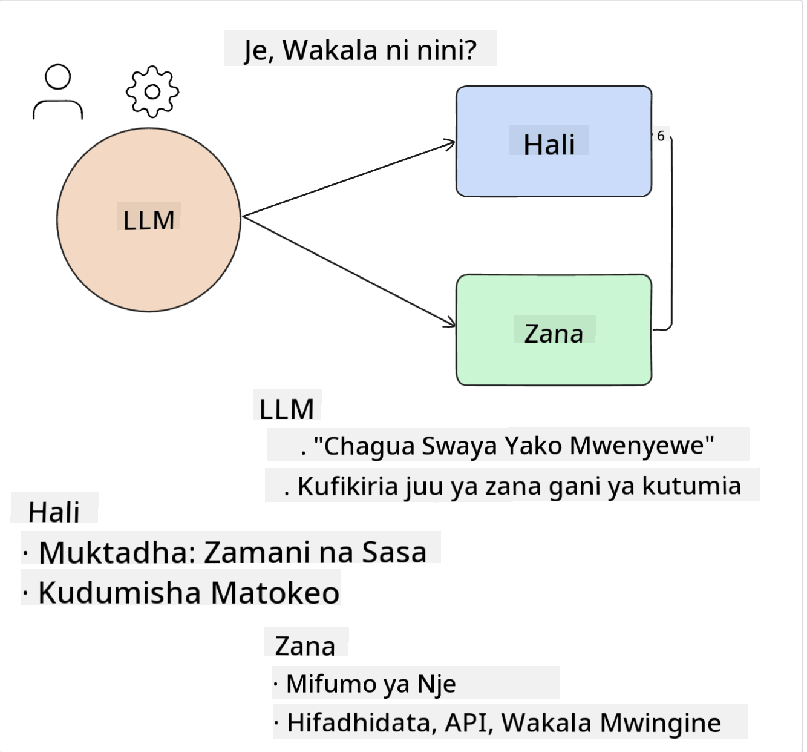
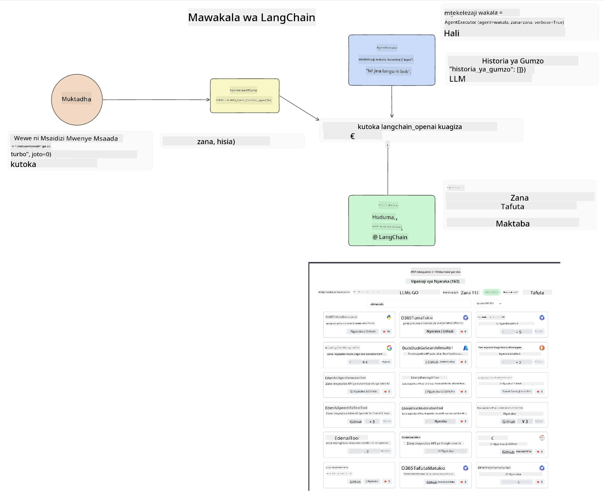
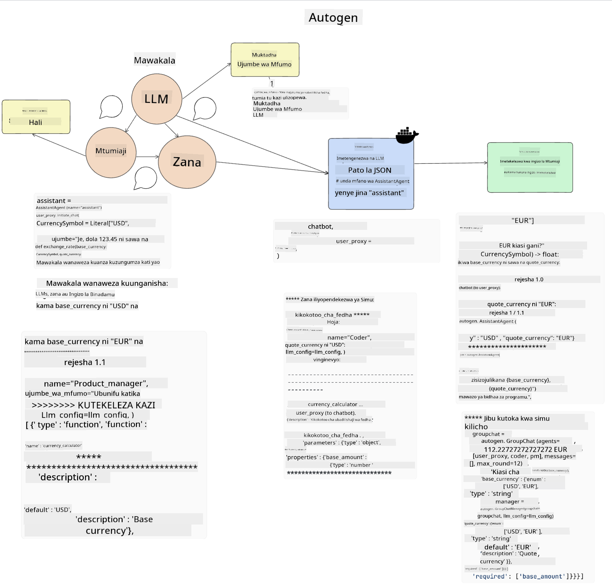
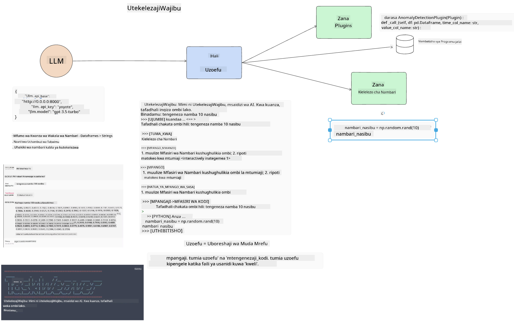
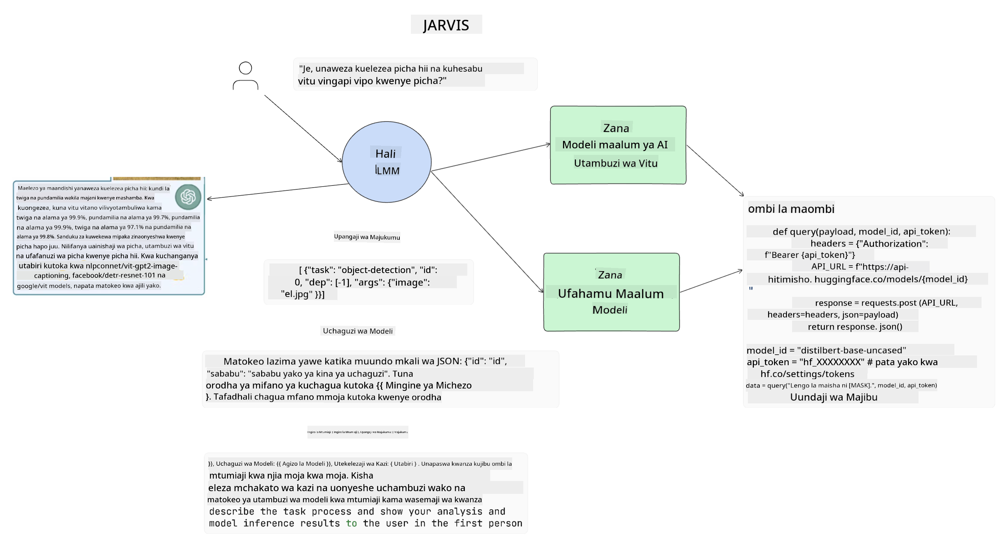

<!--
CO_OP_TRANSLATOR_METADATA:
{
  "original_hash": "11f03c81f190d9cbafd0f977dcbede6c",
  "translation_date": "2025-06-26T00:23:23+00:00",
  "source_file": "17-ai-agents/README.md",
  "language_code": "sw"
}
-->
[](https://aka.ms/gen-ai-lesson17-gh?WT.mc_id=academic-105485-koreyst)

## Utangulizi

Wakala wa AI ni maendeleo ya kusisimua katika AI ya kizazi, ikiruhusu Mifano Mikubwa ya Lugha (LLMs) kubadilika kutoka kwa wasaidizi hadi kuwa mawakala wanaoweza kuchukua hatua. Mfumo wa Wakala wa AI unawawezesha watengenezaji kuunda programu zinazowapa LLMs ufikiaji wa zana na usimamizi wa hali. Mfumo huu pia huongeza mwonekano, ukiruhusu watumiaji na watengenezaji kufuatilia hatua zilizopangwa na LLMs, hivyo kuboresha usimamizi wa uzoefu.

Somo litashughulikia maeneo yafuatayo:

- Kuelewa Wakala wa AI ni nini - Wakala wa AI ni nini hasa?
- Kuchunguza mifumo minne tofauti ya Wakala wa AI - Nini kinawafanya kuwa wa kipekee?
- Kutumia Wakala hawa wa AI kwa matumizi tofauti - Tunapaswa kutumia Wakala wa AI lini?

## Malengo ya Kujifunza

Baada ya kuchukua somo hili, utaweza:

- Eleza Wakala wa AI ni nini na jinsi wanavyoweza kutumika.
- Kuwa na uelewa wa tofauti kati ya baadhi ya Mifumo maarufu ya Wakala wa AI, na jinsi wanavyotofautiana.
- Kuelewa jinsi Wakala wa AI wanavyofanya kazi ili kujenga programu nao.

## Wakala wa AI ni nini?

Wakala wa AI ni uwanja wa kusisimua sana katika ulimwengu wa AI ya kizazi. Pamoja na msisimko huu huja wakati mwingine mkanganyiko wa maneno na matumizi yake. Ili kuweka mambo rahisi na kujumuisha zana nyingi zinazorejelea Wakala wa AI, tutatumia ufafanuzi huu:

Wakala wa AI wanaruhusu Mifano Mikubwa ya Lugha (LLMs) kutekeleza kazi kwa kuwapa ufikiaji wa **hali** na **zana**.



Hebu tufafanue maneno haya:

**Mifano Mikubwa ya Lugha** - Hizi ni mifano inayorejelewa katika kozi hii kama vile GPT-3.5, GPT-4, Llama-2, n.k.

**Hali** - Hii inarejelea muktadha ambao LLM inafanya kazi. LLM hutumia muktadha wa vitendo vyake vya zamani na muktadha wa sasa, ikiongoza uamuzi wake wa vitendo vifuatavyo. Mfumo wa Wakala wa AI unawawezesha watengenezaji kudumisha muktadha huu kwa urahisi.

**Zana** - Ili kukamilisha kazi ambayo mtumiaji ameomba na ambayo LLM imepanga, LLM inahitaji ufikiaji wa zana. Baadhi ya mifano ya zana inaweza kuwa hifadhidata, API, programu ya nje au hata LLM nyingine!

Ufafanuzi huu utatumaini kukupa msingi mzuri unapojadili jinsi wanavyotekelezwa. Hebu tuchunguze mifumo tofauti ya Wakala wa AI:

## Wakala wa LangChain

[Wakala wa LangChain](https://python.langchain.com/docs/how_to/#agents?WT.mc_id=academic-105485-koreyst) ni utekelezaji wa ufafanuzi tuliopeana hapo juu.

Kusimamia **hali**, inatumia kazi iliyojengwa ndani inayoitwa `AgentExecutor`. Hii inakubali `agent` iliyofafanuliwa na `tools` zinazopatikana kwake.

`Agent Executor` pia huhifadhi historia ya mazungumzo ili kutoa muktadha wa mazungumzo.



LangChain inatoa [katalogi ya zana](https://integrations.langchain.com/tools?WT.mc_id=academic-105485-koreyst) ambazo zinaweza kuingizwa katika programu yako ambapo LLM inaweza kupata ufikiaji. Hizi zimetengenezwa na jamii na timu ya LangChain.

Unaweza kisha kufafanua zana hizi na kuzipitisha kwa `Agent Executor`.

Mwonekano ni kipengele kingine muhimu wakati wa kuzungumzia Wakala wa AI. Ni muhimu kwa watengenezaji wa programu kuelewa ni zana gani LLM inatumia na kwa nini. Kwa ajili ya hiyo, timu ya LangChain wameunda LangSmith.

## AutoGen

Mfumo wa Wakala wa AI unaofuata tutakaoujadili ni [AutoGen](https://microsoft.github.io/autogen/?WT.mc_id=academic-105485-koreyst). Lengo kuu la AutoGen ni mazungumzo. Mawakala ni **wa kuzungumza** na **wa kubadilika**.

**Wa kuzungumza -** LLMs zinaweza kuanza na kuendelea na mazungumzo na LLM nyingine ili kukamilisha kazi. Hii inafanywa kwa kuunda `AssistantAgents` na kuwapa ujumbe maalum wa mfumo.

```python

autogen.AssistantAgent( name="Coder", llm_config=llm_config, ) pm = autogen.AssistantAgent( name="Product_manager", system_message="Creative in software product ideas.", llm_config=llm_config, )

```

**Wa kubadilika** - Mawakala wanaweza kufafanuliwa si tu kama LLMs bali kuwa mtumiaji au zana. Kama mtengenezaji, unaweza kufafanua `UserProxyAgent` ambayo inawajibika kwa kuingiliana na mtumiaji kwa maoni katika kukamilisha kazi. Maoni haya yanaweza kuendelea na utekelezaji wa kazi au kuisimamisha.

```python
user_proxy = UserProxyAgent(name="user_proxy")
```

### Hali na Zana

Kubadilisha na kusimamia hali, Wakala msaidizi huzalisha msimbo wa Python kukamilisha kazi.

Hapa kuna mfano wa mchakato:



#### LLM iliyofafanuliwa na Ujumbe wa Mfumo

```python
system_message="For weather related tasks, only use the functions you have been provided with. Reply TERMINATE when the task is done."
```

Ujumbe huu wa mfumo unaelekeza LLM maalum kwa kazi gani zinafaa kwa kazi yake. Kumbuka, na AutoGen unaweza kuwa na Mawakala wa Msaidizi wengi waliowekwa na ujumbe tofauti wa mfumo.

#### Mazungumzo yanaanzishwa na Mtumiaji

```python
user_proxy.initiate_chat( chatbot, message="I am planning a trip to NYC next week, can you help me pick out what to wear? ", )

```

Ujumbe huu kutoka kwa user_proxy (Binadamu) ndio utakaonza mchakato wa Wakala kuchunguza kazi zinazowezekana ambazo inapaswa kutekeleza.

#### Kazi inatekelezwa

```bash
chatbot (to user_proxy):

***** Suggested tool Call: get_weather ***** Arguments: {"location":"New York City, NY","time_periond:"7","temperature_unit":"Celsius"} ******************************************************** --------------------------------------------------------------------------------

>>>>>>>> EXECUTING FUNCTION get_weather... user_proxy (to chatbot): ***** Response from calling function "get_weather" ***** 112.22727272727272 EUR ****************************************************************

```

Mara mazungumzo ya awali yanapochakatwa, Wakala atatuma zana inayopendekezwa kuita. Katika kesi hii, ni kazi inayoitwa `get_weather`. Depending on your configuration, this function can be automatically executed and read by the Agent or can be executed based on user input.

You can find a list of [AutoGen code samples](https://microsoft.github.io/autogen/docs/Examples/?WT.mc_id=academic-105485-koreyst) to further explore how to get started building.

## Taskweaver

The next agent framework we will explore is [Taskweaver](https://microsoft.github.io/TaskWeaver/?WT.mc_id=academic-105485-koreyst). It is known as a "code-first" agent because instead of working strictly with `strings` , it can work with DataFrames in Python. This becomes extremely useful for data analysis and generation tasks. This can be things like creating graphs and charts or generating random numbers.

### State and Tools

To manage the state of the conversation, TaskWeaver uses the concept of a `Planner`. The `Planner` is a LLM that takes the request from the users and maps out the tasks that need to be completed to fulfill this request.

To complete the tasks the `Planner` is exposed to the collection of tools called `Plugins`. Hii inaweza kuwa darasa za Python au mfasiri wa msimbo wa jumla. Plugins hizi zinahifadhiwa kama embeddings ili LLM iweze kutafuta plugin sahihi.



Hapa kuna mfano wa plugin ya kushughulikia utambuzi wa kasoro:

```python
class AnomalyDetectionPlugin(Plugin): def __call__(self, df: pd.DataFrame, time_col_name: str, value_col_name: str):
```

Msimbo unathibitishwa kabla ya kutekelezwa. Kipengele kingine cha kusimamia muktadha katika Taskweaver ni `experience`. Experience allows for the context of a conversation to be stored over to the long term in a YAML file. This can be configured so that the LLM improves over time on certain tasks given that it is exposed to prior conversations.

## JARVIS

The last agent framework we will explore is [JARVIS](https://github.com/microsoft/JARVIS?tab=readme-ov-file?WT.mc_id=academic-105485-koreyst). What makes JARVIS unique is that it uses an LLM to manage the `state` ya mazungumzo na `tools` ni mifano mingine ya AI. Kila moja ya mifano ya AI ni mifano maalum inayofanya kazi fulani kama utambuzi wa kitu, unukuzi au maelezo ya picha.



LLM, ikiwa ni mfano wa kusudi la jumla, inapokea ombi kutoka kwa mtumiaji na kutambua kazi maalum na hoja/data yoyote inayohitajika kukamilisha kazi.

```python
[{"task": "object-detection", "id": 0, "dep": [-1], "args": {"image": "e1.jpg" }}]
```

LLM kisha huunda ombi kwa namna ambayo mfano maalum wa AI unaweza kutafsiri, kama JSON. Mara baada ya mfano wa AI kurudisha utabiri wake kulingana na kazi, LLM hupokea jibu.

Ikiwa mifano mingi inahitajika kukamilisha kazi, pia itatafsiri jibu kutoka kwa mifano hiyo kabla ya kuileta pamoja ili kutoa jibu kwa mtumiaji.

Mfano hapa chini unaonyesha jinsi hii ingefanya kazi wakati mtumiaji anaomba maelezo na idadi ya vitu kwenye picha:

## Kazi

Kuendelea na kujifunza kwako kuhusu Wakala wa AI unaweza kujenga na AutoGen:

- Programu inayosimulia mkutano wa biashara na idara tofauti za kuanza kwa elimu.
- Unda ujumbe wa mfumo unaoelekeza LLMs katika kuelewa watu tofauti na vipaumbele, na kuwezesha mtumiaji kupendekeza wazo jipya la bidhaa.
- LLM inapaswa kisha kutoa maswali ya ufuatiliaji kutoka kila idara ili kuboresha na kuboresha wazo la bidhaa.

## Kujifunza hakusimami hapa, endelea na Safari

Baada ya kukamilisha somo hili, angalia [mkusanyiko wetu wa Kujifunza AI ya Kizazi](https://aka.ms/genai-collection?WT.mc_id=academic-105485-koreyst) ili kuendelea kuongeza maarifa yako ya AI ya Kizazi!

**Kanusho**:  
Hati hii imetafsiriwa kwa kutumia huduma ya tafsiri ya AI [Co-op Translator](https://github.com/Azure/co-op-translator). Ingawa tunajitahidi kwa usahihi, tafadhali fahamu kwamba tafsiri za kiotomatiki zinaweza kuwa na makosa au kutokua sahihi. Hati ya asili katika lugha yake ya awali inapaswa kuzingatiwa kama chanzo cha mamlaka. Kwa taarifa muhimu, tafsiri ya kitaalamu ya kibinadamu inapendekezwa. Hatutawajibika kwa kutoelewana au tafsiri potofu zinazotokana na matumizi ya tafsiri hii.