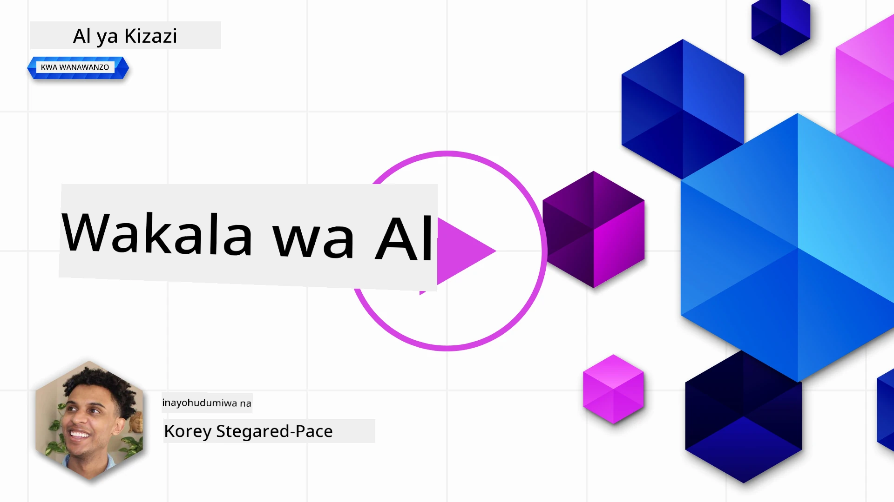
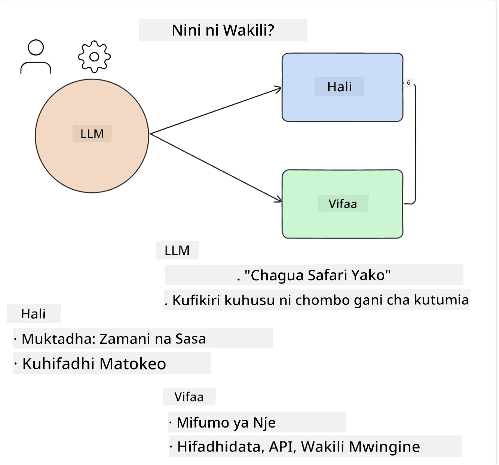
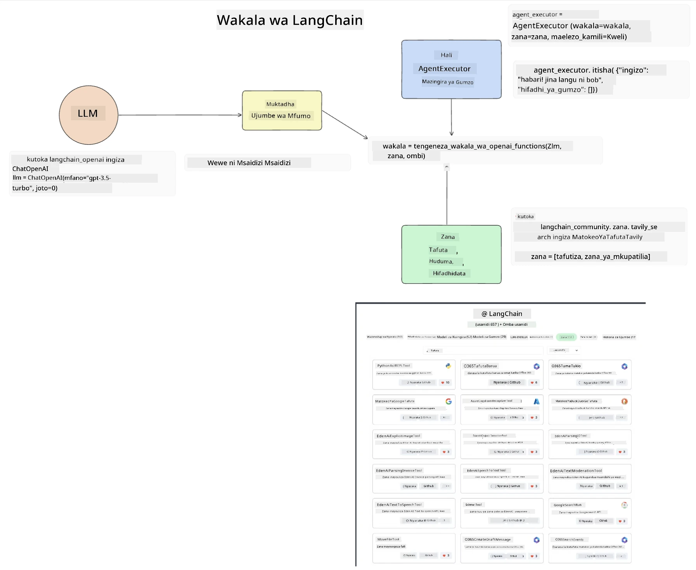
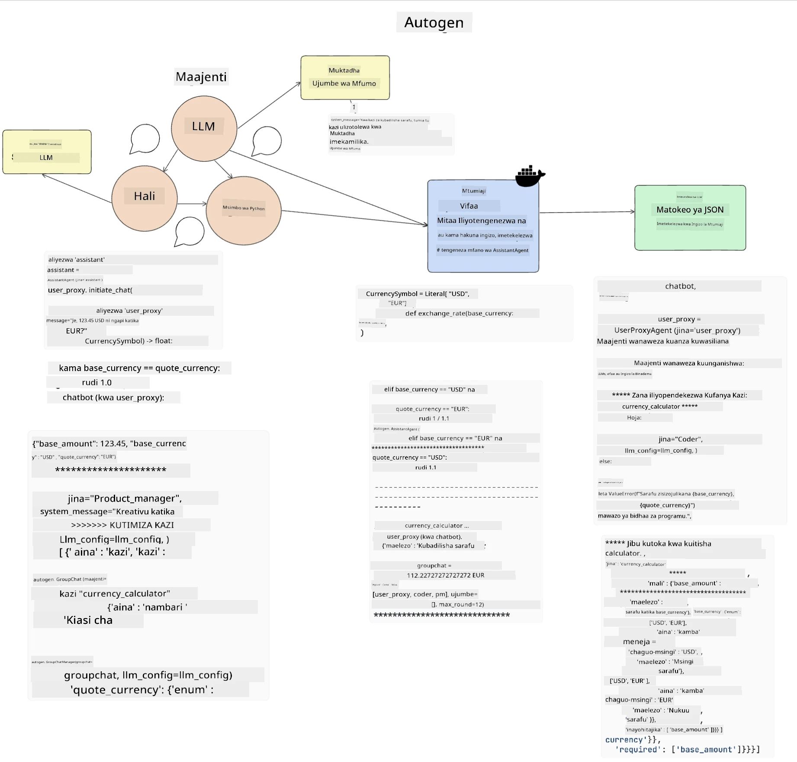
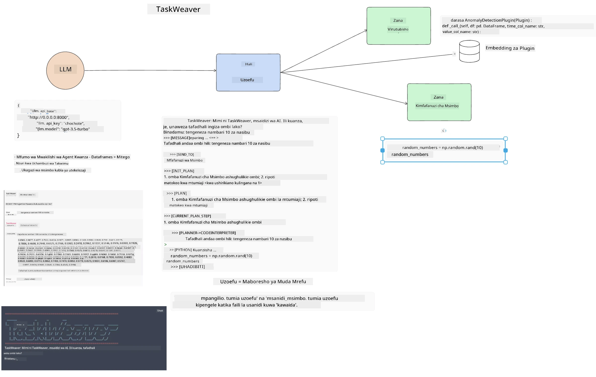

[](https://youtu.be/yAXVW-lUINc?si=bOtW9nL6jc3XJgOM)

## Utangulizi

Wawakilishi wa AI ni maendeleo ya kusisimua katika AI ya Kizazi, kuwezesha Modeli Kubwa za Lugha (LLMs) kubadilika kutoka kwa wasaidizi kuwa wawakilishi wanaoweza kuchukua hatua. Mfumo wa Wawakilishi wa AI unawawezesha watengenezaji kuunda programu zinazowapa LLMs upatikanaji wa zana na usimamizi wa hali. Mifumo hii pia huongeza uwazi, kuwezesha watumiaji na watengenezaji kufuatilia hatua zinazopangwa na LLMs, hivyo kuboresha usimamizi wa uzoefu.

Somo hili litashughulikia maeneo yafuatayo:

- Kuelewa ni nini hasa Wawakilishi wa AI - Ni Wawakilishi wa AI nini hasa?
- Kuchunguza mifumo minne tofauti ya Wawakilishi wa AI - Ni nini kinawafanya wawe wa kipekee?
- Kutumia Wawakilishi hawa wa AI katika matumizi tofauti - Tufae tuwatumie lini Wawakilishi wa AI?

## Malengo ya Kujifunza

Baada ya kuchukua somo hili, utaweza:

- Kueleza ni nini Wawakilishi wa AI na jinsi wanavyoweza kutumika.
- Kuwa na uelewa wa tofauti kati ya baadhi ya mifumo maarufu ya Wawakilishi wa AI, na jinsi zinavyotofautiana.
- Kuelewa jinsi Wawakilishi wa AI wanavyofanya kazi ili kuweza kujenga programu kwao.

## Wawakilishi wa AI ni Nani?

Wawakilishi wa AI ni eneo la kusisimua sana katika ulimwengu wa AI ya Kizazi. Pamoja na msisimko huu huja mara nyingine kuchanganyikiwa kwa maneno na matumizi yao. Ili kuweka mambo rahisi na kujumuisha zana nyingi zinazorejelea Wawakilishi wa AI, tutatumia ufafanuzi huu:

Wawakilishi wa AI huruhusu Modeli Kubwa za Lugha (LLMs) kufanya kazi kwa kuwapa upatikanaji wa **hali** na **zana**.



Hebu tufe ufafanuzi wa maneno haya:

**Modeli Kubwa za Lugha** - Hizi ni modeli zinazotajwa katika kozi hii kama GPT-3.5, GPT-4, Llama-2, n.k.

**Hali** - Hii inahusu muktadha ambao LLM inafanya kazi ndani yake. LLM hutumia muktadha wa hatua zake za zamani na muktadha wa sasa, kuongoza maamuzi yake kwa hatua zinazofuata. Mfumo wa Wawakilishi wa AI unawawezesha watengenezaji kudumisha muktadha huu kwa urahisi zaidi.

**Zana** - Ili kumaliza kazi ambayo mtumiaji ameiomba na kwamba LLM imepanga, LLM inahitaji upatikanaji wa zana. Mifano ya zana ni kama hifadhidata, API, programu ya nje au hata LLM nyingine!

Ufafanuzi huu unatarajiwa kutoa msingi mzuri unapokuwa tayari kuchunguza jinsi zinavyotekelezwa. Hebu tuchunguze mifumo kadhaa tofauti ya Wawakilishi wa AI:

## Wawakilishi wa LangChain

[Wawakilishi wa LangChain](https://python.langchain.com/docs/how_to/#agents?WT.mc_id=academic-105485-koreyst) ni utekelezaji wa ufafanuzi tuliotoa hapo juu.

Ili kusimamia **hali**, hutumia kifaa kilichojengwa kinachoitwa `AgentExecutor`. Hiki huchukua `agency` iliyobainishwa na `zanaa` zinazopatikana kwake.

`AgentExecutor` pia huhifadhi historia ya mazungumzo kutoa muktadha wa mazungumzo hayo.



LangChain hutoa [orodha ya zana](https://integrations.langchain.com/tools?WT.mc_id=academic-105485-koreyst) ambazo zinaweza kuingizwa kwenye programu yako ambako LLM inaweza kupata upatikanaji. Hizi zimetengenezwa na jamii na timu ya LangChain.

Kisha unaweza kufafanua zana hizi na kuzipitisha kwa `AgentExecutor`.

Uwazi ni sehemu nyingine muhimu wakati wa kuzungumzia Wawakilishi wa AI. Ni muhimu kwa watengenezaji wa programu kuelewa ni zana gani LLM inazitumia na kwa nini.. Kwa ajili hiyo, timu ya LangChain wameunda LangSmith.

## AutoGen

Mfumo mwingine wa Wawakilishi wa AI tutakachojadili ni [AutoGen](https://microsoft.github.io/autogen/?WT.mc_id=academic-105485-koreyst). Lengo kuu la AutoGen ni mazungumzo. Wawakilishi ni **waiwezekanao kuzungumza** na **waweza kubadilishwa**.

**Kuwaweza kuzungumza -** LLM zinaweza kuanzisha na kuendelea na mazungumzo na LLM nyingine ili kumaliza kazi. Hii hufanyika kwa kuunda `AssistantAgents` na kuwapa ujumbe maalum wa mfumo.

```python

autogen.AssistantAgent( name="Coder", llm_config=llm_config, ) pm = autogen.AssistantAgent( name="Product_manager", system_message="Creative in software product ideas.", llm_config=llm_config, )

```

**Kubadilishwa** - Wawakilishi wanaweza kufafanuliwa si tu kama LLM bali pia kama mtumiaji au zana. Kama msanidi programu, unaweza kufafanua `UserProxyAgent` ambaye anawajibika kuwasiliana na mtumiaji kwa mrejesho katika kumaliza kazi. Mrejesho huu unaweza kuendelea na utekelezaji wa kazi au kuuisitisha.

```python
user_proxy = UserProxyAgent(name="user_proxy")
```

### Hali na Zana

Kusimamia na kubadilisha hali, Msaidizi wa Agent hutengeneza msimbo wa Python ili kumaliza kazi.

Hapa kuna mfano wa mchakato:



#### LLM Imefafanuliwa kwa Ujumbe wa Mfumo

```python
system_message="For weather related tasks, only use the functions you have been provided with. Reply TERMINATE when the task is done."
```

Ujumbe huu wa mfumo unaelekeza LLM hii maalum ni zipi kazi zinazofaa kwa kazi yake. Kumbuka, na AutoGen unaweza kuwa na AssistantAgents wengi waliofafanuliwa na ujumbe tofauti wa mfumo.

#### Mazungumzo Yaanza kwa Mtumiaji

```python
user_proxy.initiate_chat( chatbot, message="I am planning a trip to NYC next week, can you help me pick out what to wear? ", )

```

Ujumbe huu kutoka kwa user_proxy (Binadamu) ndilo litaanza mchakato wa Mwakilishi kuchunguza kazi zinazowezekana anazopaswa kutekeleza.

#### Kazi Inatekelezwa

```bash
chatbot (to user_proxy):

***** Suggested tool Call: get_weather ***** Arguments: {"location":"New York City, NY","time_periond:"7","temperature_unit":"Celsius"} ******************************************************** --------------------------------------------------------------------------------

>>>>>>>> EXECUTING FUNCTION get_weather... user_proxy (to chatbot): ***** Response from calling function "get_weather" ***** 112.22727272727272 EUR ****************************************************************

```

Mara tu mazungumzo ya awali yatakapokamilika, Mwakilishi atatuma zana iliyopendekezwa kuitwa. Katika kesi hii, ni kazi iliotajwa `get_weather`. Kulingana na usanidi wako, kazi hii inaweza kutekelezwa moja kwa moja na kusomwa na Mwakilishi au inaweza kutekelezwa kulingana na maoni ya mtumiaji.

Unaweza kupata orodha ya [mifano ya msimbo wa AutoGen](https://microsoft.github.io/autogen/docs/Examples/?WT.mc_id=academic-105485-koreyst) kuchunguza zaidi jinsi ya kuanza kujenga.

## Taskweaver

Mfumo mwingine wa wawakilishi utakaotuchunguza ni [Taskweaver](https://microsoft.github.io/TaskWeaver/?WT.mc_id=academic-105485-koreyst). Unajulikana kama wakala wa "msimbo kwanza" kwa sababu badala ya kufanya kazi kwa `mfisadi` pekee, unaweza kufanya kazi na DataFrames ndani ya Python. Hii inakuwa ya msaada sana kwa kazi za uchambuzi wa data na utengenezaji. Hii inaweza kuwa vitu kama kutengeneza chati na michoro au kuzalisha nambari za nasibu.

### Hali na Zana

Kusimamia hali ya mazungumzo, TaskWeaver hutumia dhana ya `mpangaji` (Planner). `Mpangaji` ni LLM inayochukua ombi kutoka kwa watumiaji na kupanga kazi zinazohitajika kutekelezwa ili kutimiza ombi hilo.

Ili kukamilisha kazi, `Mpangaji` hupata mkusanyiko wa zana zinazojulikana kama `viendelezi` (Plugins). Hizi zinaweza kuwa madarasa ya Python au tafsiri ya msimbo wa jumla. Viendelezi hivi huhifadhiwa kama embeddings ili LLM ipate urahisi wa kutafuta kiendelezi sahihi.



Hapa kuna mfano wa kiendelezi cha kushughulikia kugundua dosari:

```python
class AnomalyDetectionPlugin(Plugin): def __call__(self, df: pd.DataFrame, time_col_name: str, value_col_name: str):
```

Msimbo unakaguliwa kabla ya kutekelezwa. Kipengele kingine cha kusimamia muktadha katika Taskweaver ni `uzoefu`. Uzoefu unaruhusu muktadha wa mazungumzo kuhifadhiwa kwa muda mrefu katika faili la YAML. Hii inaweza kusanidiwa ili LLM iboreze kwa muda katika kazi fulani ikizingatia kwamba imeonyeshwa mazungumzo ya awali.

## JARVIS

Mfumo wa mwisho wa wawakilishi tutakaochunguza ni [JARVIS](https://github.com/microsoft/JARVIS?tab=readme-ov-file&WT.mc_id=academic-105485-koreyst). Kinachomfanya JARVIS kuwa wa kipekee ni kwamba hutumia LLM kusimamia `hali` ya mazungumzo na `zana` ni modeli nyingine za AI. Kila modeli ya AI ni modeli maalum inayotekeleza kazi fulani kama kugundua vitu, uandikishaji au kutengeneza maelezo ya picha.


LLM, ikiwa ni modeli ya matumizi ya jumla, hupokea ombi kutoka kwa mtumiaji na kubaini kazi maalum na hoja/data zinazohitajika kukamilisha kazi hiyo.

```python
[{"task": "object-detection", "id": 0, "dep": [-1], "args": {"image": "e1.jpg" }}]
```

LLM huunda ombi hilo kwa njia ambayo modeli maalum ya AI inaweza kuelewa, kama JSON. Mara modeli ya AI itakaporudisha utabiri wake kulingana na kazi, LLM hupokea jibu.

Kama modeli nyingi zinahitajika kukamilisha kazi, pia itatafsiri majibu kutoka kwa modeli hizo kabla ya kuziunganisha pamoja kuzalisha jibu kwa mtumiaji.

Mfano hapo chini unaonyesha jinsi hili lifanyike wakati mtumiaji anaiomba maelezo na idadi ya vitu katika picha:

## Kazi ya Nyumbani

Kuendelea na kujifunza kwako kwa Wawakilishi wa AI unaweza kujenga kwa kutumia AutoGen:

- Programu inayosimulia mkutano wa biashara na idara tofauti za kampuni inayojishughulisha na elimu.
- Tengeneza ujumbe wa mfumo unaoongoza LLM kuelewa tabia na vipaumbele tofauti, na kuruhusu mtumiaji kupendekeza wazo jipya la bidhaa.
- LLM inapaswa kisha kuzalisha maswali ya kuendeleza kutoka katika kila idara ili kuboresha na kudhibiti wazo la bidhaa na pendekezo.

## Kujifunza hakukomi hapa, endelea Safari

Baada ya kukamilisha somo hili, angalia [Mkusanyiko wetu wa Kujifunza AI wa Kizazi](https://aka.ms/genai-collection?WT.mc_id=academic-105485-koreyst) ili kuendelea kuongeza maarifa yako ya AI ya Kizazi!

---

<!-- CO-OP TRANSLATOR DISCLAIMER START -->
**Tangazo la Kukataa**:
Karatasi hii imetafsiriwa kwa kutumia huduma ya utafsiri ya AI [Co-op Translator](https://github.com/Azure/co-op-translator). Ingawa tunajitahidi kuhakikisha usahihi, tafadhali fahamu kwamba tafsiri za moja kwa moja zinaweza kuwa na makosa au upungufu wa usahihi. Nyaraka asilia katika lugha yake ya asili inapaswa kuchukuliwa kama chanzo cha kuhakikishwa. Kwa taarifa muhimu, tafsiri ya kitaalamu ya binadamu inapendekezwa. Hatubebwi dhamana kwa uelewa au tafsiri isiyo sahihi itakayotokea kutokana na matumizi ya tafsiri hii.
<!-- CO-OP TRANSLATOR DISCLAIMER END -->