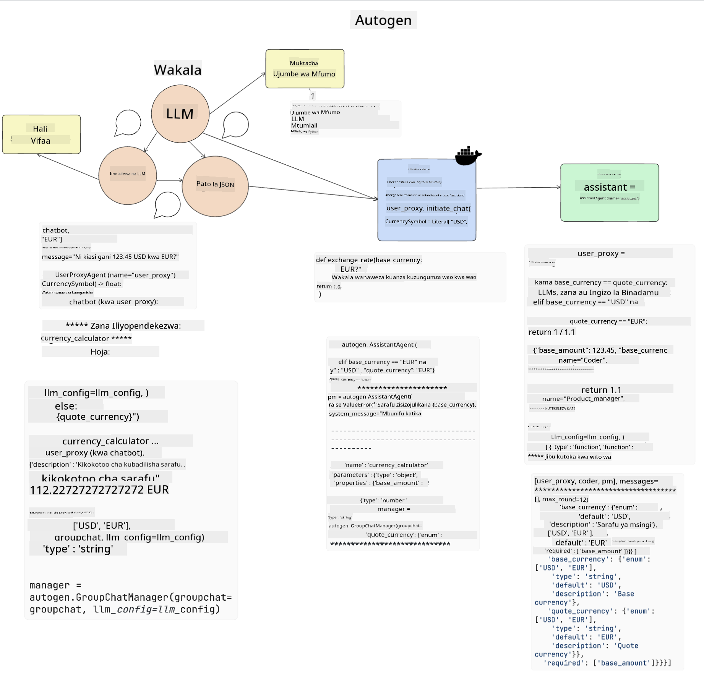

<!--
CO_OP_TRANSLATOR_METADATA:
{
  "original_hash": "11f03c81f190d9cbafd0f977dcbede6c",
  "translation_date": "2025-07-09T17:29:40+00:00",
  "source_file": "17-ai-agents/README.md",
  "language_code": "sw"
}
-->
[](https://aka.ms/gen-ai-lesson17-gh?WT.mc_id=academic-105485-koreyst)

## Utangulizi

Wakala wa AI ni maendeleo ya kusisimua katika AI ya Kizazi, ambayo inawawezesha Modeli Kubwa za Lugha (LLMs) kuhamia kutoka kuwa wasaidizi hadi kuwa mawakala wanaoweza kuchukua hatua. Mifumo ya Wakala wa AI inawawezesha watengenezaji kuunda programu zinazowapa LLMs ufikiaji wa zana na usimamizi wa hali. Mifumo hii pia huongeza uwazi, kuruhusu watumiaji na watengenezaji kufuatilia hatua zinazopangwa na LLMs, hivyo kuboresha usimamizi wa uzoefu.

Somo hili litashughulikia maeneo yafuatayo:

- Kuelewa ni nini Wakala wa AI - Wakala wa AI ni nini hasa?
- Kuchunguza mifumo minne tofauti ya Wakala wa AI - Nini kinawafanya wawe wa kipekee?
- Kutumia Wakala hawa wa AI katika matumizi tofauti - Lini tunapaswa kutumia Wakala wa AI?

## Malengo ya Kujifunza

Baada ya kuchukua somo hili, utaweza:

- Kueleza ni nini Wakala wa AI na jinsi wanavyoweza kutumika.
- Kuwa na uelewa wa tofauti kati ya baadhi ya mifumo maarufu ya Wakala wa AI, na jinsi zinavyotofautiana.
- Kuelewa jinsi Wakala wa AI wanavyofanya kazi ili kuweza kujenga programu kwa kutumia wao.

## Wakala wa AI ni Nini?

Wakala wa AI ni eneo la kusisimua sana katika dunia ya AI ya Kizazi. Pamoja na msisimko huu huja mara nyingine mkanganyiko wa maneno na matumizi yao. Ili kuweka mambo rahisi na kujumuisha zana nyingi zinazorejelea Wakala wa AI, tutatumia ufafanuzi huu:

Wakala wa AI huwapa Modeli Kubwa za Lugha (LLMs) uwezo wa kutekeleza kazi kwa kuwapa ufikiaji wa **hali** na **zana**.


Hebu tuelezee maneno haya:

**Modeli Kubwa za Lugha** - Hizi ni modeli zinazotajwa katika kozi hii kama GPT-3.5, GPT-4, Llama-2, n.k.

**Hali** - Hii inahusu muktadha ambao LLM inafanya kazi ndani yake. LLM hutumia muktadha wa hatua zake za awali na muktadha wa sasa, kuongoza maamuzi yake kwa hatua zinazofuata. Mifumo ya Wakala wa AI huwasaidia watengenezaji kudumisha muktadha huu kwa urahisi zaidi.

**Zana** - Ili kukamilisha kazi ambayo mtumiaji ameomba na ambayo LLM imepanga, LLM inahitaji ufikiaji wa zana. Mfano wa zana ni kama hifadhidata, API, programu ya nje au hata LLM nyingine!

Ufafanuzi huu unatarajiwa kukupa msingi mzuri unapoendelea tunapochunguza jinsi zinavyotekelezwa. Hebu tuchunguze mifumo tofauti ya Wakala wa AI:

## Wakala wa LangChain

[Wakala wa LangChain](https://python.langchain.com/docs/how_to/#agents?WT.mc_id=academic-105485-koreyst) ni utekelezaji wa ufafanuzi tuliopewa hapo juu.

Ili kusimamia **hali**, hutumia kipengele kilichojengwa kinachoitwa `AgentExecutor`. Hiki hukubali `agent` iliyobainishwa na `tools` zinazopatikana kwake.

`Agent Executor` pia huhifadhi historia ya mazungumzo kutoa muktadha wa mazungumzo.


LangChain hutoa [orodha ya zana](https://integrations.langchain.com/tools?WT.mc_id=academic-105485-koreyst) ambazo zinaweza kuingizwa kwenye programu yako ambapo LLM inaweza kupata ufikiaji. Hizi hutengenezwa na jamii na timu ya LangChain.

Baadaye unaweza kufafanua zana hizi na kuzipitisha kwa `Agent Executor`.

Uwazi ni kipengele kingine muhimu tunapozungumzia Wakala wa AI. Ni muhimu kwa watengenezaji wa programu kuelewa ni zana gani LLM inazitumia na kwa nini. Kwa ajili hiyo, timu ya LangChain imeunda LangSmith.

## AutoGen

Mfumo mwingine wa Wakala wa AI tutaozungumza ni [AutoGen](https://microsoft.github.io/autogen/?WT.mc_id=academic-105485-koreyst). Lengo kuu la AutoGen ni mazungumzo. Wakala ni **waweza kuzungumza** na **waweza kubadilishwa**.

**Waweza kuzungumza -** LLM zinaweza kuanzisha na kuendelea na mazungumzo na LLM nyingine ili kukamilisha kazi. Hii hufanyika kwa kuunda `AssistantAgents` na kuwapa ujumbe maalum wa mfumo.

```python

autogen.AssistantAgent( name="Coder", llm_config=llm_config, ) pm = autogen.AssistantAgent( name="Product_manager", system_message="Creative in software product ideas.", llm_config=llm_config, )

```

**Waweza kubadilishwa** - Wakala wanaweza kufafanuliwa si tu kama LLM bali pia kama mtumiaji au zana. Kama mtengenezaji, unaweza kufafanua `UserProxyAgent` ambaye anahusika na kuwasiliana na mtumiaji kwa maoni kuhusu kukamilisha kazi. Maoni haya yanaweza kuendelea au kusitisha utekelezaji wa kazi.

```python
user_proxy = UserProxyAgent(name="user_proxy")
```

### Hali na Zana

Kusimamia na kubadilisha hali, Msaidizi wa Wakala hutengeneza msimbo wa Python kukamilisha kazi.

Hapa kuna mfano wa mchakato:



#### LLM Imefafanuliwa kwa Ujumbe wa Mfumo

```python
system_message="For weather related tasks, only use the functions you have been provided with. Reply TERMINATE when the task is done."
```

Ujumbe huu wa mfumo unaelekeza LLM hii maalum ni kazi gani zinazohusiana na jukumu lake. Kumbuka, kwa AutoGen unaweza kuwa na AssistantAgents wengi waliobainishwa na ujumbe tofauti wa mfumo.

#### Mazungumzo Yaanza na Mtumiaji

```python
user_proxy.initiate_chat( chatbot, message="I am planning a trip to NYC next week, can you help me pick out what to wear? ", )

```

Ujumbe huu kutoka kwa user_proxy (Binadamu) ndio unaoanzisha mchakato wa Wakala kuchunguza kazi zinazowezekana anazopaswa kutekeleza.

#### Kazi Inatekelezwa

```bash
chatbot (to user_proxy):

***** Suggested tool Call: get_weather ***** Arguments: {"location":"New York City, NY","time_periond:"7","temperature_unit":"Celsius"} ******************************************************** --------------------------------------------------------------------------------

>>>>>>>> EXECUTING FUNCTION get_weather... user_proxy (to chatbot): ***** Response from calling function "get_weather" ***** 112.22727272727272 EUR ****************************************************************

```

Mara mazungumzo ya awali yanaposhughulikiwa, Wakala atatuma zana inayopendekezwa kuitwa. Katika kesi hii, ni kazi iitwayo `get_weather`. Kulingana na usanidi wako, kazi hii inaweza kutekelezwa moja kwa moja na kusomwa na Wakala au kutekelezwa kulingana na maingizo ya mtumiaji.

Unaweza kupata orodha ya [mifano ya msimbo wa AutoGen](https://microsoft.github.io/autogen/docs/Examples/?WT.mc_id=academic-105485-koreyst) ili kuchunguza zaidi jinsi ya kuanza kujenga.

## Taskweaver

Mfumo mwingine wa wakala tutaochunguza ni [Taskweaver](https://microsoft.github.io/TaskWeaver/?WT.mc_id=academic-105485-koreyst). Unajulikana kama wakala wa "msimbo kwanza" kwa sababu badala ya kufanya kazi tu na `strings`, unaweza kufanya kazi na DataFrames katika Python. Hii ni muhimu sana kwa kazi za uchambuzi na uzalishaji wa data. Hii inaweza kuwa kama kuunda grafu na chati au kuzalisha nambari za bahati nasibu.

### Hali na Zana

Kusimamia hali ya mazungumzo, TaskWeaver hutumia dhana ya `Planner`. `Planner` ni LLM inayochukua ombi kutoka kwa watumiaji na kupanga kazi zinazohitajika kukamilishwa ili kutimiza ombi hilo.

Ili kukamilisha kazi, `Planner` inaruhusu kutumia mkusanyiko wa zana unaoitwa `Plugins`. Hizi zinaweza kuwa madarasa ya Python au mfasiri wa msimbo wa jumla. Plugins hizi huhifadhiwa kama embeddings ili LLM iweze kutafuta plugin sahihi kwa urahisi zaidi.


Hapa kuna mfano wa plugin ya kushughulikia ugunduzi wa kasoro:

```python
class AnomalyDetectionPlugin(Plugin): def __call__(self, df: pd.DataFrame, time_col_name: str, value_col_name: str):
```

Msimbo unathibitishwa kabla ya kutekelezwa. Kipengele kingine cha kusimamia muktadha katika Taskweaver ni `experience`. Experience huruhusu muktadha wa mazungumzo kuhifadhiwa kwa muda mrefu katika faili la YAML. Hii inaweza kusanidiwa ili LLM iboreze kwa muda katika kazi fulani ikizingatia kuwa inapata mazungumzo ya awali.

## JARVIS

Mfumo wa mwisho wa wakala tutaochunguza ni [JARVIS](https://github.com/microsoft/JARVIS?tab=readme-ov-file?WT.mc_id=academic-105485-koreyst). Kinachomfanya JARVIS kuwa wa kipekee ni kwamba hutumia LLM kusimamia `hali` ya mazungumzo na `zana` ni modeli nyingine za AI. Kila moja ya modeli hizi za AI ni maalum na hufanya kazi fulani kama kugundua vitu, uandishi wa maneno au maelezo ya picha.


LLM, ikiwa ni modeli ya matumizi ya jumla, hupokea ombi kutoka kwa mtumiaji na kubaini kazi maalum na hoja/data inayohitajika kukamilisha kazi.

```python
[{"task": "object-detection", "id": 0, "dep": [-1], "args": {"image": "e1.jpg" }}]
```

LLM kisha huandaa ombi kwa njia ambayo modeli maalum ya AI inaweza kuelewa, kama JSON. Mara modeli ya AI inapotoa utabiri wake kulingana na kazi, LLM hupokea jibu.

Ikiwa modeli nyingi zinahitajika kukamilisha kazi, pia itatafsiri majibu kutoka kwa modeli hizo kabla ya kuziunganisha kutoa jibu kwa mtumiaji.

Mfano hapa chini unaonyesha jinsi hii itakavyofanya kazi mtumiaji anapouliza maelezo na hesabu ya vitu vilivyo kwenye picha:

## Kazi ya Nyumbani

Ili kuendelea na kujifunza kwako kuhusu Wakala wa AI unaweza kujenga kwa AutoGen:

- Programu inayofanikisha mkutano wa biashara kati ya idara tofauti za kampuni ya elimu inayochipukia.
- Tengeneza ujumbe wa mfumo unaowaongoza LLM kuelewa tabia na vipaumbele tofauti, na kumruhusu mtumiaji kuwasilisha wazo jipya la bidhaa.
- LLM inapaswa kisha kuzalisha maswali ya kufuatilia kutoka kila idara ili kuboresha na kuimarisha wazo la bidhaa na uwasilishaji wake.

## Kujifunza hakukomi hapa, endelea Safari

Baada ya kumaliza somo hili, angalia [Mkusanyiko wetu wa Kujifunza AI ya Kizazi](https://aka.ms/genai-collection?WT.mc_id=academic-105485-koreyst) ili kuendelea kuinua ujuzi wako wa AI ya Kizazi!

**Kiarifu cha Kutotegemea**:  
Hati hii imetafsiriwa kwa kutumia huduma ya tafsiri ya AI [Co-op Translator](https://github.com/Azure/co-op-translator). Ingawa tunajitahidi kwa usahihi, tafadhali fahamu kuwa tafsiri za kiotomatiki zinaweza kuwa na makosa au upungufu wa usahihi. Hati ya asili katika lugha yake ya asili inapaswa kuchukuliwa kama chanzo cha mamlaka. Kwa taarifa muhimu, tafsiri ya kitaalamu inayofanywa na binadamu inapendekezwa. Hatubebei dhamana kwa kutoelewana au tafsiri potofu zinazotokana na matumizi ya tafsiri hii.