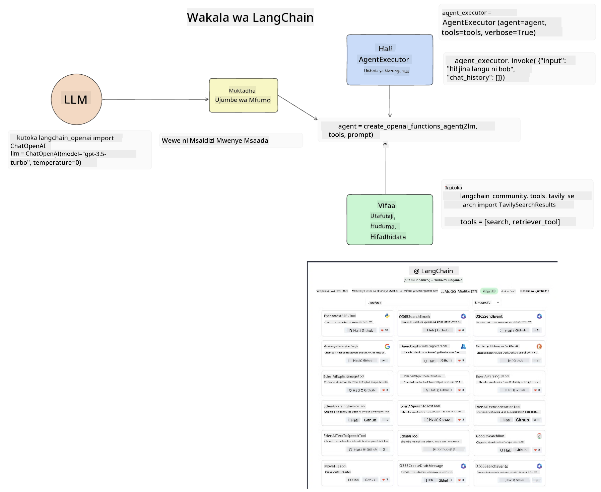
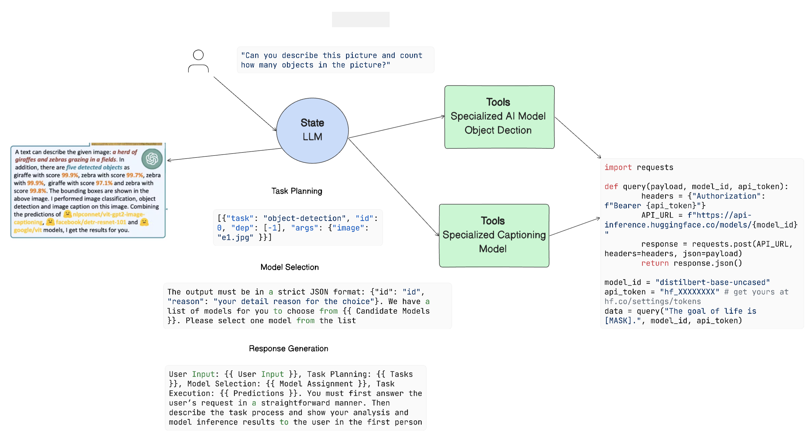

<!--
CO_OP_TRANSLATOR_METADATA:
{
  "original_hash": "8e8d1f6a63da606af7176a87ff8e92b6",
  "translation_date": "2025-10-17T21:19:39+00:00",
  "source_file": "17-ai-agents/README.md",
  "language_code": "sw"
}
-->
[](https://youtu.be/yAXVW-lUINc?si=bOtW9nL6jc3XJgOM)

## Utangulizi

Wakala wa AI ni maendeleo ya kusisimua katika AI ya Kizazi, yanayowezesha Mifano Mikubwa ya Lugha (LLMs) kubadilika kutoka kwa wasaidizi hadi kuwa mawakala wenye uwezo wa kuchukua hatua. Mfumo wa Wakala wa AI unawawezesha watengenezaji kuunda programu zinazotoa LLMs zana na usimamizi wa hali. Mfumo huu pia huongeza mwonekano, ukiruhusu watumiaji na watengenezaji kufuatilia hatua zinazopangwa na LLMs, hivyo kuboresha usimamizi wa uzoefu.

Somo hili litashughulikia maeneo yafuatayo:

- Kuelewa wakala wa AI ni nini - Wakala wa AI ni nini hasa?
- Kuchunguza mifumo minne tofauti ya Wakala wa AI - Nini kinachowafanya kuwa wa kipekee?
- Kutumia mawakala hawa wa AI kwa matumizi tofauti - Ni lini tunapaswa kutumia Wakala wa AI?

## Malengo ya Kujifunza

Baada ya kuchukua somo hili, utaweza:

- Kueleza wakala wa AI ni nini na jinsi wanavyoweza kutumika.
- Kuwa na uelewa wa tofauti kati ya baadhi ya mifumo maarufu ya Wakala wa AI, na jinsi wanavyotofautiana.
- Kuelewa jinsi mawakala wa AI wanavyofanya kazi ili kujenga programu nao.

## Wakala wa AI ni nini?

Wakala wa AI ni uwanja wa kusisimua sana katika ulimwengu wa AI ya Kizazi. Pamoja na msisimko huu mara nyingine kuna mkanganyiko wa maneno na matumizi yao. Ili kuweka mambo rahisi na kujumuisha zana nyingi zinazorejelea Wakala wa AI, tutatumia ufafanuzi huu:

Wakala wa AI huruhusu Mifano Mikubwa ya Lugha (LLMs) kutekeleza majukumu kwa kuwapa ufikiaji wa **hali** na **zana**.


Hebu tueleze maneno haya:

**Mifano Mikubwa ya Lugha** - Hizi ni mifano inayorejelewa katika kozi hii kama vile GPT-3.5, GPT-4, Llama-2, n.k.

**Hali** - Hii inahusu muktadha ambao LLM inafanya kazi ndani yake. LLM hutumia muktadha wa hatua zake za awali na muktadha wa sasa, ikiongoza maamuzi yake kwa hatua zinazofuata. Mfumo wa Wakala wa AI unawawezesha watengenezaji kudumisha muktadha huu kwa urahisi.

**Zana** - Ili kukamilisha jukumu ambalo mtumiaji ameomba na ambalo LLM imepanga, LLM inahitaji ufikiaji wa zana. Baadhi ya mifano ya zana inaweza kuwa hifadhidata, API, programu ya nje au hata LLM nyingine!

Ufafanuzi huu unapaswa kukupa msingi mzuri wa kuendelea mbele tunapochunguza jinsi wanavyotekelezwa. Hebu tuchunguze mifumo kadhaa tofauti ya Wakala wa AI:

## Mawakala wa LangChain

[Mawakala wa LangChain](https://python.langchain.com/docs/how_to/#agents?WT.mc_id=academic-105485-koreyst) ni utekelezaji wa ufafanuzi tuliotoa hapo juu.

Ili kusimamia **hali**, hutumia kazi iliyojengwa ndani inayoitwa `AgentExecutor`. Hii inakubali `agent` iliyofafanuliwa na `tools` zinazopatikana kwake.

`Agent Executor` pia huhifadhi historia ya mazungumzo ili kutoa muktadha wa mazungumzo.



LangChain inatoa [katalogi ya zana](https://integrations.langchain.com/tools?WT.mc_id=academic-105485-koreyst) ambazo zinaweza kuingizwa katika programu yako ambapo LLM inaweza kupata ufikiaji. Hizi zimetengenezwa na jamii na timu ya LangChain.

Unaweza kisha kufafanua zana hizi na kuzipitisha kwa `Agent Executor`.

Mwonekano ni kipengele kingine muhimu tunapozungumzia Mawakala wa AI. Ni muhimu kwa watengenezaji wa programu kuelewa ni zana gani LLM inatumia na kwa nini. Kwa hilo, timu ya LangChain imeunda LangSmith.

## AutoGen

Mfumo wa pili wa Wakala wa AI tutakaojadili ni [AutoGen](https://microsoft.github.io/autogen/?WT.mc_id=academic-105485-koreyst). Lengo kuu la AutoGen ni mazungumzo. Mawakala ni **wa kuzungumza** na **wa kubadilika**.

**Wa kuzungumza -** LLMs zinaweza kuanzisha na kuendelea mazungumzo na LLM nyingine ili kukamilisha jukumu. Hii inafanyika kwa kuunda `AssistantAgents` na kuwapa ujumbe maalum wa mfumo.

```python

autogen.AssistantAgent( name="Coder", llm_config=llm_config, ) pm = autogen.AssistantAgent( name="Product_manager", system_message="Creative in software product ideas.", llm_config=llm_config, )

```

**Wa kubadilika** - Mawakala wanaweza kufafanuliwa si tu kama LLMs bali pia kama mtumiaji au zana. Kama mtengenezaji, unaweza kufafanua `UserProxyAgent` ambaye anawajibika kwa kuingiliana na mtumiaji kwa maoni katika kukamilisha jukumu. Maoni haya yanaweza kuendelea utekelezaji wa jukumu au kuisimamisha.

```python
user_proxy = UserProxyAgent(name="user_proxy")
```

### Hali na Zana

Ili kubadilisha na kusimamia hali, Msaidizi Wakala huzalisha msimbo wa Python kukamilisha jukumu.

Hapa kuna mfano wa mchakato:


#### LLM Iliyofafanuliwa na Ujumbe wa Mfumo

```python
system_message="For weather related tasks, only use the functions you have been provided with. Reply TERMINATE when the task is done."
```

Ujumbe huu wa mfumo unaelekeza LLM maalum kwa kazi zake husika. Kumbuka, na AutoGen unaweza kuwa na Mawakala Wasaidizi wengi waliofafanuliwa na ujumbe tofauti wa mfumo.

#### Mazungumzo Yanaanzishwa na Mtumiaji

```python
user_proxy.initiate_chat( chatbot, message="I am planning a trip to NYC next week, can you help me pick out what to wear? ", )

```

Ujumbe huu kutoka kwa user_proxy (Binadamu) ndio utaanzisha mchakato wa Wakala kuchunguza kazi zinazowezekana ambazo inapaswa kutekeleza.

#### Kazi Inatekelezwa

```bash
chatbot (to user_proxy):

***** Suggested tool Call: get_weather ***** Arguments: {"location":"New York City, NY","time_periond:"7","temperature_unit":"Celsius"} ******************************************************** --------------------------------------------------------------------------------

>>>>>>>> EXECUTING FUNCTION get_weather... user_proxy (to chatbot): ***** Response from calling function "get_weather" ***** 112.22727272727272 EUR ****************************************************************

```

Mara mazungumzo ya awali yanapochakatwa, Wakala atatuma zana inayopendekezwa kuitwa. Katika kesi hii, ni kazi inayoitwa `get_weather`. Kulingana na usanidi wako, kazi hii inaweza kutekelezwa moja kwa moja na kusomwa na Wakala au kutekelezwa kulingana na pembejeo ya mtumiaji.

Unaweza kupata orodha ya [mifano ya msimbo wa AutoGen](https://microsoft.github.io/autogen/docs/Examples/?WT.mc_id=academic-105485-koreyst) ili kuchunguza zaidi jinsi ya kuanza kujenga.

## Taskweaver

Mfumo wa wakala unaofuata tutakaochunguza ni [Taskweaver](https://microsoft.github.io/TaskWeaver/?WT.mc_id=academic-105485-koreyst). Unajulikana kama wakala wa "msimbo kwanza" kwa sababu badala ya kufanya kazi tu na `strings`, unaweza kufanya kazi na DataFrames katika Python. Hii inakuwa muhimu sana kwa uchambuzi wa data na majukumu ya kizazi. Hii inaweza kuwa mambo kama kuunda grafu na chati au kuzalisha namba za nasibu.

### Hali na Zana

Ili kusimamia hali ya mazungumzo, TaskWeaver hutumia dhana ya `Planner`. `Planner` ni LLM inayochukua ombi kutoka kwa watumiaji na kupanga majukumu yanayohitajika kukamilisha ombi hili.

Ili kukamilisha majukumu, `Planner` inafikiwa na mkusanyiko wa zana zinazoitwa `Plugins`. Hizi zinaweza kuwa madarasa ya Python au mfasiri wa msimbo wa jumla. Plugins hizi zinahifadhiwa kama embeddings ili LLM iweze kutafuta plugin sahihi kwa urahisi.


Hapa kuna mfano wa plugin ya kushughulikia utambuzi wa kasoro:

```python
class AnomalyDetectionPlugin(Plugin): def __call__(self, df: pd.DataFrame, time_col_name: str, value_col_name: str):
```

Msimbo unathibitishwa kabla ya kutekelezwa. Kipengele kingine cha kusimamia muktadha katika Taskweaver ni `experience`. Uzoefu unaruhusu muktadha wa mazungumzo kuhifadhiwa kwa muda mrefu katika faili ya YAML. Hii inaweza kusanidiwa ili LLM iboreshe kwa muda katika majukumu fulani ikizingatiwa kuwa imefikiwa na mazungumzo ya awali.

## JARVIS

Mfumo wa wakala wa mwisho tutakaochunguza ni [JARVIS](https://github.com/microsoft/JARVIS?tab=readme-ov-file?WT.mc_id=academic-105485-koreyst). Kinachofanya JARVIS kuwa wa kipekee ni kwamba hutumia LLM kusimamia `hali` ya mazungumzo na `zana` ni mifano mingine ya AI. Kila moja ya mifano ya AI ni mifano maalum inayotekeleza majukumu fulani kama vile utambuzi wa vitu, unukuzi au maelezo ya picha.



LLM, ikiwa ni mfano wa matumizi ya jumla, hupokea ombi kutoka kwa mtumiaji na kutambua jukumu maalum na hoja/data yoyote inayohitajika kukamilisha jukumu.

```python
[{"task": "object-detection", "id": 0, "dep": [-1], "args": {"image": "e1.jpg" }}]
```

LLM kisha huunda ombi kwa namna ambayo mfano maalum wa AI unaweza kufasiri, kama JSON. Mara mfano wa AI unapotoa utabiri wake kulingana na jukumu, LLM hupokea majibu.

Ikiwa mifano mingi inahitajika kukamilisha jukumu, itatafsiri pia majibu kutoka kwa mifano hiyo kabla ya kuyakusanya pamoja ili kutoa majibu kwa mtumiaji.

Mfano hapa chini unaonyesha jinsi hii ingefanya kazi wakati mtumiaji anaomba maelezo na idadi ya vitu vilivyomo kwenye picha:

## Kazi

Ili kuendelea kujifunza kuhusu Mawakala wa AI unaweza kujenga na AutoGen:

- Programu inayosimulia mkutano wa biashara na idara tofauti za kampuni ya elimu.
- Unda ujumbe wa mfumo unaoelekeza LLMs kuelewa tabia tofauti na vipaumbele, na kumwezesha mtumiaji kuwasilisha wazo la bidhaa mpya.
- LLM inapaswa kisha kuzalisha maswali ya ufuatiliaji kutoka kila idara ili kuboresha na kuboresha wazo la bidhaa.

## Kujifunza hakuishii hapa, endelea na Safari

Baada ya kukamilisha somo hili, angalia [mkusanyiko wa Kujifunza AI ya Kizazi](https://aka.ms/genai-collection?WT.mc_id=academic-105485-koreyst) ili kuendelea kuongeza maarifa yako ya AI ya Kizazi!

---

**Kanusho**:  
Hati hii imetafsiriwa kwa kutumia huduma ya tafsiri ya AI [Co-op Translator](https://github.com/Azure/co-op-translator). Ingawa tunajitahidi kwa usahihi, tafadhali fahamu kuwa tafsiri za kiotomatiki zinaweza kuwa na makosa au kutokuwa sahihi. Hati ya asili katika lugha yake ya kiasili inapaswa kuzingatiwa kama chanzo cha mamlaka. Kwa taarifa muhimu, tafsiri ya kitaalamu ya binadamu inapendekezwa. Hatutawajibika kwa kutoelewana au tafsiri zisizo sahihi zinazotokana na matumizi ya tafsiri hii.