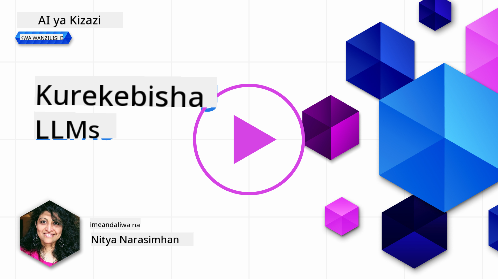
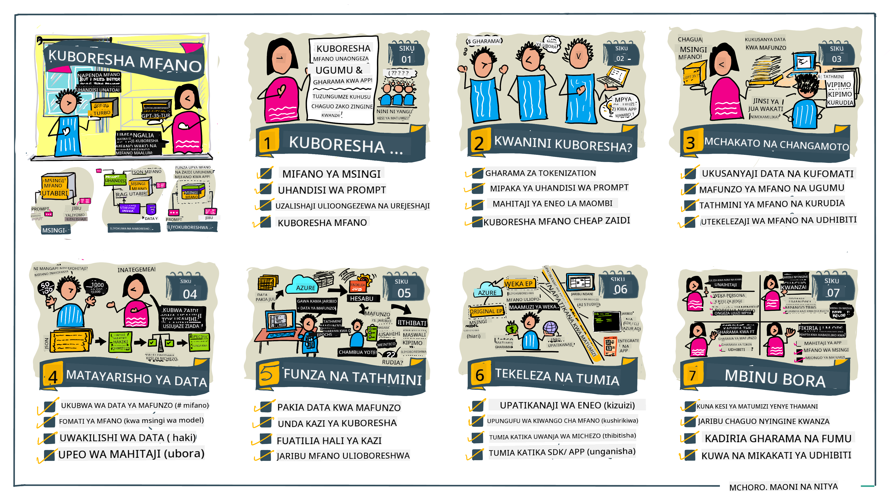

<!--
CO_OP_TRANSLATOR_METADATA:
{
  "original_hash": "68664f7e754a892ae1d8d5e2b7bd2081",
  "translation_date": "2025-07-09T17:47:49+00:00",
  "source_file": "18-fine-tuning/README.md",
  "language_code": "sw"
}
-->

# Kurekebisha LLM Yako kwa Undani

Kutumia mifano mikubwa ya lugha kujenga programu za AI zinazotengeneza maudhui kunakuja na changamoto mpya. Tatizo kuu ni kuhakikisha ubora wa majibu (usahihi na umuhimu) katika maudhui yanayotengenezwa na mfano kwa ombi la mtumiaji. Katika masomo yaliyopita, tulijadili mbinu kama uhandisi wa prompt na uzalishaji ulioboreshwa kwa urejeshaji ambao hujaribu kutatua tatizo kwa _kubadilisha ingizo la prompt_ kwa mfano uliopo.

Katika somo la leo, tunajadili mbinu ya tatu, **kurekebisha kwa undani (fine-tuning)**, ambayo hujaribu kushughulikia changamoto kwa _kufunza tena mfano wenyewe_ kwa data ya ziada. Hebu tuangalie kwa undani.

## Malengo ya Kujifunza

Somo hili linaanzisha dhana ya kurekebisha kwa undani kwa mifano ya lugha iliyofunzwa awali, linachunguza faida na changamoto za njia hii, na linatoa mwongozo wa lini na jinsi ya kutumia kurekebisha kwa undani kuboresha utendaji wa mifano yako ya AI inayotengeneza maudhui.

Mwisho wa somo hili, unapaswa kuwa na uwezo wa kujibu maswali yafuatayo:

- Kurekebisha kwa undani ni nini kwa mifano ya lugha?
- Lini, na kwa nini, kurekebisha kwa undani ni muhimu?
- Ninawezaje kurekebisha kwa undani mfano uliotanguliwa kufunzwa?
- Ni vizingiti gani vya kurekebisha kwa undani?

Tayari? Tuanze.

## Mwongozo Uliochora Picha

Unataka kupata picha kubwa ya kile tutakachojifunza kabla ya kuingia ndani? Angalia mwongozo huu uliochora picha unaoelezea safari ya kujifunza kwa somo hili - kuanzia kujifunza dhana kuu na motisha ya kurekebisha kwa undani, hadi kuelewa mchakato na mbinu bora za kutekeleza kazi ya kurekebisha kwa undani. Hii ni mada ya kuvutia kwa uchunguzi, hivyo usisahau kutembelea ukurasa wa [Rasilimali](./RESOURCES.md?WT.mc_id=academic-105485-koreyst) kwa viungo vya ziada vya kusaidia safari yako ya kujifunza kwa kujitegemea!

## Kurekebisha kwa undani ni nini kwa mifano ya lugha?

Kwa ufafanuzi, mifano mikubwa ya lugha ni _iliyofunzwa awali_ kwa kiasi kikubwa cha maandishi yanayotokana na vyanzo mbalimbali ikiwemo mtandao. Kama tulivyojifunza katika masomo yaliyopita, tunahitaji mbinu kama _uhandisi wa prompt_ na _uzalishaji ulioboreshwa kwa urejeshaji_ kuboresha ubora wa majibu ya mfano kwa maswali ya mtumiaji ("prompts").

Mbinu maarufu ya uhandisi wa prompt ni kumpa mfano mwongozo zaidi kuhusu kinachotarajiwa katika jibu kwa kutoa _maelekezo_ (mwongozo wazi) au _kumpa mifano michache_ (mwongozo wa moja kwa moja). Hii huitwa _kujifunza kwa mifano michache_ lakini ina vizingiti viwili:

- Mipaka ya tokeni za mfano inaweza kupunguza idadi ya mifano unayoweza kutoa, na kupunguza ufanisi.
- Gharama za tokeni za mfano zinaweza kufanya kuwa ghali kuongeza mifano kwa kila prompt, na kupunguza ufanisi wa kubadilika.

Kurekebisha kwa undani ni utaratibu wa kawaida katika mifumo ya kujifunza mashine ambapo tunachukua mfano uliotanguliwa kufunzwa na kuufunza tena kwa data mpya ili kuboresha utendaji wake kwa kazi maalum. Katika muktadha wa mifano ya lugha, tunaweza kurekebisha kwa undani mfano uliotanguliwa kufunzwa _kwa seti iliyochaguliwa ya mifano kwa kazi au eneo la matumizi_ kuunda **mfano maalum** ambao unaweza kuwa sahihi zaidi na unaofaa zaidi kwa kazi au eneo hilo. Faida ya pembeni ya kurekebisha kwa undani ni kwamba pia inaweza kupunguza idadi ya mifano inayohitajika kwa kujifunza kwa mifano michache - kupunguza matumizi ya tokeni na gharama zinazohusiana.

## Lini na kwa nini tunapaswa kurekebisha kwa undani mifano?

Katika _muktadha huu_, tunapozungumzia kurekebisha kwa undani, tunamaanisha **kurekebisha kwa undani kwa usimamizi** ambapo ufundishaji upya hufanyika kwa **kuongeza data mpya** ambayo haikuwa sehemu ya seti ya mafunzo ya awali. Hii ni tofauti na njia ya kurekebisha kwa undani isiyo na usimamizi ambapo mfano hufunzwa tena kwa data ya awali, lakini kwa vigezo tofauti.

Jambo muhimu kukumbuka ni kwamba kurekebisha kwa undani ni mbinu ya hali ya juu inayohitaji ujuzi fulani kupata matokeo yanayotarajiwa. Ikiwa haitafanywa kwa usahihi, inaweza isilete maboresho yanayotarajiwa, na hata kupunguza utendaji wa mfano kwa eneo lako linalolengwa.

Hivyo, kabla hujajifunza "jinsi" ya kurekebisha kwa undani mifano ya lugha, unahitaji kujua "kwa nini" unapaswa kuchukua njia hii, na "lini" kuanza mchakato wa kurekebisha kwa undani. Anza kwa kujiuliza maswali haya:

- **Matumizi**: Ni matumizi gani ya _kurekebisha kwa undani_ unayotaka? Ni kipengele gani cha mfano uliotanguliwa kufunzwa unataka kuboresha?
- **Mbali na Hiyo**: Je, umejaribu _mbinu nyingine_ kufanikisha matokeo unayotaka? Zitumie kuunda msingi wa kulinganisha.
  - Uhandisi wa prompt: Jaribu mbinu kama kujifunza kwa mifano michache na mifano ya majibu yanayofaa. Tathmini ubora wa majibu.
  - Uzalishaji ulioboreshwa kwa urejeshaji: Jaribu kuongeza prompts kwa matokeo ya maswali yaliyopatikana kwa kutafuta data yako. Tathmini ubora wa majibu.
- **Gharama**: Je, umebaini gharama za kurekebisha kwa undani?
  - Uwezekano wa kurekebisha - je, mfano uliotanguliwa kufunzwa upo tayari kwa kurekebishwa?
  - Juhudi - kwa kuandaa data ya mafunzo, kutathmini na kuboresha mfano.
  - Kompyuta - kwa kuendesha kazi za kurekebisha, na kupeleka mfano uliorekebishwa
  - Data - upatikanaji wa mifano ya ubora wa kutosha kwa athari ya kurekebisha
- **Faida**: Je, umehakiki faida za kurekebisha kwa undani?
  - Ubora - je, mfano uliorekebishwa ulizidi msingi wa kulinganisha?
  - Gharama - je, inapunguza matumizi ya tokeni kwa kurahisisha prompts?
  - Uwezo wa kupanua - je, unaweza kutumia mfano wa msingi kwa maeneo mapya?

Kwa kujibu maswali haya, unapaswa kuweza kuamua kama kurekebisha kwa undani ni njia sahihi kwa matumizi yako. Kwa kawaida, njia hii ni halali tu ikiwa faida zinazidi gharama. Ukiacha kuamua kuendelea, ni wakati wa kufikiria _jinsi_ unavyoweza kurekebisha kwa undani mfano uliotanguliwa kufunzwa.

Unataka kupata maarifa zaidi kuhusu mchakato wa kufanya maamuzi? Tazama [To fine-tune or not to fine-tune](https://www.youtube.com/watch?v=0Jo-z-MFxJs)

## Tunawezaje kurekebisha kwa undani mfano uliotanguliwa kufunzwa?

Ili kurekebisha kwa undani mfano uliotanguliwa kufunzwa, unahitaji kuwa na:

- mfano uliotanguliwa kufunzwa kwa kurekebishwa
- seti ya data ya kutumia kwa kurekebisha
- mazingira ya mafunzo kuendesha kazi ya kurekebisha
- mazingira ya kuwekea mfano uliorekebishwa

## Kurekebisha kwa Undani Katika Vitendo

Rasilimali zifuatazo zinatoa mafunzo hatua kwa hatua kukuelekeza kupitia mfano halisi ukitumia mfano ulioteuliwa na seti ya data iliyochaguliwa. Ili kufanya mafunzo haya, unahitaji akaunti kwa mtoa huduma husika, pamoja na upatikanaji wa mfano na seti za data husika.

| Mtoa Huduma | Mafunzo                                                                                                                                                                       | Maelezo                                                                                                                                                                                                                                                                                                                                                                                                                          |
| ------------ | ------------------------------------------------------------------------------------------------------------------------------------------------------------------------------ | -------------------------------------------------------------------------------------------------------------------------------------------------------------------------------------------------------------------------------------------------------------------------------------------------------------------------------------------------------------------------------------------------------------------------------- |
| OpenAI       | [Jinsi ya kurekebisha kwa undani mifano ya mazungumzo](https://github.com/openai/openai-cookbook/blob/main/examples/How_to_finetune_chat_models.ipynb?WT.mc_id=academic-105485-koreyst)                | Jifunze kurekebisha kwa undani `gpt-35-turbo` kwa eneo maalum ("msaidizi wa mapishi") kwa kuandaa data ya mafunzo, kuendesha kazi ya kurekebisha, na kutumia mfano uliorekebishwa kwa utambuzi.                                                                                                                                                                                                                                  |
| Azure OpenAI | [Mafunzo ya kurekebisha GPT 3.5 Turbo](https://learn.microsoft.com/azure/ai-services/openai/tutorials/fine-tune?tabs=python-new%2Ccommand-line?WT.mc_id=academic-105485-koreyst) | Jifunze kurekebisha kwa undani mfano `gpt-35-turbo-0613` **katika Azure** kwa kuchukua hatua za kuunda na kupakia data ya mafunzo, kuendesha kazi ya kurekebisha. Peleka na tumia mfano mpya.                                                                                                                                                                                                                                      |
| Hugging Face | [Kurekebisha LLMs na Hugging Face](https://www.philschmid.de/fine-tune-llms-in-2024-with-trl?WT.mc_id=academic-105485-koreyst)                                               | Chapisho hili la blogu linakuongoza kurekebisha kwa undani _LLM wazi_ (mfano: `CodeLlama 7B`) ukitumia maktaba ya [transformers](https://huggingface.co/docs/transformers/index?WT.mc_id=academic-105485-koreyst) na [Transformer Reinforcement Learning (TRL)](https://huggingface.co/docs/trl/index?WT.mc_id=academic-105485-koreyst) pamoja na [datasets](https://huggingface.co/docs/datasets/index?WT.mc_id=academic-105485-koreyst) wazi kwenye Hugging Face. |
|              |                                                                                                                                                                                |                                                                                                                                                                                                                                                                                                                                                                                                                                  |
| 🤗 AutoTrain | [Kurekebisha LLMs na AutoTrain](https://github.com/huggingface/autotrain-advanced/?WT.mc_id=academic-105485-koreyst)                                                         | AutoTrain (au AutoTrain Advanced) ni maktaba ya python iliyotengenezwa na Hugging Face inayoruhusu kurekebisha kwa undani kwa kazi nyingi tofauti ikiwemo kurekebisha LLM. AutoTrain ni suluhisho lisilo na msimbo na kurekebisha kunaweza kufanywa katika wingu lako mwenyewe, kwenye Hugging Face Spaces au kwa ndani. Inasaidia GUI ya mtandao, CLI na mafunzo kupitia faili za usanidi za yaml.                                                                                   |
|              |                                                                                                                                                                                |                                                                                                                                                                                                                                                                                                                                                                                                                                  |

## Kazi ya Nyumbani

Chagua moja ya mafunzo yaliyo hapo juu na uyafanye. _Tunaweza kuiga toleo la mafunzo haya katika Jupyter Notebooks katika repo hii kwa kumbukumbu tu. Tafadhali tumia vyanzo vya asili moja kwa moja kupata matoleo ya hivi karibuni_.

## Kazi Nzuri! Endelea Kujifunza.

Baada ya kumaliza somo hili, tembelea mkusanyiko wetu wa [Kujifunza AI Inayotengeneza](https://aka.ms/genai-collection?WT.mc_id=academic-105485-koreyst) ili kuendelea kuongeza maarifa yako ya AI Inayotengeneza!

Hongera!! Umehitimisha somo la mwisho kutoka mfululizo wa v2 kwa kozi hii! Usikome kujifunza na kujenga. \*\*Tembelea ukurasa wa [RASILIMALI](RESOURCES.md?WT.mc_id=academic-105485-koreyst) kwa orodha ya mapendekezo ya ziada kwa mada hii pekee.

Mfululizo wetu wa v1 wa masomo pia umeboreshwa kwa kazi na dhana zaidi. Kwa hivyo chukua dakika moja kusasisha maarifa yako - na tafadhali [shirikisha maswali na maoni yako](https://github.com/microsoft/generative-ai-for-beginners/issues?WT.mc_id=academic-105485-koreyst) kutusaidia kuboresha masomo haya kwa jamii.

**Kiarifu cha Kutotegemea**:  
Hati hii imetafsiriwa kwa kutumia huduma ya tafsiri ya AI [Co-op Translator](https://github.com/Azure/co-op-translator). Ingawa tunajitahidi kuhakikisha usahihi, tafadhali fahamu kwamba tafsiri za kiotomatiki zinaweza kuwa na makosa au upungufu wa usahihi. Hati ya asili katika lugha yake ya asili inapaswa kuchukuliwa kama chanzo cha mamlaka. Kwa taarifa muhimu, tafsiri ya kitaalamu inayofanywa na binadamu inashauriwa. Hatuna dhamana kwa kutoelewana au tafsiri potofu zinazotokana na matumizi ya tafsiri hii.