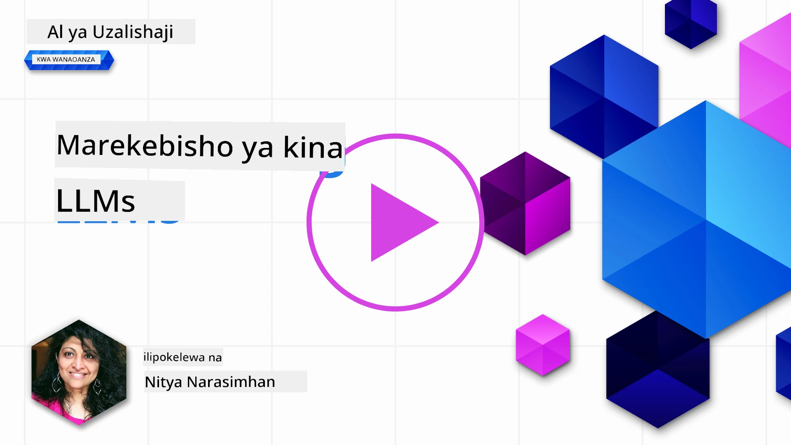
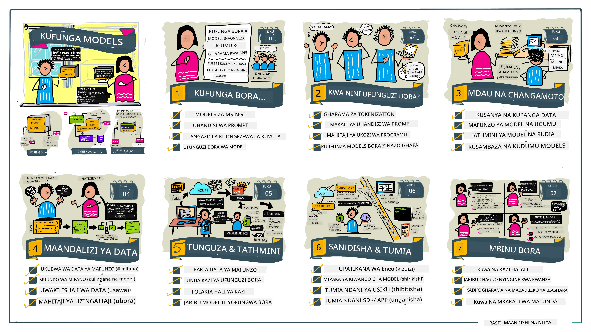

# Kurekebisha LLM Yako kwa Ufasaha

Kutumia mifano mikubwa ya lugha kujenga programu za AI zinazozalisha habari zinazokuja na changamoto mpya. Tatizo kuu ni kuhakikisha ubora wa majibu (usahihi na umuhimu) katika yaliyotolewa na mfano kwa ombi la mtumiaji. Katika masomo ya awali, tulijadili mbinu kama uhandisi wa maandishi ya agizo na uzalishaji ulioboreshwa kwa kurejea data unaojaribu kutatua tatizo kwa _kubadilisha ingizo la maandishi_ kwa mfano uliopo.

Katika somo la leo, tunajadili mbinu ya tatu, **kurekebisha kwa ufasaha**, ambayo inajaribu kushughulikia changamoto kwa _kurudia kufundisha mfano mwenyewe_ kwa data ya ziada. Hebu tuangalie undani.

## Malengo ya Kujifunza

Somo hili linaanzisha dhana ya kurekebisha kwa ufasaha mifano ya lugha iliyofunzwa awali, linachunguza faida na changamoto za mbinu hii, na linatoa mwongozo wa lini na jinsi ya kutumia kurekebisha kwa ufasaha kuboresha utendaji wa mifano yako ya AI inayozalisha.

Mwisho wa somo hili, unapaswa kuwa na uwezo wa kujibu maswali yafuatayo:

- Kurekebisha kwa ufasaha ni nini kwa mifano ya lugha?
- Lini, na kwa nini, kurekebisha kwa ufasaha ni muhimu?
- Ninawezaje kurekebisha kwa ufasaha mfano uliofunzwa awali?
- Ni vizingiti gani vya kurekebisha kwa ufasaha?

Tayari? Tuanze.

## Mwongozo Uliopigwa Mchoro

Unataka kupata picha kubwa ya kile tutakachozungumzia kabla ya kuingia ndani? Angalia mwongozo huu uliopigwa mchoro unaoelezea safari ya kujifunza kwa somo hili - kutoka kujifunza dhana za msingi na motisha ya kurekebisha kwa ufasaha, hadi kuelewa mchakato na mbinu bora za kutekeleza kazi ya kurekebisha. Ni mada ya kuvutia kuchunguza, kwa hiyo usisahau kutembelea ukurasa wa [Rasilimali](./RESOURCES.md?WT.mc_id=academic-105485-koreyst) kwa viungo vya ziada kusaidia safari yako ya kujifunza kwa njia ya kujitambua!

## Kurekebisha Kwa Ufasaha ni nini kwa mifano ya lugha?

Kwa ufafanuzi, mifano mikubwa ya lugha ni _iliyofunzwa awali_ kwa kiasi kikubwa cha maandishi yaliyokusanywa kutoka vyanzo tofauti vikiwemo mtandao. Kama tulivyojifunza katika masomo ya awali, tunahitaji mbinu kama _uhandisi wa maandishi ya agizo_ na _uzalishaji ulioboreshwa kwa kurejea data_ kuboresha ubora wa majibu ya mfano kwa maswali ya mtumiaji ("maandishi ya agizo").

Mbinu maarufu ya uhandisi wa maandishi ni kumpa mfano miongozo zaidi ya yanayotarajiwa katika jibu ama kwa kutoa _maelekezo_ (mwongozo wazi) au _kumpa mifano michache_ (mwongozo wa bila kusema wazi). Hii inajulikana kama _kujifunza kwa mifano michache_ lakini ina vizingiti viwili:

- Mipaka ya tokeni za mfano inaweza kupunguza idadi ya mifano unayoweza kutoa, na kupunguza ufanisi.
- Gharama za tokeni za mfano zinaweza kufanya gharama kuwa kubwa kuongezea mifano kwa kila agizo, na kupunguza kubadilika.

Kurekebisha kwa ufasaha ni desturi ya kawaida katika mifumo ya mashine ya kujifunza ambapo tunachukua mfano uliyo tayari kufunzwa na kurudia kufundisha kwa data mpya ili kuboresha utendaji wake kwa kazi maalum. Katika muktadha wa mifano ya lugha, tunaweza kurekebisha mfano uliyo tayari kufunzwa _kwa seti iliyochaguliwa ya mifano kwa kazi au eneo la matumizi_ ili kuunda **mfano maalum** ambao unaweza kuwa sahihi zaidi na muhimu kwa kazi au eneo hilo. Faida ya ziada ya kurekebisha ni kwamba pia inaweza kupunguza idadi ya mifano inayohitajika kwa kujifunza kwa mifano michache - kupunguza matumizi ya tokeni na gharama zinazohusiana.

## Lini na kwa nini tunapaswa kurekebisha mifano?

Katika _muktadha huu_, tunapozungumzia kurekebisha kwa ufasaha, tunamaanisha **kurekebisha kwa usimamizi** ambapo kurudia kufundisha hufanywa kwa **kuongezea data mpya** ambayo haikuwepo katika zaidi ya seti ya mafunzo ya awali. Hii ni tofauti na mbinu isiyo na usimamizi ambapo mfano hurudi kufundishwa kwa data ya awali, lakini kwa vigezo tofauti.

Jambo kuu la kukumbuka ni kwamba kurekebisha kwa ufasaha ni mbinu ya juu ambayo inahitaji kiwango fulani cha utaalamu kupata matokeo yanayotakiwa. Ikiwa hufanywa kwa usahihi, inaweza ikakosa kuleta maboresho, na hata kupunguza utendaji wa mfano kwa eneo lako linalolengwa.

Kwa hiyo, kabla ya kujifunza "jinsi" ya kurekebisha kwa ufasaha mifano ya lugha, unahitaji kujua "kwa nini" unapaswa kuchukua njia hii, na "lini" kuanza mchakato wa kurekebisha kwa ufasaha. Anza kuuliza maswali haya mwenyewe:

- **Matumizi**: Ni _matumizi gani_ ya kurekebisha kwa ufasaha? Ni kipengele gani cha mfano uliyo tayari kufunzwa unataka kuboresha?
- **Mbali Mbali**: Je, umewajaribu _mbinu nyingine_ kufikia matokeo unayotaka? Zitumiie kuunda msingi wa kulinganisha.
  - Uhandisi wa maandishi ya agizo: Jaribu mbinu kama kuanzisha maandishi ya agizo kwa mifano ya majibu yanayofaa. Tathmini ubora wa majibu.
  - Uzalishaji ulioboreshwa kwa kurejea data: Jaribu kuongeza maandishi ya agizo kwa matokeo ya maswali yaliyopatikana kwa kutafuta data yako. Tathmini ubora wa majibu.
- **Gharama**: Je, umebaini gharama za kurekebisha kwa ufasaha?
  - Uwezekano wa kurekebisha - je, mfano uliyo tayari kufunzwa upo kwa ajili ya kurekebisha?
  - Juhudi - kwa kuandaa data za mafunzo, kutathmini & kuboresha mfano.
  - Kompyuta - kwa kuendesha kazi za kurekebisha, na kupeleka mfano uliorekebishwa
  - Data - upatikanaji wa mifano yenye ubora wa kutosha kwa athari za kurekebisha
- **Faida**: Je, umethibitisha faida za kurekebisha kwa ufasaha?
  - Ubora - je, mfano uliorekebishwa ulizidi msingi wa kulinganisha?
  - Gharama - je, inapunguza matumizi ya tokeni kwa kurahisisha maandishi ya agizo?
  - Uwezo wa kuongeza - je, unaweza kurekebisha mfano msingi kwa maeneo mapya?

Kwa kujibu maswali haya, unapaswa kuwa na uwezo wa kuamua kama kurekebisha kwa ufasaha ndio mbinu sahihi kwa matumizi yako. Kiukweli, njia hii ni halali ikiwa tu faida zinazidi gharama. Mara unapoamua kuendelea, ni wakati wa kufikiria _jinsi_ unavyoweza kurekebisha mfano uliofunzwa awali.

Unataka kupata maarifa zaidi kuhusu mchakato wa kufanya maamuzi? Tazama [Kurekebisha au kuto kurekebisha](https://www.youtube.com/watch?v=0Jo-z-MFxJs)

## Tunawezaje kurekebisha mfano uliyo tayari kufunzwa?

Kwa kurekebisha mfano uliyo tayari kufunzwa, unahitaji kuwa na:

- mfano uliyo tayari kufunzwa kurekebisha
- seti ya data ya kutumia kwa kurekebisha
- mazingira ya mafunzo kuendesha kazi ya kurekebisha
- mazingira ya kupeleka mfano uliorekebishwa

## Kurekebisha Kwa Ufasaha Katika Vitendo

Rasilimali zifuatazo zina mafunzo kwa hatua kwa hatua kukuelekeza katika mfano halisi kutumia mfano ulioteuliwa na seti ya data iliyochaguliwa. Ili kufanya mafunzo haya, unahitaji akaunti kwa muwasilishaji husika, pamoja na upatikanaji wa mfano na seti za data husika.

| Muwasilishaji | Mafunzo                                                                                                                                                                       | Maelezo                                                                                                                                                                                                                                                                                                                                                                                                                         |
| ------------ | --------------------------------------------------------------------------------------------------------------------------------------------------------------------------- | -------------------------------------------------------------------------------------------------------------------------------------------------------------------------------------------------------------------------------------------------------------------------------------------------------------------------------------------------------------------------------------------------------------------------------- |
| OpenAI       | [Jinsi ya kurekebisha mifano ya mazungumzo](https://github.com/openai/openai-cookbook/blob/main/examples/How_to_finetune_chat_models.ipynb?WT.mc_id=academic-105485-koreyst) | Jifunze kurekebisha `gpt-35-turbo` kwa eneo maalum ("msaidizi wa mapishi") kwa kuandaa data za mafunzo, kuendesha kazi ya kurekebisha, na kutumia mfano uliorekebishwa kwa kutabiri.                                                                                                                                                                                                                                               |
| Azure OpenAI | [Mafunzo ya kurekebisha GPT 3.5 Turbo](https://learn.microsoft.com/azure/ai-services/openai/tutorials/fine-tune?tabs=python-new%2Ccommand-line?WT.mc_id=academic-105485-koreyst) | Jifunze kurekebisha mfano `gpt-35-turbo-0613` **kwa Azure** kwa kuchukua hatua za kuunda na kupakia data za mafunzo, kuendesha kazi ya kurekebisha. Peleka na tumia mfano mpya.                                                                                                                                                                                                                                                 |
| Hugging Face | [Kurekebisha LLMs na Hugging Face](https://www.philschmid.de/fine-tune-llms-in-2024-with-trl?WT.mc_id=academic-105485-koreyst)                                              | Chapisho hili la blogu linakuongoza kurekebisha _mfano huru wa LLM_ (mfano: `CodeLlama 7B`) kwa kutumia maktaba ya [transformers](https://huggingface.co/docs/transformers/index?WT.mc_id=academic-105485-koreyst) na [Transformer Reinforcement Learning (TRL)](https://huggingface.co/docs/trl/index?WT.mc_id=academic-105485-koreyst) pamoja na [seti za data zilizopo](https://huggingface.co/docs/datasets/index?WT.mc_id=academic-105485-koreyst) kwenye Hugging Face. |
|              |                                                                                                                                                                             |                                                                                                                                                                                                                                                                                                                                                                                                                                 |
| 🤗 AutoTrain | [Kurekebisha LLMs na AutoTrain](https://github.com/huggingface/autotrain-advanced/?WT.mc_id=academic-105485-koreyst)                                                        | AutoTrain (au AutoTrain Advanced) ni maktaba ya python iliyotengenezwa na Hugging Face inayoruhusu kurekebisha kwa ufasaha kwa kazi mbalimbali ikijumuisha kurekebisha LLM. AutoTrain ni suluhisho la kutokuhitaji kuandika msimbo na kurekebisha kunaweza kufanywa kwenye wingu lako mwenyewe, Hugging Face Spaces au mahali hapa. Inasaidia GUI ya wavuti, CLI na mafunzo kupitia faili za usanidi wa yaml.                                                     |
|              |                                                                                                                                                                             |                                                                                                                                                                                                                                                                                                                                                                                                                                 |
| 🦥 Unsloth | [Kurekebisha LLMs na Unsloth](https://github.com/unslothai/unsloth)                                                               | Unsloth ni mfumo huria unaounga mkono kurekebisha LLM na kujifunza kwa kuimarisha (RL). Unsloth hufanya mafunzo ya karibu, tathmini, na kuweka huduma kuwa rahisi kwa kutumia [daftari za maelekezo](https://github.com/unslothai/notebooks) tayari kwa matumizi. Pia inasaidia sauti kwa maandishi (TTS), BERT na mifano ya mchanganyiko wa aina. Ili kuanza, soma [Mwongozo wa Kurekebisha LLMs](https://docs.unsloth.ai/get-started/fine-tuning-llms-guide).               |
|              |                                                                                                                                                                             |                                                                                                                                                                                                                                                                                                                                                                                                                                 |
## Kazi ya Nyumbani

Chagua moja kati ya mafunzo yaliyotajwa hapo juu na uyafanye. _Tunaweza kurudia toleo la mafunzo haya katika Jupyter Notebooks katika hifadhidata hii kwa marejeleo tu. Tafadhali tumia vyanzo vya asili moja kwa moja kupata matoleo ya hivi punde_.

## Kazi Nzuri! Endelea Kujifunza.

Baada ya kukamilisha somo hili, tembelea [Mkusanyiko wetu wa Kujifunza AI Inayozalisha](https://aka.ms/genai-collection?WT.mc_id=academic-105485-koreyst) kuendelea kupanua maarifa yako kuhusu AI Inayozalisha!

Hongera!! Umehitimisha somo la mwisho kutoka mfululizo wa v2 wa kozi hii! Usikome kujifunza na kujenga. \*\*Tembelea ukurasa wa [RASILIMALI](RESOURCES.md?WT.mc_id=academic-105485-koreyst) kwa orodha ya mapendekezo ya ziada kuhusu mada hii tu.

Mfululizo wetu wa masomo wa v1 pia umeboreshwa kwa kazi zaidi na dhana zaidi. Hivyo chukua dakika kidogo kupasha upya maarifa yako - na tafadhali [shirikisha maswali na mrejesho wako](https://github.com/microsoft/generative-ai-for-beginners/issues?WT.mc_id=academic-105485-koreyst) kusaidia kuboresha masomo haya kwa jamii.

---

<!-- CO-OP TRANSLATOR DISCLAIMER START -->
**Makundi ya Msamaha**:
Hati hii imetafsiriwa kwa kutumia huduma ya tafsiri ya AI [Co-op Translator](https://github.com/Azure/co-op-translator). Ingawa tunajitahidi kwa usahihi, tafadhali fahamu kwamba tafsiri za kiotomatiki zinaweza kuwa na makosa au upungufu wa usahihi. Hati asili katika lugha yake ya asili inapaswa kuchukuliwa kama chanzo kamili. Kwa taarifa muhimu, tafsiri ya mtaalamu wa kibinadamu inapendekezwa. Hatubeba dhamana kwa kutoelewana au tafsiri potovu zinazotokana na matumizi ya tafsiri hii.
<!-- CO-OP TRANSLATOR DISCLAIMER END -->