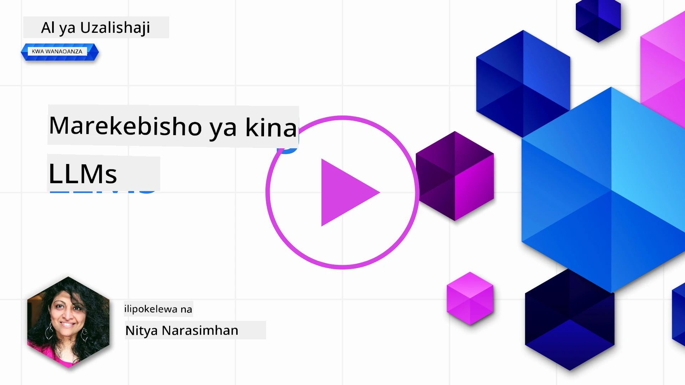
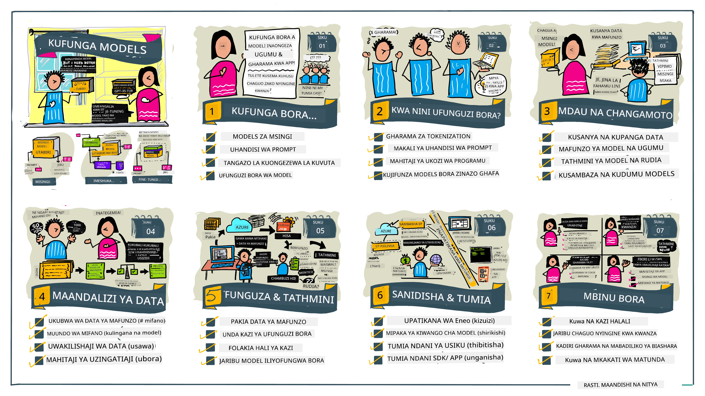

# Kurekebisha LLM Yako kwa Usahihi

Kutumia mifano mikubwa ya lugha kujenga programu za AI zinazotengeneza yanakuja na changamoto mpya. Tatizo kuu ni kuhakikisha ubora wa majibu (usahihi na umuhimu) katika maudhui yanayotengenezwa na mfano kwa ombi fulani la mtumiaji. Katika masomo ya awali, tulijadili mbinu kama uhandisi wa maonyesho na kizazi kilichoongezwa na upokezi kinachojaribu kutatua tatizo kwa _kubadilisha ingizo la maonyesho_ kwa mfano uliopo.

Katika somo la leo, tunajadili mbinu ya tatu, **kurekebisha kwa usahihi**, ambayo inajaribu kushughulikia changamoto kwa _kufunza mfano mwenyewe tena_ kwa data ya ziada. Hebu tuangalie maelezo.

## Malengo ya Kujifunza

Somo hili linaanzisha dhana ya kurekebisha kwa usahihi kwa mifano ya lugha iliyofunzwa awali, linachunguza faida na changamoto za mbinu hii, na linatoa mwongozo juu ya lini na jinsi ya kutumia kurekebisha kwa usahihi ili kuboresha utendaji wa mifano yako ya AI inayotengeneza.

Mwisho wa somo hili, unapaswa kuwa na uwezo wa kujibu maswali yafuatayo:

- Kurekebisha kwa usahihi kwa mifano ya lugha ni nini?
- Lini, na kwa nini, kurekebisha kwa usahihi ni muhimu?
- Ninawezaje kurekebisha kwa usahihi mfano uliokuwa umefunzwa awali?
- Ni vikwazo gani vya kurekebisha kwa usahihi?

Tayari? Tuanzie.

## Mwongozo Uliobuniwa

Unataka kupata picha kubwa ya tutakachoshughulikia kabla hatujaingia mambo kwa undani? Angalia mwongozo huu uliobuniwa unaoelezea safari ya kujifunza kwa somo hili - kuanzia kujifunza dhana kuu na sababu za kurekebisha kwa usahihi, hadi kuelewa mchakato na mbinu bora za kutekeleza jukumu la kurekebisha kwa usahihi. Hii ni mada ya kuvutia kwa uchunguzi, kwa hivyo usisahau kutembelea ukurasa wa [Rasilimali](./RESOURCES.md?WT.mc_id=academic-105485-koreyst) kwa viungo zaidi vya kusaidia safari yako ya kujifunza kwa kujitegemea!

## Kurekebisha kwa usahihi kwa mifano ya lugha ni nini?

Kwa maana, mifano mikubwa ya lugha ni _iliyofunzwa awali_ kwa kiasi kikubwa cha maandishi yaliyotokana na vyanzo mbalimbali ikiwa ni pamoja na mtandao. Kama tulivyojifunza katika masomo ya awali, tunahitaji mbinu kama _uhandisi wa maonyesho_ na _kizazi kilichoongezwa na upokezi_ kuboresha ubora wa majibu ya mfano kwa maswali ya mtumiaji ("maonyesho").

Mbinu maarufu ya uhandisi wa maonyesho ni kutoa mwongozo zaidi kwa mfano juu ya kinachotarajiwa katika jibu kwa kutoa _maelekezo_ (mwongozo wazi) au _kutoa mifano michache_ (mwongozo usio wazi). Hii huitwa _kujifunza kwa mifano michache_ lakini ina vikwazo viwili:

- Vizingiti vya tokeni za mfano vinaweza kupunguza idadi ya mifano unayoweza kutoa, na kupunguza ufanisi.
- Gharama za tokeni za mfano zinaweza kufanya kuwa ghali kuongeza mifano kwa kila maonyesho, na kupunguza kubadilika.

Kurekebisha kwa usahihi ni mazoezi ya kawaida katika mifumo ya ujifunzaji wa mashine ambapo tunachukua mfano uliokuwa umefunzwa awali na kuufunza tena kwa data mpya ili kuboresha utendaji wake kwenye kazi fulani. Katika muktadha wa mifano ya lugha, tunaweza kurekebisha kwa usahihi mfano uliokuwa umefunzwa awali _kwa seti iliyochaguliwa ya mifano kwa ajili ya kazi fulani au eneo la matumizi_ ili kuunda **mfano maalum** ambao unaweza kuwa sahihi zaidi na unaohusiana zaidi na kazi au eneo hilo. Faida ya pembeni ya kurekebisha kwa usahihi ni kwamba pia inaweza kupunguza idadi ya mifano inayohitajika kwa kujifunza kwa mifano michache - kupunguza matumizi ya tokeni na gharama zinazohusiana.

## Lini na kwa nini tunapaswa kurekebisha kwa usahihi mifano?

Katika _muktadha huu_, tunapozungumzia kurekebisha kwa usahihi, tunarejelea **urekebisho ulioongozwa** ambapo ufundishaji upya hufanyika kwa **kuongeza data mpya** ambayo haikuwa sehemu ya seti ya mafunzo ya awali. Hii ni tofauti na mbinu ya urejeshaji usioongozwa ambapo mfano hufunzwa tena kwa data ya asili, lakini kwa vigezo tofauti.

Jambo muhimu kukumbuka ni kwamba kurekebisha kwa usahihi ni mbinu ya hali ya juu inayohitaji kiwango fulani cha utaalam ili kupata matokeo yanayotarajiwa. Ikiwa haifanyiki kwa usahihi, inaweza kuleta maboresho yasiyotarajiwa, na hata kupunguza utendaji wa mfano kwa eneo unalolenga.

Kwa hivyo, kabla hujajifunza "jinsi" ya kurekebisha kwa usahihi mifano ya lugha, unahitaji kujua "kwa nini" unapaswa kuchukua njia hii, na "lini" kuanzisha mchakato wa kurekebisha kwa usahihi. Anza kwa kujijiuliza maswali haya:

- **Kesi ya Matumizi**: Kesi yako ya _matumizi_ ya kurekebisha kwa usahihi ni gani? Ni kipengele gani cha mfano uliokuwa umefunzwa awali unayetaka kuboresha?
- **Mbadala**: Je, umejaribu _mbinu nyingine_ kufanikisha matokeo unayotaka? Tumia hizo ili kuunda msingi wa kulinganisha.
  - Uhandisi wa maonyesho: Jaribu mbinu kama kutoa maonyesho yenye mifano ya majibu husika. Tathmini ubora wa majibu.
  - Kizazi kilichoongezwa na upokezi: Jaribu kuongeza maonyesho kwa matokeo ya utafutaji unaotokana na data zako. Tathmini ubora wa majibu.
- **Gharama**: Je, umebaini gharama za kurekebisha kwa usahihi?
  - Uwezo wa kurekebisha - je, mfano uliokuwa umefunzwa awali upo kwa kurekebisha?
  - Juhudi - kwa kuandaa data za mafunzo, kutathmini na kuboresha mfano.
  - Kompyuta - kwa kuendesha kazi za kurekebisha, na kuweka mfano uliorekebishwa mtandaoni
  - Data - upatikanaji wa mifano ya ubora wa kutosha kwa athari za kurekebisha
- **Faida**: Je, umethibitisha faida za kurekebisha kwa usahihi?
  - Ubora - je, mfano uliorekebishwa ulizidi msingi?
  - Gharama - je, inapunguza matumizi ya tokeni kwa kurahisisha maonyesho?
  - Upanuzi - je, unaweza kutumia mfano wa msingi kwa maeneo mapya?

Kwa kujibu maswali haya, unapaswa kuwa na uwezo wa kuamua kama kurekebisha kwa usahihi ni njia sahihi kwa kesi yako ya matumizi. Kwa kawaida, njia hii inathibitishwa tu ikiwa faida zinasababisha gharama. Mara ukaamua kuendelea, ni wakati wa kufikiria _jinsi_ unavyoweza kurekebisha kwa usahihi mfano uliokuwa umefunzwa awali.

Unataka kupata maarifa zaidi juu ya mchakato wa kufanya maamuzi? Tazama [Kurekebisha kwa usahihi au kutokurekebisha kwa usahihi](https://www.youtube.com/watch?v=0Jo-z-MFxJs)

## Tunawezaje kurekebisha kwa usahihi mfano uliokuwa umefunzwa awali?

Ili kurekebisha kwa usahihi mfano uliokuwa umefunzwa awali, unahitaji kuwa na:

- mfano uliokuwa umefunzwa awali wa kurekebisha
- seti ya data ya kutumia kwa kurekebisha
- mazingira ya mafunzo kuendesha kazi ya kurekebisha
- mazingira ya usambazaji kuweka mfano uliorekebishwa mtandaoni

## Kurekebisha kwa Usahihi Katika Vitendo

Rasilimali zifuatazo zinatoa mafunzo hatua kwa hatua kukuwezesha kwa mfano halisi ukiwa umechagua mfano na seti ya data iliyochaguliwa. Ili kufanya mafunzo haya, unahitaji akaunti kwenye mtoa huduma husika, pamoja na upatikanaji wa mfano na seti za data husika.

| Mtoa Huduma | Mafunzo                                                                                                                                                                       | Maelezo                                                                                                                                                                                                                                                                                                                                                                                                                        |
| ------------ | ------------------------------------------------------------------------------------------------------------------------------------------------------------------------------ | ---------------------------------------------------------------------------------------------------------------------------------------------------------------------------------------------------------------------------------------------------------------------------------------------------------------------------------------------------------------------------------------------------------------------------------- |
| OpenAI       | [Jinsi ya kurekebisha kwa usahihi mifano ya mazungumzo](https://github.com/openai/openai-cookbook/blob/main/examples/How_to_finetune_chat_models.ipynb?WT.mc_id=academic-105485-koreyst)                | Jifunze kurekebisha kwa usahihi `gpt-35-turbo` kwa eneo fulani ("msaidizi wa mapishi") kwa kuandaa data za mafunzo, kuendesha kazi ya kurekebisha, na kutumia mfano uliorekebishwa kwa utambuzi.                                                                                                                                                                                                                                              |
| Azure OpenAI | [Mafunzo ya kurekebisha kwa usahihi GPT 3.5 Turbo](https://learn.microsoft.com/azure/ai-services/openai/tutorials/fine-tune?tabs=python-new%2Ccommand-line&WT.mc_id=academic-105485-koreyst) | Jifunze kurekebisha kwa usahihi mfano `gpt-35-turbo-0613` **mtandaoni Azure** kwa kuchukua hatua za kuunda & kupakia data za mafunzo, kuendesha kazi ya kurekebisha. Sambaza & tumia mfano mpya.                                                                                                                                                                                                                                                                 |
| Hugging Face | [Kurekebisha kwa usahihi LLMs na Hugging Face](https://www.philschmid.de/fine-tune-llms-in-2024-with-trl?WT.mc_id=academic-105485-koreyst)                                               | Chapisho hili la blogu linakuongoza kurekebisha _LLM wazi_ (mfano: `CodeLlama 7B`) kwa kutumia maktaba ya [transformers](https://huggingface.co/docs/transformers/index?WT.mc_id=academic-105485-koreyst) na [Transformer Reinforcement Learning (TRL)](https://huggingface.co/docs/trl/index?WT.mc_id=academic-105485-koreyst) kwa seti za data wazi [datasets](https://huggingface.co/docs/datasets/index?WT.mc_id=academic-105485-koreyst) kwenye Hugging Face. |
|              |                                                                                                                                                                                |                                                                                                                                                                                                                                                                                                                                                                                                                                    |
| 🤗 AutoTrain | [Kurekebisha kwa usahihi LLMs na AutoTrain](https://github.com/huggingface/autotrain-advanced/?WT.mc_id=academic-105485-koreyst)                                                         | AutoTrain (au AutoTrain Advanced) ni maktaba ya python iliyotengenezwa na Hugging Face inayoruhusu kurekebisha kazi nyingi tofauti ikijumuisha kurekebisha LLM. AutoTrain ni suluhisho lisilo na msimbo na kurekebisha kunaweza kufanywa kwenye wingu lako mwenyewe, kwenye Hugging Face Spaces au kwa njia ya mtaa. Inaunga mkono GUI ya wavuti, CLI na mafunzo kupitia faili za usanidi za yaml.                                                                               |
|              |                                                                                                                                                                                |                                                                                                                                                                                                                                                                                                                                                                                                                                    |
| 🦥 Unsloth | [Kurekebisha kwa usahihi LLMs na Unsloth](https://github.com/unslothai/unsloth)                                                         | Unsloth ni mfumo wa chanzo wazi unaounga mkono kurekebisha LLM na kujifunza kwa kuimarisha (RL). Unsloth hurahisisha mafunzo ya ndani, tathmini, na usambazaji kwa kutumia [notebooks](https://github.com/unslothai/notebooks) tayari kwa matumizi. Pia unaunga mkono maandishi-kwa-sauti (TTS), BERT na mifano ya multimodal. Ili kuanza, soma mwongozo wao wa hatua kwa hatua [Mwongozo wa Kurekebisha LLMs](https://docs.unsloth.ai/get-started/fine-tuning-llms-guide).                                                                          |
|              |                                                                                                                                                                                |                                                                                                                                                                                                                                                                                                                                                                                                                                    |
## Kazi za Nyumbani

Chagua moja ya mafunzo yaliyo juu na ufuate hatua. _Tunaweza kurudisha toleo la mafunzo haya katika Jupyter Notebooks katika hifadhi hii kwa marejeleo tu. Tafadhali tumia vyanzo vya asili kwa moja kwa moja kupata matoleo ya karibuni_.

## Kazi Nzuri! Endelea Kujifunza.

Baada ya kumaliza somo hili, tembelea mkusanyiko wetu wa [Kujifunza AI Inayotengeneza](https://aka.ms/genai-collection?WT.mc_id=academic-105485-koreyst) kuendelea kuinua maarifa yako ya AI Inayotengeneza!

Hongera!! Umehitimisha somo la mwisho kutoka mfululizo wa v2 wa kozi hii! Usikome kujifunza na kujenga. \*\*Tembelea ukurasa wa [RASILIMALI](RESOURCES.md?WT.mc_id=academic-105485-koreyst) kwa orodha ya mapendekezo ya ziada kwa mada hii pekee.

Mfululizo wetu wa masomo wa v1 pia umeboreshwa kwa kazi zaidi na dhana. Kwa hivyo chukua dakika chache kusasisha maarifa yako - na tafadhali [shiriki maswali na maoni yako](https://github.com/microsoft/generative-ai-for-beginners/issues?WT.mc_id=academic-105485-koreyst) kusaidia kuboresha masomo haya kwa jamii.

---

<!-- CO-OP TRANSLATOR DISCLAIMER START -->
**Kiarifu cha Msamaha**:
Hati hii imetafsiriwa kwa kutumia huduma ya tafsiri ya AI [Co-op Translator](https://github.com/Azure/co-op-translator). Ingawa tunajitahidi kufikia usahihi, tafadhali fahamu kuwa tafsiri za kiotomatiki zinaweza kuwa na makosa au kasoro. Hati asili katika lugha yake ya asili inapaswa kuzingatiwa kama chanzo cha mamlaka. Kwa taarifa muhimu, tafsiri ya kitaalamu ya mwanadamu inashauriwa. Hatuba ya serikali kwa maelezo yoyote yasiyoeleweka au tafsiri potofu zinazotokana na matumizi ya tafsiri hii.
<!-- CO-OP TRANSLATOR DISCLAIMER END -->