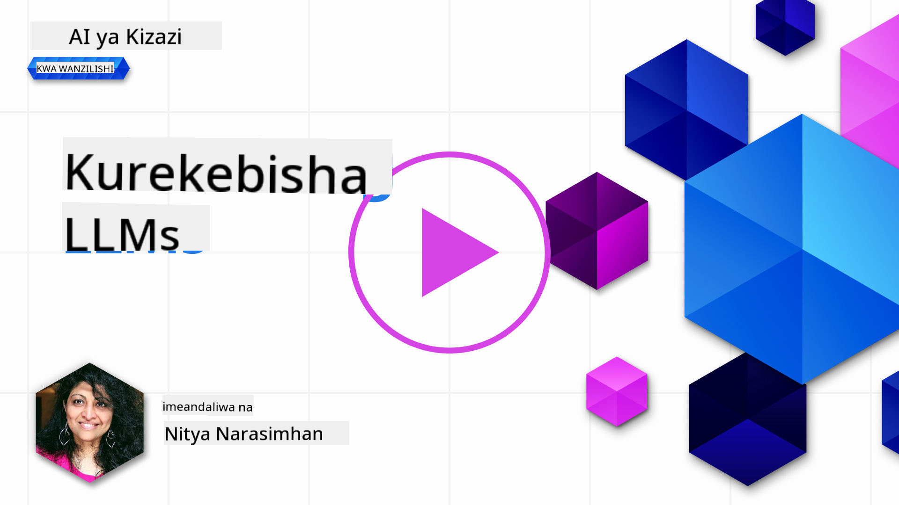
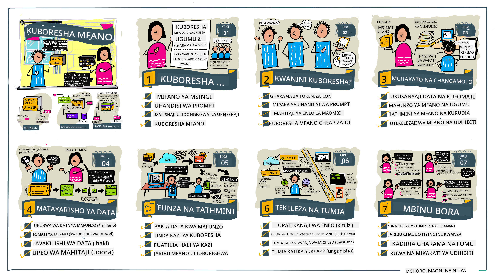

<!--
CO_OP_TRANSLATOR_METADATA:
{
  "original_hash": "68664f7e754a892ae1d8d5e2b7bd2081",
  "translation_date": "2025-06-26T00:49:03+00:00",
  "source_file": "18-fine-tuning/README.md",
  "language_code": "sw"
}
-->

# Kuboresha LLM Yako

Kutumia mifano mikubwa ya lugha kujenga programu za AI zinazozalisha maudhui kunaleta changamoto mpya. Tatizo kuu ni kuhakikisha ubora wa majibu (usahihi na umuhimu) katika maudhui yanayozalishwa na mfano kwa ombi la mtumiaji. Katika masomo ya awali, tulijadili mbinu kama uhandisi wa maelezo na kizazi kilichoongezewa utafutaji ambacho hujaribu kutatua tatizo kwa _kubadilisha maelezo ya pembejeo_ kwa mfano uliopo.

Katika somo la leo, tunajadili mbinu ya tatu, **kuboresha**, ambayo hujaribu kushughulikia changamoto kwa _kufundisha upya mfano yenyewe_ kwa data ya ziada. Hebu tuingie katika maelezo.

## Malengo ya Kujifunza

Somo hili linaanzisha dhana ya kuboresha mifano ya lugha iliyofunzwa awali, linaangazia faida na changamoto za mbinu hii, na linatoa mwongozo juu ya wakati na jinsi ya kutumia kuboresha ili kuboresha utendaji wa mifano yako ya AI inayozalisha maudhui.

Mwisho wa somo hili, unapaswa kuwa na uwezo wa kujibu maswali yafuatayo:

- Kuboresha mifano ya lugha ni nini?
- Wakati gani, na kwa nini, kuboresha ni muhimu?
- Ninawezaje kuboresha mfano uliotayarishwa awali?
- Nini vikwazo vya kuboresha?

Tayari? Hebu tuanze.

## Mwongozo wa Picha

Unataka kupata taswira kubwa ya kile tutakachofunika kabla ya kuingia ndani? Angalia mwongozo huu wa picha unaoelezea safari ya kujifunza kwa somo hili - kutoka kujifunza dhana kuu na motisha ya kuboresha, hadi kuelewa mchakato na mbinu bora za kutekeleza kazi ya kuboresha. Hili ni somo la kuvutia kwa uchunguzi, hivyo usisahau kuangalia ukurasa wa [Rasilimali](./RESOURCES.md?WT.mc_id=academic-105485-koreyst) kwa viungo vya ziada kusaidia safari yako ya kujifunza kwa kujiongoza!

## Kuboresha mifano ya lugha ni nini?

Kwa ufafanuzi, mifano mikubwa ya lugha _imefunzwa awali_ kwenye kiasi kikubwa cha maandiko yanayotoka katika vyanzo mbalimbali ikiwemo mtandao. Kama tulivyojifunza katika masomo ya awali, tunahitaji mbinu kama _uhandisi wa maelezo_ na _kizazi kilichoongezewa utafutaji_ ili kuboresha ubora wa majibu ya mfano kwa maswali ya mtumiaji ("maelezo").

Mbinu maarufu ya uhandisi wa maelezo inahusisha kutoa mwongozo zaidi kwa mfano juu ya kile kinachotarajiwa katika majibu ama kwa kutoa _maelekezo_ (mwongozo wa wazi) au _kuupa mifano michache_ (mwongozo wa kimya). Hii inajulikana kama _ujifunzaji wa mifano michache_ lakini ina vikwazo viwili:

- Vikomo vya tokeni za mfano vinaweza kuzuia idadi ya mifano unayoweza kutoa, na kupunguza ufanisi.
- Gharama za tokeni za mfano zinaweza kufanya kuwa ghali kuongeza mifano kwa kila maelezo, na kupunguza kubadilika.

Kuboresha ni mazoezi ya kawaida katika mifumo ya kujifunza mashine ambapo tunachukua mfano uliotayarishwa awali na kuufundisha upya na data mpya ili kuboresha utendaji wake kwenye kazi maalum. Katika muktadha wa mifano ya lugha, tunaweza kuboresha mfano uliotayarishwa awali _kwa seti iliyokusanywa ya mifano kwa kazi au uwanja wa matumizi fulani_ ili kuunda **mfano maalum** ambao unaweza kuwa sahihi zaidi na muhimu kwa kazi au uwanja huo maalum. Faida ya ziada ya kuboresha ni kwamba inaweza pia kupunguza idadi ya mifano inayohitajika kwa ujifunzaji wa mifano michache - kupunguza matumizi ya tokeni na gharama zinazohusiana.

## Wakati gani na kwa nini tunapaswa kuboresha mifano?

Katika _muktadha huu_, tunapozungumza kuhusu kuboresha, tunarejelea kuboresha kwa **usimamizi** ambapo ufundishaji upya unafanywa kwa **kuongeza data mpya** ambayo haikuwa sehemu ya seti ya data ya awali ya mafunzo. Hii ni tofauti na mbinu ya kuboresha bila usimamizi ambapo mfano unafundishwa upya kwa data ya awali, lakini kwa vigezo tofauti vya hyper.

Jambo kuu la kukumbuka ni kwamba kuboresha ni mbinu ya juu ambayo inahitaji kiwango fulani cha utaalamu ili kupata matokeo yanayotakiwa. Ikiwa imefanywa vibaya, inaweza isitoe maboresho yanayotarajiwa, na inaweza hata kupunguza utendaji wa mfano kwa uwanja wako uliolengwa.

Kwa hivyo, kabla ya kujifunza "jinsi" ya kuboresha mifano ya lugha, unahitaji kujua "kwa nini" unapaswa kuchukua njia hii, na "wakati" wa kuanza mchakato wa kuboresha. Anza kwa kujiuliza maswali haya:

- **Kesi ya Matumizi**: Kesi yako ya _matumizi_ ya kuboresha ni ipi? Ni kipengele gani cha mfano wa awali unataka kuboresha?
- **Njia Mbadala**: Je, umejaribu _mbinu nyingine_ kufikia matokeo yanayotakiwa? Tumia hizi kuunda msingi wa kulinganisha.
  - Uhandisi wa maelezo: Jaribu mbinu kama maelezo ya mifano michache na mifano ya majibu ya maelezo muhimu. Tathmini ubora wa majibu.
  - Kizazi Kilichoongezewa Utafutaji: Jaribu kuongeza maelezo kwa matokeo ya maswali yaliyopatikana kwa kutafuta data yako. Tathmini ubora wa majibu.
- **Gharama**: Je, umebaini gharama za kuboresha?
  - Uwezo wa kubadilika - je, mfano uliotayarishwa awali unapatikana kwa kuboresha?
  - Juhudi - kwa kuandaa data ya mafunzo, kutathmini na kuboresha mfano.
  - Hesabu - kwa kuendesha kazi za kuboresha, na kupeleka mfano ulioboreshwa
  - Data - upatikanaji wa mifano ya ubora wa kutosha kwa athari ya kuboresha
- **Faida**: Je, umethibitisha faida za kuboresha?
  - Ubora - je, mfano ulioboreshwa ulipita msingi wa kulinganisha?
  - Gharama - je, inapunguza matumizi ya tokeni kwa kurahisisha maelezo?
  - Uwezo wa kuongezeka - unaweza kubadilisha mfano wa msingi kwa nyanja mpya?

Kwa kujibu maswali haya, unapaswa kuwa na uwezo wa kuamua ikiwa kuboresha ni njia sahihi kwa kesi yako ya matumizi. Kwa kawaida, njia hii ni halali tu ikiwa faida zinazidi gharama. Mara unapoamua kuendelea, ni wakati wa kufikiria _jinsi_ unaweza kuboresha mfano uliotayarishwa awali.

Unataka kupata maarifa zaidi juu ya mchakato wa kufanya maamuzi? Tazama [Kuboresha au kutokuboresha](https://www.youtube.com/watch?v=0Jo-z-MFxJs)

## Tunawezaje kuboresha mfano uliotayarishwa awali?

Ili kuboresha mfano uliotayarishwa awali, unahitaji kuwa na:

- mfano uliotayarishwa awali wa kuboresha
- seti ya data ya kutumia kwa kuboresha
- mazingira ya mafunzo ya kuendesha kazi ya kuboresha
- mazingira ya mwenyeji ya kupeleka mfano ulioboreshwa

## Kuboresha Katika Vitendo

Rasilimali zifuatazo zinatoa mafunzo ya hatua kwa hatua ya kukuongoza kupitia mfano halisi kwa kutumia mfano uliochaguliwa na seti ya data iliyokusanywa. Ili kufanya kazi kupitia mafunzo haya, unahitaji akaunti kwenye mtoa huduma maalum, pamoja na upatikanaji wa mfano na seti za data husika.

| Mtoa huduma  | Mafunzo                                                                                                                                                                       | Maelezo                                                                                                                                                                                                                                                                                                                                                                                                                        |
| ------------ | ------------------------------------------------------------------------------------------------------------------------------------------------------------------------------ | ---------------------------------------------------------------------------------------------------------------------------------------------------------------------------------------------------------------------------------------------------------------------------------------------------------------------------------------------------------------------------------------------------------------------------------- |
| OpenAI       | [Jinsi ya kuboresha mifano ya mazungumzo](https://github.com/openai/openai-cookbook/blob/main/examples/How_to_finetune_chat_models.ipynb?WT.mc_id=academic-105485-koreyst)     | Jifunze kuboresha `gpt-35-turbo` kwa uwanja maalum ("msaidizi wa mapishi") kwa kuandaa data ya mafunzo, kuendesha kazi ya kuboresha, na kutumia mfano ulioboreshwa kwa uchambuzi.                                                                                                                                                                                                                                              |
| Azure OpenAI | [Mafunzo ya kuboresha GPT 3.5 Turbo](https://learn.microsoft.com/azure/ai-services/openai/tutorials/fine-tune?tabs=python-new%2Ccommand-line?WT.mc_id=academic-105485-koreyst) | Jifunze kuboresha mfano wa `gpt-35-turbo-0613` **kwenye Azure** kwa kuchukua hatua za kuunda na kupakia data ya mafunzo, kuendesha kazi ya kuboresha. Peleka na tumia mfano mpya.                                                                                                                                                                                                                                                                 |
| Hugging Face | [Kuboresha LLMs na Hugging Face](https://www.philschmid.de/fine-tune-llms-in-2024-with-trl?WT.mc_id=academic-105485-koreyst)                                                  | Chapisho hili la blogi linakupitisha kuboresha _open LLM_ (mfano: `CodeLlama 7B`) kwa kutumia maktaba ya [transformers](https://huggingface.co/docs/transformers/index?WT.mc_id=academic-105485-koreyst) na [Transformer Reinforcement Learning (TRL)](https://huggingface.co/docs/trl/index?WT.mc_id=academic-105485-koreyst]) na seti za data za wazi kwenye Hugging Face. |
|              |                                                                                                                                                                                |                                                                                                                                                                                                                                                                                                                                                                                                                                    |
| 🤗 AutoTrain | [Kuboresha LLMs na AutoTrain](https://github.com/huggingface/autotrain-advanced/?WT.mc_id=academic-105485-koreyst)                                                            | AutoTrain (au AutoTrain Advanced) ni maktaba ya python iliyotengenezwa na Hugging Face inayoruhusu kuboresha kwa kazi nyingi tofauti ikiwemo kuboresha LLM. AutoTrain ni suluhisho lisilo na msimbo na kuboresha kunaweza kufanywa katika wingu lako mwenyewe, kwenye Hugging Face Spaces au ndani. Inasaidia GUI ya mtandao, CLI na mafunzo kupitia faili za usanidi wa yaml.                                                                               |
|              |                                                                                                                                                                                |                                                                                                                                                                                                                                                                                                                                                                                                                                    |

## Kazi

Chagua mojawapo ya mafunzo hapo juu na pitia. _Tunaweza kurudia toleo la mafunzo haya katika Jupyter Notebooks katika repo hii kwa marejeleo tu. Tafadhali tumia vyanzo asili moja kwa moja kupata matoleo ya hivi karibuni_.

## Kazi Nzuri! Endelea Kujifunza.

Baada ya kukamilisha somo hili, angalia mkusanyiko wetu wa Kujifunza AI Inayozalisha maudhui [Generative AI Learning collection](https://aka.ms/genai-collection?WT.mc_id=academic-105485-koreyst) ili kuendelea kuongeza maarifa yako ya AI Inayozalisha maudhui!

Hongera!! Umemaliza somo la mwisho kutoka mfululizo wa v2 kwa kozi hii! Usikome kujifunza na kujenga. \*\*Angalia ukurasa wa [RASILIMALI](RESOURCES.md?WT.mc_id=academic-105485-koreyst) kwa orodha ya mapendekezo ya ziada kwa mada hii tu.

Mfululizo wetu wa masomo wa v1 pia umeboreshwa na kazi zaidi na dhana. Kwa hivyo chukua dakika kuimarisha maarifa yako - na tafadhali [shiriki maswali na maoni yako](https://github.com/microsoft/generative-ai-for-beginners/issues?WT.mc_id=academic-105485-koreyst) ili kutusaidia kuboresha masomo haya kwa jamii.

**Kanusho**:  
Hati hii imetafsiriwa kwa kutumia huduma ya kutafsiri ya AI [Co-op Translator](https://github.com/Azure/co-op-translator). Ingawa tunajitahidi kwa usahihi, tafadhali fahamu kuwa tafsiri za kiotomatiki zinaweza kuwa na makosa au kutokuwa sahihi. Hati ya asili katika lugha yake ya asili inapaswa kuzingatiwa kama chanzo cha mamlaka. Kwa taarifa muhimu, tafsiri ya kibinadamu ya kitaalamu inapendekezwa. Hatutawajibika kwa kutoelewana au tafsiri potofu zinazotokana na matumizi ya tafsiri hii.