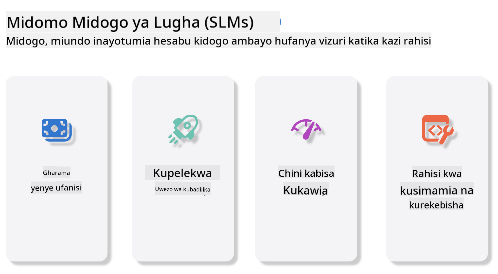
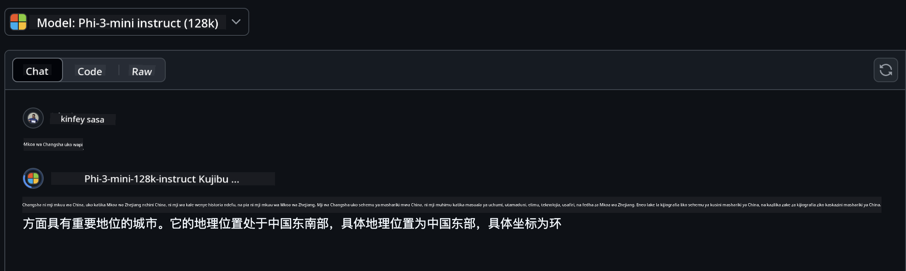
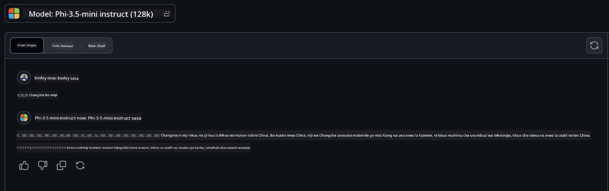

<!--
CO_OP_TRANSLATOR_METADATA:
{
  "original_hash": "124ad36cfe96f74038811b6e2bb93e9d",
  "translation_date": "2025-05-20T10:23:06+00:00",
  "source_file": "19-slm/README.md",
  "language_code": "sw"
}
-->
# Utangulizi wa Mifano Midogo ya Lugha kwa AI Inayozalisha kwa Kompyuta Kompyuta AI inayozalisha ni uwanja wa kuvutia wa akili bandia unaolenga kuunda mifumo inayoweza kuzalisha maudhui mapya. Maudhui haya yanaweza kuanzia maandishi na picha hadi muziki na hata mazingira yote ya virtual. Moja ya matumizi ya kusisimua ya AI inayozalisha ni katika uwanja wa mifano ya lugha. ## Mifano Midogo ya Lugha ni Nini? Mfano Mdogo wa Lugha (SLM) unawakilisha toleo lililopunguzwa la mfano mkubwa wa lugha (LLM), ukitumia kanuni nyingi za usanifu na mbinu za LLM, huku ukiwa na alama ndogo ya kompyuta. SLM ni sehemu ndogo ya mifano ya lugha iliyoundwa kuzalisha maandishi yanayofanana na ya kibinadamu. Tofauti na wenzao wakubwa, kama GPT-4, SLM ni ndogo na yenye ufanisi zaidi, na kuifanya iwe bora kwa matumizi ambapo rasilimali za kompyuta ni chache. Licha ya ukubwa wao mdogo, bado wanaweza kutekeleza kazi mbalimbali. Kwa kawaida, SLM hujengwa kwa kubana au kuchuja LLM, kwa lengo la kuhifadhi sehemu kubwa ya utendakazi wa mfano wa awali na uwezo wa lugha. Kupungua huku kwa ukubwa wa mfano hupunguza ugumu wa jumla, na kufanya SLM kuwa na ufanisi zaidi kwa matumizi ya kumbukumbu na mahitaji ya kompyuta. Licha ya maboresho haya, SLM bado zinaweza kutekeleza kazi mbalimbali za usindikaji wa lugha asilia (NLP): - Uzalishaji wa Maandishi: Kuunda sentensi au aya zinazofaa na zinazofaa kwa muktadha. - Kukamilisha Maandishi: Kutabiri na kukamilisha sentensi kulingana na chochezi lililopewa. - Tafsiri: Kubadilisha maandishi kutoka lugha moja hadi nyingine. - Muhtasari: Kufupisha vipande virefu vya maandishi kuwa muhtasari mfupi na rahisi kuelewa. Ingawa kuna baadhi ya upungufu katika utendaji au kina cha uelewa ikilinganishwa na wenzao wakubwa. ## Mifano Midogo ya Lugha Inafanyaje Kazi? SLM zinafundishwa kwa kiasi kikubwa cha data ya maandishi. Wakati wa mafunzo, zinajifunza mifumo na miundo ya lugha, na kuwawezesha kuzalisha maandishi ambayo ni sahihi kisarufi na yanafaa kwa muktadha. Mchakato wa mafunzo unahusisha: - Ukusanyaji wa Data: Kukusanya seti kubwa za data ya maandishi kutoka vyanzo mbalimbali. - Uchakataji Awali: Kusafisha na kupanga data ili kuifanya iweze kufaa kwa mafunzo. - Mafunzo: Kutumia algorithimu za kujifunza kwa mashine kufundisha mfano jinsi ya kuelewa na kuzalisha maandishi. - Kurekebisha: Kurekebisha mfano ili kuboresha utendaji wake kwenye kazi maalum. Maendeleo ya SLM yanaendana na hitaji linaloongezeka la mifano inayoweza kupelekwa katika mazingira yenye rasilimali chache, kama vile vifaa vya simu au majukwaa ya kompyuta ya ukingo, ambapo LLM kamili inaweza kuwa haifai kutokana na mahitaji yao makubwa ya rasilimali. Kwa kuzingatia ufanisi, SLM husawazisha utendaji na upatikanaji, kuwezesha matumizi mapana katika nyanja mbalimbali.  ## Malengo ya Kujifunza Katika somo hili, tunatumaini kuanzisha maarifa ya SLM na kuunganisha na Microsoft Phi-3 kujifunza matukio mbalimbali katika maudhui ya maandishi, maono na MoE. Mwisho wa somo hili, unapaswa kuwa na uwezo wa kujibu maswali yafuatayo: - SLM ni nini - Tofauti kati ya SLM na LLM ni nini - Microsoft Phi-3/3.5 Family ni nini - Jinsi ya kufanya inference ya Microsoft Phi-3/3.5 Family Uko tayari? Hebu tuanze. ## Tofauti kati ya Mifano Mikubwa ya Lugha (LLMs) na Mifano Midogo ya Lugha (SLMs) LLMs na SLMs zote zinajengwa juu ya kanuni za msingi za kujifunza kwa mashine kwa kutumia uwezekano, zikifuata mbinu zinazofanana katika muundo wa usanifu, mbinu za mafunzo, michakato ya uzalishaji wa data, na mbinu za tathmini ya mifano. Hata hivyo, kuna mambo kadhaa muhimu yanayowatofautisha aina hizi mbili za mifano. ## Matumizi ya Mifano Midogo ya Lugha SLM zina matumizi mengi, ikiwemo: - Chatbots: Kutoa msaada kwa wateja na kuingiliana na watumiaji kwa njia ya mazungumzo. - Uundaji wa Maudhui: Kusaidia waandishi kwa kuzalisha mawazo au hata kuandika makala nzima. - Elimu: Kusaidia wanafunzi na kazi za kuandika au kujifunza lugha mpya. - Upatikanaji: Kuunda zana kwa ajili ya watu wenye ulemavu, kama vile mifumo ya maandishi-kwa-hotuba. **Ukubwa** Tofauti ya msingi kati ya LLMs na SLMs iko katika kiwango cha mifano. LLMs, kama vile ChatGPT (GPT-4), inaweza kuwa na takriban vigezo trilioni 1.76, wakati SLMs za chanzo wazi kama Mistral 7B zimeundwa na vigezo vichache zaidi—takriban bilioni 7. Tofauti hii inatokana hasa na tofauti katika usanifu wa mfano na michakato ya mafunzo. Kwa mfano, ChatGPT inatumia utaratibu wa kujitazama ndani ya mfumo wa encoder-decoder, wakati Mistral 7B inatumia umakini wa dirisha linalosonga, ambayo inawezesha mafunzo yenye ufanisi zaidi ndani ya mfano wa decoder tu. Tofauti hii ya usanifu ina athari kubwa kwa ugumu na utendaji wa mifano hii. **Uelewa** SLM kwa kawaida zimeboreshwa kwa utendaji ndani ya nyanja maalum, na kuzifanya ziwe na utaalamu wa juu lakini zinaweza kuwa na ukomo katika uwezo wao wa kutoa uelewa mpana wa muktadha katika nyanja nyingi za maarifa. Kwa upande mwingine, LLMs zinalenga kuiga akili ya kibinadamu kwa kiwango kikubwa zaidi. Zikiwa zimefundishwa kwenye seti kubwa, tofauti za data, LLM zimeundwa kufanya vizuri katika nyanja mbalimbali, zikitoa urahisi na uwezo wa kubadilika zaidi. Kwa hivyo, LLMs zinafaa zaidi kwa anuwai ya kazi za chini, kama vile usindikaji wa lugha asilia na programu. **Kompyuta** Mafunzo na upelekaji wa LLMs ni michakato inayohitaji rasilimali nyingi, mara nyingi ikihitaji miundombinu kubwa ya kompyuta, ikijumuisha makundi makubwa ya GPU. Kwa mfano, kufundisha mfano kama ChatGPT kutoka mwanzo kunaweza kuhitaji maelfu ya GPU kwa muda mrefu. Kwa upande mwingine, SLMs, zikiwa na idadi ndogo ya vigezo, ni rahisi zaidi kwa rasilimali za kompyuta. Mifano kama Mistral 7B inaweza kufundishwa na kuendeshwa kwenye mashine za ndani zilizo na uwezo wa GPU wa wastani, ingawa mafunzo bado yanahitaji masaa kadhaa kwenye GPU nyingi. **Upendeleo** Upendeleo ni tatizo linalojulikana katika LLMs, hasa kutokana na asili ya data ya mafunzo. Mifano hii mara nyingi hutegemea data mbichi, inayopatikana wazi kutoka kwenye mtandao, ambayo inaweza kuwakilisha au kuwakilisha vibaya makundi fulani, kuanzisha uainishaji wa kimakosa, au kuonyesha upendeleo wa lugha unaoathiriwa na lahaja, tofauti za kijiografia, na sheria za kisarufi. Zaidi ya hayo, ugumu wa usanifu wa LLM unaweza kuongeza upendeleo bila kukusudia, ambao unaweza usitambulike bila kurekebishwa kwa uangalifu. Kwa upande mwingine, SLMs, zikiwa zimefundishwa kwenye seti za data zilizozuiliwa zaidi, za kikoa maalum, zinakabiliwa na upendeleo huo kwa kiwango kidogo, ingawa haziko huru kutokana nao. **Inference** Ukubwa uliopunguzwa wa SLM huwapa faida kubwa katika kasi ya inference, na kuwawezesha kuzalisha matokeo kwa ufanisi kwenye vifaa vya ndani bila hitaji la usindikaji sambamba kwa kiasi kikubwa. Kwa upande mwingine, LLMs, kutokana na ukubwa na ugumu wao, mara nyingi huhitaji rasilimali kubwa za kompyuta sambamba kufikia nyakati za inference zinazokubalika. Uwepo wa watumiaji wengi wa wakati mmoja huongeza zaidi nyakati za majibu za LLM, hasa zinapopelekwa kwa kiwango kikubwa. Kwa muhtasari, ingawa LLMs na SLMs zote zinashiriki msingi wa msingi katika kujifunza kwa mashine, zinatofautiana kwa kiasi kikubwa katika suala la ukubwa wa mfano, mahitaji ya rasilimali, uelewa wa muktadha, uwezekano wa upendeleo, na kasi ya inference. Tofauti hizi zinaonyesha usawa wao kwa matumizi tofauti, na LLMs zikiwa na uwezo zaidi lakini zenye mahitaji mengi ya rasilimali, na SLMs zikitoa ufanisi zaidi wa kikoa maalum na mahitaji ya chini ya kompyuta. ***Kumbuka: Katika sura hii, tutatambulisha SLM kwa kutumia Microsoft Phi-3 / 3.5 kama mfano.*** ## Tambulisha Familia ya Phi-3 / Phi-3.5 Familia ya Phi-3 / 3.5 inalenga zaidi matukio ya maombi ya maandishi, maono, na Wakala (MoE): ### Phi-3 / 3.5 Maelekezo Kimsingi kwa uzalishaji wa maandishi, kukamilisha mazungumzo, na uchimbaji wa maudhui ya maudhui, nk. **Phi-3-mini** Mfano wa lugha wa 3.8B unapatikana kwenye Microsoft Azure AI Studio, Hugging Face, na Ollama. Mifano ya Phi-3 inazidi mifano ya lugha ya ukubwa sawa na mkubwa zaidi kwenye viwango muhimu (tazama namba za viwango hapa chini, namba za juu ni bora). Phi-3-mini inazidi mifano mara mbili ya ukubwa wake, wakati Phi-3-ndogo na Phi-3-kati inazidi mifano mikubwa zaidi, ikiwa ni pamoja na GPT-3.5 **Phi-3-ndogo & kati** Kwa vigezo 7B tu, Phi-3-ndogo inazidi GPT-3.5T kwenye aina mbalimbali za lugha, hoja, usimbaji, na viwango vya hesabu. Phi-3-kati yenye vigezo 14B inaendelea na mwenendo huu na inazidi Gemini 1.0 Pro. **Phi-3.5-mini** Tunaweza kuiona kama uboreshaji wa Phi-3-mini. Ingawa vigezo vinabaki bila kubadilika, inaboresha uwezo wa kusaidia lugha nyingi (Inasaidia lugha 20+: Kiarabu, Kichina, Kicheki, Kidenishi, Kiholanzi, Kiingereza, Kifini, Kifaransa, Kijerumani, Kiebrania, Kihungari, Kiitaliano, Kijapani, Kikorea, Kinorwe, Kipolandi, Kireno, Kirusi, Kihispania, Kiswidi, Thai, Kituruki, Kiukreni) na inaongeza msaada mkubwa kwa muktadha mrefu. Phi-3.5-mini yenye vigezo 3.8B inazidi mifano ya lugha ya ukubwa sawa na inalingana na mifano mara mbili ya ukubwa wake. ### Phi-3 / 3.5 Maono Tunaweza kufikiria mfano wa Maelekezo wa Phi-3/3.5 kama uwezo wa Phi wa kuelewa, na Maono ndiyo yanayompa Phi macho ya kuelewa ulimwengu. **Phi-3-Maono** Phi-3-maono, yenye vigezo 4.2B tu, inaendelea na mwenendo huu na inazidi mifano mikubwa zaidi kama Claude-3 Haiku na Gemini 1.0 Pro V kwenye kazi za hoja za maono ya jumla, OCR, na uelewa wa meza na michoro. **Phi-3.5-Maono** Phi-3.5-Maono pia ni uboreshaji wa Phi-3-Maono, ikiongeza msaada kwa picha nyingi. Unaweza kuiona kama uboreshaji wa maono, si tu unaweza kuona picha, bali pia video. Phi-3.5-maono inazidi mifano mikubwa zaidi kama Claude-3.5 Sonnet na Gemini 1.5 Flash katika kazi za OCR, uelewa wa meza na chati na inalingana katika kazi za hoja za maarifa ya maono ya jumla. Inasaidia pembejeo nyingi za fremu, yaani, kufanya hoja kwenye picha nyingi za pembejeo ### Phi-3.5-MoE ***Mchanganyiko wa Wataalam (MoE)*** unawawezesha mifano kufundishwa kabla kwa kompyuta ndogo sana, ambayo inamaanisha unaweza kupanua sana ukubwa wa mfano au seti ya data na bajeti sawa ya kompyuta kama mfano mnene. Hasa, mfano wa MoE unapaswa kufikia ubora sawa na mwenzake mnene haraka zaidi wakati wa mafunzo ya awali. Phi-3.5-MoE inajumuisha moduli za wataalamu 16x3.8B. Phi-3.5-MoE yenye vigezo 6.6B pekee inafikia kiwango sawa cha hoja, uelewa wa lugha, na hesabu kama mifano mikubwa zaidi Tunaweza kutumia mfano wa Familia ya Phi-3/3.5 kulingana na matukio tofauti. Tofauti na LLM, unaweza kupeleka Phi-3/3.5-mini au Phi-3/3.5-Maono kwenye vifaa vya ukingo. ## Jinsi ya kutumia mifano ya Familia ya Phi-3/3.5 Tunatumaini kutumia Phi-3/3.5 katika matukio tofauti. Ifuatayo, tutatumia Phi-3/3.5 kulingana na matukio tofauti.  ### Tofauti ya inference API ya Wingu **Mifano ya GitHub** GitHub
Models ni njia ya moja kwa moja zaidi. Unaweza kufikia haraka modeli ya Phi-3/3.5-Instruct kupitia GitHub Models. Imeunganishwa na Azure AI Inference SDK / OpenAI SDK, unaweza kufikia API kupitia kodi ili kukamilisha wito wa Phi-3/3.5-Instruct. Unaweza pia kujaribu athari tofauti kupitia Playground. - Demo:Ulinganisho wa athari za Phi-3-mini na Phi-3.5-mini katika mazingira ya Kichina   **Azure AI Studio** Au ikiwa tunataka kutumia modeli za vision na MoE, unaweza kutumia Azure AI Studio kukamilisha wito. Ikiwa una nia, unaweza kusoma Phi-3 Cookbook ili kujifunza jinsi ya kuita Phi-3/3.5 Instruct, Vision, MoE kupitia Azure AI Studio [Bonyeza kiungo hiki](https://github.com/microsoft/Phi-3CookBook/blob/main/md/02.QuickStart/AzureAIStudio_QuickStart.md?WT.mc_id=academic-105485-koreyst) **NVIDIA NIM** Mbali na suluhisho za katalogi za modeli zinazotegemea wingu zinazotolewa na Azure na GitHub, unaweza pia kutumia [Nivida NIM](https://developer.nvidia.com/nim?WT.mc_id=academic-105485-koreyst) kukamilisha miito inayohusiana. Unaweza kutembelea NIVIDA NIM kukamilisha miito ya API ya Familia ya Phi-3/3.5. NVIDIA NIM (NVIDIA Inference Microservices) ni seti ya huduma ndogo za inference zilizoharakishwa zilizoundwa kusaidia watengenezaji kupeleka modeli za AI kwa ufanisi katika mazingira mbalimbali, ikiwa ni pamoja na mawingu, vituo vya data, na vituo vya kazi. Hapa kuna baadhi ya vipengele muhimu vya NVIDIA NIM: - **Urahisi wa Upelekaji:** NIM inaruhusu upelekaji wa modeli za AI kwa amri moja, na kufanya iwe rahisi kuunganisha katika mtiririko wa kazi uliopo. - **Utendaji ulioboreshwa:** Inatumia injini za inference zilizoboreshwa awali za NVIDIA, kama TensorRT na TensorRT-LLM, ili kuhakikisha latency ya chini na kiwango cha juu cha kupitisha. - **Uwezo wa Kupima:** NIM inaunga mkono kupima kiotomatiki kwenye Kubernetes, ikiruhusu kushughulikia mzigo tofauti kwa ufanisi. - **Usalama na Udhibiti:** Mashirika yanaweza kudumisha udhibiti juu ya data na programu zao kwa kujiandikisha huduma ndogo za NIM kwenye miundombinu yao inayosimamiwa. - **API za Kawaida:** NIM hutoa API za kiwango cha tasnia, na kufanya iwe rahisi kujenga na kuunganisha programu za AI kama chatbots, wasaidizi wa AI, na zaidi. NIM ni sehemu ya NVIDIA AI Enterprise, ambayo inakusudia kurahisisha upelekaji na uendeshaji wa modeli za AI, kuhakikisha zinakimbia kwa ufanisi kwenye GPU za NVIDIA. - Demo: Kutumia Nividia NIM kuita Phi-3.5-Vision-API [[Bonyeza kiungo hiki](../../../19-slm/python/Phi-3-Vision-Nividia-NIM.ipynb)] ### Inference Phi-3/3.5 katika mazingira ya ndani Inference kuhusiana na Phi-3, au modeli yoyote ya lugha kama GPT-3, inahusu mchakato wa kuzalisha majibu au utabiri kulingana na pembejeo inayopokea. Unapotoa mwongozo au swali kwa Phi-3, inatumia mtandao wake wa neva uliofunzwa kutabiri majibu yanayowezekana na muhimu zaidi kwa kuchambua mifumo na uhusiano katika data ambayo ilifundishwa. **Hugging Face Transformer** Hugging Face Transformers ni maktaba yenye nguvu iliyoundwa kwa ajili ya usindikaji wa lugha asili (NLP) na majukumu mengine ya kujifunza kwa mashine. Hapa kuna baadhi ya vipengele muhimu kuhusu maktaba hii: 1. **Modeli zilizofunzwa awali**: Inatoa maelfu ya modeli zilizofunzwa awali ambazo zinaweza kutumika kwa majukumu mbalimbali kama uainishaji wa maandishi, utambuzi wa vyombo vilivyotajwa, kujibu maswali, muhtasari, tafsiri, na kizazi cha maandishi. 2. **Ushirikiano wa Muundo**: Maktaba inaunga mkono miundo mingi ya kujifunza kwa kina, ikiwa ni pamoja na PyTorch, TensorFlow, na JAX. Hii inaruhusu kufundisha modeli katika muundo mmoja na kuitumia katika mwingine. 3. **Uwezo wa Multimodal**: Mbali na NLP, Hugging Face Transformers pia inaunga mkono majukumu katika maono ya kompyuta (mfano, uainishaji wa picha, utambuzi wa vitu) na usindikaji wa sauti (mfano, utambuzi wa sauti, uainishaji wa sauti). 4. **Urahisi wa Kutumia**: Maktaba inatoa API na zana za kupakua na kurekebisha modeli kwa urahisi, na kuifanya ipatikane kwa wanaoanza na wataalamu. 5. **Jamii na Rasilimali**: Hugging Face ina jamii yenye nguvu na nyaraka nyingi, mafunzo, na miongozo kusaidia watumiaji kuanza na kutumia maktaba kwa ufanisi. [Nyaraka rasmi](https://huggingface.co/docs/transformers/index?WT.mc_id=academic-105485-koreyst) au [Hifadhi yao ya GitHub](https://github.com/huggingface/transformers?WT.mc_id=academic-105485-koreyst). Hii ni njia inayotumiwa zaidi, lakini pia inahitaji kasi ya GPU. Baada ya yote, mandhari kama Vision na MoE yanahitaji hesabu nyingi, ambayo itakuwa na vikwazo sana katika CPU ikiwa hazijapunguzwa. - Demo:Kutumia Transformer kuita Phi-3.5-Instuct [Bonyeza kiungo hiki](../../../19-slm/python/phi35-instruct-demo.ipynb) - Demo:Kutumia Transformer kuita Phi-3.5-Vision[Bonyeza kiungo hiki](../../../19-slm/python/phi35-vision-demo.ipynb) - Demo:Kutumia Transformer kuita Phi-3.5-MoE[Bonyeza kiungo hiki](../../../19-slm/python/phi35_moe_demo.ipynb) **Ollama** [Ollama](https://ollama.com/?WT.mc_id=academic-105485-koreyst) ni jukwaa lililoundwa kufanya iwe rahisi kuendesha modeli kubwa za lugha (LLMs) kwa ndani kwenye mashine yako. Inasaidia modeli mbalimbali kama Llama 3.1, Phi 3, Mistral, na Gemma 2, miongoni mwa zingine. Jukwaa linarahisisha mchakato kwa kubundika uzito wa modeli, usanidi, na data katika kifurushi kimoja, na kufanya iweze kufikiwa zaidi kwa watumiaji kubinafsisha na kuunda modeli zao wenyewe. Ollama inapatikana kwa macOS, Linux, na Windows. Ni zana nzuri ikiwa unatafuta kujaribu au kupeleka LLMs bila kutegemea huduma za wingu. Ollama ni njia ya moja kwa moja zaidi, unahitaji tu kutekeleza taarifa ifuatayo. ```bash

ollama run phi3.5

``` **ONNX Runtime for GenAI** [ONNX Runtime](https://github.com/microsoft/onnxruntime-genai?WT.mc_id=academic-105485-koreyst) ni kiendeshi cha mashine-jifunzaji cha kuvuka jukwaa kwa inference na mafunzo. ONNX Runtime for Generative AI (GENAI) ni zana yenye nguvu inayokusaidia kuendesha modeli za AI za kizazi kwa ufanisi katika majukwaa mbalimbali. ## ONNX Runtime ni nini? ONNX Runtime ni mradi wa chanzo wazi unaowezesha inference ya utendaji wa juu wa modeli za mashine-jifunzaji. Inasaidia modeli katika muundo wa Open Neural Network Exchange (ONNX), ambayo ni kiwango cha kuwakilisha modeli za mashine-jifunzaji.ONNX Runtime inference inaweza kuwezesha uzoefu wa haraka wa wateja na gharama za chini, kuunga mkono modeli kutoka mifumo ya kujifunza kwa kina kama PyTorch na TensorFlow/Keras pamoja na maktaba za mashine-jifunzaji za jadi kama scikit-learn, LightGBM, XGBoost, nk. ONNX Runtime inaendana na vifaa tofauti, madereva, na mifumo ya uendeshaji, na hutoa utendaji bora kwa kutumia viendeshi vya vifaa ambapo inafaa pamoja na uboreshaji wa grafu na ubadilishaji ## AI ya Kizazi ni nini? AI ya kizazi inahusu mifumo ya AI inayoweza kuzalisha maudhui mapya, kama maandishi, picha, au muziki, kulingana na data ambayo wamefundishwa nayo. Mifano ni pamoja na modeli za lugha kama GPT-3 na modeli za kizazi cha picha kama Stable Diffusion. Maktaba ya ONNX Runtime for GenAI inatoa mzunguko wa AI ya kizazi kwa modeli za ONNX, ikiwa ni pamoja na inference na ONNX Runtime, usindikaji wa logits, utafutaji na sampuli, na usimamizi wa cache ya KV. ## ONNX Runtime for GENAI ONNX Runtime for GENAI inaongeza uwezo wa ONNX Runtime kuunga mkono modeli za AI za kizazi. Hapa kuna baadhi ya vipengele muhimu: - **Uungaji Mkono Mpana wa Jukwaa:** Inafanya kazi katika majukwaa mbalimbali, ikiwa ni pamoja na Windows, Linux, macOS, Android, na iOS. - **Uungaji Mkono wa Modeli:** Inasaidia modeli nyingi maarufu za AI za kizazi, kama LLaMA, GPT-Neo, BLOOM, na zaidi. - **Uboreshaji wa Utendaji:** Inajumuisha uboreshaji kwa viendeshi vya vifaa tofauti kama GPU za NVIDIA, GPU za AMD, na zaidi. - **Urahisi wa Kutumia:** Inatoa API kwa urahisi wa kuunganisha katika programu, ikiruhusu kuzalisha maandishi, picha, na maudhui mengine kwa kodi ndogo - Watumiaji wanaweza kuita njia ya kiwango cha juu ya generate(), au kuendesha kila iteration ya modeli katika mzunguko, kuzalisha tokeni moja kwa wakati, na kwa hiari kusasisha vigezo vya kizazi ndani ya mzunguko. - ONNX runtime pia ina uungaji mkono kwa utafutaji wa haraka/boriti na sampuli za TopP, TopK ili kuzalisha mlolongo wa tokeni na usindikaji wa logits uliojengwa ndani kama adhabu za kurudia. Unaweza pia kuongeza alama za kawaida kwa urahisi. ## Kuanza Ili kuanza na ONNX Runtime for GENAI, unaweza kufuata hatua hizi: ### Sakinisha ONNX Runtime: ```Python
pip install onnxruntime
``` ### Sakinisha Vipanuzi vya AI ya Kizazi: ```Python
pip install onnxruntime-genai
``` ### Endesha Modeli: Hapa kuna mfano rahisi katika Python: ```Python
import onnxruntime_genai as og

model = og.Model('path_to_your_model.onnx')

tokenizer = og.Tokenizer(model)

input_text = "Hello, how are you?"

input_tokens = tokenizer.encode(input_text)

output_tokens = model.generate(input_tokens)

output_text = tokenizer.decode(output_tokens)

print(output_text) 
``` ### Demo:Kutumia ONNX Runtime GenAI kuita Phi-3.5-Vision ```python

import onnxruntime_genai as og

model_path = './Your Phi-3.5-vision-instruct ONNX Path'

img_path = './Your Image Path'

model = og.Model(model_path)

processor = model.create_multimodal_processor()

tokenizer_stream = processor.create_stream()

text = "Your Prompt"

prompt = "<|user|>\n"

prompt += "<|image_1|>\n"

prompt += f"{text}<|end|>\n"

prompt += "<|assistant|>\n"

image = og.Images.open(img_path)

inputs = processor(prompt, images=image)

params = og.GeneratorParams(model)

params.set_inputs(inputs)

params.set_search_options(max_length=3072)

generator = og.Generator(model, params)

while not generator.is_done():

    generator.compute_logits()
    
    generator.generate_next_token()

    new_token = generator.get_next_tokens()[0]
    
    code += tokenizer_stream.decode(new_token)
    
    print(tokenizer_stream.decode(new_token), end='', flush=True)

``` **Wengine** Mbali na mbinu za rejea za ONNX Runtime na Ollama, tunaweza pia kukamilisha rejea ya modeli za upimaji kulingana na mbinu za rejea za modeli zinazotolewa na watengenezaji tofauti. Kama mfumo wa Apple MLX na Apple Metal, Qualcomm QNN na NPU, Intel OpenVINO na CPU/GPU, nk. Unaweza pia kupata maudhui zaidi kutoka [Phi-3 Cookbook](https://github.com/microsoft/phi-3cookbook?WT.mc_id=academic-105485-koreyst) ## Zaidi Tumeelewa misingi ya Familia ya Phi-3/3.5, lakini ili kujifunza zaidi kuhusu SLM tunahitaji maarifa zaidi. Unaweza kupata majibu katika Phi-3 Cookbook. Ikiwa unataka kujifunza zaidi, tafadhali tembelea [Phi-3 Cookbook](https://github.com/microsoft/phi-3cookbook?WT.mc_id=academic-105485-koreyst).

**Kanusho**:  
Hati hii imetafsiriwa kwa kutumia huduma ya tafsiri ya AI [Co-op Translator](https://github.com/Azure/co-op-translator). Ingawa tunajitahidi kwa usahihi, tafadhali fahamu kwamba tafsiri za kiotomatiki zinaweza kuwa na makosa au upotovu. Hati ya awali katika lugha yake ya asili inapaswa kuzingatiwa kama chanzo cha mamlaka. Kwa taarifa muhimu, tafsiri ya kitaalamu ya binadamu inapendekezwa. Hatuwajibiki kwa kutoelewana au tafsiri potofu zinazotokana na matumizi ya tafsiri hii.