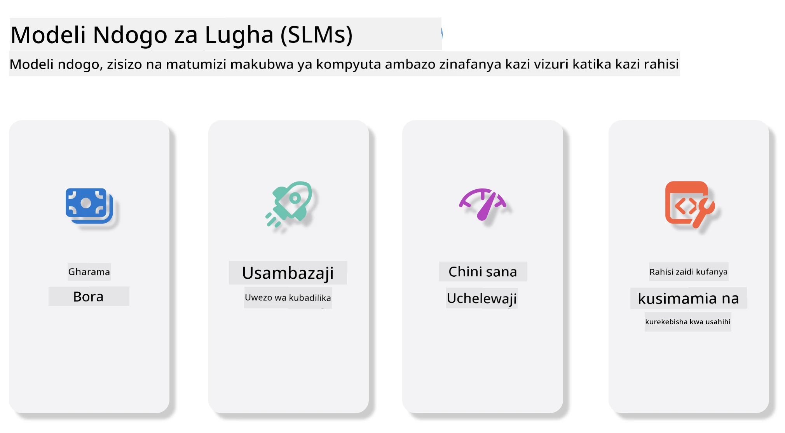
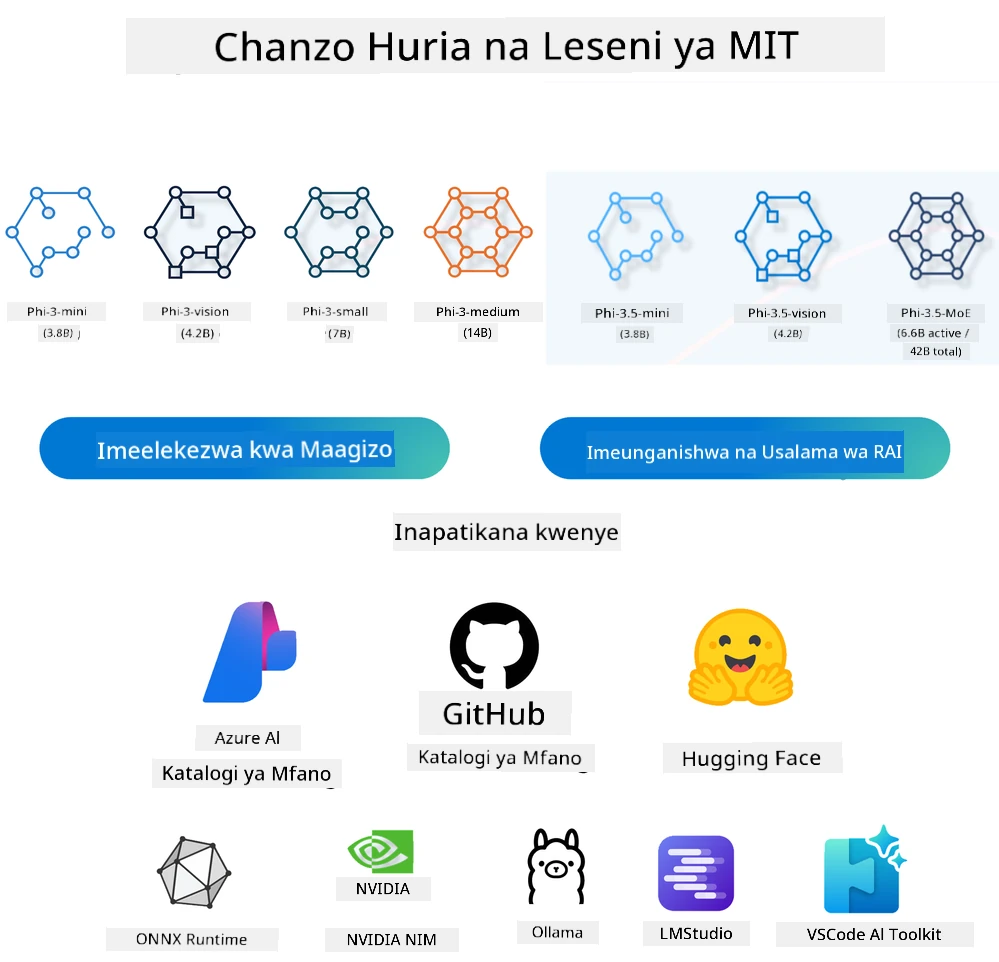
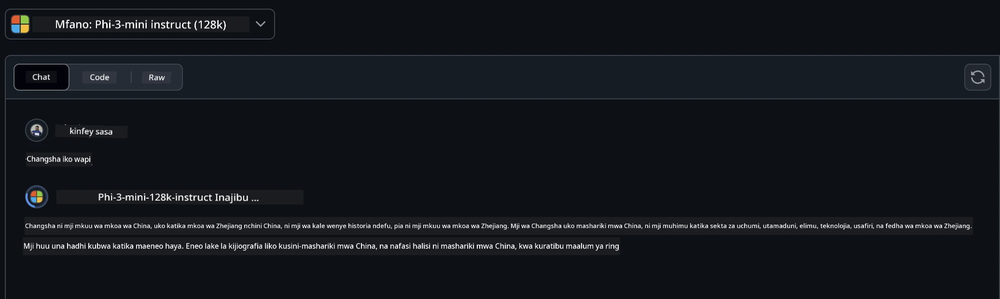
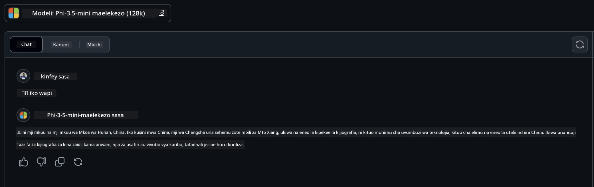

# Utangulizi wa Modeli Ndogo za Lugha kwa AI ya Kizazi kwa Wananchi Wapya
AI ya Kizazi ni sekta ya kuvutia ya akili bandia inayolenga kuunda mifumo inayoweza kuzalisha maudhui mapya. Maudhui haya yanaweza kuwa kutoka kwa maandishi na picha hadi muziki na hata mazingira yote ya mtandao. Moja ya matumizi ya kusisimua zaidi ya AI ya kizazi ni katika eneo la modeli za lugha.

## Modeli Ndogo za Lugha ni Nini?

Modeli Ndogo ya Lugha (SLM) ni toleo lililopunguzwa la modeli kubwa ya lugha (LLM), likitumia kanuni nyingi za usanifu na mbinu za LLM, huku likionyesha athari ndogo sana za kompyuta.

SLM ni sehemu ndogo ya modeli za lugha zinazoundwa kuzalisha maandishi yanayofanana na ya binadamu. Tofauti na ndugu zao wakubwa kama GPT-4, SLM ni ndogo na bora zaidi, na kuzifanya bora kwa matumizi ambapo rasilimali za kompyuta ni chache. Licha ya ukubwa mdogo, bado zinaweza kutekeleza kazi mbalimbali. Kwa kawaida, SLM hujengwa kwa kubana au kuondoa sehemu kutoka LLM, kwa lengo la kuhifadhi sehemu kubwa ya uwezo wa awali wa modeli na uwezo wa lugha. Kupunguzwa kwa ukubwa wa modeli hupunguza ugumu mzima, na kufanya SLM kuwa bora zaidi kwa matumizi ya kumbukumbu na mahitaji ya kompyuta. Licha ya uboreshaji huu, SLM bado zinaweza kutekeleza kazi mbalimbali za usindikaji wa lugha asilia (NLP):

- Uundaji wa Maandishi: Kuunda sentensi au aya zinazofuata muktadha na zinaeleweka.
- Kukamilisha Maandishi: Ktabiri na kukamilisha sentensi kwa kuzingatia kichocheo kilichotolewa.
- Tafsiri: Kubadilisha maandishi kutoka lugha moja kwenda nyingine.
- Muhtasari: Kufupisha vipande virefu vya maandishi kuwa muhtasari mfupi na rahisi kufahamu.

Ingawa kwa baadhi ya mapungufu ya utendaji au kina cha uelewa ikilinganishwa na ndugu zao wakubwa.

## Modeli Ndogo za Lugha Hufanya Kazi Vipi?
SLM hufunzwa kwa kutumia kiasi kikubwa cha data ya maandishi. Wakati wa mafunzo, hujifunza mifumo na muundo wa lugha, na zinaweza kuzalisha maandishi yanayofuata sarufi na muktadha unaofaa. Mchakato wa mafunzo unahusisha:

- Ukusanyaji Data: Kukusanya seti kubwa za data ya maandishi kutoka vyanzo mbalimbali.
- Uandaaji Awali: Kusafisha na kupanga data ili iweze kufaa kwa mafunzo.
- Mafunzo: Kutumia algoriti za kujifunza mashine kufundisha modeli jinsi ya kuelewa na kuzalisha maandishi.
- Marekebisho ya Ziada: Kuboresha modeli ili ipoe utendaji wake kwa kazi maalum.

Uundaji wa SLM unalingana na haja inayoongezeka ya modeli zinazoweza kutumika katika mazingira yenye rasilimali chache, kama vifaa vya simu au majukwaa ya uendeshaji ya edge, ambapo LLM kamili inaweza kuwa haifai kwa sababu ya mahitaji makubwa ya rasilimali. Kwa kuzingatia ufanisi, SLM hushawishi ufanisi na upatikanaji, kuruhusu matumizi ya upana zaidi katika nyanja mbalimbali.



## Malengo ya Kujifunza

Katika somo hili, tunatarajia kutambulisha maarifa ya SLM na kuichanganya na Microsoft Phi-3 kujifunza hali tofauti katika maudhui ya maandishi, maono na MoE.

Mwisho wa somo hili, unapaswa kuwa na uwezo wa kujibu maswali yafuatayo:

- SLM ni nini?
- Tofauti kati ya SLM na LLM ni ipi?
- Familia ya Microsoft Phi-3/3.5 ni nini?
- Jinsi ya kuendesha uchambuzi kwa Familia ya Microsoft Phi-3/3.5?

Uko tayari? Tuanze.

## Tofauti Kati ya Modeli Kubwa za Lugha (LLMs) na Modeli Ndogo za Lugha (SLMs)

Pamoja na LLM na SLM kujengwa kwa misingi ya msingi ya ujifunzaji wa mashine wa kimatarajio, wakifuata mbinu sawa katika usanifu wa miundo, mbinu za mafunzo, michakato ya uzalishaji data, na mbinu za tathmini ya modeli. Hata hivyo, kuna mambo kadhaa muhimu yanayowatofautisha aina hizi mbili za modeli.

## Matumizi ya Modeli Ndogo za Lugha

SLM zina matumizi mbalimbali, ikiwemo:

- Chatbots: Kutoa msaada wa wateja na kuwasiliana na watumiaji kwa njia ya mazungumzo.
- Uundaji wa Maudhui: Kusaidia waandishi kwa kutoa mawazo au hata kuandika makala kamili.
- Elimu: Kusaidia wanafunzi na kazi za uandishi au kujifunza lugha mpya.
- Upatikanaji: Kuunda zana kwa watu wenye ulemavu, kama mifumo ya maandishi-ku-sauti.

**Ukubwa**
  
Tofauti kuu kati ya LLM na SLM iko katika ukubwa wa modeli. LLM kama ChatGPT (GPT-4), inaweza kuwa na takriban vigezo 1.76 trilioni, wakati SLM za chanzo wazi kama Mistral 7B zimeundwa na vigezo vichache sana - takriban bilioni 7. Toofauti hii hutokana hasa na tofauti katika usanifu wa modeli na michakato ya mafunzo. Kwa mfano, ChatGPT hutumia utambuzi wa kujihadharisha ndani ya muundo wa encoder-decoder, wakati Mistral 7B hutumia utambuzi wa dirisha inayoteleza, ambao huwezesha mafunzo bora zaidi ndani ya modeli ya decoder tu. Tofauti hii ya usanifu ina athari kubwa kwa ugumu na utendaji wa modeli hizi.

**Uelewa**

SLM kwa kawaida hufanywa ili kuwa na utendaji bora katika nyanja maalum, zikifanya kuwa maalum sana lakini zinaweza kuwa na uwezo mdogo wa kutoa uelewa mpana wa muktadha katika nyanja nyingi za maarifa. Kinyume chake, LLM huliwaiga akili ya binadamu kwa kiwango pana zaidi. Zimefundishwa kwa seti kubwa na tofauti za data, LLM zimeundwa kufanya vizuri katika nyanja mbalimbali, zikitoa ufanisi na kubadilika zaidi. Kwa hivyo, LLM ni bora kwa kazi mbalimbali za chini, kama usindikaji wa lugha ya asili na programu.

**Hesabu**

Mchakato wa mafunzo na uanzishaji wa LLM ni mzito wa rasilimali, mara nyingi unahitaji miundombinu ya hesabu kubwa, ikijumuisha makundi makubwa ya GPU. Kwa mfano, kufundisha modeli kama ChatGPT kutoka mwanzo inaweza kuhitaji maelfu ya GPU kwa vipindi virefu. Kinyume chake, SLM, zikiwa na vigezo vidogo, ni rahisi zaidi kufikia kwa rasilimali za kompyuta. Modeli kama Mistral 7B zinaweza kufundishwa na kuendeshwa kwenye mashine za karibu zilizo na uwezo wa GPU wa wastani, ingawa mafunzo bado yanahitaji saa kadhaa kwenye GPUs kadhaa.

**Upendeleo**

Upendeleo ni tatizo linalojulikana katika LLM, hasa kwa sababu ya asili ya data ya mafunzo. Modeli hizi mara nyingi hutegemea data ghafi, inayopatikana wazi mtandaoni, ambayo inaweza kuwa na uwakilishi hafifu au usio sahihi wa makundi fulani, kuleta lebo zisizo sahihi, au kuonyesha upendeleo wa lugha unaoathiriwa na lahaja, tofauti za kijiografia, na kanuni za sarufi. Zaidi ya hayo, ugumu wa usanifu wa LLM unaweza kuongeza upendeleo kwa bahati mbaya, ambao unaweza kutotambuliwa bila kurekebisha kwa umakini. Kwa upande mwingine, SLM, zikiwa zimfundishwa kwa seti za data zilizozuiliwa na za nyanja maalum, kwa asili si rahisi kuathiriwa na upendeleo huu, ingawa haziko salama kabisa.

**Uchambuzi**

Ukubwa mdogo wa SLM huwapa faida kubwa kwa kasi ya uchambuzi, zikiruhusu kuzalisha matokeo kwa ufanisi kwenye vifaa vya karibu bila hitaji la usindikaji mkubwa wa sambamba. Kinyume na LLM, kwa ukubwa na ugumu wake, mara nyingi huhitaji rasilimali kubwa za usindikaji sambamba ili kufikia muda mzuri wa uchambuzi. Uzito wa watumiaji wengi sambamba pia huchelewesha majibu ya LLM, hasa zinapopelekwa kwa wingi.

Kwa muhtasari, ingawa LLM na SLM zina misingi sawa ya ujifunzaji wa mashine, zinatofautiana sana kwa ukubwa wa modeli, mahitaji ya rasilimali, uelewa wa muktadha, urahisi wa upendeleo, na kasi ya uchambuzi. Tofauti hizi zinaonyesha umafanisi wao kwa matumizi tofauti, LLM ikiwa ya kubadilika zaidi lakini yenye hitaji kubwa la rasilimali, na SLM ikitoa ufanisi maalum kwa nyanja na mahitaji ya chini ya kompyuta.

***Kumbuka: Katika somo hili, tutatambulisha SLM kwa kutumia Microsoft Phi-3 / 3.5 kama mfano.***

## Kutambulisha Familia ya Phi-3 / Phi-3.5

Familia ya Phi-3 / 3.5 inalenga hasa matukio ya maombi ya maandishi, maono, na Wakala (MoE):

### Phi-3 / 3.5 Instruct

Kizazi cha maandishi, kukamilisha mazungumzo, na uchimbaji wa taarifa za maudhui hasa.

**Phi-3-mini**

Modeli ya lugha ya 3.8B inapatikana kwenye Microsoft Azure AI Studio, Hugging Face, na Ollama. Modeli za Phi-3 zinazidi kwa kiasi kikubwa modeli za lugha za ukubwa sawa na kubwa katika vipimo muhimu (tazama nambari za kipimo hapo chini, nambari kubwa zaidi ni nzuri). Phi-3-mini huzidi modeli zenye ukubwa mara mbili, wakati Phi-3-small na Phi-3-medium huzidi modeli kubwa zaidi, ikiwemo GPT-3.5.

**Phi-3-small & medium**

Kwa vigezo 7B tu, Phi-3-small huzidi GPT-3.5T kwenye vipimo vya lugha, akili, uandishi wa kanuni, na hesabu.

Phi-3-medium yenye vigezo 14B inaendelea na mwelekeo huu na huzidi Gemini 1.0 Pro.

**Phi-3.5-mini**

Tunaweza kuiona kama uboreshaji wa Phi-3-mini. Ingawa vigezo havijabadilika, huongeza uwezo wa kusaidia lugha nyingi (kuunga mkono lugha 20+: Kiarabu, Kichina, Cheki, Kidenmaki, Kiholanzi, Kiingereza, Kifini, Kifaransa, Kijerumani, Kiebrania, Kihenegari, Kiitaliano, Kijapani, Kikorea, Kinorwe, Kipolandi, Kireno, Kirusi, Kihispania, Kiswidi, Kithai, Kituruki, Kiukraini) na kuongeza msaada mzito kwa muktadha mrefu.

Phi-3.5-mini yenye vigezo 3.8B huzidi modeli za lugha za ukubwa sawa na ni sawa na modeli za ukubwa mara mbili.

### Phi-3 / 3.5 Vision

Tunaweza kufikiria modeli ya Instruct ya Phi-3/3.5 kama uwezo wa Phi kuelewa, na Vision ni ambayo huwapa Phi macho ya kuelewa dunia.

**Phi-3-Vision**

Phi-3-vision, yenye vigezo 4.2B tu, inaendelea na mwelekeo huu na huzidi modeli kubwa kama Claude-3 Haiku na Gemini 1.0 Pro V kwenye kazi za jumla za akili za kuona, OCR, na kazi za kuelewa meza na michoro.

**Phi-3.5-Vision**

Phi-3.5-Vision ni pia uboreshaji wa Phi-3-Vision, kuongeza msaada kwa picha nyingi. Unaweza kuiona kama uboreshaji wa kuona, sio tu kuona picha, bali pia video.

Phi-3.5-vision huzidi modeli kubwa kama Claude-3.5 Sonnet na Gemini 1.5 Flash katika kazi za OCR, kuelewa jadwali na chati na ni sawa katika kazi za jumla za maarifa ya kuona. Inasaidia ingizo la picha nyingi, yaani kufanya akili juu ya picha nyingi za ingizo.

### Phi-3.5-MoE

***Mchanganyiko wa Wataalamu (MoE)*** huruhusu modeli kufunzwa awali kwa matumizi kidogo ya kompyuta, ambayo inamaanisha unaweza kuongeza ukubwa wa modeli au seti ya data kwa kiasi kikubwa kwa bajeti sawa ya kompyuta kama modeli mnene. Hasa, modeli ya MoE inapaswa kufikia ubora sawa na modeli yake mnene haraka wakati wa mafunzo ya awali.

Phi-3.5-MoE ina moduli 16x3.8B za wataalamu. Phi-3.5-MoE yenye vigezo 6.6B vinavyotumika tu ina viwango sawa vya akili, uelewa wa lugha, na hesabu kama modeli kubwa zaidi.

Tunaweza kutumia modeli ya Familia ya Phi-3/3.5 kulingana na matukio tofauti. Tofauti na LLM, unaweza kupeleka Phi-3/3.5-mini au Phi-3/3.5-Vision kwenye vifaa vya edge.

## Jinsi ya kutumia modeli za Familia ya Phi-3/3.5

Tunataka kutumia Phi-3/3.5 katika matukio tofauti. Ifuatayo, tutatumia Phi-3/3.5 kulingana na matukio tofauti.



### Uchambuzi kupitia API za Cloud

**Modeli za GitHub**

Modeli za GitHub ni njia ya moja kwa moja zaidi. Unaweza kupata haraka modeli ya Phi-3/3.5-Instruct kupitia Modeli za GitHub. Ikiwa umeunganishwa na Azure AI Inference SDK / OpenAI SDK, unaweza kufikia API kupitia msimbo ili kukamilisha simu ya Phi-3/3.5-Instruct. Pia unaweza kujaribu athari tofauti kupitia Playground.

- Onyesho: Ulinganisho wa athari za Phi-3-mini na Phi-3.5-mini katika mazingira ya Kichina






**Azure AI Studio**

Au kama tunataka kutumia modeli za maono na MoE, unaweza kutumia Azure AI Studio kukamilisha simu. Ikiwa una nia, unaweza kusoma Phi-3 Cookbook ili kujifunza jinsi ya kuita Phi-3/3.5 Instruct, Vision, MoE kupitia Azure AI Studio [Bonyeza kiungo hiki](https://github.com/microsoft/Phi-3CookBook/blob/main/md/02.QuickStart/AzureAIStudio_QuickStart.md?WT.mc_id=academic-105485-koreyst)


**NVIDIA NIM**

Zaidi ya suluhisho za Katalogi za Modeli za msingi za wingu zinazotolewa na Azure na GitHub, pia unaweza kutumia [NVIDIA NIM](https://developer.nvidia.com/nim?WT.mc_id=academic-105485-koreyst) kukamilisha simu zinazohusiana. Unaweza kutembelea NVIDIA NIM kukamilisha API za Familia ya Phi-3/3.5. NVIDIA NIM (NVIDIA Inference Microservices) ni seti ya huduma ndogo za uchambuzi zilizoinuliwa ili kusaidia watengenezaji kupeleka modeli za AI kwa ufanisi katika mazingira mbalimbali, ikijumuisha mawingu, vituo vya data, na vituo vya kazi.

Hapa kuna sifa kuu za NVIDIA NIM:
- **Urahisi wa Uwekaji:** NIM inaruhusu kuwekwa kwa modeli za AI kwa amri moja, na kufanya iwe rahisi kuunganisha kwenye mtiririko wa kazi uliopo.
- **Utendaji ulioboreshwa:** Inatumia injini za utabiri zilizoandaliwa awali za NVIDIA, kama TensorRT na TensorRT-LLM, kuhakikisha ucheleweshaji mdogo na upokeaji wa juu.
- **Uwezo wa Kupanuka:** NIM inasaidia kujiendesha kwa kiwango kwenye Kubernetes, ikiruhusu kushughulikia kazi mbalimbali kwa ufanisi.
- **Usalama na Udhibiti:** Mashirika yanaweza kudhibiti data na programu zao kwa mwenyeji wa huduma ndogo za NIM kwenye miundombinu yao inayodhibitiwa wenyewe.
- **API za Kiwango:** NIM hutoa API za viwango vya viwanda, kufanya iwe rahisi kujenga na kuunganisha programu za AI kama chatbots, wasaidizi wa AI, na zaidi.

NIM ni sehemu ya NVIDIA AI Enterprise, inayolenga kuwezesha uwekaji rahisi na utendakazi wa modeli za AI, kuhakikisha zinafanya kazi kwa ufanisi kwenye GPUs za NVIDIA.

- Onyesho: Kutumia NVIDIA NIM kupiga simu Phi-3.5-Vision-API  [[Bonyeza kiungo hiki](./python/Phi-3-Vision-Nividia-NIM.ipynb?WT.mc_id=academic-105485-koreyst)]


### Kuendesha Phi-3/3.5 Kwenye Msingi
Utabiri kuhusiana na Phi-3, au mfano wowote wa lugha kama GPT-3, unarejelea mchakato wa kutengeneza majibu au utabiri kutokana na pembejeo inayopewa. Unapotoa ombi au swali kwa Phi-3, hutumia mtandao wake wa neva uliofunzwa kutabiri jibu linalowezekana zaidi na linalofaa kwa kuchambua mifumo na uhusiano kwenye data iliyofunzwa.

**Hugging Face Transformer**
Hugging Face Transformers ni maktaba yenye nguvu iliyobuniwa kwa ajili ya usindikaji lugha asili (NLP) na kazi nyingine za mashine za kujifunza. Hapa kuna baadhi ya mambo muhimu juu yake:

1. **Modeli Zilizofanikiwa Kufunzwa:** Hutoa maelfu ya modeli zilizofanikiwa kufunzwa zinazoweza kutumika kwa kazi mbalimbali kama ugawaji maandishi, utambuzi wa jina la kielelezo, kujibu maswali, muhtasari, utafsiri, na uundaji wa maandishi.

2. **Urahisi wa Mazingira Mbalimbali:** Maktaba inaunga mkono mifumo mingi ya kujifunza kwa kina, ikiwa ni pamoja na PyTorch, TensorFlow, na JAX. Hii inaruhusu kufunza mfano katika mfumo mmoja na kuutumia mwingine.

3. **Uwezo wa Kupokea Vinginevyo:** Mbali na NLP, Hugging Face Transformers pia inasaidia kazi za kuona kompyuta (kwa mfano, uainishaji wa picha, utambuzi wa vitu) na usindikaji sauti (kwa mfano, utambuzi wa hotuba, uainishaji wa sauti).

4. **Rahisi Kutumia:** Maktaba inatoa API na zana za kupakua na kurekebisha modeli kwa urahisi, ikifanya ipatikane kwa wanaoanza na wataalamu.

5. **Jumuiya na Rasilimali:** Hugging Face ina jumuiya yenye nguvu na maandiko ya kina, mafunzo, na miongozo kusaidia watumiaji kuanza na kufanya matumizi bora ya maktaba.
[maelezo rasmi](https://huggingface.co/docs/transformers/index?WT.mc_id=academic-105485-koreyst) au [hifadhidata yao ya GitHub](https://github.com/huggingface/transformers?WT.mc_id=academic-105485-koreyst).

Huu ndio mbinu inayotumika zaidi, lakini pia inahitaji kuongezewa nguvu na GPU. Baadhi ya hali kama Vision na MoE zinahitaji mahesabu mengi, ambayo yatachelewa sana kwenye CPU ikiwa hazijatolewa kwa kiasi.

- Onyesho: Kutumia Transformer kupiga simu Phi-3.5-Instruct [Bonyeza kiungo hiki](./python/phi35-instruct-demo.ipynb?WT.mc_id=academic-105485-koreyst)

- Onyesho: Kutumia Transformer kupiga simu Phi-3.5-Vision [Bonyeza kiungo hiki](./python/phi35-vision-demo.ipynb?WT.mc_id=academic-105485-koreyst)

- Onyesho: Kutumia Transformer kupiga simu Phi-3.5-MoE [Bonyeza kiungo hiki](./python/phi35_moe_demo.ipynb?WT.mc_id=academic-105485-koreyst)

**Ollama**
[Ollama](https://ollama.com/?WT.mc_id=academic-105485-koreyst) ni jukwaa lililobuniwa kuwezesha kuendesha modeli kubwa za lugha (LLMs) ndani ya mashine yako mwenyewe. Linaunga mkono modeli mbalimbali kama Llama 3.1, Phi 3, Mistral, na Gemma 2, miongoni mwa zingine. Jukwaa hili linafanya mchakato rahisi kwa kuweka vizito vya mfano, usanidi, na data katika kifurushi kimoja, kufanya iwe rahisi kwa watumiaji kubadilisha na kuunda modeli zao wenyewe. Ollama inapatikana kwa macOS, Linux, na Windows. Ni chombo kizuri ikiwa unatafuta kujaribu au kuweka LLMs bila kutegemea huduma za wingu. Ollama ni njia ya moja kwa moja zaidi, unahitaji tu kutekeleza amri ifuatayo.


```bash

ollama run phi3.5

```


**ONNX Runtime kwa GenAI**

[ONNX Runtime](https://github.com/microsoft/onnxruntime-genai?WT.mc_id=academic-105485-koreyst) ni kasi ya mashine ya kujifunza ambayo inasaidia utekelezaji wa mfano na mafunzo kwa hatua mbalimbali. ONNX Runtime kwa Generative AI (GENAI) ni chombo chenye nguvu kinachosaidia kuendesha modeli za AI za kizazi kwa ufanisi kwenye majukwaa mbalimbali.

## ONNX Runtime ni Nini?
ONNX Runtime ni mradi wa chanzo huria unaowezesha utekelezaji wa haraka wa modeli za mashine za kujifunza. Inasaidia modeli katika muundo wa Open Neural Network Exchange (ONNX), ambao ni kiwango cha kuwakilisha modeli za mashine. ONNX Runtime inaweza kuharakisha uzoefu wa wateja na kupunguza gharama, kuunga mkono modeli kutoka kwa mifumo ya kujifunza kwa kina kama PyTorch na TensorFlow/Keras pamoja na maktaba za mashine za kawaida kama scikit-learn, LightGBM, XGBoost, n.k. ONNX Runtime inaendana na vifaa tofauti, madereva, na mifumo ya uendeshaji, na hutoa utendakazi bora kwa kutumia harakishaji wa vifaa pale panapowezekana pamoja na uboreshaji na mabadiliko ya michoro.

## AI ya Kizazi ni Nini?
AI ya Kizazi inarejelea mifumo ya AI inayoweza kuzalisha maudhui mapya, kama maandishi, picha, au muziki, kwa msingi wa data walizofunzwa. Mifano ni pamoja na modeli za lugha kama GPT-3 na modeli za uzalishaji picha kama Stable Diffusion. Maktaba ya ONNX Runtime kwa GenAI hutoa mzunguko wa AI wa kizazi kwa modeli za ONNX, ikijumuisha utekelezaji na ONNX Runtime, usindikaji wa logits, utafutaji na sampuli, na usimamizi wa cache ya KV.

## ONNX Runtime kwa GENAI
ONNX Runtime kwa GENAI inaongeza uwezo wa ONNX Runtime kuunga mkono modeli za AI za kizazi. Hapa kuna sifa kuu:

- **Uungaji Pamoja wa Majukwaa Mbalimbali:** Inafanya kazi kwenye majukwaa mbalimbali, ikiwemo Windows, Linux, macOS, Android, na iOS.
- **Msaada wa Modeli:** Inasaidia modeli nyingi maarufu za AI za kizazi, kama LLaMA, GPT-Neo, BLOOM, na zaidi.
- **Uboreshaji wa Utendaji:** Inajumuisha uboreshaji kwa harakishaji wa vifaa mbalimbali kama GPU za NVIDIA, GPU za AMD, na zaidi.
- **Rahisi Kutumia:** Inatoa API kwa ajili ya kuunganisha kwa urahisi kwenye programu, kukuwezesha kuzalisha maandishi, picha, na maudhui mengine kwa nambari kidogo
- Watumiaji wanaweza kupiga simu ya njia ya generate() ya kiwango cha juu, au kuendesha kila kurudiwa kwa mfano kwa mzunguko, kuzalisha alama moja kwa wakati, na hiari kubadilisha vigezo vya kizazi ndani ya mzunguko.
- ONNX runtime pia ina msaada kwa utafutaji wa greedy/beam na sampuli za TopP, TopK kuzalisha mfuatano wa alama pamoja na usindikaji wa logits uliojengwa kama adhabu za kurudia. Unaweza pia kuongeza alama za desturi kwa urahisi.

## Kuanzia
Ili kuanza na ONNX Runtime kwa GENAI, unaweza kufuata hatua hizi:

### Sakinisha ONNX Runtime:
```Python
pip install onnxruntime
```
### Sakinisha Nyongeza za AI za Kizazi:
```Python
pip install onnxruntime-genai
```

### Endesha Mfano: Hapa ni mfano rahisi kwa Python:
```Python
import onnxruntime_genai as og

model = og.Model('path_to_your_model.onnx')

tokenizer = og.Tokenizer(model)

input_text = "Hello, how are you?"

input_tokens = tokenizer.encode(input_text)

output_tokens = model.generate(input_tokens)

output_text = tokenizer.decode(output_tokens)

print(output_text) 
```
### Onyesho: Kutumia ONNX Runtime GenAI kupiga simu Phi-3.5-Vision


```python

import onnxruntime_genai as og

model_path = './Your Phi-3.5-vision-instruct ONNX Path'

img_path = './Your Image Path'

model = og.Model(model_path)

processor = model.create_multimodal_processor()

tokenizer_stream = processor.create_stream()

text = "Your Prompt"

prompt = "<|user|>\n"

prompt += "<|image_1|>\n"

prompt += f"{text}<|end|>\n"

prompt += "<|assistant|>\n"

image = og.Images.open(img_path)

inputs = processor(prompt, images=image)

params = og.GeneratorParams(model)

params.set_inputs(inputs)

params.set_search_options(max_length=3072)

generator = og.Generator(model, params)

while not generator.is_done():

    generator.compute_logits()
    
    generator.generate_next_token()

    new_token = generator.get_next_tokens()[0]
    
    output = tokenizer_stream.decode(new_token)
    
    print(tokenizer_stream.decode(new_token), end='', flush=True)

```


**Nyinginezo**

Mbali na njia za marejeleo za ONNX Runtime na Ollama, tunaweza pia kukamilisha marejeleo ya modeli za kiasi kulingana na njia za marejeleo ya modeli zinazotolewa na wazalishaji tofauti. Kama vile fremu ya Apple MLX na Apple Metal, Qualcomm QNN na NPU, Intel OpenVINO na CPU/GPU, n.k. Pia unaweza kupata maudhui zaidi kutoka [Phi-3 Cookbook](https://github.com/microsoft/phi-3cookbook?WT.mc_id=academic-105485-koreyst)


## Zaidi

Tumejifunza misingi ya Familia ya Phi-3/3.5, lakini ili kujifunza zaidi kuhusu SLM tunahitaji maarifa zaidi. Unaweza kupata majibu katika Phi-3 Cookbook. Ikiwa unataka kujifunza zaidi, tafadhali tembelea [Phi-3 Cookbook](https://github.com/microsoft/phi-3cookbook?WT.mc_id=academic-105485-koreyst).

---

<!-- CO-OP TRANSLATOR DISCLAIMER START -->
**Kauli ya Kutotegemea**:
Hati hii imetafsiriwa kwa kutumia huduma ya kutafsiri kwa AI [Co-op Translator](https://github.com/Azure/co-op-translator). Ingawa tunajitahidi kuhakikisha usahihi, tafadhali fahamu kuwa tafsiri za kiotomatiki zinaweza kuwa na makosa au upotovu wa maana. Hati asili katika lugha yake ya asili inapaswa kuchukuliwa kama chanzo cha mamlaka. Kwa taarifa muhimu, tafsiri za kitaalamu za binadamu zinapendekezwa. Hatuwajibiki kwa kutoelewana au tafsiri zisizo sahihi zinazotokana na matumizi ya tafsiri hii.
<!-- CO-OP TRANSLATOR DISCLAIMER END -->