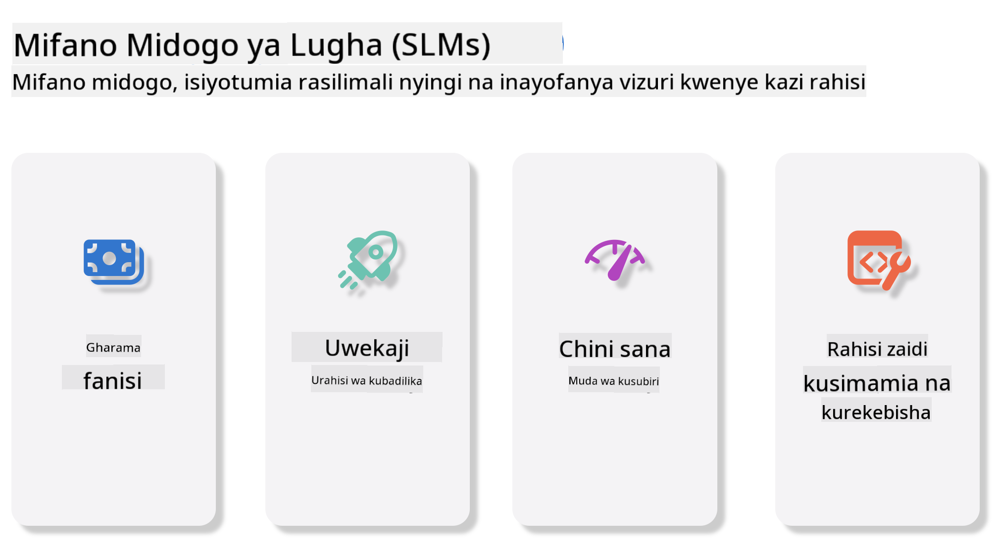
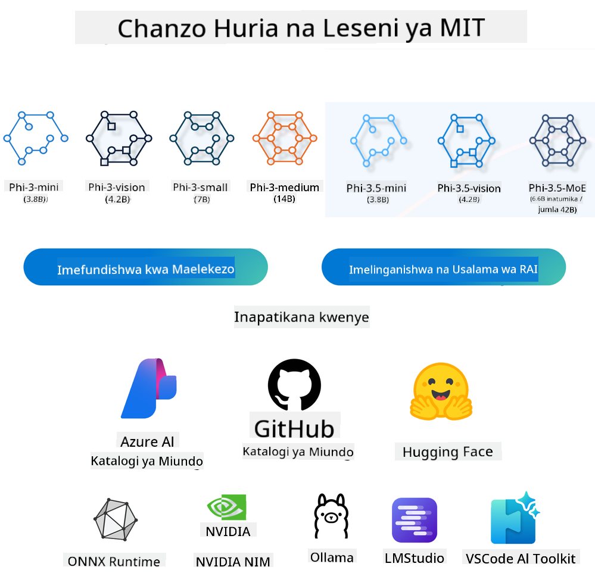
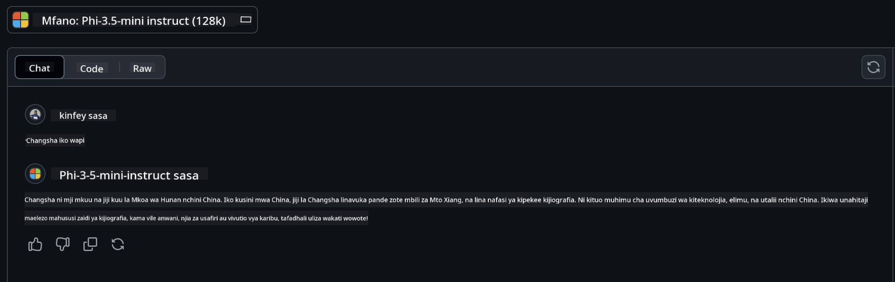

<!--
CO_OP_TRANSLATOR_METADATA:
{
  "original_hash": "124ad36cfe96f74038811b6e2bb93e9d",
  "translation_date": "2025-07-09T18:43:46+00:00",
  "source_file": "19-slm/README.md",
  "language_code": "sw"
}
-->
# Utangulizi wa Modeli Ndogo za Lugha kwa AI ya Kizazi kwa Waanzilishi  
AI ya Kizazi ni eneo la kuvutia la akili bandia linalolenga kuunda mifumo inayoweza kuzalisha maudhui mapya. Maudhui haya yanaweza kuwa maandishi, picha, muziki, au hata mazingira ya kidijitali. Mojawapo ya matumizi ya kusisimua ya AI ya kizazi ni katika sekta ya modeli za lugha.  

## Modeli Ndogo za Lugha ni Nini?  

Modeli Ndogo ya Lugha (SLM) ni toleo lililopunguzwa la modeli kubwa ya lugha (LLM), likitumia kanuni na mbinu nyingi za LLM, lakini likiwa na mahitaji madogo sana ya kompyuta.  

SLM ni sehemu ndogo ya modeli za lugha zilizoundwa kuzalisha maandishi yanayofanana na ya binadamu. Tofauti na modeli kubwa kama GPT-4, SLM ni ndogo na yenye ufanisi zaidi, hivyo ni bora kwa matumizi ambapo rasilimali za kompyuta ni chache. Licha ya ukubwa mdogo, bado zinaweza kufanya kazi mbalimbali. Kwa kawaida, SLM hutengenezwa kwa kubana au kuchuja LLM, kwa lengo la kuhifadhi sehemu kubwa ya uwezo wa awali wa modeli na ujuzi wa lugha. Kupunguzwa kwa ukubwa huu kunapunguza ugumu wa jumla, na kufanya SLM ziwe na ufanisi zaidi kwa matumizi ya kumbukumbu na mahitaji ya kompyuta. Licha ya maboresho haya, SLM bado zinaweza kutekeleza kazi mbalimbali za usindikaji wa lugha asilia (NLP):  

- Uundaji wa Maandishi: Kuunda sentensi au aya zinazofaa na zinaeleweka vizuri.  
- Kukamilisha Maandishi: Kubashiri na kukamilisha sentensi kulingana na maelekezo yaliyotolewa.  
- Tafsiri: Kubadilisha maandishi kutoka lugha moja kwenda nyingine.  
- Muhtasari: Kufupisha maandishi marefu kuwa muhtasari mfupi na rahisi kueleweka.  

Hata hivyo, kuna baadhi ya upungufu katika utendaji au kina cha uelewa ikilinganishwa na modeli kubwa.  

## Modeli Ndogo za Lugha Hufanya Kazi Vipi?  
SLM hufunzwa kwa kutumia kiasi kikubwa cha data ya maandishi. Wakati wa mafunzo, hujifunza mifumo na muundo wa lugha, na hivyo kuweza kuzalisha maandishi ambayo ni sahihi kisarufi na yanayofaa kwa muktadha. Mchakato wa mafunzo unahusisha:  

- Ukusanyaji wa Data: Kukusanya seti kubwa za data za maandishi kutoka vyanzo mbalimbali.  
- Usindikaji wa Awali: Kusafisha na kupanga data ili iweze kutumika kwa mafunzo.  
- Mafunzo: Kutumia algoriti za kujifunza mashine kufundisha modeli jinsi ya kuelewa na kuzalisha maandishi.  
- Urekebishaji wa Kina: Kurekebisha modeli ili kuboresha utendaji wake katika kazi maalum.  

Maendeleo ya SLM yanaendana na hitaji la kuunda modeli zinazoweza kutumika katika mazingira yenye rasilimali chache, kama vile vifaa vya simu au mifumo ya edge computing, ambapo LLM kamili inaweza kuwa ngumu kutumia kutokana na mahitaji makubwa ya rasilimali. Kwa kuzingatia ufanisi, SLM huleta usawa kati ya utendaji na upatikanaji, na kuwezesha matumizi mapana katika nyanja mbalimbali.  

  

## Malengo ya Kujifunza  

Katika somo hili, tunatarajia kuanzisha maarifa ya SLM na kuichanganya na Microsoft Phi-3 ili kujifunza matukio tofauti katika maudhui ya maandishi, kuona, na MoE.  

Mwisho wa somo hili, unapaswa kuwa na uwezo wa kujibu maswali yafuatayo:  

- SLM ni nini  
- Tofauti kati ya SLM na LLM ni zipi  
- Familia ya Microsoft Phi-3/3.5 ni nini  
- Jinsi ya kufanya inference kwa Microsoft Phi-3/3.5  

Tuko tayari? Tuanze.  

## Tofauti Kati ya Modeli Kubwa za Lugha (LLMs) na Modeli Ndogo za Lugha (SLMs)  

Zote LLM na SLM zimetengenezwa kwa misingi ya kujifunza mashine ya uwezekano, zikifuata mbinu zinazofanana katika muundo wa usanifu, mbinu za mafunzo, michakato ya uzalishaji data, na mbinu za tathmini ya modeli. Hata hivyo, kuna mambo kadhaa muhimu yanayotofautisha aina hizi mbili za modeli.  

## Matumizi ya Modeli Ndogo za Lugha  

SLM zina matumizi mengi, ikiwa ni pamoja na:  

- Chatbots: Kutoa msaada kwa wateja na kuwasiliana na watumiaji kwa mazungumzo.  
- Uundaji wa Maudhui: Kusaidia waandishi kwa kutoa mawazo au hata kuandika makala nzima.  
- Elimu: Kusaidia wanafunzi katika kazi za uandishi au kujifunza lugha mpya.  
- Upatikanaji: Kuunda zana kwa watu wenye ulemavu, kama mifumo ya maandishi-kwa-sauti.  

**Ukubwa**  

Tofauti kuu kati ya LLM na SLM iko katika ukubwa wa modeli. LLM kama ChatGPT (GPT-4) zinaweza kuwa na takriban parameters trilioni 1.76, wakati SLM za chanzo huria kama Mistral 7B zimeundwa na parameters chache zaidi—takriban bilioni 7. Tofauti hii inatokana hasa na tofauti za usanifu wa modeli na michakato ya mafunzo. Kwa mfano, ChatGPT hutumia mfumo wa self-attention ndani ya muundo wa encoder-decoder, wakati Mistral 7B hutumia sliding window attention, ambayo inaruhusu mafunzo yenye ufanisi zaidi ndani ya modeli ya decoder pekee. Tofauti hii ya usanifu ina athari kubwa kwa ugumu na utendaji wa modeli hizi.  

**Uelewa**  

SLM kwa kawaida zimeboreshwa kwa utendaji katika nyanja maalum, na hivyo kuwa maalum sana lakini zinaweza kuwa na uwezo mdogo wa kutoa uelewa mpana wa muktadha katika nyanja mbalimbali za maarifa. Kinyume chake, LLM zinakusudia kuiga akili ya binadamu kwa kiwango pana zaidi. Zimefunzwa kwa seti kubwa na mbalimbali za data, LLM zimeundwa kufanya kazi vizuri katika nyanja nyingi, zikitoa ufanisi na urekebishaji mkubwa. Hivyo, LLM ni bora kwa kazi nyingi za usindikaji wa lugha asilia na programu.  

**Kompyuta**  

Mafunzo na uendeshaji wa LLM ni mchakato unaotumia rasilimali nyingi, mara nyingi ukihitaji miundombinu kubwa ya kompyuta, ikiwa ni pamoja na makundi makubwa ya GPU. Kwa mfano, kufundisha modeli kama ChatGPT kutoka mwanzo kunaweza kuhitaji maelfu ya GPU kwa muda mrefu. Kinyume chake, SLM, kwa kuwa na parameters chache, ni rahisi kufikiwa kwa rasilimali za kompyuta. Modeli kama Mistral 7B zinaweza kufundishwa na kuendeshwa kwenye mashine za kawaida zilizo na uwezo wa GPU wa wastani, ingawa mafunzo bado yanahitaji masaa kadhaa kwa kutumia GPU nyingi.  

**Upendeleo**  

Upendeleo ni tatizo linalojulikana katika LLM, hasa kutokana na asili ya data za mafunzo. Modeli hizi mara nyingi hutegemea data ghafi, zinazopatikana wazi mtandaoni, ambazo zinaweza kutoonyesha kikamilifu au kuwakilisha vibaya makundi fulani, kuingiza lebo zisizo sahihi, au kuonyesha upendeleo wa lugha unaoathiriwa na lahaja, tofauti za kijiografia, na sheria za sarufi. Zaidi ya hayo, ugumu wa usanifu wa LLM unaweza kuongeza upendeleo huu bila kutambuliwa bila urekebishaji makini. Kwa upande mwingine, SLM, ambazo hufunzwa kwa seti ndogo na maalum za data, huwa na uwezekano mdogo wa kuathiriwa na upendeleo huu, ingawa si salama kabisa.  

**Inference**  

Ukubwa mdogo wa SLM unawapa faida kubwa katika kasi ya inference, na kuwaruhusu kuzalisha matokeo kwa ufanisi kwenye vifaa vya ndani bila hitaji la usindikaji mkubwa wa sambamba. Kinyume chake, LLM, kutokana na ukubwa na ugumu wake, mara nyingi huhitaji rasilimali kubwa za usindikaji sambamba ili kufanikisha muda wa inference unaokubalika. Uwepo wa watumiaji wengi kwa wakati mmoja huongeza ucheleweshaji wa majibu ya LLM, hasa inapotekelezwa kwa kiwango kikubwa.  

Kwa muhtasari, ingawa LLM na SLM zinashiriki misingi ya kujifunza mashine, zinatofautiana sana kwa ukubwa wa modeli, mahitaji ya rasilimali, uelewa wa muktadha, uwezekano wa upendeleo, na kasi ya inference. Tofauti hizi zinaonyesha matumizi yao tofauti, ambapo LLM ni za matumizi mengi lakini zinahitaji rasilimali nyingi, na SLM zinatoa ufanisi maalum kwa nyanja fulani kwa mahitaji madogo ya kompyuta.  

***Note：Katika sura hii, tutaanzisha SLM kwa kutumia Microsoft Phi-3 / 3.5 kama mfano.***  

## Utangulizi wa Familia ya Phi-3 / Phi-3.5  

Phi-3 / 3.5 Familia inalenga hasa matukio ya matumizi ya maandishi, kuona, na Agent (MoE):  

### Phi-3 / 3.5 Instruct  

Inalenga hasa uundaji wa maandishi, kukamilisha mazungumzo, na uchimbaji wa taarifa za maudhui, n.k.  

**Phi-3-mini**  

Modeli ya lugha yenye parameters 3.8B inapatikana kwenye Microsoft Azure AI Studio, Hugging Face, na Ollama. Modeli za Phi-3 zinafanya vizuri zaidi ikilinganishwa na modeli za lugha zenye ukubwa sawa au mkubwa katika vipimo muhimu (tazama nambari za vipimo hapo chini, nambari kubwa ni bora). Phi-3-mini hufanya vizuri zaidi kuliko modeli zenye mara mbili ya ukubwa wake, wakati Phi-3-small na Phi-3-medium hufanya vizuri zaidi kuliko modeli kubwa, ikiwa ni pamoja na GPT-3.5.  

**Phi-3-small & medium**  

Kwa parameters 7B tu, Phi-3-small huibuka bora dhidi ya GPT-3.5T katika vipimo mbalimbali vya lugha, mantiki, uandishi wa programu, na hisabati.  

Phi-3-medium yenye parameters 14B inaendelea na mwelekeo huu na hufanya vizuri zaidi kuliko Gemini 1.0 Pro.  

**Phi-3.5-mini**  

Tunaweza kuiona kama toleo lililoboreshwa la Phi-3-mini. Ingawa parameters hazijabadilika, inaongeza uwezo wa kuunga mkono lugha nyingi (Inasaidia lugha zaidi ya 20: Kiarabu, Kichina, Kicheki, Kidenmaki, Kiholanzi, Kiingereza, Kifini, Kifaransa, Kijerumani, Kiebrania, Kihungari, Kiitaliano, Kijapani, Kikorea, Kinorwe, Kipolishi, Kireno, Kirusi, Kihispania, Kiswidi, Kithai, Kituruki, Kiukraine) na kuongeza msaada bora kwa muktadha mrefu.  

Phi-3.5-mini yenye parameters 3.8B hufanya vizuri zaidi kuliko modeli za ukubwa sawa na ni sawa na modeli zenye mara mbili ya ukubwa wake.  

### Phi-3 / 3.5 Vision  

Tunaweza kuiona modeli ya Instruct ya Phi-3/3.5 kama uwezo wa Phi kuelewa, na Vision ni macho yanayompa Phi uwezo wa kuona na kuelewa dunia.  

**Phi-3-Vision**  

Phi-3-vision, yenye parameters 4.2B tu, inaendelea na mwelekeo huu na hufanya vizuri zaidi kuliko modeli kubwa kama Claude-3 Haiku na Gemini 1.0 Pro V katika kazi za mantiki ya kuona kwa ujumla, OCR, na ufahamu wa meza na michoro.  

**Phi-3.5-Vision**  

Phi-3.5-Vision pia ni toleo lililoboreshwa la Phi-3-Vision, likiongeza msaada wa picha nyingi. Unaweza kuiona kama kuboresha uwezo wa kuona, si tu kuona picha, bali pia video.  

Phi-3.5-vision hufanya vizuri zaidi kuliko modeli kubwa kama Claude-3.5 Sonnet na Gemini 1.5 Flash katika kazi za OCR, ufahamu wa meza na chati, na ni sawa katika kazi za mantiki ya maarifa ya kuona kwa ujumla. Inasaidia pembejeo za fremu nyingi, yaani, kufanya mantiki kwa picha nyingi za pembejeo.  

### Phi-3.5-MoE  

***Mixture of Experts (MoE)*** inaruhusu modeli kufunzwa kwa kutumia rasilimali chache zaidi, ambayo inamaanisha unaweza kuongeza ukubwa wa modeli au seti ya data kwa bajeti sawa ya kompyuta kama modeli nzito. Hasa, modeli ya MoE inapaswa kufanikisha ubora sawa na modeli nzito kwa kasi zaidi wakati wa mafunzo ya awali.  

Phi-3.5-MoE ina moduli 16 za wataalamu wa 3.8B kila moja. Phi-3.5-MoE yenye parameters 6.6B tu zinazotumika hufanikisha kiwango sawa cha mantiki, uelewa wa lugha, na hisabati kama modeli kubwa zaidi.  

Tunaweza kutumia modeli za Familia ya Phi-3/3.5 kulingana na matukio tofauti. Tofauti na LLM, unaweza kupeleka Phi-3/3.5-mini au Phi-3/3.5-Vision kwenye vifaa vya edge.  

## Jinsi ya Kutumia Modeli za Familia ya Phi-3/3.5  

Tunatarajia kutumia Phi-3/3.5 katika matukio tofauti. Ifuatayo, tutatumia Phi-3/3.5 kulingana na matukio tofauti.  

  

### Tofauti ya Inference kwa API za Wingu  

**Modeli za GitHub**  

Modeli za GitHub ni njia rahisi zaidi. Unaweza kupata haraka modeli ya Phi-3/3.5-Instruct kupitia Modeli za GitHub. Ukiunganisha na Azure AI Inference SDK / OpenAI SDK, unaweza kufikia API kupitia msimbo ili kukamilisha simu ya Phi-3/3.5-Instruct. Pia unaweza kujaribu athari tofauti kupitia Playground.  

- Demo: Ulinganisho wa athari za Phi-3-mini na Phi-3.5-mini katika matukio ya Kichina  

  

  

**Azure AI Studio**  

Au kama tunataka kutumia modeli za vision na MoE, unaweza kutumia Azure AI Studio kukamilisha simu. Ikiwa una nia, unaweza kusoma Phi-3 Cookbook kujifunza jinsi ya kuita Phi-3/3.5 Instruct, Vision, MoE kupitia Azure AI Studio [Bonyeza kiungo hiki](https://github.com/microsoft/Phi-3CookBook/blob/main/md/02.QuickStart/AzureAIStudio_QuickStart.md?WT.mc_id=academic-105485-koreyst)  

**NVIDIA NIM**  

Mbali na suluhisho za Katalogi ya Modeli za wingu zinazotolewa na Azure na GitHub, unaweza pia kutumia [NVIDIA NIM](https://developer.nvidia.com/nim?WT.mc_id=academic-105485-koreyst) kukamilisha simu zinazohusiana. Unaweza kutembelea NVIDIA NIM kukamilisha simu za API za Familia ya Phi-3/3.5. NVIDIA NIM (NVIDIA Inference Microservices) ni seti ya huduma ndogo za inference zilizoimarishwa kusaidia watengenezaji kupeleka modeli za AI kwa ufanisi katika mazingira mbalimbali, ikiwa ni pamoja na wingu, vituo vya data, na vituo vya kazi.  

Hapa kuna baadhi ya sifa kuu za NVIDIA NIM:  

- **Urahisi wa Utekelezaji:** NIM inaruhusu utekelezaji wa modeli za AI kwa amri moja, na kufanya iwe rahisi kuingiza katika mchakato uliopo.  
- **Utendaji Ulioboreshwa:** Inatumia injini za inference zilizoboreshwa za NVIDIA, kama TensorRT na TensorRT-LLM, kuhakikisha ucheleweshaji mdogo na mtiririko mkubwa wa data.  
- **Uwezo wa Kupanua:** NIM inaunga mkono autoscaling kwenye Kubernetes, ikiruhusu kushughulikia mzigo wa kazi unaobadilika kwa ufanisi.
- **Usalama na Udhibiti:** Mashirika yanaweza kudhibiti data na programu zao kwa mwenyewe kwa kuendesha huduma ndogo za NIM kwenye miundombinu yao inayosimamiwa wenyewe.
- **API za Kiwango cha Sekta:** NIM hutoa API za kiwango cha sekta, na kufanya iwe rahisi kujenga na kuunganisha programu za AI kama chatbots, wasaidizi wa AI, na zaidi.

NIM ni sehemu ya NVIDIA AI Enterprise, ambayo inalenga kurahisisha usambazaji na uendeshaji wa mifano ya AI, kuhakikisha inafanya kazi kwa ufanisi kwenye GPUs za NVIDIA.

- Demo: Kutumia Nividia NIM kupiga simu Phi-3.5-Vision-API  [[Bonyeza hapa](../../../19-slm/python/Phi-3-Vision-Nividia-NIM.ipynb)]


### Ufafanuzi wa Phi-3/3.5 katika mazingira ya ndani
Ufafanuzi kuhusiana na Phi-3, au mfano wowote wa lugha kama GPT-3, unahusu mchakato wa kutoa majibu au utabiri kulingana na ingizo linalopokelewa. Unapompa Phi-3 kauli au swali, hutumia mtandao wake wa neva uliopata mafunzo kutabiri jibu linalowezekana zaidi na linalofaa kwa kuchambua mifumo na uhusiano katika data aliyofunzwa nayo.

**Hugging Face Transformer**  
Hugging Face Transformers ni maktaba yenye nguvu iliyoundwa kwa ajili ya usindikaji wa lugha asilia (NLP) na kazi nyingine za mashine za kujifunza. Hapa kuna mambo muhimu kuhusu maktaba hii:

1. **Mifano Iliyoandaliwa Awali:** Inatoa maelfu ya mifano iliyofunzwa tayari inayotumika kwa kazi mbalimbali kama upangaji wa maandishi, utambuzi wa vitu vilivyopewa majina, kujibu maswali, muhtasari, tafsiri, na uundaji wa maandishi.

2. **Ulinganifu wa Mifumo:** Maktaba inaunga mkono mifumo mingi ya kujifunza kwa kina, ikiwa ni pamoja na PyTorch, TensorFlow, na JAX. Hii inakuwezesha kufunza mfano katika mfumo mmoja na kuutumia katika mwingine.

3. **Uwezo wa Multimodal:** Mbali na NLP, Hugging Face Transformers pia inaunga mkono kazi katika kuona kwa kompyuta (k.m. upangaji picha, kugundua vitu) na usindikaji wa sauti (k.m. utambuzi wa hotuba, upangaji sauti).

4. **Urahisi wa Matumizi:** Maktaba hutoa API na zana za kupakua na kurekebisha mifano kwa urahisi, na kuifanya ipatikane kwa wanaoanza na wataalamu.

5. **Jumuiya na Rasilimali:** Hugging Face ina jumuiya yenye nguvu na nyaraka nyingi, mafunzo, na miongozo kusaidia watumiaji kuanza na kutumia maktaba kikamilifu. [nyaraka rasmi](https://huggingface.co/docs/transformers/index?WT.mc_id=academic-105485-koreyst) au [hifadhi yao ya GitHub](https://github.com/huggingface/transformers?WT.mc_id=academic-105485-koreyst).

Hii ndiyo njia inayotumika zaidi, lakini pia inahitaji kuongezwa kwa kasi kwa GPU. Baada ya yote, mazingira kama Vision na MoE yanahitaji mahesabu mengi, ambayo yatakuwa na vikwazo vikubwa kwenye CPU ikiwa hayatafanyiwa upunguzaji.

- Demo: Kutumia Transformer kupiga simu Phi-3.5-Instuct [Bonyeza hapa](../../../19-slm/python/phi35-instruct-demo.ipynb)

- Demo: Kutumia Transformer kupiga simu Phi-3.5-Vision [Bonyeza hapa](../../../19-slm/python/phi35-vision-demo.ipynb)

- Demo: Kutumia Transformer kupiga simu Phi-3.5-MoE [Bonyeza hapa](../../../19-slm/python/phi35_moe_demo.ipynb)

**Ollama**  
[Ollama](https://ollama.com/?WT.mc_id=academic-105485-koreyst) ni jukwaa lililoundwa kurahisisha kuendesha mifano mikubwa ya lugha (LLMs) kwa ndani kwenye kompyuta yako. Inaunga mkono mifano mbalimbali kama Llama 3.1, Phi 3, Mistral, na Gemma 2, miongoni mwa mingine. Jukwaa hili hurahisisha mchakato kwa kuunganisha uzito wa mfano, usanidi, na data katika kifurushi kimoja, na kufanya iwe rahisi kwa watumiaji kubadilisha na kuunda mifano yao wenyewe. Ollama inapatikana kwa macOS, Linux, na Windows. Ni chombo kizuri ikiwa unataka kujaribu au kupeleka LLM bila kutegemea huduma za wingu. Ollama ni njia ya moja kwa moja zaidi, unahitaji tu kutekeleza kauli ifuatayo.

```bash

ollama run phi3.5

```


**ONNX Runtime kwa GenAI**

[ONNX Runtime](https://github.com/microsoft/onnxruntime-genai?WT.mc_id=academic-105485-koreyst) ni kiendeshi cha mashine za kujifunza cha kuvutia na kufundisha kinachofanya kazi kwa majukwaa mbalimbali. ONNX Runtime kwa Generative AI (GENAI) ni chombo chenye nguvu kinachokusaidia kuendesha mifano ya AI ya kizazi kwa ufanisi kwenye majukwaa tofauti.

## ONNX Runtime ni nini?  
ONNX Runtime ni mradi wa chanzo huria unaowezesha ufafanuzi wa haraka wa mifano ya mashine za kujifunza. Inaunga mkono mifano katika muundo wa Open Neural Network Exchange (ONNX), ambao ni kiwango cha kuwakilisha mifano ya mashine za kujifunza. ONNX Runtime inaweza kurahisisha uzoefu wa wateja na kupunguza gharama, ikisaidia mifano kutoka kwa mifumo ya kujifunza kwa kina kama PyTorch na TensorFlow/Keras pamoja na maktaba za mashine za kujifunza za kawaida kama scikit-learn, LightGBM, XGBoost, n.k. ONNX Runtime inalingana na vifaa mbalimbali, madereva, na mifumo ya uendeshaji, na hutoa utendaji bora kwa kutumia viendeshi vya vifaa pamoja na uboreshaji wa michoro na mabadiliko.

## AI ya Kizazi ni nini?  
AI ya Kizazi inahusu mifumo ya AI inayoweza kuunda maudhui mapya, kama maandishi, picha, au muziki, kulingana na data waliyoifundishwa. Mifano ni pamoja na mifano ya lugha kama GPT-3 na mifano ya uundaji picha kama Stable Diffusion. Maktaba ya ONNX Runtime kwa GenAI hutoa mzunguko wa AI ya kizazi kwa mifano ya ONNX, ikiwa ni pamoja na ufafanuzi kwa ONNX Runtime, usindikaji wa logits, utafutaji na sampuli, na usimamizi wa KV cache.

## ONNX Runtime kwa GENAI  
ONNX Runtime kwa GENAI inaongeza uwezo wa ONNX Runtime kuunga mkono mifano ya AI ya kizazi. Hapa kuna vipengele muhimu:

- **Uungaji Mkono wa Majukwaa Mbalimbali:** Inafanya kazi kwenye majukwaa mbalimbali, ikiwa ni pamoja na Windows, Linux, macOS, Android, na iOS.  
- **Uungaji Mkono wa Mifano:** Inaunga mkono mifano mingi maarufu ya AI ya kizazi, kama LLaMA, GPT-Neo, BLOOM, na mingine.  
- **Uboreshaji wa Utendaji:** Inajumuisha uboreshaji kwa viendeshi mbalimbali vya vifaa kama GPUs za NVIDIA, GPUs za AMD, na zaidi.  
- **Urahisi wa Matumizi:** Inatoa API kwa ajili ya kuingiza kwa urahisi katika programu, ikikuruhusu kuunda maandishi, picha, na maudhui mengine kwa msimbo mdogo.  
- Watumiaji wanaweza kupiga simu ya njia ya generate() ya kiwango cha juu, au kuendesha kila mzunguko wa mfano katika mzunguko, wakizalisha tokeni moja kwa wakati, na hiari kuboresha vigezo vya kizazi ndani ya mzunguko.  
- ONNX runtime pia inaunga mkono utafutaji wa greedy/beam na sampuli za TopP, TopK kuunda mfululizo wa tokeni na usindikaji wa logits uliojengwa kama adhabu za kurudia. Unaweza pia kuongeza alama za kawaida kwa urahisi.

## Kuanzia  
Ili kuanza na ONNX Runtime kwa GENAI, unaweza kufuata hatua hizi:

### Sakinisha ONNX Runtime:  
```Python
pip install onnxruntime
```  
### Sakinisha Virutubisho vya AI ya Kizazi:  
```Python
pip install onnxruntime-genai
```

### Endesha Mfano: Hapa kuna mfano rahisi kwa Python:  
```Python
import onnxruntime_genai as og

model = og.Model('path_to_your_model.onnx')

tokenizer = og.Tokenizer(model)

input_text = "Hello, how are you?"

input_tokens = tokenizer.encode(input_text)

output_tokens = model.generate(input_tokens)

output_text = tokenizer.decode(output_tokens)

print(output_text) 
```  
### Demo: Kutumia ONNX Runtime GenAI kupiga simu Phi-3.5-Vision

```python

import onnxruntime_genai as og

model_path = './Your Phi-3.5-vision-instruct ONNX Path'

img_path = './Your Image Path'

model = og.Model(model_path)

processor = model.create_multimodal_processor()

tokenizer_stream = processor.create_stream()

text = "Your Prompt"

prompt = "<|user|>\n"

prompt += "<|image_1|>\n"

prompt += f"{text}<|end|>\n"

prompt += "<|assistant|>\n"

image = og.Images.open(img_path)

inputs = processor(prompt, images=image)

params = og.GeneratorParams(model)

params.set_inputs(inputs)

params.set_search_options(max_length=3072)

generator = og.Generator(model, params)

while not generator.is_done():

    generator.compute_logits()
    
    generator.generate_next_token()

    new_token = generator.get_next_tokens()[0]
    
    code += tokenizer_stream.decode(new_token)
    
    print(tokenizer_stream.decode(new_token), end='', flush=True)

```


**Nyingine**

Mbali na ONNX Runtime na njia za marejeleo za Ollama, tunaweza pia kukamilisha marejeleo ya mifano ya kiasi kulingana na njia za marejeleo ya mifano zinazotolewa na watengenezaji tofauti. Kama vile mfumo wa Apple MLX na Apple Metal, Qualcomm QNN na NPU, Intel OpenVINO na CPU/GPU, n.k. Pia unaweza kupata maudhui zaidi kutoka [Phi-3 Cookbook](https://github.com/microsoft/phi-3cookbook?WT.mc_id=academic-105485-koreyst)


## Zaidi

Tumejifunza misingi ya Familia ya Phi-3/3.5, lakini ili kujifunza zaidi kuhusu SLM tunahitaji maarifa zaidi. Unaweza kupata majibu katika Phi-3 Cookbook. Ikiwa unataka kujifunza zaidi, tafadhali tembelea [Phi-3 Cookbook](https://github.com/microsoft/phi-3cookbook?WT.mc_id=academic-105485-koreyst).

**Kiarifu cha Kutotegemea**:  
Hati hii imetafsiriwa kwa kutumia huduma ya tafsiri ya AI [Co-op Translator](https://github.com/Azure/co-op-translator). Ingawa tunajitahidi kuhakikisha usahihi, tafadhali fahamu kwamba tafsiri za kiotomatiki zinaweza kuwa na makosa au upungufu wa usahihi. Hati ya asili katika lugha yake ya asili inapaswa kuchukuliwa kama chanzo cha mamlaka. Kwa taarifa muhimu, tafsiri ya kitaalamu inayofanywa na binadamu inashauriwa. Hatuna dhamana kwa kutoelewana au tafsiri potofu zinazotokana na matumizi ya tafsiri hii.