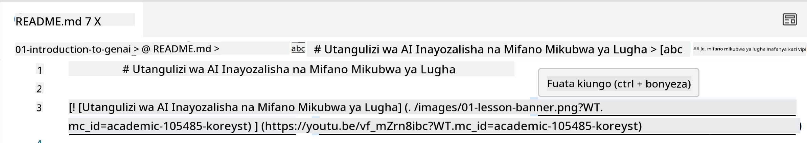
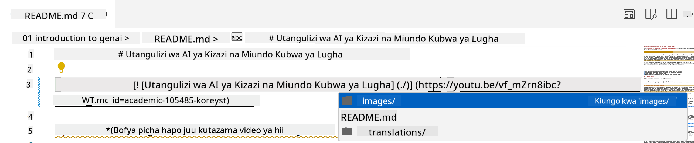
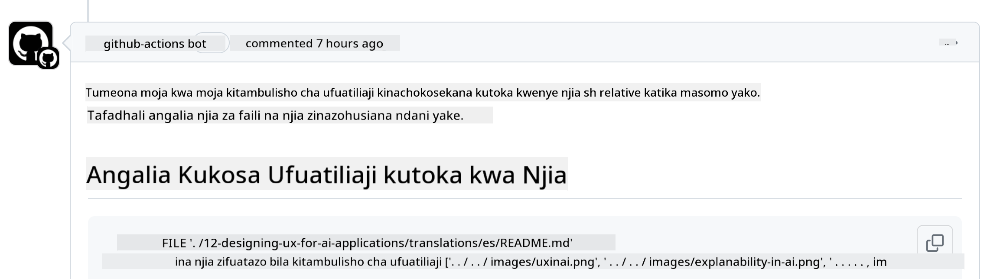
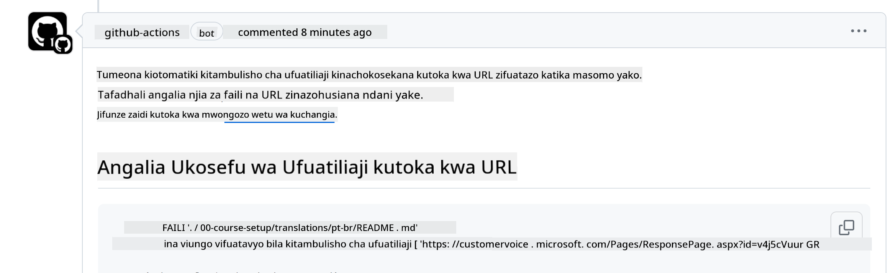
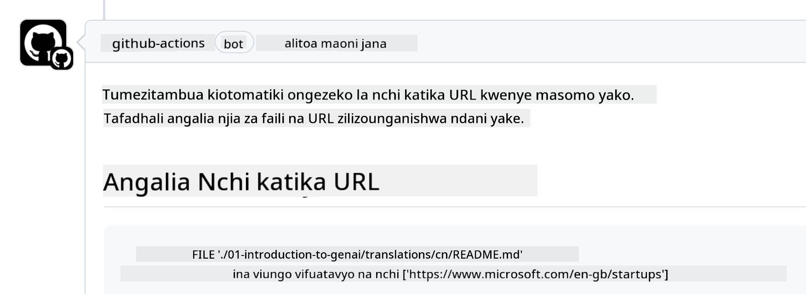

<!--
CO_OP_TRANSLATOR_METADATA:
{
  "original_hash": "57c41f2af71001a2cff9d8eb797cb843",
  "translation_date": "2025-05-19T11:22:36+00:00",
  "source_file": "CONTRIBUTING.md",
  "language_code": "sw"
}
-->
# Kuchangia

Mradi huu unakaribisha michango na mapendekezo. Michango mingi inakuhitaji ukubali Mkataba wa Leseni ya Mchangiaji (CLA) ukitangaza kwamba una haki, na kweli unatoa haki kwetu kutumia mchango wako. Kwa maelezo zaidi, tembelea <https://cla.microsoft.com>.

> Muhimu: unapotafsiri maandishi katika repo hii, tafadhali hakikisha hutumii tafsiri ya mashine. Tutathibitisha tafsiri kupitia jamii, hivyo tafadhali jitolee tu kwa tafsiri katika lugha unazozifahamu vizuri.

Unapowasilisha ombi la kuvuta (pull request), CLA-bot itajua moja kwa moja kama unahitaji kutoa CLA na kuipamba PR ipasavyo (mfano, lebo, maoni). Fuata tu maelekezo yaliyotolewa na bot. Utahitaji kufanya hivi mara moja tu kwenye repos zote zinazotumia CLA yetu.

## Kanuni za Maadili

Mradi huu umechukua [Kanuni za Maadili za Microsoft Open Source](https://opensource.microsoft.com/codeofconduct/?WT.mc_id=academic-105485-koreyst). Kwa maelezo zaidi soma [Maswali Yanayoulizwa Mara kwa Mara kuhusu Kanuni za Maadili](https://opensource.microsoft.com/codeofconduct/faq/?WT.mc_id=academic-105485-koreyst) au wasiliana na [opencode@microsoft.com](mailto:opencode@microsoft.com) kwa maswali au maoni yoyote ya ziada.

## Swali au Tatizo?

Tafadhali usifungue masuala ya GitHub kwa maswali ya msaada wa jumla kwani orodha ya GitHub inapaswa kutumiwa kwa maombi ya vipengele na ripoti za hitilafu. Kwa njia hii tunaweza kufuatilia kwa urahisi masuala au hitilafu halisi kutoka kwa msimbo na kuweka majadiliano ya jumla tofauti na msimbo halisi.

## Makosa ya Tahajia, Masuala, Hitilafu na Michango

Wakati wowote unapowasilisha mabadiliko yoyote kwenye hazina ya Generative AI for Beginners, tafadhali fuata mapendekezo haya.

* Kila mara tengeneza nakala ya hazina kwenye akaunti yako mwenyewe kabla ya kufanya marekebisho yako
* Usichanganye mabadiliko mengi kwenye ombi moja la kuvuta. Kwa mfano, wasilisha marekebisho yoyote ya hitilafu na masasisho ya nyaraka kwa kutumia PR tofauti
* Ikiwa ombi lako la kuvuta linaonyesha migogoro ya kuunganisha, hakikisha kusasisha main yako ya ndani kuwa kioo cha kile kilicho kwenye hazina kuu kabla ya kufanya marekebisho yako
* Ikiwa unawasilisha tafsiri, tafadhali tengeneza PR moja kwa faili zote zilizotafsiriwa kwani hatukubali tafsiri za sehemu kwa maudhui
* Ikiwa unawasilisha marekebisho ya tahajia au nyaraka, unaweza kuchanganya marekebisho kwenye PR moja pale inapofaa

## Mwongozo wa Jumla wa Kuandika

- Hakikisha kwamba URL zako zote zimefungwa kwenye mabano ya mraba yakifuatiwa na mabano yenye mviringo bila nafasi za ziada kuzunguka au ndani yao ``.
- Hakikisha kwamba kiungo chochote cha jamaa (yaani, viungo kwa faili nyingine na folda katika hazina) kinaanza na `./` kinachorejelea faili au folda iliyoko kwenye saraka ya kazi ya sasa au `../` kinachorejelea faili au folda iliyoko kwenye saraka ya kazi ya mzazi.
- Hakikisha kwamba kiungo chochote cha jamaa (yaani, viungo kwa faili nyingine na folda katika hazina) kina kitambulisho cha ufuatiliaji (yaani, `?` au `&` kisha `wt.mc_id=` au `WT.mc_id=`) mwishoni mwake.
- Hakikisha kwamba URL yoyote kutoka kwenye vikoa vifuatavyo _github.com, microsoft.com, visualstudio.com, aka.ms, na azure.com_ ina kitambulisho cha ufuatiliaji (yaani, `?` au `&` kisha `wt.mc_id=` au `WT.mc_id=`) mwishoni mwake.
- Hakikisha kwamba viungo vyako havina eneo maalum la nchi ndani yake (yaani, `/en-us/` au `/en/`).
- Hakikisha kwamba picha zote zimehifadhiwa kwenye folda ya `./images`.
- Hakikisha kwamba picha zina majina yanayoelezea kwa kutumia herufi za Kiingereza, nambari, na mistari katika jina la picha yako.

## Utaratibu wa Kazi wa GitHub

Unapowasilisha ombi la kuvuta, utaratibu wa kazi nne tofauti utawashwa ili kuthibitisha sheria zilizopita.
Fuata tu maelekezo yaliyoorodheshwa hapa ili kupitisha ukaguzi wa utaratibu wa kazi.

- [Angalia Njia za Jamaa Zilizovunjika](../..)
- [Angalia Njia Zina Ufuatiliaji](../..)
- [Angalia URL Zina Ufuatiliaji](../..)
- [Angalia URL Hazina Eneo](../..)

### Angalia Njia za Jamaa Zilizovunjika

Utaratibu huu wa kazi unahakikisha kwamba njia yoyote ya jamaa kwenye faili zako inafanya kazi.
Hazina hii imepelekwa kwenye kurasa za GitHub hivyo unahitaji kuwa makini sana unapoandika viungo vinavyounganisha kila kitu pamoja ili usimwelekeze mtu mahali pabaya.

Ili kuhakikisha kwamba viungo vyako vinafanya kazi ipasavyo tumia tu VS code kuangalia hilo.

Kwa mfano, unapoweka kipanya juu ya kiungo chochote kwenye faili zako utachochewa kufuata kiungo kwa kubonyeza **ctrl + click**

Ukibofya kiungo na hakifanyi kazi kwa ndani basi, hakika kitawasha utaratibu wa kazi na hakitafanya kazi kwenye GitHub.

Ili kurekebisha tatizo hili, jaribu kuandika kiungo kwa msaada wa VS code.

Unapoandika `./` au `../` VS code itakuchochea kuchagua kutoka kwenye chaguo zinazopatikana kulingana na ulichokiandika.

Fuata njia kwa kubofya faili au folda inayotakiwa na utahakikisha kwamba njia yako haijavunjika.

Mara tu unapoongeza njia sahihi ya jamaa, hifadhi, na sukuma mabadiliko yako utaratibu wa kazi utawashwa tena ili kuthibitisha mabadiliko yako.
Ukifaulu ukaguzi basi uko sawa kuendelea.

### Angalia Njia Zina Ufuatiliaji

Utaratibu huu wa kazi unahakikisha kwamba njia yoyote ya jamaa ina ufuatiliaji ndani yake.
Hazina hii imepelekwa kwenye kurasa za GitHub hivyo tunahitaji kufuatilia harakati kati ya faili na folda tofauti.

Ili kuhakikisha njia zako za jamaa zina ufuatiliaji ndani yake angalia tu maandishi yafuatayo `?wt.mc_id=` mwishoni mwa njia.
Ikiwa imeongezwa kwenye njia zako za jamaa basi utapita ukaguzi huu.

Kama sivyo, unaweza kupata hitilafu ifuatayo.

Ili kurekebisha tatizo hili, jaribu kufungua njia ya faili ambayo utaratibu wa kazi umeangazia na kuongeza kitambulisho cha ufuatiliaji mwishoni mwa njia za jamaa.

Mara tu unapoongeza kitambulisho cha ufuatiliaji, hifadhi, na sukuma mabadiliko yako utaratibu wa kazi utawashwa tena ili kuthibitisha mabadiliko yako.
Ukifaulu ukaguzi basi uko sawa kuendelea.

### Angalia URL Zina Ufuatiliaji

Utaratibu huu wa kazi unahakikisha kwamba URL yoyote ya wavuti ina ufuatiliaji ndani yake.
Hazina hii inapatikana kwa kila mtu hivyo unahitaji kuhakikisha kufuatilia upatikanaji ili kujua trafiki inatoka wapi.

Ili kuhakikisha URL zako zina ufuatiliaji ndani yake angalia tu maandishi yafuatayo `?wt.mc_id=` mwishoni mwa URL.
Ikiwa imeongezwa kwenye URL zako basi utapita ukaguzi huu.

Kama sivyo, unaweza kupata hitilafu ifuatayo.

Ili kurekebisha tatizo hili, jaribu kufungua njia ya faili ambayo utaratibu wa kazi umeangazia na kuongeza kitambulisho cha ufuatiliaji mwishoni mwa URL.

Mara tu unapoongeza kitambulisho cha ufuatiliaji, hifadhi, na sukuma mabadiliko yako utaratibu wa kazi utawashwa tena ili kuthibitisha mabadiliko yako.
Ukifaulu ukaguzi basi uko sawa kuendelea.

### Angalia URL Hazina Eneo

Utaratibu huu wa kazi unahakikisha kwamba URL yoyote ya wavuti haina eneo maalum la nchi ndani yake.
Hazina hii inapatikana kwa kila mtu kote ulimwenguni hivyo unahitaji kuhakikisha kutokujumuisha eneo la nchi yako kwenye URL.

Ili kuhakikisha URL zako hazina eneo la nchi ndani yake angalia tu maandishi yafuatayo `/en-us/` au `/en/` au eneo lolote la lugha mahali popote kwenye URL.
Ikiwa haipo kwenye URL zako basi utapita ukaguzi huu.

Kama sivyo, unaweza kupata hitilafu ifuatayo.

Ili kurekebisha tatizo hili, jaribu kufungua njia ya faili ambayo utaratibu wa kazi umeangazia na kuondoa eneo la nchi kutoka kwenye URL.

Mara tu unapoondoa eneo la nchi, hifadhi, na sukuma mabadiliko yako utaratibu wa kazi utawashwa tena ili kuthibitisha mabadiliko yako.
Ukifaulu ukaguzi basi uko sawa kuendelea.

Hongera! Tutakujibu haraka iwezekanavyo na maoni kuhusu mchango wako.

**Kanusho**: 
Hati hii imetafsiriwa kwa kutumia huduma ya tafsiri ya AI [Co-op Translator](https://github.com/Azure/co-op-translator). Ingawa tunajitahidi kwa usahihi, tafadhali fahamu kuwa tafsiri za kiotomatiki zinaweza kuwa na makosa au kutokuwa sahihi. Hati asilia katika lugha yake ya asili inapaswa kuzingatiwa kama chanzo chenye mamlaka. Kwa taarifa muhimu, tafsiri ya kitaalamu ya kibinadamu inapendekezwa. Hatutawajibika kwa kutoelewana au kutafsiri vibaya kunakotokana na matumizi ya tafsiri hii.