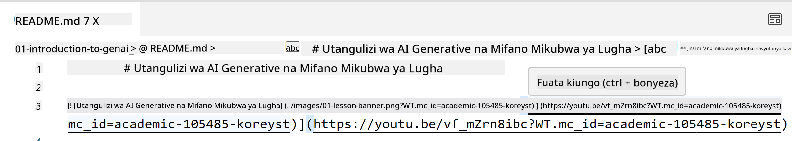
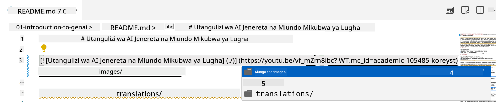
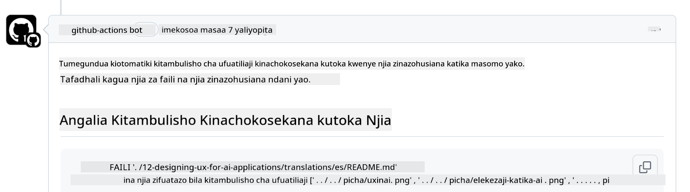
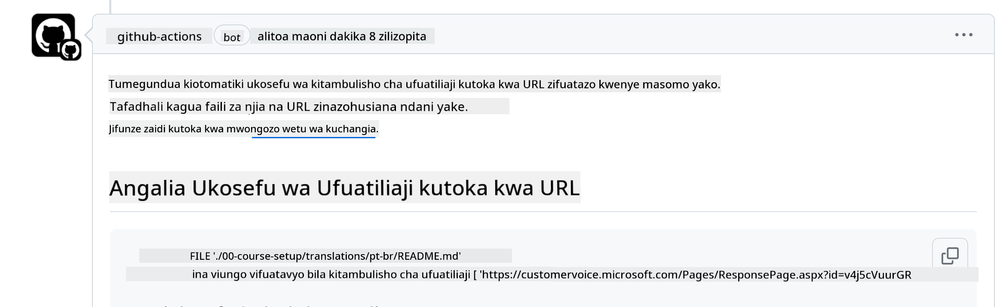
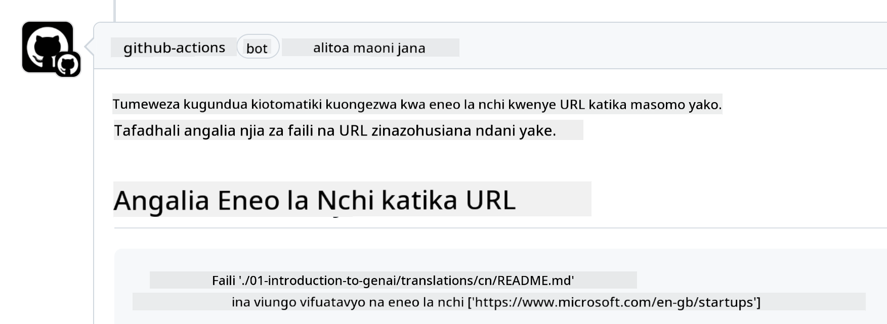

<!--
CO_OP_TRANSLATOR_METADATA:
{
  "original_hash": "57c41f2af71001a2cff9d8eb797cb843",
  "translation_date": "2025-06-25T07:17:02+00:00",
  "source_file": "CONTRIBUTING.md",
  "language_code": "sw"
}
-->
# Kuchangia

Mradi huu unakaribisha michango na mapendekezo. Michango mingi inahitaji wewe
kukubaliana na Makubaliano ya Leseni ya Mchangiaji (CLA) yanayosema kwamba una haki ya,
na kweli unafanya, kutupatia haki za kutumia mchango wako. Kwa maelezo zaidi, tembelea
<https://cla.microsoft.com>.

> Muhimu: unapofasiri maandishi katika repo hii, tafadhali hakikisha kuwa hutumii tafsiri ya mashine. Tutathibitisha tafsiri kupitia jamii, hivyo tafadhali jitoe tu kwa tafsiri katika lugha unazozifahamu vizuri.

Unapowasilisha ombi la kuvuta, CLA-bot itabaini kiotomatiki ikiwa unahitaji
kutoa CLA na kupamba PR ipasavyo (mfano, lebo, maoni). Fuata tu
maelekezo yaliyotolewa na bot. Utahitaji kufanya hivi mara moja tu kwenye hazina zote zinazotumia CLA yetu.

## Kanuni za Maadili

Mradi huu umechukua [Kanuni za Maadili za Chanzo Huria za Microsoft](https://opensource.microsoft.com/codeofconduct/?WT.mc_id=academic-105485-koreyst).
Kwa maelezo zaidi soma [Maswali Yanayoulizwa Mara kwa Mara kuhusu Kanuni za Maadili](https://opensource.microsoft.com/codeofconduct/faq/?WT.mc_id=academic-105485-koreyst) au wasiliana na [opencode@microsoft.com](mailto:opencode@microsoft.com) kwa maswali au maoni yoyote ya ziada.

## Swali au Tatizo?

Tafadhali usifungue masuala ya GitHub kwa maswali ya msaada wa jumla kwani orodha ya GitHub inapaswa kutumika kwa maombi ya vipengele na ripoti za hitilafu. Kwa njia hii tunaweza kufuatilia masuala halisi au hitilafu kutoka kwa msimbo na kuweka majadiliano ya jumla tofauti na msimbo halisi.

## Makosa ya Tahajia, Masuala, Hitilafu na Michango

Wakati wowote unapowasilisha mabadiliko yoyote kwenye hazina ya Generative AI for Beginners, tafadhali fuata mapendekezo haya.

* Daima tenga hazina kwenye akaunti yako mwenyewe kabla ya kufanya marekebisho yako
* Usichanganye mabadiliko mengi kwenye ombi moja la kuvuta. Kwa mfano, wasilisha marekebisho yoyote ya hitilafu na masasisho ya nyaraka ukitumia PR tofauti
* Ikiwa ombi lako la kuvuta linaonyesha migogoro ya kuunganisha, hakikisha kusasisha main yako ya ndani ili kuwa kioo cha kile kilicho katika hazina kuu kabla ya kufanya marekebisho yako
* Ikiwa unawasilisha tafsiri, tafadhali tengeneza PR moja kwa faili zote zilizotafsiriwa kwani hatukubali tafsiri za sehemu kwa maudhui
* Ikiwa unawasilisha marekebisho ya tahajia au nyaraka, unaweza kuchanganya marekebisho kwenye PR moja inapofaa

## Mwongozo wa Jumla kwa Uandishi

- Hakikisha kuwa URL zako zote zimefungwa kwenye mabano ya mraba ikifuatiwa na mabano bila nafasi za ziada kuzunguka au ndani yao ``.
- Hakikisha kwamba kiungo chochote cha jamaa (yaani viungo vya faili na folda zingine kwenye hazina) kinaanza na `./` ikirejelea faili au folda iliyoko kwenye saraka ya kazi ya sasa au `../` ikirejelea faili au folda iliyoko kwenye saraka ya kazi ya mzazi.
- Hakikisha kwamba kiungo chochote cha jamaa (yaani viungo vya faili na folda zingine kwenye hazina) kina kitambulisho cha ufuatiliaji (yaani `?` au `&` kisha `wt.mc_id=` au `WT.mc_id=`) mwishoni mwake.
- Hakikisha kwamba URL yoyote kutoka kwa vikoa vifuatavyo _github.com, microsoft.com, visualstudio.com, aka.ms, na azure.com_ ina kitambulisho cha ufuatiliaji (yaani `?` au `&` kisha `wt.mc_id=` au `WT.mc_id=`) mwishoni mwake.
- Hakikisha kwamba viungo vyako havina eneo maalum la nchi ndani yao (yaani `/en-us/` au `/en/`).
- Hakikisha kwamba picha zote zimehifadhiwa kwenye folda ya `./images`.
- Hakikisha kwamba picha zina majina ya maelezo kwa kutumia herufi za Kiingereza, nambari, na dashes kwenye jina la picha yako.

## Mtiririko wa Kazi wa GitHub

Unapowasilisha ombi la kuvuta, mtiririko wa kazi nne tofauti utachochewa kuthibitisha sheria za awali.
Fuata tu maelekezo yaliyotajwa hapa ili kupitisha ukaguzi wa mtiririko wa kazi.

- [Angalia Njia za Jamaa Zilizovunjika](../..)
- [Angalia Njia Zina Ufuatiliaji](../..)
- [Angalia URL Zina Ufuatiliaji](../..)
- [Angalia URL Hazina Eneo](../..)

### Angalia Njia za Jamaa Zilizovunjika

Mtiririko huu wa kazi unahakikisha kwamba njia yoyote ya jamaa katika faili zako inafanya kazi.
Hazina hii imepelekwa kwenye kurasa za GitHub hivyo unahitaji kuwa mwangalifu sana unapochapa viungo vinavyounganisha kila kitu pamoja ili usimwelekeze mtu yeyote mahali pabaya.

Ili kuhakikisha kwamba viungo vyako vinafanya kazi ipasavyo tumia tu VS code kuangalia hilo.

Kwa mfano, unapoweka kipanya juu ya kiungo chochote kwenye faili zako utachochewa kufuata kiungo kwa kubofya **ctrl + click**

Ikiwa utabofya kiungo na hakifanyi kazi ndani ya nchi basi, hakika kitachochea mtiririko wa kazi na hakitafanya kazi kwenye GitHub.

Ili kurekebisha tatizo hili, jaribu kuchapa kiungo kwa msaada wa msimbo wa VS.

Unapochapa `./` au `../` msimbo wa VS utakuchochea kuchagua kutoka kwa chaguzi zinazopatikana kulingana na kile ulichotapa.

Fuata njia kwa kubofya faili au folda unayotaka na utahakikishiwa kuwa njia yako haijavunjika.

Mara tu unapoongeza njia sahihi ya jamaa, hifadhi, na sukuma mabadiliko yako mtiririko wa kazi utachochewa tena kuthibitisha mabadiliko yako.
Ikiwa utapita ukaguzi basi uko tayari kwenda.

### Angalia Njia Zina Ufuatiliaji

Mtiririko huu wa kazi unahakikisha kwamba njia yoyote ya jamaa ina ufuatiliaji ndani yake.
Hazina hii imepelekwa kwenye kurasa za GitHub hivyo tunahitaji kufuatilia harakati kati ya faili na folda tofauti.

Ili kuhakikisha njia zako za jamaa zina ufuatiliaji ndani yao angalia tu maandishi yafuatayo `?wt.mc_id=` mwishoni mwa njia.
Ikiwa imeongezwa kwenye njia zako za jamaa basi utapita ukaguzi huu.

Ikiwa sivyo, unaweza kupata hitilafu ifuatayo.

Ili kurekebisha tatizo hili, jaribu kufungua njia ya faili ambayo mtiririko wa kazi umeangazia na kuongeza kitambulisho cha ufuatiliaji mwishoni mwa njia za jamaa.

Mara tu unapoongeza kitambulisho cha ufuatiliaji, hifadhi, na sukuma mabadiliko yako mtiririko wa kazi utachochewa tena kuthibitisha mabadiliko yako.
Ikiwa utapita ukaguzi basi uko tayari kwenda.

### Angalia URL Zina Ufuatiliaji

Mtiririko huu wa kazi unahakikisha kwamba URL yoyote ya wavuti ina ufuatiliaji ndani yake.
Hazina hii inapatikana kwa kila mtu hivyo unahitaji kuhakikisha kufuatilia upatikanaji ili kujua trafiki inatoka wapi.

Ili kuhakikisha URL zako zina ufuatiliaji ndani yao angalia tu maandishi yafuatayo `?wt.mc_id=` mwishoni mwa URL.
Ikiwa imeongezwa kwenye URL zako basi utapita ukaguzi huu.

Ikiwa sivyo, unaweza kupata hitilafu ifuatayo.

Ili kurekebisha tatizo hili, jaribu kufungua njia ya faili ambayo mtiririko wa kazi umeangazia na kuongeza kitambulisho cha ufuatiliaji mwishoni mwa URL.

Mara tu unapoongeza kitambulisho cha ufuatiliaji, hifadhi, na sukuma mabadiliko yako mtiririko wa kazi utachochewa tena kuthibitisha mabadiliko yako.
Ikiwa utapita ukaguzi basi uko tayari kwenda.

### Angalia URL Hazina Eneo

Mtiririko huu wa kazi unahakikisha kwamba URL yoyote ya wavuti haina eneo maalum la nchi ndani yake.
Hazina hii inapatikana kwa kila mtu kote ulimwenguni hivyo unahitaji kuhakikisha kuwa haujumuishi eneo la nchi yako kwenye URL.

Ili kuhakikisha URL zako hazina eneo la nchi ndani yao angalia tu maandishi yafuatayo `/en-us/` au `/en/` au eneo lingine lolote la lugha mahali popote kwenye URL.
Ikiwa haipo kwenye URL zako basi utapita ukaguzi huu.

Ikiwa sivyo, unaweza kupata hitilafu ifuatayo.

Ili kurekebisha tatizo hili, jaribu kufungua njia ya faili ambayo mtiririko wa kazi umeangazia na kuondoa eneo la nchi kutoka kwenye URL.

Mara tu unapoongeza eneo la nchi, hifadhi, na sukuma mabadiliko yako mtiririko wa kazi utachochewa tena kuthibitisha mabadiliko yako.
Ikiwa utapita ukaguzi basi uko tayari kwenda.

Hongera! Tutakujibu haraka iwezekanavyo na maoni kuhusu mchango wako.

**Kanusho**: 
Hati hii imetafsiriwa kwa kutumia huduma ya tafsiri ya AI [Co-op Translator](https://github.com/Azure/co-op-translator). Ingawa tunajitahidi kwa usahihi, tafadhali fahamu kwamba tafsiri za kiotomatiki zinaweza kuwa na makosa au kutokamilika. Hati ya asili katika lugha yake ya asili inapaswa kuzingatiwa kama chanzo cha mamlaka. Kwa taarifa muhimu, tafsiri ya kitaalamu ya kibinadamu inapendekezwa. Hatutawajibika kwa kutoelewana au tafsiri zisizo sahihi zinazotokana na matumizi ya tafsiri hii.